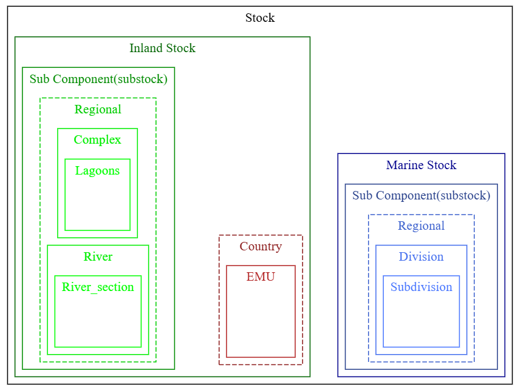
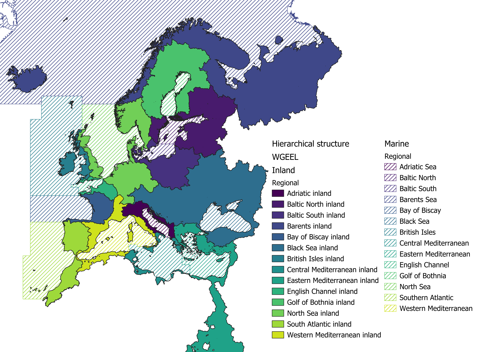
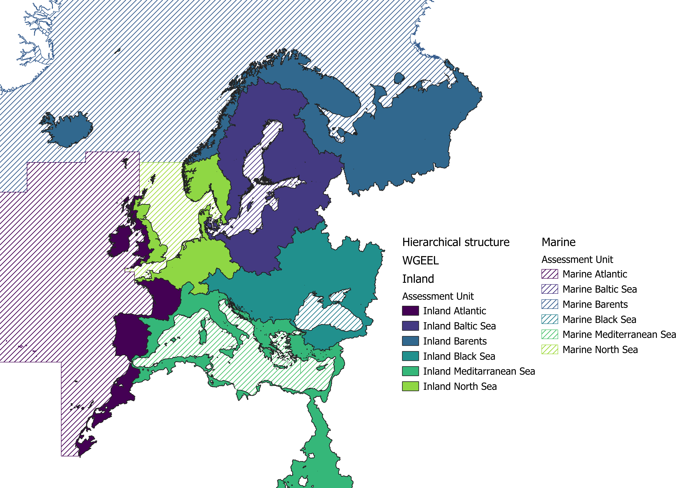
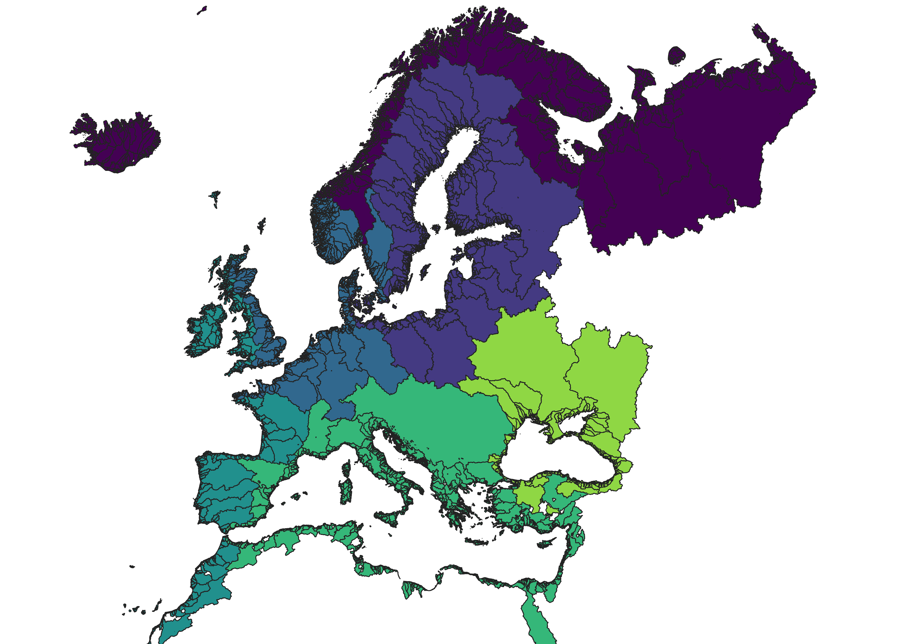

```{r setup, include=FALSE, echo = FALSE}
knitr::opts_chunk$set(echo = FALSE)
library(flextable)
library(ggplot2)
library(dplyr)
library(gt)
library(officer)

if (!dir.exists("images"))
  dir.create("images")

library(flextable)
library(gt)
library(knitr)
knit_print.flextable <- function (x, ...) {
    is_bookdown <- flextable:::is_in_bookdown()
    is_quarto <- flextable:::is_in_quarto()
    x <- flextable:::knitr_update_properties(x, bookdown = is_bookdown, quarto = is_quarto)
    if (is.null(knitr::pandoc_to())) {
        str <- flextable:::to_html(x, type = "table")
        str <- knitr:::asis_output(str)
    }
    else if (!is.null(getOption("xaringan.page_number.offset"))) {
        str <- knit_to_html:::knit_to_html(x, bookdown = FALSE, quarto = FALSE)
        str <- knitr:::asis_output(str, meta = html_dependencies_list(x))
    }
    else if (knitr:::is_html_output(excludes = "gfm")) {
        str <- knit_to_html:::knit_to_html(x, bookdown = is_bookdown, quarto = is_quarto)
        str <- knit_to_html:::raw_html(str, meta = html_dependencies_list(x))
    }
    else if (knitr:::is_latex_output()) {
        str <- flextable:::knit_to_latex(x, bookdown = is_bookdown, quarto = is_quarto)
        str <- flextable:::raw_latex(x = str, meta = unname(list_latex_dep(float = TRUE, 
            wrapfig = TRUE)))
    }
    else if (grepl("docx", knitr::opts_knit$get("rmarkdown.pandoc.to"))) {
        if (rmarkdown::pandoc_version() < numeric_version("2")) {
            stop("pandoc version >= 2 required for printing flextable in docx")
        }
        str <- flextable:::knit_to_wml(x, bookdown = is_bookdown, quarto = is_quarto)
        str <- gsub("</w:tbl>","</w:tbl><w:p></w:p>",str, fixed =  TRUE)
        str <- gsub('<w:pPr><w:pStyle w:val="Normal"/><w:jc w:val="left"/><w:pBdr><w:bottom w:val="none" w:sz="0" w:space="0" w:color="B7D1C3"/><w:top w:val="none" w:sz="0" w:space="0" w:color="B7D1C3"/><w:left w:val="none" w:sz="0" w:space="0" w:color="B7D1C3"/><w:right w:val="none" w:sz="0" w:space="0" w:color="B7D1C3"/></w:pBdr><w:spacing w:after="40" w:before="40" w:line="240"/><w:ind w:left="40" w:right="40" w:firstLine="0" w:firstLineChars="0"/></w:pPr>',
                    '<w:pPr><w:pStyle w:val="Table-Heading"/><w:jc w:val="left"/><w:spacing w:after="40" w:before="40" w:line="240"/><w:ind w:left="40" w:right="40" w:firstLine="0" w:firstLineChars="0"/></w:pPr>', str, fixed = TRUE)
        str <- gsub('<w:pPr><w:pStyle w:val="Normal"/><w:jc w:val="left"/><w:pBdr><w:bottom w:val="none" w:sz="0" w:space="0" w:color="000000"/><w:top w:val="none" w:sz="0" w:space="0" w:color="000000"/><w:left w:val="none" w:sz="0" w:space="0" w:color="000000"/><w:right w:val="none" w:sz="0" w:space="0" w:color="000000"/></w:pBdr><w:spacing w:after="40" w:before="40" w:line="240"/><w:ind w:left="40" w:right="40" w:firstLine="0" w:firstLineChars="0"/></w:pPr>',
                    '<w:pPr><w:pStyle w:val="Table-Text"/><w:jc w:val="left"/><w:spacing w:after="40" w:before="40" w:line="240"/><w:ind w:left="40" w:right="40" w:firstLine="0" w:firstLineChars="0"/></w:pPr>', str, fixed = TRUE)
        str <- knitr:::asis_output(str)
    }
    else if (grepl("pptx", knitr::opts_knit$get("rmarkdown.pandoc.to"))) {
        if (rmarkdown::pandoc_version() < numeric_version("2.4")) {
            stop("pandoc version >= 2.4 required for printing flextable in pptx")
        }
        str <- flextable:::knit_to_pml(x)
        str <- knitr:::asis_output(str)
    }
    else {
        plot_counter <- getFromNamespace("plot_counter", "knitr")
        in_base_dir <- getFromNamespace("in_base_dir", "knitr")
        tmp <- fig_path("png", number = plot_counter())
        in_base_dir({
            dir.create(dirname(tmp), showWarnings = FALSE, recursive = TRUE)
            save_as_image(x, path = tmp, expand = 0)
        })
        str <- include_graphics(tmp)
    }
    str
}

registerS3method(
  "knit_print", 'flextable', knit_print.flextable, 
  envir = asNamespace("flextable") 
  # important to overwrite {flextable}s knit_print
)


knit_print.gt_tbl <- function (x, ..., inline = FALSE) {
    if (gt:::knitr_is_rtf_output()) {
        x <- gt:::as_rtf(x)
    }
    else if (knitr::is_latex_output()) {
        x <- gt:::as_latex(x)
    }
    else if (gt:::knitr_is_word_output()) {
       str <- gsub("</w:tbl>","</w:tbl><w:p></w:p>", as_word(x), fixed = TRUE)
        x <- knitr::asis_output(paste("\n\n``````{=openxml}", str, 
            "``````\n\n", sep = "\n"))
    }
    else {
        x <- htmltools:::as.tags(x, ...)
    }
    knitr::knit_print(x, ..., inline = FALSE)
}


registerS3method(
  "knit_print", 'gt_tbl', knit_print.gt_tbl, 
  envir = asNamespace("gt") 
  # important to overwrite {gt}s knit_print
)


flextable2ICES <- function(x){
  x |>
    font(fontname = "Calibri", part = "all") |>
    fontsize(size = 8.5, part = "all") |>
    bold(part = "header") |>
    align(align = "left", part = "all") |>
    flextable::border(part = "all", 
                      border.top = fp_border(color = "black", width = 0.5),
                      border.bottom = fp_border(color = "black", width = 0.5)) |>
    bg(bg = "#B7D1C3", part = "header") |>
    style(pr_p=fp_par(padding = 2),
          part = "all") |>
    style(pr_p=fp_par(padding = 2,
                      border = fp_border(width = 0, color = "#B7D1C3", style = "none")),
          part = "header") |>
    fit_to_width(16/2.54)
}


```

```{r load_utilities, eval=FALSE, echo=FALSE,include=FALSE}
#### Loading WGEEL data
source("../../R/utilities/load_library.R")

#-----------------
# other libraries
#-----------------
load_package("hues")
load_package("readxl")
load_package("stringr")
load_package("reshape2")
load_package("tidyr") # unite cols in maps
load_package("rlang")
load_package("flextable")
load_package("officer")

load_package("sp")
#load_package("pool")
#load_package("DBI")
load_package("RPostgreSQL")
load_package("dplyr")
load_package("RColorBrewer")
load_package("sqldf")
load_package("scales")
load_package('stringr') # text handling
#load_package("XLConnect") # for excel
load_package("ggplot2") # for excel
load_package("gridExtra")
load_package("colorspace")
load_package("ggrepel")
load_package("patchwork")

load_package("viridis")
load_package("svglite")
load_package("leaflet.minicharts")
load_package("glue")
load_package("kableExtra")
load_package("yaml")
load_package("grid")
#load_package("ggmagnify")
#library("ggmagnify")
#install.packages("remotes")
#remotes::install_github("hughjonesd/ggmagnify")


# load functions ------------------------------------------------------------------------------------
# retrieve reference tables needed
# the shiny is launched from shiny_data_integration/shiny thus we need the ../
if (is.null(options()$sqldf.RPostgreSQL.user)) {
  wd <- getwd()
  setwd("../../R/shiny_data_visualisation/shiny_dv")
  source("database_connection.R")
  source("database_reference.R")
  source("database_data.R")
  source("database_precodata.R")
  source("preco_diagram.R")
  source("graphs.R")
  source("maps.R")
  source("filter_and_group_functions.R")
  source("predict_missing.R")
  setwd(wd)
}

# loading datasets 

# this file is added to the ignore list, so ask for it in your own git before launching the app
#habitat_ref <- extract_ref("Habitat type")
#lfs_code_base <- extract_ref("Life stage")
##lfs_code_base <- lfs_code_base[!lfs_code_base$lfs_code %in% c("OG","QG"),]
#country_ref <- extract_ref("Country")
#country_ref <- country_ref[order(country_ref$cou_order), ]
#country_ref$cou_code <- factor(country_ref$cou_code, levels = country_ref$cou_code[order(country_ref$cou_order)], ordered = TRUE)

##have an order for the emu
#emu_ref <- extract_ref("EMU")
#emu_cou<-merge(emu_ref,country_ref,by.x="emu_cou_code",by.y="cou_code")
#emu_cou<-emu_cou[order(emu_cou$cou_order,emu_cou$emu_nameshort),]
#emu_cou<-data.frame(emu_cou,emu_order=1:nrow(emu_cou))
## Extract data from the database -------------------------------------------------------------------
# cedric 2020 : ATTENTION LOAD shiny_di version database_interaction version uses different names
#landings = extract_data("landings",quality=c(1,2,4),quality_check=TRUE)
#aquaculture = extract_data("aquaculture",quality=c(1,2,4),quality_check=TRUE)
#release = extract_data("release",quality=c(1,2,4),quality_check=TRUE)
# this file is added to the ignore list, so ask for it in your own git before launching the app
load("../../R/shiny_data_visualisation/shiny_dv/data/maps_for_shiny.Rdata") 
# now data are generated by the script load_data_from_the_database.R
load("../../R/shiny_data_visualisation/shiny_dv/data/ref_and_eel_data.Rdata")
## Download the colors by country

# coeffy increases ylim by about coeffy to let more space for subgraph
subplot <- function(grob, coeffy, minyear = 2009, xmin = 2000, xmax = Inf, ymin = 5000, ymax = Inf, ymaxbox = 5000) {
  sub <- grob +
    scale_x_continuous(limits = c(minyear, CY + 1), breaks = pretty_breaks()) +
    theme(
      legend.position = "none",
      rect = element_rect(fill = "transparent"),
      plot.background = element_rect(fill = "transparent", colour = NA)
    ) # ,
  # axis.title.y=element_blank(),
  # axis.text.y=element_blank(),
  # axis.ticks.y=element_blank())
  grob2 <- grob +
    annotate("rect", xmin = minyear + .5, xmax = CY + 0.5, ymin = 0, ymax = ymaxbox, fill = "transparent", col = "black") +
    scale_y_continuous(limits = c(0, pretty(layer_scales(grob)$y$range$range[2] * coeffy))) +
    annotation_custom(ggplotGrob(sub), xmin = xmin, xmax = xmax, ymin = ymin, ymax = ymax)
  return(grob2)
}

values <- c(
  RColorBrewer::brewer.pal(12, "Set3"),
  RColorBrewer::brewer.pal(12, "Paired"),
  RColorBrewer::brewer.pal(8, "Accent"),
  RColorBrewer::brewer.pal(8, "Dark2")
)
color_countries <- setNames(values, country_ref$cou_code)
library("hues")
swatch(colours()[1:10])
iwanthue(5, 0, 240, 0, 24, 0, 100, plot = TRUE) # shades
iwanthue(5, 0, 360, 0, 54, 67, 100, plot = TRUE) # pastel
iwanthue(5, 0, 360, 54, 180, 27, 67, plot = TRUE) # pimp
iwanthue(5, 0, 360, 36, 180, 13, 73, plot = TRUE) # intense
iwanthue(3, 0, 300, 60, 180, 73, 100, plot = TRUE) # fluoro
iwanthue(3, 220, 260, 12, 150, 0, 53, plot = TRUE) # blue ocean


#' fun.agg
#' aggregation of a table
#' @param X table to aggregate
#' @param conversion (1000 to convert kg to tons, 1e6 to convert
#' nb to millions)
#'
#' @return aggregated table
#' @export
#'
fun.agg <- function(X, conversion = 1000) {
  if (length(X) > 0) {
    round(sum(X) / conversion, ifelse(sum(X) > conversion, 1, 1))
  } else {
    sum(c(X, NA))
  }
}
```

# ToR h) Review RDBES/RDBFIS

Review RDBES/RDBFIS and i) identify the protocols used to collect landings data and ii) check if parameters/series recorded are consistent between RDBES/RDBFIS and the WGEEL Metric DB and harmonize them.

In order to facilitate an efficient and complete data collection it is of fundamental importance that databases (RDBES/RDBFIS & WGEEL METRIC database) follow FAIR principles. Therefore it is required to harmonize/implement respective structures across all platforms and develop/amend protocols to collect data. For this we will consider the current development of the diadromous database, for which a module to import series data has already been developed in 2026 by the ICES data center, and proposed for testing with a small dataset generated for all countries with series data. Next year this database will be completed by a stock module which will store the elements necessary to run the stock model. The commercial landings data are currently stored in the WGEEL database, but WGEEL analysed the steps necessary for the WGEEL to shift to using landings from the RDBES.

## The diadromous database

### Preparing the future datacall : EDMO and stations.

The locations of the sampling have to be recorded in the Station vocabulary. A station is a fixed location, where a sampling or data collecting instrument is deployed. Stations may be associated with a national or international project or with a monitoring program. Station metadata provide additional information about the location where samples or observations are collected. For WGEEL stations are most often corresponding to series code. Station can change over time if for instance another organisation takes over monitoring at that location. [Stations](https://www.ices.dk/data/tools/Pages/Station-dictionary.aspx) are maintained in ICES. As part of the stations attributes, we need to identify the organisations doing the monitoring and register them as "marine organisations".

**EDMO** **(European Directory of Marine Organisations) :**

[EDMO](http://European%20Directory%20of%20Marine%20Organisations%20(EDMO)%20-%20SeaDataNet) is a reference directory maintained within the SeaDataNet infrastructure that contains standardized information about marine-related organizations, including research institutes, data centers, monitoring agencies, governmental bodies, and private organizations involved in marine and oceanographic activities. This Marine network needs to be extended to organisations working inland to monitor Migratory Fishes.

To register EDMO once for all our stations, we have created an EDMO [folder](https://icesit.sharepoint.com/sites/ExpertGroup/wgeel/2026%20Meeting%20Documents/Forms/AllItems.aspx?id=%2Fsites%2FExpertGroup%2Fwgeel%2F2026%20Meeting%20Documents%2F06%2E%20Data%2FEDMO&viewid=1a38b478%2Da003%2D4070%2D8001%2De5c505734bd7%22) in the sharepoint with one file per country (Table @fig-tableedmo).

```{r}
#| label: fig-tableedmo
#| fig-cap: "Information required for EDMO data integration"
#| fig-height: 6.3
#| fig-width: 6.3
imgfile <- file.path("images", "Table_structure.png") 
knitr::include_graphics(imgfile)
```

This file contains two sheets :

- **National_edmo :**

The [EDMO](http://European%20Directory%20of%20Marine%20Organisations%20(EDMO)%20-%20SeaDataNet) will be needed to submit data through DATSU (ReportingOrganisation). This is the first table. WGEEL members were asked to check in [ICES directory of EDMO codes](https://vocab.ices.dk/?ref=1398) or in the [EDMO](http://European%20Directory%20of%20Marine%20Organisations%20(EDMO)%20-%20SeaDataNet) web site to see if the national data reporter or data collectors at stations had an EDMO. When missing, WGEEL country representative were asked to fill in all details to prepare the table for submission. The table prepared for MARIS (the structure handling the EDMO database) to fill in new EDMO codes is presented in Annex XX

- **Station_edmo :**

This corresponds to the series that are currently in our database. This code refers to the institute responsible for the governance of a station. It might be different from the national EDMO. The name, native name, Longitude and Latitude are those of the institute, not the station.

### Development of the diadromous DB

The Diadromous database is currently being developped in ICES. A first version of the database and API is planned for next year (scientific survey data). Currently the submission format for Diadromous survey data can be found here: <https://datsu.ices.dk/web/selRep.aspx?Dataset=172.>. This submission format will be used in the next data call for annexes 1 to 3 and 9. It was tested during the WGEEL. Feedback on issues on the format is here : [ices-tools-dev/DiadromousData](https://github.com/ices-tools-dev/DiadromousData/issues) [^1]

[^1]: If new issues arise and write access to the repository is needed, please contact accessions\@ices.dk.


## Commercial landings and their inclusion in the RDBES

Currently commercial landings are included in Annex 4 and stored in the WGEEL database. While this system includes a quality control procedure, it does not adhere to ICES standard, nor provide a tracking system for data upload and transmission. Among diadromous working groups, WGEEL will initiate the transition to a full use of the RDBES. The DIASPARA project has developed a habitat referential that follows the hierarchy of stock structure used by diadromous working groups, and extends the marine areas used by GFCM and ICES to neighboring continental waters.

The **RDBES (Regional Database and Estimation System)** is a database system (or "data model") developed and hosted by ICES. It involves a system of data submission and analysis which maintains appropriate levels of access (data levels) for users in different roles (e.g. national estimators, stock coordinators, and stock assessors). Translation of data between these levels is done using the TAF (transparent assessment framework), ensuring that methods for processing data are open and standardizable between users (Figure @fig-rdbes_workflow)..

```{r}
#| label: fig-rdbes_workflow
#| fig-cap: "RDBES infographic summarizing the data flow for ICES working groups"
#| fig-height: 6.3
#| fig-width: 6.3
 
imgfile <- file.path("images", "RDBES infographic.jpg") 
knitr::include_graphics(imgfile)
```


RDBES organizes fisheries sampling data into a set of 13 standardized "hierarchies" representing commercial fisheries sampling. The hierarchical model links observations from sampling programmes and fishing activities down to individual fish measurements and analyses, ensuring traceability of data and supporting statistically robust estimation procedures used in ICES stock assessments and fisheries advice. To accommodate sampling programmes with different structures, there is a selection of 13 different hierarchies of data tables (named H1 to H13). See the documentation at the [RDBES GitHub repository](https://github.com/ices-tools-dev/RDBES/) for more information.

National estimators have access to the most detailed level of data from RDBES (the "Detailed data" level). These are commercial catches, effort and sampling data in a disaggregated format which is downloaded in separate files. Data have detailed information on the location, gear and number of vessels of catch and effort. It is the task of each country's national estimator to download their respective data, and then raising the data to the stock leve by performing an aggregation-analysis (using a TAF template), and upload the aggregated data to the less detailed "National estimates" level. This data then becomes available for the Stock coordinator (using the catch estimation format CEF).

At the WGEEL 2026 workshop, the RDBES subgroup tested using the [icesRDBES R package](https://github.com/ices-tools-prod/icesRDBES) and the web-based RDBES data portal ([rdbes.ices.dk](https://rdbes.ices.dk)) for downloading data from the perspective of a national estimator. After being granted access, the process of downloading data was quite simple and resulted .csv files for various data, for example commercial landings. An example script for how to do this exists in the wgeel GitHub repository under the name "script-test-rdbes-se.R".

> cedric's comment. We need to merge the branch and leave this file in the "main" branch + provide a link to github file

Further, we also compared the data currently available in RDBES with the data available in WGEEL's database. This was done using an export from RDBES including all countries' commercial landings on european eel. 14 of the 28 countries having commercial landings data in the wgeel database did not have commercial landings in RDBES. These countries are Albania, Algeria, Croatia, **Czech Republic**, Greece, **Ireland**, Italy, Libya, Montenegro, **Morocco**, **Norway**, Slovenia, Tunisia, and Türkiye. Note that mediterranean landings are submittede RDBFIS, not RDBES. Countries without a mediterranean coastline are here printed in bold. Further, for the countries with data available in RDBES, many had differing total landings reported to RDBES and WGEEL, indicating that either of the databases may be incomplete for these countries (Figure @fig-wgeelrdbeslandings). These countries may want to inspect these differences and assess if any data are missing or incorrect.

```{r}
#| label: fig-wgeelrdbeslandings
#| fig-cap: "Total landed biomass (kg) of european eel (Anguilla anguilla), as reported to WGEEL and RDBES for all years and countries in which RDBES data is available. From the WGEEL database, only catches in marine, transitional or open marine waters are included (i.e. freshwater catches are excluded). Empty black bars indicate RDBES numbers, and blue bars indicate WGEEL numbers. The horisontal axis is log-shifted. Note that catches of eel in the mediterranean are not reported to RDBES but are reported to WGEEL, which explains some inconsistencies for some countries."
#| fig-width: 6.3
imgfile <- file.path("images", "plot-rdbes-vs-wgeel-landings.png") 
knitr::include_graphics(imgfile)
```

```{r}
#| label: test-RDBES-API
#| eval: false
#| result: "hide"


#install.packages('icesRDBES', repos = c('https://ices-tools-prod.r-universe.dev', 'https://cloud.r-project.org'))
#install.packages("RDBEScore", repos = c("https://ices-tools-prod.r-universe.dev", "https://cloud.r-project.org"))
library(icesRDBES)
# shift to sandbox mode
#use_sboxrdbes(flag = TRUE)
rdbes_api()
# back to production mode
use_sboxrdbes(FALSE)
rdbes_api() 
# The rdbes_download_data can be used to download detailed RDBES data from RDBES and CEF data from RDBES.
#&&&&&&&&&&&&&&&&&&&&&&&&&&&&&&&&&&&&&&&&&&&&&&&&&&
#dataType: “CS”, “CL”, “CE”, “SL”, “VD”, or “CEF”
#format: “SingleCsvFile” or “CsvFilePerTable”.
#hierarchies: “HCS”, “HCL”, “HCE”, “HSL”, “HVD”, "HNI", "HEN", or "HSN".
#data type filters: The specific filter object for the data type (e.g. csFilters).
#&&&&&&&&&&&&&&&&&&&&&&&&&&&&&&&&&&&&&&&&&&&&&&&&&&

type_filters[["CL"]]

my_filters <- list(
  dataType = "CL",
  format = "SingleCsvFile",
  hierarchies = list("HCL"),
  CLFilters = list(
    "clVesselFlagCountry" = list("FR"),
    "clYear" = as.list(c("2024", "2025")),
    "clArea" = list("27.8.a"),
    "clSpeciesCode" = list("126281")
  )
)

dest_dir = "data"


rdbes_download_data(
  payload =  my_filters,
  dest_dir = dest_dir,
  production = getOption("rdbes.production"))


downloaded_files <- list.files("data", pattern = ".zip",include.dirs = FALSE)
downloaded_paths <- paste0("data/", downloaded_files)
ll <- downloaded_paths |> purrr::map(\(x) unzip(zipfile = x, exdir = "data/extracts"))    
path <- sapply(ll, function(X) X[grepl(X, pattern = "csv")])
country_landings <- readr::read_csv(path)

```

## Recreational landings

Recreational fishing data will continue to be incorporated into the WGEEL database through Annex 5 of the standard data call. Eventually, the RDBES database (for ICES countries in the Atlantic) and the RDBFIS database (for the Mediterranean) are expected to incorporate this data, which will be integrated through the RDBES and RDBFIS data calls.

## Destination of current biometric sampling (Diadromous Survey).

The current data for series and metrics (Annex 1 to 3 and 9 of the 2026 data call) will be imported (bulk import) during the next year. For 2027, all annexes containing series and biometric data (Annex 1, 2, 3 and 9) data will be submitted in the Diadromous survey format. Series identified as commercial sampling will be excluded from the submission for both historical and 2026 data (see Annex 6.2). These data will be submitted in RDBES/RDBFIS starting from 2028.

Depending on the protocols used to collect biometric data, the resulting data are either fishery-dependent (for example, individuals measured on a fishing vessel or at the fish auction) or fishery-independent (for example, measurements taken during electrofishing or scientific surveys at sea). Work was carried out during the WGEEL to classify existing series into these two categories (Annex 1.2 and 1.3).Below are explanation about what process to follow for integrating this data based on its category.

### Series (fishery independent data)

With regard to data from fishery-independent protocols, for all countries (both ICES and non-ICES countries), these data must be integrated into the diadromous database via the DATSU process starting next year. A list has been created to identify the data series that will be integrated via the DATSU process (Annex 6.2)

### Commercial and recreational sampling (fishery dependent data)

Regarding biometric data collected through protocols related to commercial or recreational fisheries (fishery-dependent data, Annex 6.3), the integration will take several steps :

- Next year, biometric data will not be requested in the WGEEL data call.
- In the future, these data will be integrated through the RDBES procedure. To make this possible, for each data series, the data provider will have to identify the hierarchy to be used for integration into the RDBES database. The hierarchy depends on the protocol used to collect the data (for example: observers at sea on a selection of vessels who are required to collect data only for eels). It is strongly recommended that data provider read the documentation available on the [RDBES Git repository](https://github.com/ices-tools-dev/RDBES/blob/master/Documents/RDBES%20Documentation%20of%20the%20Data%20Model.docx) and take one of the training courses offered by ICES in 2026 (Table @tbl-RDBESsessions).

```{r}
#| label: tbl-RDBESsessions
#| echo: false
#| tbl-cap: Table of ICES workshop relevant to the RDBES

df <- data.frame(
  WK_WGs = c(
    "WKTSAT2",
    "WKTNET3",
    "WGRDBES-StockCoord Intersessional support day",
    "WGRDBES-StockCoord Intersessional support day",
    "WKRDBES-INTRO support day",
    "WGRDBES-EST",
    "Quality Checking CL & CE (not a WK/WG)",
    "WGRDBES-StockCoord Intersessional support day",
    "New: WGRDBES-StockCoord Intersessional support day",
    "WKNatEst",
    "WKRDBES-Flow one-day meeting",
    "WKTNET4",
    "WGRDBES-StockCoord Intersessional feedback meeting",
    "WKRDBES-INTROBYC",
    "WGRDBES-StockCoord",
    "WKRDBES-Flow half-day meeting",
    "WKRDBES-INTRO",
    "WGRDBES-EST",
    "WGRDBES-EST",
    "WKRDBES-Flow"
  ),
  Chairs = c(
    "Adriana Villamor\nColin Millar",
    "Maciej Adamowicz\nColin Millar",
    "Sofie Nimmegeers\nKirsten Birch Hakansson",
    "Sofie Nimmegeers\nKirsten Birch Hakansson",
    "Henrik Kjems-Nielsen",
    "Ana Claudia Fernandes\nRichard Meitern",
    "Karolina Molla Gazi",
    "Sofie Nimmegeers\nKirsten Birch Hakansson",
    "Sofie Nimmegeers\nKirsten Birch Hakansson",
    "Ana Ribeiro Santos\nJessica Craig",
    "David Currie\nAlessandro Orio",
    "Maciej Adamowicz\nColin Millar",
    "Sofie Nimmegeers\nKirsten Birch Hakansson",
    "TBC",
    "Sofie Nimmegeers\nKirsten Birch Hakansson",
    "David Currie\nAlessandro Orio",
    "Henrik Kjems-Nielsen",
    "Ana Claudia Fernandes\nRichard Meitern",
    "Ana Claudia Fernandes\nRichard Meitern",
    "David Currie\nAlessandro Orio"
  ),
  Dates = c(
    "19–22 January",
    "10–11 February",
    "27 February",
    "31 March, moved to 9 April",
    "2 March",
    "11 March",
    "12 March",
    "9 April (moved from 31 March)",
    "14 April",
    "1–5 June",
    "9 June",
    "15–16 June",
    "30 June",
    "TBC",
    "22–24 September",
    "X September",
    "29 September–1 October",
    "7–9 October",
    "12–16 October",
    "19–23 October"
  ),
  Location = c(
    "ICES, Hybrid",
    rep("Online", 17),
    "Lysekil, Sweden",
    "Hybrid"
  ),
  Goal = c(
    "Develop robust, standardized TAF stock assessment templates for SAM and SS3",
    "Create national estimation templates and provide TAF training",
    "Internally review progress in developing the stock coordination functions",
    "Brief stock coordinators on how to apply the exploration functions",
    "Provide support to data submitters for the RDBES data call",
    "Present RDBEScore functions",
    "Provide a tutorial on the Quality Report for CL and CE",
    "Brief stock coordinators on how to apply the exploration functions",
    "Brief national estimators and stock coordinators on the CEF format",
    "Collaborate on the reproduction of national estimations",
    "Introduce the developed tools, including R packages and TAF",
    "Create national estimation templates and provide TAF training",
    "Collect feedback on the developed functions",
    "Provide support to bycatch data submitters",
    "Develop scripts, functions, and formats for stock coordination",
    "Test the flow of data from the RDBES to stock coordination and assessment for the 9 selected stocks",
    "Introduce RDBES to new participants and provide time slots for advanced questions",
    "Check issues with RDBEScore functions",
    "Develop a generic ratio estimation function and the RDBESvisualise package",
    "Test the flow of data from RDBES to stock coordination and stock assessment"
  ),
  TargetGroup = c(
    "Stock assessors",
    "National estimators",
    "WG members",
    "Stock coordinators of the 9 selected stocks",
    "Data submitters",
    "National estimators",
    "Data submitters",
    "Stock coordinators of the 9 selected stocks",
    "Data submitters and stock coordinators of the 9 selected stocks",
    "National estimators",
    "National estimators; Stock coordinators of the 9 selected stocks",
    "National estimators",
    "Stock coordinators of the 9 selected stocks",
    "WGBYC data submitters; RDBES data submitters",
    "WG members",
    "Data submitters; National estimators; Stock coordinators of the 9 selected stocks",
    "Data submitters; National estimators",
    "National estimators",
    "National estimators",
    "National estimators; Stock coordinators of the 9 selected stocks"
  ),
  ICESPage = c(
    "https://www.ices.dk/community/groups/Pages/WKTSAT.aspx",
    "https://www.ices.dk/community/groups/Pages/WKTNET.aspx",
    "https://www.ices.dk/community/groups/Pages/WGRDBES-StockCoord.aspx",
    "https://www.ices.dk/community/groups/Pages/WGRDBES-StockCoord.aspx",
    "https://www.ices.dk/community/groups/Pages/WKRDBES-INTRO3.aspx",
    "https://www.ices.dk/community/groups/Pages/Members.aspx?Acronym=WGRDBES-EST",
    NA,
    "https://www.ices.dk/community/groups/Pages/WGRDBES-StockCoord.aspx",
    "https://www.ices.dk/community/groups/Pages/WGRDBES-StockCoord.aspx",
    "https://www.ices.dk/community/groups/Pages/WKNATEST.aspx",
    "https://www.ices.dk/community/groups/Pages/Members.aspx?Acronym=WKRDBES-Flow",
    "https://www.ices.dk/community/groups/Pages/WKTNET.aspx",
    "https://www.ices.dk/community/groups/Pages/WGRDBES-StockCoord.aspx",
    NA,
    "https://www.ices.dk/community/groups/Pages/WGRDBES-StockCoord.aspx",
    "https://www.ices.dk/community/groups/Pages/Members.aspx?Acronym=WKRDBES-Flow",
    "https://www.ices.dk/community/groups/Pages/WKRDBES-INTRO3.aspx",
    "https://www.ices.dk/community/groups/Pages/Members.aspx?Acronym=WGRDBES-EST",
    "https://www.ices.dk/community/groups/Pages/Members.aspx?Acronym=WGRDBES-EST",
    "https://www.ices.dk/community/groups/Pages/Members.aspx?Acronym=WKRDBES-Flow"
  ),
  stringsAsFactors = FALSE
)

df |> flextable()  |>
  flextable2ICES()

```

## At which spatial level the fishery dependent data should be incorporate

The regional structure of the reporting was proposed in ICES 2025 and was developped during the DIASPARA project. The diaspara [habitat database](!DIASPARA%20habitat%20database%20creation%20script) is available for download in [Zenodo](https://doi.org/10.5281/zenodo.18155125). The habitat is divided into marine habitat (which follows the current ICES and GFCM areas) and continental habitat (Figure @fig-hierarchical).

{#fig-hierarchical}

The hierarchical structure of the habitat ranges from stock level to river section level or lagoon level (Figure @fig-hierarchical). The hierarchy of countries and EMU is provided but does not follow the requirement of a nested stock structure allowing to aggregate from lower to upper step. In addition, EMU's limit currently do not respect the division between marine and continental habitat. In order to build a comprehensive and consistent stock assessment, it is required that areas code used for the continental habitat are used. In the marine area, the standard ICES and GFCM reformed divisions will be used.

This hierarchical level allows to aggregate data from the lower level to the upper level. Data collected for one river or one lagoon can be aggregated as a regional (Figure @fig-regional) level even higher at Sub component of the stock level (Figure @fig-subcomponent).

{#fig-regional}

{#fig-subcomponent}

WGEEL recommends to use more detailed levels of reporting in the RDBES or RDBFIS. For the continental habitat data should be reported at the river (Figure @fig-habitat_river), or lagoon level.

{#fig-habitat_river}

## Conclusion and future planning


At the request of ICES and GFCM, the WGEEL working group will make significant changes to its data reporting process. This change is essential to harmonize the flow of information with other working groups and enable the WGEEL to use the tools provided by ICES and GFCM for stock assessment.

The new process will consist of several stages and will require sustained effort from all those involved to ensure long-term data quality. Thus, the WGEEL will transition from a data call comprising nine annexes to a data call structured around three formats: the diadromous Database, the RDBES Database, and the RDBfis Database. The group will also need to extract information from the databases where it will be stored. These steps are illustrated in an infographic (Figure @fig-datacall_workflow).

It is likely that, during the first few years, the diversity and complexity of the new formats will result in a decline in the quality of the accessible data. To minimize this risk, the transition will take place gradually over several years, with an adjustment phase aimed at integrating all necessary data into the three formats and enabling the WGEEL to work with the entire dataset (Figure @fig-timeline).

The first phase will begin next year, for example, with the entry of data from scientific surveys into the ICES Scientific Surveys Database. All the changes planned for 2027 are summarized in the below (see @nte-planned_change).


::: {.callout-note icon="false" #nte-planned_change}
### For next year

- Freshwater landings will be incorporated into RDBES database but also in the WGEEL database using annex 4.
- Marine/transitional/coastal landings will be incorporated via the classic WGEEL data call using annex 4.
- Recreational fisheries data will be incorporated via the classic WGEEL data call using annex 5.
- The biometric data linked to a scientific survey (fishery independent data) will be incorporated during the WGEEL data call using the DATSU process and submitted to the coming Diadromous database.
- The biometric data linked to a commercial or recreational landings (fishery dependent data) will not be incorporated during the WGEEL data call.
:::

<br>

```{r}
#| label: fig-datacall_workflow
#| fig-cap: "WGEEL data calls infographic summarizing the data flow for the coming years"
#| fig-height: 6.3
#| fig-width: 6.3
imgfile <- file.path("images", "change_datacall_wgeel_b.png") 
knitr::include_graphics(imgfile)


```

```{r}
#| label: fig-timeline
#| fig-cap: "Timeline of changes in future data submission"
#| fig-height: 6.3
#| fig-width: 6.3
imgfile <- file.path("images", "Timeline_future_submissions.png") 
knitr::include_graphics(imgfile)
```

<br>

\newpage

::: {custom-style="Annex heading"}
Annex The table of EDMO codes
:::

::: {custom-style="Annex heading"}
Annex Fishery-dependent series
:::

```{r}
#| label: tbl-fish_dependent
#| tbl-cap: "Fishery-dependent series identified in annexes 2, 3 and 9 which should be submitted to the Diadromous database through RDBES or RDBFIS in 2028."

readxl::read_excel("inputtable/fishery_dependent_series.xlsx") |>
  flextable()  |>
  flextable2ICES()

```

::: {custom-style="Annex heading"}
Annex Fishery-independent series
:::

```{r}
#| label: tbl-fish_independent
#| tbl-cap: "Fishery-independent series identified in annexes 2, 3 and 9 which should be submitted to the Diadromous database through DATSU in 2028."

readxl::read_excel("inputtable/fishery_independent_series.xlsx") |>
  flextable() |>
  flextable2ICES()

```

::: {custom-style="Annex heading"}
Annex : [TODO] add table with scientific series annex 2 and 3 that are not commercial series
:::

::: callout-important
## Recommendations

To : WGRDBESGOV

WGEEL recomends the followng modifications of the format to support freshwater landings submission in the HCL table:
- Make area optional or use the corresponding ICES area based on the Mapping done during the DIASPARA.
- Fields 11 to 14 to be made optional for eel and salmon and Trutta
- WLTYP change the documentation to reflect the codes that can be used by the diadromous group (Add CL coastal lagoon) use (MO MC FW CL T)
- Add life stage to landings data (https://vocab.ices.dk/?codetypeguid=76fab5ff-5f3e-4488-8167-17d360f47c35). Check if we can make it conditional mandatory Landing location (Should be conditional mandatory on Freshwater - most freshwater will not have harbour)

To : ICES Data Centre

WGEEL recommends that the lagoon or river (river basin) level be used as a reference using the habitat database code (https://doi.org/10.5281/zenodo.19005250).

To : GFCM

WGEEL recommends the development of a support for continental waters within the RDBFIS.

To : ICES data Centre

WGEEL recommends the provision of the habitat map (rivers basins, lagoons) linked to the vocabulary on the ICES spatial facility. This online tool would allow users to select the code of the area for the submission in RDBES or the for data submission in the diadromous database.

To : ICES Data Centre

WGEEL recommends to integrate the continental habitats to be used for data submission in the 2027 WGEEL data call.

To: WGDIAD

WGEEL Recommends discussing and formalizing in their report definitions of the following terms to be used in the new Diadromous survey database: FishWay (https://github.com/ices-eg/DIG/issues/862), MonitoringDevice (https://github.com/ices-eg/DIG/issues/863) and LifeStages (https://github.com/ices-eg/DIG/issues/885#issue-3747272041)
:::

## References

Oliviéro, J., Briand, C., & Helminen, J. (2026). DIASPARA - Habitat database (Version 0.0.6) \[Dataset\]. Zenodo. https://doi.org/10.5281/zenodo.20086128
