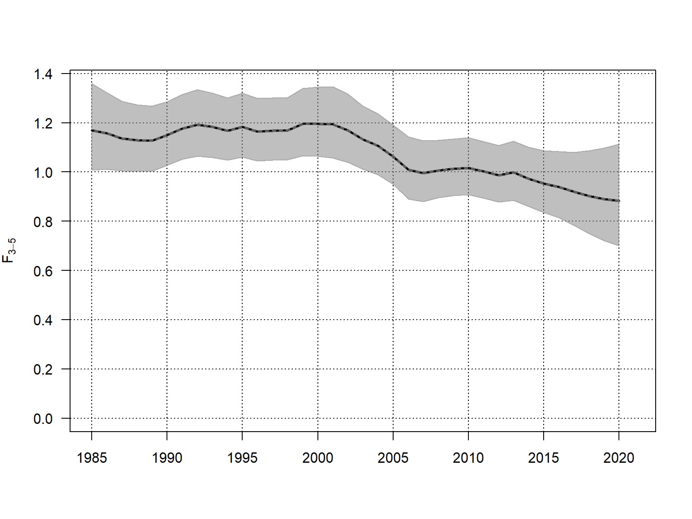

---
output:
  html_document: default
  word_document:
    fig_caption: true
    fig_height: 10
    fig_width: 10
    reference_docx: bootstrap/data/reportTemplate.docx
    toc: true
    keep_md: false
bibliography: bootstrap/DATA.bib
nocite: '@*'
---

```{r libraries, include=FALSE}
library(captioner)
library(knitr)
library(pander)
```

```{r chunk_setup, include=FALSE}
# CHUNK SETUPS #################################################################
knitr::opts_chunk$set(echo = FALSE, warning = FALSE,
                      message=FALSE, results = 'asis')
```

```{r pander_settings, include = FALSE}
# PANDER OPTIONS ##############################################################
panderOptions('table.split.table', Inf)
panderOptions('keep.trailing.zeros', TRUE)
panderOptions('table.alignment.default', "center")
```

```{r caption_counters, include=FALSE}
table_nums <- captioner("Table", level = 3)
figure_nums <- captioner("Figure", level = 3)
# set levels, lets choose section 9.6
tab_env <- environment(table_nums)
fig_env <- environment(figure_nums)
tab_env$OBJECTS$number[[1]] <- list(9, 6, 1)
fig_env$OBJECTS$number[[1]] <- list(9, 6, 1)
# set table captions in the order they appear in the report to get the numbering correct
table_nums("catch_table", "Total catch (tonnes) for the first and second half of the year as estimated by ICES")
# set figure captions in the order they appear in the report to get the numbering correct
figure_nums("catch_plot", "Total catch (tonnes) by year as estimated by ICES.")

#numbers come in the order they are in the script
```


# Example Stock report

## Example stock in ICES Division 4

### Catch data


```{r catch_table}
catch_table <- read.taf("report/catage.csv")
# set caption
set.caption(table_nums("catch_table"))
# Output table
pander(style_table1(catch_table), missing = "-")
```


```{r catch_plot, fig.cap = cap_in}
# Figure Caption
cap_in <- figure_nums("catch_plot")
# Output figure

```

# References

<div id="refs"></div>