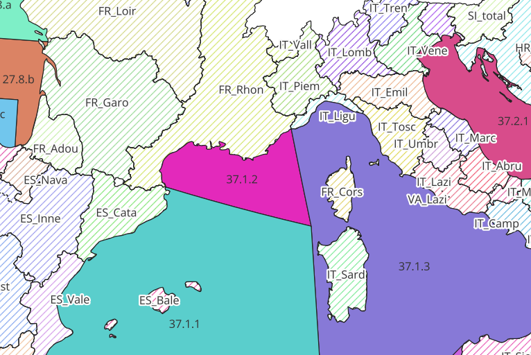

-----------------------------------------------------------
# FR (Integration Cédric)
-----------------------------------------------------------

## Annex 1

### series

1 line inserted : new series Brittany
── Data Summary ────────────────────────
                           Values
Name                       datadb
Number of rows             1     
Number of columns          26    
_______________________          
Column type frequency:           
  character                16    
  logical                  1     
  numeric                  9     
________________________         
Group variables            None  

── Variable type: character ────────────────────────────────────────────────────────────────────────────────────────────────────────────────────────────────────────────────
   skim_variable           n_missing complete_rate min max empty n_unique whitespace
 1 ser_nameshort                   0             1   6   6     0        1          0
 2 ser_namelong                    0             1  30  30     0        1          0
 3 ser_effort_uni_code             0             1   5   5     0        1          0
 4 ser_comment                     0             1 287 287     0        1          0
 5 ser_uni_code                    0             1   5   5     0        1          0
 6 ser_lfs_code                    0             1   2   2     0        1          0
 7 ser_hty_code                    0             1   1   1     0        1          0
 8 ser_locationdescription         0             1  65  65     0        1          0
 9 ser_emu_nameshort               0             1   7   7     0        1          0
10 ser_cou_code                    0             1   2   2     0        1          0
11 ser_area_division               1             0  NA  NA     0        0          0
12 geom                            0             1  50  50     0        1          0
13 ser_qal_comment                 0             1  37  37     0        1          0
14 ser_ccm_wso_id                  0             1   2   2     0        1          0
15 ser_dts_datasource              0             1  10  10     0        1          0
16 ser_method                      0             1 271 271     0        1          0

── Variable type: logical ──────────────────────────────────────────────────────────────────────────────────────────────────────────────────────────────────────────────────
  skim_variable  n_missing complete_rate mean count 
1 ser_restocking         0             1    0 FAL: 1

── Variable type: numeric ──────────────────────────────────────────────────────────────────────────────────────────────────────────────────────────────────────────────────
  skim_variable     n_missing complete_rate   mean sd     p0    p25    p50    p75   p100 hist   
1 ser_id                    0             1 484    NA 484    484    484    484    484    "▁▁▇▁▁"
2 ser_typ_id                0             1   1    NA   1      1      1      1      1    "▁▁▇▁▁"
3 ser_tblcodeid             1             0 NaN    NA  NA     NA     NA     NA     NA    " "    
4 ser_x                     0             1  -2.75 NA  -2.75  -2.75  -2.75  -2.75  -2.75 "▁▁▇▁▁"
5 ser_y                     0             1  48.1  NA  48.1   48.1   48.1   48.1   48.1  "▁▁▇▁▁"
6 ser_sam_id                0             1   3    NA   3      3      3      3      3    "▁▁▇▁▁"
7 ser_qal_id                0             1   0    NA   0      0      0      0      0    "▁▁▇▁▁"
8 ser_distanceseakm         1             0 NaN    NA  NA     NA     NA     NA     NA    " "    
9 ser_sam_gear              0             1 242    NA 242    242    242    242    242    "▁▁▇▁▁"


set a qal_id and das_qal_id for BretGY
```
select * from datawg.t_series_ser tss where tss.ser_nameshort ='BretGY';
select * from  datawg.t_dataseries_das tdd  where das_ser_id = 485 and das_qal_id is null;
update datawg.t_series_ser set ser_qal_id = 3, ser_qal_comment = 'inclusion to be decided during benchmark' where ser_nameshort ='BretGY';
update datawg.t_dataseries_das tdd  set das_qal_id = 1 where das_ser_id = 485 and das_qal_id is null;
select * from datawg.t_series_ser tss where tss.ser_nameshort ='BretGY';
select * from  datawg.t_dataseries_das tdd  where das_ser_id = 485 and das_qal_id is null;
```

### dataseries
#### New data
 17 new values inserted in the database
── Data Summary ────────────────────────
                           Values
Name                       datadb
Number of rows             17    
Number of columns          10    
_______________________          
Column type frequency:           
  character                3     
  Date                     1     
  numeric                  6     
________________________         
Group variables            None  

── Variable type: character ────────────────────────────────────────────────────────────────────────────────────────────────────────────────────────────────────────────────
  skim_variable      n_missing complete_rate min max empty n_unique whitespace
1 das_comment               13         0.235  16  78     0        4          0
2 das_dts_datasource         0         1      10  10     0        1          0
3 das_qal_comment           17         0      NA  NA     0        0          0

── Variable type: Date ─────────────────────────────────────────────────────────────────────────────────────────────────────────────────────────────────────────────────────
  skim_variable   n_missing complete_rate min        max        median     n_unique
1 das_last_update         0             1 2025-09-08 2025-09-08 2025-09-08        1

── Variable type: numeric ──────────────────────────────────────────────────────────────────────────────────────────────────────────────────────────────────────────────────
  skim_variable n_missing complete_rate     mean        sd       p0    p25    p50     p75    p100 hist 
1 das_id                0         1       9320        5.05 9312     9316   9320    9324      9328 ▇▆▆▆▇
2 das_value             0         1     209500.  777268.      0.313  106.   115   16191   3217184 ▇▁▁▁▁
3 das_ser_id            0         1        369.     185.     42      300    485     485       485 ▂▁▁▁▇
4 das_year              0         1       2021.       3.78 2014     2018   2022    2024      2025 ▃▂▂▂▇
5 das_effort            1         0.941     67.1     97.3    11       17.5   19      90.8     358 ▇▂▁▁▁
6 das_qal_id           11         0.353      2.5      1.64    1        1      2.5     4         4 ▇▁▁▁▇

#### Modified data
41 values updated in the db

── Data Summary ────────────────────────
                           Values
Name                       datadb
Number of rows             41    
Number of columns          10    
_______________________          
Column type frequency:           
  character                3     
  Date                     1     
  numeric                  6     
________________________         
Group variables            None  

── Variable type: character ────────────────────────────────────────────────────
  skim_variable      n_missing complete_rate min max empty n_unique whitespace
1 das_comment                1         0.976  60 209     0       11          0
2 das_dts_datasource        31         0.244   7   7     0        3          0
3 das_qal_comment           41         0      NA  NA     0        0          0

── Variable type: Date ─────────────────────────────────────────────────────────
  skim_variable   n_missing complete_rate min        max        median    
1 das_last_update         0             1 2025-09-11 2025-09-11 2025-09-11
  n_unique
1        1

── Variable type: numeric ──────────────────────────────────────────────────────
  skim_variable n_missing complete_rate     mean        sd        p0      p25
1 das_id                0         1       4212.    2704.   1741      1751    
2 das_value             0         1     111800.  560038.      0.0982    0.903
3 das_ser_id            0         1         57.0     56.0    42        42    
4 das_year              0         1       2012.       9.75 1994      2004    
5 das_effort            1         0.976    332.     108.    101       262.   
6 das_qal_id            0         1          1        0       1         1    
      p50     p75    p100 hist 
1 2757    6512       8496 ▇▁▁▁▃
2    1.55    6.42 3499511 ▇▁▁▁▁
3   42      42        300 ▇▁▁▁▁
4 2014    2021       2024 ▃▃▃▃▇
5  380.    425.       432 ▂▁▂▂▇
6    1       1          1 ▁▁▇▁▁
Search:

### group metrics

#### new group metrics

15 and 17 new values inserted in the group and metric tables

── Data Summary ────────────────────────
                           Values
Name                       datadb
Number of rows             15    
Number of columns          10    
_______________________          
Column type frequency:           
  character                2     
  Date                     1     
  numeric                  7     
________________________         
Group variables            None  

── Variable type: character ────────────────────────────────────────────────────────────────────────────────────────────────────────────────────────────────────────────────
  skim_variable     n_missing complete_rate min max empty n_unique whitespace
1 gr_comment                1         0.933  16 146     0        4          0
2 gr_dts_datasource         0         1      10  10     0        1          0

── Variable type: Date ─────────────────────────────────────────────────────────────────────────────────────────────────────────────────────────────────────────────────────
  skim_variable n_missing complete_rate min        max        median     n_unique
1 gr_lastupdate         0             1 2025-09-09 2025-09-09 2025-09-09        1

── Variable type: numeric ──────────────────────────────────────────────────────────────────────────────────────────────────────────────────────────────────────────────────
  skim_variable      n_missing complete_rate      mean      sd        p0       p25       p50       p75       p100 hist 
1 gr_id                      0        1      5747         4.47 5740      5744.     5747      5750.      5754      ▇▇▇▇▇
2 gr_year                    0        1      2020.        3.72 2014      2018.     2021      2024.      2025      ▃▂▂▂▇
3 gr_number                  1        0.933  3104      4893.     30      1663.     1936      2400.     19899      ▇▁▁▁▁
4 grser_ser_id               0        1       388.      176.     50       392.      485       485        485      ▂▁▁▁▇
5 lengthmm                   0        1        74.4      27.3     0.252    70        71        73.5      127.     ▁▁▇▁▂
6 g_in_gy_proportion        14        0.0667    0.0036   NA       0.0036    0.0036    0.0036    0.0036     0.0036 ▁▁▇▁▁
7 weightg                   14        0.0667    2.13     NA       2.13      2.13      2.13      2.13       2.13   ▁▁▇▁▁

#### modified group metrics

 2 and 3 new values modified in the group and metric tables

── Data Summary ────────────────────────
                           Values
Name                       datadb
Number of rows             2     
Number of columns          9     
_______________________          
Column type frequency:           
  character                2     
  Date                     1     
  numeric                  6     
________________________         
Group variables            None  

── Variable type: character ────────────────────────────────────────────────────────────────────────────────────────────────────────────────────────────────────────────────
  skim_variable     n_missing complete_rate min max empty n_unique whitespace
1 gr_comment                0             1  40  61     0        2          0
2 gr_dts_datasource         0             1  10  10     0        1          0

── Variable type: Date ─────────────────────────────────────────────────────────────────────────────────────────────────────────────────────────────────────────────────────
  skim_variable n_missing complete_rate min        max        median     n_unique
1 gr_lastupdate         0             1 2025-09-09 2025-09-09 2025-09-09        1

── Variable type: numeric ──────────────────────────────────────────────────────────────────────────────────────────────────────────────────────────────────────────────────
  skim_variable n_missing complete_rate    mean      sd      p0     p25     p50     p75    p100 hist 
1 gr_id                 0           1   4162     153.   4054    4108    4162    4216    4270    ▇▁▁▁▇
2 gr_year               0           1   2023       1.41 2022    2022.   2023    2024.   2024    ▇▁▁▁▇
3 gr_number             0           1   4660    5074.   1072    2866    4660    6454    8248    ▇▁▁▁▇
4 grser_ser_id          0           1    175     177.     50     112.    175     238.    300    ▇▁▁▁▇
5 lengthmm              0           1    107.      2.47  106.    106.    107.    108.    109    ▇▁▁▁▇
6 weightg               1           0.5    1.76   NA       1.76    1.76    1.76    1.76    1.76 ▁▁▇▁▁

### individual metrics
#### new individual metric

51989 and 52755 new values inserted in the fish and metric tables

── Data Summary ────────────────────────
                           Values
Name                       datadb
Number of rows             51989 
Number of columns          11    
_______________________          
Column type frequency:           
  character                4     
  Date                     2     
  numeric                  5     
________________________         
Group variables            None  

── Variable type: character ────────────────────────────────────────────────────────────────────────────────────────────────────────────────────────────────────────────────
  skim_variable     n_missing complete_rate min max empty n_unique whitespace
1 fi_comment            51989         0      NA  NA     0        0          0
2 fi_dts_datasource         0         1      10  10     0        1          0
3 fi_lfs_code           32060         0.383   1   1     0        2          0
4 fi_id_cou              9067         0.826  11  15     0    42922          0

── Variable type: Date ─────────────────────────────────────────────────────────────────────────────────────────────────────────────────────────────────────────────────────
  skim_variable n_missing complete_rate min        max        median     n_unique
1 fi_date               0             1 2014-06-05 2025-01-22 2023-07-13      302
2 fi_lastupdate         0             1 2025-09-09 2025-09-09 2025-09-09        1

── Variable type: numeric ──────────────────────────────────────────────────────────────────────────────────────────────────────────────────────────────────────────────────
  skim_variable n_missing complete_rate       mean       sd          p0     p25     p50     p75    p100 hist 
1 fi_id                 0        1      3455707    15008.   3429713     3442710 3455707 3468704 3481701 ▇▇▇▇▇
2 fi_year               0        1         2022.       2.98    2014        2020    2023    2024    2025 ▁▁▁▁▇
3 fiser_ser_id          0        1          290.     192.        61          61     300     485     485 ▇▁▃▁▇
4 lengthmm              0        1           99.5     33.4       42          70      86     127     343 ▇▅▁▁▁
5 weightg           51223        0.0147       7.97     5.28       0.165       5       7       9      54 ▇▂▁▁▁

#### Modified 

271 and 278 new values updated in the fish and metric tables
── Data Summary ────────────────────────
                           Values
Name                       datadb
Number of rows             271   
Number of columns          12    
_______________________          
Column type frequency:           
  character                4     
  Date                     2     
  numeric                  6     
________________________         
Group variables            None  

── Variable type: character ────────────────────────────────────────────────────
  skim_variable     n_missing complete_rate min max empty n_unique whitespace
1 fi_comment                0         1      27  38     0        5          0
2 fi_dts_datasource         0         1       7   7     0        1          0
3 fi_lfs_code              56         0.793   1   1     0        2          0
4 fi_id_cou               271         0      NA  NA     0        0          0

── Variable type: Date ─────────────────────────────────────────────────────────
  skim_variable n_missing complete_rate min        max        median    
1 fi_date               0             1 1997-07-20 2024-03-07 1999-04-23
2 fi_lastupdate         0             1 2025-09-10 2025-09-10 2025-09-10
  n_unique
1       44
2        1

── Variable type: numeric ──────────────────────────────────────────────────────
  skim_variable             n_missing complete_rate        mean         sd
1 fi_id                             0        1      2549725.    42007.    
2 fi_year                           0        1         2001.        5.58  
3 fiser_ser_id                      0        1           61.2       0.954 
4 lengthmm                          2        0.993      129.       73.5   
5 differentiated_proportion       266        0.0185       0         0     
6 weightg                         267        0.0148       0.186     0.0306
           p0         p25         p50         p75        p100 hist 
1 2488020     2534724.    2534792     2537260.    2712693     ▁▇▁▁▁
2    1997        1999        1999        1999        2024     ▇▁▁▁▁
3      61          61          61          61          67     ▇▁▁▁▁
4      52          92         115         142         505     ▇▂▁▁▁
5       0           0           0           0           0     ▁▁▇▁▁
6       0.157       0.162       0.185       0.209       0.219 ▇▁▁▃▃

 56 and 56 new values updated in the fish and metric tables

── Data Summary ────────────────────────
                           Values
Name                       datadb
Number of rows             56    
Number of columns          10    
_______________________          
Column type frequency:           
  character                4     
  Date                     2     
  numeric                  4     
________________________         
Group variables            None  

── Variable type: character ────────────────────────────────────────────────────────────────────────────────────────────────────────────────────────────────────────────────
  skim_variable     n_missing complete_rate min max empty n_unique whitespace
1 fi_comment                0             1  27  38     0        2          0
2 fi_dts_datasource         0             1  10  10     0        1          0
3 fi_lfs_code              56             0  NA  NA     0        0          0
4 fi_id_cou                56             0  NA  NA     0        0          0

── Variable type: Date ─────────────────────────────────────────────────────────────────────────────────────────────────────────────────────────────────────────────────────
  skim_variable n_missing complete_rate min        max        median     n_unique
1 fi_date               0             1 1997-07-20 2021-07-27 2000-06-22       27
2 fi_lastupdate         0             1 2025-09-09 2025-09-09 2025-09-09        1

── Variable type: numeric ──────────────────────────────────────────────────────────────────────────────────────────────────────────────────────────────────────────────────
  skim_variable n_missing complete_rate      mean       sd      p0      p25      p50      p75    p100 hist 
1 fi_id                 0             1 2583983.  61543.   2506533 2542470. 2543572. 2659460. 2683648 ▅▇▁▁▇
2 fi_year               0             1    2006.      9.16    1997    2000.    2000     2017     2021 ▇▁▁▁▃
3 fiser_ser_id          0             1      61       0         61      61       61       61       61 ▁▁▇▁▁
4 lengthmm              0             1      57.7     5.14      52      52       60       62       64 ▇▁▁▁▇


+ an additional that was inserted after a fix
── Data Summary ────────────────────────
                           Values
Name                       datadb
Number of rows             1     
Number of columns          10    
_______________________          
Column type frequency:           
  character                4     
  Date                     2     
  numeric                  4     
________________________         
Group variables            None  

── Variable type: character ────────────────────────────────────────────────────────────────────────────────────────────────────────────────────────────────────────────────
  skim_variable     n_missing complete_rate min max empty n_unique whitespace
1 fi_comment                0             1  30  30     0        1          0
2 fi_dts_datasource         0             1  10  10     0        1          0
3 fi_lfs_code               0             1   1   1     0        1          0
4 fi_id_cou                 1             0  NA  NA     0        0          0

── Variable type: Date ─────────────────────────────────────────────────────────────────────────────────────────────────────────────────────────────────────────────────────
  skim_variable n_missing complete_rate min        max        median     n_unique
1 fi_date               0             1 2017-03-16 2017-03-16 2017-03-16        1
2 fi_lastupdate         0             1 2025-09-09 2025-09-09 2025-09-09        1

── Variable type: numeric ──────────────────────────────────────────────────────────────────────────────────────────────────────────────────────────────────────────────────
  skim_variable n_missing complete_rate        mean sd          p0         p25         p50         p75        p100 hist 
1 fi_id                 0             1 2709236     NA 2709236     2709236     2709236     2709236     2709236     ▁▁▇▁▁
2 fi_year               0             1    2017     NA    2017        2017        2017        2017        2017     ▁▁▇▁▁
3 fiser_ser_id          0             1      67     NA      67          67          67          67          67     ▁▁▇▁▁
4 weightg               0             1       0.219 NA       0.219       0.219       0.219       0.219       0.219 ▁▁▇▁▁


-- after fix with the shiny

── Data Summary ────────────────────────
                           Values
Name                       datadb
Number of rows             81    
Number of columns          10    
_______________________          
Column type frequency:           
  character                4     
  Date                     2     
  numeric                  4     
________________________         
Group variables            None  

── Variable type: character ────────────────────────────────────────────────────────────────────────────────────────────────────────────────────────────────────────────────
  skim_variable     n_missing complete_rate min max empty n_unique whitespace
1 fi_comment                0         1      27  28     0        2          0
2 fi_dts_datasource         0         1       7   7     0        1          0
3 fi_lfs_code              13         0.840   1   1     0        1          0
4 fi_id_cou                81         0      NA  NA     0        0          0

── Variable type: Date ─────────────────────────────────────────────────────────────────────────────────────────────────────────────────────────────────────────────────────
  skim_variable n_missing complete_rate min        max        median     n_unique
1 fi_date               0             1 1997-07-20 1999-04-23 1999-04-14       13
2 fi_lastupdate         0             1 2025-09-09 2025-09-09 2025-09-09        1

── Variable type: numeric ──────────────────────────────────────────────────────────────────────────────────────────────────────────────────────────────────────────────────
  skim_variable n_missing complete_rate     mean       sd      p0     p25     p50     p75    p100 hist 
1 fi_id                 0             1 2533095. 4842.    2506533 2534678 2534698 2534718 2534738 ▁▁▁▁▇
2 fi_year               0             1    1999.    0.422    1997    1999    1999    1999    1999 ▁▁▂▁▇
3 fiser_ser_id          0             1      61     0          61      61      61      61      61 ▁▁▇▁▁
4 lengthmm              0             1     164.  107.         60      97     110     232     505 ▇▂▂▁▁

Note : debugging from locahost and forgot to change some code in R
Here's the fix

```sql 

-- fix error for France datasource

UPDATE datawg.t_dataseries_das
SET das_dts_datasource = 'dc_2025'
WHERE das_dts_datasource = 'wkemp_2025'
AND das_last_update > '2025-09-05'; --17

SELECT * FROM datawg.t_fishseries_fiser as tff 
WHERE tff.fi_dts_datasource = 'wkemp_2025'
AND tff.fi_lastupdate  > '2025-09-05'; 

UPDATE datawg.t_fishseries_fiser
SET fi_dts_datasource = 'dc_2025'
WHERE fi_dts_datasource = 'wkemp_2025'
AND fi_lastupdate > '2025-09-05'; --52045

SELECT * FROM datawg.t_groupseries_grser 
WHERE gr_dts_datasource = 'wkemp_2025'
AND gr_lastupdate  > '2025-09-05'; 

UPDATE datawg.t_groupseries_grser 
SET gr_dts_datasource = 'dc_2025'
WHERE gr_dts_datasource = 'wkemp_2025'
AND gr_dts_datasource > '2025-09-05'; --17

SELECT * FROM datawg.t_metricgroupseries_megser
WHERE meg_dts_datasource = 'wkemp_2025'
AND meg_last_update   > '2025-09-05'; 

UPDATE datawg.t_metricgroupseries_megser
SET meg_dts_datasource = 'dc_2025'
WHERE meg_dts_datasource = 'wkemp_2025'
AND meg_last_update > '2025-09-05'; --20

SELECT * FROM datawg.t_metricindseries_meiser
WHERE mei_dts_datasource = 'wkemp_2025'
AND mei_last_update   > '2025-09-05'; 

UPDATE datawg.t_metricindseries_meiser
SET mei_dts_datasource = 'dc_2025'
WHERE mei_dts_datasource = 'wkemp_2025'
AND mei_last_update   > '2025-09-05'; --52811

```

## Annex 2

### series

### dataseries

#### new dataseries

 17 new values inserted in the database

── Data Summary ────────────────────────
                           Values
Name                       datadb
Number of rows             17    
Number of columns          10    
_______________________          
Column type frequency:           
  character                3     
  Date                     1     
  numeric                  6     
________________________         
Group variables            None  

── Variable type: character ────────────────────────────────────────────────────
  skim_variable      n_missing complete_rate min max empty n_unique whitespace
1 das_comment               17             0  NA  NA     0        0          0
2 das_dts_datasource         0             1   7   7     0        1          0
3 das_qal_comment           17             0  NA  NA     0        0          0

── Variable type: Date ─────────────────────────────────────────────────────────
  skim_variable   n_missing complete_rate min        max        median    
1 das_last_update         0             1 2025-09-09 2025-09-09 2025-09-09
  n_unique
1        1

── Variable type: numeric ──────────────────────────────────────────────────────
  skim_variable n_missing complete_rate     mean     sd       p0      p25
1 das_id                0             1 9380      5.05  9372     9376    
2 das_value             0             1    0.536  0.440    0.053    0.178
3 das_ser_id            0             1  293.    65.6    213      218    
4 das_year              0             1 2024      0     2024     2024    
5 das_effort            0             1   12.9   12.6      2        4    
6 das_qal_id            0             1    1      0        1        1    
       p50     p75    p100 hist 
1 9380     9384    9388    ▇▆▆▆▇
2    0.403    0.81    1.38 ▇▁▃▂▂
3  303      372     376    ▇▁▇▁▇
4 2024     2024    2024    ▁▁▇▁▁
5   10       15      52    ▇▂▁▁▁
6    1        1       1    ▁▁▇▁▁

#### updated dataseries

194 values updated in the db

─ Data Summary ────────────────────────
                           Values
Name                       datadb
Number of rows             194   
Number of columns          10    
_______________________          
Column type frequency:           
  character                3     
  Date                     1     
  numeric                  6     
________________________         
Group variables            None  

── Variable type: character ────────────────────────────────────────────────────
  skim_variable      n_missing complete_rate min max empty n_unique whitespace
1 das_comment                0         1      22 174     0        2          0
2 das_dts_datasource       139         0.284   7   7     0        4          0
3 das_qal_comment          194         0      NA  NA     0        0          0

── Variable type: Date ─────────────────────────────────────────────────────────
  skim_variable   n_missing complete_rate min        max        median    
1 das_last_update         0             1 2025-09-09 2025-09-09 2025-09-09
  n_unique
1        1

── Variable type: numeric ──────────────────────────────────────────────────────
  skim_variable n_missing complete_rate     mean       sd       p0      p25
1 das_id                0             1 6100.    1456.    4067     5470.   
2 das_value             0             1    0.543    0.485    0.029    0.154
3 das_ser_id            0             1  295.      61.4    213      218    
4 das_year              0             1 2016.       4.51  2002     2013    
5 das_effort            0             1   10.3      8.46     1        4    
6 das_qal_id            0             1    1        0        1        1    
       p50      p75    p100 hist 
1 5518.    6589.    8573    ▆▇▇▁▆
2    0.392    0.756    2.03 ▇▃▂▁▁
3  303      372      376    ▆▁▇▁▆
4 2017     2020     2023    ▁▂▅▆▇
5    9       12       51    ▇▂▁▁▁
6    1        1        1    ▁▁▇▁▁

### group metrics

#### new group metrics

 19 and 32 new values inserted in the group and metric tables
─ Data Summary ────────────────────────
                           Values
Name                       datadb
Number of rows             19    
Number of columns          10    
_______________________          
Column type frequency:           
  character                2     
  Date                     1     
  numeric                  7     
________________________         
Group variables            None  

── Variable type: character ────────────────────────────────────────────────────
  skim_variable     n_missing complete_rate min max empty n_unique whitespace
1 gr_comment               13         0.316  38 200     0        6          0
2 gr_dts_datasource         0         1       7   7     0        1          0

── Variable type: Date ─────────────────────────────────────────────────────────
  skim_variable n_missing complete_rate min        max        median    
1 gr_lastupdate         0             1 2025-09-09 2025-09-09 2025-09-09
  n_unique
1        1

── Variable type: numeric ──────────────────────────────────────────────────────
  skim_variable      n_missing complete_rate     mean      sd       p0      p25
1 gr_id                      0        1      5835       5.63  5826     5830.   
2 gr_year                    0        1      2024.      0.713 2021     2024    
3 gr_number                  0        1       303.    334.       7       79.5  
4 grser_ser_id               0        1       302.     66.8    213      218.   
5 lengthmm                   0        1       273.    131.     156      181    
6 weightg                    7        0.632   137.    142.       9       26.2  
7 s_in_ys_proportion        18        0.0526    0.008  NA        0.008    0.008
       p50      p75     p100 hist 
1 5835     5840.    5844     ▇▇▆▇▇
2 2024     2024     2024     ▁▁▁▁▇
3  225      326.    1168     ▇▃▁▁▂
4  304      373      376     ▇▁▇▁▇
5  218.     320.     576.    ▇▁▁▁▁
6   80.8    198      429.    ▇▃▁▂▁
7    0.008    0.008    0.008 ▁▁▇▁▁

#### updated group metrics

 14 and 28 new values modified in the group and metric tables

── Data Summary ────────────────────────
                           Values
Name                       datadb
Number of rows             14    
Number of columns          9     
_______________________          
Column type frequency:           
  character                2     
  Date                     1     
  numeric                  6     
________________________         
Group variables            None  

── Variable type: character ────────────────────────────────────────────────────
  skim_variable     n_missing complete_rate min max empty n_unique whitespace
1 gr_comment                0             1 211 214     0       14          0
2 gr_dts_datasource         0             1   7   7     0        1          0

── Variable type: Date ─────────────────────────────────────────────────────────
  skim_variable n_missing complete_rate min        max        median    
1 gr_lastupdate         0             1 2025-09-09 2025-09-09 2025-09-09
  n_unique
1        1

── Variable type: numeric ──────────────────────────────────────────────────────
  skim_variable n_missing complete_rate   mean      sd     p0    p25    p50
1 gr_id                 0             1 3512.  1086.   1857   2426.  4136. 
2 gr_year               0             1 2020      3.28 2013   2018   2022. 
3 gr_number             0             1  294.   182.     67    138    294  
4 grser_ser_id          0             1  240.    50.3   213    216    217  
5 lengthmm              0             1  259.    24.0   231.   236.   255. 
6 weightg               0             1   71.4   25.3    46.9   57.0   61.4
     p75  p100 hist 
1 4144.  4324  ▃▁▁▁▇
2 2022   2023  ▂▂▁▃▇
3  390    630  ▇▃▆▂▃
4  217    374  ▇▁▂▁▁
5  283.   291  ▇▃▂▃▆
6   74.2  131. ▇▃▁▁▂

### individual metrics

#### deleted individual metrics


Deleted lines :

2722586	2023-06-27	2023		2024-09-10	dc_2024		306	adr_43893
2722587	2023-06-27	2023		2024-09-10	dc_2024		306	adr_43894
2722593	2023-06-27	2023		2024-09-10	dc_2024		306	adr_43900
2722595	2023-06-27	2023		2024-09-10	dc_2024		306	adr_43902
2722596	2023-06-27	2023		2024-09-10	dc_2024		306	adr_43903
2722600	2023-06-27	2023		2024-09-10	dc_2024		306	adr_43907
2722602	2023-06-27	2023		2024-09-10	dc_2024		306	adr_43909
2722609	2023-07-06	2023		2024-09-10	dc_2024		218	adr_43916
2722610	2023-07-06	2023		2024-09-10	dc_2024

#### updated individual metrics

OK checked 375 lines (Guirec => OK fixed from Earlier Error)

375 and 707 new values updated in the fish and metric tables

── Data Summary ────────────────────────
                           Values
Name                       datadb
Number of rows             375   
Number of columns          11    
_______________________          
Column type frequency:           
  character                4     
  Date                     2     
  numeric                  5     
________________________         
Group variables            None  

── Variable type: character ────────────────────────────────────────────────────
  skim_variable     n_missing complete_rate min max empty n_unique whitespace
1 fi_comment                0       1        23  26     0        2          0
2 fi_dts_datasource         0       1         7   7     0        1          0
3 fi_lfs_code             373       0.00533   1   1     0        1          0
4 fi_id_cou               374       0.00267  12  12     0        1          0

── Variable type: Date ─────────────────────────────────────────────────────────
  skim_variable n_missing complete_rate min        max        median    
1 fi_date               0             1 1995-09-13 2023-09-19 1999-09-15
2 fi_lastupdate         0             1 2025-09-11 2025-09-11 2025-09-11
  n_unique
1       71
2        1

── Variable type: numeric ──────────────────────────────────────────────────────
  skim_variable n_missing complete_rate    mean         sd     p0      p25
1 fi_id                 0         1     305739. 177392.    290535 290628. 
2 fi_year               0         1       2000.      4.18    1995   1996  
3 fiser_ser_id          0         1        214.      0.258    214    214  
4 lengthmm              0         1        381.     66.6      111    350  
5 weightg              43         0.885    107.     86.4       14     71.8
     p50     p75    p100 hist 
1 291741 293750. 2727791 ▇▁▁▁▁
2   1999   2002     2023 ▇▃▁▁▁
3    214    214      219 ▇▁▁▁▁
4    366    385      722 ▁▅▇▁▁
5     84    100      757 ▇▁▁▁▁

#### new individual metrics
 62664 and 106169 new values inserted in the fish and metric tables
── Data Summary ────────────────────────
                           Values
Name                       datadb
Number of rows             62664 
Number of columns          13    
_______________________          
Column type frequency:           
  character                4     
  Date                     2     
  numeric                  7     
________________________         
Group variables            None  

── Variable type: character ────────────────────────────────────────────────────
  skim_variable     n_missing complete_rate min max empty n_unique whitespace
1 fi_comment            62664             0  NA  NA     0        0          0
2 fi_dts_datasource         0             1   7   7     0        1          0
3 fi_lfs_code           62664             0  NA  NA     0        0          0
4 fi_id_cou                 0             1   4  10     0    62664          0

── Variable type: Date ─────────────────────────────────────────────────────────
  skim_variable n_missing complete_rate min        max        median    
1 fi_date               0             1 2002-05-27 2023-11-06 2017-07-11
2 fi_lastupdate         0             1 2025-09-10 2025-09-10 2025-09-10
  n_unique
1      707
2        1

── Variable type: numeric ──────────────────────────────────────────────────────
  skim_variable     n_missing complete_rate       mean       sd         p0
1 fi_id                     0        1      3720406.   18090.   3689074   
2 fi_year                   0        1         2017.       4.15    2002   
3 fiser_ser_id              0        1          278.      63.9      213   
4 lengthmm                  0        1          244.     137.        50   
5 weightg               20648        0.670       65.3    122.         1   
6 eye_diam_meanmm       61919        0.0119       4.83     1.62       1.46
7 pectoral_lengthmm     61920        0.0119      19.0      6.76       4.93
         p25        p50        p75      p100 hist 
1 3704740.   3720406.   3736071.   3751737   ▇▇▇▇▇
2    2013       2017       2020       2023   ▁▁▆▆▇
3     218        301        306        376   ▇▁▅▁▃
4     141        208        320       1242   ▇▃▁▁▁
5       5         18         68       1735   ▇▁▁▁▁
6       3.75       4.61       5.73      24.5 ▇▂▁▁▁
7      14.0       18         22.7       61.2 ▆▇▂▁▁


I've verified the following so I think it went well despite the output, the last fish it there :
And I don't have any new fish ???? I think most fishes were not changed....

```sql
SELECT * FROM datawg.t_fishseries_fiser WHERE fi_id_cou = 'Ndie_40585'

```

|fi_id|fi_date|fi_year|fi_comment|fi_lastupdate|fi_dts_datasource|fi_lfs_code|fiser_ser_id|fi_id_cou|
|-----|-------|-------|----------|-------------|-----------------|-----------|------------|---------|
|3814401|2022-10-06|2022||2025-09-10|dc_2025||216|Ndie_40585|


```sql
SELECT count(*) FROM datawg.t_fishseries_fiser 
JOIN datawg.t_series_ser ON ser_id = fiser_ser_id
WHERE fi_dts_datasource = 'dc_2025' 
AND ser_cou_code = 'FR'
AND fi_lsf_code 
```

> 125715


## Annex 3

### series

### dataseries
#### new dataseries 

 5 new values inserted in the database

── Data Summary ────────────────────────
                           Values
Name                       datadb
Number of rows             5     
Number of columns          10    
_______________________          
Column type frequency:           
  character                3     
  Date                     1     
  numeric                  6     
________________________         
Group variables            None  

── Variable type: character ────────────────────────────────────────────────────────────────────────────────────────────────────────────────────────────────────────────────
  skim_variable      n_missing complete_rate min max empty n_unique whitespace
1 das_comment                2           0.6  27  69     0        3          0
2 das_dts_datasource         0           1    10  10     0        1          0
3 das_qal_comment            5           0    NA  NA     0        0          0

── Variable type: Date ─────────────────────────────────────────────────────────────────────────────────────────────────────────────────────────────────────────────────────
  skim_variable   n_missing complete_rate min        max        median     n_unique
1 das_last_update         0             1 2025-09-09 2025-09-09 2025-09-09        1

── Variable type: numeric ──────────────────────────────────────────────────────────────────────────────────────────────────────────────────────────────────────────────────
  skim_variable n_missing complete_rate    mean        sd   p0    p25  p50  p75  p100 hist 
1 das_id                0           1    9418       1.58  9416 9417   9418 9419  9420 ▇▇▇▇▇
2 das_value             0           1   15591.  31447.      18  308   1522 4345 71761 ▇▁▁▁▂
3 das_ser_id            0           1     217.     12.3    195  220    222  223   224 ▂▁▁▁▇
4 das_year              0           1    2024.      0.447 2023 2024   2024 2024  2024 ▂▁▁▁▇
5 das_effort            1           0.8    96.5    83.1     12   55.5   82  123   210 ▇▇▇▁▇
6 das_qal_id            0           1       2.8     1.64     1    1      4    4     4 ▅▁▁▁▇

#### Modified dataseries
49 values updated in the db

── Data Summary ────────────────────────
                           Values
Name                       datadb
Number of rows             49    
Number of columns          10    
_______________________          
Column type frequency:           
  character                3     
  Date                     1     
  numeric                  6     
________________________         
Group variables            None  

── Variable type: character ────────────────────────────────────────────────────────────────────────────────────────────────────────────────────────────────────────────────
  skim_variable      n_missing complete_rate min max empty n_unique whitespace
1 das_comment                1         0.980  11  89     0       28          0
2 das_dts_datasource         0         1       7   7     0        6          0
3 das_qal_comment           49         0      NA  NA     0        0          0

── Variable type: Date ─────────────────────────────────────────────────────────────────────────────────────────────────────────────────────────────────────────────────────
  skim_variable   n_missing complete_rate min        max        median     n_unique
1 das_last_update         0             1 2025-09-09 2025-09-09 2025-09-09        1

── Variable type: numeric ──────────────────────────────────────────────────────────────────────────────────────────────────────────────────────────────────────────────────
  skim_variable n_missing complete_rate   mean       sd   p0    p25  p50   p75   p100 hist 
1 das_id                0         1      7605.  1247.   4245 8069   8081 8093    8590 ▁▁▁▁▇
2 das_value             0         1     20979. 42051.      9   92    175 1232  171325 ▇▁▁▁▁
3 das_ser_id            0         1       220.     4.08  195  220    220  220     224 ▁▁▁▁▇
4 das_year              0         1      2007.    12.5  1981 1997   2010 2017    2023 ▃▃▃▅▇
5 das_effort           11         0.776   122.    59.2    46   91.8  120  138.    365 ▆▇▁▁▁
6 das_qal_id            0         1         1      0       1    1      1    1       1 ▁▁▇▁▁── Data Summary ────────────────────────
                           Values
Name                       datadb
Number of rows             49    
Number of columns          10    
_______________________          
Column type frequency:           
  character                3     
  Date                     1     
  numeric                  6     
________________________         
Group variables            None  

── Variable type: character ────────────────────────────────────────────────────────────────────────────────────────────────────────────────────────────────────────────────
  skim_variable      n_missing complete_rate min max empty n_unique whitespace
1 das_comment                1         0.980  11  89     0       28          0
2 das_dts_datasource         0         1       7   7     0        6          0
3 das_qal_comment           49         0      NA  NA     0        0          0

── Variable type: Date ─────────────────────────────────────────────────────────────────────────────────────────────────────────────────────────────────────────────────────
  skim_variable   n_missing complete_rate min        max        median     n_unique
1 das_last_update         0             1 2025-09-09 2025-09-09 2025-09-09        1

── Variable type: numeric ──────────────────────────────────────────────────────────────────────────────────────────────────────────────────────────────────────────────────
  skim_variable n_missing complete_rate   mean       sd   p0    p25  p50   p75   p100 hist 
1 das_id                0         1      7605.  1247.   4245 8069   8081 8093    8590 ▁▁▁▁▇
2 das_value             0         1     20979. 42051.      9   92    175 1232  171325 ▇▁▁▁▁
3 das_ser_id            0         1       220.     4.08  195  220    220  220     224 ▁▁▁▁▇
4 das_year              0         1      2007.    12.5  1981 1997   2010 2017    2023 ▃▃▃▅▇
5 das_effort           11         0.776   122.    59.2    46   91.8  120  138.    365 ▆▇▁▁▁
6 das_qal_id            0         1         1      0       1    1      1    1       1 ▁▁▇▁▁

sample modified

4245	171325	224	2013	updated 2025		2025-09-09	1	dc_2019	
4246	75244	224	2014	updated 2025		2025-09-09	1	dc_2019	
4247	67775	224	2016	updated 2025		2025-09-09	1	dc_2019	
4248	59521	224	2017	updated 2025		2025-09-09	1	dc_2019	
4249	70244	224	2018	updated 2025		2025-09-09	1	dc_2019	
5527	84131	224	2019	updated 2025		2025-09-09	1	dc_2020	
6527	102091	224	2012	updated 2025		2025-09-09	1	dc_2021	
6528	145443	224	2015	updated 2025		2025-09-09	1	dc_2021	
7889	53157	224	2020	updated 2025		2025-09-09	1	dc_2022	
8066	151	220	1981	no biometry data available; source: OFB	95	2025-09-09	1	dc_2022	

....


### group metrics

#### New group metrics

 6 and 31 new values inserted in the group and metric tables

 ── Data Summary ────────────────────────
                           Values
Name                       datadb
Number of rows             6     
Number of columns          15    
_______________________          
Column type frequency:           
  character                2     
  Date                     1     
  numeric                  12    
________________________         
Group variables            None  

── Variable type: character ────────────────────────────────────────────────────────────────────────────────────────────────────────────────────────────────────────────────
  skim_variable     n_missing complete_rate min max empty n_unique whitespace
1 gr_comment                3           0.5  77  77     0        1          0
2 gr_dts_datasource         0           1    10  10     0        1          0

── Variable type: Date ─────────────────────────────────────────────────────────────────────────────────────────────────────────────────────────────────────────────────────
  skim_variable n_missing complete_rate min        max        median     n_unique
1 gr_lastupdate         0             1 2025-09-09 2025-09-09 2025-09-09        1

── Variable type: numeric ──────────────────────────────────────────────────────────────────────────────────────────────────────────────────────────────────────────────────
   skim_variable                      n_missing complete_rate     mean       sd      p0      p25      p50      p75 p100 hist 
 1 gr_id                                      0         1     5892.       1.87  5889    5890.    5892.    5893.    5894 ▇▃▃▃▃
 2 gr_year                                    0         1     2023        1.26  2021    2022.    2024.    2024     2024 ▂▂▁▂▇
 3 gr_number                                  0         1     1309.    1325.      18     148.    1131     2355.    2989 ▇▁▁▂▅
 4 grser_ser_id                               0         1      218.      11.5    195     220.     223      224      224 ▂▁▁▁▇
 5 lengthmm                                   3         0.5    618.     152.     509     531      553      672      791 ▇▁▁▁▃
 6 weightg                                    0         1      495.     267.     291     346.     410.     494.    1014 ▇▅▁▁▂
 7 f_mean_lengthmm                            3         0.5    656.     118.     575     588      601      696      791 ▇▁▁▁▃
 8 f_mean_weightg                             3         0.5    607.     354.     378     403      428      721     1014 ▇▁▁▁▃
 9 method_sex_(1=visual,0=use_length)         0         1        0        0        0       0        0        0        0 ▁▁▇▁▁
10 female_proportion                          0         1        0.734    0.194    0.52    0.588    0.705    0.867    1 ▇▁▁▅▂
11 m_mean_lengthmm                            4         0.333  382.       6.36   378     380.     382.     385.     387 ▇▁▁▁▇
12 m_mean_weightg                             4         0.333   98.5      3.54    96      97.2     98.5     99.8    101 ▇▁▁▁▇
Search:

#### Updated group metrics
10 and 25 new values modified in the group and metric tables

── Data Summary ────────────────────────
                           Values
Name                       datadb
Number of rows             10    
Number of columns          15    
_______________________          
Column type frequency:           
  character                2     
  Date                     1     
  numeric                  12    
________________________         
Group variables            None  

── Variable type: character ────────────────────────────────────────────────────────────────────────────────────────────────────────────────────────────────────────────────
  skim_variable     n_missing complete_rate min max empty n_unique whitespace
1 gr_comment                0             1  12  77     0        2          0
2 gr_dts_datasource         0             1  10  10     0        1          0

── Variable type: Date ─────────────────────────────────────────────────────────────────────────────────────────────────────────────────────────────────────────────────────
  skim_variable n_missing complete_rate min        max        median     n_unique
1 gr_lastupdate         0             1 2025-09-09 2025-09-09 2025-09-09        1

── Variable type: numeric ──────────────────────────────────────────────────────────────────────────────────────────────────────────────────────────────────────────────────
   skim_variable                      n_missing complete_rate      mean       sd      p0      p25      p50       p75     p100 hist 
 1 gr_id                                      0           1   12637.    2916.    4338    13556.   13558.   13561.    13563    ▁▁▁▁▇
 2 gr_year                                    0           1    2017.       3.40  2012     2014.    2016.    2019.     2023    ▇▅▅▅▂
 3 gr_number                                  0           1    3195.    1396.     510     2628.    3364.    3738      5876    ▂▃▇▃▂
 4 grser_ser_id                               0           1     221.       9.17   195      224      224      224       224    ▁▁▁▁▇
 5 lengthmm                                   9           0.1   512       NA      512      512      512      512       512    ▁▁▇▁▁
 6 weightg                                    1           0.9   506.     122.     290      455      513      554       716    ▂▅▇▅▂
 7 m_mean_lengthmm                            9           0.1   373       NA      373      373      373      373       373    ▁▁▇▁▁
 8 m_mean_weightg                             9           0.1    92       NA       92       92       92       92        92    ▁▁▇▁▁
 9 f_mean_lengthmm                            9           0.1   607       NA      607      607      607      607       607    ▁▁▇▁▁
10 f_mean_weightg                             9           0.1   425       NA      425      425      425      425       425    ▁▁▇▁▁
11 method_sex_(1=visual,0=use_length)         9           0.1     0       NA        0        0        0        0         0    ▁▁▇▁▁
12 female_proportion                          0           1       0.802    0.145    0.49     0.81     0.85     0.888     0.92 ▁▁▁▁▇

### individual metrics

#### delete
514 entries
 514 values deleted from fish table, cascade delete on metrics => OK


#### new
431 and 2514 new values inserted in the fish and metric tables

── Data Summary ────────────────────────
                           Values
Name                       datadb
Number of rows             431   
Number of columns          15    
_______________________          
Column type frequency:           
  character                4     
  Date                     2     
  numeric                  9     
________________________         
Group variables            None  

── Variable type: character ────────────────────────────────────────────────────────────────────────────────────────────────────────────────────────────────────────────────
  skim_variable     n_missing complete_rate min max empty n_unique whitespace
1 fi_comment              431             0  NA  NA     0        0          0
2 fi_dts_datasource         0             1  10  10     0        1          0
3 fi_lfs_code               0             1   1   1     0        1          0
4 fi_id_cou               431             0  NA  NA     0        0          0

── Variable type: Date ─────────────────────────────────────────────────────────────────────────────────────────────────────────────────────────────────────────────────────
  skim_variable n_missing complete_rate min        max        median     n_unique
1 fi_date               0             1 2024-03-12 2025-05-15 2024-11-26       42
2 fi_lastupdate         0             1 2025-09-09 2025-09-09 2025-09-09        1

── Variable type: numeric ──────────────────────────────────────────────────────────────────────────────────────────────────────────────────────────────────────────────────
  skim_variable                      n_missing complete_rate        mean      sd        p0        p25       p50        p75      p100 hist 
1 fi_id                                      0         1     3585921     125.    3585706   3585814.   3585921   3586028.   3586136   ▇▇▇▇▇
2 fi_year                                    0         1        2024.      0.158    2023      2024       2024      2024       2024   ▁▁▁▁▇
3 fiser_ser_id                               0         1         202.     11.7       195       195        195       220        222   ▇▁▁▁▃
4 lengthmm                                  11         0.974     532.    136.        303       396.       540.      611.      1006   ▇▇▆▂▁
5 weightg                                    0         1         333.    287.         43       107        272       420.      1940   ▇▂▁▁▁
6 method_sex_(1=visual,0=use_length)        11         0.974       0       0           0         0          0         0          0   ▁▁▇▁▁
7 female_proportion                         11         0.974       0.664   0.473       0         0          1         1          1   ▅▁▁▁▇
8 eye_diam_meanmm                           18         0.958       7.42    1.36        3.3       6.51       7.3       8.15      12.7 ▁▇▇▂▁
9 pectoral_lengthmm                         21         0.951      27.4     7.15       14        21.2       27.6      31.7       61.8 ▆▇▃▁▁

Second round after delete

256 and 857 new values inserted in the fish and metric tables

── Data Summary ────────────────────────
                           Values
Name                       datadb
Number of rows             256   
Number of columns          13    
_______________________          
Column type frequency:           
  character                4     
  Date                     2     
  numeric                  7     
________________________         
Group variables            None  

── Variable type: character ────────────────────────────────────────────────────
  skim_variable     n_missing complete_rate min max empty n_unique whitespace
1 fi_comment              255       0.00391  37  37     0        1          0
2 fi_dts_datasource         0       1         7   7     0        1          0
3 fi_lfs_code               0       1         1   1     0        1          0
4 fi_id_cou               256       0        NA  NA     0        0          0

── Variable type: Date ─────────────────────────────────────────────────────────
  skim_variable n_missing complete_rate min        max        median    
1 fi_date               0             1 2015-12-04 2016-02-19 2016-02-01
2 fi_lastupdate         0             1 2025-09-11 2025-09-11 2025-09-11
  n_unique
1       12
2        1

── Variable type: numeric ──────────────────────────────────────────────────────
  skim_variable     n_missing complete_rate       mean     sd         p0
1 fi_id                     0         1     3936112.    74.0  3935984   
2 fi_year                   0         1        2015      0       2015   
3 fiser_ser_id              0         1         195      0        195   
4 weightg                   1         0.996     367.   253.        60   
5 eye_diam_meanmm          83         0.676       7.93   1.26       4.35
6 pectoral_lengthmm        81         0.684      29.1    7.11      11.2 
7 lengthmm                  2         0.992     562.   132.       323   
         p25       p50       p75      p100 hist 
1 3936048.   3936112.  3936175.  3936239   ▇▇▇▇▇
2    2015       2015      2015      2015   ▁▁▇▁▁
3     195        195       195       195   ▁▁▇▁▁
4     146.       305       514.     1181   ▇▅▃▁▁
5       7.05       7.9       8.7      11.2 ▁▅▇▅▂
6      24.2       29.5      33.7      49.8 ▂▆▇▃▁
7     469.       566       662.      883   ▇▆▇▆▁


#### modified
 3818 and 17922 new values updated in the fish and metric tables
── Data Summary ────────────────────────
                           Values
Name                       datadb
Number of rows             3818  
Number of columns          15    
_______________________          
Column type frequency:           
  character                4     
  Date                     2     
  numeric                  9     
________________________         
Group variables            None  

── Variable type: character ────────────────────────────────────────────────────
  skim_variable     n_missing complete_rate min max empty n_unique whitespace
1 fi_comment                0             1  22  47     0        5          0
2 fi_dts_datasource         0             1   7   7     0        1          0
3 fi_lfs_code               0             1   1   1     0        1          0
4 fi_id_cou              3818             0  NA  NA     0        0          0

── Variable type: Date ─────────────────────────────────────────────────────────
  skim_variable n_missing complete_rate min        max        median    
1 fi_date               0             1 1997-02-15 2024-05-14 2021-12-05
2 fi_lastupdate         0             1 2025-09-10 2025-09-10 2025-09-10
  n_unique
1       90
2        1

── Variable type: numeric ──────────────────────────────────────────────────────
  skim_variable                      n_missing complete_rate        mean
1 fi_id                                      0         1     2910628.   
2 fi_year                                    0         1        2021.   
3 fiser_ser_id                               0         1         223.   
4 eye_diam_meanmm                         2411         0.369       7.12 
5 pectoral_lengthmm                       2412         0.368      24.4  
6 lengthmm                                  41         0.989     418.   
7 weightg                                   44         0.988     153.   
8 method_sex_(1=visual,0=use_length)        39         0.990       0    
9 female_proportion                         39         0.990       0.263
        sd         p0        p25        p50        p75      p100 hist 
1 7710.    2821152    2910499.   2911454.   2912408.   2913362   ▁▁▁▁▇
2    1.47     1996       2021       2021       2021       2023   ▁▁▁▁▇
3    2.17      195        223        223        223        223   ▁▁▁▁▇
4    1.07        2.95       6.45       7.02       7.58      12.6 ▁▆▇▁▁
5    5.47       10.1       21.0       23.0       26.6       53.2 ▁▇▂▁▁
6   88.4       226        361        394        456       1034   ▇▇▁▁▁
7  153.         15         84        111        173       2741   ▇▁▁▁▁
8    0           0          0          0          0          0   ▁▁▇▁▁
9    0.440       0          0          0          1          1   ▇▁▁▁▃

## Annex 4

### deleted 
64 values deleted in the db

### duplicates 

(marked as updated with paste( comment updated 2025, previous_comment)
For duplicates 63 values replaced in the t_eelstock_ eel table (values from current datacall stored with code eel_qal_id 25)
,	0 values not replaced (values from current datacall stored with code eel_qal_id 25),
All values had TRUE in 'keep new values', all values have been replaced in the database


── Data Summary ────────────────────────
                           Values
Name                       datadb
Number of rows             126   
Number of columns          16    
_______________________          
Column type frequency:           
  character                10    
  Date                     1     
  numeric                  5     
________________________         
Group variables            None  

── Variable type: character ────────────────────────────────────────────────────
   skim_variable     n_missing complete_rate min max empty n_unique whitespace
 1 eel_emu_nameshort         0           1     7   7     0        8          0
 2 eel_cou_code              0           1     2   2     0        1          0
 3 eel_lfs_code              0           1     1   1     0        3          0
 4 eel_hty_code              0           1     1   1     0        1          0
 5 eel_area_division       126           0    NA  NA     0        0          0
 6 eel_qal_comment          63           0.5  22  22     0        1          0
 7 eel_comment               0           1    12 120     0        7          0
 8 eel_missvaluequal       126           0    NA  NA     0        0          0
 9 eel_datasource            0           1     7   7     0        5          0
10 eel_dta_code              0           1     6   6     0        1          0

── Variable type: Date ─────────────────────────────────────────────────────────
  skim_variable      n_missing complete_rate min        max        median    
1 eel_datelastupdate         0             1 2025-09-09 2025-09-09 2025-09-09
  n_unique
1        1

── Variable type: numeric ──────────────────────────────────────────────────────
  skim_variable n_missing complete_rate    mean       sd       p0     p25
1 eel_id                0             1 576923. 23753.   511082   557908.
2 eel_typ_id            0             1      4      0         4        4 
3 eel_year              0             1   2022.     1.30   2020     2021 
4 eel_value             0             1  23461. 46900.        9.1    816 
5 eel_qal_id            0             1     13     12.0       1        1 
      p50     p75    p100 hist 
1 578695  599472. 599503  ▁▁▇▁▇
2      4       4       4  ▁▁▇▁▁
3   2022    2023    2024  ▇▇▇▇▃
4   5157.  14608. 195721. ▇▁▁▁▁
5     13      25      25  ▇▁▁▁▇

###  updated data 

No data

### New data

 56 new values inserted in the database

── Data Summary ────────────────────────
                           Values
Name                       datadb
Number of rows             56    
Number of columns          16    
_______________________          
Column type frequency:           
  character                10    
  Date                     1     
  numeric                  5     
________________________         
Group variables            None  

── Variable type: character ────────────────────────────────────────────────────
   skim_variable     n_missing complete_rate min max empty n_unique whitespace
 1 eel_emu_nameshort         0        1        7   7     0       10          0
 2 eel_cou_code              0        1        2   2     0        1          0
 3 eel_lfs_code              0        1        1   1     0        3          0
 4 eel_hty_code              0        1        1   2     0        4          0
 5 eel_area_division        56        0       NA  NA     0        0          0
 6 eel_qal_comment          56        0       NA  NA     0        0          0
 7 eel_comment              54        0.0357  16  16     0        1          0
 8 eel_missvaluequal        22        0.607    2   2     0        1          0
 9 eel_datasource            0        1        7   7     0        1          0
10 eel_dta_code              0        1        6   6     0        1          0

── Variable type: Date ─────────────────────────────────────────────────────────
  skim_variable      n_missing complete_rate min        max        median    
1 eel_datelastupdate         0             1 2025-09-09 2025-09-09 2025-09-09
  n_unique
1        1

── Variable type: numeric ──────────────────────────────────────────────────────
  skim_variable n_missing complete_rate    mean        sd     p0     p25     p50
1 eel_id                0         1     599594.    16.3   599567 599581. 599594.
2 eel_typ_id            0         1          4      0          4      4       4 
3 eel_year              0         1       2024.     0.312   2024   2024    2024 
4 eel_value            34         0.393  16901. 40253.         0    427.   2319.
5 eel_qal_id            0         1          1      0          1      1       1 
      p75    p100 hist 
1 599608. 599622  ▇▇▇▇▇
2      4       4  ▁▁▇▁▁
3   2024    2025  ▇▁▁▁▁
4   9749. 176975. ▇▁▁▁▁
5      1       1  ▁▁▇▁▁

## Annex 5

### new values

 46 new values inserted in the database

── Data Summary ────────────────────────
                           Values
Name                       datadb
Number of rows             46    
Number of columns          16    
_______________________          
Column type frequency:           
  character                10    
  Date                     1     
  numeric                  5     
________________________         
Group variables            None  

── Variable type: character ────────────────────────────────────────────────────
   skim_variable     n_missing complete_rate min max empty n_unique whitespace
 1 eel_emu_nameshort         0         1       7   7     0       10          0
 2 eel_cou_code              0         1       2   2     0        1          0
 3 eel_lfs_code              0         1       1   1     0        2          0
 4 eel_hty_code              0         1       1   2     0        4          0
 5 eel_area_division        46         0      NA  NA     0        0          0
 6 eel_qal_comment          46         0      NA  NA     0        0          0
 7 eel_comment              46         0      NA  NA     0        0          0
 8 eel_missvaluequal         6         0.870   2   2     0        1          0
 9 eel_datasource            0         1       7   7     0        1          0
10 eel_dta_code              0         1       6   6     0        1          0

── Variable type: Date ─────────────────────────────────────────────────────────
  skim_variable      n_missing complete_rate min        max        median    
1 eel_datelastupdate         0             1 2025-09-09 2025-09-09 2025-09-09
  n_unique
1        1

── Variable type: numeric ──────────────────────────────────────────────────────
  skim_variable n_missing complete_rate    mean    sd     p0      p25     p50
1 eel_id                0         1     599710.  13.4 599687 599698.  599710.
2 eel_typ_id            0         1          6    0        6      6        6 
3 eel_year              0         1       2024    0     2024   2024     2024 
4 eel_value            40         0.130    733. 814.       0     33.9    508.
5 eel_qal_id            0         1          1    0        1      1        1 
      p75   p100 hist 
1 599721. 599732 ▇▇▇▇▇
2      6       6 ▁▁▇▁▁
3   2024    2024 ▁▁▇▁▁
4   1467.   1721 ▇▁▂▁▅
5      1       1 ▁▁▇▁▁

## Annex 6


## Annex 7

#### updated release

Note I have changed MC to C (MC will be in the new DB)
And I've added eel_area_division 37.1.2

26 values updated in the db

── Data Summary ────────────────────────
                           Values
Name                       datadb
Number of rows             52    
Number of columns          16    
_______________________          
Column type frequency:           
  character                10    
  Date                     1     
  numeric                  5     
________________________         
Group variables            None  

── Variable type: character ────────────────────────────────────────────────────
   skim_variable     n_missing complete_rate min max empty n_unique whitespace
 1 eel_emu_nameshort         0         1       7   7     0        1          0
 2 eel_cou_code              0         1       2   2     0        1          0
 3 eel_lfs_code              0         1       1   1     0        1          0
 4 eel_hty_code              0         1       1   2     0        2          0
 5 eel_area_division        26         0.5     6   6     0        1          0
 6 eel_qal_comment          26         0.5    33  33     0       26          0
 7 eel_comment               8         0.846  12  39     0        5          0
 8 eel_missvaluequal        52         0      NA  NA     0        0          0
 9 eel_datasource            0         1       7   7     0        7          0
10 eel_dta_code              0         1       6   6     0        1          0

── Variable type: Date ─────────────────────────────────────────────────────────
  skim_variable      n_missing complete_rate min        max        median    
1 eel_datelastupdate         0             1 2025-09-09 2025-09-09 2025-09-09
  n_unique
1        1

── Variable type: numeric ──────────────────────────────────────────────────────
  skim_variable n_missing complete_rate     mean        sd     p0     p25
1 eel_id                0             1 525075.  91609.    385727 385744.
2 eel_typ_id            0             1      8.5     0.505      8      8 
3 eel_year              0             1   2017       3.78    2011   2014 
4 eel_value             0             1  90825.  72940.     16044  25961 
5 eel_qal_id            0             1     13      12.1        1      1 
       p50     p75   p100 hist 
1 581438.  599791. 599804 ▃▁▂▁▇
2      8.5      9       9 ▇▁▁▁▇
3   2017     2020    2023 ▇▅▇▅▇
4  62170.  163845  214430 ▇▁▂▃▂
5     13       25      25 ▇▁▁▁▇


#### new release

Values for 2025
 20 new values inserted in the database

── Data Summary ────────────────────────
                           Values
Name                       datadb
Number of rows             20    
Number of columns          16    
_______________________          
Column type frequency:           
  character                10    
  Date                     1     
  numeric                  5     
________________________         
Group variables            None  

── Variable type: character ────────────────────────────────────────────────────
   skim_variable     n_missing complete_rate min max empty n_unique whitespace
 1 eel_emu_nameshort         0           1     7   7     0       10          0
 2 eel_cou_code              0           1     2   2     0        1          0
 3 eel_lfs_code              0           1     1   1     0        2          0
 4 eel_hty_code              0           1     1   1     0        2          0
 5 eel_area_division        18           0.1   6   6     0        1          0
 6 eel_qal_comment          20           0    NA  NA     0        0          0
 7 eel_comment              20           0    NA  NA     0        0          0
 8 eel_missvaluequal        20           0    NA  NA     0        0          0
 9 eel_datasource            0           1     7   7     0        1          0
10 eel_dta_code              0           1     6   6     0        1          0

── Variable type: Date ─────────────────────────────────────────────────────────
  skim_variable      n_missing complete_rate min        max        median    
1 eel_datelastupdate         0             1 2025-09-09 2025-09-09 2025-09-09
  n_unique
1        1

── Variable type: numeric ──────────────────────────────────────────────────────
  skim_variable n_missing complete_rate     mean         sd     p0     p25
1 eel_id                0             1 599840.       5.92  599831 599836.
2 eel_typ_id            0             1      8.5      0.513      8      8 
3 eel_year              0             1   2025.       0.308   2024   2025 
4 eel_value             0             1 361651.  951161.         0      0 
5 eel_qal_id            0             1      1        0          1      1 
       p50     p75    p100 hist 
1 599840.  599845.  599850 ▇▇▇▇▇
2      8.5      9        9 ▇▁▁▁▇
3   2025     2025     2025 ▁▁▁▁▇
4    143.   10758. 3916311 ▇▁▁▁▁
5      1        1        1 ▁▁▇▁▁

## Annex 8

 1 new values inserted in the database
 There is nothing for one company
 we will stop working on aquaculture.....
## Annex 10

### samplinginfo


### group metrics

#### deleted group metrics

 80 values deleted from group table, cascade delete on metrics

 #### new group metrics
 13 and 71 new values inserted in the group and metric tables
 ── Data Summary ────────────────────────
                           Values
Name                       datadb
Number of rows             13    
Number of columns          22    
_______________________          
Column type frequency:           
  character                3     
  Date                     1     
  numeric                  18    
________________________         
Group variables            None  

── Variable type: character ────────────────────────────────────────────────────
  skim_variable     n_missing complete_rate min max empty n_unique whitespace
1 gr_comment               13             0  NA  NA     0        0          0
2 gr_dts_datasource         0             1   7   7     0        1          0
3 grsa_lfs_code             0             1   1   2     0        4          0

── Variable type: Date ─────────────────────────────────────────────────────────
  skim_variable n_missing complete_rate min        max        median    
1 gr_lastupdate         0             1 2025-09-09 2025-09-09 2025-09-09
  n_unique
1        1

── Variable type: numeric ──────────────────────────────────────────────────────
   skim_variable                                         n_missing complete_rate
 1 gr_id                                                         0         1    
 2 gr_year                                                       0         1    
 3 gr_number                                                     0         1    
 4 grsa_sai_id                                                   0         1    
 5 lengthmm                                                      3         0.769
 6 weightg                                                       0         1    
 7 ageyear                                                       9         0.308
 8 differentiated_proportion                                     9         0.308
 9 m_mean_lengthmm                                               9         0.308
10 m_mean_weightg                                                9         0.308
11 m_mean_ageyear                                                9         0.308
12 f_mean_lengthmm                                               9         0.308
13 f_mean_weightg                                                9         0.308
14 f_mean_age                                                    9         0.308
15 method_sex_(1=visual,0=use_length)                            9         0.308
16 method_anguillicola_(1=stereomicroscope,0=visual_obs)         9         0.308
17 female_proportion                                             9         0.308
18 anguillicola_proportion                                       9         0.308
       mean       sd       p0      p25      p50      p75     p100 hist 
 1 5915       3.89   5909     5912     5915     5918     5921     ▇▅▇▅▇
 2 2024.      0.519  2024     2024     2024     2025     2025     ▇▁▁▁▇
 3  294.    285.       50      100      201      350     1080     ▇▂▁▁▁
 4  310.      4.05    304      306      309      313      316     ▇▃▃▃▆
 5  232.    208.       75.3     77.1     78.2    385.     579.    ▇▁▁▁▂
 6  113.    130.        0.4      0.44   117.     166.     400.    ▇▃▂▁▁
 7    6.5     1.09      5.5      5.72     6.3      7.07     7.9   ▇▁▃▁▃
 8    0.899   0.102     0.786    0.826    0.905    0.978    1     ▃▃▁▁▇
 9  366.     21.9     346.     348.     365.     383.     388.    ▇▁▁▁▇
10   94.6    27.0      72.4     74.3     88      108.     130.    ▇▁▃▁▃
11    5.18    0.465     4.7      4.92     5.1      5.35     5.8   ▇▇▇▁▇
12  519.     94.1     415.     477.     509.     551.     643     ▇▇▇▁▇
13  293.    148.      162.     201.     256.     348.     499.    ▇▁▃▁▃
14    7.32    0.998     6.6      6.83     6.95     7.45     8.8   ▇▁▁▁▂
15    1       0         1        1        1        1        1     ▁▁▇▁▁
16    0       0         0        0        0        0        0     ▁▁▇▁▁
17    0.644   0.276     0.4      0.432    0.596    0.809    0.985 ▇▁▃▁▃
18    0.474   0.0732    0.367    0.455    0.501    0.520    0.525 ▃▁▁▃▇

#### New group metric (after removing deleted)


 80 and 373 new values inserted in the group and metric tables
── Data Summary ────────────────────────
                           Values
Name                       datadb
Number of rows             80    
Number of columns          22    
_______________________          
Column type frequency:           
  character                3     
  Date                     1     
  numeric                  18    
________________________         
Group variables            None  

── Variable type: character ────────────────────────────────────────────────────
  skim_variable     n_missing complete_rate min max empty n_unique whitespace
1 gr_comment               80             0  NA  NA     0        0          0
2 gr_dts_datasource         0             1   7   7     0        1          0
3 grsa_lfs_code             0             1   1   2     0        4          0

── Variable type: Date ─────────────────────────────────────────────────────────
  skim_variable n_missing complete_rate min        max        median    
1 gr_lastupdate         0             1 2025-09-09 2025-09-09 2025-09-09
  n_unique
1        1

── Variable type: numeric ──────────────────────────────────────────────────────
   skim_variable                                         n_missing complete_rate
 1 gr_id                                                         0         1    
 2 gr_year                                                       0         1    
 3 gr_number                                                     0         1    
 4 grsa_sai_id                                                   0         1    
 5 lengthmm                                                     21         0.738
 6 weightg                                                       0         1    
 7 ageyear                                                      48         0.4  
 8 differentiated_proportion                                    62         0.225
 9 m_mean_lengthmm                                              60         0.25 
10 m_mean_weightg                                               60         0.25 
11 m_mean_ageyear                                               60         0.25 
12 f_mean_lengthmm                                              60         0.25 
13 f_mean_weightg                                               60         0.25 
14 f_mean_age                                                   60         0.25 
15 method_sex_(1=visual,0=use_length)                           60         0.25 
16 method_anguillicola_(1=stereomicroscope,0=visual_obs)        68         0.15 
17 female_proportion                                            60         0.25 
18 anguillicola_proportion                                      68         0.15 
       mean      sd       p0      p25      p50      p75     p100 hist 
 1 5976.     23.2   5937     5957.    5976.    5996.    6016     ▇▇▇▇▇
 2 2020.      3.58  2010     2018     2021     2022     2024     ▁▂▃▇▇
 3  240.    270.      28       98.2    150      252.    1204     ▇▁▁▁▁
 4  309.      3.95   304      306      308      312.     316     ▇▂▃▂▃
 5  268.    181.      68.8     75.4    333.     398.     614.    ▇▁▅▃▂
 6  122.    121.       0.28     0.44   101.     198.     474.    ▇▅▃▁▁
 7    4.99    2.00     1.8      3.65     5        5.78    11.3   ▅▇▃▁▁
 8    0.855   0.198    0.482    0.785    0.952    1        1     ▃▁▁▂▇
 9  366.     28.2    298.     348.     368.     379.     433.    ▁▅▇▃▁
10   86.4    18.2     43.1     74.9     90.3     95.3    121.    ▂▃▅▇▂
11    4.47    1.24     1.5      3.77     4.65     5.43     6.1   ▁▂▆▆▇
12  519.    114.     373      431.     496      631.     715     ▇▇▁▁▆
13  311.    223.      92      157.     239.     446.     782.    ▇▅▁▂▂
14    6.22    1.67     3.6      4.88     6.25     7.2      9.8   ▃▂▇▁▂
15    0.9     0.308    0        1        1        1        1     ▁▁▁▁▇
16    0       0        0        0        0        0        0     ▁▁▇▁▁
17    0.489   0.303    0.109    0.238    0.385    0.675    0.972 ▇▇▅▁▇
18    0.370   0.175    0.07     0.269    0.388    0.467    0.64  ▅▅▇▇▅


### individual metrics

#### Deleted individual metrics

19078 values deleted from fish table, cascade delete on metrics

#### new individual metrics

23003 and 57634 new values inserted in the fish and metric tables

── Data Summary ────────────────────────
                           Values
Name                       datadb
Number of rows             23003 
Number of columns          22    
_______________________          
Column type frequency:           
  character                5     
  Date                     2     
  numeric                  15    
________________________         
Group variables            None  

── Variable type: character ────────────────────────────────────────────────────
  skim_variable     n_missing complete_rate min max empty n_unique whitespace
1 fi_comment            23002     0.0000435  12  12     0        1          0
2 fi_dts_datasource         0     1           7   7     0        1          0
3 fi_lfs_code               0     1           1   2     0        4          0
4 fisa_geom             23003     0          NA  NA     0        0          0
5 fi_id_cou                 0     1           4   8     0    23003          0

── Variable type: Date ─────────────────────────────────────────────────────────
  skim_variable n_missing complete_rate min        max        median    
1 fi_date               0             1 2010-07-22 2025-03-13 2021-12-13
2 fi_lastupdate         0             1 2025-09-09 2025-09-09 2025-09-09
  n_unique
1      359
2        1

── Variable type: numeric ──────────────────────────────────────────────────────
   skim_variable                                         n_missing complete_rate
 1 fi_id                                                         0        1     
 2 fi_year                                                       0        1     
 3 fisa_sai_id                                                   0        1     
 4 fisa_x_4326                                                   0        1     
 5 fisa_y_4326                                                   0        1     
 6 lengthmm                                                  10757        0.532 
 7 weightg                                                       2        1.00  
 8 ageyear                                                   18647        0.189 
 9 eye_diam_meanmm                                           20312        0.117 
10 pectoral_lengthmm                                         20313        0.117 
11 differentiated_proportion                                 20279        0.118 
12 method_sex_(1=visual,0=use_length)                        20181        0.123 
13 female_proportion                                         20181        0.123 
14 method_anguillicola_(1=stereomicroscope,0=visual_obs)     20862        0.0931
15 anguillicola_proportion                                   20862        0.0931
          mean       sd          p0         p25         p50        p75
 1 3600973     6641.    3589472     3595222.    3600973     3606724.  
 2    2021.       2.85     2010        2020        2022        2023   
 3     311.       3.87      304         307         312         315   
 4       0.891    2.63       -3.12       -1.28       -0.555       4.03
 5      45.1      1.76       43.2        43.6        44.7        46.1 
 6     200.     177.         52          73          79         340   
 7     128.     171.          0.102       0.459      78         165   
 8       4.91     2.31        0           3           5           6   
 9       5.13     1.59        0.5         4           4.94        6   
10      18.9      6.65        5          14          17.5        22.3 
11       1        0           1           1           1           1   
12       0.965    0.183       0           1           1           1   
13       0.583    0.493       0           0           1           1   
14       0        0           0           0           0           0   
15       0.376    0.485       0           0           0           1   
         p100 hist 
 1 3612474    ▇▇▇▇▇
 2    2025    ▁▁▃▇▇
 3     316    ▃▂▃▃▇
 4       5.19 ▃▇▂▁▇
 5      50.2  ▇▅▃▁▁
 6     900    ▇▃▂▁▁
 7    2200    ▇▁▁▁▁
 8      16    ▅▇▃▁▁
 9      14.0  ▁▇▃▁▁
10      47.3  ▃▇▃▁▁
11       1    ▁▁▇▁▁
12       1    ▁▁▁▁▇
13       1    ▆▁▁▁▇
14       0    ▁▁▇▁▁
15       1    ▇▁▁▁▅