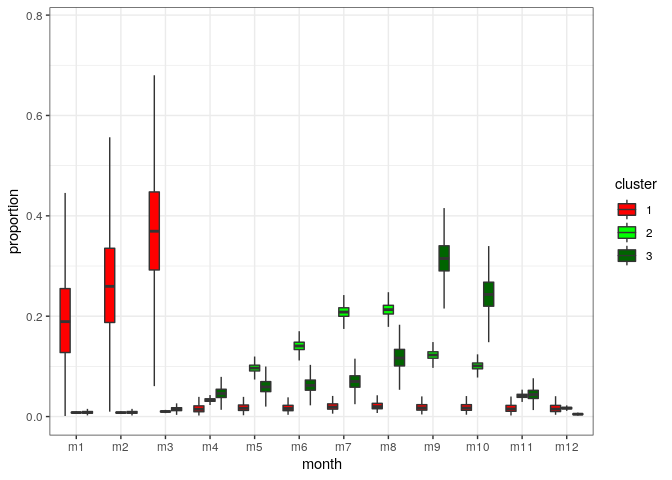
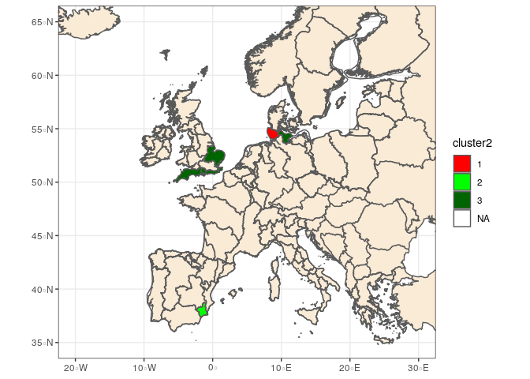
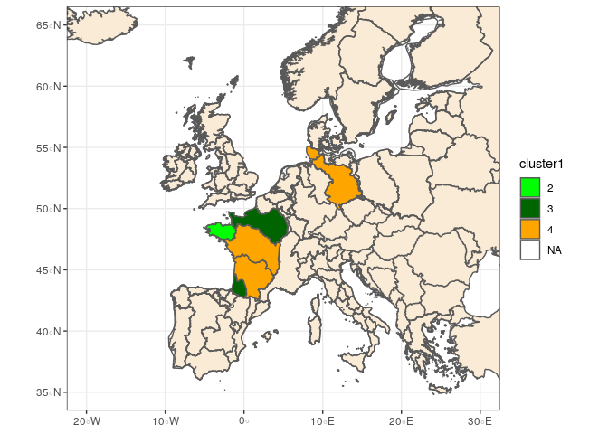
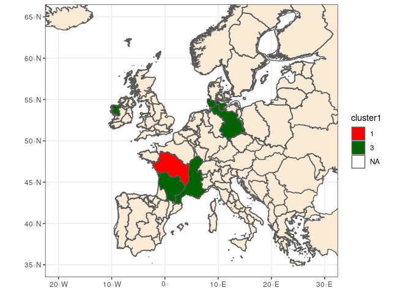
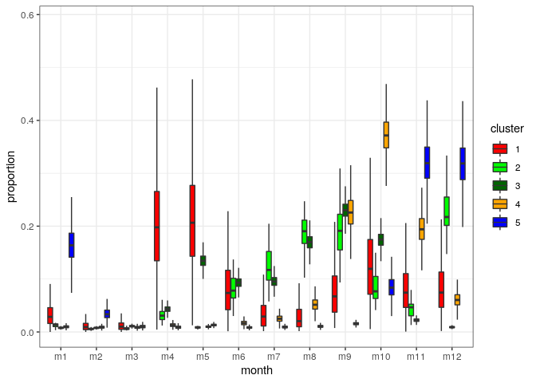
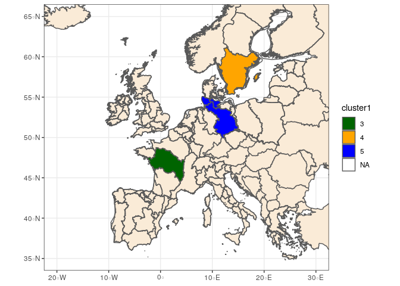
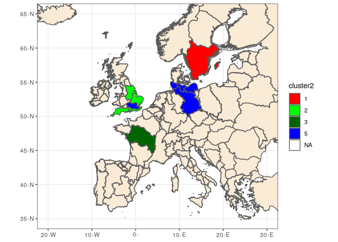
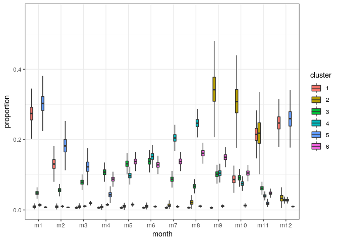

# Introduction
We start by loading the rdata provided by Cédric who has imported and edited all the xlsx files. He also provides a very good overview of the content [here](landings_seasonality.md). Based on this job, we will try to carry out a similar analysis as for [seasonality](jags_modelling.md). More specifically, we can use the same Bayesian model to make a clustering of time series. For each stage, we will build a data set that gives for each season, and each EMU (and perhaps habitat), the proportion of catches per month.

For convenience, we rename the data.frame with names consistent with the seasonality data.set


```r
res <- res %>%
  rename(das_month=month, das_value=value, das_year=year)
```

# Glass Eel
First, let's select data corresponding to glass eel stage.


```r
glass_eel <- subset(res, res$lfs_code=="G")

# we start by removing rows with only zero
all_zero <- glass_eel %>%	group_by(emu_nameshort,lfs_code,hty_code,das_year) %>%
		summarize(S=sum(das_value)) %>% 
    filter(S==0)

glass_eel <- glass_eel %>% 
	  anti_join(all_zero)
```

```
## Joining, by = c("das_year", "emu_nameshort", "lfs_code", "hty_code")
```

```r
#For glass eel, we aggregate data per habitat
glass_eel <- glass_eel %>%
  select(das_year, das_month, das_value, emu_nameshort, cou_code) %>%
  group_by(das_year, das_month, emu_nameshort, cou_code) %>%
  summarise(das_value=sum(das_value))
```

Similarly to seasonality, we will build season. For glass eels, seasons are rather consistent in whole Europe, so we use the same definition as in seasonality: Here, we split in october (starts of catches in Spain) and a season y will correspond to ostober - december y-1 and january to september y.


```r
glass_eel$season <- ifelse(glass_eel$das_month>9,
                             glass_eel$das_year+1,
                             glass_eel$das_year)
glass_eel$month_in_season <- as.factor(ifelse(glass_eel$das_month>9,
                                      glass_eel$das_month-9,
                                      glass_eel$das_month+3)) #1 stands for nov,

#we remove data from season 2020
glass_eel <- glass_eel %>%
  filter(season < 2020)
```

## Data selection
Now we should carry out data selection, more specifically, we want to eliminate rows with two many missing data, too much zero and to check whether there are no duplicates (though Cedric already did it)


```r
kept_seasons <- lapply(unique(glass_eel$emu_nameshort), function(s){
  sub_glass <- subset(glass_eel, glass_eel$emu_nameshort==s)
  good_coverage_wave(sub_glass, "G")
})
```

```
## [1] "For  ES_Astu  a good season should cover months: 11 to 4"
## [1] "For  ES_Cata  a good season should cover months: 10 to 4"
## [1] "For  FR_Adou  a good season should cover months: 11 to 3"
## [1] "For  FR_Arto  a good season should cover months: 1 to 4"
## [1] "For  FR_Bret  a good season should cover months: 12 to 4"
## [1] "For  FR_Garo  a good season should cover months: 11 to 4"
## [1] "For  FR_Loir  a good season should cover months: 12 to 4"
## [1] "For  FR_Sein  a good season should cover months: 1 to 5"
## [1] "For  ES_Basq  a good season should cover months: 11 to 2"
## [1] "For  GB_SouW  a good season should cover months: 2 to 6"
## [1] "For  GB_NorW  a good season should cover months: 2 to 7"
## [1] "For  GB_Seve  a good season should cover months: 3 to 6"
## [1] "For  GB_Wale  a good season should cover months: 2 to 6"
## [1] "For  ES_Mino  a good season should cover months: 11 to 3"
## [1] "For  ES_Vale  a good season should cover months: 12 to 3"
## [1] "For ES_MINH not possible to define a season"
## [1] "For  ES_Cant  a good season should cover months: 11 to 3"
```
Finally, here are the series kept given previous criterion.


```r
names(kept_seasons) <- unique(glass_eel$emu_nameshort)
kept_seasons[!sapply(kept_seasons,is.null)]
```

```
## $ES_Astu
##  [1] 2001 2002 2003 2004 2005 2006 2007 2008 2009 2010 2011 2012 2013 2014
## [15] 2015 2016 2017 2018 2019
## 
## $ES_Cata
##  [1] 2001 2002 2003 2004 2005 2006 2007 2008 2009 2010 2011 2012 2013 2014
## [15] 2015 2016 2017 2018 2019
## 
## $FR_Adou
##  [1] 2001 2002 2003 2004 2005 2006 2007 2008 2009 2010 2011 2012 2013 2014
## [15] 2015 2016 2017 2018
## 
## $FR_Arto
##  [1] 2000 2001 2002 2003 2004 2005 2006 2007 2008 2009 2010 2011 2012 2013
## [15] 2014 2015 2016 2017 2018
## 
## $FR_Bret
##  [1] 2001 2002 2003 2004 2005 2006 2007 2009 2010 2011 2012 2013 2014 2015
## [15] 2016 2017 2018
## 
## $FR_Garo
##  [1] 2001 2002 2003 2004 2005 2006 2007 2009 2010 2011 2012 2013 2014 2015
## [15] 2016 2017 2018
## 
## $FR_Loir
##  [1] 2001 2002 2003 2004 2005 2006 2007 2008 2009 2010 2011 2012 2013 2014
## [15] 2015 2016 2017 2018
## 
## $FR_Sein
##  [1] 2009 2010 2011 2012 2013 2014 2015 2016 2017 2018
## 
## $ES_Basq
##  [1] 2005 2006 2007 2008 2009 2010 2011 2012 2013 2014 2015 2016 2017 2018
## [15] 2019
## 
## $GB_SouW
## [1] 2005 2006 2007 2008 2009 2013
## 
## $GB_NorW
## [1] 2008
## 
## $GB_Seve
## [1] 2005 2006 2007 2008 2009
## 
## $GB_Wale
## [1] 2005 2006 2007 2008 2009
## 
## $ES_Mino
## [1] 2011 2012 2013 2014 2015 2016 2017 2018 2019
## 
## $ES_Vale
## [1] 2011 2012 2013 2014 2015 2016 2017 2018 2019
## 
## $ES_Cant
## [1] 2014 2015 2016 2017 2018 2019
```

## Data preparation
We carry out the same procedure as for seasonality. 


```r
glasseel_subset <- subset(glass_eel, 
                           mapply(function(season, series){
                             season %in% kept_seasons[[series]]
                           }, glass_eel$season, glass_eel$emu_nameshort))


glasseel_wide <- pivot_wider(data=glasseel_subset[, c("emu_nameshort",
                                                     "cou_code",
                                                     "season",
                                                     "das_month",
                                                     "das_value")],
                                names_from="das_month",
                                values_from="das_value")
names(glasseel_wide)[-(1:3)] <- paste("m",
                                       names(glasseel_wide)[-(1:3)],
                                       sep="")

###we count the number of zeros per lines to remove lines without enough
###fishes
data_poor <- data.frame(glasseel_wide$emu_nameshort,
                        glasseel_wide$season,
                  zero=rowSums(glasseel_wide[, -(1:3)] == 0 |
                                 is.na(glasseel_wide[, -(1:3)])),
           tot=rowSums(glasseel_wide[, -(1:3)], na.rm=TRUE))
data_poor %>% filter(zero > 9 | tot<30) #we remove years where we have less than 2 months
```

```
##   glasseel_wide.emu_nameshort glasseel_wide.season zero    tot
## 1                     GB_Wale                 2009    7  13.51
## 2                     FR_Arto                 2010   10 112.00
## 3                     ES_Vale                 2018   10   0.70
## 4                     ES_Vale                 2019   11  39.00
```

```r
glasseel_wide <- glasseel_wide[data_poor$zero < 10 & data_poor$tot>30, ]
```

It leads to a dataset with 189 rows. 

We now replace NA value per zero since we selected our dataseries with missing months corresponding to insignificant months / closed months, and we compute proportions per month for each year.


```r
glasseel_wide <- glasseel_wide %>%
  replace_na(replace=list(m1=0,
                          m2=0,
                          m3=0,
                          m4=0,
                          m5=0,
                          m6=0,
                          m7=0,
                          m8=0,
                          m9=0,
                          m10=0,
                          m11=0,
                          m12=0))
glasseel_wide[, -(1:3)] <- glasseel_wide[, -(1:3)] + 1e-3
total_catch_year <- rowSums(glasseel_wide[, paste("m", 1:12, sep="")])
glasseel_wide <- glasseel_wide %>%
  mutate_at(.vars=paste("m",1:12,sep=""),function(x) x/total_catch_year)
```

The Commission asks us to compare the pattern before and after 2007, probably to see the effect of the Eel Regulation. It is therefore necessary to build a period index. However, since most countries implemented their EMPs only in 2009/2010, we split in 2010.


```r
glasseel_wide$period <- ifelse(glasseel_wide$season>2009,
                                  2,
                                  1)

table(glasseel_wide$period,
       glasseel_wide$emu_nameshort)
```

```
##    
##     ES_Astu ES_Basq ES_Cant ES_Cata ES_Mino ES_Vale FR_Adou FR_Arto
##   1       9       5       0       9       0       0       9      10
##   2      10      10       6      10       9       7       9       8
##    
##     FR_Bret FR_Garo FR_Loir FR_Sein GB_NorW GB_Seve GB_SouW GB_Wale
##   1       8       8       9       1       1       5       5       4
##   2       9       9       9       9       0       0       1       0
```
The situation is well balanced between the two periods.


## Running the model

```r
group <- as.integer(interaction(glasseel_wide$emu_nameshort,
                                            glasseel_wide$period,
                                            drop=TRUE))
nb_occ_group <- table(group)
y <-as.matrix(glasseel_wide[, paste("m", 1:12, sep="")])
```

Now, we make a loop to select the number of clusters based on a DIC criterion


```r
cl <- makeCluster(3, 'FORK')
comparison <- parSapply(cl, 2:7,
       function(nbclus){
         mydata <- build_data(nbclus)
         adapted <- FALSE
         while (!adapted){
           tryCatch({
             runjags.options(adapt.incomplete="error")
             res <- run.jags("jags_model.txt", monitor= c("deviance",
                                                          "alpha_group",
                                                          "cluster"),
                        summarise=FALSE, adapt=40000, method="parallel",
                        sample=2000,burnin=100000,n.chains=1,
                        inits=generate_init(nbclus, mydata)[[1]],
                        data=mydata)
                        adapted <- TRUE
                        res_mat <- as.matrix(as.mcmc.list(res))
                        silhouette <- median(compute_silhouette(res_mat))
                        nbused <- apply(res_mat, 1, function(iter){
                          length(table(iter[grep("cluster",
                                                 names(iter))]))
                        })
                        dic <- mean(res_mat[,1])+0.5*var(res_mat[,1])
                        stats <- c(dic,silhouette,mean(nbused))
                  }, error=function(e) {
                    print(paste("not adapted, restarting nbclus",nbclus))
                    }
                  )
         }
         stats
      })
stopCluster(cl)
best_glasseel_landings <- data.frame(nbclus=2:(ncol(comparison)+1),
                                              dic=comparison[1, ],
                                              silhouette=comparison[2, ],
                                     used=comparison[3,])
save(best_glasseel_landings, file="glasseel_landings_jags.rdata")
```


```r
load("best_glasseel_landings")
best_glasseel_landings
```

```
##   nbclus       dic
## 1      2 -17814.18
## 2      3 -17640.64
## 3      4 -17336.52
## 4      5 -16888.02
## 5      6 -16522.37
## 6      7 -16043.03
```


Given that the number of used clusters do not increase much after 4 and that the silhouette tends to decrease, we use 4 clusters.


```r
nbclus <- 4
mydata <-build_data(4)


adapted <- FALSE
while (!adapted){
   tryCatch({
      runjags.options(adapt.incomplete="error")
      myfit_glasseel_landings <- run.jags("jags_model.txt", monitor= c("cluster", "esp", "alpha_group",
                                            "cluster", "centroid",
                                            "centroid_group",
                                            "distToClust", "duration_clus",
                                            "duration_group",
                                            "lambda","id_cluster",
                                            "centroid"),
                      summarise=FALSE, adapt=50000, method="parallel",
                      sample=10000,burnin=200000,n.chains=1, thin=5,
                      inits=generate_init(nbclus, mydata)[[1]], data=mydata)
      adapted <- TRUE
    }, error=function(e) {
       print(paste("not adapted, restarting nbclus",nbclus))
    })
}

save(myfit_glasseel_landings, best_glasseel_landings,
     file="glasseel_landings_jags.rdata")
```

## Results
Once fitted, we can plot monthly pattern per cluster

```r
load("glasseel_landings_jags.rdata")
nbclus <- 4
mydata <-build_data(4)
get_pattern_month <- function(res,type="cluster"){
  res_mat <- as.matrix(as.mcmc.list(res, add.mutate=FALSE))
  if (type=="cluster"){
    sub_mat <- as.data.frame(res_mat[,grep("esp",colnames(res_mat))])
  }
  sub_mat <- sub_mat %>% 
    pivot_longer(cols=1:ncol(sub_mat),
                 names_to="param",
                 values_to="proportion")
  tmp <- lapply(as.character(sub_mat$param),function(p) strsplit(p,"[[:punct:]]"))
  sub_mat$cluster<-as.factor(
    as.integer(lapply(tmp, function(tt) tt[[1]][2])))
  sub_mat$month <- as.character(lapply(tmp,
                                       function(tt) paste("m",
                                                          tt[[1]][3],
                                                          sep="")))
  sub_mat$month <- factor(sub_mat$month, levels=paste("m", 1:12, sep=""))
  sub_mat
}

pat <-get_pattern_month(myfit_glasseel_landings)
ggplot(pat,aes(x=month,y=proportion))+
  geom_boxplot(aes(fill=cluster),outlier.shape=NA) +
  theme_bw()
```

<!-- -->

We compute some statistics to characterize the clusters.

```r
t(as.data.frame(characteristics(myfit_glasseel_landings, 4)))
```

```
##    cluster duration duration2.5 duration97.5 centroid  centroid2.5
## V1 1       4        3           4            1.399431  1.339783   
## V2 2       6        4           7            0.5154167 10.93206   
## V3 3       3        3           3            0.3080568 0.2565396  
## V4 4       3        3           3            3.254867  3.198507   
##    centroid97.5
## V1 1.460933    
## V2 2.281422    
## V3 0.3637151   
## V4 3.310297
```
Duration indicates the minimum number of months that covers 80% of the wave (1st column is the median, and the 2 next one quantiles 2.5% and 97.5% of credibility intervals). Centroid is the centroid of the migration wave (e.g. 11.5 would indicate a migration centred around mid november). The first column is the median and the two next one the quantiles 2.5 and 97.5%.

Clusters 3 starts in autum and last still january. Cluster 1 is shifter one month later and lasts longer. Cluster corresponds to catches in march/may. Cluster 2 is very flat and probably not used.

We can also look at the belonging of the different groups.

```r
get_pattern_month <- function(res,mydata){
  
  groups <- interaction(glasseel_wide$emu_nameshort,
                                            glasseel_wide$period,
                                            drop=TRUE)
  group_name <- levels(groups)
  tmp <- strsplit(as.character(group_name),
                  "\\.")
  ser <- as.character(lapply(tmp,function(tt){
    tt[1]
  }))
  period <- as.character(lapply(tmp,function(tt){
    tt[2]
  }))
  res_mat <- as.matrix(as.mcmc.list(res,add.mutate=FALSE))
  
  clus <- t(sapply(seq_len(length(unique(groups))), function(id){
    name_col <- paste("cluster[",id,"]",sep="")
    freq <- table(res_mat[,name_col])
    max_class <- names(freq)[order(freq,decreasing=TRUE)[1]]
    c(max_class,freq[as.character(1:nbclus)])
  }))
  storage.mode(clus) <- "numeric"
  classes <- as.data.frame(clus)
  names(classes) <- c("cluster", paste("clus",seq_len(nbclus),sep=""))
  cbind.data.frame(data.frame(ser=ser, period=period),
                   classes)
}

myclassif <- get_pattern_month(myfit_glasseel_landings)
print(myclassif[order(myclassif$cluster),])
```

```
##        ser period cluster clus1 clus2 clus3 clus4
## 1  ES_Astu      1       1  8937    NA  1063    NA
## 6  FR_Bret      1       1 10000    NA    NA    NA
## 7  FR_Garo      1       1 10000    NA    NA    NA
## 8  FR_Loir      1       1 10000    NA    NA    NA
## 19 ES_Vale      2       1 10000    NA    NA    NA
## 22 FR_Bret      2       1 10000    NA    NA    NA
## 23 FR_Garo      2       1 10000    NA    NA    NA
## 24 FR_Loir      2       1 10000    NA    NA    NA
## 2  ES_Basq      1       3    NA    NA 10000    NA
## 3  ES_Cata      1       3    NA    NA 10000    NA
## 4  FR_Adou      1       3    NA    NA 10000    NA
## 14 ES_Astu      2       3    NA    NA 10000    NA
## 15 ES_Basq      2       3    NA    NA 10000    NA
## 16 ES_Cant      2       3    NA    NA 10000    NA
## 17 ES_Cata      2       3    NA    NA 10000    NA
## 18 ES_Mino      2       3    NA    NA 10000    NA
## 20 FR_Adou      2       3    NA    NA 10000    NA
## 5  FR_Arto      1       4    NA    NA    NA 10000
## 9  FR_Sein      1       4    NA    NA    NA 10000
## 10 GB_NorW      1       4    NA    NA    NA 10000
## 11 GB_Seve      1       4    NA    NA    NA 10000
## 12 GB_SouW      1       4    NA    NA    NA 10000
## 13 GB_Wale      1       4    NA    NA    NA 10000
## 21 FR_Arto      2       4    NA    NA    NA 10000
## 25 FR_Sein      2       4    NA    NA    NA 10000
## 26 GB_SouW      2       4    NA    NA    NA 10000
```
The spatial pattern is obvious in the results. Interestingly, we saw an EMU that change cluster between period and this seem to correspond to management measures that have effectively shorten the fishing season.


```r
library(sf)
```

```
## Linking to GEOS 3.7.1, GDAL 2.4.2, PROJ 5.2.0
```

```
## WARNING: different compile-time and runtime versions for GEOS found:
```

```
## Linked against: 3.7.1-CAPI-1.11.1 27a5e771 compiled against: 3.7.0-CAPI-1.11.0
```

```
## It is probably a good idea to reinstall sf, and maybe rgeos and rgdal too
```

```r
library(RPostgreSQL)
```

```
## Loading required package: DBI
```

```r
cols <- c("1" = "red", "2"= "green","3" = "darkgreen", "4" = "orange",  "5" = "blue", "6"="grey", "7"="yellow")
con<-dbConnect(PostgreSQL(),host="localhost",dbname="wgeel_old",user="hilaire")
emu <- st_read(con,query="select * from carto.emu")
myclassif_p1 <- subset(myclassif, myclassif$period == 1)
myclassif_p2 <- subset(myclassif, myclassif$period == 2)
emu$cluster1 <- factor(myclassif_p1$cluster[match(emu$name_short,
                                                  substr(myclassif_p1$ser,1,nchar(as.character(myclassif_p1$ser))))], levels=1:7)

emu$cluster2 <- factor(myclassif_p2$cluster[match(emu$name_short,
                                                substr(myclassif_p2$ser,1,nchar(as.character(myclassif_p1$ser))))],
                       levels=1:7)
cou <- st_read("/mnt/SIG/01-REFERENTIELS/LIMITES_ADMINISTRATIVES_monde/european_countries_WGS84.shp")
```

```
## Reading layer `european_countries_WGS84' from data source `/mnt/SIG/01-REFERENTIELS/LIMITES_ADMINISTRATIVES_monde/european_countries_WGS84.shp' using driver `ESRI Shapefile'
## Simple feature collection with 54 features and 1 field
## geometry type:  MULTIPOLYGON
## dimension:      XY
## bbox:           xmin: -31.26575 ymin: 32.39748 xmax: 69.07032 ymax: 81.85737
## epsg (SRID):    4326
## proj4string:    +proj=longlat +datum=WGS84 +no_defs
```

```r
cou <- st_transform(cou, crs=4326)
ggplot(data = cou) +  geom_sf(fill= "antiquewhite") +
		geom_sf(data=emu,aes(fill=cluster1)) + scale_fill_manual(values=cols)+
  theme_bw() +xlim(-20,30) + ylim(35,65) 
```

<!-- -->

```r
ggplot(data = cou) +  geom_sf(fill= "antiquewhite") +
		geom_sf(data=emu,aes(fill=cluster2)) + scale_fill_manual(values=cols)+
  theme_bw() +xlim(-20,30) + ylim(35,65)  
```

<!-- -->

# Yellow
First, let's select data corresponding to yellow stage.


```r
yellow_eel <- subset(res, res$lfs_code=="Y")

# we start by removing rows with only zero
all_zero <- yellow_eel %>%	group_by(emu_nameshort,lfs_code,hty_code,das_year) %>%
		summarize(S=sum(das_value)) %>% 
    filter(S==0)

yellow_eel <- yellow_eel %>% 
	  anti_join(all_zero)
```

```
## Joining, by = c("das_year", "emu_nameshort", "lfs_code", "hty_code")
```

```r
table(yellow_eel$hty_code)
```

```
## 
##    C    F   FC  FTC   MO    T 
##  645 1212  463   72  225  942
```

```r
#We have many data, so we remove "FC" and "FTC" which are weirds mixes
yellow_eel <- yellow_eel %>%
  filter(!hty_code %in% c("FTC", "FC"))

#in this analysis, the unit will correspond to EMU / habitat so we create 
#corresponding column
yellow_eel$emu <- yellow_eel$emu_nameshort
yellow_eel$emu_nameshort <- paste(yellow_eel$emu_nameshort,
                                   yellow_eel$hty_code, sep="_")

#There are some duplicates for IE_West_F that should be summed up according to
#Russel
summed_up_IE <-yellow_eel %>%
  filter(yellow_eel$emu_nameshort=="IE_West_F") %>%
  group_by(das_year,das_month) %>%
  summarize(das_value=sum(das_value))

yellow_eel <- yellow_eel %>% 
  distinct(das_year,das_month,emu_nameshort, .keep_all = TRUE)

yellow_eel[yellow_eel$emu_nameshort=="IE_West_F",
          c("das_year","das_month","das_value") ] <- summed_up_IE
```

Similarly to seasonality, we will build season. We reuse the procedure made for silver eel and yellow eel seasonality, i.e. defining seasons per emu, with the season starting at the month with minimum landings. The month with lowest catch fmin define the beggining of the season (month_in_season=1) and season y stands for the 12 months from fmin y (e.g., if lowest migration is in december, season ranges from december to november, and season y denotes season from december y to november y+1).


```r
#creating season
yelloweel <- do.call("rbind.data.frame",
                     lapply(unique(yellow_eel$emu_nameshort),
                            function(s)
                              season_creation(yellow_eel[yellow_eel$emu_nameshort==s,])))
months_peak_per_series<- unique(yelloweel[,c("emu_nameshort","peak_month")])

#large variety in the month with peak of catches among EMU / habitat
table(months_peak_per_series$peak_month)
```

```
## 
##  4  5  6  7  8  9 10 12 
##  2  7  8 12  6  5  1  2
```

```r
#we remove data from season 2020
yelloweel <- yelloweel %>%
  filter(season < 2020)
```


##Coastal/marine waters
### Data selection
Now we should carry out data selection, more specifically, we want to eliminate rows with two many missing data, too much zero and to check whether there are no duplicates (though Cedric already did it). We mixed coastal and marine habitats since there are only one EMU with landings in marine habitat


```r
yelloweel_coatal <- subset(yelloweel, yelloweel$hty_code %in% c("C", "MO"))
kept_seasons <- lapply(unique(yelloweel_coatal$emu_nameshort), function(s){
  sub_yellow <- subset(yelloweel_coatal, yelloweel_coatal$emu_nameshort==s)
  kept <- good_coverage_wave(sub_yellow)
  #we remove season in which we have less than 50 kg of landings
  if(!is.null(kept))
    kept <- kept[sapply(kept,function(k)
      sum(sub_yellow$das_value[sub_yellow$season==k],na.rm=TRUE)>50)]
  if (length(kept) == 0) kept <- NULL
  kept
})
```

```
## [1] "For  DE_Eide_C  a good season should cover months: 5 to 11"
## [1] "For  DE_Schl_C  a good season should cover months: 5 to 11"
## [1] "For  DK_total_MO  a good season should cover months: 4 to 11"
## [1] "For  ES_Murc_C  a good season should cover months: 11 to 3"
## [1] "For  GB_Angl_C  a good season should cover months: 5 to 11"
## [1] "For  GB_NorW_C  a good season should cover months: 5 to 8"
## [1] "For  GB_SouE_C  a good season should cover months: 4 to 10"
## [1] "For  GB_SouW_C  a good season should cover months: 4 to 11"
## [1] "For  GB_Tham_C  a good season should cover months: 5 to 4"
## [1] "For  SE_East_C  a good season should cover months: 4 to 11"
## [1] "For  SE_West_C  a good season should cover months: 5 to 11"
```
Finally, here are the series kept given previous criterion.


```r
names(kept_seasons) <- unique(yelloweel_coatal$emu_nameshort)
kept_seasons[!sapply(kept_seasons,is.null)]
```

```
## $DE_Eide_C
##  [1] 2009 2010 2011 2012 2013 2014 2015 2016 2017 2018
## 
## $DE_Schl_C
##  [1] 2009 2010 2011 2012 2013 2014 2015 2016 2017 2018
## 
## $DK_total_MO
##  [1] 2000 2001 2002 2003 2004 2005 2006 2007 2008 2009 2010 2011 2012 2013
## [15] 2014 2015 2016 2017 2018 2019
## 
## $ES_Murc_C
## [1] 2014 2016
## 
## $GB_Angl_C
## [1] 2014 2015 2016 2017 2018
## 
## $GB_SouE_C
## [1] 2013 2014 2015 2016 2017
## 
## $GB_SouW_C
## [1] 2013 2014 2015 2016 2017
## 
## $SE_East_C
##  [1] 2000 2001 2002 2003 2004 2005 2006 2007 2008 2012 2013
## 
## $SE_West_C
## [1] 2000 2001 2002 2003 2004 2005 2006 2007 2008
```

### Data preparation
We carry out the same procedure as for seasonality. 


```r
yelloweel_coastal_subset <- subset(yelloweel_coatal, 
                           mapply(function(season, series){
                             season %in% kept_seasons[[series]]
                           }, yelloweel_coatal$season, yelloweel_coatal$emu_nameshort))


yelloweel_coastal_wide <- pivot_wider(data=yelloweel_coastal_subset[, c("emu_nameshort",
                                                     "cou_code",
                                                     "season",
                                                     "das_month",
                                                     "das_value")],
                                names_from="das_month",
                                values_from="das_value")
names(yelloweel_coastal_wide)[-(1:3)] <- paste("m",
                                       names(yelloweel_coastal_wide)[-(1:3)],
                                       sep="")

###we count the number of zeros per lines to remove lines without enough
###fishes
data_poor <- data.frame(yelloweel_coastal_wide$emu_nameshort,
                        yelloweel_coastal_wide$season,
                  zero=rowSums(yelloweel_coastal_wide[, -(1:3)] == 0 |
                                 is.na(yelloweel_coastal_wide[, -(1:3)])),
           tot=rowSums(yelloweel_coastal_wide[, -(1:3)], na.rm=TRUE))
data_poor %>% filter(zero > 9) #we remove years where we have less than 2 months
```

```
##   yelloweel_coastal_wide.emu_nameshort yelloweel_coastal_wide.season zero
## 1                            ES_Murc_C                          2014   10
## 2                            GB_SouE_C                          2013   11
##    tot
## 1 2623
## 2   64
```

```r
yelloweel_coastal_wide <- yelloweel_coastal_wide[data_poor$zero < 10, ]
```

It leads to a dataset with 75 rows. 

We now replace NA value per zero since we selected our dataseries with missing months corresponding to insignificant months / closed months, and we compute proportions per month for each year.


```r
yelloweel_coastal_wide <- yelloweel_coastal_wide %>%
  replace_na(replace=list(m1=0,
                          m2=0,
                          m3=0,
                          m4=0,
                          m5=0,
                          m6=0,
                          m7=0,
                          m8=0,
                          m9=0,
                          m10=0,
                          m11=0,
                          m12=0))
yelloweel_coastal_wide[, -(1:3)] <- yelloweel_coastal_wide[, -(1:3)] + 1e-3
total_catch_year <- rowSums(yelloweel_coastal_wide[, paste("m", 1:12, sep="")])
yelloweel_coastal_wide <- yelloweel_coastal_wide %>%
  mutate_at(.vars=paste("m",1:12,sep=""),function(x) x/total_catch_year)
```

The Commission asks us to compare the pattern before and after 2007, probably to see the effect of the Eel Regulation. It is therefore necessary to build a period index. However, since most countries implemented their EMPs only in 2009/2010, we split in 2010.


```r
yelloweel_coastal_wide$period <- ifelse(yelloweel_coastal_wide$season>2009,
                                  2,
                                  1)

table(yelloweel_coastal_wide$period,
       yelloweel_coastal_wide$emu_nameshort)
```

```
##    
##     DE_Eide_C DE_Schl_C DK_total_MO ES_Murc_C GB_Angl_C GB_SouE_C
##   1         1         1          10         0         0         0
##   2         9         9          10         1         5         4
##    
##     GB_SouW_C SE_East_C SE_West_C
##   1         0         9         9
##   2         5         2         0
```
The situation is not well balanced. Most EMU which have data in periods 1 don't have data in period 2 and conversely.


### Running the model

```r
group <- as.integer(interaction(yelloweel_coastal_wide$emu_nameshort,
                                            yelloweel_coastal_wide$period,
                                            drop=TRUE))
nb_occ_group <- table(group)
y <-as.matrix(yelloweel_coastal_wide[, paste("m", 1:12, sep="")])
```

Now, we make a loop to select the number of clusters based on a DIC criterion


```r
cl <- makeCluster(3, 'FORK')
comparison <- parSapply(cl,2:7,
       function(nbclus){
         mydata <- build_data(nbclus)
         adapted <- FALSE
         while (!adapted){
           tryCatch({
             runjags.options(adapt.incomplete="error")
             res <- run.jags("jags_model.txt", monitor= c("deviance",
                                                          "alpha_group",
                                                          "cluster"),
                        summarise=FALSE, adapt=40000, method="parallel",
                        sample=2000,burnin=100000,n.chains=1,
                        inits=generate_init(nbclus, mydata)[[1]],
                        data=mydata)
                        adapted <- TRUE
                        res_mat <- as.matrix(as.mcmc.list(res))
                        silhouette <- median(compute_silhouette(res_mat))
                        nbused <- apply(res_mat, 1, function(iter){
                          length(table(iter[grep("cluster",
                                                 names(iter))]))
                        })
                        dic <- mean(res_mat[,1])+0.5*var(res_mat[,1])
                        stats <- c(dic,silhouette,mean(nbused))
                  }, error=function(e) {
                    print(paste("not adapted, restarting nbclus",nbclus))
                    }
                  )
         }
         stats
      })
stopCluster(cl)
best_yelloweel_coastal_landings <- data.frame(nbclus=2:(ncol(comparison)+1),
                                              dic=comparison[1, ],
                                              silhouette=comparison[2, ],
                                              used=comparison[3, ])
save(best_yelloweel_coastal_landings, file="yelloweel_coastal_landings_jags.rdata")
```


```r
load("yelloweel_coastal_landings_jags.rdata")
best_yelloweel_coastal_landings
```

```
##   nbclus       dic silhouette   used
## 1      2 -13342.16  0.5919482 2.0000
## 2      3 -13469.98  0.4037846 3.0000
## 3      4 -13446.26  0.3970586 3.0005
## 4      5 -13513.30  0.3042887 4.0025
## 5      6 -13596.51  0.1050584 5.0035
## 6      7 -13573.80  0.1242397 5.0020
```

While 7 gives the best overall DIC, the DIC is rather flat and the number of cluster used does not evolve much so we stop at 3. 


```r
nbclus <- 3
mydata <-build_data(3)
adapted <- FALSE
while (!adapted){
   tryCatch({
      runjags.options(adapt.incomplete="error")
      myfit_yelloweel_coastal_landings <- run.jags("jags_model.txt", monitor= c("cluster", "esp", "alpha_group",
                                            "cluster", "centroid",
                                            "centroid_group",
                                            "distToClust", "duration_clus",
                                            "duration_group",
                                            "lambda","id_cluster",
                                            "centroid"),
                      summarise=FALSE, adapt=20000, method="parallel",
                      sample=10000,burnin=200000,n.chains=1, thin=5,
                      inits=generate_init(nbclus, mydata)[[1]], data=mydata)
      adapted <- TRUE
    }, error=function(e) {
       print(paste("not adapted, restarting nbclus",nbclus))
    })
}


save(myfit_yelloweel_coastal_landings, best_yelloweel_coastal_landings,
     file="yelloweel_coastal_landings_jags.rdata")
```

## Results
Once fitted, we can plot monthly pattern per cluster

```r
load("yelloweel_coastal_landings_jags.rdata")
nbclus <- 3
mydata <-build_data(3)
get_pattern_month <- function(res,type="cluster"){
  res_mat <- as.matrix(as.mcmc.list(res, add.mutate=FALSE))
  if (type=="cluster"){
    sub_mat <- as.data.frame(res_mat[,grep("esp",colnames(res_mat))])
  }
  sub_mat <- sub_mat %>% 
    pivot_longer(cols=1:ncol(sub_mat),
                 names_to="param",
                 values_to="proportion")
  tmp <- lapply(as.character(sub_mat$param),function(p) strsplit(p,"[[:punct:]]"))
  sub_mat$cluster<-as.factor(
    as.integer(lapply(tmp, function(tt) tt[[1]][2])))
  sub_mat$month <- as.character(lapply(tmp,
                                       function(tt) paste("m",
                                                          tt[[1]][3],
                                                          sep="")))
  sub_mat$month <- factor(sub_mat$month, levels=paste("m", 1:12, sep=""))
  sub_mat
}

pat <-get_pattern_month(myfit_yelloweel_coastal_landings)
ggplot(pat,aes(x=month,y=proportion))+
  geom_boxplot(aes(fill=cluster),outlier.shape=NA) +
  theme_bw()
```

<!-- -->
Clusters 1 peaks summer. Clusters 2 peaks in winter, cluster 3 lasts from may to november.

We compute some statistics to characterize the clusters.

```r
t(as.data.frame(characteristics(myfit_yelloweel_coastal_landings, 3)))
```

```
##    cluster duration duration2.5 duration97.5 centroid centroid2.5
## V1 1       5        4           6            8.590768 8.349099   
## V2 2       3        2           4            2.54497  2.12548    
## V3 3       6        5           6            7.640922 7.550818   
##    centroid97.5
## V1 8.832279    
## V2 2.978442    
## V3 7.732446
```
Duration indicates the minimum number of months that covers 80% of the wave (1st column is the median, and the 2 next one quantiles 2.5% and 97.5% of credibility intervals). Centroid is the centroid of the migration wave (e.g. 11.5 would indicate a migration centred around mid november). The first column is the median and the two next one the quantiles 2.5 and 97.5%.


We can also look at the belonging of the different groups.

```r
get_pattern_month <- function(res,mydata){
  
  groups <- interaction(yelloweel_coastal_wide$emu_nameshort,
                                            yelloweel_coastal_wide$period,
                                            drop=TRUE)
  group_name <- levels(groups)
  tmp <- strsplit(as.character(group_name),
                  "\\.")
  ser <- as.character(lapply(tmp,function(tt){
    tt[1]
  }))
  period <- as.character(lapply(tmp,function(tt){
    tt[2]
  }))
  res_mat <- as.matrix(as.mcmc.list(res,add.mutate=FALSE))
  
  clus <- t(sapply(seq_len(length(unique(groups))), function(id){
    name_col <- paste("cluster[",id,"]",sep="")
    freq <- table(res_mat[,name_col])
    max_class <- names(freq)[order(freq,decreasing=TRUE)[1]]
    c(max_class,freq[as.character(1:nbclus)])
  }))
  storage.mode(clus) <- "numeric"
  classes <- as.data.frame(clus)
  names(classes) <- c("cluster", paste("clus",seq_len(nbclus),sep=""))
  cbind.data.frame(data.frame(ser=ser, period=period),
                   classes)
}

myclassif <- get_pattern_month(myfit_yelloweel_coastal_landings)
print(myclassif[order(myclassif$cluster),])
```

```
##            ser period cluster clus1 clus2 clus3
## 1    DE_Eide_C      1       1  9801    NA   199
## 6    DE_Eide_C      2       1 10000    NA    NA
## 9    ES_Murc_C      2       2    NA 10000    NA
## 2    DE_Schl_C      1       3   213    NA  9787
## 3  DK_total_MO      1       3    NA    NA 10000
## 4    SE_East_C      1       3    NA    NA 10000
## 5    SE_West_C      1       3    NA    NA 10000
## 7    DE_Schl_C      2       3    NA    NA 10000
## 8  DK_total_MO      2       3    NA    NA 10000
## 10   GB_Angl_C      2       3    NA    NA 10000
## 11   GB_SouE_C      2       3    NA    NA 10000
## 12   GB_SouW_C      2       3    NA    NA 10000
## 13   SE_East_C      2       3    NA    NA 10000
```
In fact, nearly all EMUs fall in cluster 3. Cluster 2 corresponds only to ES_Murc and cluster 1 to DE_Eide.


```r
library(sf)
library(RPostgreSQL)
cols <- c("1" = "red", "2"= "green","3" = "darkgreen", "4" = "orange",  "5" = "blue", "6"="grey", "7"="yellow")
con<-dbConnect(PostgreSQL(),host="localhost",dbname="wgeel_old",user="hilaire")
emu <- st_read(con,query="select * from carto.emu")
myclassif_p1 <- subset(myclassif, myclassif$period == 1)
myclassif_p2 <- subset(myclassif, myclassif$period == 2)
emu$cluster1 <- factor(myclassif_p1$cluster[match(emu$name_short,
                                                  substr(myclassif_p1$ser,1,nchar(as.character(myclassif_p1$ser))-2))],
                       levels=1:7)
emu$cluster2 <- factor(myclassif_p2$cluster[match(emu$name_short,
                                                substr(myclassif_p2$ser,1,nchar(as.character(myclassif_p1$ser))-2))],
                       levels=1:7)
cou <- st_read("/mnt/SIG/01-REFERENTIELS/LIMITES_ADMINISTRATIVES_monde/european_countries_WGS84.shp")
```

```
## Reading layer `european_countries_WGS84' from data source `/mnt/SIG/01-REFERENTIELS/LIMITES_ADMINISTRATIVES_monde/european_countries_WGS84.shp' using driver `ESRI Shapefile'
## Simple feature collection with 54 features and 1 field
## geometry type:  MULTIPOLYGON
## dimension:      XY
## bbox:           xmin: -31.26575 ymin: 32.39748 xmax: 69.07032 ymax: 81.85737
## epsg (SRID):    4326
## proj4string:    +proj=longlat +datum=WGS84 +no_defs
```

```r
cou <- st_transform(cou, crs=4326)
ggplot(data = cou) +  geom_sf(fill= "antiquewhite") +
		geom_sf(data=emu,aes(fill=cluster1)) + scale_fill_manual(values=cols)+
  theme_bw() +xlim(-20,30) + ylim(35,65) 
```

<!-- -->

```r
ggplot(data = cou) +  geom_sf(fill= "antiquewhite") +
		geom_sf(data=emu,aes(fill=cluster2)) + scale_fill_manual(values=cols)+
  theme_bw() +xlim(-20,30) + ylim(35,65)  
```

<!-- -->


##transitional waters
### Data selection
Now we should carry out data selection, more specifically, we want to eliminate rows with two many missing data, too much zero and to check whether there are no duplicates (though Cedric already did it)


```r
yelloweel_transitional <- subset(yelloweel, yelloweel$hty_code =="T")
kept_seasons <- lapply(unique(yelloweel_transitional$emu_nameshort), function(s){
  sub_yellow <- subset(yelloweel_transitional, yelloweel_transitional$emu_nameshort==s)
  kept <- good_coverage_wave(sub_yellow)
  #we remove season in which we have less than 50 kg of landings
  if(!is.null(kept))
    kept <- kept[sapply(kept,function(k)
      sum(sub_yellow$das_value[sub_yellow$season==k],na.rm=TRUE)>50)]
  if (length(kept) == 0) kept <- NULL
  kept
})
```

```
## [1] "For  DE_Eide_T  a good season should cover months: 4 to 11"
## [1] "For  DE_Elbe_T  a good season should cover months: 4 to 11"
## [1] "For  FR_Adou_T  a good season should cover months: 4 to 8"
## [1] "For  FR_Arto_T  a good season should cover months: 6 to 11"
## [1] "For  FR_Bret_T  a good season should cover months: 3 to 9"
## [1] "For  FR_Cors_T  a good season should cover months: 3 to 11"
## [1] "For  FR_Garo_T  a good season should cover months: 4 to 11"
## [1] "For  FR_Loir_T  a good season should cover months: 5 to 11"
## [1] "For  FR_Sein_T  a good season should cover months: 4 to 12"
## [1] "For GB_Dee_T not possible to define a season"
## [1] "For  NO_total_T  a good season should cover months: 5 to 11"
```
Finally, here are the series kept given previous criterion.


```r
names(kept_seasons) <- unique(yelloweel_transitional$emu_nameshort)
kept_seasons[!sapply(kept_seasons,is.null)]
```

```
## $DE_Eide_T
##  [1] 2009 2010 2011 2012 2013 2014 2015 2016 2017 2018
## 
## $DE_Elbe_T
##  [1] 2009 2010 2011 2012 2013 2014 2015 2016 2017 2018
## 
## $FR_Adou_T
## [1] 2009 2011 2013 2014 2015 2016 2018
## 
## $FR_Arto_T
## [1] 2009
## 
## $FR_Bret_T
##  [1] 2009 2010 2011 2012 2013 2014 2015 2016 2017 2018
## 
## $FR_Cors_T
## [1] 2010 2011 2012 2013 2014 2015 2016 2017 2018
## 
## $FR_Garo_T
##  [1] 2009 2010 2011 2012 2013 2014 2015 2016 2017 2018
## 
## $FR_Loir_T
##  [1] 2009 2010 2011 2012 2013 2014 2015 2016 2017 2018
## 
## $FR_Sein_T
## [1] 2009 2010 2015
## 
## $NO_total_T
## [1] 2001
```

### Data preparation
We carry out the same procedure as for seasonality. 


```r
yelloweel_transitional_subset <- subset(yelloweel_transitional, 
                           mapply(function(season, series){
                             season %in% kept_seasons[[series]]
                           }, yelloweel_transitional$season, yelloweel_transitional$emu_nameshort))


yelloweel_transitional_wide <- pivot_wider(data=yelloweel_transitional_subset[, c("emu_nameshort",
                                                     "cou_code",
                                                     "season",
                                                     "das_month",
                                                     "das_value")],
                                names_from="das_month",
                                values_from="das_value")
names(yelloweel_transitional_wide)[-(1:3)] <- paste("m",
                                       names(yelloweel_transitional_wide)[-(1:3)],
                                       sep="")

###we count the number of zeros per lines to remove lines without enough
###fishes
data_poor <- data.frame(yelloweel_transitional_wide$emu_nameshort,
                        yelloweel_transitional_wide$season,
                  zero=rowSums(yelloweel_transitional_wide[, -(1:3)] == 0 |
                                 is.na(yelloweel_transitional_wide[, -(1:3)])),
           tot=rowSums(yelloweel_transitional_wide[, -(1:3)], na.rm=TRUE))
data_poor %>% filter(zero > 9 | tot<50) #we remove years where we have less than 2 months
```

```
##   yelloweel_transitional_wide.emu_nameshort
## 1                                 FR_Adou_T
## 2                                 FR_Arto_T
## 3                                 FR_Sein_T
##   yelloweel_transitional_wide.season zero tot
## 1                               2013   11 294
## 2                               2009   11 330
## 3                               2015   10 475
```

```r
yelloweel_transitional_wide <- yelloweel_transitional_wide[data_poor$zero < 10 &
                                                             data_poor$tot>50, ]
```

It leads to a dataset with 68 rows. 

We now replace NA value per zero since we selected our dataseries with missing months corresponding to insignificant months / closed months, and we compute proportions per month for each year.


```r
yelloweel_transitional_wide <- yelloweel_transitional_wide %>%
  replace_na(replace=list(m1=0,
                          m2=0,
                          m3=0,
                          m4=0,
                          m5=0,
                          m6=0,
                          m7=0,
                          m8=0,
                          m9=0,
                          m10=0,
                          m11=0,
                          m12=0))
yelloweel_transitional_wide[, -(1:3)] <- yelloweel_transitional_wide[, -(1:3)] + 1e-3
total_catch_year <- rowSums(yelloweel_transitional_wide[, paste("m", 1:12, sep="")])
yelloweel_transitional_wide <- yelloweel_transitional_wide %>%
  mutate_at(.vars=paste("m",1:12,sep=""),function(x) x/total_catch_year)
```

The Commission asks us to compare the pattern before and after 2007, probably to see the effect of the Eel Regulation. It is therefore necessary to build a period index. However, since most countries implemented their EMPs only in 2009/2010, we split in 2010.


```r
yelloweel_transitional_wide$period <- ifelse(yelloweel_transitional_wide$season>2009,
                                  2,
                                  1)

table(yelloweel_transitional_wide$period,
       yelloweel_transitional_wide$emu_nameshort)
```

```
##    
##     DE_Eide_T DE_Elbe_T FR_Adou_T FR_Bret_T FR_Cors_T FR_Garo_T FR_Loir_T
##   1         1         1         1         1         0         1         1
##   2         9         9         5         9         9         9         9
##    
##     FR_Sein_T NO_total_T
##   1         1          1
##   2         1          0
```
The situation is not well balanced. Most EMU which have data in periods 2.


### Running the model

```r
group <- as.integer(interaction(yelloweel_transitional_wide$emu_nameshort,
                                            yelloweel_transitional_wide$period,
                                            drop=TRUE))
nb_occ_group <- table(group)
y <-as.matrix(yelloweel_transitional_wide[, paste("m", 1:12, sep="")])
```

Now, we make a loop to select the number of clusters based on a DIC criterion


```r
cl <- makeCluster(3, 'FORK')
comparison <- parSapply(cl, 2:7,
       function(nbclus){
         mydata <- build_data(nbclus)
         adapted <- FALSE
         while (!adapted){
           tryCatch({
             runjags.options(adapt.incomplete="error")
             res <- run.jags("jags_model.txt", monitor= c("deviance",
                                                          "alpha_group",
                                                          "cluster"),
                        summarise=FALSE, adapt=40000, method="parallel",
                        sample=2000,burnin=100000,n.chains=1,
                        inits=generate_init(nbclus, mydata)[[1]],
                        data=mydata)
                        adapted <- TRUE
                        res_mat <- as.matrix(as.mcmc.list(res))
                        silhouette <- median(compute_silhouette(res_mat))
                        nbused <- apply(res_mat, 1, function(iter){
                          length(table(iter[grep("cluster",
                                                 names(iter))]))
                        })
                        dic <- mean(res_mat[,1])+0.5*var(res_mat[,1])
                        stats <- c(dic,silhouette,mean(nbused))
                  }, error=function(e) {
                    print(paste("not adapted, restarting nbclus",nbclus))
                    }
                  )
         }
         stats
      })
stopCluster(cl)
best_yelloweel_transitional_landings <- data.frame(nbclus=2:(ncol(comparison)+1),
                                              dic=comparison[1, ],
                                              silhouette=comparison[2, ],
                                              nbused=comparison[3,])
save(best_yelloweel_transitional_landings, file="yelloweel_transitional_landings_jags.rdata")
```


```r
load("yelloweel_transitional_landings_jags.rdata")
best_yelloweel_transitional_landings
```

```
##   nbclus       dic silhouette nbused
## 1      2 -15909.74 0.20090660      2
## 2      3 -15863.20 0.05489090      3
## 3      4 -16252.08 0.11615278      4
## 4      5 -16456.02 0.08891747      5
## 5      6 -16581.52 0.08898468      6
## 6      7 -16559.32 0.07625377      6
```

4 appears to be a good solution: good silhouette and we have only 4 groups.


```r
nbclus <- 4
mydata <-build_data(4)
adapted <- FALSE
while (!adapted){
   tryCatch({
      runjags.options(adapt.incomplete="error")
      myfit_yelloweel_transitional_landings <- run.jags("jags_model.txt", monitor= c("cluster", "esp", "alpha_group",
                                            "cluster", "centroid",
                                            "centroid_group",
                                            "distToClust", "duration_clus",
                                            "duration_group",
                                            "lambda","id_cluster",
                                            "centroid"),
                      summarise=FALSE, adapt=20000, method="parallel",
                      sample=10000,burnin=200000,n.chains=1, thin=5,
                      inits=generate_init(nbclus, mydata)[[1]], data=mydata)
      adapted <- TRUE
    }, error=function(e) {
       print(paste("not adapted, restarting nbclus",nbclus))
    })
}


save(myfit_yelloweel_transitional_landings, best_yelloweel_transitional_landings,
     file="yelloweel_transitional_landings_jags.rdata")
```

## Results
Once fitted, we can plot monthly pattern per cluster

```r
load("yelloweel_transitional_landings_jags.rdata")
nbclus <- 4
mydata <-build_data(4)
get_pattern_month <- function(res,type="cluster"){
  res_mat <- as.matrix(as.mcmc.list(res, add.mutate=FALSE))
  if (type=="cluster"){
    sub_mat <- as.data.frame(res_mat[,grep("esp",colnames(res_mat))])
  }
  sub_mat <- sub_mat %>% 
    pivot_longer(cols=1:ncol(sub_mat),
                 names_to="param",
                 values_to="proportion")
  tmp <- lapply(as.character(sub_mat$param),function(p) strsplit(p,"[[:punct:]]"))
  sub_mat$cluster<-as.factor(
    as.integer(lapply(tmp, function(tt) tt[[1]][2])))
  sub_mat$month <- as.character(lapply(tmp,
                                       function(tt) paste("m",
                                                          tt[[1]][3],
                                                          sep="")))
  sub_mat$month <- factor(sub_mat$month, levels=paste("m", 1:12, sep=""))
  sub_mat
}

pat <-get_pattern_month(myfit_yelloweel_transitional_landings)
ggplot(pat,aes(x=month,y=proportion))+
  geom_boxplot(aes(fill=cluster),outlier.shape=NA) +
  theme_bw()
```

<!-- -->
There is much more diversity than in coastal waters. Some clusters peak in srping (3), summer (2), autumn (1) and one has two peaks (4). 

We compute some statistics to characterize the clusters.

```r
t(as.data.frame(characteristics(myfit_yelloweel_transitional_landings, 4)))
```

```
##    cluster duration duration2.5 duration97.5 centroid centroid2.5
## V1 1       5        4           5            11.34644 11.05283   
## V2 2       3        2           3            7.59108  7.287719   
## V3 3       4        3           4            5.745111 5.64041    
## V4 4       6        5           6            8.315298 8.156492   
##    centroid97.5
## V1 11.67754    
## V2 7.914178    
## V3 5.853438    
## V4 8.469356
```
Duration indicates the minimum number of months that covers 80% of the wave (1st column is the median, and the 2 next one quantiles 2.5% and 97.5% of credibility intervals). Centroid is the centroid of the migration wave (e.g. 11.5 would indicate a migration centred around mid november). The first column is the median and the two next one the quantiles 2.5 and 97.5%.


We can also look at the belonging of the different groups.

```r
get_pattern_month <- function(res,mydata){
  
  groups <- interaction(yelloweel_transitional_wide$emu_nameshort,
                                            yelloweel_transitional_wide$period,
                                            drop=TRUE)
  group_name <- levels(groups)
  tmp <- strsplit(as.character(group_name),
                  "\\.")
  ser <- as.character(lapply(tmp,function(tt){
    tt[1]
  }))
  period <- as.character(lapply(tmp,function(tt){
    tt[2]
  }))
  res_mat <- as.matrix(as.mcmc.list(res,add.mutate=FALSE))
  
  clus <- t(sapply(seq_len(length(unique(groups))), function(id){
    name_col <- paste("cluster[",id,"]",sep="")
    freq <- table(res_mat[,name_col])
    max_class <- names(freq)[order(freq,decreasing=TRUE)[1]]
    c(max_class,freq[as.character(1:nbclus)])
  }))
  storage.mode(clus) <- "numeric"
  classes <- as.data.frame(clus)
  names(classes) <- c("cluster", paste("clus",seq_len(nbclus),sep=""))
  cbind.data.frame(data.frame(ser=ser, period=period),
                   classes)
}

myclassif <- get_pattern_month(myfit_yelloweel_transitional_landings)
print(myclassif[order(myclassif$cluster),])
```

```
##           ser period cluster clus1 clus2 clus3 clus4
## 13  FR_Cors_T      2       1 10000    NA    NA    NA
## 4   FR_Bret_T      1       2    NA  9635   206   159
## 16  FR_Sein_T      2       2    NA 10000    NA    NA
## 3   FR_Adou_T      1       3    NA    NA 10000    NA
## 7   FR_Sein_T      1       3    NA    NA 10000    NA
## 11  FR_Adou_T      2       3    NA    NA 10000    NA
## 12  FR_Bret_T      2       3    NA    NA 10000    NA
## 14  FR_Garo_T      2       3    NA    NA 10000    NA
## 1   DE_Eide_T      1       4    NA     1    NA  9999
## 2   DE_Elbe_T      1       4    NA    18    NA  9982
## 5   FR_Garo_T      1       4    78    NA    11  9911
## 6   FR_Loir_T      1       4    71    NA  1266  8663
## 8  NO_total_T      1       4    NA    18    NA  9982
## 9   DE_Eide_T      2       4    NA    NA    NA 10000
## 10  DE_Elbe_T      2       4    NA    NA    NA 10000
## 15  FR_Loir_T      2       4    NA    NA    NA 10000
```
Cluster 1 stands only for Corsica. Some French EMUs have changed clusters after 2010 towards cluster 3 which has a small duration.


```r
library(sf)
library(RPostgreSQL)
cols <- c("1" = "red", "2"= "green","3" = "darkgreen", "4" = "orange",  "5" = "blue", "6"="grey", "7"="yellow")
con<-dbConnect(PostgreSQL(),host="localhost",dbname="wgeel_old",user="hilaire")
emu <- st_read(con,query="select * from carto.emu")
myclassif_p1 <- subset(myclassif, myclassif$period == 1)
myclassif_p2 <- subset(myclassif, myclassif$period == 2)
emu$cluster1 <- factor(myclassif_p1$cluster[match(emu$name_short,
                                                  substr(myclassif_p1$ser,1,nchar(as.character(myclassif_p1$ser))-2))],
                       levels=1:7)
emu$cluster2 <- factor(myclassif_p2$cluster[match(emu$name_short,
                                                substr(myclassif_p2$ser,1,nchar(as.character(myclassif_p1$ser))-2))],
                       levels=1:7)
cou <- st_read("/mnt/SIG/01-REFERENTIELS/LIMITES_ADMINISTRATIVES_monde/european_countries_WGS84.shp")
```

```
## Reading layer `european_countries_WGS84' from data source `/mnt/SIG/01-REFERENTIELS/LIMITES_ADMINISTRATIVES_monde/european_countries_WGS84.shp' using driver `ESRI Shapefile'
## Simple feature collection with 54 features and 1 field
## geometry type:  MULTIPOLYGON
## dimension:      XY
## bbox:           xmin: -31.26575 ymin: 32.39748 xmax: 69.07032 ymax: 81.85737
## epsg (SRID):    4326
## proj4string:    +proj=longlat +datum=WGS84 +no_defs
```

```r
cou <- st_transform(cou, crs=4326)
ggplot(data = cou) +  geom_sf(fill= "antiquewhite") +
		geom_sf(data=emu,aes(fill=cluster1)) + scale_fill_manual(values=cols)+
  theme_bw() +xlim(-20,30) + ylim(35,65) 
```

<!-- -->

```r
ggplot(data = cou) +  geom_sf(fill= "antiquewhite") +
		geom_sf(data=emu,aes(fill=cluster2)) + scale_fill_manual(values=cols)+
  theme_bw() +xlim(-20,30) + ylim(35,65)  
```

<!-- -->


##freshwater waters
### Data selection
Now we should carry out data selection, more specifically, we want to eliminate rows with two many missing data, too much zero and to check whether there are no duplicates (though Cedric already did it)


```r
yelloweel_freshwater <- subset(yelloweel, yelloweel$hty_code =="F")
kept_seasons <- lapply(unique(yelloweel_freshwater$emu_nameshort), function(s){
  sub_yellow <- subset(yelloweel_freshwater, yelloweel_freshwater$emu_nameshort==s)
  kept <- good_coverage_wave(sub_yellow)
  #we remove season in which we have less than 50 kg of landings
  if(!is.null(kept))
    kept <- kept[sapply(kept,function(k)
      sum(sub_yellow$das_value[sub_yellow$season==k],na.rm=TRUE)>50)]
  if (length(kept) == 0) kept <- NULL
  kept
})
```

```
## [1] "For  DE_Eide_F  a good season should cover months: 4 to 10"
## [1] "For  DE_Elbe_F  a good season should cover months: 4 to 11"
## [1] "For  DE_Schl_F  a good season should cover months: 4 to 11"
## [1] "For  DE_Warn_F  a good season should cover months: 3 to 10"
## [1] "For FR_Adou_F not possible to define a season"
## [1] "For  FR_Garo_F  a good season should cover months: 4 to 11"
## [1] "For  FR_Loir_F  a good season should cover months: 3 to 12"
## [1] "For FR_Rhin_F not possible to define a season"
## [1] "For  FR_Rhon_F  a good season should cover months: 3 to 11"
## [1] "For  FR_Sein_F  a good season should cover months: 3 to 11"
## [1] "For  GB_Angl_F  a good season should cover months: 4 to 11"
## [1] "For  GB_Dee_F  a good season should cover months: 6 to 10"
## [1] "For  GB_Humb_F  a good season should cover months: 12 to 10"
## [1] "For  GB_NorW_F  a good season should cover months: 5 to 11"
## [1] "For  GB_SouE_F  a good season should cover months: 12 to 11"
## [1] "For  GB_SouW_F  a good season should cover months: 11 to 10"
## [1] "For  GB_Tham_F  a good season should cover months: 5 to 11"
## [1] "For  GB_Wale_F  a good season should cover months: 11 to 10"
## [1] "For IE_East_F not possible to define a season"
## [1] "For  IE_West_F  a good season should cover months: 5 to 12"
## [1] "For  SE_Inla_F  a good season should cover months: 12 to 9"
```
Finally, here are the series kept given previous criterion.


```r
names(kept_seasons) <- unique(yelloweel_freshwater$emu_nameshort)
kept_seasons[!sapply(kept_seasons,is.null)]
```

```
## $DE_Eide_F
## [1] 2009 2010
## 
## $DE_Elbe_F
##  [1] 2009 2010 2011 2012 2013 2014 2015 2016 2017 2018
## 
## $DE_Schl_F
##  [1] 2009 2010 2011 2012 2013 2014 2015 2016 2017 2018
## 
## $DE_Warn_F
## [1] 2010 2011 2012 2013 2014 2015 2016 2017 2018
## 
## $FR_Garo_F
## [1] 2000 2001 2002 2003 2007 2008 2009
## 
## $FR_Loir_F
## [1] 2000 2001 2002
## 
## $FR_Rhon_F
## [1] 2001 2002
## 
## $GB_Angl_F
## [1] 2014 2015 2016 2017 2018
## 
## $GB_Dee_F
## [1] 2014 2016 2017 2018
## 
## $GB_NorW_F
## [1] 2013 2014 2015 2016 2017
## 
## $GB_Tham_F
## [1] 2014 2015 2016 2017
## 
## $IE_West_F
## [1] 2006
```

### Data preparation
We carry out the same procedure as for seasonality. 


```r
yelloweel_freshwater_subset <- subset(yelloweel_freshwater, 
                           mapply(function(season, series){
                             season %in% kept_seasons[[series]]
                           }, yelloweel_freshwater$season, yelloweel_freshwater$emu_nameshort))


yelloweel_freshwater_wide <- pivot_wider(data=yelloweel_freshwater_subset[, c("emu_nameshort",
                                                     "cou_code",
                                                     "season",
                                                     "das_month",
                                                     "das_value")],
                                names_from="das_month",
                                values_from="das_value")
names(yelloweel_freshwater_wide)[-(1:3)] <- paste("m",
                                       names(yelloweel_freshwater_wide)[-(1:3)],
                                       sep="")

###we count the number of zeros per lines to remove lines without enough
###fishes
data_poor <- data.frame(yelloweel_freshwater_wide$emu_nameshort,
                        yelloweel_freshwater_wide$season,
                  zero=rowSums(yelloweel_freshwater_wide[, -(1:3)] == 0 |
                                 is.na(yelloweel_freshwater_wide[, -(1:3)])),
           tot=rowSums(yelloweel_freshwater_wide[, -(1:3)], na.rm=TRUE))
data_poor %>% filter(zero > 9 | tot<50) #we remove years where we have less than 2 months
```

```
## [1] yelloweel_freshwater_wide.emu_nameshort
## [2] yelloweel_freshwater_wide.season       
## [3] zero                                   
## [4] tot                                    
## <0 rows> (or 0-length row.names)
```

```r
 yelloweel_freshwater_wide <- yelloweel_freshwater_wide[data_poor$zero < 10, ]
```

It leads to a dataset with 62 rows. 

We now replace NA value per zero since we selected our dataseries with missing months corresponding to insignificant months / closed months, and we compute proportions per month for each year.


```r
yelloweel_freshwater_wide <- yelloweel_freshwater_wide %>%
  replace_na(replace=list(m1=0,
                          m2=0,
                          m3=0,
                          m4=0,
                          m5=0,
                          m6=0,
                          m7=0,
                          m8=0,
                          m9=0,
                          m10=0,
                          m11=0,
                          m12=0))
yelloweel_freshwater_wide[, -(1:3)] <- yelloweel_freshwater_wide[, -(1:3)] + 1e-3
total_catch_year <- rowSums(yelloweel_freshwater_wide[, paste("m", 1:12, sep="")])
yelloweel_freshwater_wide <- yelloweel_freshwater_wide %>%
  mutate_at(.vars=paste("m",1:12,sep=""),function(x) x/total_catch_year)
```

The Commission asks us to compare the pattern before and after 2007, probably to see the effect of the Eel Regulation. It is therefore necessary to build a period index. However, since most countries implemented their EMPs only in 2009/2010, we split in 2010.


```r
yelloweel_freshwater_wide$period <- ifelse(yelloweel_freshwater_wide$season>2009,
                                  2,
                                  1)

table(yelloweel_freshwater_wide$period,
       yelloweel_freshwater_wide$emu_nameshort)
```

```
##    
##     DE_Eide_F DE_Elbe_F DE_Schl_F DE_Warn_F FR_Garo_F FR_Loir_F FR_Rhon_F
##   1         1         1         1         0         7         3         2
##   2         1         9         9         9         0         0         0
##    
##     GB_Angl_F GB_Dee_F GB_NorW_F GB_Tham_F IE_West_F
##   1         0        0         0         0         1
##   2         5        4         5         4         0
```
The situation is not well balanced. Most EMU which have data in periods 1 don't have data in period 2 and conversely.


### Running the model

```r
group <- as.integer(interaction(yelloweel_freshwater_wide$emu_nameshort,
                                            yelloweel_freshwater_wide$period,
                                            drop=TRUE))
nb_occ_group <- table(group)
y <-as.matrix(yelloweel_freshwater_wide[, paste("m", 1:12, sep="")])
```

Now, we make a loop to select the number of clusters based on a DIC criterion


```r
cl <- makeCluster(3, 'FORK')
comparison <- parSapply(cl, 2:7,
       function(nbclus){
         mydata <- build_data(nbclus)
         adapted <- FALSE
         while (!adapted){
           tryCatch({
             runjags.options(adapt.incomplete="error")
             res <- run.jags("jags_model.txt", monitor= c("deviance",
                                                          "alpha_group",
                                                          "cluster"),
                        summarise=FALSE, adapt=40000, method="parallel",
                        sample=2000,burnin=100000,n.chains=1,
                        inits=generate_init(nbclus, mydata)[[1]],
                        data=mydata)
                        adapted <- TRUE
                        res_mat <- as.matrix(as.mcmc.list(res))
                        silhouette <- median(compute_silhouette(res_mat))
                        nbused <- apply(res_mat, 1, function(iter){
                          length(table(iter[grep("cluster",
                                                 names(iter))]))
                        })
                        dic <- mean(res_mat[,1])+0.5*var(res_mat[,1])
                        stats <- c(dic,silhouette,mean(nbused))
                  }, error=function(e) {
                    print(paste("not adapted, restarting nbclus",nbclus))
                    }
                  )
         }
         stats
      })
stopCluster(cl)
best_yelloweel_freshwater_landings <- data.frame(nbclus=2:(ncol(comparison)+1),
                                              dic=comparison[1, ],
                                              silhouette=comparison[2, ],
                                              used=comparison[3,])
save(best_yelloweel_freshwater_landings, file="yelloweel_freshwater_landings_jags.rdata")
```


```r
load("yelloweel_freshwater_landings_jags.rdata")
best_yelloweel_freshwater_landings
```

```
##   nbclus       dic silhouette used
## 1      2 -11120.11 0.18902292    2
## 2      3 -11033.32 0.01501762    3
## 3      4 -11138.97 0.08596161    3
## 4      5 -11159.30 0.09310377    3
## 5      6 -11155.76 0.11145854    3
## 6      7 -11152.48 0.04454594    4
```

Silhouette and DIC does not move much after 4, but only 3 clusters are used, therefore we keep 3.


```r
nbclus <- 3
mydata <-build_data(3)
adapted <- FALSE
while (!adapted){
   tryCatch({
      runjags.options(adapt.incomplete="error")
      myfit_yelloweel_freshwater_landings <- run.jags("jags_model.txt", monitor= c("cluster", "esp", "alpha_group",
                                            "cluster", "centroid",
                                            "centroid_group",
                                            "distToClust", "duration_clus",
                                            "duration_group",
                                            "lambda","id_cluster",
                                            "centroid"),
                      summarise=FALSE, adapt=20000, method="parallel",
                      sample=10000,burnin=200000,n.chains=1, thin=5,
                      inits=generate_init(nbclus, mydata)[[1]], data=mydata)
      adapted <- TRUE
    }, error=function(e) {
       print(paste("not adapted, restarting nbclus",nbclus))
    })
}


save(myfit_yelloweel_freshwater_landings, best_yelloweel_freshwater_landings,
     file="yelloweel_freshwater_landings_jags.rdata")
```

## Results
Once fitted, we can plot monthly pattern per cluster

```r
load("yelloweel_freshwater_landings_jags.rdata")
nbclus <- 3
mydata <-build_data(3)
get_pattern_month <- function(res,type="cluster"){
  res_mat <- as.matrix(as.mcmc.list(res, add.mutate=FALSE))
  if (type=="cluster"){
    sub_mat <- as.data.frame(res_mat[,grep("esp",colnames(res_mat))])
  }
  sub_mat <- sub_mat %>% 
    pivot_longer(cols=1:ncol(sub_mat),
                 names_to="param",
                 values_to="proportion")
  tmp <- lapply(as.character(sub_mat$param),function(p) strsplit(p,"[[:punct:]]"))
  sub_mat$cluster<-as.factor(
    as.integer(lapply(tmp, function(tt) tt[[1]][2])))
  sub_mat$month <- as.character(lapply(tmp,
                                       function(tt) paste("m",
                                                          tt[[1]][3],
                                                          sep="")))
  sub_mat$month <- factor(sub_mat$month, levels=paste("m", 1:12, sep=""))
  sub_mat
}

pat <-get_pattern_month(myfit_yelloweel_freshwater_landings)
ggplot(pat,aes(x=month,y=proportion))+
  geom_boxplot(aes(fill=cluster),outlier.shape=NA) +
  theme_bw()
```

<!-- -->
Clusters 1 and 2 are bivariate, with 1 peaking in spring and autumn and 2 peaking in summer and autumn. Cluster 3 is widespread from may to november.

We compute some statistics to characterize the clusters.

```r
t(as.data.frame(characteristics(myfit_yelloweel_freshwater_landings, 3)))
```

```
##    cluster duration duration2.5 duration97.5 centroid centroid2.5
## V1 1       7        5           8            5.746889 4.75268    
## V2 2       4        4           5            7.756591 7.516276   
## V3 3       6        6           6            6.917768 6.788504   
##    centroid97.5
## V1 6.649114    
## V2 8.007804    
## V3 7.0483
```
Duration indicates the minimum number of months that covers 80% of the wave (1st column is the median, and the 2 next one quantiles 2.5% and 97.5% of credibility intervals). Centroid is the centroid of the migration wave (e.g. 11.5 would indicate a migration centred around mid november). The first column is the median and the two next one the quantiles 2.5 and 97.5%.


We can also look at the belonging of the different groups.

```r
get_pattern_month <- function(res,mydata){
  
  groups <- interaction(yelloweel_freshwater_wide$emu_nameshort,
                                            yelloweel_freshwater_wide$period,
                                            drop=TRUE)
  group_name <- levels(groups)
  tmp <- strsplit(as.character(group_name),
                  "\\.")
  ser <- as.character(lapply(tmp,function(tt){
    tt[1]
  }))
  period <- as.character(lapply(tmp,function(tt){
    tt[2]
  }))
  res_mat <- as.matrix(as.mcmc.list(res,add.mutate=FALSE))
  
  clus <- t(sapply(seq_len(length(unique(groups))), function(id){
    name_col <- paste("cluster[",id,"]",sep="")
    freq <- table(res_mat[,name_col])
    max_class <- names(freq)[order(freq,decreasing=TRUE)[1]]
    c(max_class,freq[as.character(1:nbclus)])
  }))
  storage.mode(clus) <- "numeric"
  classes <- as.data.frame(clus)
  names(classes) <- c("cluster", paste("clus",seq_len(nbclus),sep=""))
  cbind.data.frame(data.frame(ser=ser, period=period),
                   classes)
}

myclassif <- get_pattern_month(myfit_yelloweel_freshwater_landings)
print(myclassif[order(myclassif$cluster),])
```

```
##          ser period cluster clus1 clus2 clus3
## 5  FR_Loir_F      1       1  9080    NA   920
## 13  GB_Dee_F      2       2    NA 10000    NA
## 14 GB_NorW_F      2       2    NA 10000    NA
## 1  DE_Eide_F      1       3    NA   206  9794
## 2  DE_Elbe_F      1       3    NA    33  9967
## 3  DE_Schl_F      1       3     1    14  9985
## 4  FR_Garo_F      1       3    NA    NA 10000
## 6  FR_Rhon_F      1       3    NA     3  9997
## 7  IE_West_F      1       3    NA   569  9431
## 8  DE_Eide_F      2       3    NA    68  9932
## 9  DE_Elbe_F      2       3    NA    NA 10000
## 10 DE_Schl_F      2       3    NA    NA 10000
## 11 DE_Warn_F      2       3    NA    NA 10000
## 12 GB_Angl_F      2       3    NA    NA 10000
## 15 GB_Tham_F      2       3    NA    NA 10000
```
In fact, nearly all EMUs fall in cluster 3. Cluster 1 only corresponds to FR_Loir and cluster 2 to two bristish EMUs. There is no obvious spatial pattern nor period effect.


```r
library(sf)
library(RPostgreSQL)
cols <- c("1" = "red", "2"= "green","3" = "darkgreen", "4" = "orange",  "5" = "blue", "6"="grey", "7"="yellow")
con<-dbConnect(PostgreSQL(),host="localhost",dbname="wgeel_old",user="hilaire")
emu <- st_read(con,query="select * from carto.emu")
myclassif_p1 <- subset(myclassif, myclassif$period == 1)
myclassif_p2 <- subset(myclassif, myclassif$period == 2)
emu$cluster1 <- factor(myclassif_p1$cluster[match(emu$name_short,
                                                  substr(myclassif_p1$ser,1,nchar(as.character(myclassif_p1$ser))-2))],
                       levels=1:7)
emu$cluster2 <- factor(myclassif_p2$cluster[match(emu$name_short,
                                                substr(myclassif_p2$ser,1,nchar(as.character(myclassif_p1$ser))-2))],
                       levels=1:7)
cou <- st_read("/mnt/SIG/01-REFERENTIELS/LIMITES_ADMINISTRATIVES_monde/european_countries_WGS84.shp")
```

```
## Reading layer `european_countries_WGS84' from data source `/mnt/SIG/01-REFERENTIELS/LIMITES_ADMINISTRATIVES_monde/european_countries_WGS84.shp' using driver `ESRI Shapefile'
## Simple feature collection with 54 features and 1 field
## geometry type:  MULTIPOLYGON
## dimension:      XY
## bbox:           xmin: -31.26575 ymin: 32.39748 xmax: 69.07032 ymax: 81.85737
## epsg (SRID):    4326
## proj4string:    +proj=longlat +datum=WGS84 +no_defs
```

```r
cou <- st_transform(cou, crs=4326)
ggplot(data = cou) +  geom_sf(fill= "antiquewhite") +
		geom_sf(data=emu,aes(fill=cluster1)) + scale_fill_manual(values=cols)+
  theme_bw() +xlim(-20,30) + ylim(35,65) 
```

<!-- -->

```r
ggplot(data = cou) +  geom_sf(fill= "antiquewhite") +
		geom_sf(data=emu,aes(fill=cluster2)) + scale_fill_manual(values=cols)+
  theme_bw() +xlim(-20,30) + ylim(35,65)  
```

<!-- -->

##All habitats
### Data selection
Now we should carry out data selection, more specifically, we want to eliminate rows with two many missing data, too much zero and to check whether there are no duplicates (though Cedric already did it)


```r
yelloweel_allhab <- yelloweel
kept_seasons <- lapply(unique(yelloweel_allhab$emu_nameshort), function(s){
  sub_yellow <- subset(yelloweel_allhab, yelloweel_allhab$emu_nameshort==s)
  kept <- good_coverage_wave(sub_yellow)
  #we remove season in which we have less than 50 kg of landings
  if(!is.null(kept))
    kept <- kept[sapply(kept,function(k)
      sum(sub_yellow$das_value[sub_yellow$season==k],na.rm=TRUE)>50)]
  if (length(kept) == 0) kept <- NULL
  kept
})
```

```
## [1] "For  DE_Eide_C  a good season should cover months: 5 to 11"
## [1] "For  DE_Eide_F  a good season should cover months: 4 to 10"
## [1] "For  DE_Eide_T  a good season should cover months: 4 to 11"
## [1] "For  DE_Elbe_F  a good season should cover months: 4 to 11"
## [1] "For  DE_Elbe_T  a good season should cover months: 4 to 11"
## [1] "For  DE_Schl_C  a good season should cover months: 5 to 11"
## [1] "For  DE_Schl_F  a good season should cover months: 4 to 11"
## [1] "For  DE_Warn_F  a good season should cover months: 3 to 10"
## [1] "For  DK_total_MO  a good season should cover months: 4 to 11"
## [1] "For  ES_Murc_C  a good season should cover months: 11 to 3"
## [1] "For FR_Adou_F not possible to define a season"
## [1] "For  FR_Adou_T  a good season should cover months: 4 to 8"
## [1] "For  FR_Arto_T  a good season should cover months: 6 to 11"
## [1] "For  FR_Bret_T  a good season should cover months: 3 to 9"
## [1] "For  FR_Cors_T  a good season should cover months: 3 to 11"
## [1] "For  FR_Garo_F  a good season should cover months: 4 to 11"
## [1] "For  FR_Garo_T  a good season should cover months: 4 to 11"
## [1] "For  FR_Loir_F  a good season should cover months: 3 to 12"
## [1] "For  FR_Loir_T  a good season should cover months: 5 to 11"
## [1] "For FR_Rhin_F not possible to define a season"
## [1] "For  FR_Rhon_F  a good season should cover months: 3 to 11"
## [1] "For  FR_Sein_F  a good season should cover months: 3 to 11"
## [1] "For  FR_Sein_T  a good season should cover months: 4 to 12"
## [1] "For  GB_Angl_C  a good season should cover months: 5 to 11"
## [1] "For  GB_Angl_F  a good season should cover months: 4 to 11"
## [1] "For  GB_Dee_F  a good season should cover months: 6 to 10"
## [1] "For GB_Dee_T not possible to define a season"
## [1] "For  GB_Humb_F  a good season should cover months: 12 to 10"
## [1] "For  GB_NorW_C  a good season should cover months: 5 to 8"
## [1] "For  GB_NorW_F  a good season should cover months: 5 to 11"
## [1] "For  GB_SouE_C  a good season should cover months: 4 to 10"
## [1] "For  GB_SouE_F  a good season should cover months: 12 to 11"
## [1] "For  GB_SouW_C  a good season should cover months: 4 to 11"
## [1] "For  GB_SouW_F  a good season should cover months: 11 to 10"
## [1] "For  GB_Tham_F  a good season should cover months: 5 to 11"
## [1] "For  GB_Tham_C  a good season should cover months: 5 to 4"
## [1] "For  GB_Wale_F  a good season should cover months: 11 to 10"
## [1] "For IE_East_F not possible to define a season"
## [1] "For  IE_West_F  a good season should cover months: 5 to 12"
## [1] "For  NO_total_T  a good season should cover months: 5 to 11"
## [1] "For  SE_East_C  a good season should cover months: 4 to 11"
## [1] "For  SE_Inla_F  a good season should cover months: 12 to 9"
## [1] "For  SE_West_C  a good season should cover months: 5 to 11"
```
Finally, here are the series kept given previous criterion.


```r
names(kept_seasons) <- unique(yelloweel_allhab$emu_nameshort)
kept_seasons[!sapply(kept_seasons,is.null)]
```

```
## $DE_Eide_C
##  [1] 2009 2010 2011 2012 2013 2014 2015 2016 2017 2018
## 
## $DE_Eide_F
## [1] 2009 2010
## 
## $DE_Eide_T
##  [1] 2009 2010 2011 2012 2013 2014 2015 2016 2017 2018
## 
## $DE_Elbe_F
##  [1] 2009 2010 2011 2012 2013 2014 2015 2016 2017 2018
## 
## $DE_Elbe_T
##  [1] 2009 2010 2011 2012 2013 2014 2015 2016 2017 2018
## 
## $DE_Schl_C
##  [1] 2009 2010 2011 2012 2013 2014 2015 2016 2017 2018
## 
## $DE_Schl_F
##  [1] 2009 2010 2011 2012 2013 2014 2015 2016 2017 2018
## 
## $DE_Warn_F
## [1] 2010 2011 2012 2013 2014 2015 2016 2017 2018
## 
## $DK_total_MO
##  [1] 2000 2001 2002 2003 2004 2005 2006 2007 2008 2009 2010 2011 2012 2013
## [15] 2014 2015 2016 2017 2018 2019
## 
## $ES_Murc_C
## [1] 2014 2016
## 
## $FR_Adou_T
## [1] 2009 2011 2013 2014 2015 2016 2018
## 
## $FR_Arto_T
## [1] 2009
## 
## $FR_Bret_T
##  [1] 2009 2010 2011 2012 2013 2014 2015 2016 2017 2018
## 
## $FR_Cors_T
## [1] 2010 2011 2012 2013 2014 2015 2016 2017 2018
## 
## $FR_Garo_F
## [1] 2000 2001 2002 2003 2007 2008 2009
## 
## $FR_Garo_T
##  [1] 2009 2010 2011 2012 2013 2014 2015 2016 2017 2018
## 
## $FR_Loir_F
## [1] 2000 2001 2002
## 
## $FR_Loir_T
##  [1] 2009 2010 2011 2012 2013 2014 2015 2016 2017 2018
## 
## $FR_Rhon_F
## [1] 2001 2002
## 
## $FR_Sein_T
## [1] 2009 2010 2015
## 
## $GB_Angl_C
## [1] 2014 2015 2016 2017 2018
## 
## $GB_Angl_F
## [1] 2014 2015 2016 2017 2018
## 
## $GB_Dee_F
## [1] 2014 2016 2017 2018
## 
## $GB_NorW_F
## [1] 2013 2014 2015 2016 2017
## 
## $GB_SouE_C
## [1] 2013 2014 2015 2016 2017
## 
## $GB_SouW_C
## [1] 2013 2014 2015 2016 2017
## 
## $GB_Tham_F
## [1] 2014 2015 2016 2017
## 
## $IE_West_F
## [1] 2006
## 
## $NO_total_T
## [1] 2001
## 
## $SE_East_C
##  [1] 2000 2001 2002 2003 2004 2005 2006 2007 2008 2012 2013
## 
## $SE_West_C
## [1] 2000 2001 2002 2003 2004 2005 2006 2007 2008
```

### Data preparation
We carry out the same procedure as for seasonality. 


```r
yelloweel_allhab_subset <- subset(yelloweel_allhab, 
                           mapply(function(season, series){
                             season %in% kept_seasons[[series]]
                           }, yelloweel_allhab$season, yelloweel_allhab$emu_nameshort))


yelloweel_allhab_wide <- pivot_wider(data=yelloweel_allhab_subset[, c("emu_nameshort",
                                                     "cou_code",
                                                     "season",
                                                     "das_month",
                                                     "das_value")],
                                names_from="das_month",
                                values_from="das_value")
names(yelloweel_allhab_wide)[-(1:3)] <- paste("m",
                                       names(yelloweel_allhab_wide)[-(1:3)],
                                       sep="")

###we count the number of zeros per lines to remove lines without enough
###fishes
data_poor <- data.frame(yelloweel_allhab_wide$emu_nameshort,
                        yelloweel_allhab_wide$season,
                  zero=rowSums(yelloweel_allhab_wide[, -(1:3)] == 0 |
                                 is.na(yelloweel_allhab_wide[, -(1:3)])),
           tot=rowSums(yelloweel_allhab_wide[, -(1:3)], na.rm=TRUE))
data_poor %>% filter(zero > 9 | tot <50) #we remove years where we have less than 2 months
```

```
##   yelloweel_allhab_wide.emu_nameshort yelloweel_allhab_wide.season zero
## 1                           ES_Murc_C                         2014   10
## 2                           FR_Adou_T                         2013   11
## 3                           FR_Arto_T                         2009   11
## 4                           FR_Sein_T                         2015   10
## 5                           GB_SouE_C                         2013   11
##    tot
## 1 2623
## 2  294
## 3  330
## 4  475
## 5   64
```

```r
yelloweel_allhab_wide <- yelloweel_allhab_wide[data_poor$zero < 10 & data_poor$tot>50, ]
```

It leads to a dataset with 205 rows. 

We now replace NA value per zero since we selected our dataseries with missing months corresponding to insignificant months / closed months, and we compute proportions per month for each year.


```r
yelloweel_allhab_wide <- yelloweel_allhab_wide %>%
  replace_na(replace=list(m1=0,
                          m2=0,
                          m3=0,
                          m4=0,
                          m5=0,
                          m6=0,
                          m7=0,
                          m8=0,
                          m9=0,
                          m10=0,
                          m11=0,
                          m12=0))
yelloweel_allhab_wide[, -(1:3)] <- yelloweel_allhab_wide[, -(1:3)] + 1e-3
total_catch_year <- rowSums(yelloweel_allhab_wide[, paste("m", 1:12, sep="")])
yelloweel_allhab_wide <- yelloweel_allhab_wide %>%
  mutate_at(.vars=paste("m",1:12,sep=""),function(x) x/total_catch_year)
```

The Commission asks us to compare the pattern before and after 2007, probably to see the effect of the Eel Regulation. It is therefore necessary to build a period index. However, since most countries implemented their EMPs only in 2009/2010, we split in 2010.


```r
yelloweel_allhab_wide$period <- ifelse(yelloweel_allhab_wide$season>2009,
                                  2,
                                  1)

table(yelloweel_allhab_wide$period,
       yelloweel_allhab_wide$emu_nameshort)
```

```
##    
##     DE_Eide_C DE_Eide_F DE_Eide_T DE_Elbe_F DE_Elbe_T DE_Schl_C DE_Schl_F
##   1         1         1         1         1         1         1         1
##   2         9         1         9         9         9         9         9
##    
##     DE_Warn_F DK_total_MO ES_Murc_C FR_Adou_T FR_Bret_T FR_Cors_T
##   1         0          10         0         1         1         0
##   2         9          10         1         5         9         9
##    
##     FR_Garo_F FR_Garo_T FR_Loir_F FR_Loir_T FR_Rhon_F FR_Sein_T GB_Angl_C
##   1         7         1         3         1         2         1         0
##   2         0         9         0         9         0         1         5
##    
##     GB_Angl_F GB_Dee_F GB_NorW_F GB_SouE_C GB_SouW_C GB_Tham_F IE_West_F
##   1         0        0         0         0         0         0         1
##   2         5        4         5         4         5         4         0
##    
##     NO_total_T SE_East_C SE_West_C
##   1          1         9         9
##   2          0         2         0
```
The situation is not well balanced. Most EMU which have data in periods 1 don't have data in period 2 and conversely.


### Running the model

```r
group <- as.integer(interaction(yelloweel_allhab_wide$emu_nameshort,
                                            yelloweel_allhab_wide$period,
                                            drop=TRUE))
nb_occ_group <- table(group)
y <-as.matrix(yelloweel_allhab_wide[, paste("m", 1:12, sep="")])
```

Now, we make a loop to select the number of clusters based on a DIC criterion


```r
cl <- makeCluster(3, 'FORK')
comparison <- parSapply(cl,2:7,
       function(nbclus){
         mydata <- build_data(nbclus)
         adapted <- FALSE
         while (!adapted){
           tryCatch({
             runjags.options(adapt.incomplete="error")
             res <- run.jags("jags_model.txt", monitor= c("deviance",
                                                          "alpha_group",
                                                          "cluster"),
                        summarise=FALSE, adapt=40000, method="parallel",
                        sample=2000,burnin=100000,n.chains=1,
                        inits=generate_init(nbclus, mydata)[[1]],
                        data=mydata)
                        adapted <- TRUE
                        res_mat <- as.matrix(as.mcmc.list(res))
                        silhouette <- median(compute_silhouette(res_mat))
                        nbused <- apply(res_mat, 1, function(iter){
                          length(table(iter[grep("cluster",
                                                 names(iter))]))
                        })
                        dic <- mean(res_mat[,1])+0.5*var(res_mat[,1])
                        stats <- c(dic,silhouette,mean(nbused))
                  }, error=function(e) {
                    print(paste("not adapted, restarting nbclus",nbclus))
                    }
                  )
         }
         stats
      })
stopCluster(cl)
best_yelloweel_allhab_landings <- data.frame(nbclus=2:(ncol(comparison)+1),
                                              dic=comparison[1, ],
                                              silhouette=comparison[2, ],
                                              used=comparison[3, ])
save(best_yelloweel_allhab_landings, file="yelloweel_allhab_landings_jags.rdata")
```


```r
load("yelloweel_allhab_landings_jags.rdata")
best_yelloweel_allhab_landings
```

```
##   nbclus       dic silhouette used
## 1      2 -39569.75 0.15070626    2
## 2      3 -39533.64 0.35762186    3
## 3      4 -40311.51 0.10330834    4
## 4      5 -40640.97 0.09872620    5
## 5      6 -40877.49 0.12790819    6
## 6      7 -41046.74 0.05064337    7
```

The number of clusters used keep increasing, there is a good silhouette and DIC at 6.


```r
nbclus <- 6
mydata <-build_data(6)
adapted <- FALSE
while (!adapted){
   tryCatch({
      runjags.options(adapt.incomplete="error")
      myfit_yelloweel_allhab_landings <- run.jags("jags_model.txt", monitor= c("cluster", "esp", "alpha_group",
                                            "cluster", "centroid",
                                            "centroid_group",
                                            "distToClust", "duration_clus",
                                            "duration_group",
                                            "lambda","id_cluster",
                                            "centroid"),
                      summarise=FALSE, adapt=20000, method="parallel",
                      sample=10000,burnin=200000,n.chains=1, thin=5,
                      inits=generate_init(nbclus, mydata)[[1]], data=mydata)
      adapted <- TRUE
    }, error=function(e) {
       print(paste("not adapted, restarting nbclus",nbclus))
    })
}


save(myfit_yelloweel_allhab_landings, best_yelloweel_allhab_landings,
     file="yelloweel_allhab_landings_jags.rdata")
```

## Results
Once fitted, we can plot monthly pattern per cluster

```r
load("yelloweel_allhab_landings_jags.rdata")
nbclus <- 6
mydata <-build_data(6)
get_pattern_month <- function(res,type="cluster"){
  res_mat <- as.matrix(as.mcmc.list(res, add.mutate=FALSE))
  if (type=="cluster"){
    sub_mat <- as.data.frame(res_mat[,grep("esp",colnames(res_mat))])
  }
  sub_mat <- sub_mat %>% 
    pivot_longer(cols=1:ncol(sub_mat),
                 names_to="param",
                 values_to="proportion")
  tmp <- lapply(as.character(sub_mat$param),function(p) strsplit(p,"[[:punct:]]"))
  sub_mat$cluster<-as.factor(
    as.integer(lapply(tmp, function(tt) tt[[1]][2])))
  sub_mat$month <- as.character(lapply(tmp,
                                       function(tt) paste("m",
                                                          tt[[1]][3],
                                                          sep="")))
  sub_mat$month <- factor(sub_mat$month, levels=paste("m", 1:12, sep=""))
  sub_mat
}

pat <-get_pattern_month(myfit_yelloweel_allhab_landings)
ggplot(pat,aes(x=month,y=proportion))+
  geom_boxplot(aes(fill=cluster),outlier.shape=NA) +
  theme_bw()
```

<!-- -->
Cluster 1 peaks in winter, 2 in spring, 3 in summer, 4 in autumn (with a small peak in spring), 5 in summer and 6 is very flat from may to november. 

We compute some statistics to characterize the clusters.

```r
t(as.data.frame(characteristics(myfit_yelloweel_allhab_landings, 6)))
```

```
##    cluster duration duration2.5 duration97.5 centroid centroid2.5
## V1 1       3        2           3            2.438964 2.009421   
## V2 2       3        2           3            5.454757 5.258537   
## V3 3       3        2           3            7.512116 7.386446   
## V4 4       5        4           5            11.32226 11.02834   
## V5 5       5        4           5            6.351846 6.169864   
## V6 6       6        6           6            7.855346 7.777121   
##    centroid97.5
## V1 2.833975    
## V2 5.638892    
## V3 7.643152    
## V4 11.63977    
## V5 6.509817    
## V6 7.9318
```
Duration indicates the minimum number of months that covers 80% of the wave (1st column is the median, and the 2 next one quantiles 2.5% and 97.5% of credibility intervals). Centroid is the centroid of the migration wave (e.g. 11.5 would indicate a migration centred around mid november). The first column is the median and the two next one the quantiles 2.5 and 97.5%.


We can also look at the belonging of the different groups.

```r
get_pattern_month <- function(res,mydata){
  
  groups <- interaction(yelloweel_allhab_wide$emu_nameshort,
                                            yelloweel_allhab_wide$period,
                                            drop=TRUE)
  group_name <- levels(groups)
  tmp <- strsplit(as.character(group_name),
                  "\\.")
  ser <- as.character(lapply(tmp,function(tt){
    tt[1]
  }))
  period <- as.character(lapply(tmp,function(tt){
    tt[2]
  }))
  res_mat <- as.matrix(as.mcmc.list(res,add.mutate=FALSE))
  
  clus <- t(sapply(seq_len(length(unique(groups))), function(id){
    name_col <- paste("cluster[",id,"]",sep="")
    freq <- table(res_mat[,name_col])
    max_class <- names(freq)[order(freq,decreasing=TRUE)[1]]
    c(max_class,freq[as.character(1:nbclus)])
  }))
  storage.mode(clus) <- "numeric"
  classes <- as.data.frame(clus)
  names(classes) <- c("cluster", paste("clus",seq_len(nbclus),sep=""))
  cbind.data.frame(data.frame(ser=ser, period=period),
                   classes)
}

myclassif <- get_pattern_month(myfit_yelloweel_allhab_landings)
print(myclassif[order(myclassif$cluster),])
```

```
##            ser period cluster clus1 clus2 clus3 clus4 clus5 clus6
## 30   ES_Murc_C      2       1 10000    NA    NA    NA    NA    NA
## 9    FR_Adou_T      1       2    NA  9999    NA    NA     1    NA
## 16   FR_Sein_T      1       2    NA 10000    NA    NA    NA    NA
## 31   FR_Adou_T      2       2    NA 10000    NA    NA    NA    NA
## 36   FR_Sein_T      2       3    NA    NA 10000    NA    NA    NA
## 39    GB_Dee_F      2       3    NA    NA 10000    NA    NA    NA
## 41   GB_SouE_C      2       3    NA    NA 10000    NA    NA    NA
## 33   FR_Cors_T      2       4    NA    NA    NA 10000    NA    NA
## 2    DE_Eide_F      1       5    NA    NA     1    NA  9074   925
## 4    DE_Elbe_F      1       5    NA     2    NA    NA  9972    26
## 10   FR_Bret_T      1       5    NA    NA  4252    NA  5070   678
## 22   DE_Eide_F      2       5    NA     1     1    NA  7566  2432
## 32   FR_Bret_T      2       5    NA    NA    NA    NA 10000    NA
## 34   FR_Garo_T      2       5    NA    NA    NA    NA 10000    NA
## 42   GB_SouW_C      2       5    NA    NA    NA    NA  8157  1843
## 1    DE_Eide_C      1       6    NA    NA    NA    NA    NA 10000
## 3    DE_Eide_T      1       6    NA    NA    NA    NA    27  9973
## 5    DE_Elbe_T      1       6    NA    NA   132    NA    NA  9868
## 6    DE_Schl_C      1       6    NA    NA     7    NA   197  9796
## 7    DE_Schl_F      1       6    NA    NA     1    NA  1984  8015
## 8  DK_total_MO      1       6    NA    NA    NA    NA    NA 10000
## 11   FR_Garo_F      1       6    NA    NA    NA    NA    NA 10000
## 12   FR_Garo_T      1       6    NA    NA    NA   104   106  9790
## 13   FR_Loir_F      1       6    NA    NA    NA     5    66  9929
## 14   FR_Loir_T      1       6    NA     2    NA   103   786  9109
## 15   FR_Rhon_F      1       6    NA    NA    NA    NA   173  9827
## 17   IE_West_F      1       6    NA    NA    26    NA   564  9410
## 18  NO_total_T      1       6    NA    NA    10    NA    NA  9990
## 19   SE_East_C      1       6    NA    NA    NA    NA    NA 10000
## 20   SE_West_C      1       6    NA    NA    NA    NA    NA 10000
## 21   DE_Eide_C      2       6    NA    NA    NA    NA    NA 10000
## 23   DE_Eide_T      2       6    NA    NA    NA    NA    NA 10000
## 24   DE_Elbe_F      2       6    NA    NA    NA    NA   306  9694
## 25   DE_Elbe_T      2       6    NA    NA    NA    NA    NA 10000
## 26   DE_Schl_C      2       6    NA    NA    NA    NA    NA 10000
## 27   DE_Schl_F      2       6    NA    NA    NA    NA    NA 10000
## 28   DE_Warn_F      2       6    NA    NA    NA    NA    55  9945
## 29 DK_total_MO      2       6    NA    NA    NA    NA    NA 10000
## 35   FR_Loir_T      2       6    NA    NA    NA    NA    NA 10000
## 37   GB_Angl_C      2       6    NA    NA    16    NA    NA  9984
## 38   GB_Angl_F      2       6    NA    NA    NA    NA    NA 10000
## 40   GB_NorW_F      2       6    NA    NA    NA    NA    NA 10000
## 43   GB_Tham_F      2       6    NA    NA    NA    NA    NA 10000
## 44   SE_East_C      2       6    NA    NA    10    NA    26  9964
```
luster 2 corresponds only to ES_Murc and cluster 4 to FR_Cors. Cluster 2 corresponds to many French EMUs in transitional waters and 3 to some British EMUs. 5 accounts for French and Deutsh EMUs (T and F) and 6 to a large number of EMUs.


```r
library(sf)
library(RPostgreSQL)
cols <- c("1" = "red", "2"= "green","3" = "darkgreen", "4" = "orange",  "5" = "blue", "6"="grey", "7"="yellow")
con<-dbConnect(PostgreSQL(),host="localhost",dbname="wgeel_old",user="hilaire")

cou <- st_read("/mnt/SIG/01-REFERENTIELS/LIMITES_ADMINISTRATIVES_monde/european_countries_WGS84.shp")
```

```
## Reading layer `european_countries_WGS84' from data source `/mnt/SIG/01-REFERENTIELS/LIMITES_ADMINISTRATIVES_monde/european_countries_WGS84.shp' using driver `ESRI Shapefile'
## Simple feature collection with 54 features and 1 field
## geometry type:  MULTIPOLYGON
## dimension:      XY
## bbox:           xmin: -31.26575 ymin: 32.39748 xmax: 69.07032 ymax: 81.85737
## epsg (SRID):    4326
## proj4string:    +proj=longlat +datum=WGS84 +no_defs
```

```r
cou <- st_transform(cou, crs=4326)

emu <- st_read(con,query="select * from carto.emu")
myplots <-lapply(c("MO","C","T", "F"),function(hty){
  myclassif_p1 <- subset(myclassif, myclassif$period == 1 &
                           endsWith(as.character(myclassif$ser),
                                    hty))
  myclassif_p2 <- subset(myclassif, myclassif$period == 2 &
                           endsWith(as.character(myclassif$ser),
                                    hty))
  emu$cluster1 <- factor(myclassif_p1$cluster[match(emu$name_short,                                                  substr(myclassif_p1$ser,1,nchar(as.character(myclassif_p1$ser))-2))],
                       levels=1:7)
  emu$cluster2 <- factor(myclassif_p2$cluster[match(emu$name_short,                                                substr(myclassif_p2$ser,1,nchar(as.character(myclassif_p1$ser))-2))],
                       levels=1:7)
  p1 <- ggplot(data = cou) +  geom_sf(fill= "antiquewhite") +
		  geom_sf(data=emu,aes(fill=cluster1)) + scale_fill_manual(values=cols)+
      theme_bw() +xlim(-20,30) + ylim(35,65) +
    ggtitle(paste("period 1",hty))
  p2 <- ggplot(data = cou) +  geom_sf(fill= "antiquewhite") +
		  geom_sf(data=emu,aes(fill=cluster2)) + scale_fill_manual(values=cols)+
    theme_bw() +xlim(-20,30) + ylim(35,65)  +
    ggtitle(paste("period 2",hty))
  return(list(p1,p2))
})
myplots <- do.call(c, myplots)
print(myplots[[1]][[1]])
```

```
## Simple feature collection with 54 features and 1 field
## geometry type:  MULTIPOLYGON
## dimension:      XY
## bbox:           xmin: -31.26575 ymin: 32.39748 xmax: 69.07032 ymax: 81.85737
## epsg (SRID):    4326
## proj4string:    +proj=longlat +datum=WGS84 +no_defs
## First 10 features:
##                  NAME                       geometry
## 1             Albania MULTIPOLYGON (((19.50115 40...
## 2             Andorra MULTIPOLYGON (((1.439922 42...
## 3             Austria MULTIPOLYGON (((16 48.77775...
## 4             Belgium MULTIPOLYGON (((5 49.79374,...
## 5  Bosnia Herzegovina MULTIPOLYGON (((19.22947 43...
## 6             Croatia MULTIPOLYGON (((14.30038 44...
## 7      Czech Republic MULTIPOLYGON (((14.82523 50...
## 8             Denmark MULTIPOLYGON (((11.99978 54...
## 9             Estonia MULTIPOLYGON (((23.97511 58...
## 10            Finland MULTIPOLYGON (((22.0731 60....
```

```r
print(myplots[[1]][[2]])
```

```
## [[1]]
## mapping:  
## geom_sf: na.rm = FALSE, legend = polygon
## stat_sf: na.rm = FALSE
## position_identity 
## 
## [[2]]
## mapping: fill = ~cluster1 
## geom_sf: na.rm = FALSE, legend = polygon
## stat_sf: na.rm = FALSE
## position_identity
```

```r
print(myplots[[2]][[1]])
```

```
## Simple feature collection with 54 features and 1 field
## geometry type:  MULTIPOLYGON
## dimension:      XY
## bbox:           xmin: -31.26575 ymin: 32.39748 xmax: 69.07032 ymax: 81.85737
## epsg (SRID):    4326
## proj4string:    +proj=longlat +datum=WGS84 +no_defs
## First 10 features:
##                  NAME                       geometry
## 1             Albania MULTIPOLYGON (((19.50115 40...
## 2             Andorra MULTIPOLYGON (((1.439922 42...
## 3             Austria MULTIPOLYGON (((16 48.77775...
## 4             Belgium MULTIPOLYGON (((5 49.79374,...
## 5  Bosnia Herzegovina MULTIPOLYGON (((19.22947 43...
## 6             Croatia MULTIPOLYGON (((14.30038 44...
## 7      Czech Republic MULTIPOLYGON (((14.82523 50...
## 8             Denmark MULTIPOLYGON (((11.99978 54...
## 9             Estonia MULTIPOLYGON (((23.97511 58...
## 10            Finland MULTIPOLYGON (((22.0731 60....
```

```r
print(myplots[[2]][[2]])
```

```
## [[1]]
## mapping:  
## geom_sf: na.rm = FALSE, legend = polygon
## stat_sf: na.rm = FALSE
## position_identity 
## 
## [[2]]
## mapping: fill = ~cluster2 
## geom_sf: na.rm = FALSE, legend = polygon
## stat_sf: na.rm = FALSE
## position_identity
```

```r
print(myplots[[3]][[1]])
```

```
## Simple feature collection with 54 features and 1 field
## geometry type:  MULTIPOLYGON
## dimension:      XY
## bbox:           xmin: -31.26575 ymin: 32.39748 xmax: 69.07032 ymax: 81.85737
## epsg (SRID):    4326
## proj4string:    +proj=longlat +datum=WGS84 +no_defs
## First 10 features:
##                  NAME                       geometry
## 1             Albania MULTIPOLYGON (((19.50115 40...
## 2             Andorra MULTIPOLYGON (((1.439922 42...
## 3             Austria MULTIPOLYGON (((16 48.77775...
## 4             Belgium MULTIPOLYGON (((5 49.79374,...
## 5  Bosnia Herzegovina MULTIPOLYGON (((19.22947 43...
## 6             Croatia MULTIPOLYGON (((14.30038 44...
## 7      Czech Republic MULTIPOLYGON (((14.82523 50...
## 8             Denmark MULTIPOLYGON (((11.99978 54...
## 9             Estonia MULTIPOLYGON (((23.97511 58...
## 10            Finland MULTIPOLYGON (((22.0731 60....
```

```r
print(myplots[[3]][[2]])
```

```
## [[1]]
## mapping:  
## geom_sf: na.rm = FALSE, legend = polygon
## stat_sf: na.rm = FALSE
## position_identity 
## 
## [[2]]
## mapping: fill = ~cluster1 
## geom_sf: na.rm = FALSE, legend = polygon
## stat_sf: na.rm = FALSE
## position_identity
```

```r
print(myplots[[4]][[1]])
```

```
## Simple feature collection with 54 features and 1 field
## geometry type:  MULTIPOLYGON
## dimension:      XY
## bbox:           xmin: -31.26575 ymin: 32.39748 xmax: 69.07032 ymax: 81.85737
## epsg (SRID):    4326
## proj4string:    +proj=longlat +datum=WGS84 +no_defs
## First 10 features:
##                  NAME                       geometry
## 1             Albania MULTIPOLYGON (((19.50115 40...
## 2             Andorra MULTIPOLYGON (((1.439922 42...
## 3             Austria MULTIPOLYGON (((16 48.77775...
## 4             Belgium MULTIPOLYGON (((5 49.79374,...
## 5  Bosnia Herzegovina MULTIPOLYGON (((19.22947 43...
## 6             Croatia MULTIPOLYGON (((14.30038 44...
## 7      Czech Republic MULTIPOLYGON (((14.82523 50...
## 8             Denmark MULTIPOLYGON (((11.99978 54...
## 9             Estonia MULTIPOLYGON (((23.97511 58...
## 10            Finland MULTIPOLYGON (((22.0731 60....
```

```r
print(myplots[[4]][[2]])
```

```
## [[1]]
## mapping:  
## geom_sf: na.rm = FALSE, legend = polygon
## stat_sf: na.rm = FALSE
## position_identity 
## 
## [[2]]
## mapping: fill = ~cluster2 
## geom_sf: na.rm = FALSE, legend = polygon
## stat_sf: na.rm = FALSE
## position_identity
```


# Silver eel
First, let's select data corresponding to silver stage.


```r
silver_eel <- subset(res, res$lfs_code=="S")

# we start by removing rows with only zero
all_zero <- silver_eel %>%	group_by(emu_nameshort,lfs_code,hty_code,das_year) %>%
		summarize(S=sum(das_value)) %>% 
    filter(S==0)

silver_eel <- silver_eel %>% 
	  anti_join(all_zero)
```

```
## Joining, by = c("das_year", "emu_nameshort", "lfs_code", "hty_code")
```

```r
table(silver_eel$hty_code)
```

```
## 
##   C   F  FC  MO   T 
## 606 961 463 239 354
```

```r
#We have many data, so we remove "FC" and "FTC" which are weirds mixes
silver_eel <- silver_eel %>%
  filter(!hty_code %in% c("FTC", "FC"))

#in this analysis, the unit will correspond to EMU / habitat so we create 
#corresponding column
silver_eel$emu <- silver_eel$emu_nameshort
silver_eel$emu_nameshort <- paste(silver_eel$emu_nameshort,
                                   silver_eel$hty_code, sep="_")


#There are some duplicates for IE_West_F that should be summed up according to
#Russel
summed_up_IE <-silver_eel %>%
  filter(silver_eel$emu_nameshort=="IE_West_F") %>%
  group_by(das_year,das_month) %>%
  summarize(das_value=sum(das_value))

silver_eel <- silver_eel %>% 
  distinct(das_year,das_month,emu_nameshort, .keep_all = TRUE)

silver_eel[silver_eel$emu_nameshort=="IE_West_F",
          c("das_year","das_month","das_value") ] <- summed_up_IE
```

Similarly to seasonality, we will build season. We reuse the procedure made for silver eel and silver eel seasonality, i.e. defining seasons per emu, with the season starting at the month with minimum landings. The month with lowest catch fmin define the beggining of the season (month_in_season=1) and season y stands for the 12 months from fmin y (e.g., if lowest migration is in december, season ranges from december to november, and season y denotes season from december y to november y+1).


```r
#creating season
silvereel <- do.call("rbind.data.frame",
                     lapply(unique(silver_eel$emu_nameshort),
                            function(s)
                              season_creation(silver_eel[silver_eel$emu_nameshort==s,])))
months_peak_per_series<- unique(silvereel[,c("emu_nameshort","peak_month")])

#large variety in the month with peak of catches among EMU / habitat
table(months_peak_per_series$peak_month)
```

```
## 
##  4  5  6  8  9 10 11 12 
##  1  1  1  1 10  9  4  4
```

```r
#we remove data from season 2020
silvereel <- silvereel %>%
  filter(season < 2020)
```

Looking at the data, it seems that there are few silver eel fisheries in transitional and marine open waters, therefore, we will make an analysis for freshwater and 1 for all other environments.


```r
table(unique(silvereel[,c("hty_code","emu_nameshort")])$hty_code)
```

```
## 
##  C  F MO  T 
## 10 16  1  4
```


##marine open, coastal and transitional waters
### Data selection
Now we should carry out data selection, more specifically, we want to eliminate rows with two many missing data, too much zero and to check whether there are no duplicates (though Cedric already did it)


```r
silvereel_coastal <- subset(silvereel, silvereel$hty_code !="F")
kept_seasons <- lapply(unique(silvereel_coastal$emu_nameshort), function(s){
  sub_silver <- subset(silvereel_coastal, silvereel_coastal$emu_nameshort==s)
  kept <- good_coverage_wave(sub_silver)
  #we remove season in which we have less than 50 kg of landings
  if(!is.null(kept))
    kept <- kept[sapply(kept,function(k)
      sum(sub_silver$das_value[sub_silver$season==k],na.rm=TRUE)>50)]
  if (length(kept) == 0) kept <- NULL
  kept
})
```

```
## [1] "For  DE_Eide_C  a good season should cover months: 5 to 11"
## [1] "For  DE_Eide_T  a good season should cover months: 8 to 11"
## [1] "For  DE_Elbe_T  a good season should cover months: 5 to 11"
## [1] "For  DE_Schl_C  a good season should cover months: 7 to 12"
## [1] "For  DK_total_MO  a good season should cover months: 8 to 12"
## [1] "For  ES_Murc_C  a good season should cover months: 11 to 3"
## [1] "For  FR_Cors_T  a good season should cover months: 9 to 2"
## [1] "For  GB_Angl_C  a good season should cover months: 5 to 11"
## [1] "For GB_Dee_T not possible to define a season"
## [1] "For  GB_NorW_C  a good season should cover months: 5 to 9"
## [1] "For  GB_SouE_C  a good season should cover months: 6 to 11"
## [1] "For  GB_SouW_C  a good season should cover months: 6 to 11"
## [1] "For  GB_Tham_C  a good season should cover months: 5 to 4"
## [1] "For  SE_East_C  a good season should cover months: 7 to 12"
## [1] "For  SE_West_C  a good season should cover months: 5 to 11"
```
Finally, here are the series kept given previous criterion.


```r
names(kept_seasons) <- unique(silvereel_coastal$emu_nameshort)
kept_seasons[!sapply(kept_seasons,is.null)]
```

```
## $DE_Eide_C
##  [1] 2009 2010 2011 2012 2013 2014 2015 2016 2017 2018
## 
## $DE_Eide_T
##  [1] 2009 2010 2011 2012 2013 2014 2015 2016 2017 2018
## 
## $DE_Elbe_T
## [1] 2009 2010 2011 2012 2013 2014 2015 2016 2017
## 
## $DE_Schl_C
##  [1] 2009 2010 2011 2012 2013 2014 2015 2016 2017 2018
## 
## $DK_total_MO
##  [1] 2000 2001 2002 2003 2004 2005 2006 2007 2008 2009 2010 2011 2012 2013
## [15] 2014 2015 2016 2017 2018 2019
## 
## $ES_Murc_C
## [1] 2014 2016
## 
## $FR_Cors_T
## [1] 2010 2011 2012 2013 2014 2015 2016 2017
## 
## $GB_Angl_C
## [1] 2014 2015 2016 2017 2018
## 
## $GB_SouE_C
## [1] 2015 2016
## 
## $GB_SouW_C
## [1] 2014 2016 2017 2018
## 
## $SE_East_C
##  [1] 2000 2001 2002 2003 2004 2005 2006 2007 2008 2012 2013 2014 2015 2016
## [15] 2017
## 
## $SE_West_C
## [1] 2000 2001 2002 2003 2004 2005 2006 2007
```

### Data preparation
We carry out the same procedure as for seasonality. 


```r
silvereel_coastal_subset <- subset(silvereel_coastal, 
                           mapply(function(season, series){
                             season %in% kept_seasons[[series]]
                           }, silvereel_coastal$season, silvereel_coastal$emu_nameshort))


silvereel_coastal_wide <- pivot_wider(data=silvereel_coastal_subset[, c("emu_nameshort",
                                                     "cou_code",
                                                     "season",
                                                     "das_month",
                                                     "das_value")],
                                names_from="das_month",
                                values_from="das_value")
names(silvereel_coastal_wide)[-(1:3)] <- paste("m",
                                       names(silvereel_coastal_wide)[-(1:3)],
                                       sep="")

###we count the number of zeros per lines to remove lines without enough
###fishes
data_poor <- data.frame(silvereel_coastal_wide$emu_nameshort,
                        silvereel_coastal_wide$season,
                  zero=rowSums(silvereel_coastal_wide[, -(1:3)] == 0 |
                                 is.na(silvereel_coastal_wide[, -(1:3)])),
           tot=rowSums(silvereel_coastal_wide[, -(1:3)], na.rm=TRUE))
data_poor %>% filter(zero > 9 | tot<50) #we remove years where we have less than 2 months
```

```
##   silvereel_coastal_wide.emu_nameshort silvereel_coastal_wide.season zero
## 1                            DE_Eide_T                          2018   10
## 2                            ES_Murc_C                          2014   10
## 3                            GB_Angl_C                          2015   10
## 4                            GB_Angl_C                          2016   10
## 5                            GB_Angl_C                          2017   10
## 6                            GB_Angl_C                          2018   10
##      tot
## 1  126.5
## 2 3299.0
## 3  303.5
## 4   62.0
## 5  149.0
## 6  149.0
```

```r
silvereel_coastal_wide <- silvereel_coastal_wide[data_poor$zero < 10 
                                                   & data_poor$tot>50, ]
```

It leads to a dataset with 97 rows. 

We now replace NA value per zero since we selected our dataseries with missing months corresponding to insignificant months / closed months, and we compute proportions per month for each year.


```r
silvereel_coastal_wide <- silvereel_coastal_wide %>%
  replace_na(replace=list(m1=0,
                          m2=0,
                          m3=0,
                          m4=0,
                          m5=0,
                          m6=0,
                          m7=0,
                          m8=0,
                          m9=0,
                          m10=0,
                          m11=0,
                          m12=0))
silvereel_coastal_wide[, -(1:3)] <- silvereel_coastal_wide[, -(1:3)] + 1e-3
total_catch_year <- rowSums(silvereel_coastal_wide[, paste("m", 1:12, sep="")])
silvereel_coastal_wide <- silvereel_coastal_wide %>%
  mutate_at(.vars=paste("m",1:12,sep=""),function(x) x/total_catch_year)
```

The Commission asks us to compare the pattern before and after 2007, probably to see the effect of the Eel Regulation. It is therefore necessary to build a period index. However, since most countries implemented their EMPs only in 2009/2010, we split in 2010.


```r
silvereel_coastal_wide$period <- ifelse(silvereel_coastal_wide$season>2009,
                                  2,
                                  1)

table(silvereel_coastal_wide$period,
       silvereel_coastal_wide$emu_nameshort)
```

```
##    
##     DE_Eide_C DE_Eide_T DE_Elbe_T DE_Schl_C DK_total_MO ES_Murc_C
##   1         1         1         1         1          10         0
##   2         9         8         8         9          10         1
##    
##     FR_Cors_T GB_Angl_C GB_SouE_C GB_SouW_C SE_East_C SE_West_C
##   1         0         0         0         0         9         8
##   2         8         1         2         4         6         0
```
The situation is not well balanced. Most EMU which have data in periods 1 don't have data in period 2 and conversely.


### Running the model

```r
group <- as.integer(interaction(silvereel_coastal_wide$emu_nameshort,
                                            silvereel_coastal_wide$period,
                                            drop=TRUE))
nb_occ_group <- table(group)
y <-as.matrix(silvereel_coastal_wide[, paste("m", 1:12, sep="")])
```

Now, we make a loop to select the number of clusters based on a DIC criterion


```r
cl <- makeCluster(3, 'FORK')
comparison <- parSapply(cl,2:7,
       function(nbclus){
         mydata <- build_data(nbclus)
         adapted <- FALSE
         while (!adapted){
           tryCatch({
             runjags.options(adapt.incomplete="error")
             res <- run.jags("jags_model.txt", monitor= c("deviance",
                                                          "alpha_group",
                                                          "cluster"),
                        summarise=FALSE, adapt=40000, method="parallel",
                        sample=2000,burnin=100000,n.chains=1,
                        inits=generate_init(nbclus, mydata)[[1]],
                        data=mydata)
                        adapted <- TRUE
                        res_mat <- as.matrix(as.mcmc.list(res))
                        silhouette <- median(compute_silhouette(res_mat))
                        nbused <- apply(res_mat, 1, function(iter){
                          length(table(iter[grep("cluster",
                                                 names(iter))]))
                        })
                        dic <- mean(res_mat[,1])+0.5*var(res_mat[,1])
                        stats <- c(dic,silhouette,mean(nbused))
                  }, error=function(e) {
                    print(paste("not adapted, restarting nbclus",nbclus))
                    }
                  )
         }
         stats
      })
stopCluster(cl)
best_silvereel_coastal_landings <- data.frame(nbclus=2:(ncol(comparison)+1),
                                              dic=comparison[1, ],
                                              silhouette=comparison[2, ],
                                              used=comparison[3,])
save(best_silvereel_coastal_landings, file="silvereel_coastal_landings_jags.rdata")
```


```r
load("silvereel_coastal_landings_jags.rdata")
best_silvereel_coastal_landings
```

```
##   nbclus       dic silhouette  used
## 1      2 -20691.05 0.38812189 2.000
## 2      3 -21422.06 0.26739341 3.000
## 3      4 -21465.02 0.22607521 4.000
## 4      5 -21481.29 0.24429729 4.000
## 5      6 -21578.89 0.24482807 4.000
## 6      7 -21648.42 0.05884515 6.001
```

4 seem to be a good compromise (though only 3 clusters seem to be effectively used)


```r
nbclus <- 4
mydata <-build_data(4)
adapted <- FALSE
while (!adapted){
   tryCatch({
      runjags.options(adapt.incomplete="error")
      myfit_silvereel_coastal_landings <- run.jags("jags_model.txt", monitor= c("cluster", "esp", "alpha_group",
                                            "cluster", "centroid",
                                            "centroid_group",
                                            "distToClust", "duration_clus",
                                            "duration_group",
                                            "lambda","id_cluster",
                                            "centroid"),
                      summarise=FALSE, adapt=20000, method="parallel",
                      sample=10000,burnin=200000,n.chains=1, thin=5,
                      inits=generate_init(nbclus, mydata)[[1]], data=mydata)
      adapted <- TRUE
    }, error=function(e) {
       print(paste("not adapted, restarting nbclus",nbclus))
    })
}


save(myfit_silvereel_coastal_landings, best_silvereel_coastal_landings,
     file="silvereel_coastal_landings_jags.rdata")
```

## Results
Once fitted, we can plot monthly pattern per cluster

```r
load("silvereel_coastal_landings_jags.rdata")
nbclus <- 4
mydata <-build_data(4)
get_pattern_month <- function(res,type="cluster"){
  res_mat <- as.matrix(as.mcmc.list(res, add.mutate=FALSE))
  if (type=="cluster"){
    sub_mat <- as.data.frame(res_mat[,grep("esp",colnames(res_mat))])
  }
  sub_mat <- sub_mat %>% 
    pivot_longer(cols=1:ncol(sub_mat),
                 names_to="param",
                 values_to="proportion")
  tmp <- lapply(as.character(sub_mat$param),function(p) strsplit(p,"[[:punct:]]"))
  sub_mat$cluster<-as.factor(
    as.integer(lapply(tmp, function(tt) tt[[1]][2])))
  sub_mat$month <- as.character(lapply(tmp,
                                       function(tt) paste("m",
                                                          tt[[1]][3],
                                                          sep="")))
  sub_mat$month <- factor(sub_mat$month, levels=paste("m", 1:12, sep=""))
  sub_mat
}

pat <-get_pattern_month(myfit_silvereel_coastal_landings)
ggplot(pat,aes(x=month,y=proportion))+
  geom_boxplot(aes(fill=cluster),outlier.shape=NA) +
  theme_bw()
```

<!-- -->
Clusters 2 and 4 correspond to peak in october with 4 more widespread. Cluster 1 corresponds to a peak in autumn/winter. Cluster 3 corresponds to catches in winter.

We compute some statistics to characterize the clusters.

```r
t(as.data.frame(characteristics(myfit_silvereel_coastal_landings, 4)))
```

```
##    cluster duration duration2.5 duration97.5 centroid  centroid2.5
## V1 1       3        3           4            0.2045013 0.0436326  
## V2 2       2        2           3            9.604078  9.507819   
## V3 3       3        3           4            1.895145  1.482056   
## V4 4       4        4           5            9.314625  9.155207   
##    centroid97.5
## V1 0.3657696   
## V2 9.731783    
## V3 2.333029    
## V4 9.391677
```
Duration indicates the minimum number of months that covers 80% of the wave (1st column is the median, and the 2 next one quantiles 2.5% and 97.5% of credibility intervals). Centroid is the centroid of the migration wave (e.g. 11.5 would indicate a migration centred around mid november). The first column is the median and the two next one the quantiles 2.5 and 97.5%.


We can also look at the belonging of the different groups.

```r
get_pattern_month <- function(res,mydata){
  
  groups <- interaction(silvereel_coastal_wide$emu_nameshort,
                                            silvereel_coastal_wide$period,
                                            drop=TRUE)
  group_name <- levels(groups)
  tmp <- strsplit(as.character(group_name),
                  "\\.")
  ser <- as.character(lapply(tmp,function(tt){
    tt[1]
  }))
  period <- as.character(lapply(tmp,function(tt){
    tt[2]
  }))
  res_mat <- as.matrix(as.mcmc.list(res,add.mutate=FALSE))
  
  clus <- t(sapply(seq_len(length(unique(groups))), function(id){
    name_col <- paste("cluster[",id,"]",sep="")
    freq <- table(res_mat[,name_col])
    max_class <- names(freq)[order(freq,decreasing=TRUE)[1]]
    c(max_class,freq[as.character(1:nbclus)])
  }))
  storage.mode(clus) <- "numeric"
  classes <- as.data.frame(clus)
  names(classes) <- c("cluster", paste("clus",seq_len(nbclus),sep=""))
  cbind.data.frame(data.frame(ser=ser, period=period),
                   classes)
}

myclassif <- get_pattern_month(myfit_silvereel_coastal_landings)
print(myclassif[order(myclassif$cluster),])
```

```
##            ser period cluster clus1 clus2 clus3 clus4
## 14   FR_Cors_T      2       1 10000    NA    NA    NA
## 2    DE_Eide_T      1       2    NA  9985    NA    15
## 9    DE_Eide_T      2       2    NA 10000    NA    NA
## 15   GB_Angl_C      2       2    NA 10000    NA    NA
## 16   GB_SouE_C      2       2    NA 10000    NA    NA
## 17   GB_SouW_C      2       2    NA 10000    NA    NA
## 13   ES_Murc_C      2       3    NA    NA 10000    NA
## 1    DE_Eide_C      1       4    NA    21    NA  9979
## 3    DE_Elbe_T      1       4    NA    23    NA  9977
## 4    DE_Schl_C      1       4    NA  1180    NA  8820
## 5  DK_total_MO      1       4    NA    NA    NA 10000
## 6    SE_East_C      1       4    NA    NA    NA 10000
## 7    SE_West_C      1       4    NA    NA    NA 10000
## 8    DE_Eide_C      2       4    NA    NA    NA 10000
## 10   DE_Elbe_T      2       4    NA    NA    NA 10000
## 11   DE_Schl_C      2       4    NA    NA    NA 10000
## 12 DK_total_MO      2       4    NA   916    NA  9084
## 18   SE_East_C      2       4    NA    NA    NA 10000
```
In fact, nearly all EMUs fall in cluster 4. Cluster 2 corresponds only to ES_Murc_C (same as for yellow eel). Cluster 3 (limited fishing season) regroups GB EMUs.


```r
library(sf)
library(RPostgreSQL)
cols <- c("1" = "red", "2"= "green","3" = "darkgreen", "4" = "orange",  "5" = "blue", "6"="grey", "7"="silver")
con<-dbConnect(PostgreSQL(),host="localhost",dbname="wgeel_old",user="hilaire")
cou <- st_read("/mnt/SIG/01-REFERENTIELS/LIMITES_ADMINISTRATIVES_monde/european_countries_WGS84.shp")
```

```
## Reading layer `european_countries_WGS84' from data source `/mnt/SIG/01-REFERENTIELS/LIMITES_ADMINISTRATIVES_monde/european_countries_WGS84.shp' using driver `ESRI Shapefile'
## Simple feature collection with 54 features and 1 field
## geometry type:  MULTIPOLYGON
## dimension:      XY
## bbox:           xmin: -31.26575 ymin: 32.39748 xmax: 69.07032 ymax: 81.85737
## epsg (SRID):    4326
## proj4string:    +proj=longlat +datum=WGS84 +no_defs
```

```r
cou <- st_transform(cou, crs=4326)

emu <- st_read(con,query="select * from carto.emu")
myplots <-lapply(c("MO","C","T"),function(hty){
  myclassif_p1 <- subset(myclassif, myclassif$period == 1 &
                           endsWith(as.character(myclassif$ser),
                                    hty))
  myclassif_p2 <- subset(myclassif, myclassif$period == 2 &
                           endsWith(as.character(myclassif$ser),
                                    hty))
  emu$cluster1 <- factor(myclassif_p1$cluster[match(emu$name_short,                                                  substr(myclassif_p1$ser,1,nchar(as.character(myclassif_p1$ser))-2))],
                       levels=1:7)
  emu$cluster2 <- factor(myclassif_p2$cluster[match(emu$name_short,                                                substr(myclassif_p2$ser,1,nchar(as.character(myclassif_p1$ser))-2))],
                       levels=1:7)
  p1 <- ggplot(data = cou) +  geom_sf(fill= "antiquewhite") +
		  geom_sf(data=emu,aes(fill=cluster1)) + scale_fill_manual(values=cols)+
      theme_bw() +xlim(-20,30) + ylim(35,65) +
    ggtitle(paste("period 1",hty))
  p2 <- ggplot(data = cou) +  geom_sf(fill= "antiquewhite") +
		  geom_sf(data=emu,aes(fill=cluster2)) + scale_fill_manual(values=cols)+
    theme_bw() +xlim(-20,30) + ylim(35,65)  +
    ggtitle(paste("period 2",hty))
  return(list(p1,p2))
})
myplots <- do.call(c, myplots)
print(myplots[[1]][[1]])
```

```
## Simple feature collection with 54 features and 1 field
## geometry type:  MULTIPOLYGON
## dimension:      XY
## bbox:           xmin: -31.26575 ymin: 32.39748 xmax: 69.07032 ymax: 81.85737
## epsg (SRID):    4326
## proj4string:    +proj=longlat +datum=WGS84 +no_defs
## First 10 features:
##                  NAME                       geometry
## 1             Albania MULTIPOLYGON (((19.50115 40...
## 2             Andorra MULTIPOLYGON (((1.439922 42...
## 3             Austria MULTIPOLYGON (((16 48.77775...
## 4             Belgium MULTIPOLYGON (((5 49.79374,...
## 5  Bosnia Herzegovina MULTIPOLYGON (((19.22947 43...
## 6             Croatia MULTIPOLYGON (((14.30038 44...
## 7      Czech Republic MULTIPOLYGON (((14.82523 50...
## 8             Denmark MULTIPOLYGON (((11.99978 54...
## 9             Estonia MULTIPOLYGON (((23.97511 58...
## 10            Finland MULTIPOLYGON (((22.0731 60....
```

```r
print(myplots[[1]][[2]])
```

```
## [[1]]
## mapping:  
## geom_sf: na.rm = FALSE, legend = polygon
## stat_sf: na.rm = FALSE
## position_identity 
## 
## [[2]]
## mapping: fill = ~cluster1 
## geom_sf: na.rm = FALSE, legend = polygon
## stat_sf: na.rm = FALSE
## position_identity
```

```r
print(myplots[[2]][[1]])
```

```
## Simple feature collection with 54 features and 1 field
## geometry type:  MULTIPOLYGON
## dimension:      XY
## bbox:           xmin: -31.26575 ymin: 32.39748 xmax: 69.07032 ymax: 81.85737
## epsg (SRID):    4326
## proj4string:    +proj=longlat +datum=WGS84 +no_defs
## First 10 features:
##                  NAME                       geometry
## 1             Albania MULTIPOLYGON (((19.50115 40...
## 2             Andorra MULTIPOLYGON (((1.439922 42...
## 3             Austria MULTIPOLYGON (((16 48.77775...
## 4             Belgium MULTIPOLYGON (((5 49.79374,...
## 5  Bosnia Herzegovina MULTIPOLYGON (((19.22947 43...
## 6             Croatia MULTIPOLYGON (((14.30038 44...
## 7      Czech Republic MULTIPOLYGON (((14.82523 50...
## 8             Denmark MULTIPOLYGON (((11.99978 54...
## 9             Estonia MULTIPOLYGON (((23.97511 58...
## 10            Finland MULTIPOLYGON (((22.0731 60....
```

```r
print(myplots[[2]][[2]])
```

```
## [[1]]
## mapping:  
## geom_sf: na.rm = FALSE, legend = polygon
## stat_sf: na.rm = FALSE
## position_identity 
## 
## [[2]]
## mapping: fill = ~cluster2 
## geom_sf: na.rm = FALSE, legend = polygon
## stat_sf: na.rm = FALSE
## position_identity
```

```r
print(myplots[[3]][[1]])
```

```
## Simple feature collection with 54 features and 1 field
## geometry type:  MULTIPOLYGON
## dimension:      XY
## bbox:           xmin: -31.26575 ymin: 32.39748 xmax: 69.07032 ymax: 81.85737
## epsg (SRID):    4326
## proj4string:    +proj=longlat +datum=WGS84 +no_defs
## First 10 features:
##                  NAME                       geometry
## 1             Albania MULTIPOLYGON (((19.50115 40...
## 2             Andorra MULTIPOLYGON (((1.439922 42...
## 3             Austria MULTIPOLYGON (((16 48.77775...
## 4             Belgium MULTIPOLYGON (((5 49.79374,...
## 5  Bosnia Herzegovina MULTIPOLYGON (((19.22947 43...
## 6             Croatia MULTIPOLYGON (((14.30038 44...
## 7      Czech Republic MULTIPOLYGON (((14.82523 50...
## 8             Denmark MULTIPOLYGON (((11.99978 54...
## 9             Estonia MULTIPOLYGON (((23.97511 58...
## 10            Finland MULTIPOLYGON (((22.0731 60....
```

```r
print(myplots[[3]][[2]])
```

```
## [[1]]
## mapping:  
## geom_sf: na.rm = FALSE, legend = polygon
## stat_sf: na.rm = FALSE
## position_identity 
## 
## [[2]]
## mapping: fill = ~cluster1 
## geom_sf: na.rm = FALSE, legend = polygon
## stat_sf: na.rm = FALSE
## position_identity
```


##freshwater waters
### Data selection
Now we should carry out data selection, more specifically, we want to eliminate rows with two many missing data, too much zero and to check whether there are no duplicates (though Cedric already did it)


```r
silvereel_freshwater <- subset(silvereel, silvereel$hty_code =="F")
kept_seasons <- lapply(unique(silvereel_freshwater$emu_nameshort), function(s){
  sub_silver <- subset(silvereel_freshwater, silvereel_freshwater$emu_nameshort==s)
  kept <- good_coverage_wave(sub_silver)
  #we remove season in which we have less than 50 kg of landings
  if(!is.null(kept))
    kept <- kept[sapply(kept,function(k)
      sum(sub_silver$das_value[sub_silver$season==k],na.rm=TRUE)>50)]
  if (length(kept) == 0) kept <- NULL
  kept
})
```

```
## [1] "For  DE_Eide_F  a good season should cover months: 5 to 10"
## [1] "For  DE_Elbe_F  a good season should cover months: 5 to 11"
## [1] "For  DE_Schl_F  a good season should cover months: 4 to 11"
## [1] "For  DE_Warn_F  a good season should cover months: 3 to 10"
## [1] "For  FR_Loir_F  a good season should cover months: 10 to 2"
## [1] "For  GB_Angl_F  a good season should cover months: 7 to 12"
## [1] "For  GB_Dee_F  a good season should cover months: 6 to 11"
## [1] "For  GB_Humb_F  a good season should cover months: 7 to 12"
## [1] "For GB_NorW_F not possible to define a season"
## [1] "For  GB_SouE_F  a good season should cover months: 7 to 12"
## [1] "For  GB_SouW_F  a good season should cover months: 6 to 11"
## [1] "For  GB_Tham_F  a good season should cover months: 4 to 10"
## [1] "For GB_Wale_F not possible to define a season"
## [1] "For IE_East_F not possible to define a season"
## [1] "For IE_West_F not possible to define a season"
## [1] "For  SE_Inla_F  a good season should cover months: 5 to 12"
```
Finally, here are the series kept given previous criterion.


```r
names(kept_seasons) <- unique(silvereel_freshwater$emu_nameshort)
kept_seasons[!sapply(kept_seasons,is.null)]
```

```
## $DE_Eide_F
## [1] 2009 2010 2011 2012 2013 2014
## 
## $DE_Elbe_F
##  [1] 2009 2010 2011 2012 2013 2014 2015 2016 2017 2018
## 
## $DE_Schl_F
##  [1] 2009 2010 2011 2012 2013 2014 2015 2016 2017 2018
## 
## $DE_Warn_F
## [1] 2010 2011 2012 2013 2014 2015 2016 2017 2018
## 
## $FR_Loir_F
## [1] 2005 2007 2008 2009 2010 2013 2016 2017
## 
## $GB_Angl_F
## [1] 2014 2015 2016 2017 2018
## 
## $GB_Humb_F
## [1] 2015 2016
## 
## $GB_SouE_F
## [1] 2014 2015
## 
## $GB_SouW_F
## [1] 2014 2015 2016
## 
## $GB_Tham_F
## [1] 2013 2014 2015 2017
## 
## $SE_Inla_F
## [1] 2006 2013 2014 2015 2016 2017 2018
```

### Data preparation
We carry out the same procedure as for seasonality. 


```r
silvereel_freshwater_subset <- subset(silvereel_freshwater, 
                           mapply(function(season, series){
                             season %in% kept_seasons[[series]]
                           }, silvereel_freshwater$season, silvereel_freshwater$emu_nameshort))


silvereel_freshwater_wide <- pivot_wider(data=silvereel_freshwater_subset[, c("emu_nameshort",
                                                     "cou_code",
                                                     "season",
                                                     "das_month",
                                                     "das_value")],
                                names_from="das_month",
                                values_from="das_value")
names(silvereel_freshwater_wide)[-(1:3)] <- paste("m",
                                       names(silvereel_freshwater_wide)[-(1:3)],
                                       sep="")

###we count the number of zeros per lines to remove lines without enough
###fishes
data_poor <- data.frame(silvereel_freshwater_wide$emu_nameshort,
                        silvereel_freshwater_wide$season,
                  zero=rowSums(silvereel_freshwater_wide[, -(1:3)] == 0 |
                                 is.na(silvereel_freshwater_wide[, -(1:3)])),
           tot=rowSums(silvereel_freshwater_wide[, -(1:3)], na.rm=TRUE))
data_poor %>% filter(zero > 9 | tot<50) #we remove years where we have less than 2 months
```

```
##   silvereel_freshwater_wide.emu_nameshort silvereel_freshwater_wide.season
## 1                               GB_SouW_F                             2015
##   zero tot
## 1   10  71
```

```r
silvereel_freshwater_wide <- silvereel_freshwater_wide[data_poor$zero < 10 
                                                   & data_poor$tot>50, ]
```

It leads to a dataset with 65 rows. 

We now replace NA value per zero since we selected our dataseries with missing months corresponding to insignificant months / closed months, and we compute proportions per month for each year.


```r
silvereel_freshwater_wide <- silvereel_freshwater_wide %>%
  replace_na(replace=list(m1=0,
                          m2=0,
                          m3=0,
                          m4=0,
                          m5=0,
                          m6=0,
                          m7=0,
                          m8=0,
                          m9=0,
                          m10=0,
                          m11=0,
                          m12=0))
silvereel_freshwater_wide[, -(1:3)] <- silvereel_freshwater_wide[, -(1:3)] + 1e-3
total_catch_year <- rowSums(silvereel_freshwater_wide[, paste("m", 1:12, sep="")])
silvereel_freshwater_wide <- silvereel_freshwater_wide %>%
  mutate_at(.vars=paste("m",1:12,sep=""),function(x) x/total_catch_year)
```

The Commission asks us to compare the pattern before and after 2007, probably to see the effect of the Eel Regulation. It is therefore necessary to build a period index. However, since most countries implemented their EMPs only in 2009/2010, we split in 2010.


```r
silvereel_freshwater_wide$period <- ifelse(silvereel_freshwater_wide$season>2009,
                                  2,
                                  1)

table(silvereel_freshwater_wide$period,
       silvereel_freshwater_wide$emu_nameshort)
```

```
##    
##     DE_Eide_F DE_Elbe_F DE_Schl_F DE_Warn_F FR_Loir_F GB_Angl_F GB_Humb_F
##   1         1         1         1         0         4         0         0
##   2         5         9         9         9         4         5         2
##    
##     GB_SouE_F GB_SouW_F GB_Tham_F SE_Inla_F
##   1         0         0         0         1
##   2         2         2         4         6
```
The situation is not well balanced. Most EMU have data only after 2010.


### Running the model

```r
group <- as.integer(interaction(silvereel_freshwater_wide$emu_nameshort,
                                            silvereel_freshwater_wide$period,
                                            drop=TRUE))
nb_occ_group <- table(group)
y <-as.matrix(silvereel_freshwater_wide[, paste("m", 1:12, sep="")])
```

Now, we make a loop to select the number of clusters based on a DIC criterion


```r
cl <- makeCluster(3, 'FORK')
comparison <- parSapply(cl,2:7,
       function(nbclus){
         mydata <- build_data(nbclus)
         adapted <- FALSE
         while (!adapted){
           tryCatch({
             runjags.options(adapt.incomplete="error")
             res <- run.jags("jags_model.txt", monitor= c("deviance",
                                                          "alpha_group",
                                                          "cluster"),
                        summarise=FALSE, adapt=40000, method="parallel",
                        sample=2000,burnin=100000,n.chains=1,
                        inits=generate_init(nbclus, mydata)[[1]],
                        data=mydata)
                        adapted <- TRUE
                        res_mat <- as.matrix(as.mcmc.list(res))
                        silhouette <- median(compute_silhouette(res_mat))
                        nbused <- apply(res_mat, 1, function(iter){
                          length(table(iter[grep("cluster",
                                                 names(iter))]))
                        })
                        dic <- mean(res_mat[,1])+0.5*var(res_mat[,1])
                        stats <- c(dic,silhouette,mean(nbused))
                  }, error=function(e) {
                    print(paste("not adapted, restarting nbclus",nbclus))
                    }
                  )
         }
         stats
      })
stopCluster(cl)
best_silvereel_freshwater_landings <- data.frame(nbclus=2:(ncol(comparison)+1),
                                              dic=comparison[1, ],
                                              silhouette=comparison[2, ],
                                              used=comparison[3,])
save(best_silvereel_freshwater_landings, file="silvereel_freshwater_landings_jags.rdata")
```


```r
load("silvereel_freshwater_landings_jags.rdata")
best_silvereel_freshwater_landings
```

```
##   nbclus       dic silhouette used
## 1      2 -13200.19  0.1929929    2
## 2      3 -14007.27  0.2923097    3
## 3      4 -13931.64  0.2272654    4
## 4      5 -14170.32  0.1714372    5
## 5      6 -14151.40  0.1501752    5
## 6      7 -14086.58  0.1517780    7
```

5 seem to be a good compromise: slight decrease in silhouette, but all clusters are used and DIC is good.


```r
nbclus <- 5
mydata <-build_data(5)
adapted <- FALSE
while (!adapted){
   tryCatch({
      runjags.options(adapt.incomplete="error")
      myfit_silvereel_freshwater_landings <- run.jags("jags_model.txt", monitor= c("cluster", "esp", "alpha_group",
                                            "cluster", "centroid",
                                            "centroid_group",
                                            "distToClust", "duration_clus",
                                            "duration_group",
                                            "lambda","id_cluster",
                                            "centroid"),
                      summarise=FALSE, adapt=20000, method="parallel",
                      sample=10000,burnin=200000,n.chains=1, thin=5,
                      inits=generate_init(nbclus, mydata)[[1]], data=mydata)
      adapted <- TRUE
    }, error=function(e) {
       print(paste("not adapted, restarting nbclus",nbclus))
    })
}


save(myfit_silvereel_freshwater_landings, best_silvereel_freshwater_landings,
     file="silvereel_freshwater_landings_jags.rdata")
```

## Results
Once fitted, we can plot monthly pattern per cluster

```r
load("silvereel_freshwater_landings_jags.rdata")
nbclus <- 5
mydata <-build_data(5)
get_pattern_month <- function(res,type="cluster"){
  res_mat <- as.matrix(as.mcmc.list(res, add.mutate=FALSE))
  if (type=="cluster"){
    sub_mat <- as.data.frame(res_mat[,grep("esp",colnames(res_mat))])
  }
  sub_mat <- sub_mat %>% 
    pivot_longer(cols=1:ncol(sub_mat),
                 names_to="param",
                 values_to="proportion")
  tmp <- lapply(as.character(sub_mat$param),function(p) strsplit(p,"[[:punct:]]"))
  sub_mat$cluster<-as.factor(
    as.integer(lapply(tmp, function(tt) tt[[1]][2])))
  sub_mat$month <- as.character(lapply(tmp,
                                       function(tt) paste("m",
                                                          tt[[1]][3],
                                                          sep="")))
  sub_mat$month <- factor(sub_mat$month, levels=paste("m", 1:12, sep=""))
  sub_mat
}

pat <-get_pattern_month(myfit_silvereel_freshwater_landings)
ggplot(pat,aes(x=month,y=proportion))+
  geom_boxplot(aes(fill=cluster),outlier.shape=NA) +
  theme_bw()
```

<!-- -->
Cluster1 peak in summer with a second peak in december. Cluster 2 peaks in autumn, 3 in winter, 5 in summer and 4 is bivariate (spring and autumn).

We compute some statistics to characterize the clusters.

```r
t(as.data.frame(characteristics(myfit_silvereel_freshwater_landings, 5)))
```

```
##    cluster duration duration2.5 duration97.5 centroid centroid2.5
## V1 1       5        5           6            10.54216 10.19988   
## V2 2       4        3           4            9.980229 9.827073   
## V3 3       3        3           4            11.68734 11.52677   
## V4 4       5        4           7            5.856664 4.681475   
## V5 5       5        5           6            7.986079 7.845596   
##    centroid97.5
## V1 11.08442    
## V2 10.13334    
## V3 11.85693    
## V4 7.037535    
## V5 8.120401
```
Duration indicates the minimum number of months that covers 80% of the wave (1st column is the median, and the 2 next one quantiles 2.5% and 97.5% of credibility intervals). Centroid is the centroid of the migration wave (e.g. 11.5 would indicate a migration centred around mid november). The first column is the median and the two next one the quantiles 2.5 and 97.5%.


We can also look at the belonging of the different groups.

```r
get_pattern_month <- function(res,mydata){
  
  groups <- interaction(silvereel_freshwater_wide$emu_nameshort,
                                            silvereel_freshwater_wide$period,
                                            drop=TRUE)
  group_name <- levels(groups)
  tmp <- strsplit(as.character(group_name),
                  "\\.")
  ser <- as.character(lapply(tmp,function(tt){
    tt[1]
  }))
  period <- as.character(lapply(tmp,function(tt){
    tt[2]
  }))
  res_mat <- as.matrix(as.mcmc.list(res,add.mutate=FALSE))
  
  clus <- t(sapply(seq_len(length(unique(groups))), function(id){
    name_col <- paste("cluster[",id,"]",sep="")
    freq <- table(res_mat[,name_col])
    max_class <- names(freq)[order(freq,decreasing=TRUE)[1]]
    c(max_class,freq[as.character(1:nbclus)])
  }))
  storage.mode(clus) <- "numeric"
  classes <- as.data.frame(clus)
  names(classes) <- c("cluster", paste("clus",seq_len(nbclus),sep=""))
  cbind.data.frame(data.frame(ser=ser, period=period),
                   classes)
}

myclassif <- get_pattern_month(myfit_silvereel_freshwater_landings)
print(myclassif[order(myclassif$cluster),])
```

```
##          ser period cluster clus1 clus2 clus3 clus4 clus5
## 16 SE_Inla_F      2       1 10000    NA    NA    NA    NA
## 11 GB_Angl_F      2       2    NA 10000    NA    NA    NA
## 12 GB_Humb_F      2       2    NA 10000    NA    NA    NA
## 13 GB_SouE_F      2       2    NA 10000    NA    NA    NA
## 14 GB_SouW_F      2       2    NA 10000    NA    NA    NA
## 4  FR_Loir_F      1       3    NA    NA 10000    NA    NA
## 10 FR_Loir_F      2       3    NA    NA 10000    NA    NA
## 5  SE_Inla_F      1       4     3    89    NA  9690   218
## 1  DE_Eide_F      1       5    NA    NA    NA    NA 10000
## 2  DE_Elbe_F      1       5    NA    NA    NA    NA 10000
## 3  DE_Schl_F      1       5    NA    NA    NA     6  9994
## 6  DE_Eide_F      2       5    NA    NA    NA    NA 10000
## 7  DE_Elbe_F      2       5    NA    NA    NA    NA 10000
## 8  DE_Schl_F      2       5    NA    NA    NA    NA 10000
## 9  DE_Warn_F      2       5    NA    NA    NA    NA 10000
## 15 GB_Tham_F      2       5    NA    NA    NA    NA 10000
```
Once again the spatial pattern is obvious. SE_Inla changed from 4 ro 3 indicating a reduction in the fishing season.


```r
library(sf)
library(RPostgreSQL)
cols <- c("1" = "red", "2"= "green","3" = "darkgreen", "4" = "orange",  "5" = "blue", "6"="grey", "7"="silver")
con<-dbConnect(PostgreSQL(),host="localhost",dbname="wgeel_old",user="hilaire")
emu <- st_read(con,query="select * from carto.emu")
myclassif_p1 <- subset(myclassif, myclassif$period == 1)
myclassif_p2 <- subset(myclassif, myclassif$period == 2)
emu$cluster1 <- factor(myclassif_p1$cluster[match(emu$name_short,
                                                  substr(myclassif_p1$ser,1,nchar(as.character(myclassif_p1$ser))-2))],
                       levels=1:7)
emu$cluster2 <- factor(myclassif_p2$cluster[match(emu$name_short,
                                                substr(myclassif_p2$ser,1,nchar(as.character(myclassif_p1$ser))-2))],
                       levels=1:7)
cou <- st_read("/mnt/SIG/01-REFERENTIELS/LIMITES_ADMINISTRATIVES_monde/european_countries_WGS84.shp")
```

```
## Reading layer `european_countries_WGS84' from data source `/mnt/SIG/01-REFERENTIELS/LIMITES_ADMINISTRATIVES_monde/european_countries_WGS84.shp' using driver `ESRI Shapefile'
## Simple feature collection with 54 features and 1 field
## geometry type:  MULTIPOLYGON
## dimension:      XY
## bbox:           xmin: -31.26575 ymin: 32.39748 xmax: 69.07032 ymax: 81.85737
## epsg (SRID):    4326
## proj4string:    +proj=longlat +datum=WGS84 +no_defs
```

```r
cou <- st_transform(cou, crs=4326)
ggplot(data = cou) +  geom_sf(fill= "antiquewhite") +
		geom_sf(data=emu,aes(fill=cluster1)) + scale_fill_manual(values=cols)+
  theme_bw() +xlim(-20,30) + ylim(35,65) 
```

<!-- -->

```r
ggplot(data = cou) +  geom_sf(fill= "antiquewhite") +
		geom_sf(data=emu,aes(fill=cluster2)) + scale_fill_manual(values=cols)+
  theme_bw() +xlim(-20,30) + ylim(35,65)  
```

<!-- -->

# Siver/Yellow
Many EMUs were not able to provide landings data in which yellow and silver eel were discriminated. In such situation, it was impossible to decide a priori if such EMU should be analysed with either silver eel or yellow eel stage. Therefore, we analysed such EMUs indepedently.


```r
YS_eel <- subset(res, res$lfs_code=="YS")

# we start by removing rows with only zero
all_zero <- YS_eel %>%	group_by(emu_nameshort,lfs_code,hty_code,das_year) %>%
		summarize(S=sum(das_value)) %>% 
    filter(S==0)

YS_eel <- YS_eel %>% 
	  anti_join(all_zero)
```

```
## Joining, by = c("das_year", "emu_nameshort", "lfs_code", "hty_code")
```

```r
table(YS_eel$hty_code)
```

```
## 
##    C    F  FTC    T   TC 
##  419  750  193 1522  373
```

```r
#We have many data, so we remove "FC" and "FTC" which are weirds mixes
YS_eel <- YS_eel %>%
  filter(!hty_code %in% c("FTC", "FC"))

#in this analysis, the unit will correspond to EMU / habitat so we create 
#corresponding column
YS_eel$emu <- YS_eel$emu_nameshort
YS_eel$emu_nameshort <- paste(YS_eel$emu_nameshort,
                                   YS_eel$hty_code, sep="_")
```

Similarly to seasonality, we will build season. We reuse the procedure made for silver eel and YS eel seasonality, i.e. defining seasons per emu, with the season starting at the month with minimum landings. The month with lowest catch fmin define the beggining of the season (month_in_season=1) and season y stands for the 12 months from fmin y (e.g., if lowest migration is in december, season ranges from december to november, and season y denotes season from december y to november y+1).


```r
#creating season
YSeel <- do.call("rbind.data.frame",
                     lapply(unique(YS_eel$emu_nameshort),
                            function(s)
                              season_creation(YS_eel[YS_eel$emu_nameshort==s,])))
months_peak_per_series<- unique(YSeel[,c("emu_nameshort","peak_month")])

#large variety in the month with peak of catches among EMU / habitat
table(months_peak_per_series$peak_month)
```

```
## 
##  1  4  5  6  7  8  9 10 11 12 
##  3  1  5  5  3  7  4  1  1  1
```

```r
#we remove data from season 2020
YSeel <- YSeel %>%
  filter(season < 2020)
```


Looking at the data, it seems that there are EMUS, therefore we will analysed all habitats simultaneously.


```r
table(unique(YSeel[,c("hty_code","emu_nameshort")])$hty_code)
```

```
## 
##  C  F  T TC 
##  6  9 13  3
```


## Data selection
Now we should carry out data selection, more specifically, we want to eliminate rows with two many missing data, too much zero and to check whether there are no duplicates (though Cedric already did it)


```r
YSeel_allhab <- YSeel
kept_seasons <- lapply(unique(YSeel_allhab$emu_nameshort), function(s){
  sub_YS <- subset(YSeel_allhab, YSeel_allhab$emu_nameshort==s)
  kept <- good_coverage_wave(sub_YS)
  #we remove season in which we have less than 50 kg of landings
  if(!is.null(kept))
    kept <- kept[sapply(kept,function(k)
      sum(sub_YS$das_value[sub_YS$season==k],na.rm=TRUE)>50)]
  if (length(kept) == 0) kept <- NULL
  kept
})
```

```
## [1] "For  DE_Schl_C  a good season should cover months: 1 to 12"
## [1] "For  DE_Warn_F  a good season should cover months: 3 to 10"
## [1] "For  ES_Cata_T  a good season should cover months: 10 to 3"
## [1] "For  ES_Murc_C  a good season should cover months: 11 to 4"
## [1] "For  FI_total_T  a good season should cover months: 5 to 12"
## [1] "For  FR_Adou_T  a good season should cover months: 3 to 12"
## [1] "For  FR_Adou_F  a good season should cover months: 9 to 6"
## [1] "For  FR_Arto_T  a good season should cover months: 1 to 10"
## [1] "For  FR_Bret_T  a good season should cover months: 2 to 10"
## [1] "For  FR_Garo_F  a good season should cover months: 3 to 11"
## [1] "For  FR_Garo_T  a good season should cover months: 12 to 10"
## [1] "For  FR_Loir_T  a good season should cover months: 1 to 11"
## [1] "For  FR_Loir_F  a good season should cover months: 4 to 1"
## [1] "For  FR_Rhin_F  a good season should cover months: 4 to 11"
## [1] "For FR_Rhon_F not possible to define a season"
## [1] "For  FR_Rhon_T  a good season should cover months: 3 to 1"
## [1] "For  FR_Sein_T  a good season should cover months: 4 to 11"
## [1] "For  FR_Sein_F  a good season should cover months: 4 to 11"
## [1] "For  NL_total_TC  a good season should cover months: 4 to 11"
## [1] "For  NL_total_F  a good season should cover months: 4 to 11"
## [1] "For  NO_total_T  a good season should cover months: 5 to 11"
## [1] "For  PL_Oder_TC  a good season should cover months: 4 to 11"
## [1] "For  PL_Oder_C  a good season should cover months: 4 to 11"
## [1] "For  PL_Oder_T  a good season should cover months: 4 to 11"
## [1] "For  PL_Vist_TC  a good season should cover months: 4 to 11"
## [1] "For  PL_Vist_C  a good season should cover months: 4 to 11"
## [1] "For  PL_Vist_T  a good season should cover months: 4 to 11"
## [1] "For PT_Port_T not possible to define a season"
## [1] "For  SE_East_C  a good season should cover months: 6 to 12"
## [1] "For SE_Inla_F not possible to define a season"
## [1] "For  SE_West_C  a good season should cover months: 5 to 11"
```
Finally, here are the series kept given previous criterion.


```r
names(kept_seasons) <- unique(YSeel_allhab$emu_nameshort)
kept_seasons[!sapply(kept_seasons,is.null)]
```

```
## $DE_Schl_C
## [1] 2012 2013
## 
## $DE_Warn_F
##  [1] 1999 2000 2001 2002 2003 2004 2005 2006 2007 2008
## 
## $ES_Cata_T
##  [1] 2000 2001 2002 2003 2004 2005 2006 2007 2008 2009 2010 2011 2012 2013
## [15] 2014 2015 2016 2017 2018
## 
## $ES_Murc_C
##  [1] 2002 2003 2004 2005 2006 2007 2008 2009 2010 2011 2012 2013 2014 2015
## [15] 2016 2017
## 
## $FI_total_T
## [1] 2011 2012 2013 2014 2015 2016 2017 2018
## 
## $FR_Adou_T
## [1] 2000 2001 2002 2003 2004 2005 2006 2007
## 
## $FR_Arto_T
## [1] 1999 2000 2001 2002 2003 2004 2005 2006 2007
## 
## $FR_Bret_T
## [1] 1999 2000 2001 2002 2003 2004 2005 2006 2007
## 
## $FR_Garo_F
## [1] 2003 2004
## 
## $FR_Garo_T
## [1] 2000 2001 2002 2003 2004 2005 2006 2007
## 
## $FR_Loir_T
## [1] 1999 2000 2001 2002 2003 2004 2005 2006 2007
## 
## $FR_Loir_F
## [1] 2003 2004 2005 2006 2007 2008 2009
## 
## $FR_Rhin_F
## [1] 2002 2004 2005 2006
## 
## $FR_Rhon_T
## [1] 2010 2011 2012 2013 2014 2015 2016 2017
## 
## $FR_Sein_T
## [1] 2000 2001 2002 2003 2004 2005 2006 2007 2008
## 
## $FR_Sein_F
## [1] 2004
## 
## $NL_total_TC
##  [1] 2000 2001 2002 2003 2004 2005 2006 2007 2008 2016 2017
## 
## $NL_total_F
##  [1] 2001 2002 2003 2004 2005 2006 2007 2008 2009 2010 2011 2012 2013 2014
## [15] 2015 2016 2017 2018
## 
## $NO_total_T
##  [1] 2002 2003 2004 2005 2006 2007 2008 2009 2010 2016 2017 2018
## 
## $PL_Oder_TC
## [1] 2004 2005 2006 2007 2008 2009 2010
## 
## $PL_Oder_C
## [1] 2010 2011 2012 2013
## 
## $PL_Oder_T
## [1] 2012 2013 2014 2015 2016 2017 2018
## 
## $PL_Vist_TC
## [1] 2004 2005 2006 2007 2008 2009 2010
## 
## $PL_Vist_C
## [1] 2011 2012 2013 2014 2015 2016 2017
## 
## $PL_Vist_T
## [1] 2014 2015 2016 2017 2018
## 
## $SE_East_C
## [1] 2005 2007 2008
## 
## $SE_West_C
## [1] 2000 2001 2002 2004 2006 2008
```

## Data preparation
We carry out the same procedure as for seasonality. 


```r
YSeel_allhab_subset <- subset(YSeel_allhab, 
                           mapply(function(season, series){
                             season %in% kept_seasons[[series]]
                           }, YSeel_allhab$season, YSeel_allhab$emu_nameshort))


YSeel_allhab_wide <- pivot_wider(data=YSeel_allhab_subset[, c("emu_nameshort",
                                                     "cou_code",
                                                     "season",
                                                     "das_month",
                                                     "das_value")],
                                names_from="das_month",
                                values_from="das_value")
names(YSeel_allhab_wide)[-(1:3)] <- paste("m",
                                       names(YSeel_allhab_wide)[-(1:3)],
                                       sep="")

###we count the number of zeros per lines to remove lines without enough
###fishes
data_poor <- data.frame(YSeel_allhab_wide$emu_nameshort,
                        YSeel_allhab_wide$season,
                  zero=rowSums(YSeel_allhab_wide[, -(1:3)] == 0 |
                                 is.na(YSeel_allhab_wide[, -(1:3)])),
           tot=rowSums(YSeel_allhab_wide[, -(1:3)], na.rm=TRUE))
data_poor %>% filter(zero > 9 | tot <50) #we remove years where we have less than 2 months
```

```
## [1] YSeel_allhab_wide.emu_nameshort YSeel_allhab_wide.season       
## [3] zero                            tot                            
## <0 rows> (or 0-length row.names)
```

```r
YSeel_allhab_wide <- YSeel_allhab_wide[data_poor$zero < 10 & data_poor$tot>50, ]
```

It leads to a dataset with 216 rows. 

We now replace NA value per zero since we selected our dataseries with missing months corresponding to insignificant months / closed months, and we compute proportions per month for each year.


```r
YSeel_allhab_wide <- YSeel_allhab_wide %>%
  replace_na(replace=list(m1=0,
                          m2=0,
                          m3=0,
                          m4=0,
                          m5=0,
                          m6=0,
                          m7=0,
                          m8=0,
                          m9=0,
                          m10=0,
                          m11=0,
                          m12=0))
YSeel_allhab_wide[, -(1:3)] <- YSeel_allhab_wide[, -(1:3)] + 1e-3
total_catch_year <- rowSums(YSeel_allhab_wide[, paste("m", 1:12, sep="")])
YSeel_allhab_wide <- YSeel_allhab_wide %>%
  mutate_at(.vars=paste("m",1:12,sep=""),function(x) x/total_catch_year)
```

The Commission asks us to compare the pattern before and after 2007, probably to see the effect of the Eel Regulation. It is therefore necessary to build a period index. However, since most countries implemented their EMPs only in 2009/2010, we split in 2010.


```r
YSeel_allhab_wide$period <- ifelse(YSeel_allhab_wide$season>2009,
                                  2,
                                  1)

table(YSeel_allhab_wide$period,
       YSeel_allhab_wide$emu_nameshort)
```

```
##    
##     DE_Schl_C DE_Warn_F ES_Cata_T ES_Murc_C FI_total_T FR_Adou_T FR_Arto_T
##   1         0        10        10         8          0         8         9
##   2         2         0         9         8          8         0         0
##    
##     FR_Bret_T FR_Garo_F FR_Garo_T FR_Loir_F FR_Loir_T FR_Rhin_F FR_Rhon_T
##   1         9         2         8         7         9         4         0
##   2         0         0         0         0         0         0         8
##    
##     FR_Sein_F FR_Sein_T NL_total_F NL_total_TC NO_total_T PL_Oder_C
##   1         1         9          9           9          8         0
##   2         0         0          9           2          4         4
##    
##     PL_Oder_T PL_Oder_TC PL_Vist_C PL_Vist_T PL_Vist_TC SE_East_C
##   1         0          6         0         0          6         3
##   2         7          1         7         5          1         0
##    
##     SE_West_C
##   1         6
##   2         0
```
The situation is not well balanced. Most EMU which have data in periods 1 don't have data in period 2 and conversely.


## Running the model

```r
group <- as.integer(interaction(YSeel_allhab_wide$emu_nameshort,
                                            YSeel_allhab_wide$period,
                                            drop=TRUE))
nb_occ_group <- table(group)
y <-as.matrix(YSeel_allhab_wide[, paste("m", 1:12, sep="")])
```

Now, we make a loop to select the number of clusters based on a DIC criterion


```r
cl <- makeCluster(3, 'FORK')
comparison <- parSapply(cl,2:7,
       function(nbclus){
         mydata <- build_data(nbclus)
         adapted <- FALSE
         while (!adapted){
           tryCatch({
             runjags.options(adapt.incomplete="error")
             res <- run.jags("jags_model.txt", monitor= c("deviance",
                                                          "alpha_group",
                                                          "cluster"),
                        summarise=FALSE, adapt=40000, method="parallel",
                        sample=2000,burnin=100000,n.chains=1,
                        inits=generate_init(nbclus, mydata)[[1]],
                        data=mydata)
                        adapted <- TRUE
                        res_mat <- as.matrix(as.mcmc.list(res))
                        silhouette <- median(compute_silhouette(res_mat))
                        nbused <- apply(res_mat, 1, function(iter){
                          length(table(iter[grep("cluster",
                                                 names(iter))]))
                        })
                        dic <- mean(res_mat[,1])+0.5*var(res_mat[,1])
                        stats <- c(dic,silhouette,mean(nbused))
                  }, error=function(e) {
                    print(paste("not adapted, restarting nbclus",nbclus))
                    }
                  )
         }
         stats
      })
stopCluster(cl)
best_YSeel_allhab_landings <- data.frame(nbclus=2:(ncol(comparison)+1),
                                              dic=comparison[1, ],
                                              silhouette=comparison[2, ],
                                              used=comparison[3, ])
save(best_YSeel_allhab_landings, file="YSeel_allhab_landings_jags.rdata")
```


```r
load("YSeel_allhab_landings_jags.rdata")
best_YSeel_allhab_landings
```

```
##   nbclus       dic silhouette used
## 1      2 -31892.50  0.1238231    2
## 2      3 -37109.05  0.4769433    3
## 3      4 -37475.89  0.1610281    4
## 4      5 -37985.55  0.1785846    5
## 5      6 -37910.28  0.1895422    6
## 6      7 -38135.63  0.1442730    7
```

The number of clusters used keep increasing, there is a good silhouette and DIC at 6.


```r
nbclus <- 6
mydata <-build_data(6)
adapted <- FALSE
while (!adapted){
   tryCatch({
      runjags.options(adapt.incomplete="error")
      myfit_YSeel_allhab_landings <- run.jags("jags_model.txt", monitor= c("cluster", "esp", "alpha_group",
                                            "cluster", "centroid",
                                            "centroid_group",
                                            "distToClust", "duration_clus",
                                            "duration_group",
                                            "lambda","id_cluster",
                                            "centroid"),
                      summarise=FALSE, adapt=20000, method="parallel",
                      sample=10000,burnin=200000,n.chains=1, thin=5,
                      inits=generate_init(nbclus, mydata)[[1]], data=mydata)
      adapted <- TRUE
    }, error=function(e) {
       print(paste("not adapted, restarting nbclus",nbclus))
    })
}


save(myfit_YSeel_allhab_landings, best_YSeel_allhab_landings,
     file="YSeel_allhab_landings_jags.rdata")
```

## Results
Once fitted, we can plot monthly pattern per cluster

```r
load("YSeel_allhab_landings_jags.rdata")
nbclus <- 6
mydata <-build_data(6)
get_pattern_month <- function(res,type="cluster"){
  res_mat <- as.matrix(as.mcmc.list(res, add.mutate=FALSE))
  if (type=="cluster"){
    sub_mat <- as.data.frame(res_mat[,grep("esp",colnames(res_mat))])
  }
  sub_mat <- sub_mat %>% 
    pivot_longer(cols=1:ncol(sub_mat),
                 names_to="param",
                 values_to="proportion")
  tmp <- lapply(as.character(sub_mat$param),function(p) strsplit(p,"[[:punct:]]"))
  sub_mat$cluster<-as.factor(
    as.integer(lapply(tmp, function(tt) tt[[1]][2])))
  sub_mat$month <- as.character(lapply(tmp,
                                       function(tt) paste("m",
                                                          tt[[1]][3],
                                                          sep="")))
  sub_mat$month <- factor(sub_mat$month, levels=paste("m", 1:12, sep=""))
  sub_mat
}

pat <-get_pattern_month(myfit_YSeel_allhab_landings)
ggplot(pat,aes(x=month,y=proportion))+
  geom_boxplot(aes(fill=cluster),outlier.shape=NA) +
  theme_bw()
```

<!-- -->
Cluster 1 peaks autumn and winter, 5 is similar but shifter 1 month later, cluster 3 and 6 are widepread with a peak in spring/early summer and a second one un autumn, cluster 2 is located in autumn only and cluster 4 in summer.

We compute some statistics to characterize the clusters.

```r
t(as.data.frame(characteristics(myfit_YSeel_allhab_landings, 6)))
```

```
##    cluster duration duration2.5 duration97.5 centroid  centroid2.5
## V1 1       4        4           4            0.2603116 0.1295973  
## V2 2       3        3           3            9.827906  9.648398   
## V3 3       8        8           9            6.320263  6.158335   
## V4 4       5        5           6            7.701626  7.607924   
## V5 5       4        4           4            1.29532   1.161483   
## V6 6       6        6           6            7.372286  7.259326   
##    centroid97.5
## V1 0.3901508   
## V2 10.01384    
## V3 6.491374    
## V4 7.801328    
## V5 1.429612    
## V6 7.48809
```
Duration indicates the minimum number of months that covers 80% of the wave (1st column is the median, and the 2 next one quantiles 2.5% and 97.5% of credibility intervals). Centroid is the centroid of the migration wave (e.g. 11.5 would indicate a migration centred around mid november). The first column is the median and the two next one the quantiles 2.5 and 97.5%.


We can also look at the belonging of the different groups.

```r
get_pattern_month <- function(res,mydata){
  
  groups <- interaction(YSeel_allhab_wide$emu_nameshort,
                                            YSeel_allhab_wide$period,
                                            drop=TRUE)
  group_name <- levels(groups)
  tmp <- strsplit(as.character(group_name),
                  "\\.")
  ser <- as.character(lapply(tmp,function(tt){
    tt[1]
  }))
  period <- as.character(lapply(tmp,function(tt){
    tt[2]
  }))
  res_mat <- as.matrix(as.mcmc.list(res,add.mutate=FALSE))
  
  clus <- t(sapply(seq_len(length(unique(groups))), function(id){
    name_col <- paste("cluster[",id,"]",sep="")
    freq <- table(res_mat[,name_col])
    max_class <- names(freq)[order(freq,decreasing=TRUE)[1]]
    c(max_class,freq[as.character(1:nbclus)])
  }))
  storage.mode(clus) <- "numeric"
  classes <- as.data.frame(clus)
  names(classes) <- c("cluster", paste("clus",seq_len(nbclus),sep=""))
  cbind.data.frame(data.frame(ser=ser, period=period),
                   classes)
}

myclassif <- get_pattern_month(myfit_YSeel_allhab_landings)
print(myclassif[order(myclassif$cluster),])
```

```
##            ser period cluster clus1 clus2 clus3 clus4 clus5 clus6
## 2    ES_Cata_T      1       1 10000    NA    NA    NA    NA    NA
## 22   ES_Cata_T      2       1 10000    NA    NA    NA    NA    NA
## 21   DE_Schl_C      2       2    NA 10000    NA    NA    NA    NA
## 28  NO_total_T      2       2    NA 10000    NA    NA    NA    NA
## 5    FR_Arto_T      1       3    NA    NA 10000    NA    NA    NA
## 6    FR_Bret_T      1       3    NA    NA 10000    NA    NA    NA
## 8    FR_Garo_T      1       3    NA    NA 10000    NA    NA    NA
## 9    FR_Loir_F      1       3    NA    NA 10000    NA    NA    NA
## 10   FR_Loir_T      1       3    NA    NA 10000    NA    NA    NA
## 25   FR_Rhon_T      2       3    NA    NA 10000    NA    NA    NA
## 13   FR_Sein_T      1       4    NA    NA    NA 10000    NA    NA
## 14  NL_total_F      1       4    NA    NA    NA 10000    NA    NA
## 16  NO_total_T      1       4    NA    NA    NA 10000    NA    NA
## 19   SE_East_C      1       4    NA    NA    NA  9977    NA    23
## 20   SE_West_C      1       4    NA    NA    NA 10000    NA    NA
## 24  FI_total_T      2       4    NA    NA    NA 10000    NA    NA
## 26  NL_total_F      2       4    NA    NA    NA 10000    NA    NA
## 27 NL_total_TC      2       4    NA    NA     1  7579    NA  2420
## 3    ES_Murc_C      1       5    NA    NA    NA    NA 10000    NA
## 23   ES_Murc_C      2       5    NA    NA    NA    NA 10000    NA
## 1    DE_Warn_F      1       6    NA    NA    NA    NA    NA 10000
## 4    FR_Adou_T      1       6    NA    NA    NA    NA    NA 10000
## 7    FR_Garo_F      1       6    NA    NA     9  4669    NA  5322
## 11   FR_Rhin_F      1       6    NA    NA    NA     2    NA  9998
## 12   FR_Sein_F      1       6    NA    NA    NA   284    NA  9716
## 15 NL_total_TC      1       6    NA    NA    NA   501    NA  9499
## 17  PL_Oder_TC      1       6    NA    NA    NA    NA    NA 10000
## 18  PL_Vist_TC      1       6    NA    NA    NA    NA    NA 10000
## 29   PL_Oder_C      2       6    NA    NA    NA    NA    NA 10000
## 30   PL_Oder_T      2       6    NA    NA    NA    NA    NA 10000
## 31  PL_Oder_TC      2       6    NA    NA    NA    85    NA  9915
## 32   PL_Vist_C      2       6    NA    NA    NA     1    NA  9999
## 33   PL_Vist_T      2       6    NA    NA    NA    NA    NA 10000
## 34  PL_Vist_TC      2       6    NA    NA    NA   687    NA  9313
```
luster 2 corresponds only to ES_Murc and cluster 4 to FR_Cors. Cluster 2 corresponds to many French EMUs in transitional waters and 3 to some British EMUs. 5 accounts for French and Deutsh EMUs (T and F) and 6 to a large number of EMUs.


```r
library(sf)
library(RPostgreSQL)
cols <- c("1" = "red", "2"= "green","3" = "darkgreen", "4" = "orange",  "5" = "blue", "6"="grey", "7"="YS")
con<-dbConnect(PostgreSQL(),host="localhost",dbname="wgeel_old",user="hilaire")

cou <- st_read("/mnt/SIG/01-REFERENTIELS/LIMITES_ADMINISTRATIVES_monde/european_countries_WGS84.shp")
```

```
## Reading layer `european_countries_WGS84' from data source `/mnt/SIG/01-REFERENTIELS/LIMITES_ADMINISTRATIVES_monde/european_countries_WGS84.shp' using driver `ESRI Shapefile'
## Simple feature collection with 54 features and 1 field
## geometry type:  MULTIPOLYGON
## dimension:      XY
## bbox:           xmin: -31.26575 ymin: 32.39748 xmax: 69.07032 ymax: 81.85737
## epsg (SRID):    4326
## proj4string:    +proj=longlat +datum=WGS84 +no_defs
```

```r
cou <- st_transform(cou, crs=4326)

emu <- st_read(con,query="select * from carto.emu")
myplots <-lapply(c("TC","C","T", "F"),function(hty){
  myclassif_p1 <- subset(myclassif, myclassif$period == 1 &
                           endsWith(as.character(myclassif$ser),
                                    hty))
  myclassif_p2 <- subset(myclassif, myclassif$period == 2 &
                           endsWith(as.character(myclassif$ser),
                                    hty))
  emu$cluster1 <- factor(myclassif_p1$cluster[match(emu$name_short,                                                  gsub(paste("_",hty,sep=""),"",as.character(myclassif_p1$ser)))],
                       levels=1:7)
  emu$cluster2 <- factor(myclassif_p2$cluster[match(emu$name_short,                                                gsub(paste("_",hty,sep=""),"",as.character(myclassif_p1$ser)))],
                       levels=1:7)
  p1 <- ggplot(data = cou) +  geom_sf(fill= "antiquewhite") +
		  geom_sf(data=emu,aes(fill=cluster1)) + scale_fill_manual(values=cols)+
      theme_bw() +xlim(-20,30) + ylim(35,65) +
    ggtitle(paste("period 1",hty))
  p2 <- ggplot(data = cou) +  geom_sf(fill= "antiquewhite") +
		  geom_sf(data=emu,aes(fill=cluster2)) + scale_fill_manual(values=cols)+
    theme_bw() +xlim(-20,30) + ylim(35,65)  +
    ggtitle(paste("period 2",hty))
  return(list(p1,p2))
})
myplots <- do.call(c, myplots)
print(myplots[[1]][[1]])
```

```
## Simple feature collection with 54 features and 1 field
## geometry type:  MULTIPOLYGON
## dimension:      XY
## bbox:           xmin: -31.26575 ymin: 32.39748 xmax: 69.07032 ymax: 81.85737
## epsg (SRID):    4326
## proj4string:    +proj=longlat +datum=WGS84 +no_defs
## First 10 features:
##                  NAME                       geometry
## 1             Albania MULTIPOLYGON (((19.50115 40...
## 2             Andorra MULTIPOLYGON (((1.439922 42...
## 3             Austria MULTIPOLYGON (((16 48.77775...
## 4             Belgium MULTIPOLYGON (((5 49.79374,...
## 5  Bosnia Herzegovina MULTIPOLYGON (((19.22947 43...
## 6             Croatia MULTIPOLYGON (((14.30038 44...
## 7      Czech Republic MULTIPOLYGON (((14.82523 50...
## 8             Denmark MULTIPOLYGON (((11.99978 54...
## 9             Estonia MULTIPOLYGON (((23.97511 58...
## 10            Finland MULTIPOLYGON (((22.0731 60....
```

```r
print(myplots[[1]][[2]])
```

```
## [[1]]
## mapping:  
## geom_sf: na.rm = FALSE, legend = polygon
## stat_sf: na.rm = FALSE
## position_identity 
## 
## [[2]]
## mapping: fill = ~cluster1 
## geom_sf: na.rm = FALSE, legend = polygon
## stat_sf: na.rm = FALSE
## position_identity
```

```r
print(myplots[[2]][[1]])
```

```
## Simple feature collection with 54 features and 1 field
## geometry type:  MULTIPOLYGON
## dimension:      XY
## bbox:           xmin: -31.26575 ymin: 32.39748 xmax: 69.07032 ymax: 81.85737
## epsg (SRID):    4326
## proj4string:    +proj=longlat +datum=WGS84 +no_defs
## First 10 features:
##                  NAME                       geometry
## 1             Albania MULTIPOLYGON (((19.50115 40...
## 2             Andorra MULTIPOLYGON (((1.439922 42...
## 3             Austria MULTIPOLYGON (((16 48.77775...
## 4             Belgium MULTIPOLYGON (((5 49.79374,...
## 5  Bosnia Herzegovina MULTIPOLYGON (((19.22947 43...
## 6             Croatia MULTIPOLYGON (((14.30038 44...
## 7      Czech Republic MULTIPOLYGON (((14.82523 50...
## 8             Denmark MULTIPOLYGON (((11.99978 54...
## 9             Estonia MULTIPOLYGON (((23.97511 58...
## 10            Finland MULTIPOLYGON (((22.0731 60....
```

```r
print(myplots[[2]][[2]])
```

```
## [[1]]
## mapping:  
## geom_sf: na.rm = FALSE, legend = polygon
## stat_sf: na.rm = FALSE
## position_identity 
## 
## [[2]]
## mapping: fill = ~cluster2 
## geom_sf: na.rm = FALSE, legend = polygon
## stat_sf: na.rm = FALSE
## position_identity
```

```r
print(myplots[[3]][[1]])
```

```
## Simple feature collection with 54 features and 1 field
## geometry type:  MULTIPOLYGON
## dimension:      XY
## bbox:           xmin: -31.26575 ymin: 32.39748 xmax: 69.07032 ymax: 81.85737
## epsg (SRID):    4326
## proj4string:    +proj=longlat +datum=WGS84 +no_defs
## First 10 features:
##                  NAME                       geometry
## 1             Albania MULTIPOLYGON (((19.50115 40...
## 2             Andorra MULTIPOLYGON (((1.439922 42...
## 3             Austria MULTIPOLYGON (((16 48.77775...
## 4             Belgium MULTIPOLYGON (((5 49.79374,...
## 5  Bosnia Herzegovina MULTIPOLYGON (((19.22947 43...
## 6             Croatia MULTIPOLYGON (((14.30038 44...
## 7      Czech Republic MULTIPOLYGON (((14.82523 50...
## 8             Denmark MULTIPOLYGON (((11.99978 54...
## 9             Estonia MULTIPOLYGON (((23.97511 58...
## 10            Finland MULTIPOLYGON (((22.0731 60....
```

```r
print(myplots[[3]][[2]])
```

```
## [[1]]
## mapping:  
## geom_sf: na.rm = FALSE, legend = polygon
## stat_sf: na.rm = FALSE
## position_identity 
## 
## [[2]]
## mapping: fill = ~cluster1 
## geom_sf: na.rm = FALSE, legend = polygon
## stat_sf: na.rm = FALSE
## position_identity
```

```r
print(myplots[[4]][[1]])
```

```
## Simple feature collection with 54 features and 1 field
## geometry type:  MULTIPOLYGON
## dimension:      XY
## bbox:           xmin: -31.26575 ymin: 32.39748 xmax: 69.07032 ymax: 81.85737
## epsg (SRID):    4326
## proj4string:    +proj=longlat +datum=WGS84 +no_defs
## First 10 features:
##                  NAME                       geometry
## 1             Albania MULTIPOLYGON (((19.50115 40...
## 2             Andorra MULTIPOLYGON (((1.439922 42...
## 3             Austria MULTIPOLYGON (((16 48.77775...
## 4             Belgium MULTIPOLYGON (((5 49.79374,...
## 5  Bosnia Herzegovina MULTIPOLYGON (((19.22947 43...
## 6             Croatia MULTIPOLYGON (((14.30038 44...
## 7      Czech Republic MULTIPOLYGON (((14.82523 50...
## 8             Denmark MULTIPOLYGON (((11.99978 54...
## 9             Estonia MULTIPOLYGON (((23.97511 58...
## 10            Finland MULTIPOLYGON (((22.0731 60....
```

```r
print(myplots[[4]][[2]])
```

```
## [[1]]
## mapping:  
## geom_sf: na.rm = FALSE, legend = polygon
## stat_sf: na.rm = FALSE
## position_identity 
## 
## [[2]]
## mapping: fill = ~cluster2 
## geom_sf: na.rm = FALSE, legend = polygon
## stat_sf: na.rm = FALSE
## position_identity
```


