# Introduction
We start by loading the rdata provided by Cédric who has imported and edited all the xlsx files. He also provides a very good overview of the content [here](landings_seasonality.md). Based on this job, we will try to carry out a similar analysis as for [seasonality](jags_modelling.md). More specifically, we can use the same Bayesian model to make a clustering of time series. For each stage, we will build a data set that gives for each season, and each EMU (and perhaps habitat), the proportion of catches per month.

For convenience, we rename the data.frame with names consistent with the seasonality data.set


```r
res <- res %>%
  rename(das_month=month, das_value=value, das_year=year)
```

# Glass Eel
First, let's select data corresponding to glass eel stage.


```r
glass_eel <- subset(res, res$lfs_code=="G")

# we start by removing rows with only zero
all_zero <- glass_eel %>%	group_by(emu_nameshort,lfs_code,hty_code,das_year) %>%
		summarize(S=sum(das_value)) %>% 
    filter(S==0)

glass_eel <- glass_eel %>% 
	  anti_join(all_zero)
```

```
## Joining, by = c("das_year", "emu_nameshort", "lfs_code", "hty_code")
```

```r
#For glass eel, we aggregate data per habitat
glass_eel <- glass_eel %>%
  select(das_year, das_month, das_value, emu_nameshort, cou_code) %>%
  group_by(das_year, das_month, emu_nameshort, cou_code) %>%
  summarise(das_value=sum(das_value))
```

Similarly to seasonality, we will build season. For glass eels, seasons are rather consistent in whole Europe, so we use the same definition as in seasonality: Here, we split in october (starts of catches in Spain) and a season y will correspond to ostober - december y-1 and january to september y.


```r
glass_eel$season <- ifelse(glass_eel$das_month>9,
                             glass_eel$das_year+1,
                             glass_eel$das_year)
glass_eel$month_in_season <- as.factor(ifelse(glass_eel$das_month>9,
                                      glass_eel$das_month-9,
                                      glass_eel$das_month+3)) #1 stands for nov,

#we remove data from season 2020
glass_eel <- glass_eel %>%
  filter(season < 2020)
```

## Data selection
Now we should carry out data selection, more specifically, we want to eliminate rows with two many missing data, too much zero and to check whether there are no duplicates (though Cedric already did it)


```r
kept_seasons <- lapply(unique(glass_eel$emu_nameshort), function(s){
  sub_glass <- subset(glass_eel, glass_eel$emu_nameshort==s)
  good_coverage_wave(sub_glass, "G")
})
```

```
## [1] "For  ES_Astu  a good season should cover months: 11 to 4"
## [1] "For  ES_Cata  a good season should cover months: 10 to 4"
## [1] "For  FR_Adou  a good season should cover months: 11 to 3"
## [1] "For  FR_Arto  a good season should cover months: 1 to 4"
## [1] "For  FR_Bret  a good season should cover months: 12 to 4"
## [1] "For  FR_Garo  a good season should cover months: 11 to 4"
## [1] "For  FR_Loir  a good season should cover months: 12 to 4"
## [1] "For  FR_Sein  a good season should cover months: 1 to 5"
## [1] "For  ES_Basq  a good season should cover months: 11 to 2"
## [1] "For  GB_SouW  a good season should cover months: 2 to 6"
## [1] "For  GB_NorW  a good season should cover months: 2 to 7"
## [1] "For  GB_Seve  a good season should cover months: 3 to 6"
## [1] "For  GB_Wale  a good season should cover months: 2 to 6"
## [1] "For  ES_Mino  a good season should cover months: 11 to 3"
## [1] "For  ES_Vale  a good season should cover months: 12 to 3"
## [1] "For ES_MINH not possible to define a season"
## [1] "For  ES_Cant  a good season should cover months: 11 to 3"
```

Finally, here are the series kept given previous criterion.


```r
names(kept_seasons) <- unique(glass_eel$emu_nameshort)
kept_seasons[!sapply(kept_seasons,is.null)]
```

```
## $ES_Astu
##  [1] 2001 2002 2003 2004 2005 2006 2007 2008 2009 2010 2011 2012 2013 2014
## [15] 2015 2016 2017 2018 2019
## 
## $ES_Cata
##  [1] 2001 2002 2003 2004 2005 2006 2007 2008 2009 2010 2011 2012 2013 2014
## [15] 2015 2016 2017 2018 2019
## 
## $FR_Adou
##  [1] 2001 2002 2003 2004 2005 2006 2007 2008 2009 2010 2011 2012 2013 2014
## [15] 2015 2016 2017 2018
## 
## $FR_Arto
##  [1] 2000 2001 2002 2003 2004 2005 2006 2007 2008 2009 2010 2011 2012 2013
## [15] 2014 2015 2016 2017 2018
## 
## $FR_Bret
##  [1] 2001 2002 2003 2004 2005 2006 2007 2009 2010 2011 2012 2013 2014 2015
## [15] 2016 2017 2018
## 
## $FR_Garo
##  [1] 2001 2002 2003 2004 2005 2006 2007 2009 2010 2011 2012 2013 2014 2015
## [15] 2016 2017 2018
## 
## $FR_Loir
##  [1] 2001 2002 2003 2004 2005 2006 2007 2008 2009 2010 2011 2012 2013 2014
## [15] 2015 2016 2017 2018
## 
## $FR_Sein
##  [1] 2009 2010 2011 2012 2013 2014 2015 2016 2017 2018
## 
## $ES_Basq
##  [1] 2005 2006 2007 2008 2009 2010 2011 2012 2013 2014 2015 2016 2017 2018
## [15] 2019
## 
## $GB_SouW
## [1] 2005 2006 2007 2008 2009 2013
## 
## $GB_NorW
## [1] 2008
## 
## $GB_Seve
## [1] 2005 2006 2007 2008 2009
## 
## $GB_Wale
## [1] 2005 2006 2007 2008 2009
## 
## $ES_Mino
## [1] 2011 2012 2013 2014 2015 2016 2017 2018 2019
## 
## $ES_Vale
## [1] 2011 2012 2013 2014 2015 2016 2017 2018 2019
## 
## $ES_Cant
## [1] 2014 2015 2016 2017 2018 2019
```

## Data preparation
We carry out the same procedure as for seasonality. 


```r
glasseel_subset <- subset(glass_eel, 
                           mapply(function(season, series){
                             season %in% kept_seasons[[series]]
                           }, glass_eel$season, glass_eel$emu_nameshort))


glasseel_wide <- pivot_wider(data=glasseel_subset[, c("emu_nameshort",
                                                     "cou_code",
                                                     "season",
                                                     "das_month",
                                                     "das_value")],
                                names_from="das_month",
                                values_from="das_value")
names(glasseel_wide)[-(1:3)] <- paste("m",
                                       names(glasseel_wide)[-(1:3)],
                                       sep="")

###we count the number of zeros per lines to remove lines without enough
###fishes
data_poor <- data.frame(glasseel_wide$emu_nameshort,
                        glasseel_wide$season,
                  zero=rowSums(glasseel_wide[, -(1:3)] == 0 |
                                 is.na(glasseel_wide[, -(1:3)])),
           tot=rowSums(glasseel_wide[, -(1:3)], na.rm=TRUE))

glasseel_wide <- glasseel_wide[data_poor$zero < 10 & data_poor$tot>30, ]

table_datapoor(data_poor %>% filter(zero > 9 | tot<50)) #we remove years where we have less than 2 months)
```

<table>
<caption>"data poor"" situation</caption>
 <thead>
  <tr>
   <th style="text-align:left;"> EMU </th>
   <th style="text-align:right;"> season </th>
   <th style="text-align:right;"> number of zero </th>
   <th style="text-align:right;"> total catch </th>
  </tr>
 </thead>
<tbody>
  <tr>
   <td style="text-align:left;"> GB_Wale </td>
   <td style="text-align:right;"> 2009 </td>
   <td style="text-align:right;"> 7 </td>
   <td style="text-align:right;"> 13.51 </td>
  </tr>
  <tr>
   <td style="text-align:left;"> FR_Arto </td>
   <td style="text-align:right;"> 2010 </td>
   <td style="text-align:right;"> 10 </td>
   <td style="text-align:right;"> 112.00 </td>
  </tr>
  <tr>
   <td style="text-align:left;"> ES_Vale </td>
   <td style="text-align:right;"> 2018 </td>
   <td style="text-align:right;"> 10 </td>
   <td style="text-align:right;"> 0.70 </td>
  </tr>
  <tr>
   <td style="text-align:left;"> ES_Vale </td>
   <td style="text-align:right;"> 2019 </td>
   <td style="text-align:right;"> 11 </td>
   <td style="text-align:right;"> 39.00 </td>
  </tr>
</tbody>
</table>

It leads to a dataset with 189 rows. 

We now replace NA value per zero since we selected our dataseries with missing months corresponding to insignificant months / closed months, and we compute proportions per month for each year.


```r
glasseel_wide <- glasseel_wide %>%
  replace_na(replace=list(m1=0,
                          m2=0,
                          m3=0,
                          m4=0,
                          m5=0,
                          m6=0,
                          m7=0,
                          m8=0,
                          m9=0,
                          m10=0,
                          m11=0,
                          m12=0))
glasseel_wide[, -(1:3)] <- glasseel_wide[, -(1:3)] + 1e-3
total_catch_year <- rowSums(glasseel_wide[, paste("m", 1:12, sep="")])
glasseel_wide <- glasseel_wide %>%
  mutate_at(.vars=paste("m",1:12,sep=""),function(x) x/total_catch_year)
```

The Commission asks us to compare the pattern before and after 2007, probably to see the effect of the Eel Regulation. It is therefore necessary to build a period index. However, since most countries implemented their EMPs only in 2009/2010, we split in 2010.


```r
glasseel_wide$period <- ifelse(glasseel_wide$season>2009,
                                  2,
                                  1)

kable(table(glasseel_wide$period,
       glasseel_wide$emu_nameshort),
      caption="number of seasons per period",
      row.names=TRUE)
```

<table>
<caption>number of seasons per period</caption>
 <thead>
  <tr>
   <th style="text-align:left;">   </th>
   <th style="text-align:right;"> ES_Astu </th>
   <th style="text-align:right;"> ES_Basq </th>
   <th style="text-align:right;"> ES_Cant </th>
   <th style="text-align:right;"> ES_Cata </th>
   <th style="text-align:right;"> ES_Mino </th>
   <th style="text-align:right;"> ES_Vale </th>
   <th style="text-align:right;"> FR_Adou </th>
   <th style="text-align:right;"> FR_Arto </th>
   <th style="text-align:right;"> FR_Bret </th>
   <th style="text-align:right;"> FR_Garo </th>
   <th style="text-align:right;"> FR_Loir </th>
   <th style="text-align:right;"> FR_Sein </th>
   <th style="text-align:right;"> GB_NorW </th>
   <th style="text-align:right;"> GB_Seve </th>
   <th style="text-align:right;"> GB_SouW </th>
   <th style="text-align:right;"> GB_Wale </th>
  </tr>
 </thead>
<tbody>
  <tr>
   <td style="text-align:left;"> 1 </td>
   <td style="text-align:right;"> 9 </td>
   <td style="text-align:right;"> 5 </td>
   <td style="text-align:right;"> 0 </td>
   <td style="text-align:right;"> 9 </td>
   <td style="text-align:right;"> 0 </td>
   <td style="text-align:right;"> 0 </td>
   <td style="text-align:right;"> 9 </td>
   <td style="text-align:right;"> 10 </td>
   <td style="text-align:right;"> 8 </td>
   <td style="text-align:right;"> 8 </td>
   <td style="text-align:right;"> 9 </td>
   <td style="text-align:right;"> 1 </td>
   <td style="text-align:right;"> 1 </td>
   <td style="text-align:right;"> 5 </td>
   <td style="text-align:right;"> 5 </td>
   <td style="text-align:right;"> 4 </td>
  </tr>
  <tr>
   <td style="text-align:left;"> 2 </td>
   <td style="text-align:right;"> 10 </td>
   <td style="text-align:right;"> 10 </td>
   <td style="text-align:right;"> 6 </td>
   <td style="text-align:right;"> 10 </td>
   <td style="text-align:right;"> 9 </td>
   <td style="text-align:right;"> 7 </td>
   <td style="text-align:right;"> 9 </td>
   <td style="text-align:right;"> 8 </td>
   <td style="text-align:right;"> 9 </td>
   <td style="text-align:right;"> 9 </td>
   <td style="text-align:right;"> 9 </td>
   <td style="text-align:right;"> 9 </td>
   <td style="text-align:right;"> 0 </td>
   <td style="text-align:right;"> 0 </td>
   <td style="text-align:right;"> 1 </td>
   <td style="text-align:right;"> 0 </td>
  </tr>
</tbody>
</table>

The situation is well balanced between the two periods.


## Running the model

```r
group <- as.integer(interaction(glasseel_wide$emu_nameshort,
                                            glasseel_wide$period,
                                            drop=TRUE))
nb_occ_group <- table(group)
y <-as.matrix(glasseel_wide[, paste("m", 1:12, sep="")])
```

Now, we make a loop to select the number of clusters based on a DIC criterion


```r
cl <- makeCluster(3, 'FORK')
comparison <- parSapply(cl, 2:7,
       function(nbclus){
         mydata <- build_data(nbclus)
         adapted <- FALSE
         while (!adapted){
           tryCatch({
             runjags.options(adapt.incomplete="error")
             res <- run.jags("jags_model.txt", monitor= c("deviance",
                                                          "alpha_group",
                                                          "cluster"),
                        summarise=FALSE, adapt=40000, method="parallel",
                        sample=2000,burnin=100000,n.chains=1,
                        inits=generate_init(nbclus, mydata)[[1]],
                        data=mydata)
                        adapted <- TRUE
                        res_mat <- as.matrix(as.mcmc.list(res))
                        silhouette <- median(compute_silhouette(res_mat))
                        nbused <- apply(res_mat, 1, function(iter){
                          length(table(iter[grep("cluster",
                                                 names(iter))]))
                        })
                        dic <- mean(res_mat[,1])+0.5*var(res_mat[,1])
                        stats <- c(dic,silhouette,mean(nbused))
                  }, error=function(e) {
                    print(paste("not adapted, restarting nbclus",nbclus))
                    }
                  )
         }
         stats
      })
stopCluster(cl)
best_glasseel_landings <- data.frame(nbclus=2:(ncol(comparison)+1),
                                              dic=comparison[1, ],
                                              silhouette=comparison[2, ],
                                     used=comparison[3,])
save(best_glasseel_landings, file="glasseel_landings_jags.rdata")
```


```r
load("best_glasseel_landings")
best_glasseel_landings
```

```
##   nbclus       dic
## 1      2 -17814.18
## 2      3 -17640.64
## 3      4 -17336.52
## 4      5 -16888.02
## 5      6 -16522.37
## 6      7 -16043.03
```


Given that the number of used clusters do not increase much after 4 and that the silhouette tends to decrease, we use 4 clusters.


```r
nbclus <- 4
mydata <-build_data(4)


adapted <- FALSE
while (!adapted){
   tryCatch({
      runjags.options(adapt.incomplete="error")
      myfit_glasseel_landings <- run.jags("jags_model.txt", monitor= c("cluster", "esp", "alpha_group",
                                            "cluster", "centroid",
                                            "centroid_group",
                                            "distToClust", "duration_clus",
                                            "duration_group",
                                            "lambda","id_cluster",
                                            "centroid"),
                      summarise=FALSE, adapt=50000, method="parallel",
                      sample=10000,burnin=200000,n.chains=1, thin=5,
                      inits=generate_init(nbclus, mydata)[[1]], data=mydata)
      adapted <- TRUE
    }, error=function(e) {
       print(paste("not adapted, restarting nbclus",nbclus))
    })
}

save(myfit_glasseel_landings, best_glasseel_landings,
     file="glasseel_landings_jags.rdata")
```


## Results
Once fitted, we can plot monthly pattern per cluster

```r
load("glasseel_landings_jags.rdata")
nbclus <- 4
mydata <-build_data(4)
get_pattern_month <- function(res,type="cluster"){
  res_mat <- as.matrix(as.mcmc.list(res, add.mutate=FALSE))
  if (type=="cluster"){
    sub_mat <- as.data.frame(res_mat[,grep("esp",colnames(res_mat))])
  }
  sub_mat <- sub_mat %>% 
    pivot_longer(cols=1:ncol(sub_mat),
                 names_to="param",
                 values_to="proportion")
  tmp <- lapply(as.character(sub_mat$param),function(p) strsplit(p,"[[:punct:]]"))
  sub_mat$cluster<-as.factor(
    as.integer(lapply(tmp, function(tt) tt[[1]][2])))
  sub_mat$month <- as.character(lapply(tmp,
                                       function(tt) paste("m",
                                                          tt[[1]][3],
                                                          sep="")))
  sub_mat$month <- factor(sub_mat$month, levels=paste("m", 1:12, sep=""))
  sub_mat
}

pat <-get_pattern_month(myfit_glasseel_landings)
#we number cluster in chronological orders from november to october
clus_order=c("3","1","4","2")
pat$cluster <- factor(match(pat$cluster,clus_order),
                      levels=as.character(1:7))
ggplot(pat,aes(x=month,y=proportion))+
  geom_boxplot(aes(fill=cluster),outlier.shape=NA) +
  scale_fill_manual(values=cols)+facet_wrap(.~cluster, ncol=1) +
  theme_igray()
```

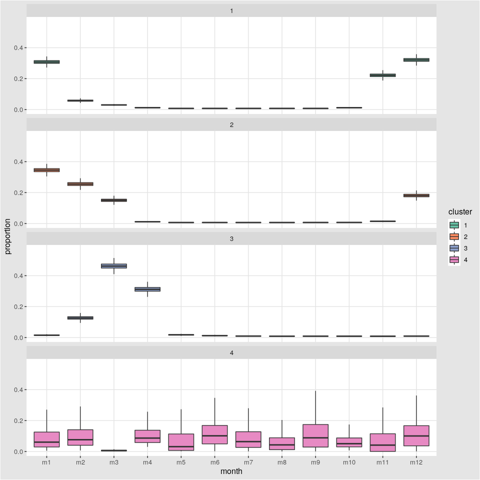<!-- -->

We compute some statistics to characterize the clusters.

```r
table_characteristics(myfit_glasseel_landings, 4,clus_order)
```

<table>
<caption>characteristics of clusters</caption>
 <thead>
<tr>
<th style="border-bottom:hidden" colspan="1"></th>
<th style="border-bottom:hidden; padding-bottom:0; padding-left:3px;padding-right:3px;text-align: center; " colspan="3"><div style="border-bottom: 1px solid #ddd; padding-bottom: 5px; ">number of months to reach 80% of total</div></th>
<th style="border-bottom:hidden; padding-bottom:0; padding-left:3px;padding-right:3px;text-align: center; " colspan="3"><div style="border-bottom: 1px solid #ddd; padding-bottom: 5px; ">month of centroid</div></th>
</tr>
  <tr>
   <th style="text-align:right;"> cluster </th>
   <th style="text-align:right;"> median </th>
   <th style="text-align:right;"> q2.5% </th>
   <th style="text-align:right;"> q97.5% </th>
   <th style="text-align:right;"> median </th>
   <th style="text-align:right;"> q2.5% </th>
   <th style="text-align:right;"> q97.5% </th>
  </tr>
 </thead>
<tbody>
  <tr>
   <td style="text-align:right;"> 1 </td>
   <td style="text-align:right;"> 3 </td>
   <td style="text-align:right;"> 3 </td>
   <td style="text-align:right;"> 3 </td>
   <td style="text-align:right;"> 0.31 </td>
   <td style="text-align:right;"> 0.26 </td>
   <td style="text-align:right;"> 0.36 </td>
  </tr>
  <tr>
   <td style="text-align:right;"> 2 </td>
   <td style="text-align:right;"> 4 </td>
   <td style="text-align:right;"> 3 </td>
   <td style="text-align:right;"> 4 </td>
   <td style="text-align:right;"> 1.40 </td>
   <td style="text-align:right;"> 1.34 </td>
   <td style="text-align:right;"> 1.46 </td>
  </tr>
  <tr>
   <td style="text-align:right;"> 3 </td>
   <td style="text-align:right;"> 3 </td>
   <td style="text-align:right;"> 3 </td>
   <td style="text-align:right;"> 3 </td>
   <td style="text-align:right;"> 3.25 </td>
   <td style="text-align:right;"> 3.20 </td>
   <td style="text-align:right;"> 3.31 </td>
  </tr>
  <tr>
   <td style="text-align:right;"> 4 </td>
   <td style="text-align:right;"> 6 </td>
   <td style="text-align:right;"> 4 </td>
   <td style="text-align:right;"> 7 </td>
   <td style="text-align:right;"> 0.52 </td>
   <td style="text-align:right;"> 10.93 </td>
   <td style="text-align:right;"> 2.28 </td>
  </tr>
</tbody>
</table>

Duration indicates the minimum number of months that covers 80% of the wave (1st column is the median, and the 2 next one quantiles 2.5% and 97.5% of credibility intervals). Centroid is the centroid of the migration wave (e.g. 11.5 would indicate a migration centred around mid november). The first column is the median and the two next one the quantiles 2.5 and 97.5%.

Clusters 1 starts in autum and last still january. Cluster 2 is shifter one month later and lasts longer. Cluster 3 corresponds to catches in march/may. Cluster 4 is very flat and is not really attributed.

We can also look at the belonging of the different groups.


```r
groups <- interaction(glasseel_wide$emu_nameshort,
                                            glasseel_wide$period,
                                            drop=TRUE)
group_name <- levels(groups)

get_pattern_month <- function(res,mydata){
  
  tmp <- strsplit(as.character(group_name),
                  "\\.")
  ser <- as.character(lapply(tmp,function(tt){
    tt[1]
  }))
  period <- as.character(lapply(tmp,function(tt){
    tt[2]
  }))
  res_mat <- as.matrix(as.mcmc.list(res,add.mutate=FALSE))
  
  clus <- t(sapply(seq_len(length(unique(groups))), function(id){
    name_col <- paste("cluster[",id,"]",sep="")
    freq <- table(res_mat[,name_col])
    max_class <- names(freq)[order(freq,decreasing=TRUE)[1]]
    c(max_class,freq[as.character(1:nbclus)])
  }))
  storage.mode(clus) <- "numeric"
  classes <- as.data.frame(clus)
  names(classes) <- c("cluster", paste("clus",seq_len(nbclus),sep=""))
  cbind.data.frame(data.frame(ser=ser, period=period),
                   classes)
}

myclassif <- get_pattern_month(myfit_glasseel_landings)
col_toreorder=grep("clus[0-9]",names(myclassif))
names(myclassif)[col_toreorder]=paste("clus",
                                      match(paste("clus",1:nbclus,sep=""),
                                      paste("clus",clus_order,sep="")),
                                      sep="")
myclassif[,col_toreorder] <- myclassif%>%
  select(col_toreorder)%>%select(sort(names(.)))
```

```
## Note: Using an external vector in selections is ambiguous.
## ℹ Use `all_of(col_toreorder)` instead of `col_toreorder` to silence this message.
## ℹ See <https://tidyselect.r-lib.org/reference/faq-external-vector.html>.
## This message is displayed once per session.
```

```r
myclassif$cluster <- factor(match(myclassif$cluster,clus_order),
                            levels=as.character(1:7))

table_classif(myclassif)
```

<table>
 <thead>
  <tr>
   <th style="text-align:left;"> EMU </th>
   <th style="text-align:left;"> period </th>
   <th style="text-align:left;"> Max cluster </th>
   <th style="text-align:right;"> % clus 1 </th>
   <th style="text-align:right;"> % clus 2 </th>
   <th style="text-align:right;"> % clus 3 </th>
   <th style="text-align:right;"> % clus 4 </th>
  </tr>
 </thead>
<tbody>
  <tr>
   <td style="text-align:left;"> ES_Astu </td>
   <td style="text-align:left;"> 2 </td>
   <td style="text-align:left;"> 1 </td>
   <td style="text-align:right;"> 100 </td>
   <td style="text-align:right;"> 0 </td>
   <td style="text-align:right;"> 0 </td>
   <td style="text-align:right;"> 0 </td>
  </tr>
  <tr>
   <td style="text-align:left;"> ES_Basq </td>
   <td style="text-align:left;"> 1 </td>
   <td style="text-align:left;"> 1 </td>
   <td style="text-align:right;"> 100 </td>
   <td style="text-align:right;"> 0 </td>
   <td style="text-align:right;"> 0 </td>
   <td style="text-align:right;"> 0 </td>
  </tr>
  <tr>
   <td style="text-align:left;"> ES_Basq </td>
   <td style="text-align:left;"> 2 </td>
   <td style="text-align:left;"> 1 </td>
   <td style="text-align:right;"> 100 </td>
   <td style="text-align:right;"> 0 </td>
   <td style="text-align:right;"> 0 </td>
   <td style="text-align:right;"> 0 </td>
  </tr>
  <tr>
   <td style="text-align:left;"> ES_Cant </td>
   <td style="text-align:left;"> 2 </td>
   <td style="text-align:left;"> 1 </td>
   <td style="text-align:right;"> 100 </td>
   <td style="text-align:right;"> 0 </td>
   <td style="text-align:right;"> 0 </td>
   <td style="text-align:right;"> 0 </td>
  </tr>
  <tr>
   <td style="text-align:left;"> ES_Cata </td>
   <td style="text-align:left;"> 1 </td>
   <td style="text-align:left;"> 1 </td>
   <td style="text-align:right;"> 100 </td>
   <td style="text-align:right;"> 0 </td>
   <td style="text-align:right;"> 0 </td>
   <td style="text-align:right;"> 0 </td>
  </tr>
  <tr>
   <td style="text-align:left;"> ES_Cata </td>
   <td style="text-align:left;"> 2 </td>
   <td style="text-align:left;"> 1 </td>
   <td style="text-align:right;"> 100 </td>
   <td style="text-align:right;"> 0 </td>
   <td style="text-align:right;"> 0 </td>
   <td style="text-align:right;"> 0 </td>
  </tr>
  <tr>
   <td style="text-align:left;"> ES_Mino </td>
   <td style="text-align:left;"> 2 </td>
   <td style="text-align:left;"> 1 </td>
   <td style="text-align:right;"> 100 </td>
   <td style="text-align:right;"> 0 </td>
   <td style="text-align:right;"> 0 </td>
   <td style="text-align:right;"> 0 </td>
  </tr>
  <tr>
   <td style="text-align:left;"> FR_Adou </td>
   <td style="text-align:left;"> 1 </td>
   <td style="text-align:left;"> 1 </td>
   <td style="text-align:right;"> 100 </td>
   <td style="text-align:right;"> 0 </td>
   <td style="text-align:right;"> 0 </td>
   <td style="text-align:right;"> 0 </td>
  </tr>
  <tr>
   <td style="text-align:left;"> FR_Adou </td>
   <td style="text-align:left;"> 2 </td>
   <td style="text-align:left;"> 1 </td>
   <td style="text-align:right;"> 100 </td>
   <td style="text-align:right;"> 0 </td>
   <td style="text-align:right;"> 0 </td>
   <td style="text-align:right;"> 0 </td>
  </tr>
  <tr>
   <td style="text-align:left;"> ES_Astu </td>
   <td style="text-align:left;"> 1 </td>
   <td style="text-align:left;"> 2 </td>
   <td style="text-align:right;"> 11 </td>
   <td style="text-align:right;"> 89 </td>
   <td style="text-align:right;"> 0 </td>
   <td style="text-align:right;"> 0 </td>
  </tr>
  <tr>
   <td style="text-align:left;"> ES_Vale </td>
   <td style="text-align:left;"> 2 </td>
   <td style="text-align:left;"> 2 </td>
   <td style="text-align:right;"> 0 </td>
   <td style="text-align:right;"> 100 </td>
   <td style="text-align:right;"> 0 </td>
   <td style="text-align:right;"> 0 </td>
  </tr>
  <tr>
   <td style="text-align:left;"> FR_Bret </td>
   <td style="text-align:left;"> 1 </td>
   <td style="text-align:left;"> 2 </td>
   <td style="text-align:right;"> 0 </td>
   <td style="text-align:right;"> 100 </td>
   <td style="text-align:right;"> 0 </td>
   <td style="text-align:right;"> 0 </td>
  </tr>
  <tr>
   <td style="text-align:left;"> FR_Bret </td>
   <td style="text-align:left;"> 2 </td>
   <td style="text-align:left;"> 2 </td>
   <td style="text-align:right;"> 0 </td>
   <td style="text-align:right;"> 100 </td>
   <td style="text-align:right;"> 0 </td>
   <td style="text-align:right;"> 0 </td>
  </tr>
  <tr>
   <td style="text-align:left;"> FR_Garo </td>
   <td style="text-align:left;"> 1 </td>
   <td style="text-align:left;"> 2 </td>
   <td style="text-align:right;"> 0 </td>
   <td style="text-align:right;"> 100 </td>
   <td style="text-align:right;"> 0 </td>
   <td style="text-align:right;"> 0 </td>
  </tr>
  <tr>
   <td style="text-align:left;"> FR_Garo </td>
   <td style="text-align:left;"> 2 </td>
   <td style="text-align:left;"> 2 </td>
   <td style="text-align:right;"> 0 </td>
   <td style="text-align:right;"> 100 </td>
   <td style="text-align:right;"> 0 </td>
   <td style="text-align:right;"> 0 </td>
  </tr>
  <tr>
   <td style="text-align:left;"> FR_Loir </td>
   <td style="text-align:left;"> 1 </td>
   <td style="text-align:left;"> 2 </td>
   <td style="text-align:right;"> 0 </td>
   <td style="text-align:right;"> 100 </td>
   <td style="text-align:right;"> 0 </td>
   <td style="text-align:right;"> 0 </td>
  </tr>
  <tr>
   <td style="text-align:left;"> FR_Loir </td>
   <td style="text-align:left;"> 2 </td>
   <td style="text-align:left;"> 2 </td>
   <td style="text-align:right;"> 0 </td>
   <td style="text-align:right;"> 100 </td>
   <td style="text-align:right;"> 0 </td>
   <td style="text-align:right;"> 0 </td>
  </tr>
  <tr>
   <td style="text-align:left;"> FR_Arto </td>
   <td style="text-align:left;"> 1 </td>
   <td style="text-align:left;"> 3 </td>
   <td style="text-align:right;"> 0 </td>
   <td style="text-align:right;"> 0 </td>
   <td style="text-align:right;"> 100 </td>
   <td style="text-align:right;"> 0 </td>
  </tr>
  <tr>
   <td style="text-align:left;"> FR_Arto </td>
   <td style="text-align:left;"> 2 </td>
   <td style="text-align:left;"> 3 </td>
   <td style="text-align:right;"> 0 </td>
   <td style="text-align:right;"> 0 </td>
   <td style="text-align:right;"> 100 </td>
   <td style="text-align:right;"> 0 </td>
  </tr>
  <tr>
   <td style="text-align:left;"> FR_Sein </td>
   <td style="text-align:left;"> 1 </td>
   <td style="text-align:left;"> 3 </td>
   <td style="text-align:right;"> 0 </td>
   <td style="text-align:right;"> 0 </td>
   <td style="text-align:right;"> 100 </td>
   <td style="text-align:right;"> 0 </td>
  </tr>
  <tr>
   <td style="text-align:left;"> FR_Sein </td>
   <td style="text-align:left;"> 2 </td>
   <td style="text-align:left;"> 3 </td>
   <td style="text-align:right;"> 0 </td>
   <td style="text-align:right;"> 0 </td>
   <td style="text-align:right;"> 100 </td>
   <td style="text-align:right;"> 0 </td>
  </tr>
  <tr>
   <td style="text-align:left;"> GB_NorW </td>
   <td style="text-align:left;"> 1 </td>
   <td style="text-align:left;"> 3 </td>
   <td style="text-align:right;"> 0 </td>
   <td style="text-align:right;"> 0 </td>
   <td style="text-align:right;"> 100 </td>
   <td style="text-align:right;"> 0 </td>
  </tr>
  <tr>
   <td style="text-align:left;"> GB_Seve </td>
   <td style="text-align:left;"> 1 </td>
   <td style="text-align:left;"> 3 </td>
   <td style="text-align:right;"> 0 </td>
   <td style="text-align:right;"> 0 </td>
   <td style="text-align:right;"> 100 </td>
   <td style="text-align:right;"> 0 </td>
  </tr>
  <tr>
   <td style="text-align:left;"> GB_SouW </td>
   <td style="text-align:left;"> 1 </td>
   <td style="text-align:left;"> 3 </td>
   <td style="text-align:right;"> 0 </td>
   <td style="text-align:right;"> 0 </td>
   <td style="text-align:right;"> 100 </td>
   <td style="text-align:right;"> 0 </td>
  </tr>
  <tr>
   <td style="text-align:left;"> GB_SouW </td>
   <td style="text-align:left;"> 2 </td>
   <td style="text-align:left;"> 3 </td>
   <td style="text-align:right;"> 0 </td>
   <td style="text-align:right;"> 0 </td>
   <td style="text-align:right;"> 100 </td>
   <td style="text-align:right;"> 0 </td>
  </tr>
  <tr>
   <td style="text-align:left;"> GB_Wale </td>
   <td style="text-align:left;"> 1 </td>
   <td style="text-align:left;"> 3 </td>
   <td style="text-align:right;"> 0 </td>
   <td style="text-align:right;"> 0 </td>
   <td style="text-align:right;"> 100 </td>
   <td style="text-align:right;"> 0 </td>
  </tr>
</tbody>
</table>

The spatial pattern is obvious in the results. Interestingly, we saw an EMU that change cluster between period and this seem to correspond to management measures that have effectively shorten the fishing season.


```r
myclassif_p1 <- subset(myclassif, myclassif$period == 1)
myclassif_p2 <- subset(myclassif, myclassif$period == 2)
emu$cluster1 <- factor(myclassif_p1$cluster[match(emu$name_short,
                                                  substr(myclassif_p1$ser,1,nchar(as.character(myclassif_p1$ser))))], levels=1:7)

emu$cluster2 <- factor(myclassif_p2$cluster[match(emu$name_short,
                                                substr(myclassif_p2$ser,1,nchar(as.character(myclassif_p2$ser))))],
                       levels=1:7)
ggplot(data = cou) +  geom_sf(fill= "antiquewhite") +
		geom_sf(data=emu,aes(fill=cluster1)) + scale_fill_manual(values=cols)+
  theme_igray() +xlim(-20,30) + ylim(35,65) 
```

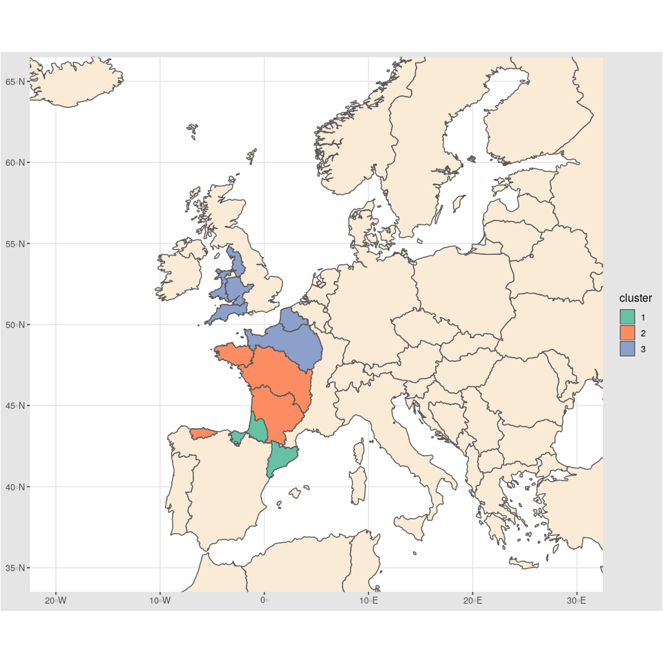<!-- -->

```r
ggplot(data = cou) +  geom_sf(fill= "antiquewhite") +
		geom_sf(data=emu,aes(fill=cluster2)) + scale_fill_manual(values=cols)+
  theme_igray() +xlim(-20,30) + ylim(35,65)  
```

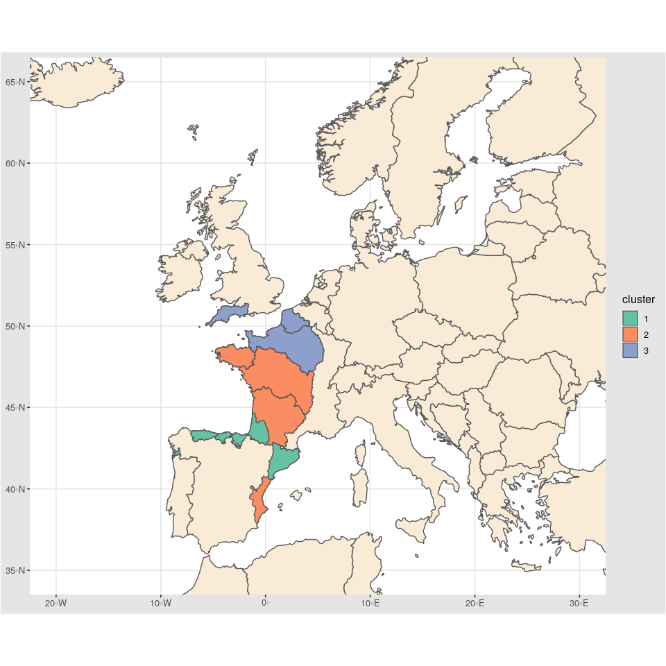<!-- -->

## Exporting pattern per group

```r
tmp <- as.matrix(as.mcmc.list(myfit_glasseel_landings))
name_col = colnames(tmp)

pattern_GE_landings=do.call("rbind.data.frame",
                            lapply(seq_len(length(levels(groups))), function(g)
                                   median_pattern_group(g, group_name,tmp, "G","landings", hty_code="T")))
save(pattern_GE_landings,file="pattern_G_landings.rdata")
```

## Similarity between and after 2010

```r
#which groups have data in both periods
occ=table(unique(glasseel_wide[,c("emu_nameshort", "period")])[,1])
tocompare=names(occ)[which(occ>1)]

simi=sapply(tocompare, function(s){
  g=grep(s,group_name)
  esp1=tmp[,grep(paste("alpha_group\\[",g[1],",",sep=""),name_col)]
  esp2=tmp[,grep(paste("alpha_group\\[",g[2],",",sep=""),name_col)]
  quantile(apply(cbind(esp1,esp2),
                 1,
                 function(x) sum(pmin(x[1:12],x[13:24]))),
           probs=c(0.025,.5,.975))
})

similarity=data.frame(emu=tocompare,t(simi))

table_similarity(similarity)
```

<table>
<caption>similarity</caption>
 <thead>
  <tr>
   <th style="text-align:left;"> EMU </th>
   <th style="text-align:right;"> q2.5% </th>
   <th style="text-align:right;"> median </th>
   <th style="text-align:right;"> q97.5% </th>
  </tr>
 </thead>
<tbody>
  <tr>
   <td style="text-align:left;"> ES_Astu </td>
   <td style="text-align:right;"> 0.74 </td>
   <td style="text-align:right;"> 0.83 </td>
   <td style="text-align:right;"> 0.91 </td>
  </tr>
  <tr>
   <td style="text-align:left;"> ES_Basq </td>
   <td style="text-align:right;"> 0.64 </td>
   <td style="text-align:right;"> 0.74 </td>
   <td style="text-align:right;"> 0.83 </td>
  </tr>
  <tr>
   <td style="text-align:left;"> ES_Cata </td>
   <td style="text-align:right;"> 0.77 </td>
   <td style="text-align:right;"> 0.86 </td>
   <td style="text-align:right;"> 0.93 </td>
  </tr>
  <tr>
   <td style="text-align:left;"> FR_Adou </td>
   <td style="text-align:right;"> 0.65 </td>
   <td style="text-align:right;"> 0.75 </td>
   <td style="text-align:right;"> 0.85 </td>
  </tr>
  <tr>
   <td style="text-align:left;"> FR_Arto </td>
   <td style="text-align:right;"> 0.64 </td>
   <td style="text-align:right;"> 0.71 </td>
   <td style="text-align:right;"> 0.79 </td>
  </tr>
  <tr>
   <td style="text-align:left;"> FR_Bret </td>
   <td style="text-align:right;"> 0.73 </td>
   <td style="text-align:right;"> 0.83 </td>
   <td style="text-align:right;"> 0.92 </td>
  </tr>
  <tr>
   <td style="text-align:left;"> FR_Garo </td>
   <td style="text-align:right;"> 0.72 </td>
   <td style="text-align:right;"> 0.83 </td>
   <td style="text-align:right;"> 0.91 </td>
  </tr>
  <tr>
   <td style="text-align:left;"> FR_Loir </td>
   <td style="text-align:right;"> 0.78 </td>
   <td style="text-align:right;"> 0.88 </td>
   <td style="text-align:right;"> 0.95 </td>
  </tr>
  <tr>
   <td style="text-align:left;"> FR_Sein </td>
   <td style="text-align:right;"> 0.60 </td>
   <td style="text-align:right;"> 0.77 </td>
   <td style="text-align:right;"> 0.91 </td>
  </tr>
  <tr>
   <td style="text-align:left;"> GB_SouW </td>
   <td style="text-align:right;"> 0.55 </td>
   <td style="text-align:right;"> 0.72 </td>
   <td style="text-align:right;"> 0.88 </td>
  </tr>
</tbody>
</table>


##Potential effect of EMP and EU closures

```r
ncar=nchar(group_name)
period=as.integer(substr(as.character(group_name),ncar,ncar))
emus=substr(group_name,1,ncar-2)


#######EMP
#For glass eels, we summed catches over hty, therefore here, we aggregate closures
#taking the most restrictive if there are differences among habitats
list_period1=data.frame(emu_nameshort=emus[period==1])
list_period1$group=group_name[period==1]
list_period1$id_g=match(list_period1$group,group_name)

#we check that we have ladings data at least two years before the first EMP closures
list_period1$estimable=sapply(list_period1$emu_nameshort, function(s) {
  length(which(charac_EMP_closures$emu_nameshort==s 
               & grepl("G",charac_EMP_closures$lfs_code) 
               & charac_EMP_closures$hty_code != "F"))>0})

list_period1$estimable=list_period1$estimable &
(sapply(list_period1$id_g,function(e) min(glasseel_wide$season[group==e]))+2 <
sapply(list_period1$emu_nameshort,function(e) min(charac_EMP_closures$year[charac_EMP_closures$emu_nameshort==e &
                                                           grepl("G",charac_EMP_closures$lfs_code) &
                                                    charac_EMP_closures$hty_code !="F"])))

list_period1$lossq2.5=NA
list_period1$lossq50=NA
list_period1$lossq97.5=NA

res_closures=mapply(function(s,g) {
  emu_closures <- EMP_closures %>%
    filter(emu_nameshort==s & grepl("G",lfs_code) & hty_code !="F") %>%
    group_by(emu_nameshort,month) %>%
    summarize(fishery_closure_percent=max(fishery_closure_percent))
  myalpha=tmp[,paste("alpha_group[",g,",",emu_closures$month,"]",sep="")]
  if (nrow(emu_closures)>1){
    loss=colSums(apply(myalpha,1,function(x) x*emu_closures$fishery_closure_percent/100))
  } else {
    loss=myalpha*emu_closures$fishery_closure_percent/100
  }
  quantile(loss,probs=c(0.025,.5,.975))
},as.character(list_period1$emu_nameshort[list_period1$estimable]),list_period1$id_g[list_period1$estimable])

list_period1[list_period1$estimable, c("lossq2.5", "lossq50","lossq97.5")] =
  t(res_closures)

kable(list_period1[,c("emu_nameshort","lossq2.5","lossq50","lossq97.5")],
      col.names=c("emu","q2.5","median","q97.5"),
      caption="proportion of catch potentially lost because of EMP closure",
      digits=2)
```

<table>
<caption>proportion of catch potentially lost because of EMP closure</caption>
 <thead>
  <tr>
   <th style="text-align:left;"> emu </th>
   <th style="text-align:right;"> q2.5 </th>
   <th style="text-align:right;"> median </th>
   <th style="text-align:right;"> q97.5 </th>
  </tr>
 </thead>
<tbody>
  <tr>
   <td style="text-align:left;"> ES_Astu </td>
   <td style="text-align:right;"> 0.07 </td>
   <td style="text-align:right;"> 0.10 </td>
   <td style="text-align:right;"> 0.14 </td>
  </tr>
  <tr>
   <td style="text-align:left;"> ES_Basq </td>
   <td style="text-align:right;"> NA </td>
   <td style="text-align:right;"> NA </td>
   <td style="text-align:right;"> NA </td>
  </tr>
  <tr>
   <td style="text-align:left;"> ES_Cata </td>
   <td style="text-align:right;"> NA </td>
   <td style="text-align:right;"> NA </td>
   <td style="text-align:right;"> NA </td>
  </tr>
  <tr>
   <td style="text-align:left;"> FR_Adou </td>
   <td style="text-align:right;"> 0.04 </td>
   <td style="text-align:right;"> 0.05 </td>
   <td style="text-align:right;"> 0.07 </td>
  </tr>
  <tr>
   <td style="text-align:left;"> FR_Arto </td>
   <td style="text-align:right;"> 0.11 </td>
   <td style="text-align:right;"> 0.14 </td>
   <td style="text-align:right;"> 0.17 </td>
  </tr>
  <tr>
   <td style="text-align:left;"> FR_Bret </td>
   <td style="text-align:right;"> 0.06 </td>
   <td style="text-align:right;"> 0.08 </td>
   <td style="text-align:right;"> 0.11 </td>
  </tr>
  <tr>
   <td style="text-align:left;"> FR_Garo </td>
   <td style="text-align:right;"> 0.07 </td>
   <td style="text-align:right;"> 0.09 </td>
   <td style="text-align:right;"> 0.12 </td>
  </tr>
  <tr>
   <td style="text-align:left;"> FR_Loir </td>
   <td style="text-align:right;"> 0.04 </td>
   <td style="text-align:right;"> 0.04 </td>
   <td style="text-align:right;"> 0.06 </td>
  </tr>
  <tr>
   <td style="text-align:left;"> FR_Sein </td>
   <td style="text-align:right;"> NA </td>
   <td style="text-align:right;"> NA </td>
   <td style="text-align:right;"> NA </td>
  </tr>
  <tr>
   <td style="text-align:left;"> GB_NorW </td>
   <td style="text-align:right;"> NA </td>
   <td style="text-align:right;"> NA </td>
   <td style="text-align:right;"> NA </td>
  </tr>
  <tr>
   <td style="text-align:left;"> GB_Seve </td>
   <td style="text-align:right;"> 0.13 </td>
   <td style="text-align:right;"> 0.16 </td>
   <td style="text-align:right;"> 0.20 </td>
  </tr>
  <tr>
   <td style="text-align:left;"> GB_SouW </td>
   <td style="text-align:right;"> 0.48 </td>
   <td style="text-align:right;"> 0.51 </td>
   <td style="text-align:right;"> 0.55 </td>
  </tr>
  <tr>
   <td style="text-align:left;"> GB_Wale </td>
   <td style="text-align:right;"> 0.77 </td>
   <td style="text-align:right;"> 0.80 </td>
   <td style="text-align:right;"> 0.82 </td>
  </tr>
</tbody>
</table>

```r
#######EU
#For glass eels, we summed catches over hty, therefore here, we aggregate closures
#taking the most restrictive if there are differences among habitats
list_period2=data.frame(emu_nameshort=emus[period==2])
list_period2$group=group_name[period==2]
list_period2$id_g=match(list_period2$group,group_name)

#we check that we have ladings data at least two years before the first EU closures
list_period2$estimable=sapply(list_period2$emu_nameshort, function(s) {
  length(which(charac_EU_closures$emu_nameshort==s 
               & grepl("G",charac_EU_closures$lfs_code) 
               & charac_EU_closures$hty_code != "F"))>0})

list_period2$estimable=list_period2$estimable &
(sapply(list_period2$id_g,function(e) min(glasseel_wide$season[group==e]))+2 <
sapply(list_period2$emu_nameshort,function(e) min(charac_EU_closures$year[charac_EU_closures$emu_nameshort==e &
                                                           grepl("G",charac_EU_closures$lfs_code) &
                                                    charac_EU_closures$hty_code !="F"])))

list_period2$lossq2.5=NA
list_period2$lossq50=NA
list_period2$lossq97.5=NA

res_closures=mapply(function(s,g) {
  emu_closures <- EU_closures %>%
    filter(emu_nameshort==s & grepl("G",lfs_code) & hty_code !="F") %>%
    group_by(emu_nameshort,month) %>%
    summarize(fishery_closure_percent=max(fishery_closure_percent))
  myalpha=tmp[,paste("alpha_group[",g,",",emu_closures$month,"]",sep="")]
  if (nrow(emu_closures)>1){
    loss=colSums(apply(myalpha,1,function(x) x*emu_closures$fishery_closure_percent/100))
  } else {
    loss=myalpha*emu_closures$fishery_closure_percent/100
  }
  quantile(loss,probs=c(0.025,.5,.975))
},as.character(list_period2$emu_nameshort[list_period2$estimable]),list_period2$id_g[list_period2$estimable])

list_period2[list_period2$estimable, c("lossq2.5", "lossq50","lossq97.5")] =
  t(res_closures)

kable(list_period2[,c("emu_nameshort","lossq2.5","lossq50","lossq97.5")],
      col.names=c("emu","q2.5","median","q97.5"),
      caption="proportion of catch potentially lost because of EU closure",
      digits=2)
```

<table>
<caption>proportion of catch potentially lost because of EU closure</caption>
 <thead>
  <tr>
   <th style="text-align:left;"> emu </th>
   <th style="text-align:right;"> q2.5 </th>
   <th style="text-align:right;"> median </th>
   <th style="text-align:right;"> q97.5 </th>
  </tr>
 </thead>
<tbody>
  <tr>
   <td style="text-align:left;"> ES_Astu </td>
   <td style="text-align:right;"> NA </td>
   <td style="text-align:right;"> NA </td>
   <td style="text-align:right;"> NA </td>
  </tr>
  <tr>
   <td style="text-align:left;"> ES_Basq </td>
   <td style="text-align:right;"> NA </td>
   <td style="text-align:right;"> NA </td>
   <td style="text-align:right;"> NA </td>
  </tr>
  <tr>
   <td style="text-align:left;"> ES_Cant </td>
   <td style="text-align:right;"> NA </td>
   <td style="text-align:right;"> NA </td>
   <td style="text-align:right;"> NA </td>
  </tr>
  <tr>
   <td style="text-align:left;"> ES_Cata </td>
   <td style="text-align:right;"> NA </td>
   <td style="text-align:right;"> NA </td>
   <td style="text-align:right;"> NA </td>
  </tr>
  <tr>
   <td style="text-align:left;"> ES_Mino </td>
   <td style="text-align:right;"> NA </td>
   <td style="text-align:right;"> NA </td>
   <td style="text-align:right;"> NA </td>
  </tr>
  <tr>
   <td style="text-align:left;"> ES_Vale </td>
   <td style="text-align:right;"> NA </td>
   <td style="text-align:right;"> NA </td>
   <td style="text-align:right;"> NA </td>
  </tr>
  <tr>
   <td style="text-align:left;"> FR_Adou </td>
   <td style="text-align:right;"> NA </td>
   <td style="text-align:right;"> NA </td>
   <td style="text-align:right;"> NA </td>
  </tr>
  <tr>
   <td style="text-align:left;"> FR_Arto </td>
   <td style="text-align:right;"> NA </td>
   <td style="text-align:right;"> NA </td>
   <td style="text-align:right;"> NA </td>
  </tr>
  <tr>
   <td style="text-align:left;"> FR_Bret </td>
   <td style="text-align:right;"> NA </td>
   <td style="text-align:right;"> NA </td>
   <td style="text-align:right;"> NA </td>
  </tr>
  <tr>
   <td style="text-align:left;"> FR_Garo </td>
   <td style="text-align:right;"> NA </td>
   <td style="text-align:right;"> NA </td>
   <td style="text-align:right;"> NA </td>
  </tr>
  <tr>
   <td style="text-align:left;"> FR_Loir </td>
   <td style="text-align:right;"> NA </td>
   <td style="text-align:right;"> NA </td>
   <td style="text-align:right;"> NA </td>
  </tr>
  <tr>
   <td style="text-align:left;"> FR_Sein </td>
   <td style="text-align:right;"> NA </td>
   <td style="text-align:right;"> NA </td>
   <td style="text-align:right;"> NA </td>
  </tr>
  <tr>
   <td style="text-align:left;"> GB_SouW </td>
   <td style="text-align:right;"> 0.01 </td>
   <td style="text-align:right;"> 0.05 </td>
   <td style="text-align:right;"> 0.14 </td>
  </tr>
</tbody>
</table>

```r
list_period2$type="EU closure"
list_period1$type="EMP closure"
list_period=rbind.data.frame(list_period1,list_period2)
list_period$stage="G"
save(list_period,file="loss_glass_eel.rdata")


####scenario per cluster
starts_closure=8:12
clus=1:nbclus
experiments=expand.grid(clus,starts_closure)
effects=t(mapply(function(c,s){
  months_closed=(s:(s+2))
  months_closed=ifelse(months_closed>12,months_closed-12,months_closed)
  pattern=tmp[,grep(paste("esp\\[",c,",",sep=""),colnames(tmp))]
  effect=rowSums(pattern[,months_closed])
  quantile(effect,probs=c(0.025,.5,.975))
},experiments[,1],experiments[,2]))
effects_scenario=data.frame(cluster=match(experiments[,1],clus_order),
                            starting_month_EU_closure=experiments[,2],
                            loss_median=effects[,2],
                            loss_2.5=effects[,1],
                            loss_97.5=effects[,3])
effects_scenario=effects_scenario[order(effects_scenario$cluster,
                                        effects_scenario$starting_month_EU_closure),]


kable(effects_scenario,row.names=FALSE,col.names=c("cluster",
                                   "speculative 1st month of EU closure",
                                   "median loss of catch",
                                   "q2.5",
                                   "q97.5"), digits=2,
      caption="potential effect that an EU closure would have depending on cluster and starting month")
```

<table>
<caption>potential effect that an EU closure would have depending on cluster and starting month</caption>
 <thead>
  <tr>
   <th style="text-align:right;"> cluster </th>
   <th style="text-align:right;"> speculative 1st month of EU closure </th>
   <th style="text-align:right;"> median loss of catch </th>
   <th style="text-align:right;"> q2.5 </th>
   <th style="text-align:right;"> q97.5 </th>
  </tr>
 </thead>
<tbody>
  <tr>
   <td style="text-align:right;"> 1 </td>
   <td style="text-align:right;"> 8 </td>
   <td style="text-align:right;"> 0.03 </td>
   <td style="text-align:right;"> 0.02 </td>
   <td style="text-align:right;"> 0.03 </td>
  </tr>
  <tr>
   <td style="text-align:right;"> 1 </td>
   <td style="text-align:right;"> 9 </td>
   <td style="text-align:right;"> 0.24 </td>
   <td style="text-align:right;"> 0.22 </td>
   <td style="text-align:right;"> 0.27 </td>
  </tr>
  <tr>
   <td style="text-align:right;"> 1 </td>
   <td style="text-align:right;"> 10 </td>
   <td style="text-align:right;"> 0.56 </td>
   <td style="text-align:right;"> 0.53 </td>
   <td style="text-align:right;"> 0.58 </td>
  </tr>
  <tr>
   <td style="text-align:right;"> 1 </td>
   <td style="text-align:right;"> 11 </td>
   <td style="text-align:right;"> 0.85 </td>
   <td style="text-align:right;"> 0.84 </td>
   <td style="text-align:right;"> 0.86 </td>
  </tr>
  <tr>
   <td style="text-align:right;"> 1 </td>
   <td style="text-align:right;"> 12 </td>
   <td style="text-align:right;"> 0.69 </td>
   <td style="text-align:right;"> 0.66 </td>
   <td style="text-align:right;"> 0.71 </td>
  </tr>
  <tr>
   <td style="text-align:right;"> 2 </td>
   <td style="text-align:right;"> 8 </td>
   <td style="text-align:right;"> 0.02 </td>
   <td style="text-align:right;"> 0.02 </td>
   <td style="text-align:right;"> 0.02 </td>
  </tr>
  <tr>
   <td style="text-align:right;"> 2 </td>
   <td style="text-align:right;"> 9 </td>
   <td style="text-align:right;"> 0.03 </td>
   <td style="text-align:right;"> 0.02 </td>
   <td style="text-align:right;"> 0.03 </td>
  </tr>
  <tr>
   <td style="text-align:right;"> 2 </td>
   <td style="text-align:right;"> 10 </td>
   <td style="text-align:right;"> 0.20 </td>
   <td style="text-align:right;"> 0.18 </td>
   <td style="text-align:right;"> 0.23 </td>
  </tr>
  <tr>
   <td style="text-align:right;"> 2 </td>
   <td style="text-align:right;"> 11 </td>
   <td style="text-align:right;"> 0.54 </td>
   <td style="text-align:right;"> 0.51 </td>
   <td style="text-align:right;"> 0.57 </td>
  </tr>
  <tr>
   <td style="text-align:right;"> 2 </td>
   <td style="text-align:right;"> 12 </td>
   <td style="text-align:right;"> 0.78 </td>
   <td style="text-align:right;"> 0.76 </td>
   <td style="text-align:right;"> 0.80 </td>
  </tr>
  <tr>
   <td style="text-align:right;"> 3 </td>
   <td style="text-align:right;"> 8 </td>
   <td style="text-align:right;"> 0.03 </td>
   <td style="text-align:right;"> 0.02 </td>
   <td style="text-align:right;"> 0.03 </td>
  </tr>
  <tr>
   <td style="text-align:right;"> 3 </td>
   <td style="text-align:right;"> 9 </td>
   <td style="text-align:right;"> 0.03 </td>
   <td style="text-align:right;"> 0.02 </td>
   <td style="text-align:right;"> 0.03 </td>
  </tr>
  <tr>
   <td style="text-align:right;"> 3 </td>
   <td style="text-align:right;"> 10 </td>
   <td style="text-align:right;"> 0.03 </td>
   <td style="text-align:right;"> 0.02 </td>
   <td style="text-align:right;"> 0.03 </td>
  </tr>
  <tr>
   <td style="text-align:right;"> 3 </td>
   <td style="text-align:right;"> 11 </td>
   <td style="text-align:right;"> 0.03 </td>
   <td style="text-align:right;"> 0.03 </td>
   <td style="text-align:right;"> 0.04 </td>
  </tr>
  <tr>
   <td style="text-align:right;"> 3 </td>
   <td style="text-align:right;"> 12 </td>
   <td style="text-align:right;"> 0.15 </td>
   <td style="text-align:right;"> 0.13 </td>
   <td style="text-align:right;"> 0.18 </td>
  </tr>
  <tr>
   <td style="text-align:right;"> 4 </td>
   <td style="text-align:right;"> 8 </td>
   <td style="text-align:right;"> 0.22 </td>
   <td style="text-align:right;"> 0.06 </td>
   <td style="text-align:right;"> 0.51 </td>
  </tr>
  <tr>
   <td style="text-align:right;"> 4 </td>
   <td style="text-align:right;"> 9 </td>
   <td style="text-align:right;"> 0.22 </td>
   <td style="text-align:right;"> 0.06 </td>
   <td style="text-align:right;"> 0.53 </td>
  </tr>
  <tr>
   <td style="text-align:right;"> 4 </td>
   <td style="text-align:right;"> 10 </td>
   <td style="text-align:right;"> 0.24 </td>
   <td style="text-align:right;"> 0.04 </td>
   <td style="text-align:right;"> 0.51 </td>
  </tr>
  <tr>
   <td style="text-align:right;"> 4 </td>
   <td style="text-align:right;"> 11 </td>
   <td style="text-align:right;"> 0.25 </td>
   <td style="text-align:right;"> 0.06 </td>
   <td style="text-align:right;"> 0.50 </td>
  </tr>
  <tr>
   <td style="text-align:right;"> 4 </td>
   <td style="text-align:right;"> 12 </td>
   <td style="text-align:right;"> 0.29 </td>
   <td style="text-align:right;"> 0.13 </td>
   <td style="text-align:right;"> 0.58 </td>
  </tr>
</tbody>
</table>


# Yellow
First, let's select data corresponding to yellow stage.


```r
yellow_eel <- subset(res, res$lfs_code=="Y")

# we start by removing rows with only zero
all_zero <- yellow_eel %>%	group_by(emu_nameshort,lfs_code,hty_code,das_year) %>%
		summarize(S=sum(das_value)) %>% 
    filter(S==0)

yellow_eel <- yellow_eel %>% 
	  anti_join(all_zero)
```

```
## Joining, by = c("das_year", "emu_nameshort", "lfs_code", "hty_code")
```

```r
table(yellow_eel$hty_code)
```

```
## 
##    C    F   FC  FTC   MO    T 
##  645 1212  463   72  225  942
```

```r
#We have many data, so we remove "FC" and "FTC" which are weirds mixes
yellow_eel <- yellow_eel %>%
  filter(!hty_code %in% c("FTC", "FC"))

#in this analysis, the unit will correspond to EMU / habitat so we create 
#corresponding column
yellow_eel$emu <- yellow_eel$emu_nameshort
yellow_eel$emu_nameshort <- paste(yellow_eel$emu_nameshort,
                                   yellow_eel$hty_code, sep="_")

#There are some duplicates for IE_West_F that should be summed up according to
#Russel
summed_up_IE <-yellow_eel %>%
  filter(yellow_eel$emu_nameshort=="IE_West_F") %>%
  group_by(das_year,das_month) %>%
  summarize(das_value=sum(das_value))

yellow_eel <- yellow_eel %>% 
  distinct(das_year,das_month,emu_nameshort, .keep_all = TRUE)

yellow_eel[yellow_eel$emu_nameshort=="IE_West_F",
          c("das_year","das_month","das_value") ] <- summed_up_IE
```

Similarly to seasonality, we will build season. We reuse the procedure made for silver eel and yellow eel seasonality, i.e. defining seasons per emu, with the season starting at the month with minimum landings. The month with lowest catch fmin define the beggining of the season (month_in_season=1) and season y stands for the 12 months from fmin y (e.g., if lowest migration is in december, season ranges from december to november, and season y denotes season from december y to november y+1).


```r
#creating season
yelloweel <- do.call("rbind.data.frame",
                     lapply(unique(yellow_eel$emu_nameshort),
                            function(s)
                              season_creation(yellow_eel[yellow_eel$emu_nameshort==s,])))
months_peak_per_series<- unique(yelloweel[,c("emu_nameshort","peak_month")])

#large variety in the month with peak of catches among EMU / habitat
kable(table(months_peak_per_series$peak_month),
      caption="number of EMUs that peak in a month",
      col.names=c("month","number of EMUs"))
```

<table>
<caption>number of EMUs that peak in a month</caption>
 <thead>
  <tr>
   <th style="text-align:left;"> month </th>
   <th style="text-align:right;"> number of EMUs </th>
  </tr>
 </thead>
<tbody>
  <tr>
   <td style="text-align:left;"> 4 </td>
   <td style="text-align:right;"> 2 </td>
  </tr>
  <tr>
   <td style="text-align:left;"> 5 </td>
   <td style="text-align:right;"> 7 </td>
  </tr>
  <tr>
   <td style="text-align:left;"> 6 </td>
   <td style="text-align:right;"> 8 </td>
  </tr>
  <tr>
   <td style="text-align:left;"> 7 </td>
   <td style="text-align:right;"> 12 </td>
  </tr>
  <tr>
   <td style="text-align:left;"> 8 </td>
   <td style="text-align:right;"> 6 </td>
  </tr>
  <tr>
   <td style="text-align:left;"> 9 </td>
   <td style="text-align:right;"> 5 </td>
  </tr>
  <tr>
   <td style="text-align:left;"> 10 </td>
   <td style="text-align:right;"> 1 </td>
  </tr>
  <tr>
   <td style="text-align:left;"> 12 </td>
   <td style="text-align:right;"> 2 </td>
  </tr>
</tbody>
</table>

```r
#we remove data from season 2020
yelloweel <- yelloweel %>%
  filter(season < 2020)
```


##Coastal/marine waters
### Data selection
Now we should carry out data selection, more specifically, we want to eliminate rows with two many missing data, too much zero and to check whether there are no duplicates (though Cedric already did it). We mixed coastal and marine habitats since there are only one EMU with landings in marine habitat


```r
yelloweel_coatal <- subset(yelloweel, yelloweel$hty_code %in% c("C", "MO"))
kept_seasons <- lapply(unique(yelloweel_coatal$emu_nameshort), function(s){
  sub_yellow <- subset(yelloweel_coatal, yelloweel_coatal$emu_nameshort==s)
  kept <- good_coverage_wave(sub_yellow)
  #we remove season in which we have less than 50 kg of landings
  if(!is.null(kept))
    kept <- kept[sapply(kept,function(k)
      sum(sub_yellow$das_value[sub_yellow$season==k],na.rm=TRUE)>50)]
  if (length(kept) == 0) kept <- NULL
  kept
})
```

```
## [1] "For  DE_Eide_C  a good season should cover months: 5 to 11"
## [1] "For  DE_Schl_C  a good season should cover months: 5 to 11"
## [1] "For  DK_total_MO  a good season should cover months: 4 to 11"
## [1] "For  ES_Murc_C  a good season should cover months: 11 to 3"
## [1] "For  GB_Angl_C  a good season should cover months: 5 to 11"
## [1] "For  GB_NorW_C  a good season should cover months: 5 to 8"
## [1] "For  GB_SouE_C  a good season should cover months: 4 to 10"
## [1] "For  GB_SouW_C  a good season should cover months: 4 to 11"
## [1] "For  GB_Tham_C  a good season should cover months: 5 to 4"
## [1] "For  SE_East_C  a good season should cover months: 4 to 11"
## [1] "For  SE_West_C  a good season should cover months: 5 to 11"
```

Finally, here are the series kept given previous criterion.


```r
names(kept_seasons) <- unique(yelloweel_coatal$emu_nameshort)
kept_seasons[!sapply(kept_seasons,is.null)]
```

```
## $DE_Eide_C
##  [1] 2009 2010 2011 2012 2013 2014 2015 2016 2017 2018
## 
## $DE_Schl_C
##  [1] 2009 2010 2011 2012 2013 2014 2015 2016 2017 2018
## 
## $DK_total_MO
##  [1] 2000 2001 2002 2003 2004 2005 2006 2007 2008 2009 2010 2011 2012 2013
## [15] 2014 2015 2016 2017 2018 2019
## 
## $ES_Murc_C
## [1] 2014 2016
## 
## $GB_Angl_C
## [1] 2014 2015 2016 2017 2018
## 
## $GB_SouE_C
## [1] 2013 2014 2015 2016 2017
## 
## $GB_SouW_C
## [1] 2013 2014 2015 2016 2017
## 
## $SE_East_C
##  [1] 2000 2001 2002 2003 2004 2005 2006 2007 2008 2012 2013
## 
## $SE_West_C
## [1] 2000 2001 2002 2003 2004 2005 2006 2007 2008
```

### Data preparation
We carry out the same procedure as for seasonality. 


```r
yelloweel_coastal_subset <- subset(yelloweel_coatal, 
                           mapply(function(season, series){
                             season %in% kept_seasons[[series]]
                           }, yelloweel_coatal$season, yelloweel_coatal$emu_nameshort))


yelloweel_coastal_wide <- pivot_wider(data=yelloweel_coastal_subset[, c("emu_nameshort",
                                                     "cou_code",
                                                     "season",
                                                     "das_month",
                                                     "das_value")],
                                names_from="das_month",
                                values_from="das_value")
names(yelloweel_coastal_wide)[-(1:3)] <- paste("m",
                                       names(yelloweel_coastal_wide)[-(1:3)],
                                       sep="")

###we count the number of zeros per lines to remove lines without enough
###fishes
data_poor <- data.frame(yelloweel_coastal_wide$emu_nameshort,
                        yelloweel_coastal_wide$season,
                  zero=rowSums(yelloweel_coastal_wide[, -(1:3)] == 0 |
                                 is.na(yelloweel_coastal_wide[, -(1:3)])),
           tot=rowSums(yelloweel_coastal_wide[, -(1:3)], na.rm=TRUE))
yelloweel_coastal_wide <- yelloweel_coastal_wide[data_poor$zero < 10, ]

table_datapoor(data_poor %>% filter(zero > 9 | tot<50)) #we remove years where we have less than 2 months)
```

<table>
<caption>"data poor"" situation</caption>
 <thead>
  <tr>
   <th style="text-align:left;"> EMU </th>
   <th style="text-align:right;"> season </th>
   <th style="text-align:right;"> number of zero </th>
   <th style="text-align:right;"> total catch </th>
  </tr>
 </thead>
<tbody>
  <tr>
   <td style="text-align:left;"> ES_Murc_C </td>
   <td style="text-align:right;"> 2014 </td>
   <td style="text-align:right;"> 10 </td>
   <td style="text-align:right;"> 2623 </td>
  </tr>
  <tr>
   <td style="text-align:left;"> GB_SouE_C </td>
   <td style="text-align:right;"> 2013 </td>
   <td style="text-align:right;"> 11 </td>
   <td style="text-align:right;"> 64 </td>
  </tr>
</tbody>
</table>

It leads to a dataset with 75 rows. 

We now replace NA value per zero since we selected our dataseries with missing months corresponding to insignificant months / closed months, and we compute proportions per month for each year.


```r
yelloweel_coastal_wide <- yelloweel_coastal_wide %>%
  replace_na(replace=list(m1=0,
                          m2=0,
                          m3=0,
                          m4=0,
                          m5=0,
                          m6=0,
                          m7=0,
                          m8=0,
                          m9=0,
                          m10=0,
                          m11=0,
                          m12=0))
yelloweel_coastal_wide[, -(1:3)] <- yelloweel_coastal_wide[, -(1:3)] + 1e-3
total_catch_year <- rowSums(yelloweel_coastal_wide[, paste("m", 1:12, sep="")])
yelloweel_coastal_wide <- yelloweel_coastal_wide %>%
  mutate_at(.vars=paste("m",1:12,sep=""),function(x) x/total_catch_year)
```

The Commission asks us to compare the pattern before and after 2007, probably to see the effect of the Eel Regulation. It is therefore necessary to build a period index. However, since most countries implemented their EMPs only in 2009/2010, we split in 2010.


```r
yelloweel_coastal_wide$period <- ifelse(yelloweel_coastal_wide$season>2009,
                                  2,
                                  1)

kable(table(yelloweel_coastal_wide$period,
       yelloweel_coastal_wide$emu_nameshort),
      row.names=TRUE,
      caption="number of seasons per EMU and period")
```

<table>
<caption>number of seasons per EMU and period</caption>
 <thead>
  <tr>
   <th style="text-align:left;">   </th>
   <th style="text-align:right;"> DE_Eide_C </th>
   <th style="text-align:right;"> DE_Schl_C </th>
   <th style="text-align:right;"> DK_total_MO </th>
   <th style="text-align:right;"> ES_Murc_C </th>
   <th style="text-align:right;"> GB_Angl_C </th>
   <th style="text-align:right;"> GB_SouE_C </th>
   <th style="text-align:right;"> GB_SouW_C </th>
   <th style="text-align:right;"> SE_East_C </th>
   <th style="text-align:right;"> SE_West_C </th>
  </tr>
 </thead>
<tbody>
  <tr>
   <td style="text-align:left;"> 1 </td>
   <td style="text-align:right;"> 1 </td>
   <td style="text-align:right;"> 1 </td>
   <td style="text-align:right;"> 10 </td>
   <td style="text-align:right;"> 0 </td>
   <td style="text-align:right;"> 0 </td>
   <td style="text-align:right;"> 0 </td>
   <td style="text-align:right;"> 0 </td>
   <td style="text-align:right;"> 9 </td>
   <td style="text-align:right;"> 9 </td>
  </tr>
  <tr>
   <td style="text-align:left;"> 2 </td>
   <td style="text-align:right;"> 9 </td>
   <td style="text-align:right;"> 9 </td>
   <td style="text-align:right;"> 10 </td>
   <td style="text-align:right;"> 1 </td>
   <td style="text-align:right;"> 5 </td>
   <td style="text-align:right;"> 4 </td>
   <td style="text-align:right;"> 5 </td>
   <td style="text-align:right;"> 2 </td>
   <td style="text-align:right;"> 0 </td>
  </tr>
</tbody>
</table>

The situation is not well balanced. Most EMU which have data in periods 1 don't have data in period 2 and conversely.


### Running the model

```r
group <- as.integer(interaction(yelloweel_coastal_wide$emu_nameshort,
                                            yelloweel_coastal_wide$period,
                                            drop=TRUE))
nb_occ_group <- table(group)
y <-as.matrix(yelloweel_coastal_wide[, paste("m", 1:12, sep="")])
```

Now, we make a loop to select the number of clusters based on a DIC criterion


```r
cl <- makeCluster(3, 'FORK')
comparison <- parSapply(cl,2:7,
       function(nbclus){
         mydata <- build_data(nbclus)
         adapted <- FALSE
         while (!adapted){
           tryCatch({
             runjags.options(adapt.incomplete="error")
             res <- run.jags("jags_model.txt", monitor= c("deviance",
                                                          "alpha_group",
                                                          "cluster"),
                        summarise=FALSE, adapt=40000, method="parallel",
                        sample=2000,burnin=100000,n.chains=1,
                        inits=generate_init(nbclus, mydata)[[1]],
                        data=mydata)
                        adapted <- TRUE
                        res_mat <- as.matrix(as.mcmc.list(res))
                        silhouette <- median(compute_silhouette(res_mat))
                        nbused <- apply(res_mat, 1, function(iter){
                          length(table(iter[grep("cluster",
                                                 names(iter))]))
                        })
                        dic <- mean(res_mat[,1])+0.5*var(res_mat[,1])
                        stats <- c(dic,silhouette,mean(nbused))
                  }, error=function(e) {
                    print(paste("not adapted, restarting nbclus",nbclus))
                    }
                  )
         }
         stats
      })
stopCluster(cl)
best_yelloweel_coastal_landings <- data.frame(nbclus=2:(ncol(comparison)+1),
                                              dic=comparison[1, ],
                                              silhouette=comparison[2, ],
                                              used=comparison[3, ])
save(best_yelloweel_coastal_landings, file="yelloweel_coastal_landings_jags.rdata")
```


```r
load("yelloweel_coastal_landings_jags.rdata")
best_yelloweel_coastal_landings
```

```
##   nbclus       dic silhouette   used
## 1      2 -13342.16  0.5919482 2.0000
## 2      3 -13469.98  0.4037846 3.0000
## 3      4 -13446.26  0.3970586 3.0005
## 4      5 -13513.30  0.3042887 4.0025
## 5      6 -13596.51  0.1050584 5.0035
## 6      7 -13573.80  0.1242397 5.0020
```

While 7 gives the best overall DIC, the DIC is rather flat and the number of cluster used does not evolve much so we stop at 3. 


```r
nbclus <- 3
mydata <-build_data(3)
adapted <- FALSE
while (!adapted){
   tryCatch({
      runjags.options(adapt.incomplete="error")
      myfit_yelloweel_coastal_landings <- run.jags("jags_model.txt", monitor= c("cluster", "esp", "alpha_group",
                                            "cluster", "centroid",
                                            "centroid_group",
                                            "distToClust", "duration_clus",
                                            "duration_group",
                                            "lambda","id_cluster",
                                            "centroid"),
                      summarise=FALSE, adapt=20000, method="parallel",
                      sample=10000,burnin=200000,n.chains=1, thin=5,
                      inits=generate_init(nbclus, mydata)[[1]], data=mydata)
      adapted <- TRUE
    }, error=function(e) {
       print(paste("not adapted, restarting nbclus",nbclus))
    })
}


save(myfit_yelloweel_coastal_landings, best_yelloweel_coastal_landings,
     file="yelloweel_coastal_landings_jags.rdata")
```

## Results
Once fitted, we can plot monthly pattern per cluster

```r
load("yelloweel_coastal_landings_jags.rdata")
nbclus <- 3
mydata <-build_data(3)
get_pattern_month <- function(res,type="cluster"){
  res_mat <- as.matrix(as.mcmc.list(res, add.mutate=FALSE))
  if (type=="cluster"){
    sub_mat <- as.data.frame(res_mat[,grep("esp",colnames(res_mat))])
  }
  sub_mat <- sub_mat %>% 
    pivot_longer(cols=1:ncol(sub_mat),
                 names_to="param",
                 values_to="proportion")
  tmp <- lapply(as.character(sub_mat$param),function(p) strsplit(p,"[[:punct:]]"))
  sub_mat$cluster<-as.factor(
    as.integer(lapply(tmp, function(tt) tt[[1]][2])))
  sub_mat$month <- as.character(lapply(tmp,
                                       function(tt) paste("m",
                                                          tt[[1]][3],
                                                          sep="")))
  sub_mat$month <- factor(sub_mat$month, levels=paste("m", 1:12, sep=""))
  sub_mat
}

pat <-get_pattern_month(myfit_yelloweel_coastal_landings)
clus_order=c("2","3","1")
pat$cluster <- factor(match(pat$cluster,clus_order),
                         levels=as.character(1:7))
ggplot(pat,aes(x=month,y=proportion))+
  geom_boxplot(aes(fill=cluster),outlier.shape=NA) +
  scale_fill_manual(values=cols)+facet_wrap(.~cluster, ncol=1) +
  theme_igray()
```

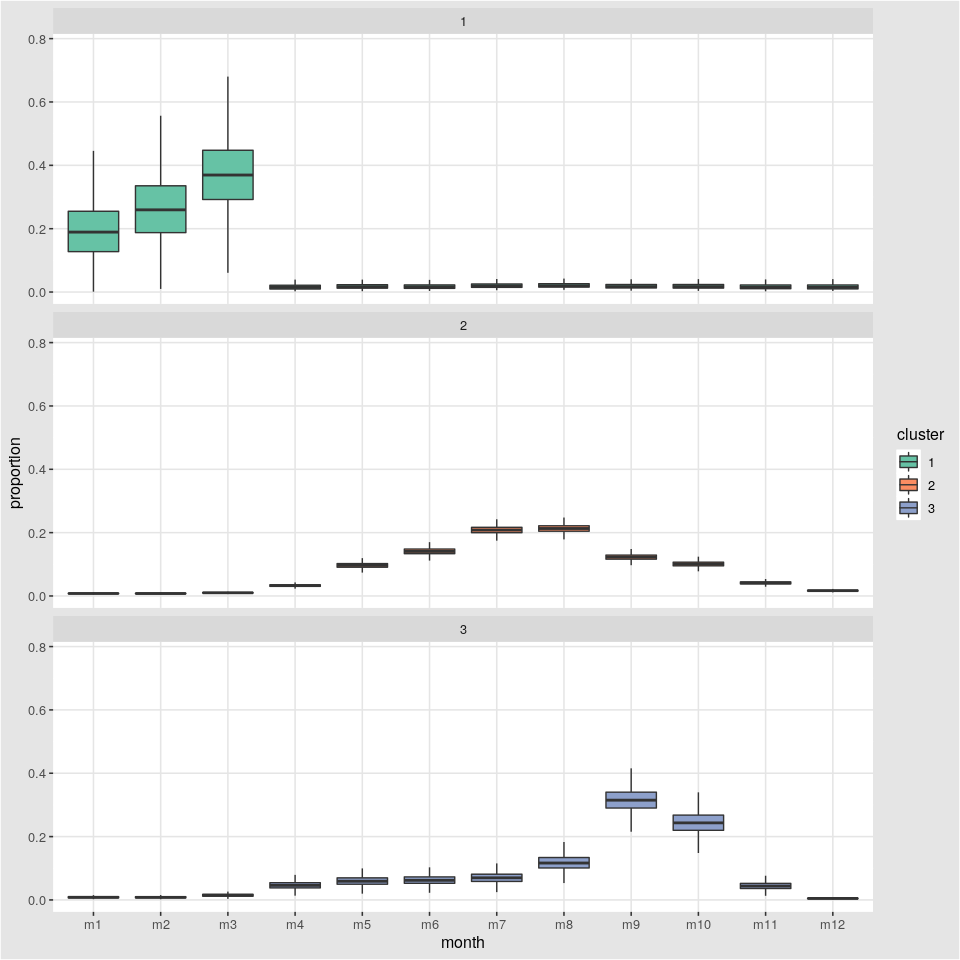<!-- -->

Clusters 1 peaks summer. Clusters 2 peaks in winter, cluster 3 lasts from may to november.

We compute some statistics to characterize the clusters.


```r
table_characteristics(myfit_yelloweel_coastal_landings, 3,clus_order)
```

<table>
<caption>characteristics of clusters</caption>
 <thead>
<tr>
<th style="border-bottom:hidden" colspan="1"></th>
<th style="border-bottom:hidden; padding-bottom:0; padding-left:3px;padding-right:3px;text-align: center; " colspan="3"><div style="border-bottom: 1px solid #ddd; padding-bottom: 5px; ">number of months to reach 80% of total</div></th>
<th style="border-bottom:hidden; padding-bottom:0; padding-left:3px;padding-right:3px;text-align: center; " colspan="3"><div style="border-bottom: 1px solid #ddd; padding-bottom: 5px; ">month of centroid</div></th>
</tr>
  <tr>
   <th style="text-align:right;"> cluster </th>
   <th style="text-align:right;"> median </th>
   <th style="text-align:right;"> q2.5% </th>
   <th style="text-align:right;"> q97.5% </th>
   <th style="text-align:right;"> median </th>
   <th style="text-align:right;"> q2.5% </th>
   <th style="text-align:right;"> q97.5% </th>
  </tr>
 </thead>
<tbody>
  <tr>
   <td style="text-align:right;"> 1 </td>
   <td style="text-align:right;"> 3 </td>
   <td style="text-align:right;"> 2 </td>
   <td style="text-align:right;"> 4 </td>
   <td style="text-align:right;"> 2.54 </td>
   <td style="text-align:right;"> 2.13 </td>
   <td style="text-align:right;"> 2.98 </td>
  </tr>
  <tr>
   <td style="text-align:right;"> 2 </td>
   <td style="text-align:right;"> 6 </td>
   <td style="text-align:right;"> 5 </td>
   <td style="text-align:right;"> 6 </td>
   <td style="text-align:right;"> 7.64 </td>
   <td style="text-align:right;"> 7.55 </td>
   <td style="text-align:right;"> 7.73 </td>
  </tr>
  <tr>
   <td style="text-align:right;"> 3 </td>
   <td style="text-align:right;"> 5 </td>
   <td style="text-align:right;"> 4 </td>
   <td style="text-align:right;"> 6 </td>
   <td style="text-align:right;"> 8.59 </td>
   <td style="text-align:right;"> 8.35 </td>
   <td style="text-align:right;"> 8.83 </td>
  </tr>
</tbody>
</table>

Duration indicates the minimum number of months that covers 80% of the wave (1st column is the median, and the 2 next one quantiles 2.5% and 97.5% of credibility intervals). Centroid is the centroid of the migration wave (e.g. 11.5 would indicate a migration centred around mid november). The first column is the median and the two next one the quantiles 2.5 and 97.5%.


We can also look at the belonging of the different groups.

```r
groups <- interaction(yelloweel_coastal_wide$emu_nameshort,
                                            yelloweel_coastal_wide$period,
                                            drop=TRUE)
group_name <- levels(groups)
  
get_pattern_month <- function(res,mydata){
  

  tmp <- strsplit(as.character(group_name),
                  "\\.")
  ser <- as.character(lapply(tmp,function(tt){
    tt[1]
  }))
  period <- as.character(lapply(tmp,function(tt){
    tt[2]
  }))
  res_mat <- as.matrix(as.mcmc.list(res,add.mutate=FALSE))
  
  clus <- t(sapply(seq_len(length(unique(groups))), function(id){
    name_col <- paste("cluster[",id,"]",sep="")
    freq <- table(res_mat[,name_col])
    max_class <- names(freq)[order(freq,decreasing=TRUE)[1]]
    c(max_class,freq[as.character(1:nbclus)])
  }))
  storage.mode(clus) <- "numeric"
  classes <- as.data.frame(clus)
  names(classes) <- c("cluster", paste("clus",seq_len(nbclus),sep=""))
  cbind.data.frame(data.frame(ser=ser, period=period),
                   classes)
}

myclassif <- get_pattern_month(myfit_yelloweel_coastal_landings)
col_toreorder=grep("clus[0-9]",names(myclassif))
names(myclassif)[col_toreorder]=paste("clus",
                                      match(paste("clus",1:nbclus,sep=""),
                                      paste("clus",clus_order,sep="")),
                                      sep="")
myclassif[,col_toreorder] <- myclassif%>%
  select(col_toreorder)%>%select(sort(names(.)))
myclassif$cluster <- factor(match(myclassif$cluster,clus_order),
                         levels=as.character(1:7))

table_classif(myclassif)
```

<table>
 <thead>
  <tr>
   <th style="text-align:left;"> EMU </th>
   <th style="text-align:left;"> period </th>
   <th style="text-align:left;"> Max cluster </th>
   <th style="text-align:right;"> % clus 1 </th>
   <th style="text-align:right;"> % clus 2 </th>
   <th style="text-align:right;"> % clus 3 </th>
  </tr>
 </thead>
<tbody>
  <tr>
   <td style="text-align:left;"> ES_Murc_C </td>
   <td style="text-align:left;"> 2 </td>
   <td style="text-align:left;"> 1 </td>
   <td style="text-align:right;"> 100 </td>
   <td style="text-align:right;"> 0 </td>
   <td style="text-align:right;"> 0 </td>
  </tr>
  <tr>
   <td style="text-align:left;"> DE_Schl_C </td>
   <td style="text-align:left;"> 1 </td>
   <td style="text-align:left;"> 2 </td>
   <td style="text-align:right;"> 0 </td>
   <td style="text-align:right;"> 98 </td>
   <td style="text-align:right;"> 2 </td>
  </tr>
  <tr>
   <td style="text-align:left;"> DE_Schl_C </td>
   <td style="text-align:left;"> 2 </td>
   <td style="text-align:left;"> 2 </td>
   <td style="text-align:right;"> 0 </td>
   <td style="text-align:right;"> 100 </td>
   <td style="text-align:right;"> 0 </td>
  </tr>
  <tr>
   <td style="text-align:left;"> DK_total_MO </td>
   <td style="text-align:left;"> 1 </td>
   <td style="text-align:left;"> 2 </td>
   <td style="text-align:right;"> 0 </td>
   <td style="text-align:right;"> 100 </td>
   <td style="text-align:right;"> 0 </td>
  </tr>
  <tr>
   <td style="text-align:left;"> DK_total_MO </td>
   <td style="text-align:left;"> 2 </td>
   <td style="text-align:left;"> 2 </td>
   <td style="text-align:right;"> 0 </td>
   <td style="text-align:right;"> 100 </td>
   <td style="text-align:right;"> 0 </td>
  </tr>
  <tr>
   <td style="text-align:left;"> GB_Angl_C </td>
   <td style="text-align:left;"> 2 </td>
   <td style="text-align:left;"> 2 </td>
   <td style="text-align:right;"> 0 </td>
   <td style="text-align:right;"> 100 </td>
   <td style="text-align:right;"> 0 </td>
  </tr>
  <tr>
   <td style="text-align:left;"> GB_SouE_C </td>
   <td style="text-align:left;"> 2 </td>
   <td style="text-align:left;"> 2 </td>
   <td style="text-align:right;"> 0 </td>
   <td style="text-align:right;"> 100 </td>
   <td style="text-align:right;"> 0 </td>
  </tr>
  <tr>
   <td style="text-align:left;"> GB_SouW_C </td>
   <td style="text-align:left;"> 2 </td>
   <td style="text-align:left;"> 2 </td>
   <td style="text-align:right;"> 0 </td>
   <td style="text-align:right;"> 100 </td>
   <td style="text-align:right;"> 0 </td>
  </tr>
  <tr>
   <td style="text-align:left;"> SE_East_C </td>
   <td style="text-align:left;"> 1 </td>
   <td style="text-align:left;"> 2 </td>
   <td style="text-align:right;"> 0 </td>
   <td style="text-align:right;"> 100 </td>
   <td style="text-align:right;"> 0 </td>
  </tr>
  <tr>
   <td style="text-align:left;"> SE_East_C </td>
   <td style="text-align:left;"> 2 </td>
   <td style="text-align:left;"> 2 </td>
   <td style="text-align:right;"> 0 </td>
   <td style="text-align:right;"> 100 </td>
   <td style="text-align:right;"> 0 </td>
  </tr>
  <tr>
   <td style="text-align:left;"> SE_West_C </td>
   <td style="text-align:left;"> 1 </td>
   <td style="text-align:left;"> 2 </td>
   <td style="text-align:right;"> 0 </td>
   <td style="text-align:right;"> 100 </td>
   <td style="text-align:right;"> 0 </td>
  </tr>
  <tr>
   <td style="text-align:left;"> DE_Eide_C </td>
   <td style="text-align:left;"> 1 </td>
   <td style="text-align:left;"> 3 </td>
   <td style="text-align:right;"> 0 </td>
   <td style="text-align:right;"> 2 </td>
   <td style="text-align:right;"> 98 </td>
  </tr>
  <tr>
   <td style="text-align:left;"> DE_Eide_C </td>
   <td style="text-align:left;"> 2 </td>
   <td style="text-align:left;"> 3 </td>
   <td style="text-align:right;"> 0 </td>
   <td style="text-align:right;"> 0 </td>
   <td style="text-align:right;"> 100 </td>
  </tr>
</tbody>
</table>

In fact, nearly all EMUs fall in cluster 3. Cluster 2 corresponds only to ES_Murc and cluster 1 to DE_Eide.


```r
myclassif_p1 <- subset(myclassif, myclassif$period == 1)
myclassif_p2 <- subset(myclassif, myclassif$period == 2)
emu$cluster1 <- factor(myclassif_p1$cluster[match(emu$name_short,
                                                  substr(myclassif_p1$ser,1,nchar(as.character(myclassif_p1$ser))-2))],
                       levels=1:7)
emu$cluster2 <- factor(myclassif_p2$cluster[match(emu$name_short,
                                                substr(myclassif_p2$ser,1,nchar(as.character(myclassif_p2$ser))-2))],
                       levels=1:7)
ggplot(data = cou) +  geom_sf(fill= "antiquewhite") +
		geom_sf(data=emu,aes(fill=cluster1)) + scale_fill_manual(values=cols)+
  theme_igray() +xlim(-20,30) + ylim(35,65) 
```

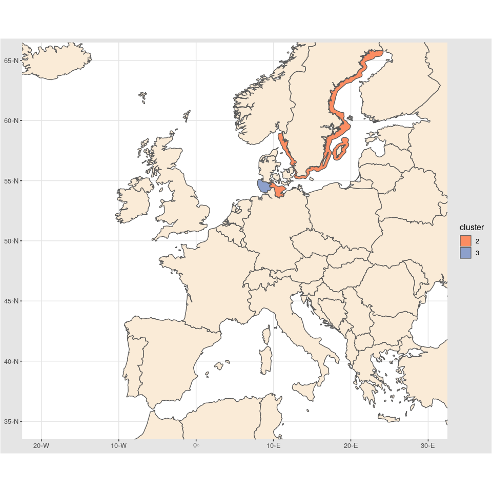<!-- -->

```r
ggplot(data = cou) +  geom_sf(fill= "antiquewhite") +
		geom_sf(data=emu,aes(fill=cluster2)) + scale_fill_manual(values=cols)+
  theme_igray() +xlim(-20,30) + ylim(35,65)  
```

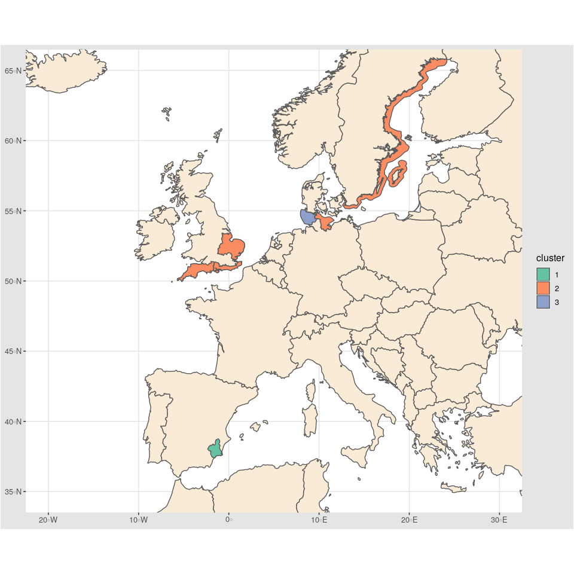<!-- -->

### Exporting pattern per group

```r
tmp <- as.matrix(as.mcmc.list(myfit_yelloweel_coastal_landings))
name_col = colnames(tmp)

pattern_Ycoast_landings=do.call("rbind.data.frame",
                                lapply(seq_len(length(levels(groups))), function(g)
                                   median_pattern_group(g, group_name,tmp, "Y","landings", hty_code="C")))


save(pattern_Ycoast_landings,file="pattern_Ycoast_landings.rdata")
```


### Similarity between and after 2010

```r
#which groups have data in both periods
occ=table(unique(yelloweel_coastal_wide[,c("emu_nameshort", "period")])[,1])
tocompare=names(occ)[which(occ>1)]

simi=sapply(tocompare, function(s){
  g=grep(s,group_name)
  esp1=tmp[,grep(paste("alpha_group\\[",g[1],",",sep=""),name_col)]
  esp2=tmp[,grep(paste("alpha_group\\[",g[2],",",sep=""),name_col)]
  quantile(apply(cbind(esp1,esp2),
                 1,
                 function(x) sum(pmin(x[1:12],x[13:24]))),
           probs=c(0.025,.5,.975))
})

similarity=data.frame(emu=tocompare,t(simi))

table_similarity(similarity)
```

<table>
<caption>similarity</caption>
 <thead>
  <tr>
   <th style="text-align:left;"> EMU </th>
   <th style="text-align:right;"> q2.5% </th>
   <th style="text-align:right;"> median </th>
   <th style="text-align:right;"> q97.5% </th>
  </tr>
 </thead>
<tbody>
  <tr>
   <td style="text-align:left;"> DE_Eide_C </td>
   <td style="text-align:right;"> 0.60 </td>
   <td style="text-align:right;"> 0.75 </td>
   <td style="text-align:right;"> 0.87 </td>
  </tr>
  <tr>
   <td style="text-align:left;"> DE_Schl_C </td>
   <td style="text-align:right;"> 0.61 </td>
   <td style="text-align:right;"> 0.75 </td>
   <td style="text-align:right;"> 0.86 </td>
  </tr>
  <tr>
   <td style="text-align:left;"> DK_total_MO </td>
   <td style="text-align:right;"> 0.78 </td>
   <td style="text-align:right;"> 0.85 </td>
   <td style="text-align:right;"> 0.91 </td>
  </tr>
  <tr>
   <td style="text-align:left;"> SE_East_C </td>
   <td style="text-align:right;"> 0.66 </td>
   <td style="text-align:right;"> 0.78 </td>
   <td style="text-align:right;"> 0.88 </td>
  </tr>
</tbody>
</table>

### Potential effect of EMP and EU closures

```r
ncar=nchar(group_name)
period=as.integer(substr(as.character(group_name),ncar,ncar))
blocks=strsplit(group_name,"_")
emus=sapply(blocks,function(x)paste(x[1],x[2],sep="_"))
hty_code=sapply(blocks,function(x) substr(x[3],1,nchar(x[3])-2))


#######EMP
list_period1=data.frame(emu_nameshort=emus[period==1])
list_period1$group=group_name[period==1]
list_period1$id_g=match(list_period1$group,group_name)
list_period1$hty_code=hty_code[period==1]
  
#we check that we have ladings data at least two years before the first EMP closures
list_period1$estimable=mapply(function(s,hty) {
  length(which(charac_EMP_closures$emu_nameshort==s 
               & grepl("Y",charac_EMP_closures$lfs_code) 
               & grepl(hty, charac_EMP_closures$hty_code)))>0},
  list_period1$emu_nameshort, list_period1$hty_code)

list_period1$estimable=list_period1$estimable &
(sapply(list_period1$id_g,function(e) min(yelloweel_coastal_wide$season[group==e]))+2 <
mapply(function(e,hty) min(charac_EMP_closures$year[charac_EMP_closures$emu_nameshort==e &
                                                           grepl("Y",charac_EMP_closures$lfs_code) &
                                                    grepl(hty,charac_EMP_closures$hty_code)]),
       list_period1$emu_nameshort, list_period1$hty_code))

list_period1$lossq2.5=NA
list_period1$lossq50=NA
list_period1$lossq97.5=NA

res_closures=mapply(function(s,g,hty) {
  emu_closures <- EMP_closures %>%
    filter(emu_nameshort==s & grepl("Y",lfs_code) & grepl(hty, hty_code)) %>%
    group_by(emu_nameshort,month) %>%
    summarize(fishery_closure_percent=max(fishery_closure_percent))
  myalpha=tmp[,paste("alpha_group[",g,",",emu_closures$month,"]",sep="")]
  if (nrow(emu_closures)>1){
    loss=colSums(apply(myalpha,1,function(x) x*emu_closures$fishery_closure_percent/100))
  } else {
    loss=myalpha*emu_closures$fishery_closure_percent/100
  }
  quantile(loss,probs=c(0.025,.5,.975))
},as.character(list_period1$emu_nameshort[list_period1$estimable]),
list_period1$id_g[list_period1$estimable],
list_period1$hty[list_period1$estimable])

list_period1[list_period1$estimable, c("lossq2.5", "lossq50","lossq97.5")] =
  t(res_closures)

kable(list_period1[,c("emu_nameshort","lossq2.5","lossq50","lossq97.5")],
      col.names=c("emu","q2.5","median","q97.5"),
      caption="proportion of catch potentially lost because of EMP closure",
      digits=2)
```

<table>
<caption>proportion of catch potentially lost because of EMP closure</caption>
 <thead>
  <tr>
   <th style="text-align:left;"> emu </th>
   <th style="text-align:left;"> q2.5 </th>
   <th style="text-align:left;"> median </th>
   <th style="text-align:left;"> q97.5 </th>
  </tr>
 </thead>
<tbody>
  <tr>
   <td style="text-align:left;"> DE_Eide </td>
   <td style="text-align:left;"> NA </td>
   <td style="text-align:left;"> NA </td>
   <td style="text-align:left;"> NA </td>
  </tr>
  <tr>
   <td style="text-align:left;"> DE_Schl </td>
   <td style="text-align:left;"> NA </td>
   <td style="text-align:left;"> NA </td>
   <td style="text-align:left;"> NA </td>
  </tr>
  <tr>
   <td style="text-align:left;"> DK_total </td>
   <td style="text-align:left;"> NA </td>
   <td style="text-align:left;"> NA </td>
   <td style="text-align:left;"> NA </td>
  </tr>
  <tr>
   <td style="text-align:left;"> SE_East </td>
   <td style="text-align:left;"> NA </td>
   <td style="text-align:left;"> NA </td>
   <td style="text-align:left;"> NA </td>
  </tr>
  <tr>
   <td style="text-align:left;"> SE_West </td>
   <td style="text-align:left;"> NA </td>
   <td style="text-align:left;"> NA </td>
   <td style="text-align:left;"> NA </td>
  </tr>
</tbody>
</table>

```r
#######EU
list_period2=data.frame(emu_nameshort=emus[period==2])
list_period2$group=group_name[period==2]
list_period2$id_g=match(list_period2$group,group_name)
list_period2$hty_code=hty_code[period==2]
  
#we check that we have ladings data at least two years before the first EMP closures
list_period2$estimable=mapply(function(s,hty) {
  length(which(charac_EU_closures$emu_nameshort==s 
               & grepl("Y",charac_EU_closures$lfs_code) 
               & grepl(hty, charac_EU_closures$hty_code)))>0},
  list_period2$emu_nameshort, list_period2$hty_code)

list_period2$estimable=list_period2$estimable &
(sapply(list_period2$id_g,function(e) min(yelloweel_coastal_wide$season[group==e]))+2 <
mapply(function(e,hty) min(charac_EU_closures$year[charac_EU_closures$emu_nameshort==e &
                                                           grepl("Y",charac_EU_closures$lfs_code) &
                                                    grepl(hty,charac_EU_closures$hty_code)]),
       list_period2$emu_nameshort, list_period2$hty_code))

list_period2$lossq2.5=NA
list_period2$lossq50=NA
list_period2$lossq97.5=NA

res_closures=mapply(function(s,g,hty) {
  emu_closures <- EU_closures %>%
    filter(emu_nameshort==s & grepl("Y", lfs_code) & grepl(hty,hty_code)) %>%
    group_by(emu_nameshort,month) %>%
    summarize(fishery_closure_percent=max(fishery_closure_percent))
  myalpha=tmp[,paste("alpha_group[",g,",",emu_closures$month,"]",sep="")]
  if (nrow(emu_closures)>1){
    loss=colSums(apply(myalpha,1,function(x) x*emu_closures$fishery_closure_percent/100))
  } else {
    loss=myalpha*emu_closures$fishery_closure_percent/100
  }
  quantile(loss,probs=c(0.025,.5,.975))
},as.character(list_period2$emu_nameshort[list_period2$estimable]),
list_period2$id_g[list_period2$estimable],
list_period2$hty_code[list_period2$estimable])

list_period2[list_period2$estimable, c("lossq2.5", "lossq50","lossq97.5")] =
  t(res_closures)

kable(list_period2[,c("emu_nameshort","lossq2.5","lossq50","lossq97.5")],
      col.names=c("emu","q2.5","median","q97.5"),
      caption="proportion of catch potentially lost because of EU closure",
      digits=2)
```

<table>
<caption>proportion of catch potentially lost because of EU closure</caption>
 <thead>
  <tr>
   <th style="text-align:left;"> emu </th>
   <th style="text-align:right;"> q2.5 </th>
   <th style="text-align:right;"> median </th>
   <th style="text-align:right;"> q97.5 </th>
  </tr>
 </thead>
<tbody>
  <tr>
   <td style="text-align:left;"> DE_Eide </td>
   <td style="text-align:right;"> 0.01 </td>
   <td style="text-align:right;"> 0.02 </td>
   <td style="text-align:right;"> 0.03 </td>
  </tr>
  <tr>
   <td style="text-align:left;"> DE_Schl </td>
   <td style="text-align:right;"> 0.02 </td>
   <td style="text-align:right;"> 0.03 </td>
   <td style="text-align:right;"> 0.04 </td>
  </tr>
  <tr>
   <td style="text-align:left;"> DK_total </td>
   <td style="text-align:right;"> 0.07 </td>
   <td style="text-align:right;"> 0.10 </td>
   <td style="text-align:right;"> 0.14 </td>
  </tr>
  <tr>
   <td style="text-align:left;"> ES_Murc </td>
   <td style="text-align:right;"> NA </td>
   <td style="text-align:right;"> NA </td>
   <td style="text-align:right;"> NA </td>
  </tr>
  <tr>
   <td style="text-align:left;"> GB_Angl </td>
   <td style="text-align:right;"> 0.00 </td>
   <td style="text-align:right;"> 0.01 </td>
   <td style="text-align:right;"> 0.02 </td>
  </tr>
  <tr>
   <td style="text-align:left;"> GB_SouE </td>
   <td style="text-align:right;"> 0.00 </td>
   <td style="text-align:right;"> 0.01 </td>
   <td style="text-align:right;"> 0.02 </td>
  </tr>
  <tr>
   <td style="text-align:left;"> GB_SouW </td>
   <td style="text-align:right;"> 0.00 </td>
   <td style="text-align:right;"> 0.01 </td>
   <td style="text-align:right;"> 0.01 </td>
  </tr>
  <tr>
   <td style="text-align:left;"> SE_East </td>
   <td style="text-align:right;"> 0.02 </td>
   <td style="text-align:right;"> 0.06 </td>
   <td style="text-align:right;"> 0.12 </td>
  </tr>
</tbody>
</table>

```r
list_period2$type="EU closure"
list_period1$type="EMP closure"
list_period=rbind.data.frame(list_period1,list_period2)
list_period$stage="Y"
save(list_period,file="loss_yellowcoastal.rdata")


####scenario per cluster
starts_closure=8:12
clus=1:nbclus
experiments=expand.grid(clus,starts_closure)
effects=t(mapply(function(c,s){
  months_closed=(s:(s+2))
  months_closed=ifelse(months_closed>12,months_closed-12,months_closed)
  pattern=tmp[,grep(paste("esp\\[",c,",",sep=""),colnames(tmp))]
  effect=rowSums(pattern[,months_closed])
  quantile(effect,probs=c(0.025,.5,.975))
},experiments[,1],experiments[,2]))
effects_scenario=data.frame(cluster=match(experiments[,1],clus_order),
                            starting_month_EU_closure=experiments[,2],
                            loss_median=effects[,2],
                            loss_2.5=effects[,1],
                            loss_97.5=effects[,3])
effects_scenario=effects_scenario[order(effects_scenario$cluster,
                                        effects_scenario$starting_month_EU_closure),]


kable(effects_scenario,row.names=FALSE,col.names=c("cluster",
                                   "speculative 1st month of EU closure",
                                   "median loss of catch",
                                   "q2.5",
                                   "q97.5"), digits=2,
      caption="potential effect that an EU closure would have depending on cluster and starting month")
```

<table>
<caption>potential effect that an EU closure would have depending on cluster and starting month</caption>
 <thead>
  <tr>
   <th style="text-align:right;"> cluster </th>
   <th style="text-align:right;"> speculative 1st month of EU closure </th>
   <th style="text-align:right;"> median loss of catch </th>
   <th style="text-align:right;"> q2.5 </th>
   <th style="text-align:right;"> q97.5 </th>
  </tr>
 </thead>
<tbody>
  <tr>
   <td style="text-align:right;"> 1 </td>
   <td style="text-align:right;"> 8 </td>
   <td style="text-align:right;"> 0.06 </td>
   <td style="text-align:right;"> 0.04 </td>
   <td style="text-align:right;"> 0.10 </td>
  </tr>
  <tr>
   <td style="text-align:right;"> 1 </td>
   <td style="text-align:right;"> 9 </td>
   <td style="text-align:right;"> 0.05 </td>
   <td style="text-align:right;"> 0.03 </td>
   <td style="text-align:right;"> 0.09 </td>
  </tr>
  <tr>
   <td style="text-align:right;"> 1 </td>
   <td style="text-align:right;"> 10 </td>
   <td style="text-align:right;"> 0.05 </td>
   <td style="text-align:right;"> 0.03 </td>
   <td style="text-align:right;"> 0.09 </td>
  </tr>
  <tr>
   <td style="text-align:right;"> 1 </td>
   <td style="text-align:right;"> 11 </td>
   <td style="text-align:right;"> 0.22 </td>
   <td style="text-align:right;"> 0.06 </td>
   <td style="text-align:right;"> 0.43 </td>
  </tr>
  <tr>
   <td style="text-align:right;"> 1 </td>
   <td style="text-align:right;"> 12 </td>
   <td style="text-align:right;"> 0.48 </td>
   <td style="text-align:right;"> 0.24 </td>
   <td style="text-align:right;"> 0.70 </td>
  </tr>
  <tr>
   <td style="text-align:right;"> 2 </td>
   <td style="text-align:right;"> 8 </td>
   <td style="text-align:right;"> 0.44 </td>
   <td style="text-align:right;"> 0.41 </td>
   <td style="text-align:right;"> 0.47 </td>
  </tr>
  <tr>
   <td style="text-align:right;"> 2 </td>
   <td style="text-align:right;"> 9 </td>
   <td style="text-align:right;"> 0.27 </td>
   <td style="text-align:right;"> 0.24 </td>
   <td style="text-align:right;"> 0.29 </td>
  </tr>
  <tr>
   <td style="text-align:right;"> 2 </td>
   <td style="text-align:right;"> 10 </td>
   <td style="text-align:right;"> 0.16 </td>
   <td style="text-align:right;"> 0.14 </td>
   <td style="text-align:right;"> 0.18 </td>
  </tr>
  <tr>
   <td style="text-align:right;"> 2 </td>
   <td style="text-align:right;"> 11 </td>
   <td style="text-align:right;"> 0.07 </td>
   <td style="text-align:right;"> 0.06 </td>
   <td style="text-align:right;"> 0.08 </td>
  </tr>
  <tr>
   <td style="text-align:right;"> 2 </td>
   <td style="text-align:right;"> 12 </td>
   <td style="text-align:right;"> 0.03 </td>
   <td style="text-align:right;"> 0.03 </td>
   <td style="text-align:right;"> 0.04 </td>
  </tr>
  <tr>
   <td style="text-align:right;"> 3 </td>
   <td style="text-align:right;"> 8 </td>
   <td style="text-align:right;"> 0.68 </td>
   <td style="text-align:right;"> 0.62 </td>
   <td style="text-align:right;"> 0.74 </td>
  </tr>
  <tr>
   <td style="text-align:right;"> 3 </td>
   <td style="text-align:right;"> 9 </td>
   <td style="text-align:right;"> 0.60 </td>
   <td style="text-align:right;"> 0.54 </td>
   <td style="text-align:right;"> 0.67 </td>
  </tr>
  <tr>
   <td style="text-align:right;"> 3 </td>
   <td style="text-align:right;"> 10 </td>
   <td style="text-align:right;"> 0.29 </td>
   <td style="text-align:right;"> 0.23 </td>
   <td style="text-align:right;"> 0.37 </td>
  </tr>
  <tr>
   <td style="text-align:right;"> 3 </td>
   <td style="text-align:right;"> 11 </td>
   <td style="text-align:right;"> 0.06 </td>
   <td style="text-align:right;"> 0.04 </td>
   <td style="text-align:right;"> 0.08 </td>
  </tr>
  <tr>
   <td style="text-align:right;"> 3 </td>
   <td style="text-align:right;"> 12 </td>
   <td style="text-align:right;"> 0.02 </td>
   <td style="text-align:right;"> 0.02 </td>
   <td style="text-align:right;"> 0.03 </td>
  </tr>
</tbody>
</table>


##transitional waters
### Data selection
Now we should carry out data selection, more specifically, we want to eliminate rows with two many missing data, too much zero and to check whether there are no duplicates (though Cedric already did it)


```r
yelloweel_transitional <- subset(yelloweel, yelloweel$hty_code =="T")
kept_seasons <- lapply(unique(yelloweel_transitional$emu_nameshort), function(s){
  sub_yellow <- subset(yelloweel_transitional, yelloweel_transitional$emu_nameshort==s)
  kept <- good_coverage_wave(sub_yellow)
  #we remove season in which we have less than 50 kg of landings
  if(!is.null(kept))
    kept <- kept[sapply(kept,function(k)
      sum(sub_yellow$das_value[sub_yellow$season==k],na.rm=TRUE)>50)]
  if (length(kept) == 0) kept <- NULL
  kept
})
```

```
## [1] "For  DE_Eide_T  a good season should cover months: 4 to 11"
## [1] "For  DE_Elbe_T  a good season should cover months: 4 to 11"
## [1] "For  FR_Adou_T  a good season should cover months: 4 to 8"
## [1] "For  FR_Arto_T  a good season should cover months: 6 to 11"
## [1] "For  FR_Bret_T  a good season should cover months: 3 to 9"
## [1] "For  FR_Cors_T  a good season should cover months: 3 to 11"
## [1] "For  FR_Garo_T  a good season should cover months: 4 to 11"
## [1] "For  FR_Loir_T  a good season should cover months: 5 to 11"
## [1] "For  FR_Sein_T  a good season should cover months: 4 to 12"
## [1] "For GB_Dee_T not possible to define a season"
## [1] "For  NO_total_T  a good season should cover months: 5 to 11"
```

Finally, here are the series kept given previous criterion.


```r
names(kept_seasons) <- unique(yelloweel_transitional$emu_nameshort)
kept_seasons[!sapply(kept_seasons,is.null)]
```

```
## $DE_Eide_T
##  [1] 2009 2010 2011 2012 2013 2014 2015 2016 2017 2018
## 
## $DE_Elbe_T
##  [1] 2009 2010 2011 2012 2013 2014 2015 2016 2017 2018
## 
## $FR_Adou_T
## [1] 2009 2011 2013 2014 2015 2016 2018
## 
## $FR_Arto_T
## [1] 2009
## 
## $FR_Bret_T
##  [1] 2009 2010 2011 2012 2013 2014 2015 2016 2017 2018
## 
## $FR_Cors_T
## [1] 2010 2011 2012 2013 2014 2015 2016 2017 2018
## 
## $FR_Garo_T
##  [1] 2009 2010 2011 2012 2013 2014 2015 2016 2017 2018
## 
## $FR_Loir_T
##  [1] 2009 2010 2011 2012 2013 2014 2015 2016 2017 2018
## 
## $FR_Sein_T
## [1] 2009 2010 2015
## 
## $NO_total_T
## [1] 2001
```


### Data preparation
We carry out the same procedure as for seasonality. 


```r
yelloweel_transitional_subset <- subset(yelloweel_transitional, 
                           mapply(function(season, series){
                             season %in% kept_seasons[[series]]
                           }, yelloweel_transitional$season, yelloweel_transitional$emu_nameshort))


yelloweel_transitional_wide <- pivot_wider(data=yelloweel_transitional_subset[, c("emu_nameshort",
                                                     "cou_code",
                                                     "season",
                                                     "das_month",
                                                     "das_value")],
                                names_from="das_month",
                                values_from="das_value")
names(yelloweel_transitional_wide)[-(1:3)] <- paste("m",
                                       names(yelloweel_transitional_wide)[-(1:3)],
                                       sep="")

###we count the number of zeros per lines to remove lines without enough
###fishes
data_poor <- data.frame(yelloweel_transitional_wide$emu_nameshort,
                        yelloweel_transitional_wide$season,
                  zero=rowSums(yelloweel_transitional_wide[, -(1:3)] == 0 |
                                 is.na(yelloweel_transitional_wide[, -(1:3)])),
           tot=rowSums(yelloweel_transitional_wide[, -(1:3)], na.rm=TRUE))
yelloweel_transitional_wide <- yelloweel_transitional_wide[data_poor$zero < 10 &
                                                             data_poor$tot>50, ]

table_datapoor(data_poor %>% filter(zero > 9 | tot<50)) #we remove years where we have less than 2 months)
```

<table>
<caption>"data poor"" situation</caption>
 <thead>
  <tr>
   <th style="text-align:left;"> EMU </th>
   <th style="text-align:right;"> season </th>
   <th style="text-align:right;"> number of zero </th>
   <th style="text-align:right;"> total catch </th>
  </tr>
 </thead>
<tbody>
  <tr>
   <td style="text-align:left;"> FR_Adou_T </td>
   <td style="text-align:right;"> 2013 </td>
   <td style="text-align:right;"> 11 </td>
   <td style="text-align:right;"> 294 </td>
  </tr>
  <tr>
   <td style="text-align:left;"> FR_Arto_T </td>
   <td style="text-align:right;"> 2009 </td>
   <td style="text-align:right;"> 11 </td>
   <td style="text-align:right;"> 330 </td>
  </tr>
  <tr>
   <td style="text-align:left;"> FR_Sein_T </td>
   <td style="text-align:right;"> 2015 </td>
   <td style="text-align:right;"> 10 </td>
   <td style="text-align:right;"> 475 </td>
  </tr>
</tbody>
</table>

It leads to a dataset with 68 rows. 

We now replace NA value per zero since we selected our dataseries with missing months corresponding to insignificant months / closed months, and we compute proportions per month for each year.


```r
yelloweel_transitional_wide <- yelloweel_transitional_wide %>%
  replace_na(replace=list(m1=0,
                          m2=0,
                          m3=0,
                          m4=0,
                          m5=0,
                          m6=0,
                          m7=0,
                          m8=0,
                          m9=0,
                          m10=0,
                          m11=0,
                          m12=0))
yelloweel_transitional_wide[, -(1:3)] <- yelloweel_transitional_wide[, -(1:3)] + 1e-3
total_catch_year <- rowSums(yelloweel_transitional_wide[, paste("m", 1:12, sep="")])
yelloweel_transitional_wide <- yelloweel_transitional_wide %>%
  mutate_at(.vars=paste("m",1:12,sep=""),function(x) x/total_catch_year)
```

The Commission asks us to compare the pattern before and after 2007, probably to see the effect of the Eel Regulation. It is therefore necessary to build a period index. However, since most countries implemented their EMPs only in 2009/2010, we split in 2010.


```r
yelloweel_transitional_wide$period <- ifelse(yelloweel_transitional_wide$season>2009,
                                  2,
                                  1)

table(yelloweel_transitional_wide$period,
       yelloweel_transitional_wide$emu_nameshort)
```

```
##    
##     DE_Eide_T DE_Elbe_T FR_Adou_T FR_Bret_T FR_Cors_T FR_Garo_T FR_Loir_T
##   1         1         1         1         1         0         1         1
##   2         9         9         5         9         9         9         9
##    
##     FR_Sein_T NO_total_T
##   1         1          1
##   2         1          0
```

The situation is not well balanced. Most EMU which have data in periods 2.


### Running the model

```r
group <- as.integer(interaction(yelloweel_transitional_wide$emu_nameshort,
                                            yelloweel_transitional_wide$period,
                                            drop=TRUE))
nb_occ_group <- table(group)
y <-as.matrix(yelloweel_transitional_wide[, paste("m", 1:12, sep="")])
```

Now, we make a loop to select the number of clusters based on a DIC criterion


```r
cl <- makeCluster(3, 'FORK')
comparison <- parSapply(cl, 2:7,
       function(nbclus){
         mydata <- build_data(nbclus)
         adapted <- FALSE
         while (!adapted){
           tryCatch({
             runjags.options(adapt.incomplete="error")
             res <- run.jags("jags_model.txt", monitor= c("deviance",
                                                          "alpha_group",
                                                          "cluster"),
                        summarise=FALSE, adapt=40000, method="parallel",
                        sample=2000,burnin=100000,n.chains=1,
                        inits=generate_init(nbclus, mydata)[[1]],
                        data=mydata)
                        adapted <- TRUE
                        res_mat <- as.matrix(as.mcmc.list(res))
                        silhouette <- median(compute_silhouette(res_mat))
                        nbused <- apply(res_mat, 1, function(iter){
                          length(table(iter[grep("cluster",
                                                 names(iter))]))
                        })
                        dic <- mean(res_mat[,1])+0.5*var(res_mat[,1])
                        stats <- c(dic,silhouette,mean(nbused))
                  }, error=function(e) {
                    print(paste("not adapted, restarting nbclus",nbclus))
                    }
                  )
         }
         stats
      })
stopCluster(cl)
best_yelloweel_transitional_landings <- data.frame(nbclus=2:(ncol(comparison)+1),
                                              dic=comparison[1, ],
                                              silhouette=comparison[2, ],
                                              nbused=comparison[3,])
save(best_yelloweel_transitional_landings, file="yelloweel_transitional_landings_jags.rdata")
```


```r
load("yelloweel_transitional_landings_jags.rdata")
best_yelloweel_transitional_landings
```

```
##   nbclus       dic silhouette nbused
## 1      2 -15909.74 0.20090660      2
## 2      3 -15863.20 0.05489090      3
## 3      4 -16252.08 0.11615278      4
## 4      5 -16456.02 0.08891747      5
## 5      6 -16581.52 0.08898468      6
## 6      7 -16559.32 0.07625377      6
```

4 appears to be a good solution: good silhouette and we have only 4 groups.


```r
nbclus <- 4
mydata <-build_data(4)
adapted <- FALSE
while (!adapted){
   tryCatch({
      runjags.options(adapt.incomplete="error")
      myfit_yelloweel_transitional_landings <- run.jags("jags_model.txt", monitor= c("cluster", "esp", "alpha_group",
                                            "cluster", "centroid",
                                            "centroid_group",
                                            "distToClust", "duration_clus",
                                            "duration_group",
                                            "lambda","id_cluster",
                                            "centroid"),
                      summarise=FALSE, adapt=20000, method="parallel",
                      sample=10000,burnin=200000,n.chains=1, thin=5,
                      inits=generate_init(nbclus, mydata)[[1]], data=mydata)
      adapted <- TRUE
    }, error=function(e) {
       print(paste("not adapted, restarting nbclus",nbclus))
    })
}


save(myfit_yelloweel_transitional_landings, best_yelloweel_transitional_landings,
     file="yelloweel_transitional_landings_jags.rdata")
```

## Results
Once fitted, we can plot monthly pattern per cluster

```r
load("yelloweel_transitional_landings_jags.rdata")
nbclus <- 4
mydata <-build_data(4)
get_pattern_month <- function(res,type="cluster"){
  res_mat <- as.matrix(as.mcmc.list(res, add.mutate=FALSE))
  if (type=="cluster"){
    sub_mat <- as.data.frame(res_mat[,grep("esp",colnames(res_mat))])
  }
  sub_mat <- sub_mat %>% 
    pivot_longer(cols=1:ncol(sub_mat),
                 names_to="param",
                 values_to="proportion")
  tmp <- lapply(as.character(sub_mat$param),function(p) strsplit(p,"[[:punct:]]"))
  sub_mat$cluster<-as.factor(
    as.integer(lapply(tmp, function(tt) tt[[1]][2])))
  sub_mat$month <- as.character(lapply(tmp,
                                       function(tt) paste("m",
                                                          tt[[1]][3],
                                                          sep="")))
  sub_mat$month <- factor(sub_mat$month, levels=paste("m", 1:12, sep=""))
  sub_mat
}

pat <-get_pattern_month(myfit_yelloweel_transitional_landings)
clus_order=c("3", "2","4","1")
pat$cluster <- factor(match(pat$cluster,clus_order),
                      levels=as.character(1:7))
ggplot(pat,aes(x=month,y=proportion))+
  geom_boxplot(aes(fill=cluster),outlier.shape=NA) +
  scale_fill_manual(values=cols)+facet_wrap(.~cluster, ncol=1)+
  theme_igray()
```

<!-- -->

There is much more diversity than in coastal waters. Some clusters peak in srping (3), summer (2), autumn (1) and one has two peaks (4). 

We compute some statistics to characterize the clusters.

```r
table_characteristics(myfit_yelloweel_transitional_landings, 4,clus_order)
```

<table>
<caption>characteristics of clusters</caption>
 <thead>
<tr>
<th style="border-bottom:hidden" colspan="1"></th>
<th style="border-bottom:hidden; padding-bottom:0; padding-left:3px;padding-right:3px;text-align: center; " colspan="3"><div style="border-bottom: 1px solid #ddd; padding-bottom: 5px; ">number of months to reach 80% of total</div></th>
<th style="border-bottom:hidden; padding-bottom:0; padding-left:3px;padding-right:3px;text-align: center; " colspan="3"><div style="border-bottom: 1px solid #ddd; padding-bottom: 5px; ">month of centroid</div></th>
</tr>
  <tr>
   <th style="text-align:right;"> cluster </th>
   <th style="text-align:right;"> median </th>
   <th style="text-align:right;"> q2.5% </th>
   <th style="text-align:right;"> q97.5% </th>
   <th style="text-align:right;"> median </th>
   <th style="text-align:right;"> q2.5% </th>
   <th style="text-align:right;"> q97.5% </th>
  </tr>
 </thead>
<tbody>
  <tr>
   <td style="text-align:right;"> 1 </td>
   <td style="text-align:right;"> 4 </td>
   <td style="text-align:right;"> 3 </td>
   <td style="text-align:right;"> 4 </td>
   <td style="text-align:right;"> 5.75 </td>
   <td style="text-align:right;"> 5.64 </td>
   <td style="text-align:right;"> 5.85 </td>
  </tr>
  <tr>
   <td style="text-align:right;"> 2 </td>
   <td style="text-align:right;"> 3 </td>
   <td style="text-align:right;"> 2 </td>
   <td style="text-align:right;"> 3 </td>
   <td style="text-align:right;"> 7.59 </td>
   <td style="text-align:right;"> 7.29 </td>
   <td style="text-align:right;"> 7.91 </td>
  </tr>
  <tr>
   <td style="text-align:right;"> 3 </td>
   <td style="text-align:right;"> 6 </td>
   <td style="text-align:right;"> 5 </td>
   <td style="text-align:right;"> 6 </td>
   <td style="text-align:right;"> 8.32 </td>
   <td style="text-align:right;"> 8.16 </td>
   <td style="text-align:right;"> 8.47 </td>
  </tr>
  <tr>
   <td style="text-align:right;"> 4 </td>
   <td style="text-align:right;"> 5 </td>
   <td style="text-align:right;"> 4 </td>
   <td style="text-align:right;"> 5 </td>
   <td style="text-align:right;"> 11.35 </td>
   <td style="text-align:right;"> 11.05 </td>
   <td style="text-align:right;"> 11.68 </td>
  </tr>
</tbody>
</table>

Duration indicates the minimum number of months that covers 80% of the wave (1st column is the median, and the 2 next one quantiles 2.5% and 97.5% of credibility intervals). Centroid is the centroid of the migration wave (e.g. 11.5 would indicate a migration centred around mid november). The first column is the median and the two next one the quantiles 2.5 and 97.5%.


We can also look at the belonging of the different groups.

```r
groups <- interaction(yelloweel_transitional_wide$emu_nameshort,
                                            yelloweel_transitional_wide$period,
                                            drop=TRUE)
group_name <- levels(groups)

get_pattern_month <- function(res,mydata){
  
  tmp <- strsplit(as.character(group_name),
                  "\\.")
  ser <- as.character(lapply(tmp,function(tt){
    tt[1]
  }))
  period <- as.character(lapply(tmp,function(tt){
    tt[2]
  }))
  res_mat <- as.matrix(as.mcmc.list(res,add.mutate=FALSE))
  
  clus <- t(sapply(seq_len(length(unique(groups))), function(id){
    name_col <- paste("cluster[",id,"]",sep="")
    freq <- table(res_mat[,name_col])
    max_class <- names(freq)[order(freq,decreasing=TRUE)[1]]
    c(max_class,freq[as.character(1:nbclus)])
  }))
  storage.mode(clus) <- "numeric"
  classes <- as.data.frame(clus)
  names(classes) <- c("cluster", paste("clus",seq_len(nbclus),sep=""))
  cbind.data.frame(data.frame(ser=ser, period=period),
                   classes)
}

myclassif <- get_pattern_month(myfit_yelloweel_transitional_landings)
col_toreorder=grep("clus[0-9]",names(myclassif))
names(myclassif)[col_toreorder]=paste("clus",
                                      match(paste("clus",1:nbclus,sep=""),
                                      paste("clus",clus_order,sep="")),
                                      sep="")
myclassif[,col_toreorder] <- myclassif%>%
  select(col_toreorder)%>%select(sort(names(.)))
myclassif$cluster <- factor(match(myclassif$cluster,clus_order),
                      levels=as.character(1:7))

table_classif(myclassif)
```

<table>
 <thead>
  <tr>
   <th style="text-align:left;"> EMU </th>
   <th style="text-align:left;"> period </th>
   <th style="text-align:left;"> Max cluster </th>
   <th style="text-align:right;"> % clus 1 </th>
   <th style="text-align:right;"> % clus 2 </th>
   <th style="text-align:right;"> % clus 3 </th>
   <th style="text-align:right;"> % clus 4 </th>
  </tr>
 </thead>
<tbody>
  <tr>
   <td style="text-align:left;"> FR_Adou_T </td>
   <td style="text-align:left;"> 1 </td>
   <td style="text-align:left;"> 1 </td>
   <td style="text-align:right;"> 100 </td>
   <td style="text-align:right;"> 0 </td>
   <td style="text-align:right;"> 0 </td>
   <td style="text-align:right;"> 0 </td>
  </tr>
  <tr>
   <td style="text-align:left;"> FR_Adou_T </td>
   <td style="text-align:left;"> 2 </td>
   <td style="text-align:left;"> 1 </td>
   <td style="text-align:right;"> 100 </td>
   <td style="text-align:right;"> 0 </td>
   <td style="text-align:right;"> 0 </td>
   <td style="text-align:right;"> 0 </td>
  </tr>
  <tr>
   <td style="text-align:left;"> FR_Bret_T </td>
   <td style="text-align:left;"> 2 </td>
   <td style="text-align:left;"> 1 </td>
   <td style="text-align:right;"> 100 </td>
   <td style="text-align:right;"> 0 </td>
   <td style="text-align:right;"> 0 </td>
   <td style="text-align:right;"> 0 </td>
  </tr>
  <tr>
   <td style="text-align:left;"> FR_Garo_T </td>
   <td style="text-align:left;"> 2 </td>
   <td style="text-align:left;"> 1 </td>
   <td style="text-align:right;"> 100 </td>
   <td style="text-align:right;"> 0 </td>
   <td style="text-align:right;"> 0 </td>
   <td style="text-align:right;"> 0 </td>
  </tr>
  <tr>
   <td style="text-align:left;"> FR_Sein_T </td>
   <td style="text-align:left;"> 1 </td>
   <td style="text-align:left;"> 1 </td>
   <td style="text-align:right;"> 100 </td>
   <td style="text-align:right;"> 0 </td>
   <td style="text-align:right;"> 0 </td>
   <td style="text-align:right;"> 0 </td>
  </tr>
  <tr>
   <td style="text-align:left;"> FR_Bret_T </td>
   <td style="text-align:left;"> 1 </td>
   <td style="text-align:left;"> 2 </td>
   <td style="text-align:right;"> 2 </td>
   <td style="text-align:right;"> 96 </td>
   <td style="text-align:right;"> 2 </td>
   <td style="text-align:right;"> 0 </td>
  </tr>
  <tr>
   <td style="text-align:left;"> FR_Sein_T </td>
   <td style="text-align:left;"> 2 </td>
   <td style="text-align:left;"> 2 </td>
   <td style="text-align:right;"> 0 </td>
   <td style="text-align:right;"> 100 </td>
   <td style="text-align:right;"> 0 </td>
   <td style="text-align:right;"> 0 </td>
  </tr>
  <tr>
   <td style="text-align:left;"> DE_Eide_T </td>
   <td style="text-align:left;"> 1 </td>
   <td style="text-align:left;"> 3 </td>
   <td style="text-align:right;"> 0 </td>
   <td style="text-align:right;"> 0 </td>
   <td style="text-align:right;"> 100 </td>
   <td style="text-align:right;"> 0 </td>
  </tr>
  <tr>
   <td style="text-align:left;"> DE_Eide_T </td>
   <td style="text-align:left;"> 2 </td>
   <td style="text-align:left;"> 3 </td>
   <td style="text-align:right;"> 0 </td>
   <td style="text-align:right;"> 0 </td>
   <td style="text-align:right;"> 100 </td>
   <td style="text-align:right;"> 0 </td>
  </tr>
  <tr>
   <td style="text-align:left;"> DE_Elbe_T </td>
   <td style="text-align:left;"> 1 </td>
   <td style="text-align:left;"> 3 </td>
   <td style="text-align:right;"> 0 </td>
   <td style="text-align:right;"> 0 </td>
   <td style="text-align:right;"> 100 </td>
   <td style="text-align:right;"> 0 </td>
  </tr>
  <tr>
   <td style="text-align:left;"> DE_Elbe_T </td>
   <td style="text-align:left;"> 2 </td>
   <td style="text-align:left;"> 3 </td>
   <td style="text-align:right;"> 0 </td>
   <td style="text-align:right;"> 0 </td>
   <td style="text-align:right;"> 100 </td>
   <td style="text-align:right;"> 0 </td>
  </tr>
  <tr>
   <td style="text-align:left;"> FR_Garo_T </td>
   <td style="text-align:left;"> 1 </td>
   <td style="text-align:left;"> 3 </td>
   <td style="text-align:right;"> 0 </td>
   <td style="text-align:right;"> 0 </td>
   <td style="text-align:right;"> 99 </td>
   <td style="text-align:right;"> 1 </td>
  </tr>
  <tr>
   <td style="text-align:left;"> FR_Loir_T </td>
   <td style="text-align:left;"> 1 </td>
   <td style="text-align:left;"> 3 </td>
   <td style="text-align:right;"> 13 </td>
   <td style="text-align:right;"> 0 </td>
   <td style="text-align:right;"> 87 </td>
   <td style="text-align:right;"> 1 </td>
  </tr>
  <tr>
   <td style="text-align:left;"> FR_Loir_T </td>
   <td style="text-align:left;"> 2 </td>
   <td style="text-align:left;"> 3 </td>
   <td style="text-align:right;"> 0 </td>
   <td style="text-align:right;"> 0 </td>
   <td style="text-align:right;"> 100 </td>
   <td style="text-align:right;"> 0 </td>
  </tr>
  <tr>
   <td style="text-align:left;"> NO_total_T </td>
   <td style="text-align:left;"> 1 </td>
   <td style="text-align:left;"> 3 </td>
   <td style="text-align:right;"> 0 </td>
   <td style="text-align:right;"> 0 </td>
   <td style="text-align:right;"> 100 </td>
   <td style="text-align:right;"> 0 </td>
  </tr>
  <tr>
   <td style="text-align:left;"> FR_Cors_T </td>
   <td style="text-align:left;"> 2 </td>
   <td style="text-align:left;"> 4 </td>
   <td style="text-align:right;"> 0 </td>
   <td style="text-align:right;"> 0 </td>
   <td style="text-align:right;"> 0 </td>
   <td style="text-align:right;"> 100 </td>
  </tr>
</tbody>
</table>

Cluster 4 stands only for Corsica. Some French EMUs have changed clusters after 2010 towards cluster 1 which has a small duration.


```r
myclassif_p1 <- subset(myclassif, myclassif$period == 1)
myclassif_p2 <- subset(myclassif, myclassif$period == 2)
emu$cluster1 <- factor(myclassif_p1$cluster[match(emu$name_short,
                                                  substr(myclassif_p1$ser,1,nchar(as.character(myclassif_p1$ser))-2))],
                       levels=1:7)
emu$cluster2 <- factor(myclassif_p2$cluster[match(emu$name_short,
                                                substr(myclassif_p2$ser,1,nchar(as.character(myclassif_p2$ser))-2))],
                       levels=1:7)
ggplot(data = cou) +  geom_sf(fill= "antiquewhite") +
		geom_sf(data=emu,aes(fill=cluster1)) + scale_fill_manual(values=cols)+
  theme_igray() +xlim(-20,30) + ylim(35,65) 
```

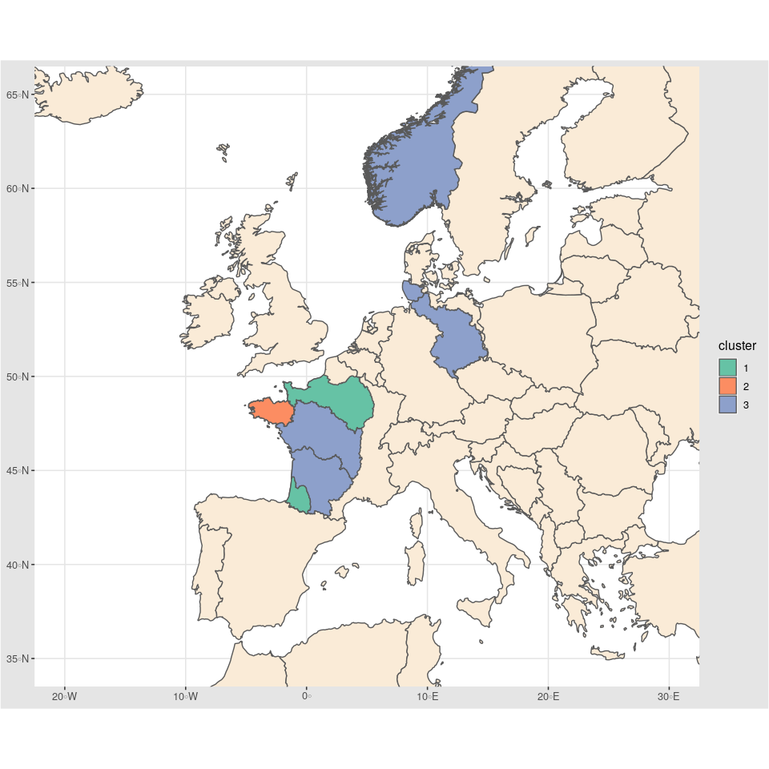<!-- -->

```r
ggplot(data = cou) +  geom_sf(fill= "antiquewhite") +
		geom_sf(data=emu,aes(fill=cluster2)) + scale_fill_manual(values=cols)+
  theme_igray() +xlim(-20,30) + ylim(35,65)  
```

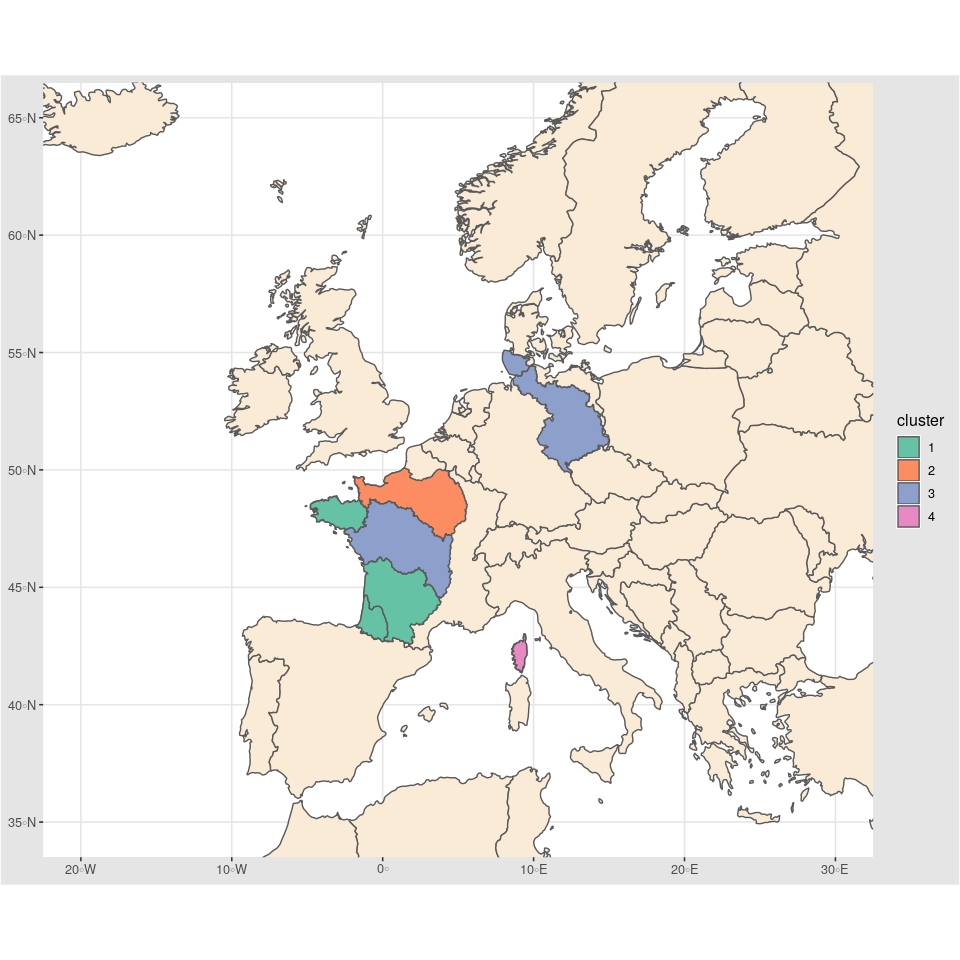<!-- -->

### Exporting pattern per group

```r
tmp <- as.matrix(as.mcmc.list(myfit_yelloweel_transitional_landings))
name_col = colnames(tmp)

pattern_Ytrans_landings=do.call("rbind.data.frame",
                                lapply(seq_len(length(levels(groups))), function(g)
                                   median_pattern_group(g, group_name,tmp, "Y","landings", hty_code="T")))
save(pattern_Ytrans_landings,file="pattern_Ytrans_landings.rdata")
```


### Similarity between and after 2010

```r
#which groups have data in both periods
occ=table(unique(yelloweel_transitional_wide[,c("emu_nameshort", "period")])[,1])
tocompare=names(occ)[which(occ>1)]

simi=sapply(tocompare, function(s){
  g=grep(s,group_name)
  esp1=tmp[,grep(paste("alpha_group\\[",g[1],",",sep=""),name_col)]
  esp2=tmp[,grep(paste("alpha_group\\[",g[2],",",sep=""),name_col)]
  quantile(apply(cbind(esp1,esp2),
                 1,
                 function(x) sum(pmin(x[1:12],x[13:24]))),
           probs=c(0.025,.5,.975))
})

similarity=data.frame(emu=tocompare,t(simi))

table_similarity(similarity)
```

<table>
<caption>similarity</caption>
 <thead>
  <tr>
   <th style="text-align:left;"> EMU </th>
   <th style="text-align:right;"> q2.5% </th>
   <th style="text-align:right;"> median </th>
   <th style="text-align:right;"> q97.5% </th>
  </tr>
 </thead>
<tbody>
  <tr>
   <td style="text-align:left;"> DE_Eide_T </td>
   <td style="text-align:right;"> 0.49 </td>
   <td style="text-align:right;"> 0.66 </td>
   <td style="text-align:right;"> 0.81 </td>
  </tr>
  <tr>
   <td style="text-align:left;"> DE_Elbe_T </td>
   <td style="text-align:right;"> 0.62 </td>
   <td style="text-align:right;"> 0.76 </td>
   <td style="text-align:right;"> 0.88 </td>
  </tr>
  <tr>
   <td style="text-align:left;"> FR_Adou_T </td>
   <td style="text-align:right;"> 0.54 </td>
   <td style="text-align:right;"> 0.72 </td>
   <td style="text-align:right;"> 0.87 </td>
  </tr>
  <tr>
   <td style="text-align:left;"> FR_Bret_T </td>
   <td style="text-align:right;"> 0.42 </td>
   <td style="text-align:right;"> 0.58 </td>
   <td style="text-align:right;"> 0.73 </td>
  </tr>
  <tr>
   <td style="text-align:left;"> FR_Garo_T </td>
   <td style="text-align:right;"> 0.44 </td>
   <td style="text-align:right;"> 0.60 </td>
   <td style="text-align:right;"> 0.75 </td>
  </tr>
  <tr>
   <td style="text-align:left;"> FR_Loir_T </td>
   <td style="text-align:right;"> 0.49 </td>
   <td style="text-align:right;"> 0.66 </td>
   <td style="text-align:right;"> 0.80 </td>
  </tr>
  <tr>
   <td style="text-align:left;"> FR_Sein_T </td>
   <td style="text-align:right;"> 0.09 </td>
   <td style="text-align:right;"> 0.14 </td>
   <td style="text-align:right;"> 0.21 </td>
  </tr>
</tbody>
</table>

### Potential effect of EMP and EU closures

```r
ncar=nchar(group_name)
period=as.integer(substr(as.character(group_name),ncar,ncar))
blocks=strsplit(group_name,"_")
emus=sapply(blocks,function(x)paste(x[1],x[2],sep="_"))
hty_code=sapply(blocks,function(x) substr(x[3],1,nchar(x[3])-2))


#######EMP
list_period1=data.frame(emu_nameshort=emus[period==1])
list_period1$group=group_name[period==1]
list_period1$id_g=match(list_period1$group,group_name)
list_period1$hty_code=hty_code[period==1]
  
#we check that we have ladings data at least two years before the first EMP closures
list_period1$estimable=mapply(function(s,hty) {
  length(which(charac_EMP_closures$emu_nameshort==s 
               & grepl("Y",charac_EMP_closures$lfs_code) 
               & grepl(hty, charac_EMP_closures$hty_code)))>0},
  list_period1$emu_nameshort, list_period1$hty_code)

list_period1$estimable=list_period1$estimable &
(sapply(list_period1$id_g,function(e) min(yelloweel_transitional_wide$season[group==e]))+2 <
mapply(function(e,hty) min(charac_EMP_closures$year[charac_EMP_closures$emu_nameshort==e &
                                                           grepl("Y",charac_EMP_closures$lfs_code) &
                                                    grepl(hty,charac_EMP_closures$hty_code)]),
       list_period1$emu_nameshort, list_period1$hty_code))

list_period1$lossq2.5=NA
list_period1$lossq50=NA
list_period1$lossq97.5=NA

res_closures=mapply(function(s,g,hty) {
  emu_closures <- EMP_closures %>%
    filter(emu_nameshort==s & grepl("Y",lfs_code) & grepl(hty, hty_code)) %>%
    group_by(emu_nameshort,month) %>%
    summarize(fishery_closure_percent=max(fishery_closure_percent))
  myalpha=tmp[,paste("alpha_group[",g,",",emu_closures$month,"]",sep="")]
  if (nrow(emu_closures)>1){
    loss=colSums(apply(myalpha,1,function(x) x*emu_closures$fishery_closure_percent/100))
  } else {
    loss=myalpha*emu_closures$fishery_closure_percent/100
  }
  quantile(loss,probs=c(0.025,.5,.975))
},as.character(list_period1$emu_nameshort[list_period1$estimable]),
list_period1$id_g[list_period1$estimable],
list_period1$hty[list_period1$estimable])

list_period1[list_period1$estimable, c("lossq2.5", "lossq50","lossq97.5")] =
  t(res_closures)

kable(list_period1[,c("emu_nameshort","lossq2.5","lossq50","lossq97.5")],
      col.names=c("emu","q2.5","median","q97.5"),
      caption="proportion of catch potentially lost because of EMP closure",
      digits=2)
```

<table>
<caption>proportion of catch potentially lost because of EMP closure</caption>
 <thead>
  <tr>
   <th style="text-align:left;"> emu </th>
   <th style="text-align:left;"> q2.5 </th>
   <th style="text-align:left;"> median </th>
   <th style="text-align:left;"> q97.5 </th>
  </tr>
 </thead>
<tbody>
  <tr>
   <td style="text-align:left;"> DE_Eide </td>
   <td style="text-align:left;"> NA </td>
   <td style="text-align:left;"> NA </td>
   <td style="text-align:left;"> NA </td>
  </tr>
  <tr>
   <td style="text-align:left;"> DE_Elbe </td>
   <td style="text-align:left;"> NA </td>
   <td style="text-align:left;"> NA </td>
   <td style="text-align:left;"> NA </td>
  </tr>
  <tr>
   <td style="text-align:left;"> FR_Adou </td>
   <td style="text-align:left;"> NA </td>
   <td style="text-align:left;"> NA </td>
   <td style="text-align:left;"> NA </td>
  </tr>
  <tr>
   <td style="text-align:left;"> FR_Bret </td>
   <td style="text-align:left;"> NA </td>
   <td style="text-align:left;"> NA </td>
   <td style="text-align:left;"> NA </td>
  </tr>
  <tr>
   <td style="text-align:left;"> FR_Garo </td>
   <td style="text-align:left;"> NA </td>
   <td style="text-align:left;"> NA </td>
   <td style="text-align:left;"> NA </td>
  </tr>
  <tr>
   <td style="text-align:left;"> FR_Loir </td>
   <td style="text-align:left;"> NA </td>
   <td style="text-align:left;"> NA </td>
   <td style="text-align:left;"> NA </td>
  </tr>
  <tr>
   <td style="text-align:left;"> FR_Sein </td>
   <td style="text-align:left;"> NA </td>
   <td style="text-align:left;"> NA </td>
   <td style="text-align:left;"> NA </td>
  </tr>
  <tr>
   <td style="text-align:left;"> NO_total </td>
   <td style="text-align:left;"> NA </td>
   <td style="text-align:left;"> NA </td>
   <td style="text-align:left;"> NA </td>
  </tr>
</tbody>
</table>

```r
#######EU
list_period2=data.frame(emu_nameshort=emus[period==2])
list_period2$group=group_name[period==2]
list_period2$id_g=match(list_period2$group,group_name)
list_period2$hty_code=hty_code[period==2]
  
#we check that we have ladings data at least two years before the first EMP closures
list_period2$estimable=mapply(function(s,hty) {
  length(which(charac_EU_closures$emu_nameshort==s 
               & grepl("Y",charac_EU_closures$lfs_code) 
               & grepl(hty, charac_EU_closures$hty_code)))>0},
  list_period2$emu_nameshort, list_period2$hty_code)

list_period2$estimable=list_period2$estimable &
(sapply(list_period2$id_g,function(e) min(yelloweel_transitional_wide$season[group==e]))+2 <
mapply(function(e,hty) min(charac_EU_closures$year[charac_EU_closures$emu_nameshort==e &
                                                           grepl("Y",charac_EU_closures$lfs_code) &
                                                    grepl(hty,charac_EU_closures$hty_code)]),
       list_period2$emu_nameshort, list_period2$hty_code))

list_period2$lossq2.5=NA
list_period2$lossq50=NA
list_period2$lossq97.5=NA

res_closures=mapply(function(s,g,hty) {
  emu_closures <- EU_closures %>%
    filter(emu_nameshort==s & grepl("Y", lfs_code) & grepl(hty,hty_code)) %>%
    group_by(emu_nameshort,month) %>%
    summarize(fishery_closure_percent=max(fishery_closure_percent))
  myalpha=tmp[,paste("alpha_group[",g,",",emu_closures$month,"]",sep="")]
  if (nrow(emu_closures)>1){
    loss=colSums(apply(myalpha,1,function(x) x*emu_closures$fishery_closure_percent/100))
  } else {
    loss=myalpha*emu_closures$fishery_closure_percent/100
  }
  quantile(loss,probs=c(0.025,.5,.975))
},as.character(list_period2$emu_nameshort[list_period2$estimable]),
list_period2$id_g[list_period2$estimable],
list_period2$hty_code[list_period2$estimable])

list_period2[list_period2$estimable, c("lossq2.5", "lossq50","lossq97.5")] =
  t(res_closures)

kable(list_period2[,c("emu_nameshort","lossq2.5","lossq50","lossq97.5")],
      col.names=c("emu","q2.5","median","q97.5"),
      caption="proportion of catch potentially lost because of EU closure",
      digits=2)
```

<table>
<caption>proportion of catch potentially lost because of EU closure</caption>
 <thead>
  <tr>
   <th style="text-align:left;"> emu </th>
   <th style="text-align:right;"> q2.5 </th>
   <th style="text-align:right;"> median </th>
   <th style="text-align:right;"> q97.5 </th>
  </tr>
 </thead>
<tbody>
  <tr>
   <td style="text-align:left;"> DE_Eide </td>
   <td style="text-align:right;"> NA </td>
   <td style="text-align:right;"> NA </td>
   <td style="text-align:right;"> NA </td>
  </tr>
  <tr>
   <td style="text-align:left;"> DE_Elbe </td>
   <td style="text-align:right;"> 0.03 </td>
   <td style="text-align:right;"> 0.05 </td>
   <td style="text-align:right;"> 0.07 </td>
  </tr>
  <tr>
   <td style="text-align:left;"> FR_Adou </td>
   <td style="text-align:right;"> NA </td>
   <td style="text-align:right;"> NA </td>
   <td style="text-align:right;"> NA </td>
  </tr>
  <tr>
   <td style="text-align:left;"> FR_Bret </td>
   <td style="text-align:right;"> NA </td>
   <td style="text-align:right;"> NA </td>
   <td style="text-align:right;"> NA </td>
  </tr>
  <tr>
   <td style="text-align:left;"> FR_Cors </td>
   <td style="text-align:right;"> 0.05 </td>
   <td style="text-align:right;"> 0.08 </td>
   <td style="text-align:right;"> 0.12 </td>
  </tr>
  <tr>
   <td style="text-align:left;"> FR_Garo </td>
   <td style="text-align:right;"> NA </td>
   <td style="text-align:right;"> NA </td>
   <td style="text-align:right;"> NA </td>
  </tr>
  <tr>
   <td style="text-align:left;"> FR_Loir </td>
   <td style="text-align:right;"> NA </td>
   <td style="text-align:right;"> NA </td>
   <td style="text-align:right;"> NA </td>
  </tr>
  <tr>
   <td style="text-align:left;"> FR_Sein </td>
   <td style="text-align:right;"> NA </td>
   <td style="text-align:right;"> NA </td>
   <td style="text-align:right;"> NA </td>
  </tr>
</tbody>
</table>

```r
list_period2$type="EU closure"
list_period1$type="EMP closure"
list_period=rbind.data.frame(list_period1,list_period2)
list_period$stage="Y"
save(list_period,file="loss_yellowtransitional.rdata")


####scenario per cluster
starts_closure=8:12
clus=1:nbclus
experiments=expand.grid(clus,starts_closure)
effects=t(mapply(function(c,s){
  months_closed=(s:(s+2))
  months_closed=ifelse(months_closed>12,months_closed-12,months_closed)
  pattern=tmp[,grep(paste("esp\\[",c,",",sep=""),colnames(tmp))]
  effect=rowSums(pattern[,months_closed])
  quantile(effect,probs=c(0.025,.5,.975))
},experiments[,1],experiments[,2]))
effects_scenario=data.frame(cluster=match(experiments[,1],clus_order),
                            starting_month_EU_closure=experiments[,2],
                            loss_median=effects[,2],
                            loss_2.5=effects[,1],
                            loss_97.5=effects[,3])
effects_scenario=effects_scenario[order(effects_scenario$cluster,
                                        effects_scenario$starting_month_EU_closure),]


kable(effects_scenario,row.names=FALSE,col.names=c("cluster",
                                   "speculative 1st month of EU closure",
                                   "median loss of catch",
                                   "q2.5",
                                   "q97.5"), digits=2,
      caption="potential effect that an EU closure would have depending on cluster and starting month")
```

<table>
<caption>potential effect that an EU closure would have depending on cluster and starting month</caption>
 <thead>
  <tr>
   <th style="text-align:right;"> cluster </th>
   <th style="text-align:right;"> speculative 1st month of EU closure </th>
   <th style="text-align:right;"> median loss of catch </th>
   <th style="text-align:right;"> q2.5 </th>
   <th style="text-align:right;"> q97.5 </th>
  </tr>
 </thead>
<tbody>
  <tr>
   <td style="text-align:right;"> 1 </td>
   <td style="text-align:right;"> 8 </td>
   <td style="text-align:right;"> 0.09 </td>
   <td style="text-align:right;"> 0.07 </td>
   <td style="text-align:right;"> 0.10 </td>
  </tr>
  <tr>
   <td style="text-align:right;"> 1 </td>
   <td style="text-align:right;"> 9 </td>
   <td style="text-align:right;"> 0.06 </td>
   <td style="text-align:right;"> 0.05 </td>
   <td style="text-align:right;"> 0.07 </td>
  </tr>
  <tr>
   <td style="text-align:right;"> 1 </td>
   <td style="text-align:right;"> 10 </td>
   <td style="text-align:right;"> 0.03 </td>
   <td style="text-align:right;"> 0.02 </td>
   <td style="text-align:right;"> 0.04 </td>
  </tr>
  <tr>
   <td style="text-align:right;"> 1 </td>
   <td style="text-align:right;"> 11 </td>
   <td style="text-align:right;"> 0.02 </td>
   <td style="text-align:right;"> 0.02 </td>
   <td style="text-align:right;"> 0.03 </td>
  </tr>
  <tr>
   <td style="text-align:right;"> 1 </td>
   <td style="text-align:right;"> 12 </td>
   <td style="text-align:right;"> 0.02 </td>
   <td style="text-align:right;"> 0.02 </td>
   <td style="text-align:right;"> 0.03 </td>
  </tr>
  <tr>
   <td style="text-align:right;"> 2 </td>
   <td style="text-align:right;"> 8 </td>
   <td style="text-align:right;"> 0.47 </td>
   <td style="text-align:right;"> 0.31 </td>
   <td style="text-align:right;"> 0.64 </td>
  </tr>
  <tr>
   <td style="text-align:right;"> 2 </td>
   <td style="text-align:right;"> 9 </td>
   <td style="text-align:right;"> 0.21 </td>
   <td style="text-align:right;"> 0.10 </td>
   <td style="text-align:right;"> 0.36 </td>
  </tr>
  <tr>
   <td style="text-align:right;"> 2 </td>
   <td style="text-align:right;"> 10 </td>
   <td style="text-align:right;"> 0.04 </td>
   <td style="text-align:right;"> 0.02 </td>
   <td style="text-align:right;"> 0.07 </td>
  </tr>
  <tr>
   <td style="text-align:right;"> 2 </td>
   <td style="text-align:right;"> 11 </td>
   <td style="text-align:right;"> 0.03 </td>
   <td style="text-align:right;"> 0.01 </td>
   <td style="text-align:right;"> 0.05 </td>
  </tr>
  <tr>
   <td style="text-align:right;"> 2 </td>
   <td style="text-align:right;"> 12 </td>
   <td style="text-align:right;"> 0.03 </td>
   <td style="text-align:right;"> 0.01 </td>
   <td style="text-align:right;"> 0.05 </td>
  </tr>
  <tr>
   <td style="text-align:right;"> 3 </td>
   <td style="text-align:right;"> 8 </td>
   <td style="text-align:right;"> 0.56 </td>
   <td style="text-align:right;"> 0.52 </td>
   <td style="text-align:right;"> 0.60 </td>
  </tr>
  <tr>
   <td style="text-align:right;"> 3 </td>
   <td style="text-align:right;"> 9 </td>
   <td style="text-align:right;"> 0.53 </td>
   <td style="text-align:right;"> 0.49 </td>
   <td style="text-align:right;"> 0.57 </td>
  </tr>
  <tr>
   <td style="text-align:right;"> 3 </td>
   <td style="text-align:right;"> 10 </td>
   <td style="text-align:right;"> 0.29 </td>
   <td style="text-align:right;"> 0.26 </td>
   <td style="text-align:right;"> 0.34 </td>
  </tr>
  <tr>
   <td style="text-align:right;"> 3 </td>
   <td style="text-align:right;"> 11 </td>
   <td style="text-align:right;"> 0.08 </td>
   <td style="text-align:right;"> 0.06 </td>
   <td style="text-align:right;"> 0.10 </td>
  </tr>
  <tr>
   <td style="text-align:right;"> 3 </td>
   <td style="text-align:right;"> 12 </td>
   <td style="text-align:right;"> 0.02 </td>
   <td style="text-align:right;"> 0.02 </td>
   <td style="text-align:right;"> 0.03 </td>
  </tr>
  <tr>
   <td style="text-align:right;"> 4 </td>
   <td style="text-align:right;"> 8 </td>
   <td style="text-align:right;"> 0.34 </td>
   <td style="text-align:right;"> 0.27 </td>
   <td style="text-align:right;"> 0.42 </td>
  </tr>
  <tr>
   <td style="text-align:right;"> 4 </td>
   <td style="text-align:right;"> 9 </td>
   <td style="text-align:right;"> 0.71 </td>
   <td style="text-align:right;"> 0.65 </td>
   <td style="text-align:right;"> 0.76 </td>
  </tr>
  <tr>
   <td style="text-align:right;"> 4 </td>
   <td style="text-align:right;"> 10 </td>
   <td style="text-align:right;"> 0.69 </td>
   <td style="text-align:right;"> 0.63 </td>
   <td style="text-align:right;"> 0.75 </td>
  </tr>
  <tr>
   <td style="text-align:right;"> 4 </td>
   <td style="text-align:right;"> 11 </td>
   <td style="text-align:right;"> 0.43 </td>
   <td style="text-align:right;"> 0.35 </td>
   <td style="text-align:right;"> 0.51 </td>
  </tr>
  <tr>
   <td style="text-align:right;"> 4 </td>
   <td style="text-align:right;"> 12 </td>
   <td style="text-align:right;"> 0.05 </td>
   <td style="text-align:right;"> 0.03 </td>
   <td style="text-align:right;"> 0.08 </td>
  </tr>
</tbody>
</table>


##freshwater waters
### Data selection
Now we should carry out data selection, more specifically, we want to eliminate rows with two many missing data, too much zero and to check whether there are no duplicates (though Cedric already did it)


```r
yelloweel_freshwater <- subset(yelloweel, yelloweel$hty_code =="F")
kept_seasons <- lapply(unique(yelloweel_freshwater$emu_nameshort), function(s){
  sub_yellow <- subset(yelloweel_freshwater, yelloweel_freshwater$emu_nameshort==s)
  kept <- good_coverage_wave(sub_yellow)
  #we remove season in which we have less than 50 kg of landings
  if(!is.null(kept))
    kept <- kept[sapply(kept,function(k)
      sum(sub_yellow$das_value[sub_yellow$season==k],na.rm=TRUE)>50)]
  if (length(kept) == 0) kept <- NULL
  kept
})
```

```
## [1] "For  DE_Eide_F  a good season should cover months: 4 to 10"
## [1] "For  DE_Elbe_F  a good season should cover months: 4 to 11"
## [1] "For  DE_Schl_F  a good season should cover months: 4 to 11"
## [1] "For  DE_Warn_F  a good season should cover months: 3 to 10"
## [1] "For FR_Adou_F not possible to define a season"
## [1] "For  FR_Garo_F  a good season should cover months: 4 to 11"
## [1] "For  FR_Loir_F  a good season should cover months: 3 to 12"
## [1] "For FR_Rhin_F not possible to define a season"
## [1] "For  FR_Rhon_F  a good season should cover months: 3 to 11"
## [1] "For  FR_Sein_F  a good season should cover months: 3 to 11"
## [1] "For  GB_Angl_F  a good season should cover months: 4 to 11"
## [1] "For  GB_Dee_F  a good season should cover months: 6 to 10"
## [1] "For  GB_Humb_F  a good season should cover months: 12 to 10"
## [1] "For  GB_NorW_F  a good season should cover months: 5 to 11"
## [1] "For  GB_SouE_F  a good season should cover months: 12 to 11"
## [1] "For  GB_SouW_F  a good season should cover months: 11 to 10"
## [1] "For  GB_Tham_F  a good season should cover months: 5 to 11"
## [1] "For  GB_Wale_F  a good season should cover months: 11 to 10"
## [1] "For IE_East_F not possible to define a season"
## [1] "For  IE_West_F  a good season should cover months: 5 to 12"
## [1] "For  SE_Inla_F  a good season should cover months: 12 to 9"
```

Finally, here are the series kept given previous criterion.


```r
names(kept_seasons) <- unique(yelloweel_freshwater$emu_nameshort)
kept_seasons[!sapply(kept_seasons,is.null)]
```

```
## $DE_Eide_F
## [1] 2009 2010
## 
## $DE_Elbe_F
##  [1] 2009 2010 2011 2012 2013 2014 2015 2016 2017 2018
## 
## $DE_Schl_F
##  [1] 2009 2010 2011 2012 2013 2014 2015 2016 2017 2018
## 
## $DE_Warn_F
## [1] 2010 2011 2012 2013 2014 2015 2016 2017 2018
## 
## $FR_Garo_F
## [1] 2000 2001 2002 2003 2007 2008 2009
## 
## $FR_Loir_F
## [1] 2000 2001 2002
## 
## $FR_Rhon_F
## [1] 2001 2002
## 
## $GB_Angl_F
## [1] 2014 2015 2016 2017 2018
## 
## $GB_Dee_F
## [1] 2014 2016 2017 2018
## 
## $GB_NorW_F
## [1] 2013 2014 2015 2016 2017
## 
## $GB_Tham_F
## [1] 2014 2015 2016 2017
## 
## $IE_West_F
## [1] 2006
```


### Data preparation
We carry out the same procedure as for seasonality. 


```r
yelloweel_freshwater_subset <- subset(yelloweel_freshwater, 
                           mapply(function(season, series){
                             season %in% kept_seasons[[series]]
                           }, yelloweel_freshwater$season, yelloweel_freshwater$emu_nameshort))


yelloweel_freshwater_wide <- pivot_wider(data=yelloweel_freshwater_subset[, c("emu_nameshort",
                                                     "cou_code",
                                                     "season",
                                                     "das_month",
                                                     "das_value")],
                                names_from="das_month",
                                values_from="das_value")
names(yelloweel_freshwater_wide)[-(1:3)] <- paste("m",
                                       names(yelloweel_freshwater_wide)[-(1:3)],
                                       sep="")

###we count the number of zeros per lines to remove lines without enough
###fishes
data_poor <- data.frame(yelloweel_freshwater_wide$emu_nameshort,
                        yelloweel_freshwater_wide$season,
                  zero=rowSums(yelloweel_freshwater_wide[, -(1:3)] == 0 |
                                 is.na(yelloweel_freshwater_wide[, -(1:3)])),
           tot=rowSums(yelloweel_freshwater_wide[, -(1:3)], na.rm=TRUE))
yelloweel_freshwater_wide <- yelloweel_freshwater_wide[data_poor$zero < 10, ]

table_datapoor(data_poor %>% filter(zero > 9 | tot<50)) #we remove years where we have less than 2 months)
```

<table>
<caption>"data poor"" situation</caption>
 <thead>
  <tr>
   <th style="text-align:left;"> EMU </th>
   <th style="text-align:right;"> season </th>
   <th style="text-align:right;"> number of zero </th>
   <th style="text-align:right;"> total catch </th>
  </tr>
 </thead>
<tbody>
  <tr>

  </tr>
</tbody>
</table>


It leads to a dataset with 62 rows. 

We now replace NA value per zero since we selected our dataseries with missing months corresponding to insignificant months / closed months, and we compute proportions per month for each year.


```r
yelloweel_freshwater_wide <- yelloweel_freshwater_wide %>%
  replace_na(replace=list(m1=0,
                          m2=0,
                          m3=0,
                          m4=0,
                          m5=0,
                          m6=0,
                          m7=0,
                          m8=0,
                          m9=0,
                          m10=0,
                          m11=0,
                          m12=0))
yelloweel_freshwater_wide[, -(1:3)] <- yelloweel_freshwater_wide[, -(1:3)] + 1e-3
total_catch_year <- rowSums(yelloweel_freshwater_wide[, paste("m", 1:12, sep="")])
yelloweel_freshwater_wide <- yelloweel_freshwater_wide %>%
  mutate_at(.vars=paste("m",1:12,sep=""),function(x) x/total_catch_year)
```


The Commission asks us to compare the pattern before and after 2007, probably to see the effect of the Eel Regulation. It is therefore necessary to build a period index. However, since most countries implemented their EMPs only in 2009/2010, we split in 2010.


```r
yelloweel_freshwater_wide$period <- ifelse(yelloweel_freshwater_wide$season>2009,
                                  2,
                                  1)

kable(table(yelloweel_freshwater_wide$period,
       yelloweel_freshwater_wide$emu_nameshort),
      row.names=TRUE,caption="number of seasons per EMU and period")
```

<table>
<caption>number of seasons per EMU and period</caption>
 <thead>
  <tr>
   <th style="text-align:left;">   </th>
   <th style="text-align:right;"> DE_Eide_F </th>
   <th style="text-align:right;"> DE_Elbe_F </th>
   <th style="text-align:right;"> DE_Schl_F </th>
   <th style="text-align:right;"> DE_Warn_F </th>
   <th style="text-align:right;"> FR_Garo_F </th>
   <th style="text-align:right;"> FR_Loir_F </th>
   <th style="text-align:right;"> FR_Rhon_F </th>
   <th style="text-align:right;"> GB_Angl_F </th>
   <th style="text-align:right;"> GB_Dee_F </th>
   <th style="text-align:right;"> GB_NorW_F </th>
   <th style="text-align:right;"> GB_Tham_F </th>
   <th style="text-align:right;"> IE_West_F </th>
  </tr>
 </thead>
<tbody>
  <tr>
   <td style="text-align:left;"> 1 </td>
   <td style="text-align:right;"> 1 </td>
   <td style="text-align:right;"> 1 </td>
   <td style="text-align:right;"> 1 </td>
   <td style="text-align:right;"> 0 </td>
   <td style="text-align:right;"> 7 </td>
   <td style="text-align:right;"> 3 </td>
   <td style="text-align:right;"> 2 </td>
   <td style="text-align:right;"> 0 </td>
   <td style="text-align:right;"> 0 </td>
   <td style="text-align:right;"> 0 </td>
   <td style="text-align:right;"> 0 </td>
   <td style="text-align:right;"> 1 </td>
  </tr>
  <tr>
   <td style="text-align:left;"> 2 </td>
   <td style="text-align:right;"> 1 </td>
   <td style="text-align:right;"> 9 </td>
   <td style="text-align:right;"> 9 </td>
   <td style="text-align:right;"> 9 </td>
   <td style="text-align:right;"> 0 </td>
   <td style="text-align:right;"> 0 </td>
   <td style="text-align:right;"> 0 </td>
   <td style="text-align:right;"> 5 </td>
   <td style="text-align:right;"> 4 </td>
   <td style="text-align:right;"> 5 </td>
   <td style="text-align:right;"> 4 </td>
   <td style="text-align:right;"> 0 </td>
  </tr>
</tbody>
</table>

The situation is not well balanced. Most EMU which have data in periods 1 don't have data in period 2 and conversely.


### Running the model

```r
group <- as.integer(interaction(yelloweel_freshwater_wide$emu_nameshort,
                                            yelloweel_freshwater_wide$period,
                                            drop=TRUE))
nb_occ_group <- table(group)
y <-as.matrix(yelloweel_freshwater_wide[, paste("m", 1:12, sep="")])
```

Now, we make a loop to select the number of clusters based on a DIC criterion


```r
cl <- makeCluster(3, 'FORK')
comparison <- parSapply(cl, 2:7,
       function(nbclus){
         mydata <- build_data(nbclus)
         adapted <- FALSE
         while (!adapted){
           tryCatch({
             runjags.options(adapt.incomplete="error")
             res <- run.jags("jags_model.txt", monitor= c("deviance",
                                                          "alpha_group",
                                                          "cluster"),
                        summarise=FALSE, adapt=40000, method="parallel",
                        sample=2000,burnin=100000,n.chains=1,
                        inits=generate_init(nbclus, mydata)[[1]],
                        data=mydata)
                        adapted <- TRUE
                        res_mat <- as.matrix(as.mcmc.list(res))
                        silhouette <- median(compute_silhouette(res_mat))
                        nbused <- apply(res_mat, 1, function(iter){
                          length(table(iter[grep("cluster",
                                                 names(iter))]))
                        })
                        dic <- mean(res_mat[,1])+0.5*var(res_mat[,1])
                        stats <- c(dic,silhouette,mean(nbused))
                  }, error=function(e) {
                    print(paste("not adapted, restarting nbclus",nbclus))
                    }
                  )
         }
         stats
      })
stopCluster(cl)
best_yelloweel_freshwater_landings <- data.frame(nbclus=2:(ncol(comparison)+1),
                                              dic=comparison[1, ],
                                              silhouette=comparison[2, ],
                                              used=comparison[3,])
save(best_yelloweel_freshwater_landings, file="yelloweel_freshwater_landings_jags.rdata")
```


```r
load("yelloweel_freshwater_landings_jags.rdata")
best_yelloweel_freshwater_landings
```

```
##   nbclus       dic silhouette used
## 1      2 -11120.11 0.18902292    2
## 2      3 -11033.32 0.01501762    3
## 3      4 -11138.97 0.08596161    3
## 4      5 -11159.30 0.09310377    3
## 5      6 -11155.76 0.11145854    3
## 6      7 -11152.48 0.04454594    4
```

Silhouette and DIC does not move much after 4, but only 3 clusters are used, therefore we keep 3.


```r
nbclus <- 3
mydata <-build_data(3)
adapted <- FALSE
while (!adapted){
   tryCatch({
      runjags.options(adapt.incomplete="error")
      myfit_yelloweel_freshwater_landings <- run.jags("jags_model.txt", monitor= c("cluster", "esp", "alpha_group",
                                            "cluster", "centroid",
                                            "centroid_group",
                                            "distToClust", "duration_clus",
                                            "duration_group",
                                            "lambda","id_cluster",
                                            "centroid"),
                      summarise=FALSE, adapt=20000, method="parallel",
                      sample=10000,burnin=200000,n.chains=1, thin=5,
                      inits=generate_init(nbclus, mydata)[[1]], data=mydata)
      adapted <- TRUE
    }, error=function(e) {
       print(paste("not adapted, restarting nbclus",nbclus))
    })
}


save(myfit_yelloweel_freshwater_landings, best_yelloweel_freshwater_landings,
     file="yelloweel_freshwater_landings_jags.rdata")
```

## Results
Once fitted, we can plot monthly pattern per cluster

```r
load("yelloweel_freshwater_landings_jags.rdata")
nbclus <- 3
mydata <-build_data(3)
get_pattern_month <- function(res,type="cluster"){
  res_mat <- as.matrix(as.mcmc.list(res, add.mutate=FALSE))
  if (type=="cluster"){
    sub_mat <- as.data.frame(res_mat[,grep("esp",colnames(res_mat))])
  }
  sub_mat <- sub_mat %>% 
    pivot_longer(cols=1:ncol(sub_mat),
                 names_to="param",
                 values_to="proportion")
  tmp <- lapply(as.character(sub_mat$param),function(p) strsplit(p,"[[:punct:]]"))
  sub_mat$cluster<-as.factor(
    as.integer(lapply(tmp, function(tt) tt[[1]][2])))
  sub_mat$month <- as.character(lapply(tmp,
                                       function(tt) paste("m",
                                                          tt[[1]][3],
                                                          sep="")))
  sub_mat$month <- factor(sub_mat$month, levels=paste("m", 1:12, sep=""))
  sub_mat
}

pat <-get_pattern_month(myfit_yelloweel_freshwater_landings)
clus_order=c("1","3","2")
pat$cluster <- factor(match(pat$cluster, clus_order),
                       levels=as.character(1:7))
ggplot(pat,aes(x=month,y=proportion))+
  geom_boxplot(aes(fill=cluster),outlier.shape=NA) +
  scale_fill_manual(values=cols)+facet_wrap(.~cluster, ncol=1) +
  theme_igray()
```

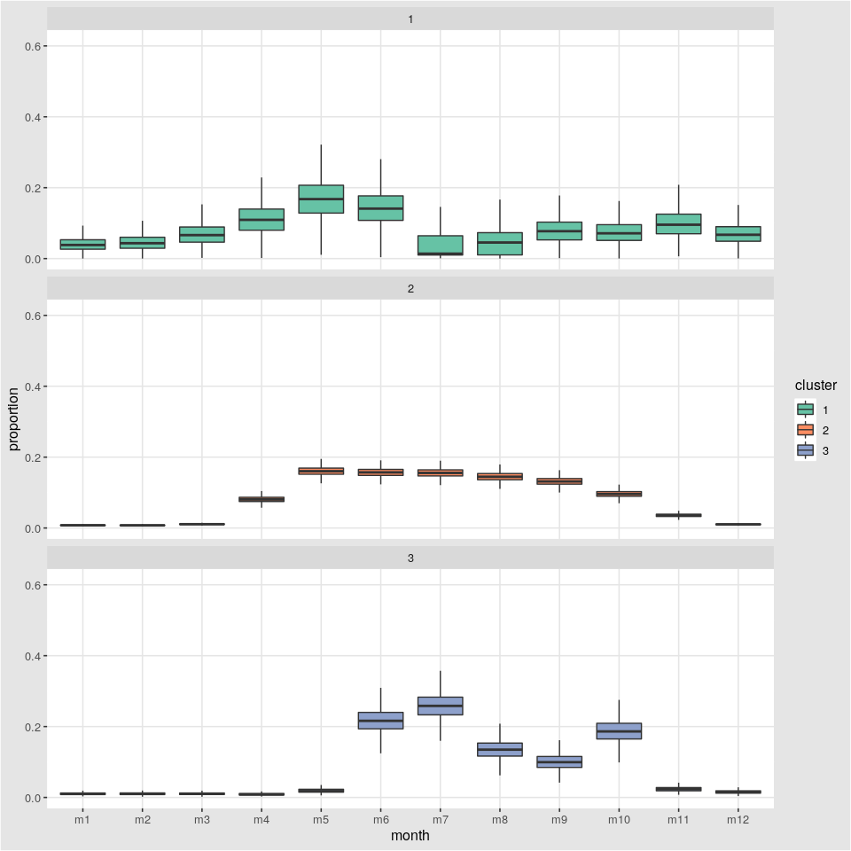<!-- -->

Clusters 1 and 3 are bivariate, with 1 peaking in spring and autumn and 3 peaking in summer and autumn. Cluster 2 is widespread from may to november.

We compute some statistics to characterize the clusters.

```r
table_characteristics(myfit_yelloweel_freshwater_landings, 3, clus_order)
```

<table>
<caption>characteristics of clusters</caption>
 <thead>
<tr>
<th style="border-bottom:hidden" colspan="1"></th>
<th style="border-bottom:hidden; padding-bottom:0; padding-left:3px;padding-right:3px;text-align: center; " colspan="3"><div style="border-bottom: 1px solid #ddd; padding-bottom: 5px; ">number of months to reach 80% of total</div></th>
<th style="border-bottom:hidden; padding-bottom:0; padding-left:3px;padding-right:3px;text-align: center; " colspan="3"><div style="border-bottom: 1px solid #ddd; padding-bottom: 5px; ">month of centroid</div></th>
</tr>
  <tr>
   <th style="text-align:right;"> cluster </th>
   <th style="text-align:right;"> median </th>
   <th style="text-align:right;"> q2.5% </th>
   <th style="text-align:right;"> q97.5% </th>
   <th style="text-align:right;"> median </th>
   <th style="text-align:right;"> q2.5% </th>
   <th style="text-align:right;"> q97.5% </th>
  </tr>
 </thead>
<tbody>
  <tr>
   <td style="text-align:right;"> 1 </td>
   <td style="text-align:right;"> 7 </td>
   <td style="text-align:right;"> 5 </td>
   <td style="text-align:right;"> 8 </td>
   <td style="text-align:right;"> 5.75 </td>
   <td style="text-align:right;"> 4.75 </td>
   <td style="text-align:right;"> 6.65 </td>
  </tr>
  <tr>
   <td style="text-align:right;"> 2 </td>
   <td style="text-align:right;"> 6 </td>
   <td style="text-align:right;"> 6 </td>
   <td style="text-align:right;"> 6 </td>
   <td style="text-align:right;"> 6.92 </td>
   <td style="text-align:right;"> 6.79 </td>
   <td style="text-align:right;"> 7.05 </td>
  </tr>
  <tr>
   <td style="text-align:right;"> 3 </td>
   <td style="text-align:right;"> 4 </td>
   <td style="text-align:right;"> 4 </td>
   <td style="text-align:right;"> 5 </td>
   <td style="text-align:right;"> 7.76 </td>
   <td style="text-align:right;"> 7.52 </td>
   <td style="text-align:right;"> 8.01 </td>
  </tr>
</tbody>
</table>

Duration indicates the minimum number of months that covers 80% of the wave (1st column is the median, and the 2 next one quantiles 2.5% and 97.5% of credibility intervals). Centroid is the centroid of the migration wave (e.g. 11.5 would indicate a migration centred around mid november). The first column is the median and the two next one the quantiles 2.5 and 97.5%.


We can also look at the belonging of the different groups.

```r
groups <- interaction(yelloweel_freshwater_wide$emu_nameshort,
                                            yelloweel_freshwater_wide$period,
                                            drop=TRUE)
group_name <- levels(groups)

get_pattern_month <- function(res,mydata){
  
  tmp <- strsplit(as.character(group_name),
                  "\\.")
  ser <- as.character(lapply(tmp,function(tt){
    tt[1]
  }))
  period <- as.character(lapply(tmp,function(tt){
    tt[2]
  }))
  res_mat <- as.matrix(as.mcmc.list(res,add.mutate=FALSE))
  
  clus <- t(sapply(seq_len(length(unique(groups))), function(id){
    name_col <- paste("cluster[",id,"]",sep="")
    freq <- table(res_mat[,name_col])
    max_class <- names(freq)[order(freq,decreasing=TRUE)[1]]
    c(max_class,freq[as.character(1:nbclus)])
  }))
  storage.mode(clus) <- "numeric"
  classes <- as.data.frame(clus)
  names(classes) <- c("cluster", paste("clus",seq_len(nbclus),sep=""))
  cbind.data.frame(data.frame(ser=ser, period=period),
                   classes)
}

myclassif <- get_pattern_month(myfit_yelloweel_freshwater_landings)
col_toreorder=grep("clus[0-9]",names(myclassif))
names(myclassif)[col_toreorder]=paste("clus",
                                      match(paste("clus",1:nbclus,sep=""),
                                      paste("clus",clus_order,sep="")),
                                      sep="")
myclassif[,col_toreorder] <- myclassif%>%
  select(col_toreorder)%>%select(sort(names(.)))
myclassif$cluster <- factor(match(myclassif$cluster, clus_order),
                       levels=as.character(1:7))

table_classif(myclassif)
```

<table>
 <thead>
  <tr>
   <th style="text-align:left;"> EMU </th>
   <th style="text-align:left;"> period </th>
   <th style="text-align:left;"> Max cluster </th>
   <th style="text-align:right;"> % clus 1 </th>
   <th style="text-align:right;"> % clus 2 </th>
   <th style="text-align:right;"> % clus 3 </th>
  </tr>
 </thead>
<tbody>
  <tr>
   <td style="text-align:left;"> FR_Loir_F </td>
   <td style="text-align:left;"> 1 </td>
   <td style="text-align:left;"> 1 </td>
   <td style="text-align:right;"> 91 </td>
   <td style="text-align:right;"> 9 </td>
   <td style="text-align:right;"> 0 </td>
  </tr>
  <tr>
   <td style="text-align:left;"> DE_Eide_F </td>
   <td style="text-align:left;"> 1 </td>
   <td style="text-align:left;"> 2 </td>
   <td style="text-align:right;"> 0 </td>
   <td style="text-align:right;"> 98 </td>
   <td style="text-align:right;"> 2 </td>
  </tr>
  <tr>
   <td style="text-align:left;"> DE_Eide_F </td>
   <td style="text-align:left;"> 2 </td>
   <td style="text-align:left;"> 2 </td>
   <td style="text-align:right;"> 0 </td>
   <td style="text-align:right;"> 99 </td>
   <td style="text-align:right;"> 1 </td>
  </tr>
  <tr>
   <td style="text-align:left;"> DE_Elbe_F </td>
   <td style="text-align:left;"> 1 </td>
   <td style="text-align:left;"> 2 </td>
   <td style="text-align:right;"> 0 </td>
   <td style="text-align:right;"> 100 </td>
   <td style="text-align:right;"> 0 </td>
  </tr>
  <tr>
   <td style="text-align:left;"> DE_Elbe_F </td>
   <td style="text-align:left;"> 2 </td>
   <td style="text-align:left;"> 2 </td>
   <td style="text-align:right;"> 0 </td>
   <td style="text-align:right;"> 100 </td>
   <td style="text-align:right;"> 0 </td>
  </tr>
  <tr>
   <td style="text-align:left;"> DE_Schl_F </td>
   <td style="text-align:left;"> 1 </td>
   <td style="text-align:left;"> 2 </td>
   <td style="text-align:right;"> 0 </td>
   <td style="text-align:right;"> 100 </td>
   <td style="text-align:right;"> 0 </td>
  </tr>
  <tr>
   <td style="text-align:left;"> DE_Schl_F </td>
   <td style="text-align:left;"> 2 </td>
   <td style="text-align:left;"> 2 </td>
   <td style="text-align:right;"> 0 </td>
   <td style="text-align:right;"> 100 </td>
   <td style="text-align:right;"> 0 </td>
  </tr>
  <tr>
   <td style="text-align:left;"> DE_Warn_F </td>
   <td style="text-align:left;"> 2 </td>
   <td style="text-align:left;"> 2 </td>
   <td style="text-align:right;"> 0 </td>
   <td style="text-align:right;"> 100 </td>
   <td style="text-align:right;"> 0 </td>
  </tr>
  <tr>
   <td style="text-align:left;"> FR_Garo_F </td>
   <td style="text-align:left;"> 1 </td>
   <td style="text-align:left;"> 2 </td>
   <td style="text-align:right;"> 0 </td>
   <td style="text-align:right;"> 100 </td>
   <td style="text-align:right;"> 0 </td>
  </tr>
  <tr>
   <td style="text-align:left;"> FR_Rhon_F </td>
   <td style="text-align:left;"> 1 </td>
   <td style="text-align:left;"> 2 </td>
   <td style="text-align:right;"> 0 </td>
   <td style="text-align:right;"> 100 </td>
   <td style="text-align:right;"> 0 </td>
  </tr>
  <tr>
   <td style="text-align:left;"> GB_Angl_F </td>
   <td style="text-align:left;"> 2 </td>
   <td style="text-align:left;"> 2 </td>
   <td style="text-align:right;"> 0 </td>
   <td style="text-align:right;"> 100 </td>
   <td style="text-align:right;"> 0 </td>
  </tr>
  <tr>
   <td style="text-align:left;"> GB_Tham_F </td>
   <td style="text-align:left;"> 2 </td>
   <td style="text-align:left;"> 2 </td>
   <td style="text-align:right;"> 0 </td>
   <td style="text-align:right;"> 100 </td>
   <td style="text-align:right;"> 0 </td>
  </tr>
  <tr>
   <td style="text-align:left;"> IE_West_F </td>
   <td style="text-align:left;"> 1 </td>
   <td style="text-align:left;"> 2 </td>
   <td style="text-align:right;"> 0 </td>
   <td style="text-align:right;"> 94 </td>
   <td style="text-align:right;"> 6 </td>
  </tr>
  <tr>
   <td style="text-align:left;"> GB_Dee_F </td>
   <td style="text-align:left;"> 2 </td>
   <td style="text-align:left;"> 3 </td>
   <td style="text-align:right;"> 0 </td>
   <td style="text-align:right;"> 0 </td>
   <td style="text-align:right;"> 100 </td>
  </tr>
  <tr>
   <td style="text-align:left;"> GB_NorW_F </td>
   <td style="text-align:left;"> 2 </td>
   <td style="text-align:left;"> 3 </td>
   <td style="text-align:right;"> 0 </td>
   <td style="text-align:right;"> 0 </td>
   <td style="text-align:right;"> 100 </td>
  </tr>
</tbody>
</table>

In fact, nearly all EMUs fall in cluster 2. Cluster 1 only corresponds to FR_Loir and cluster 3 to two bristish EMUs. There is no obvious spatial pattern nor period effect.


```r
myclassif_p1 <- subset(myclassif, myclassif$period == 1)
myclassif_p2 <- subset(myclassif, myclassif$period == 2)
emu$cluster1 <- factor(myclassif_p1$cluster[match(emu$name_short,
                                                  substr(myclassif_p1$ser,1,nchar(as.character(myclassif_p1$ser))-2))],
                       levels=1:7)
emu$cluster2 <- factor(myclassif_p2$cluster[match(emu$name_short,
                                                substr(myclassif_p2$ser,1,nchar(as.character(myclassif_p2$ser))-2))],
                       levels=1:7)
ggplot(data = cou) +  geom_sf(fill= "antiquewhite") +
		geom_sf(data=emu,aes(fill=cluster1)) + scale_fill_manual(values=cols)+
  theme_igray() +xlim(-20,30) + ylim(35,65) 
```

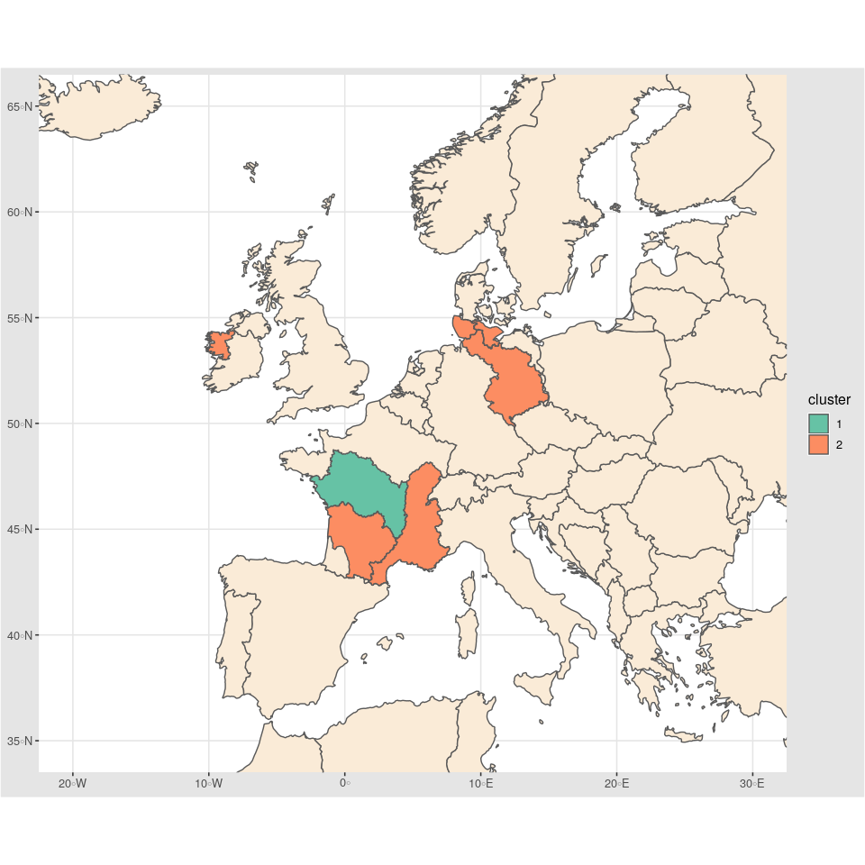<!-- -->

```r
ggplot(data = cou) +  geom_sf(fill= "antiquewhite") +
		geom_sf(data=emu,aes(fill=cluster2)) + scale_fill_manual(values=cols)+
  theme_igray() +xlim(-20,30) + ylim(35,65)  
```

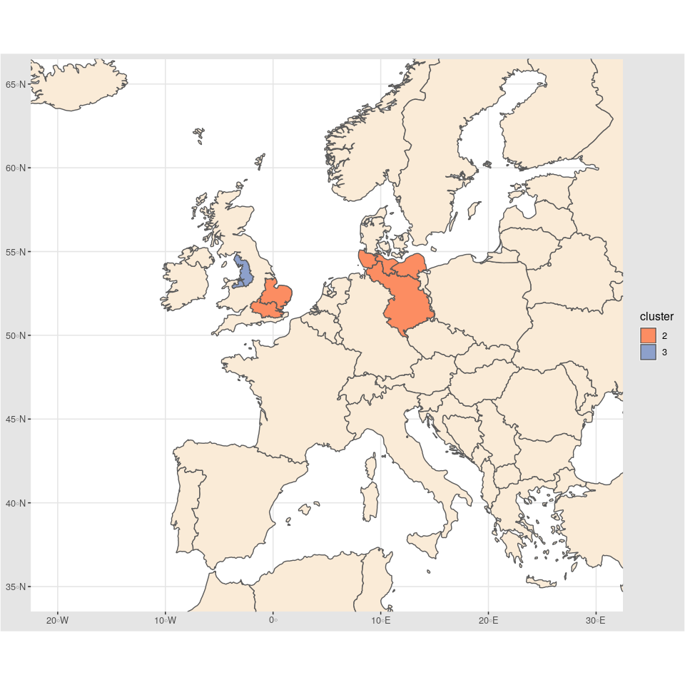<!-- -->

### Exporting pattern per group

```r
tmp <- as.matrix(as.mcmc.list(myfit_yelloweel_freshwater_landings))
name_col = colnames(tmp)

pattern_Yfresh_landings=do.call("rbind.data.frame",
                                lapply(seq_len(length(levels(groups))), function(g)
                                   median_pattern_group(g, group_name,tmp, "Y","landings", hty_code="F")))
save(pattern_Yfresh_landings,file="pattern_Yfresh_landings.rdata")
```

### Similarity between and after 2010

```r
#which groups have data in both periods
occ=table(unique(yelloweel_freshwater_wide[,c("emu_nameshort", "period")])[,1])
tocompare=names(occ)[which(occ>1)]

simi=sapply(tocompare, function(s){
  g=grep(s,group_name)
  esp1=tmp[,grep(paste("alpha_group\\[",g[1],",",sep=""),name_col)]
  esp2=tmp[,grep(paste("alpha_group\\[",g[2],",",sep=""),name_col)]
  quantile(apply(cbind(esp1,esp2),
                 1,
                 function(x) sum(pmin(x[1:12],x[13:24]))),
           probs=c(0.025,.5,.975))
})

similarity=data.frame(emu=tocompare,t(simi))

table_similarity(similarity)
```

<table>
<caption>similarity</caption>
 <thead>
  <tr>
   <th style="text-align:left;"> EMU </th>
   <th style="text-align:right;"> q2.5% </th>
   <th style="text-align:right;"> median </th>
   <th style="text-align:right;"> q97.5% </th>
  </tr>
 </thead>
<tbody>
  <tr>
   <td style="text-align:left;"> DE_Eide_F </td>
   <td style="text-align:right;"> 0.52 </td>
   <td style="text-align:right;"> 0.70 </td>
   <td style="text-align:right;"> 0.84 </td>
  </tr>
  <tr>
   <td style="text-align:left;"> DE_Elbe_F </td>
   <td style="text-align:right;"> 0.61 </td>
   <td style="text-align:right;"> 0.76 </td>
   <td style="text-align:right;"> 0.87 </td>
  </tr>
  <tr>
   <td style="text-align:left;"> DE_Schl_F </td>
   <td style="text-align:right;"> 0.60 </td>
   <td style="text-align:right;"> 0.74 </td>
   <td style="text-align:right;"> 0.86 </td>
  </tr>
</tbody>
</table>

### Potential effect of EMP and EU closures

```r
ncar=nchar(group_name)
period=as.integer(substr(as.character(group_name),ncar,ncar))
blocks=strsplit(group_name,"_")
emus=sapply(blocks,function(x)paste(x[1],x[2],sep="_"))
hty_code=sapply(blocks,function(x) substr(x[3],1,nchar(x[3])-2))


#######EMP
list_period1=data.frame(emu_nameshort=emus[period==1])
list_period1$group=group_name[period==1]
list_period1$id_g=match(list_period1$group,group_name)
list_period1$hty_code=hty_code[period==1]
  
#we check that we have ladings data at least two years before the first EMP closures
list_period1$estimable=mapply(function(s,hty) {
  length(which(charac_EMP_closures$emu_nameshort==s 
               & grepl("Y",charac_EMP_closures$lfs_code) 
               & grepl(hty, charac_EMP_closures$hty_code)))>0},
  list_period1$emu_nameshort, list_period1$hty_code)

list_period1$estimable=list_period1$estimable &
(sapply(list_period1$id_g,function(e) min(yelloweel_freshwater_wide$season[group==e]))+2 <
mapply(function(e,hty) min(charac_EMP_closures$year[charac_EMP_closures$emu_nameshort==e &
                                                           grepl("Y",charac_EMP_closures$lfs_code) &
                                                    grepl(hty,charac_EMP_closures$hty_code)]),
       list_period1$emu_nameshort, list_period1$hty_code))

list_period1$lossq2.5=NA
list_period1$lossq50=NA
list_period1$lossq97.5=NA

res_closures=mapply(function(s,g,hty) {
  emu_closures <- EMP_closures %>%
    filter(emu_nameshort==s & grepl("Y",lfs_code) & grepl(hty, hty_code)) %>%
    group_by(emu_nameshort,month) %>%
    summarize(fishery_closure_percent=max(fishery_closure_percent))
  myalpha=tmp[,paste("alpha_group[",g,",",emu_closures$month,"]",sep="")]
  if (nrow(emu_closures)>1){
    loss=colSums(apply(myalpha,1,function(x) x*emu_closures$fishery_closure_percent/100))
  } else {
    loss=myalpha*emu_closures$fishery_closure_percent/100
  }
  quantile(loss,probs=c(0.025,.5,.975))
},as.character(list_period1$emu_nameshort[list_period1$estimable]),
list_period1$id_g[list_period1$estimable],
list_period1$hty[list_period1$estimable])

list_period1[list_period1$estimable, c("lossq2.5", "lossq50","lossq97.5")] =
  t(res_closures)

kable(list_period1[,c("emu_nameshort","lossq2.5","lossq50","lossq97.5")],
      col.names=c("emu","q2.5","median","q97.5"),
      caption="proportion of catch potentially lost because of EMP closure",
      digits=2)
```

<table>
<caption>proportion of catch potentially lost because of EMP closure</caption>
 <thead>
  <tr>
   <th style="text-align:left;"> emu </th>
   <th style="text-align:right;"> q2.5 </th>
   <th style="text-align:right;"> median </th>
   <th style="text-align:right;"> q97.5 </th>
  </tr>
 </thead>
<tbody>
  <tr>
   <td style="text-align:left;"> DE_Eide </td>
   <td style="text-align:right;"> NA </td>
   <td style="text-align:right;"> NA </td>
   <td style="text-align:right;"> NA </td>
  </tr>
  <tr>
   <td style="text-align:left;"> DE_Elbe </td>
   <td style="text-align:right;"> NA </td>
   <td style="text-align:right;"> NA </td>
   <td style="text-align:right;"> NA </td>
  </tr>
  <tr>
   <td style="text-align:left;"> DE_Schl </td>
   <td style="text-align:right;"> NA </td>
   <td style="text-align:right;"> NA </td>
   <td style="text-align:right;"> NA </td>
  </tr>
  <tr>
   <td style="text-align:left;"> FR_Garo </td>
   <td style="text-align:right;"> 0.30 </td>
   <td style="text-align:right;"> 0.37 </td>
   <td style="text-align:right;"> 0.44 </td>
  </tr>
  <tr>
   <td style="text-align:left;"> FR_Loir </td>
   <td style="text-align:right;"> 0.40 </td>
   <td style="text-align:right;"> 0.48 </td>
   <td style="text-align:right;"> 0.56 </td>
  </tr>
  <tr>
   <td style="text-align:left;"> FR_Rhon </td>
   <td style="text-align:right;"> 0.28 </td>
   <td style="text-align:right;"> 0.36 </td>
   <td style="text-align:right;"> 0.46 </td>
  </tr>
  <tr>
   <td style="text-align:left;"> IE_West </td>
   <td style="text-align:right;"> NA </td>
   <td style="text-align:right;"> NA </td>
   <td style="text-align:right;"> NA </td>
  </tr>
</tbody>
</table>

```r
#######EU
list_period2=data.frame(emu_nameshort=emus[period==2])
list_period2$group=group_name[period==2]
list_period2$id_g=match(list_period2$group,group_name)
list_period2$hty_code=hty_code[period==2]
  
#we check that we have ladings data at least two years before the first EMP closures
list_period2$estimable=mapply(function(s,hty) {
  length(which(charac_EU_closures$emu_nameshort==s 
               & grepl("Y",charac_EU_closures$lfs_code) 
               & grepl(hty, charac_EU_closures$hty_code)))>0},
  list_period2$emu_nameshort, list_period2$hty_code)

list_period2$estimable=list_period2$estimable &
(sapply(list_period2$id_g,function(e) min(yelloweel_freshwater_wide$season[group==e]))+2 <
mapply(function(e,hty) min(charac_EU_closures$year[charac_EU_closures$emu_nameshort==e &
                                                           grepl("Y",charac_EU_closures$lfs_code) &
                                                    grepl(hty,charac_EU_closures$hty_code)]),
       list_period2$emu_nameshort, list_period2$hty_code))

list_period2$lossq2.5=NA
list_period2$lossq50=NA
list_period2$lossq97.5=NA

res_closures=mapply(function(s,g,hty) {
  emu_closures <- EU_closures %>%
    filter(emu_nameshort==s & grepl("Y", lfs_code) & grepl(hty,hty_code)) %>%
    group_by(emu_nameshort,month) %>%
    summarize(fishery_closure_percent=max(fishery_closure_percent))
  myalpha=tmp[,paste("alpha_group[",g,",",emu_closures$month,"]",sep="")]
  if (nrow(emu_closures)>1){
    loss=colSums(apply(myalpha,1,function(x) x*emu_closures$fishery_closure_percent/100))
  } else {
    loss=myalpha*emu_closures$fishery_closure_percent/100
  }
  quantile(loss,probs=c(0.025,.5,.975))
},as.character(list_period2$emu_nameshort[list_period2$estimable]),
list_period2$id_g[list_period2$estimable],
list_period2$hty_code[list_period2$estimable])

list_period2[list_period2$estimable, c("lossq2.5", "lossq50","lossq97.5")] =
  t(res_closures)

kable(list_period2[,c("emu_nameshort","lossq2.5","lossq50","lossq97.5")],
      col.names=c("emu","q2.5","median","q97.5"),
      caption="proportion of catch potentially lost because of EU closure",
      digits=2)
```

<table>
<caption>proportion of catch potentially lost because of EU closure</caption>
 <thead>
  <tr>
   <th style="text-align:left;"> emu </th>
   <th style="text-align:right;"> q2.5 </th>
   <th style="text-align:right;"> median </th>
   <th style="text-align:right;"> q97.5 </th>
  </tr>
 </thead>
<tbody>
  <tr>
   <td style="text-align:left;"> DE_Eide </td>
   <td style="text-align:right;"> NA </td>
   <td style="text-align:right;"> NA </td>
   <td style="text-align:right;"> NA </td>
  </tr>
  <tr>
   <td style="text-align:left;"> DE_Elbe </td>
   <td style="text-align:right;"> NA </td>
   <td style="text-align:right;"> NA </td>
   <td style="text-align:right;"> NA </td>
  </tr>
  <tr>
   <td style="text-align:left;"> DE_Schl </td>
   <td style="text-align:right;"> NA </td>
   <td style="text-align:right;"> NA </td>
   <td style="text-align:right;"> NA </td>
  </tr>
  <tr>
   <td style="text-align:left;"> DE_Warn </td>
   <td style="text-align:right;"> NA </td>
   <td style="text-align:right;"> NA </td>
   <td style="text-align:right;"> NA </td>
  </tr>
  <tr>
   <td style="text-align:left;"> GB_Angl </td>
   <td style="text-align:right;"> 0.01 </td>
   <td style="text-align:right;"> 0.03 </td>
   <td style="text-align:right;"> 0.05 </td>
  </tr>
  <tr>
   <td style="text-align:left;"> GB_Dee </td>
   <td style="text-align:right;"> 0.01 </td>
   <td style="text-align:right;"> 0.02 </td>
   <td style="text-align:right;"> 0.04 </td>
  </tr>
  <tr>
   <td style="text-align:left;"> GB_NorW </td>
   <td style="text-align:right;"> 0.01 </td>
   <td style="text-align:right;"> 0.01 </td>
   <td style="text-align:right;"> 0.03 </td>
  </tr>
  <tr>
   <td style="text-align:left;"> GB_Tham </td>
   <td style="text-align:right;"> 0.00 </td>
   <td style="text-align:right;"> 0.01 </td>
   <td style="text-align:right;"> 0.02 </td>
  </tr>
</tbody>
</table>

```r
list_period2$type="EU closure"
list_period1$type="EMP closure"
list_period=rbind.data.frame(list_period1,list_period2)
list_period$stage="Y"
save(list_period,file="loss_yellowfresh.rdata")


####scenario per cluster
starts_closure=8:12
clus=1:nbclus
experiments=expand.grid(clus,starts_closure)
effects=t(mapply(function(c,s){
  months_closed=(s:(s+2))
  months_closed=ifelse(months_closed>12,months_closed-12,months_closed)
  pattern=tmp[,grep(paste("esp\\[",c,",",sep=""),colnames(tmp))]
  effect=rowSums(pattern[,months_closed])
  quantile(effect,probs=c(0.025,.5,.975))
},experiments[,1],experiments[,2]))
effects_scenario=data.frame(cluster=match(experiments[,1],clus_order),
                            starting_month_EU_closure=experiments[,2],
                            loss_median=effects[,2],
                            loss_2.5=effects[,1],
                            loss_97.5=effects[,3])
effects_scenario=effects_scenario[order(effects_scenario$cluster,
                                        effects_scenario$starting_month_EU_closure),]


kable(effects_scenario,row.names=FALSE,col.names=c("cluster",
                                   "speculative 1st month of EU closure",
                                   "median loss of catch",
                                   "q2.5",
                                   "q97.5"), digits=2,
      caption="potential effect that an EU closure would have depending on cluster and starting month")
```

<table>
<caption>potential effect that an EU closure would have depending on cluster and starting month</caption>
 <thead>
  <tr>
   <th style="text-align:right;"> cluster </th>
   <th style="text-align:right;"> speculative 1st month of EU closure </th>
   <th style="text-align:right;"> median loss of catch </th>
   <th style="text-align:right;"> q2.5 </th>
   <th style="text-align:right;"> q97.5 </th>
  </tr>
 </thead>
<tbody>
  <tr>
   <td style="text-align:right;"> 1 </td>
   <td style="text-align:right;"> 8 </td>
   <td style="text-align:right;"> 0.20 </td>
   <td style="text-align:right;"> 0.10 </td>
   <td style="text-align:right;"> 0.35 </td>
  </tr>
  <tr>
   <td style="text-align:right;"> 1 </td>
   <td style="text-align:right;"> 9 </td>
   <td style="text-align:right;"> 0.25 </td>
   <td style="text-align:right;"> 0.14 </td>
   <td style="text-align:right;"> 0.39 </td>
  </tr>
  <tr>
   <td style="text-align:right;"> 1 </td>
   <td style="text-align:right;"> 10 </td>
   <td style="text-align:right;"> 0.24 </td>
   <td style="text-align:right;"> 0.14 </td>
   <td style="text-align:right;"> 0.38 </td>
  </tr>
  <tr>
   <td style="text-align:right;"> 1 </td>
   <td style="text-align:right;"> 11 </td>
   <td style="text-align:right;"> 0.21 </td>
   <td style="text-align:right;"> 0.12 </td>
   <td style="text-align:right;"> 0.36 </td>
  </tr>
  <tr>
   <td style="text-align:right;"> 1 </td>
   <td style="text-align:right;"> 12 </td>
   <td style="text-align:right;"> 0.16 </td>
   <td style="text-align:right;"> 0.08 </td>
   <td style="text-align:right;"> 0.34 </td>
  </tr>
  <tr>
   <td style="text-align:right;"> 2 </td>
   <td style="text-align:right;"> 8 </td>
   <td style="text-align:right;"> 0.37 </td>
   <td style="text-align:right;"> 0.34 </td>
   <td style="text-align:right;"> 0.41 </td>
  </tr>
  <tr>
   <td style="text-align:right;"> 2 </td>
   <td style="text-align:right;"> 9 </td>
   <td style="text-align:right;"> 0.26 </td>
   <td style="text-align:right;"> 0.24 </td>
   <td style="text-align:right;"> 0.29 </td>
  </tr>
  <tr>
   <td style="text-align:right;"> 2 </td>
   <td style="text-align:right;"> 10 </td>
   <td style="text-align:right;"> 0.14 </td>
   <td style="text-align:right;"> 0.12 </td>
   <td style="text-align:right;"> 0.16 </td>
  </tr>
  <tr>
   <td style="text-align:right;"> 2 </td>
   <td style="text-align:right;"> 11 </td>
   <td style="text-align:right;"> 0.05 </td>
   <td style="text-align:right;"> 0.04 </td>
   <td style="text-align:right;"> 0.06 </td>
  </tr>
  <tr>
   <td style="text-align:right;"> 2 </td>
   <td style="text-align:right;"> 12 </td>
   <td style="text-align:right;"> 0.03 </td>
   <td style="text-align:right;"> 0.02 </td>
   <td style="text-align:right;"> 0.03 </td>
  </tr>
  <tr>
   <td style="text-align:right;"> 3 </td>
   <td style="text-align:right;"> 8 </td>
   <td style="text-align:right;"> 0.42 </td>
   <td style="text-align:right;"> 0.35 </td>
   <td style="text-align:right;"> 0.50 </td>
  </tr>
  <tr>
   <td style="text-align:right;"> 3 </td>
   <td style="text-align:right;"> 9 </td>
   <td style="text-align:right;"> 0.31 </td>
   <td style="text-align:right;"> 0.24 </td>
   <td style="text-align:right;"> 0.39 </td>
  </tr>
  <tr>
   <td style="text-align:right;"> 3 </td>
   <td style="text-align:right;"> 10 </td>
   <td style="text-align:right;"> 0.23 </td>
   <td style="text-align:right;"> 0.17 </td>
   <td style="text-align:right;"> 0.29 </td>
  </tr>
  <tr>
   <td style="text-align:right;"> 3 </td>
   <td style="text-align:right;"> 11 </td>
   <td style="text-align:right;"> 0.05 </td>
   <td style="text-align:right;"> 0.03 </td>
   <td style="text-align:right;"> 0.07 </td>
  </tr>
  <tr>
   <td style="text-align:right;"> 3 </td>
   <td style="text-align:right;"> 12 </td>
   <td style="text-align:right;"> 0.04 </td>
   <td style="text-align:right;"> 0.02 </td>
   <td style="text-align:right;"> 0.05 </td>
  </tr>
</tbody>
</table>


##All habitats
### Data selection
Now we should carry out data selection, more specifically, we want to eliminate rows with two many missing data, too much zero and to check whether there are no duplicates (though Cedric already did it)


```r
yelloweel_allhab <- yelloweel
kept_seasons <- lapply(unique(yelloweel_allhab$emu_nameshort), function(s){
  sub_yellow <- subset(yelloweel_allhab, yelloweel_allhab$emu_nameshort==s)
  kept <- good_coverage_wave(sub_yellow)
  #we remove season in which we have less than 50 kg of landings
  if(!is.null(kept))
    kept <- kept[sapply(kept,function(k)
      sum(sub_yellow$das_value[sub_yellow$season==k],na.rm=TRUE)>50)]
  if (length(kept) == 0) kept <- NULL
  kept
})
```

```
## [1] "For  DE_Eide_C  a good season should cover months: 5 to 11"
## [1] "For  DE_Eide_F  a good season should cover months: 4 to 10"
## [1] "For  DE_Eide_T  a good season should cover months: 4 to 11"
## [1] "For  DE_Elbe_F  a good season should cover months: 4 to 11"
## [1] "For  DE_Elbe_T  a good season should cover months: 4 to 11"
## [1] "For  DE_Schl_C  a good season should cover months: 5 to 11"
## [1] "For  DE_Schl_F  a good season should cover months: 4 to 11"
## [1] "For  DE_Warn_F  a good season should cover months: 3 to 10"
## [1] "For  DK_total_MO  a good season should cover months: 4 to 11"
## [1] "For  ES_Murc_C  a good season should cover months: 11 to 3"
## [1] "For FR_Adou_F not possible to define a season"
## [1] "For  FR_Adou_T  a good season should cover months: 4 to 8"
## [1] "For  FR_Arto_T  a good season should cover months: 6 to 11"
## [1] "For  FR_Bret_T  a good season should cover months: 3 to 9"
## [1] "For  FR_Cors_T  a good season should cover months: 3 to 11"
## [1] "For  FR_Garo_F  a good season should cover months: 4 to 11"
## [1] "For  FR_Garo_T  a good season should cover months: 4 to 11"
## [1] "For  FR_Loir_F  a good season should cover months: 3 to 12"
## [1] "For  FR_Loir_T  a good season should cover months: 5 to 11"
## [1] "For FR_Rhin_F not possible to define a season"
## [1] "For  FR_Rhon_F  a good season should cover months: 3 to 11"
## [1] "For  FR_Sein_F  a good season should cover months: 3 to 11"
## [1] "For  FR_Sein_T  a good season should cover months: 4 to 12"
## [1] "For  GB_Angl_C  a good season should cover months: 5 to 11"
## [1] "For  GB_Angl_F  a good season should cover months: 4 to 11"
## [1] "For  GB_Dee_F  a good season should cover months: 6 to 10"
## [1] "For GB_Dee_T not possible to define a season"
## [1] "For  GB_Humb_F  a good season should cover months: 12 to 10"
## [1] "For  GB_NorW_C  a good season should cover months: 5 to 8"
## [1] "For  GB_NorW_F  a good season should cover months: 5 to 11"
## [1] "For  GB_SouE_C  a good season should cover months: 4 to 10"
## [1] "For  GB_SouE_F  a good season should cover months: 12 to 11"
## [1] "For  GB_SouW_C  a good season should cover months: 4 to 11"
## [1] "For  GB_SouW_F  a good season should cover months: 11 to 10"
## [1] "For  GB_Tham_F  a good season should cover months: 5 to 11"
## [1] "For  GB_Tham_C  a good season should cover months: 5 to 4"
## [1] "For  GB_Wale_F  a good season should cover months: 11 to 10"
## [1] "For IE_East_F not possible to define a season"
## [1] "For  IE_West_F  a good season should cover months: 5 to 12"
## [1] "For  NO_total_T  a good season should cover months: 5 to 11"
## [1] "For  SE_East_C  a good season should cover months: 4 to 11"
## [1] "For  SE_Inla_F  a good season should cover months: 12 to 9"
## [1] "For  SE_West_C  a good season should cover months: 5 to 11"
```

Finally, here are the series kept given previous criterion.


```r
names(kept_seasons) <- unique(yelloweel_allhab$emu_nameshort)
kept_seasons[!sapply(kept_seasons,is.null)]
```

```
## $DE_Eide_C
##  [1] 2009 2010 2011 2012 2013 2014 2015 2016 2017 2018
## 
## $DE_Eide_F
## [1] 2009 2010
## 
## $DE_Eide_T
##  [1] 2009 2010 2011 2012 2013 2014 2015 2016 2017 2018
## 
## $DE_Elbe_F
##  [1] 2009 2010 2011 2012 2013 2014 2015 2016 2017 2018
## 
## $DE_Elbe_T
##  [1] 2009 2010 2011 2012 2013 2014 2015 2016 2017 2018
## 
## $DE_Schl_C
##  [1] 2009 2010 2011 2012 2013 2014 2015 2016 2017 2018
## 
## $DE_Schl_F
##  [1] 2009 2010 2011 2012 2013 2014 2015 2016 2017 2018
## 
## $DE_Warn_F
## [1] 2010 2011 2012 2013 2014 2015 2016 2017 2018
## 
## $DK_total_MO
##  [1] 2000 2001 2002 2003 2004 2005 2006 2007 2008 2009 2010 2011 2012 2013
## [15] 2014 2015 2016 2017 2018 2019
## 
## $ES_Murc_C
## [1] 2014 2016
## 
## $FR_Adou_T
## [1] 2009 2011 2013 2014 2015 2016 2018
## 
## $FR_Arto_T
## [1] 2009
## 
## $FR_Bret_T
##  [1] 2009 2010 2011 2012 2013 2014 2015 2016 2017 2018
## 
## $FR_Cors_T
## [1] 2010 2011 2012 2013 2014 2015 2016 2017 2018
## 
## $FR_Garo_F
## [1] 2000 2001 2002 2003 2007 2008 2009
## 
## $FR_Garo_T
##  [1] 2009 2010 2011 2012 2013 2014 2015 2016 2017 2018
## 
## $FR_Loir_F
## [1] 2000 2001 2002
## 
## $FR_Loir_T
##  [1] 2009 2010 2011 2012 2013 2014 2015 2016 2017 2018
## 
## $FR_Rhon_F
## [1] 2001 2002
## 
## $FR_Sein_T
## [1] 2009 2010 2015
## 
## $GB_Angl_C
## [1] 2014 2015 2016 2017 2018
## 
## $GB_Angl_F
## [1] 2014 2015 2016 2017 2018
## 
## $GB_Dee_F
## [1] 2014 2016 2017 2018
## 
## $GB_NorW_F
## [1] 2013 2014 2015 2016 2017
## 
## $GB_SouE_C
## [1] 2013 2014 2015 2016 2017
## 
## $GB_SouW_C
## [1] 2013 2014 2015 2016 2017
## 
## $GB_Tham_F
## [1] 2014 2015 2016 2017
## 
## $IE_West_F
## [1] 2006
## 
## $NO_total_T
## [1] 2001
## 
## $SE_East_C
##  [1] 2000 2001 2002 2003 2004 2005 2006 2007 2008 2012 2013
## 
## $SE_West_C
## [1] 2000 2001 2002 2003 2004 2005 2006 2007 2008
```


### Data preparation
We carry out the same procedure as for seasonality. 


```r
yelloweel_allhab_subset <- subset(yelloweel_allhab, 
                           mapply(function(season, series){
                             season %in% kept_seasons[[series]]
                           }, yelloweel_allhab$season, yelloweel_allhab$emu_nameshort))


yelloweel_allhab_wide <- pivot_wider(data=yelloweel_allhab_subset[, c("emu_nameshort",
                                                     "cou_code",
                                                     "season",
                                                     "das_month",
                                                     "das_value")],
                                names_from="das_month",
                                values_from="das_value")
names(yelloweel_allhab_wide)[-(1:3)] <- paste("m",
                                       names(yelloweel_allhab_wide)[-(1:3)],
                                       sep="")

###we count the number of zeros per lines to remove lines without enough
###fishes
data_poor <- data.frame(yelloweel_allhab_wide$emu_nameshort,
                        yelloweel_allhab_wide$season,
                  zero=rowSums(yelloweel_allhab_wide[, -(1:3)] == 0 |
                                 is.na(yelloweel_allhab_wide[, -(1:3)])),
           tot=rowSums(yelloweel_allhab_wide[, -(1:3)], na.rm=TRUE))
yelloweel_allhab_wide <- yelloweel_allhab_wide[data_poor$zero < 10 & data_poor$tot>50, ]
table_datapoor(data_poor %>% filter(zero > 9 | tot<50)) #we remove years where we have less than 2 months)
```

<table>
<caption>"data poor"" situation</caption>
 <thead>
  <tr>
   <th style="text-align:left;"> EMU </th>
   <th style="text-align:right;"> season </th>
   <th style="text-align:right;"> number of zero </th>
   <th style="text-align:right;"> total catch </th>
  </tr>
 </thead>
<tbody>
  <tr>
   <td style="text-align:left;"> ES_Murc_C </td>
   <td style="text-align:right;"> 2014 </td>
   <td style="text-align:right;"> 10 </td>
   <td style="text-align:right;"> 2623 </td>
  </tr>
  <tr>
   <td style="text-align:left;"> FR_Adou_T </td>
   <td style="text-align:right;"> 2013 </td>
   <td style="text-align:right;"> 11 </td>
   <td style="text-align:right;"> 294 </td>
  </tr>
  <tr>
   <td style="text-align:left;"> FR_Arto_T </td>
   <td style="text-align:right;"> 2009 </td>
   <td style="text-align:right;"> 11 </td>
   <td style="text-align:right;"> 330 </td>
  </tr>
  <tr>
   <td style="text-align:left;"> FR_Sein_T </td>
   <td style="text-align:right;"> 2015 </td>
   <td style="text-align:right;"> 10 </td>
   <td style="text-align:right;"> 475 </td>
  </tr>
  <tr>
   <td style="text-align:left;"> GB_SouE_C </td>
   <td style="text-align:right;"> 2013 </td>
   <td style="text-align:right;"> 11 </td>
   <td style="text-align:right;"> 64 </td>
  </tr>
</tbody>
</table>


It leads to a dataset with 205 rows. 

We now replace NA value per zero since we selected our dataseries with missing months corresponding to insignificant months / closed months, and we compute proportions per month for each year.


```r
yelloweel_allhab_wide <- yelloweel_allhab_wide %>%
  replace_na(replace=list(m1=0,
                          m2=0,
                          m3=0,
                          m4=0,
                          m5=0,
                          m6=0,
                          m7=0,
                          m8=0,
                          m9=0,
                          m10=0,
                          m11=0,
                          m12=0))
yelloweel_allhab_wide[, -(1:3)] <- yelloweel_allhab_wide[, -(1:3)] + 1e-3
total_catch_year <- rowSums(yelloweel_allhab_wide[, paste("m", 1:12, sep="")])
yelloweel_allhab_wide <- yelloweel_allhab_wide %>%
  mutate_at(.vars=paste("m",1:12,sep=""),function(x) x/total_catch_year)
```

The Commission asks us to compare the pattern before and after 2007, probably to see the effect of the Eel Regulation. It is therefore necessary to build a period index. However, since most countries implemented their EMPs only in 2009/2010, we split in 2010.


```r
yelloweel_allhab_wide$period <- ifelse(yelloweel_allhab_wide$season>2009,
                                  2,
                                  1)

kable(table(yelloweel_allhab_wide$period,
       yelloweel_allhab_wide$emu_nameshort),
      row.names=TRUE,caption="number of seasons per EMU and period")
```

<table>
<caption>number of seasons per EMU and period</caption>
 <thead>
  <tr>
   <th style="text-align:left;">   </th>
   <th style="text-align:right;"> DE_Eide_C </th>
   <th style="text-align:right;"> DE_Eide_F </th>
   <th style="text-align:right;"> DE_Eide_T </th>
   <th style="text-align:right;"> DE_Elbe_F </th>
   <th style="text-align:right;"> DE_Elbe_T </th>
   <th style="text-align:right;"> DE_Schl_C </th>
   <th style="text-align:right;"> DE_Schl_F </th>
   <th style="text-align:right;"> DE_Warn_F </th>
   <th style="text-align:right;"> DK_total_MO </th>
   <th style="text-align:right;"> ES_Murc_C </th>
   <th style="text-align:right;"> FR_Adou_T </th>
   <th style="text-align:right;"> FR_Bret_T </th>
   <th style="text-align:right;"> FR_Cors_T </th>
   <th style="text-align:right;"> FR_Garo_F </th>
   <th style="text-align:right;"> FR_Garo_T </th>
   <th style="text-align:right;"> FR_Loir_F </th>
   <th style="text-align:right;"> FR_Loir_T </th>
   <th style="text-align:right;"> FR_Rhon_F </th>
   <th style="text-align:right;"> FR_Sein_T </th>
   <th style="text-align:right;"> GB_Angl_C </th>
   <th style="text-align:right;"> GB_Angl_F </th>
   <th style="text-align:right;"> GB_Dee_F </th>
   <th style="text-align:right;"> GB_NorW_F </th>
   <th style="text-align:right;"> GB_SouE_C </th>
   <th style="text-align:right;"> GB_SouW_C </th>
   <th style="text-align:right;"> GB_Tham_F </th>
   <th style="text-align:right;"> IE_West_F </th>
   <th style="text-align:right;"> NO_total_T </th>
   <th style="text-align:right;"> SE_East_C </th>
   <th style="text-align:right;"> SE_West_C </th>
  </tr>
 </thead>
<tbody>
  <tr>
   <td style="text-align:left;"> 1 </td>
   <td style="text-align:right;"> 1 </td>
   <td style="text-align:right;"> 1 </td>
   <td style="text-align:right;"> 1 </td>
   <td style="text-align:right;"> 1 </td>
   <td style="text-align:right;"> 1 </td>
   <td style="text-align:right;"> 1 </td>
   <td style="text-align:right;"> 1 </td>
   <td style="text-align:right;"> 0 </td>
   <td style="text-align:right;"> 10 </td>
   <td style="text-align:right;"> 0 </td>
   <td style="text-align:right;"> 1 </td>
   <td style="text-align:right;"> 1 </td>
   <td style="text-align:right;"> 0 </td>
   <td style="text-align:right;"> 7 </td>
   <td style="text-align:right;"> 1 </td>
   <td style="text-align:right;"> 3 </td>
   <td style="text-align:right;"> 1 </td>
   <td style="text-align:right;"> 2 </td>
   <td style="text-align:right;"> 1 </td>
   <td style="text-align:right;"> 0 </td>
   <td style="text-align:right;"> 0 </td>
   <td style="text-align:right;"> 0 </td>
   <td style="text-align:right;"> 0 </td>
   <td style="text-align:right;"> 0 </td>
   <td style="text-align:right;"> 0 </td>
   <td style="text-align:right;"> 0 </td>
   <td style="text-align:right;"> 1 </td>
   <td style="text-align:right;"> 1 </td>
   <td style="text-align:right;"> 9 </td>
   <td style="text-align:right;"> 9 </td>
  </tr>
  <tr>
   <td style="text-align:left;"> 2 </td>
   <td style="text-align:right;"> 9 </td>
   <td style="text-align:right;"> 1 </td>
   <td style="text-align:right;"> 9 </td>
   <td style="text-align:right;"> 9 </td>
   <td style="text-align:right;"> 9 </td>
   <td style="text-align:right;"> 9 </td>
   <td style="text-align:right;"> 9 </td>
   <td style="text-align:right;"> 9 </td>
   <td style="text-align:right;"> 10 </td>
   <td style="text-align:right;"> 1 </td>
   <td style="text-align:right;"> 5 </td>
   <td style="text-align:right;"> 9 </td>
   <td style="text-align:right;"> 9 </td>
   <td style="text-align:right;"> 0 </td>
   <td style="text-align:right;"> 9 </td>
   <td style="text-align:right;"> 0 </td>
   <td style="text-align:right;"> 9 </td>
   <td style="text-align:right;"> 0 </td>
   <td style="text-align:right;"> 1 </td>
   <td style="text-align:right;"> 5 </td>
   <td style="text-align:right;"> 5 </td>
   <td style="text-align:right;"> 4 </td>
   <td style="text-align:right;"> 5 </td>
   <td style="text-align:right;"> 4 </td>
   <td style="text-align:right;"> 5 </td>
   <td style="text-align:right;"> 4 </td>
   <td style="text-align:right;"> 0 </td>
   <td style="text-align:right;"> 0 </td>
   <td style="text-align:right;"> 2 </td>
   <td style="text-align:right;"> 0 </td>
  </tr>
</tbody>
</table>

The situation is not well balanced. Most EMU which have data in periods 1 don't have data in period 2 and conversely.


### Running the model

```r
group <- as.integer(interaction(yelloweel_allhab_wide$emu_nameshort,
                                            yelloweel_allhab_wide$period,
                                            drop=TRUE))
nb_occ_group <- table(group)
y <-as.matrix(yelloweel_allhab_wide[, paste("m", 1:12, sep="")])
```

Now, we make a loop to select the number of clusters based on a DIC criterion


```r
cl <- makeCluster(3, 'FORK')
comparison <- parSapply(cl,2:7,
       function(nbclus){
         mydata <- build_data(nbclus)
         adapted <- FALSE
         while (!adapted){
           tryCatch({
             runjags.options(adapt.incomplete="error")
             res <- run.jags("jags_model.txt", monitor= c("deviance",
                                                          "alpha_group",
                                                          "cluster"),
                        summarise=FALSE, adapt=40000, method="parallel",
                        sample=2000,burnin=100000,n.chains=1,
                        inits=generate_init(nbclus, mydata)[[1]],
                        data=mydata)
                        adapted <- TRUE
                        res_mat <- as.matrix(as.mcmc.list(res))
                        silhouette <- median(compute_silhouette(res_mat))
                        nbused <- apply(res_mat, 1, function(iter){
                          length(table(iter[grep("cluster",
                                                 names(iter))]))
                        })
                        dic <- mean(res_mat[,1])+0.5*var(res_mat[,1])
                        stats <- c(dic,silhouette,mean(nbused))
                  }, error=function(e) {
                    print(paste("not adapted, restarting nbclus",nbclus))
                    }
                  )
         }
         stats
      })
stopCluster(cl)
best_yelloweel_allhab_landings <- data.frame(nbclus=2:(ncol(comparison)+1),
                                              dic=comparison[1, ],
                                              silhouette=comparison[2, ],
                                              used=comparison[3, ])
save(best_yelloweel_allhab_landings, file="yelloweel_allhab_landings_jags.rdata")
```


```r
load("yelloweel_allhab_landings_jags.rdata")
best_yelloweel_allhab_landings
```

```
##   nbclus       dic silhouette used
## 1      2 -39569.75 0.15070626    2
## 2      3 -39533.64 0.35762186    3
## 3      4 -40311.51 0.10330834    4
## 4      5 -40640.97 0.09872620    5
## 5      6 -40877.49 0.12790819    6
## 6      7 -41046.74 0.05064337    7
```

The number of clusters used keep increasing, there is a good silhouette and DIC at 6.


```r
nbclus <- 6
mydata <-build_data(6)
adapted <- FALSE
while (!adapted){
   tryCatch({
      runjags.options(adapt.incomplete="error")
      myfit_yelloweel_allhab_landings <- run.jags("jags_model.txt", monitor= c("cluster", "esp", "alpha_group",
                                            "cluster", "centroid",
                                            "centroid_group",
                                            "distToClust", "duration_clus",
                                            "duration_group",
                                            "lambda","id_cluster",
                                            "centroid"),
                      summarise=FALSE, adapt=20000, method="parallel",
                      sample=10000,burnin=200000,n.chains=1, thin=5,
                      inits=generate_init(nbclus, mydata)[[1]], data=mydata)
      adapted <- TRUE
    }, error=function(e) {
       print(paste("not adapted, restarting nbclus",nbclus))
    })
}


save(myfit_yelloweel_allhab_landings, best_yelloweel_allhab_landings,
     file="yelloweel_allhab_landings_jags.rdata")
```

## Results
Once fitted, we can plot monthly pattern per cluster

```r
load("yelloweel_allhab_landings_jags.rdata")
nbclus <- 6
mydata <-build_data(6)
get_pattern_month <- function(res,type="cluster"){
  res_mat <- as.matrix(as.mcmc.list(res, add.mutate=FALSE))
  if (type=="cluster"){
    sub_mat <- as.data.frame(res_mat[,grep("esp",colnames(res_mat))])
  }
  sub_mat <- sub_mat %>% 
    pivot_longer(cols=1:ncol(sub_mat),
                 names_to="param",
                 values_to="proportion")
  tmp <- lapply(as.character(sub_mat$param),function(p) strsplit(p,"[[:punct:]]"))
  sub_mat$cluster<-as.factor(
    as.integer(lapply(tmp, function(tt) tt[[1]][2])))
  sub_mat$month <- as.character(lapply(tmp,
                                       function(tt) paste("m",
                                                          tt[[1]][3],
                                                          sep="")))
  sub_mat$month <- factor(sub_mat$month, levels=paste("m", 1:12, sep=""))
  sub_mat
}

pat <-get_pattern_month(myfit_yelloweel_allhab_landings)
clus_order=c("1","2","5","3","6","4")
pat$cluster <- factor(match(pat$cluster, clus_order),
                       levels=as.character(1:7))

ggplot(pat,aes(x=month,y=proportion))+
  geom_boxplot(aes(fill=cluster),outlier.shape=NA) +
  scale_fill_manual(values=cols)+facet_wrap(.~cluster, ncol=1) +
  theme_igray()
```

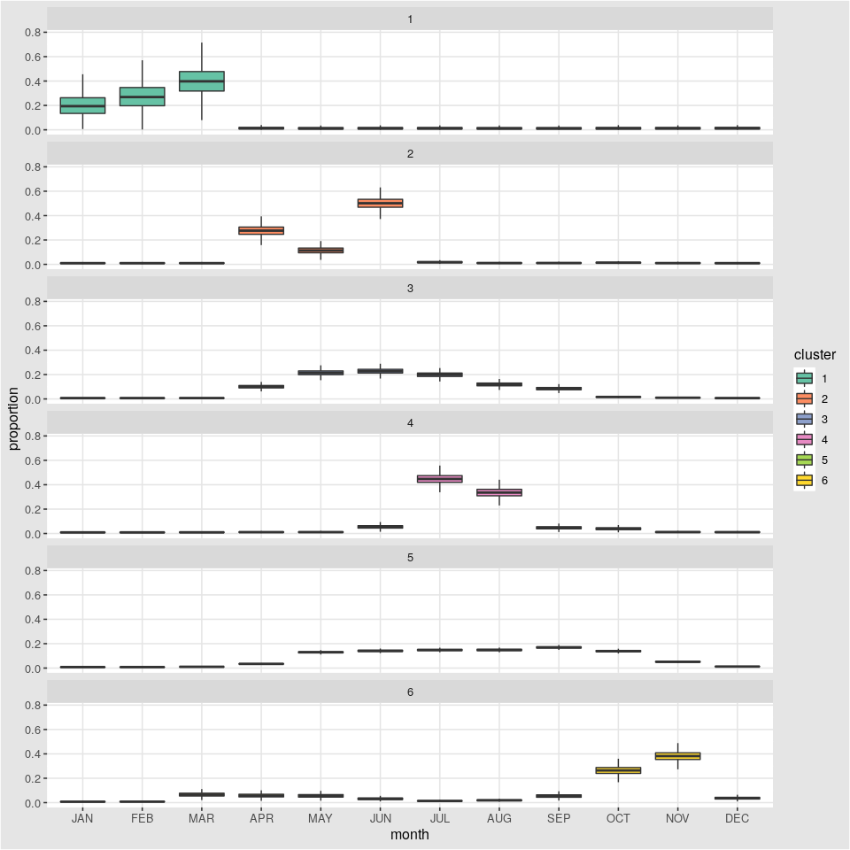<!-- -->

Cluster 1 peaks in winter, 2 in spring, 3 in spring/summer, 5 is wisepread from april to november and 6 peaks in autumn (after a small peak in spring). 

We compute some statistics to characterize the clusters.

```r
table_characteristics(myfit_yelloweel_allhab_landings, 6, clus_order)
```

<table>
<caption>characteristics of clusters</caption>
 <thead>
<tr>
<th style="border-bottom:hidden" colspan="1"></th>
<th style="border-bottom:hidden; padding-bottom:0; padding-left:3px;padding-right:3px;text-align: center; " colspan="3"><div style="border-bottom: 1px solid #ddd; padding-bottom: 5px; ">number of months to reach 80% of total</div></th>
<th style="border-bottom:hidden; padding-bottom:0; padding-left:3px;padding-right:3px;text-align: center; " colspan="3"><div style="border-bottom: 1px solid #ddd; padding-bottom: 5px; ">month of centroid</div></th>
</tr>
  <tr>
   <th style="text-align:right;"> cluster </th>
   <th style="text-align:right;"> median </th>
   <th style="text-align:right;"> q2.5% </th>
   <th style="text-align:right;"> q97.5% </th>
   <th style="text-align:right;"> median </th>
   <th style="text-align:right;"> q2.5% </th>
   <th style="text-align:right;"> q97.5% </th>
  </tr>
 </thead>
<tbody>
  <tr>
   <td style="text-align:right;"> 1 </td>
   <td style="text-align:right;"> 3 </td>
   <td style="text-align:right;"> 2 </td>
   <td style="text-align:right;"> 3 </td>
   <td style="text-align:right;"> 2.44 </td>
   <td style="text-align:right;"> 2.01 </td>
   <td style="text-align:right;"> 2.83 </td>
  </tr>
  <tr>
   <td style="text-align:right;"> 2 </td>
   <td style="text-align:right;"> 3 </td>
   <td style="text-align:right;"> 2 </td>
   <td style="text-align:right;"> 3 </td>
   <td style="text-align:right;"> 5.45 </td>
   <td style="text-align:right;"> 5.26 </td>
   <td style="text-align:right;"> 5.64 </td>
  </tr>
  <tr>
   <td style="text-align:right;"> 3 </td>
   <td style="text-align:right;"> 5 </td>
   <td style="text-align:right;"> 4 </td>
   <td style="text-align:right;"> 5 </td>
   <td style="text-align:right;"> 6.35 </td>
   <td style="text-align:right;"> 6.17 </td>
   <td style="text-align:right;"> 6.51 </td>
  </tr>
  <tr>
   <td style="text-align:right;"> 4 </td>
   <td style="text-align:right;"> 3 </td>
   <td style="text-align:right;"> 2 </td>
   <td style="text-align:right;"> 3 </td>
   <td style="text-align:right;"> 7.51 </td>
   <td style="text-align:right;"> 7.39 </td>
   <td style="text-align:right;"> 7.64 </td>
  </tr>
  <tr>
   <td style="text-align:right;"> 5 </td>
   <td style="text-align:right;"> 6 </td>
   <td style="text-align:right;"> 6 </td>
   <td style="text-align:right;"> 6 </td>
   <td style="text-align:right;"> 7.86 </td>
   <td style="text-align:right;"> 7.78 </td>
   <td style="text-align:right;"> 7.93 </td>
  </tr>
  <tr>
   <td style="text-align:right;"> 6 </td>
   <td style="text-align:right;"> 5 </td>
   <td style="text-align:right;"> 4 </td>
   <td style="text-align:right;"> 5 </td>
   <td style="text-align:right;"> 11.32 </td>
   <td style="text-align:right;"> 11.03 </td>
   <td style="text-align:right;"> 11.64 </td>
  </tr>
</tbody>
</table>

Duration indicates the minimum number of months that covers 80% of the wave (1st column is the median, and the 2 next one quantiles 2.5% and 97.5% of credibility intervals). Centroid is the centroid of the migration wave (e.g. 11.5 would indicate a migration centred around mid november). The first column is the median and the two next one the quantiles 2.5 and 97.5%.


We can also look at the belonging of the different groups.

```r
get_pattern_month <- function(res,mydata){
  
  groups <- interaction(yelloweel_allhab_wide$emu_nameshort,
                                            yelloweel_allhab_wide$period,
                                            drop=TRUE)
  group_name <- levels(groups)
  tmp <- strsplit(as.character(group_name),
                  "\\.")
  ser <- as.character(lapply(tmp,function(tt){
    tt[1]
  }))
  period <- as.character(lapply(tmp,function(tt){
    tt[2]
  }))
  res_mat <- as.matrix(as.mcmc.list(res,add.mutate=FALSE))
  
  clus <- t(sapply(seq_len(length(unique(groups))), function(id){
    name_col <- paste("cluster[",id,"]",sep="")
    freq <- table(res_mat[,name_col])
    max_class <- names(freq)[order(freq,decreasing=TRUE)[1]]
    c(max_class,freq[as.character(1:nbclus)])
  }))
  storage.mode(clus) <- "numeric"
  classes <- as.data.frame(clus)
  names(classes) <- c("cluster", paste("clus",seq_len(nbclus),sep=""))
  cbind.data.frame(data.frame(ser=ser, period=period),
                   classes)
}

myclassif <- get_pattern_month(myfit_yelloweel_allhab_landings)
col_toreorder=grep("clus[0-9]",names(myclassif))
names(myclassif)[col_toreorder]=paste("clus",
                                      match(paste("clus",1:nbclus,sep=""),
                                      paste("clus",clus_order,sep="")),
                                      sep="")
myclassif[,col_toreorder] <- myclassif%>%
  select(col_toreorder)%>%select(sort(names(.)))
myclassif$cluster <- factor(match(myclassif$cluster, clus_order),
                       levels=as.character(1:7))

table_classif(myclassif)
```

<table>
 <thead>
  <tr>
   <th style="text-align:left;"> EMU </th>
   <th style="text-align:left;"> period </th>
   <th style="text-align:left;"> Max cluster </th>
   <th style="text-align:right;"> % clus 1 </th>
   <th style="text-align:right;"> % clus 2 </th>
   <th style="text-align:right;"> % clus 3 </th>
   <th style="text-align:right;"> % clus 4 </th>
   <th style="text-align:right;"> % clus 5 </th>
   <th style="text-align:right;"> % clus 6 </th>
  </tr>
 </thead>
<tbody>
  <tr>
   <td style="text-align:left;"> ES_Murc_C </td>
   <td style="text-align:left;"> 2 </td>
   <td style="text-align:left;"> 1 </td>
   <td style="text-align:right;"> 100 </td>
   <td style="text-align:right;"> 0 </td>
   <td style="text-align:right;"> 0 </td>
   <td style="text-align:right;"> 0 </td>
   <td style="text-align:right;"> 0 </td>
   <td style="text-align:right;"> 0 </td>
  </tr>
  <tr>
   <td style="text-align:left;"> FR_Adou_T </td>
   <td style="text-align:left;"> 1 </td>
   <td style="text-align:left;"> 2 </td>
   <td style="text-align:right;"> 0 </td>
   <td style="text-align:right;"> 100 </td>
   <td style="text-align:right;"> 0 </td>
   <td style="text-align:right;"> 0 </td>
   <td style="text-align:right;"> 0 </td>
   <td style="text-align:right;"> 0 </td>
  </tr>
  <tr>
   <td style="text-align:left;"> FR_Adou_T </td>
   <td style="text-align:left;"> 2 </td>
   <td style="text-align:left;"> 2 </td>
   <td style="text-align:right;"> 0 </td>
   <td style="text-align:right;"> 100 </td>
   <td style="text-align:right;"> 0 </td>
   <td style="text-align:right;"> 0 </td>
   <td style="text-align:right;"> 0 </td>
   <td style="text-align:right;"> 0 </td>
  </tr>
  <tr>
   <td style="text-align:left;"> FR_Sein_T </td>
   <td style="text-align:left;"> 1 </td>
   <td style="text-align:left;"> 2 </td>
   <td style="text-align:right;"> 0 </td>
   <td style="text-align:right;"> 100 </td>
   <td style="text-align:right;"> 0 </td>
   <td style="text-align:right;"> 0 </td>
   <td style="text-align:right;"> 0 </td>
   <td style="text-align:right;"> 0 </td>
  </tr>
  <tr>
   <td style="text-align:left;"> DE_Eide_F </td>
   <td style="text-align:left;"> 1 </td>
   <td style="text-align:left;"> 3 </td>
   <td style="text-align:right;"> 0 </td>
   <td style="text-align:right;"> 0 </td>
   <td style="text-align:right;"> 91 </td>
   <td style="text-align:right;"> 0 </td>
   <td style="text-align:right;"> 9 </td>
   <td style="text-align:right;"> 0 </td>
  </tr>
  <tr>
   <td style="text-align:left;"> DE_Eide_F </td>
   <td style="text-align:left;"> 2 </td>
   <td style="text-align:left;"> 3 </td>
   <td style="text-align:right;"> 0 </td>
   <td style="text-align:right;"> 0 </td>
   <td style="text-align:right;"> 76 </td>
   <td style="text-align:right;"> 0 </td>
   <td style="text-align:right;"> 24 </td>
   <td style="text-align:right;"> 0 </td>
  </tr>
  <tr>
   <td style="text-align:left;"> DE_Elbe_F </td>
   <td style="text-align:left;"> 1 </td>
   <td style="text-align:left;"> 3 </td>
   <td style="text-align:right;"> 0 </td>
   <td style="text-align:right;"> 0 </td>
   <td style="text-align:right;"> 100 </td>
   <td style="text-align:right;"> 0 </td>
   <td style="text-align:right;"> 0 </td>
   <td style="text-align:right;"> 0 </td>
  </tr>
  <tr>
   <td style="text-align:left;"> FR_Bret_T </td>
   <td style="text-align:left;"> 1 </td>
   <td style="text-align:left;"> 3 </td>
   <td style="text-align:right;"> 0 </td>
   <td style="text-align:right;"> 0 </td>
   <td style="text-align:right;"> 51 </td>
   <td style="text-align:right;"> 43 </td>
   <td style="text-align:right;"> 7 </td>
   <td style="text-align:right;"> 0 </td>
  </tr>
  <tr>
   <td style="text-align:left;"> FR_Bret_T </td>
   <td style="text-align:left;"> 2 </td>
   <td style="text-align:left;"> 3 </td>
   <td style="text-align:right;"> 0 </td>
   <td style="text-align:right;"> 0 </td>
   <td style="text-align:right;"> 100 </td>
   <td style="text-align:right;"> 0 </td>
   <td style="text-align:right;"> 0 </td>
   <td style="text-align:right;"> 0 </td>
  </tr>
  <tr>
   <td style="text-align:left;"> FR_Garo_T </td>
   <td style="text-align:left;"> 2 </td>
   <td style="text-align:left;"> 3 </td>
   <td style="text-align:right;"> 0 </td>
   <td style="text-align:right;"> 0 </td>
   <td style="text-align:right;"> 100 </td>
   <td style="text-align:right;"> 0 </td>
   <td style="text-align:right;"> 0 </td>
   <td style="text-align:right;"> 0 </td>
  </tr>
  <tr>
   <td style="text-align:left;"> GB_SouW_C </td>
   <td style="text-align:left;"> 2 </td>
   <td style="text-align:left;"> 3 </td>
   <td style="text-align:right;"> 0 </td>
   <td style="text-align:right;"> 0 </td>
   <td style="text-align:right;"> 82 </td>
   <td style="text-align:right;"> 0 </td>
   <td style="text-align:right;"> 18 </td>
   <td style="text-align:right;"> 0 </td>
  </tr>
  <tr>
   <td style="text-align:left;"> FR_Sein_T </td>
   <td style="text-align:left;"> 2 </td>
   <td style="text-align:left;"> 4 </td>
   <td style="text-align:right;"> 0 </td>
   <td style="text-align:right;"> 0 </td>
   <td style="text-align:right;"> 0 </td>
   <td style="text-align:right;"> 100 </td>
   <td style="text-align:right;"> 0 </td>
   <td style="text-align:right;"> 0 </td>
  </tr>
  <tr>
   <td style="text-align:left;"> GB_Dee_F </td>
   <td style="text-align:left;"> 2 </td>
   <td style="text-align:left;"> 4 </td>
   <td style="text-align:right;"> 0 </td>
   <td style="text-align:right;"> 0 </td>
   <td style="text-align:right;"> 0 </td>
   <td style="text-align:right;"> 100 </td>
   <td style="text-align:right;"> 0 </td>
   <td style="text-align:right;"> 0 </td>
  </tr>
  <tr>
   <td style="text-align:left;"> GB_SouE_C </td>
   <td style="text-align:left;"> 2 </td>
   <td style="text-align:left;"> 4 </td>
   <td style="text-align:right;"> 0 </td>
   <td style="text-align:right;"> 0 </td>
   <td style="text-align:right;"> 0 </td>
   <td style="text-align:right;"> 100 </td>
   <td style="text-align:right;"> 0 </td>
   <td style="text-align:right;"> 0 </td>
  </tr>
  <tr>
   <td style="text-align:left;"> DE_Eide_C </td>
   <td style="text-align:left;"> 1 </td>
   <td style="text-align:left;"> 5 </td>
   <td style="text-align:right;"> 0 </td>
   <td style="text-align:right;"> 0 </td>
   <td style="text-align:right;"> 0 </td>
   <td style="text-align:right;"> 0 </td>
   <td style="text-align:right;"> 100 </td>
   <td style="text-align:right;"> 0 </td>
  </tr>
  <tr>
   <td style="text-align:left;"> DE_Eide_C </td>
   <td style="text-align:left;"> 2 </td>
   <td style="text-align:left;"> 5 </td>
   <td style="text-align:right;"> 0 </td>
   <td style="text-align:right;"> 0 </td>
   <td style="text-align:right;"> 0 </td>
   <td style="text-align:right;"> 0 </td>
   <td style="text-align:right;"> 100 </td>
   <td style="text-align:right;"> 0 </td>
  </tr>
  <tr>
   <td style="text-align:left;"> DE_Eide_T </td>
   <td style="text-align:left;"> 1 </td>
   <td style="text-align:left;"> 5 </td>
   <td style="text-align:right;"> 0 </td>
   <td style="text-align:right;"> 0 </td>
   <td style="text-align:right;"> 0 </td>
   <td style="text-align:right;"> 0 </td>
   <td style="text-align:right;"> 100 </td>
   <td style="text-align:right;"> 0 </td>
  </tr>
  <tr>
   <td style="text-align:left;"> DE_Eide_T </td>
   <td style="text-align:left;"> 2 </td>
   <td style="text-align:left;"> 5 </td>
   <td style="text-align:right;"> 0 </td>
   <td style="text-align:right;"> 0 </td>
   <td style="text-align:right;"> 0 </td>
   <td style="text-align:right;"> 0 </td>
   <td style="text-align:right;"> 100 </td>
   <td style="text-align:right;"> 0 </td>
  </tr>
  <tr>
   <td style="text-align:left;"> DE_Elbe_F </td>
   <td style="text-align:left;"> 2 </td>
   <td style="text-align:left;"> 5 </td>
   <td style="text-align:right;"> 0 </td>
   <td style="text-align:right;"> 0 </td>
   <td style="text-align:right;"> 3 </td>
   <td style="text-align:right;"> 0 </td>
   <td style="text-align:right;"> 97 </td>
   <td style="text-align:right;"> 0 </td>
  </tr>
  <tr>
   <td style="text-align:left;"> DE_Elbe_T </td>
   <td style="text-align:left;"> 1 </td>
   <td style="text-align:left;"> 5 </td>
   <td style="text-align:right;"> 0 </td>
   <td style="text-align:right;"> 0 </td>
   <td style="text-align:right;"> 0 </td>
   <td style="text-align:right;"> 1 </td>
   <td style="text-align:right;"> 99 </td>
   <td style="text-align:right;"> 0 </td>
  </tr>
  <tr>
   <td style="text-align:left;"> DE_Elbe_T </td>
   <td style="text-align:left;"> 2 </td>
   <td style="text-align:left;"> 5 </td>
   <td style="text-align:right;"> 0 </td>
   <td style="text-align:right;"> 0 </td>
   <td style="text-align:right;"> 0 </td>
   <td style="text-align:right;"> 0 </td>
   <td style="text-align:right;"> 100 </td>
   <td style="text-align:right;"> 0 </td>
  </tr>
  <tr>
   <td style="text-align:left;"> DE_Schl_C </td>
   <td style="text-align:left;"> 1 </td>
   <td style="text-align:left;"> 5 </td>
   <td style="text-align:right;"> 0 </td>
   <td style="text-align:right;"> 0 </td>
   <td style="text-align:right;"> 2 </td>
   <td style="text-align:right;"> 0 </td>
   <td style="text-align:right;"> 98 </td>
   <td style="text-align:right;"> 0 </td>
  </tr>
  <tr>
   <td style="text-align:left;"> DE_Schl_C </td>
   <td style="text-align:left;"> 2 </td>
   <td style="text-align:left;"> 5 </td>
   <td style="text-align:right;"> 0 </td>
   <td style="text-align:right;"> 0 </td>
   <td style="text-align:right;"> 0 </td>
   <td style="text-align:right;"> 0 </td>
   <td style="text-align:right;"> 100 </td>
   <td style="text-align:right;"> 0 </td>
  </tr>
  <tr>
   <td style="text-align:left;"> DE_Schl_F </td>
   <td style="text-align:left;"> 1 </td>
   <td style="text-align:left;"> 5 </td>
   <td style="text-align:right;"> 0 </td>
   <td style="text-align:right;"> 0 </td>
   <td style="text-align:right;"> 20 </td>
   <td style="text-align:right;"> 0 </td>
   <td style="text-align:right;"> 80 </td>
   <td style="text-align:right;"> 0 </td>
  </tr>
  <tr>
   <td style="text-align:left;"> DE_Schl_F </td>
   <td style="text-align:left;"> 2 </td>
   <td style="text-align:left;"> 5 </td>
   <td style="text-align:right;"> 0 </td>
   <td style="text-align:right;"> 0 </td>
   <td style="text-align:right;"> 0 </td>
   <td style="text-align:right;"> 0 </td>
   <td style="text-align:right;"> 100 </td>
   <td style="text-align:right;"> 0 </td>
  </tr>
  <tr>
   <td style="text-align:left;"> DE_Warn_F </td>
   <td style="text-align:left;"> 2 </td>
   <td style="text-align:left;"> 5 </td>
   <td style="text-align:right;"> 0 </td>
   <td style="text-align:right;"> 0 </td>
   <td style="text-align:right;"> 1 </td>
   <td style="text-align:right;"> 0 </td>
   <td style="text-align:right;"> 99 </td>
   <td style="text-align:right;"> 0 </td>
  </tr>
  <tr>
   <td style="text-align:left;"> DK_total_MO </td>
   <td style="text-align:left;"> 1 </td>
   <td style="text-align:left;"> 5 </td>
   <td style="text-align:right;"> 0 </td>
   <td style="text-align:right;"> 0 </td>
   <td style="text-align:right;"> 0 </td>
   <td style="text-align:right;"> 0 </td>
   <td style="text-align:right;"> 100 </td>
   <td style="text-align:right;"> 0 </td>
  </tr>
  <tr>
   <td style="text-align:left;"> DK_total_MO </td>
   <td style="text-align:left;"> 2 </td>
   <td style="text-align:left;"> 5 </td>
   <td style="text-align:right;"> 0 </td>
   <td style="text-align:right;"> 0 </td>
   <td style="text-align:right;"> 0 </td>
   <td style="text-align:right;"> 0 </td>
   <td style="text-align:right;"> 100 </td>
   <td style="text-align:right;"> 0 </td>
  </tr>
  <tr>
   <td style="text-align:left;"> FR_Garo_F </td>
   <td style="text-align:left;"> 1 </td>
   <td style="text-align:left;"> 5 </td>
   <td style="text-align:right;"> 0 </td>
   <td style="text-align:right;"> 0 </td>
   <td style="text-align:right;"> 0 </td>
   <td style="text-align:right;"> 0 </td>
   <td style="text-align:right;"> 100 </td>
   <td style="text-align:right;"> 0 </td>
  </tr>
  <tr>
   <td style="text-align:left;"> FR_Garo_T </td>
   <td style="text-align:left;"> 1 </td>
   <td style="text-align:left;"> 5 </td>
   <td style="text-align:right;"> 0 </td>
   <td style="text-align:right;"> 0 </td>
   <td style="text-align:right;"> 1 </td>
   <td style="text-align:right;"> 0 </td>
   <td style="text-align:right;"> 98 </td>
   <td style="text-align:right;"> 1 </td>
  </tr>
  <tr>
   <td style="text-align:left;"> FR_Loir_F </td>
   <td style="text-align:left;"> 1 </td>
   <td style="text-align:left;"> 5 </td>
   <td style="text-align:right;"> 0 </td>
   <td style="text-align:right;"> 0 </td>
   <td style="text-align:right;"> 1 </td>
   <td style="text-align:right;"> 0 </td>
   <td style="text-align:right;"> 99 </td>
   <td style="text-align:right;"> 0 </td>
  </tr>
  <tr>
   <td style="text-align:left;"> FR_Loir_T </td>
   <td style="text-align:left;"> 1 </td>
   <td style="text-align:left;"> 5 </td>
   <td style="text-align:right;"> 0 </td>
   <td style="text-align:right;"> 0 </td>
   <td style="text-align:right;"> 8 </td>
   <td style="text-align:right;"> 0 </td>
   <td style="text-align:right;"> 91 </td>
   <td style="text-align:right;"> 1 </td>
  </tr>
  <tr>
   <td style="text-align:left;"> FR_Loir_T </td>
   <td style="text-align:left;"> 2 </td>
   <td style="text-align:left;"> 5 </td>
   <td style="text-align:right;"> 0 </td>
   <td style="text-align:right;"> 0 </td>
   <td style="text-align:right;"> 0 </td>
   <td style="text-align:right;"> 0 </td>
   <td style="text-align:right;"> 100 </td>
   <td style="text-align:right;"> 0 </td>
  </tr>
  <tr>
   <td style="text-align:left;"> FR_Rhon_F </td>
   <td style="text-align:left;"> 1 </td>
   <td style="text-align:left;"> 5 </td>
   <td style="text-align:right;"> 0 </td>
   <td style="text-align:right;"> 0 </td>
   <td style="text-align:right;"> 2 </td>
   <td style="text-align:right;"> 0 </td>
   <td style="text-align:right;"> 98 </td>
   <td style="text-align:right;"> 0 </td>
  </tr>
  <tr>
   <td style="text-align:left;"> GB_Angl_C </td>
   <td style="text-align:left;"> 2 </td>
   <td style="text-align:left;"> 5 </td>
   <td style="text-align:right;"> 0 </td>
   <td style="text-align:right;"> 0 </td>
   <td style="text-align:right;"> 0 </td>
   <td style="text-align:right;"> 0 </td>
   <td style="text-align:right;"> 100 </td>
   <td style="text-align:right;"> 0 </td>
  </tr>
  <tr>
   <td style="text-align:left;"> GB_Angl_F </td>
   <td style="text-align:left;"> 2 </td>
   <td style="text-align:left;"> 5 </td>
   <td style="text-align:right;"> 0 </td>
   <td style="text-align:right;"> 0 </td>
   <td style="text-align:right;"> 0 </td>
   <td style="text-align:right;"> 0 </td>
   <td style="text-align:right;"> 100 </td>
   <td style="text-align:right;"> 0 </td>
  </tr>
  <tr>
   <td style="text-align:left;"> GB_NorW_F </td>
   <td style="text-align:left;"> 2 </td>
   <td style="text-align:left;"> 5 </td>
   <td style="text-align:right;"> 0 </td>
   <td style="text-align:right;"> 0 </td>
   <td style="text-align:right;"> 0 </td>
   <td style="text-align:right;"> 0 </td>
   <td style="text-align:right;"> 100 </td>
   <td style="text-align:right;"> 0 </td>
  </tr>
  <tr>
   <td style="text-align:left;"> GB_Tham_F </td>
   <td style="text-align:left;"> 2 </td>
   <td style="text-align:left;"> 5 </td>
   <td style="text-align:right;"> 0 </td>
   <td style="text-align:right;"> 0 </td>
   <td style="text-align:right;"> 0 </td>
   <td style="text-align:right;"> 0 </td>
   <td style="text-align:right;"> 100 </td>
   <td style="text-align:right;"> 0 </td>
  </tr>
  <tr>
   <td style="text-align:left;"> IE_West_F </td>
   <td style="text-align:left;"> 1 </td>
   <td style="text-align:left;"> 5 </td>
   <td style="text-align:right;"> 0 </td>
   <td style="text-align:right;"> 0 </td>
   <td style="text-align:right;"> 6 </td>
   <td style="text-align:right;"> 0 </td>
   <td style="text-align:right;"> 94 </td>
   <td style="text-align:right;"> 0 </td>
  </tr>
  <tr>
   <td style="text-align:left;"> NO_total_T </td>
   <td style="text-align:left;"> 1 </td>
   <td style="text-align:left;"> 5 </td>
   <td style="text-align:right;"> 0 </td>
   <td style="text-align:right;"> 0 </td>
   <td style="text-align:right;"> 0 </td>
   <td style="text-align:right;"> 0 </td>
   <td style="text-align:right;"> 100 </td>
   <td style="text-align:right;"> 0 </td>
  </tr>
  <tr>
   <td style="text-align:left;"> SE_East_C </td>
   <td style="text-align:left;"> 1 </td>
   <td style="text-align:left;"> 5 </td>
   <td style="text-align:right;"> 0 </td>
   <td style="text-align:right;"> 0 </td>
   <td style="text-align:right;"> 0 </td>
   <td style="text-align:right;"> 0 </td>
   <td style="text-align:right;"> 100 </td>
   <td style="text-align:right;"> 0 </td>
  </tr>
  <tr>
   <td style="text-align:left;"> SE_East_C </td>
   <td style="text-align:left;"> 2 </td>
   <td style="text-align:left;"> 5 </td>
   <td style="text-align:right;"> 0 </td>
   <td style="text-align:right;"> 0 </td>
   <td style="text-align:right;"> 0 </td>
   <td style="text-align:right;"> 0 </td>
   <td style="text-align:right;"> 100 </td>
   <td style="text-align:right;"> 0 </td>
  </tr>
  <tr>
   <td style="text-align:left;"> SE_West_C </td>
   <td style="text-align:left;"> 1 </td>
   <td style="text-align:left;"> 5 </td>
   <td style="text-align:right;"> 0 </td>
   <td style="text-align:right;"> 0 </td>
   <td style="text-align:right;"> 0 </td>
   <td style="text-align:right;"> 0 </td>
   <td style="text-align:right;"> 100 </td>
   <td style="text-align:right;"> 0 </td>
  </tr>
  <tr>
   <td style="text-align:left;"> FR_Cors_T </td>
   <td style="text-align:left;"> 2 </td>
   <td style="text-align:left;"> 6 </td>
   <td style="text-align:right;"> 0 </td>
   <td style="text-align:right;"> 0 </td>
   <td style="text-align:right;"> 0 </td>
   <td style="text-align:right;"> 0 </td>
   <td style="text-align:right;"> 0 </td>
   <td style="text-align:right;"> 100 </td>
  </tr>
</tbody>
</table>

Cluster 1 corresponds only to ES_Murc and cluster 6 to FR_Cors. Cluster 2 corresponds to French EMUs in transitional waters. Clusters 3 -5 are diverse. 5 accounts for French and Deutsh EMUs (T and F) and 6 to a large number of EMUs.


```r
myplots <-lapply(c("MO","C","T", "F"),function(hty){
  myclassif_p1 <- subset(myclassif, myclassif$period == 1 &
                           endsWith(as.character(myclassif$ser),
                                    hty))
  myclassif_p2 <- subset(myclassif, myclassif$period == 2 &
                           endsWith(as.character(myclassif$ser),
                                    hty))
  emu$cluster1 <- factor(myclassif_p1$cluster[match(emu$name_short,                                                  substr(myclassif_p1$ser,1,nchar(as.character(myclassif_p1$ser))-2))],
                       levels=1:7)
  emu$cluster2 <- factor(myclassif_p2$cluster[match(emu$name_short,                                                substr(myclassif_p2$ser,1,nchar(as.character(myclassif_p2$ser))-2))],
                       levels=1:7)
  p1 <- ggplot(data = cou) +  geom_sf(fill= "antiquewhite") +
		  geom_sf(data=emu,aes(fill=cluster1)) + scale_fill_manual(values=cols)+
      theme_igray() +xlim(-20,30) + ylim(35,65) +
    ggtitle(paste("period 1",hty))
  p2 <- ggplot(data = cou) +  geom_sf(fill= "antiquewhite") +
		  geom_sf(data=emu,aes(fill=cluster2)) + scale_fill_manual(values=cols)+
    theme_igray() +xlim(-20,30) + ylim(35,65)  +
    ggtitle(paste("period 2",hty))
  return(list(p1,p2))
})
myplots <- do.call(c, myplots)
print(myplots[[1]][[1]])
```

```
## Simple feature collection with 54 features and 1 field
## geometry type:  MULTIPOLYGON
## dimension:      XY
## bbox:           xmin: -31.26575 ymin: 32.39748 xmax: 69.07032 ymax: 81.85737
## epsg (SRID):    4326
## proj4string:    +proj=longlat +datum=WGS84 +no_defs
## First 10 features:
##                  NAME                       geometry
## 1             Albania MULTIPOLYGON (((19.50115 40...
## 2             Andorra MULTIPOLYGON (((1.439922 42...
## 3             Austria MULTIPOLYGON (((16 48.77775...
## 4             Belgium MULTIPOLYGON (((5 49.79374,...
## 5  Bosnia Herzegovina MULTIPOLYGON (((19.22947 43...
## 6             Croatia MULTIPOLYGON (((14.30038 44...
## 7      Czech Republic MULTIPOLYGON (((14.82523 50...
## 8             Denmark MULTIPOLYGON (((11.99978 54...
## 9             Estonia MULTIPOLYGON (((23.97511 58...
## 10            Finland MULTIPOLYGON (((22.0731 60....
```

```r
print(myplots[[1]][[2]])
```

```
## [[1]]
## mapping:  
## geom_sf: na.rm = FALSE, legend = polygon
## stat_sf: na.rm = FALSE
## position_identity 
## 
## [[2]]
## mapping: fill = ~cluster1 
## geom_sf: na.rm = FALSE, legend = polygon
## stat_sf: na.rm = FALSE
## position_identity
```

```r
print(myplots[[2]][[1]])
```

```
## Simple feature collection with 54 features and 1 field
## geometry type:  MULTIPOLYGON
## dimension:      XY
## bbox:           xmin: -31.26575 ymin: 32.39748 xmax: 69.07032 ymax: 81.85737
## epsg (SRID):    4326
## proj4string:    +proj=longlat +datum=WGS84 +no_defs
## First 10 features:
##                  NAME                       geometry
## 1             Albania MULTIPOLYGON (((19.50115 40...
## 2             Andorra MULTIPOLYGON (((1.439922 42...
## 3             Austria MULTIPOLYGON (((16 48.77775...
## 4             Belgium MULTIPOLYGON (((5 49.79374,...
## 5  Bosnia Herzegovina MULTIPOLYGON (((19.22947 43...
## 6             Croatia MULTIPOLYGON (((14.30038 44...
## 7      Czech Republic MULTIPOLYGON (((14.82523 50...
## 8             Denmark MULTIPOLYGON (((11.99978 54...
## 9             Estonia MULTIPOLYGON (((23.97511 58...
## 10            Finland MULTIPOLYGON (((22.0731 60....
```

```r
print(myplots[[2]][[2]])
```

```
## [[1]]
## mapping:  
## geom_sf: na.rm = FALSE, legend = polygon
## stat_sf: na.rm = FALSE
## position_identity 
## 
## [[2]]
## mapping: fill = ~cluster2 
## geom_sf: na.rm = FALSE, legend = polygon
## stat_sf: na.rm = FALSE
## position_identity
```

```r
print(myplots[[3]][[1]])
```

```
## Simple feature collection with 54 features and 1 field
## geometry type:  MULTIPOLYGON
## dimension:      XY
## bbox:           xmin: -31.26575 ymin: 32.39748 xmax: 69.07032 ymax: 81.85737
## epsg (SRID):    4326
## proj4string:    +proj=longlat +datum=WGS84 +no_defs
## First 10 features:
##                  NAME                       geometry
## 1             Albania MULTIPOLYGON (((19.50115 40...
## 2             Andorra MULTIPOLYGON (((1.439922 42...
## 3             Austria MULTIPOLYGON (((16 48.77775...
## 4             Belgium MULTIPOLYGON (((5 49.79374,...
## 5  Bosnia Herzegovina MULTIPOLYGON (((19.22947 43...
## 6             Croatia MULTIPOLYGON (((14.30038 44...
## 7      Czech Republic MULTIPOLYGON (((14.82523 50...
## 8             Denmark MULTIPOLYGON (((11.99978 54...
## 9             Estonia MULTIPOLYGON (((23.97511 58...
## 10            Finland MULTIPOLYGON (((22.0731 60....
```

```r
print(myplots[[3]][[2]])
```

```
## [[1]]
## mapping:  
## geom_sf: na.rm = FALSE, legend = polygon
## stat_sf: na.rm = FALSE
## position_identity 
## 
## [[2]]
## mapping: fill = ~cluster1 
## geom_sf: na.rm = FALSE, legend = polygon
## stat_sf: na.rm = FALSE
## position_identity
```

```r
print(myplots[[4]][[1]])
```

```
## Simple feature collection with 54 features and 1 field
## geometry type:  MULTIPOLYGON
## dimension:      XY
## bbox:           xmin: -31.26575 ymin: 32.39748 xmax: 69.07032 ymax: 81.85737
## epsg (SRID):    4326
## proj4string:    +proj=longlat +datum=WGS84 +no_defs
## First 10 features:
##                  NAME                       geometry
## 1             Albania MULTIPOLYGON (((19.50115 40...
## 2             Andorra MULTIPOLYGON (((1.439922 42...
## 3             Austria MULTIPOLYGON (((16 48.77775...
## 4             Belgium MULTIPOLYGON (((5 49.79374,...
## 5  Bosnia Herzegovina MULTIPOLYGON (((19.22947 43...
## 6             Croatia MULTIPOLYGON (((14.30038 44...
## 7      Czech Republic MULTIPOLYGON (((14.82523 50...
## 8             Denmark MULTIPOLYGON (((11.99978 54...
## 9             Estonia MULTIPOLYGON (((23.97511 58...
## 10            Finland MULTIPOLYGON (((22.0731 60....
```

```r
print(myplots[[4]][[2]])
```

```
## [[1]]
## mapping:  
## geom_sf: na.rm = FALSE, legend = polygon
## stat_sf: na.rm = FALSE
## position_identity 
## 
## [[2]]
## mapping: fill = ~cluster2 
## geom_sf: na.rm = FALSE, legend = polygon
## stat_sf: na.rm = FALSE
## position_identity
```


# Silver eel
First, let's select data corresponding to silver stage.


```r
silver_eel <- subset(res, res$lfs_code=="S")

# we start by removing rows with only zero
all_zero <- silver_eel %>%	group_by(emu_nameshort,lfs_code,hty_code,das_year) %>%
		summarize(S=sum(das_value)) %>% 
    filter(S==0)

silver_eel <- silver_eel %>% 
	  anti_join(all_zero)
```

```
## Joining, by = c("das_year", "emu_nameshort", "lfs_code", "hty_code")
```

```r
table(silver_eel$hty_code)
```

```
## 
##   C   F  FC  MO   T 
## 606 961 463 239 354
```

```r
#We have many data, so we remove "FC" and "FTC" which are weirds mixes
silver_eel <- silver_eel %>%
  filter(!hty_code %in% c("FTC", "FC"))

#in this analysis, the unit will correspond to EMU / habitat so we create 
#corresponding column
silver_eel$emu <- silver_eel$emu_nameshort
silver_eel$emu_nameshort <- paste(silver_eel$emu_nameshort,
                                   silver_eel$hty_code, sep="_")


#There are some duplicates for IE_West_F that should be summed up according to
#Russel
summed_up_IE <-silver_eel %>%
  filter(silver_eel$emu_nameshort=="IE_West_F") %>%
  group_by(das_year,das_month) %>%
  summarize(das_value=sum(das_value))

silver_eel <- silver_eel %>% 
  distinct(das_year,das_month,emu_nameshort, .keep_all = TRUE)

silver_eel[silver_eel$emu_nameshort=="IE_West_F",
          c("das_year","das_month","das_value") ] <- summed_up_IE
```

Similarly to seasonality, we will build season. We reuse the procedure made for silver eel and silver eel seasonality, i.e. defining seasons per emu, with the season starting at the month with minimum landings. The month with lowest catch fmin define the beggining of the season (month_in_season=1) and season y stands for the 12 months from fmin y (e.g., if lowest migration is in december, season ranges from december to november, and season y denotes season from december y to november y+1).


```r
#creating season
silvereel <- do.call("rbind.data.frame",
                     lapply(unique(silver_eel$emu_nameshort),
                            function(s)
                              season_creation(silver_eel[silver_eel$emu_nameshort==s,])))
months_peak_per_series<- unique(silvereel[,c("emu_nameshort","peak_month")])

#large variety in the month with peak of catches among EMU / habitat
kable(table(months_peak_per_series$peak_month),
      col.names=c("month","number of EMUs"),
      caption="number of EMUs peaking in a given months")
```

<table>
<caption>number of EMUs peaking in a given months</caption>
 <thead>
  <tr>
   <th style="text-align:left;"> month </th>
   <th style="text-align:right;"> number of EMUs </th>
  </tr>
 </thead>
<tbody>
  <tr>
   <td style="text-align:left;"> 4 </td>
   <td style="text-align:right;"> 1 </td>
  </tr>
  <tr>
   <td style="text-align:left;"> 5 </td>
   <td style="text-align:right;"> 1 </td>
  </tr>
  <tr>
   <td style="text-align:left;"> 6 </td>
   <td style="text-align:right;"> 1 </td>
  </tr>
  <tr>
   <td style="text-align:left;"> 8 </td>
   <td style="text-align:right;"> 1 </td>
  </tr>
  <tr>
   <td style="text-align:left;"> 9 </td>
   <td style="text-align:right;"> 10 </td>
  </tr>
  <tr>
   <td style="text-align:left;"> 10 </td>
   <td style="text-align:right;"> 9 </td>
  </tr>
  <tr>
   <td style="text-align:left;"> 11 </td>
   <td style="text-align:right;"> 4 </td>
  </tr>
  <tr>
   <td style="text-align:left;"> 12 </td>
   <td style="text-align:right;"> 4 </td>
  </tr>
</tbody>
</table>

```r
#we remove data from season 2020
silvereel <- silvereel %>%
  filter(season < 2020)
```


Looking at the data, it seems that there are few silver eel fisheries in transitional and marine open waters, therefore, we will make an analysis for freshwater and 1 for all other environments.


```r
table(unique(silvereel[,c("hty_code","emu_nameshort")])$hty_code)
```

```
## 
##  C  F MO  T 
## 10 16  1  4
```


##marine open, coastal and transitional waters
### Data selection
Now we should carry out data selection, more specifically, we want to eliminate rows with two many missing data, too much zero and to check whether there are no duplicates (though Cedric already did it)


```r
silvereel_coastal <- subset(silvereel, silvereel$hty_code !="F")
kept_seasons <- lapply(unique(silvereel_coastal$emu_nameshort), function(s){
  sub_silver <- subset(silvereel_coastal, silvereel_coastal$emu_nameshort==s)
  kept <- good_coverage_wave(sub_silver)
  #we remove season in which we have less than 50 kg of landings
  if(!is.null(kept))
    kept <- kept[sapply(kept,function(k)
      sum(sub_silver$das_value[sub_silver$season==k],na.rm=TRUE)>50)]
  if (length(kept) == 0) kept <- NULL
  kept
})
```

```
## [1] "For  DE_Eide_C  a good season should cover months: 5 to 11"
## [1] "For  DE_Eide_T  a good season should cover months: 8 to 11"
## [1] "For  DE_Elbe_T  a good season should cover months: 5 to 11"
## [1] "For  DE_Schl_C  a good season should cover months: 7 to 12"
## [1] "For  DK_total_MO  a good season should cover months: 8 to 12"
## [1] "For  ES_Murc_C  a good season should cover months: 11 to 3"
## [1] "For  FR_Cors_T  a good season should cover months: 9 to 2"
## [1] "For  GB_Angl_C  a good season should cover months: 5 to 11"
## [1] "For GB_Dee_T not possible to define a season"
## [1] "For  GB_NorW_C  a good season should cover months: 5 to 9"
## [1] "For  GB_SouE_C  a good season should cover months: 6 to 11"
## [1] "For  GB_SouW_C  a good season should cover months: 6 to 11"
## [1] "For  GB_Tham_C  a good season should cover months: 5 to 4"
## [1] "For  SE_East_C  a good season should cover months: 7 to 12"
## [1] "For  SE_West_C  a good season should cover months: 5 to 11"
```

Finally, here are the series kept given previous criterion.


```r
names(kept_seasons) <- unique(silvereel_coastal$emu_nameshort)
kept_seasons[!sapply(kept_seasons,is.null)]
```

```
## $DE_Eide_C
##  [1] 2009 2010 2011 2012 2013 2014 2015 2016 2017 2018
## 
## $DE_Eide_T
##  [1] 2009 2010 2011 2012 2013 2014 2015 2016 2017 2018
## 
## $DE_Elbe_T
## [1] 2009 2010 2011 2012 2013 2014 2015 2016 2017
## 
## $DE_Schl_C
##  [1] 2009 2010 2011 2012 2013 2014 2015 2016 2017 2018
## 
## $DK_total_MO
##  [1] 2000 2001 2002 2003 2004 2005 2006 2007 2008 2009 2010 2011 2012 2013
## [15] 2014 2015 2016 2017 2018 2019
## 
## $ES_Murc_C
## [1] 2014 2016
## 
## $FR_Cors_T
## [1] 2010 2011 2012 2013 2014 2015 2016 2017
## 
## $GB_Angl_C
## [1] 2014 2015 2016 2017 2018
## 
## $GB_SouE_C
## [1] 2015 2016
## 
## $GB_SouW_C
## [1] 2014 2016 2017 2018
## 
## $SE_East_C
##  [1] 2000 2001 2002 2003 2004 2005 2006 2007 2008 2012 2013 2014 2015 2016
## [15] 2017
## 
## $SE_West_C
## [1] 2000 2001 2002 2003 2004 2005 2006 2007
```


### Data preparation
We carry out the same procedure as for seasonality. 


```r
silvereel_coastal_subset <- subset(silvereel_coastal, 
                           mapply(function(season, series){
                             season %in% kept_seasons[[series]]
                           }, silvereel_coastal$season, silvereel_coastal$emu_nameshort))


silvereel_coastal_wide <- pivot_wider(data=silvereel_coastal_subset[, c("emu_nameshort",
                                                     "cou_code",
                                                     "season",
                                                     "das_month",
                                                     "das_value")],
                                names_from="das_month",
                                values_from="das_value")
names(silvereel_coastal_wide)[-(1:3)] <- paste("m",
                                       names(silvereel_coastal_wide)[-(1:3)],
                                       sep="")

###we count the number of zeros per lines to remove lines without enough
###fishes
data_poor <- data.frame(silvereel_coastal_wide$emu_nameshort,
                        silvereel_coastal_wide$season,
                  zero=rowSums(silvereel_coastal_wide[, -(1:3)] == 0 |
                                 is.na(silvereel_coastal_wide[, -(1:3)])),
           tot=rowSums(silvereel_coastal_wide[, -(1:3)], na.rm=TRUE))
silvereel_coastal_wide <- silvereel_coastal_wide[data_poor$zero < 10 
                                                   & data_poor$tot>50, ]

table_datapoor(data_poor %>% filter(zero > 9 | tot<50)) #we remove years where we have less than 2 months)
```

<table>
<caption>"data poor"" situation</caption>
 <thead>
  <tr>
   <th style="text-align:left;"> EMU </th>
   <th style="text-align:right;"> season </th>
   <th style="text-align:right;"> number of zero </th>
   <th style="text-align:right;"> total catch </th>
  </tr>
 </thead>
<tbody>
  <tr>
   <td style="text-align:left;"> DE_Eide_T </td>
   <td style="text-align:right;"> 2018 </td>
   <td style="text-align:right;"> 10 </td>
   <td style="text-align:right;"> 126.5 </td>
  </tr>
  <tr>
   <td style="text-align:left;"> ES_Murc_C </td>
   <td style="text-align:right;"> 2014 </td>
   <td style="text-align:right;"> 10 </td>
   <td style="text-align:right;"> 3299.0 </td>
  </tr>
  <tr>
   <td style="text-align:left;"> GB_Angl_C </td>
   <td style="text-align:right;"> 2015 </td>
   <td style="text-align:right;"> 10 </td>
   <td style="text-align:right;"> 303.5 </td>
  </tr>
  <tr>
   <td style="text-align:left;"> GB_Angl_C </td>
   <td style="text-align:right;"> 2016 </td>
   <td style="text-align:right;"> 10 </td>
   <td style="text-align:right;"> 62.0 </td>
  </tr>
  <tr>
   <td style="text-align:left;"> GB_Angl_C </td>
   <td style="text-align:right;"> 2017 </td>
   <td style="text-align:right;"> 10 </td>
   <td style="text-align:right;"> 149.0 </td>
  </tr>
  <tr>
   <td style="text-align:left;"> GB_Angl_C </td>
   <td style="text-align:right;"> 2018 </td>
   <td style="text-align:right;"> 10 </td>
   <td style="text-align:right;"> 149.0 </td>
  </tr>
</tbody>
</table>


It leads to a dataset with 97 rows. 

We now replace NA value per zero since we selected our dataseries with missing months corresponding to insignificant months / closed months, and we compute proportions per month for each year.


```r
silvereel_coastal_wide <- silvereel_coastal_wide %>%
  replace_na(replace=list(m1=0,
                          m2=0,
                          m3=0,
                          m4=0,
                          m5=0,
                          m6=0,
                          m7=0,
                          m8=0,
                          m9=0,
                          m10=0,
                          m11=0,
                          m12=0))
silvereel_coastal_wide[, -(1:3)] <- silvereel_coastal_wide[, -(1:3)] + 1e-3
total_catch_year <- rowSums(silvereel_coastal_wide[, paste("m", 1:12, sep="")])
silvereel_coastal_wide <- silvereel_coastal_wide %>%
  mutate_at(.vars=paste("m",1:12,sep=""),function(x) x/total_catch_year)
```

The Commission asks us to compare the pattern before and after 2007, probably to see the effect of the Eel Regulation. It is therefore necessary to build a period index. However, since most countries implemented their EMPs only in 2009/2010, we split in 2010.


```r
silvereel_coastal_wide$period <- ifelse(silvereel_coastal_wide$season>2009,
                                  2,
                                  1)

kable(table(silvereel_coastal_wide$period,
       silvereel_coastal_wide$emu_nameshort),
      row.names=TRUE,
      caption="number of seasons per EMU and period")
```

<table>
<caption>number of seasons per EMU and period</caption>
 <thead>
  <tr>
   <th style="text-align:left;">   </th>
   <th style="text-align:right;"> DE_Eide_C </th>
   <th style="text-align:right;"> DE_Eide_T </th>
   <th style="text-align:right;"> DE_Elbe_T </th>
   <th style="text-align:right;"> DE_Schl_C </th>
   <th style="text-align:right;"> DK_total_MO </th>
   <th style="text-align:right;"> ES_Murc_C </th>
   <th style="text-align:right;"> FR_Cors_T </th>
   <th style="text-align:right;"> GB_Angl_C </th>
   <th style="text-align:right;"> GB_SouE_C </th>
   <th style="text-align:right;"> GB_SouW_C </th>
   <th style="text-align:right;"> SE_East_C </th>
   <th style="text-align:right;"> SE_West_C </th>
  </tr>
 </thead>
<tbody>
  <tr>
   <td style="text-align:left;"> 1 </td>
   <td style="text-align:right;"> 1 </td>
   <td style="text-align:right;"> 1 </td>
   <td style="text-align:right;"> 1 </td>
   <td style="text-align:right;"> 1 </td>
   <td style="text-align:right;"> 10 </td>
   <td style="text-align:right;"> 0 </td>
   <td style="text-align:right;"> 0 </td>
   <td style="text-align:right;"> 0 </td>
   <td style="text-align:right;"> 0 </td>
   <td style="text-align:right;"> 0 </td>
   <td style="text-align:right;"> 9 </td>
   <td style="text-align:right;"> 8 </td>
  </tr>
  <tr>
   <td style="text-align:left;"> 2 </td>
   <td style="text-align:right;"> 9 </td>
   <td style="text-align:right;"> 8 </td>
   <td style="text-align:right;"> 8 </td>
   <td style="text-align:right;"> 9 </td>
   <td style="text-align:right;"> 10 </td>
   <td style="text-align:right;"> 1 </td>
   <td style="text-align:right;"> 8 </td>
   <td style="text-align:right;"> 1 </td>
   <td style="text-align:right;"> 2 </td>
   <td style="text-align:right;"> 4 </td>
   <td style="text-align:right;"> 6 </td>
   <td style="text-align:right;"> 0 </td>
  </tr>
</tbody>
</table>

The situation is not well balanced. Most EMU which have data in periods 1 don't have data in period 2 and conversely.


### Running the model

```r
group <- as.integer(interaction(silvereel_coastal_wide$emu_nameshort,
                                            silvereel_coastal_wide$period,
                                            drop=TRUE))
nb_occ_group <- table(group)
y <-as.matrix(silvereel_coastal_wide[, paste("m", 1:12, sep="")])
```

Now, we make a loop to select the number of clusters based on a DIC criterion


```r
cl <- makeCluster(3, 'FORK')
comparison <- parSapply(cl,2:7,
       function(nbclus){
         mydata <- build_data(nbclus)
         adapted <- FALSE
         while (!adapted){
           tryCatch({
             runjags.options(adapt.incomplete="error")
             res <- run.jags("jags_model.txt", monitor= c("deviance",
                                                          "alpha_group",
                                                          "cluster"),
                        summarise=FALSE, adapt=40000, method="parallel",
                        sample=2000,burnin=100000,n.chains=1,
                        inits=generate_init(nbclus, mydata)[[1]],
                        data=mydata)
                        adapted <- TRUE
                        res_mat <- as.matrix(as.mcmc.list(res))
                        silhouette <- median(compute_silhouette(res_mat))
                        nbused <- apply(res_mat, 1, function(iter){
                          length(table(iter[grep("cluster",
                                                 names(iter))]))
                        })
                        dic <- mean(res_mat[,1])+0.5*var(res_mat[,1])
                        stats <- c(dic,silhouette,mean(nbused))
                  }, error=function(e) {
                    print(paste("not adapted, restarting nbclus",nbclus))
                    }
                  )
         }
         stats
      })
stopCluster(cl)
best_silvereel_coastal_landings <- data.frame(nbclus=2:(ncol(comparison)+1),
                                              dic=comparison[1, ],
                                              silhouette=comparison[2, ],
                                              used=comparison[3,])
save(best_silvereel_coastal_landings, file="silvereel_coastal_landings_jags.rdata")
```


```r
load("silvereel_coastal_landings_jags.rdata")
best_silvereel_coastal_landings
```

```
##   nbclus       dic silhouette  used
## 1      2 -20691.05 0.38812189 2.000
## 2      3 -21422.06 0.26739341 3.000
## 3      4 -21465.02 0.22607521 4.000
## 4      5 -21481.29 0.24429729 4.000
## 5      6 -21578.89 0.24482807 4.000
## 6      7 -21648.42 0.05884515 6.001
```

4 seem to be a good compromise (though only 3 clusters seem to be effectively used)


```r
nbclus <- 4
mydata <-build_data(4)
adapted <- FALSE
while (!adapted){
   tryCatch({
      runjags.options(adapt.incomplete="error")
      myfit_silvereel_coastal_landings <- run.jags("jags_model.txt", monitor= c("cluster", "esp", "alpha_group",
                                            "cluster", "centroid",
                                            "centroid_group",
                                            "distToClust", "duration_clus",
                                            "duration_group",
                                            "lambda","id_cluster",
                                            "centroid"),
                      summarise=FALSE, adapt=20000, method="parallel",
                      sample=10000,burnin=200000,n.chains=1, thin=5,
                      inits=generate_init(nbclus, mydata)[[1]], data=mydata)
      adapted <- TRUE
    }, error=function(e) {
       print(paste("not adapted, restarting nbclus",nbclus))
    })
}


save(myfit_silvereel_coastal_landings, best_silvereel_coastal_landings,
     file="silvereel_coastal_landings_jags.rdata")
```

### Results
Once fitted, we can plot monthly pattern per cluster

```r
load("silvereel_coastal_landings_jags.rdata")
nbclus <- 4
mydata <-build_data(4)
get_pattern_month <- function(res,type="cluster"){
  res_mat <- as.matrix(as.mcmc.list(res, add.mutate=FALSE))
  if (type=="cluster"){
    sub_mat <- as.data.frame(res_mat[,grep("esp",colnames(res_mat))])
  }
  sub_mat <- sub_mat %>% 
    pivot_longer(cols=1:ncol(sub_mat),
                 names_to="param",
                 values_to="proportion")
  tmp <- lapply(as.character(sub_mat$param),function(p) strsplit(p,"[[:punct:]]"))
  sub_mat$cluster<-as.factor(
    as.integer(lapply(tmp, function(tt) tt[[1]][2])))
  sub_mat$month <- as.character(lapply(tmp,
                                       function(tt) paste("m",
                                                          tt[[1]][3],
                                                          sep="")))
  sub_mat$month <- factor(sub_mat$month, levels=paste("m", 1:12, sep=""))
  sub_mat
}

pat <-get_pattern_month(myfit_silvereel_coastal_landings)
clus_order=c("1","3","4","2")
pat$cluster <- factor(match(pat$cluster, clus_order),
                      levels=as.character(1:7))
ggplot(pat,aes(x=month,y=proportion))+
  geom_boxplot(aes(fill=cluster),outlier.shape=NA)+facet_wrap(.~cluster, ncol=1) +
  theme_igray()
```

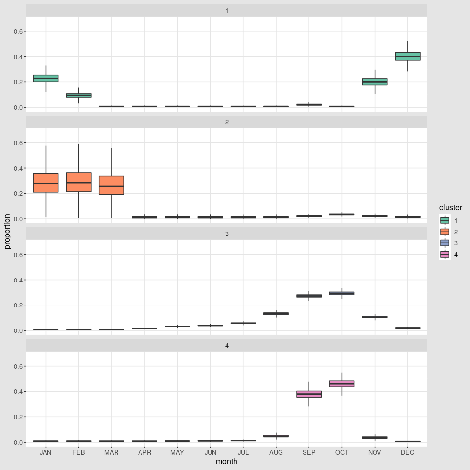<!-- -->
Clusters 3 and 4 correspond to peak in october with 3 more widespread. Cluster 1 corresponds to a peak in autumn/winter. Cluster 2 corresponds to catches in winter.

We compute some statistics to characterize the clusters.


```r
table_characteristics(myfit_silvereel_coastal_landings, 4,clus_order)
```

<table>
<caption>characteristics of clusters</caption>
 <thead>
<tr>
<th style="border-bottom:hidden" colspan="1"></th>
<th style="border-bottom:hidden; padding-bottom:0; padding-left:3px;padding-right:3px;text-align: center; " colspan="3"><div style="border-bottom: 1px solid #ddd; padding-bottom: 5px; ">number of months to reach 80% of total</div></th>
<th style="border-bottom:hidden; padding-bottom:0; padding-left:3px;padding-right:3px;text-align: center; " colspan="3"><div style="border-bottom: 1px solid #ddd; padding-bottom: 5px; ">month of centroid</div></th>
</tr>
  <tr>
   <th style="text-align:right;"> cluster </th>
   <th style="text-align:right;"> median </th>
   <th style="text-align:right;"> q2.5% </th>
   <th style="text-align:right;"> q97.5% </th>
   <th style="text-align:right;"> median </th>
   <th style="text-align:right;"> q2.5% </th>
   <th style="text-align:right;"> q97.5% </th>
  </tr>
 </thead>
<tbody>
  <tr>
   <td style="text-align:right;"> 1 </td>
   <td style="text-align:right;"> 3 </td>
   <td style="text-align:right;"> 3 </td>
   <td style="text-align:right;"> 4 </td>
   <td style="text-align:right;"> 0.20 </td>
   <td style="text-align:right;"> 0.04 </td>
   <td style="text-align:right;"> 0.37 </td>
  </tr>
  <tr>
   <td style="text-align:right;"> 2 </td>
   <td style="text-align:right;"> 3 </td>
   <td style="text-align:right;"> 3 </td>
   <td style="text-align:right;"> 4 </td>
   <td style="text-align:right;"> 1.90 </td>
   <td style="text-align:right;"> 1.48 </td>
   <td style="text-align:right;"> 2.33 </td>
  </tr>
  <tr>
   <td style="text-align:right;"> 3 </td>
   <td style="text-align:right;"> 4 </td>
   <td style="text-align:right;"> 4 </td>
   <td style="text-align:right;"> 5 </td>
   <td style="text-align:right;"> 9.31 </td>
   <td style="text-align:right;"> 9.16 </td>
   <td style="text-align:right;"> 9.39 </td>
  </tr>
  <tr>
   <td style="text-align:right;"> 4 </td>
   <td style="text-align:right;"> 2 </td>
   <td style="text-align:right;"> 2 </td>
   <td style="text-align:right;"> 3 </td>
   <td style="text-align:right;"> 9.60 </td>
   <td style="text-align:right;"> 9.51 </td>
   <td style="text-align:right;"> 9.73 </td>
  </tr>
</tbody>
</table>

Duration indicates the minimum number of months that covers 80% of the wave (1st column is the median, and the 2 next one quantiles 2.5% and 97.5% of credibility intervals). Centroid is the centroid of the migration wave (e.g. 11.5 would indicate a migration centred around mid november). The first column is the median and the two next one the quantiles 2.5 and 97.5%.


We can also look at the belonging of the different groups.

```r
groups <- interaction(silvereel_coastal_wide$emu_nameshort,
                                            silvereel_coastal_wide$period,
                                            drop=TRUE)
group_name <- levels(groups)

get_pattern_month <- function(res,mydata){
  
  tmp <- strsplit(as.character(group_name),
                  "\\.")
  ser <- as.character(lapply(tmp,function(tt){
    tt[1]
  }))
  period <- as.character(lapply(tmp,function(tt){
    tt[2]
  }))
  res_mat <- as.matrix(as.mcmc.list(res,add.mutate=FALSE))
  
  clus <- t(sapply(seq_len(length(unique(groups))), function(id){
    name_col <- paste("cluster[",id,"]",sep="")
    freq <- table(res_mat[,name_col])
    max_class <- names(freq)[order(freq,decreasing=TRUE)[1]]
    c(max_class,freq[as.character(1:nbclus)])
  }))
  storage.mode(clus) <- "numeric"
  classes <- as.data.frame(clus)
  names(classes) <- c("cluster", paste("clus",seq_len(nbclus),sep=""))
  cbind.data.frame(data.frame(ser=ser, period=period),
                   classes)
}

myclassif <- get_pattern_month(myfit_silvereel_coastal_landings)
col_toreorder=grep("clus[0-9]",names(myclassif))
names(myclassif)[col_toreorder]=paste("clus",
                                      match(paste("clus",1:nbclus,sep=""),
                                      paste("clus",clus_order,sep="")),
                                      sep="")
myclassif[,col_toreorder] <- myclassif%>%
  select(col_toreorder)%>%select(sort(names(.)))
myclassif$cluster <- factor(match(myclassif$cluster,clus_order ),
                      levels=as.character(1:7))
table_classif(myclassif)
```

<table>
 <thead>
  <tr>
   <th style="text-align:left;"> EMU </th>
   <th style="text-align:left;"> period </th>
   <th style="text-align:left;"> Max cluster </th>
   <th style="text-align:right;"> % clus 1 </th>
   <th style="text-align:right;"> % clus 2 </th>
   <th style="text-align:right;"> % clus 3 </th>
   <th style="text-align:right;"> % clus 4 </th>
  </tr>
 </thead>
<tbody>
  <tr>
   <td style="text-align:left;"> FR_Cors_T </td>
   <td style="text-align:left;"> 2 </td>
   <td style="text-align:left;"> 1 </td>
   <td style="text-align:right;"> 100 </td>
   <td style="text-align:right;"> 0 </td>
   <td style="text-align:right;"> 0 </td>
   <td style="text-align:right;"> 0 </td>
  </tr>
  <tr>
   <td style="text-align:left;"> ES_Murc_C </td>
   <td style="text-align:left;"> 2 </td>
   <td style="text-align:left;"> 2 </td>
   <td style="text-align:right;"> 0 </td>
   <td style="text-align:right;"> 100 </td>
   <td style="text-align:right;"> 0 </td>
   <td style="text-align:right;"> 0 </td>
  </tr>
  <tr>
   <td style="text-align:left;"> DE_Eide_C </td>
   <td style="text-align:left;"> 1 </td>
   <td style="text-align:left;"> 3 </td>
   <td style="text-align:right;"> 0 </td>
   <td style="text-align:right;"> 0 </td>
   <td style="text-align:right;"> 100 </td>
   <td style="text-align:right;"> 0 </td>
  </tr>
  <tr>
   <td style="text-align:left;"> DE_Eide_C </td>
   <td style="text-align:left;"> 2 </td>
   <td style="text-align:left;"> 3 </td>
   <td style="text-align:right;"> 0 </td>
   <td style="text-align:right;"> 0 </td>
   <td style="text-align:right;"> 100 </td>
   <td style="text-align:right;"> 0 </td>
  </tr>
  <tr>
   <td style="text-align:left;"> DE_Elbe_T </td>
   <td style="text-align:left;"> 1 </td>
   <td style="text-align:left;"> 3 </td>
   <td style="text-align:right;"> 0 </td>
   <td style="text-align:right;"> 0 </td>
   <td style="text-align:right;"> 100 </td>
   <td style="text-align:right;"> 0 </td>
  </tr>
  <tr>
   <td style="text-align:left;"> DE_Elbe_T </td>
   <td style="text-align:left;"> 2 </td>
   <td style="text-align:left;"> 3 </td>
   <td style="text-align:right;"> 0 </td>
   <td style="text-align:right;"> 0 </td>
   <td style="text-align:right;"> 100 </td>
   <td style="text-align:right;"> 0 </td>
  </tr>
  <tr>
   <td style="text-align:left;"> DE_Schl_C </td>
   <td style="text-align:left;"> 1 </td>
   <td style="text-align:left;"> 3 </td>
   <td style="text-align:right;"> 0 </td>
   <td style="text-align:right;"> 0 </td>
   <td style="text-align:right;"> 88 </td>
   <td style="text-align:right;"> 12 </td>
  </tr>
  <tr>
   <td style="text-align:left;"> DE_Schl_C </td>
   <td style="text-align:left;"> 2 </td>
   <td style="text-align:left;"> 3 </td>
   <td style="text-align:right;"> 0 </td>
   <td style="text-align:right;"> 0 </td>
   <td style="text-align:right;"> 100 </td>
   <td style="text-align:right;"> 0 </td>
  </tr>
  <tr>
   <td style="text-align:left;"> DK_total_MO </td>
   <td style="text-align:left;"> 1 </td>
   <td style="text-align:left;"> 3 </td>
   <td style="text-align:right;"> 0 </td>
   <td style="text-align:right;"> 0 </td>
   <td style="text-align:right;"> 100 </td>
   <td style="text-align:right;"> 0 </td>
  </tr>
  <tr>
   <td style="text-align:left;"> DK_total_MO </td>
   <td style="text-align:left;"> 2 </td>
   <td style="text-align:left;"> 3 </td>
   <td style="text-align:right;"> 0 </td>
   <td style="text-align:right;"> 0 </td>
   <td style="text-align:right;"> 91 </td>
   <td style="text-align:right;"> 9 </td>
  </tr>
  <tr>
   <td style="text-align:left;"> SE_East_C </td>
   <td style="text-align:left;"> 1 </td>
   <td style="text-align:left;"> 3 </td>
   <td style="text-align:right;"> 0 </td>
   <td style="text-align:right;"> 0 </td>
   <td style="text-align:right;"> 100 </td>
   <td style="text-align:right;"> 0 </td>
  </tr>
  <tr>
   <td style="text-align:left;"> SE_East_C </td>
   <td style="text-align:left;"> 2 </td>
   <td style="text-align:left;"> 3 </td>
   <td style="text-align:right;"> 0 </td>
   <td style="text-align:right;"> 0 </td>
   <td style="text-align:right;"> 100 </td>
   <td style="text-align:right;"> 0 </td>
  </tr>
  <tr>
   <td style="text-align:left;"> SE_West_C </td>
   <td style="text-align:left;"> 1 </td>
   <td style="text-align:left;"> 3 </td>
   <td style="text-align:right;"> 0 </td>
   <td style="text-align:right;"> 0 </td>
   <td style="text-align:right;"> 100 </td>
   <td style="text-align:right;"> 0 </td>
  </tr>
  <tr>
   <td style="text-align:left;"> DE_Eide_T </td>
   <td style="text-align:left;"> 1 </td>
   <td style="text-align:left;"> 4 </td>
   <td style="text-align:right;"> 0 </td>
   <td style="text-align:right;"> 0 </td>
   <td style="text-align:right;"> 0 </td>
   <td style="text-align:right;"> 100 </td>
  </tr>
  <tr>
   <td style="text-align:left;"> DE_Eide_T </td>
   <td style="text-align:left;"> 2 </td>
   <td style="text-align:left;"> 4 </td>
   <td style="text-align:right;"> 0 </td>
   <td style="text-align:right;"> 0 </td>
   <td style="text-align:right;"> 0 </td>
   <td style="text-align:right;"> 100 </td>
  </tr>
  <tr>
   <td style="text-align:left;"> GB_Angl_C </td>
   <td style="text-align:left;"> 2 </td>
   <td style="text-align:left;"> 4 </td>
   <td style="text-align:right;"> 0 </td>
   <td style="text-align:right;"> 0 </td>
   <td style="text-align:right;"> 0 </td>
   <td style="text-align:right;"> 100 </td>
  </tr>
  <tr>
   <td style="text-align:left;"> GB_SouE_C </td>
   <td style="text-align:left;"> 2 </td>
   <td style="text-align:left;"> 4 </td>
   <td style="text-align:right;"> 0 </td>
   <td style="text-align:right;"> 0 </td>
   <td style="text-align:right;"> 0 </td>
   <td style="text-align:right;"> 100 </td>
  </tr>
  <tr>
   <td style="text-align:left;"> GB_SouW_C </td>
   <td style="text-align:left;"> 2 </td>
   <td style="text-align:left;"> 4 </td>
   <td style="text-align:right;"> 0 </td>
   <td style="text-align:right;"> 0 </td>
   <td style="text-align:right;"> 0 </td>
   <td style="text-align:right;"> 100 </td>
  </tr>
</tbody>
</table>

In fact, most EMUs fall in cluster 3. Cluster 2 corresponds only to ES_Murc_C (same as for yellow eel) and one for FR_Cors. Cluster 4 (limited fishing season) regroups GB and DE EMUs.


```r
myplots <-lapply(c("MO","C","T"),function(hty){
  myclassif_p1 <- subset(myclassif, myclassif$period == 1 &
                           endsWith(as.character(myclassif$ser),
                                    hty))
  myclassif_p2 <- subset(myclassif, myclassif$period == 2 &
                           endsWith(as.character(myclassif$ser),
                                    hty))
  emu$cluster1 <- factor(myclassif_p1$cluster[match(emu$name_short,                                                  gsub(paste("_",hty,sep=""),"",myclassif_p1$ser))],
                       levels=1:7)
  emu$cluster2 <- factor(myclassif_p2$cluster[match(emu$name_short,                                                gsub(paste("_",hty,sep=""),"",myclassif_p2$ser))],
                       levels=1:7)
  p1 <- ggplot(data = cou) +  geom_sf(fill= "antiquewhite") +
		  geom_sf(data=emu,aes(fill=cluster1)) + scale_fill_manual(values=cols)+
      theme_igray() +xlim(-20,30) + ylim(35,65) +
    ggtitle(paste("period 1",hty))
  p2 <- ggplot(data = cou) +  geom_sf(fill= "antiquewhite") +
		  geom_sf(data=emu,aes(fill=cluster2)) + scale_fill_manual(values=cols)+
    theme_igray() +xlim(-20,30) + ylim(35,65)  +
    ggtitle(paste("period 2",hty))
  return(list(p1,p2))
})
print(myplots[[2]][[1]])
```

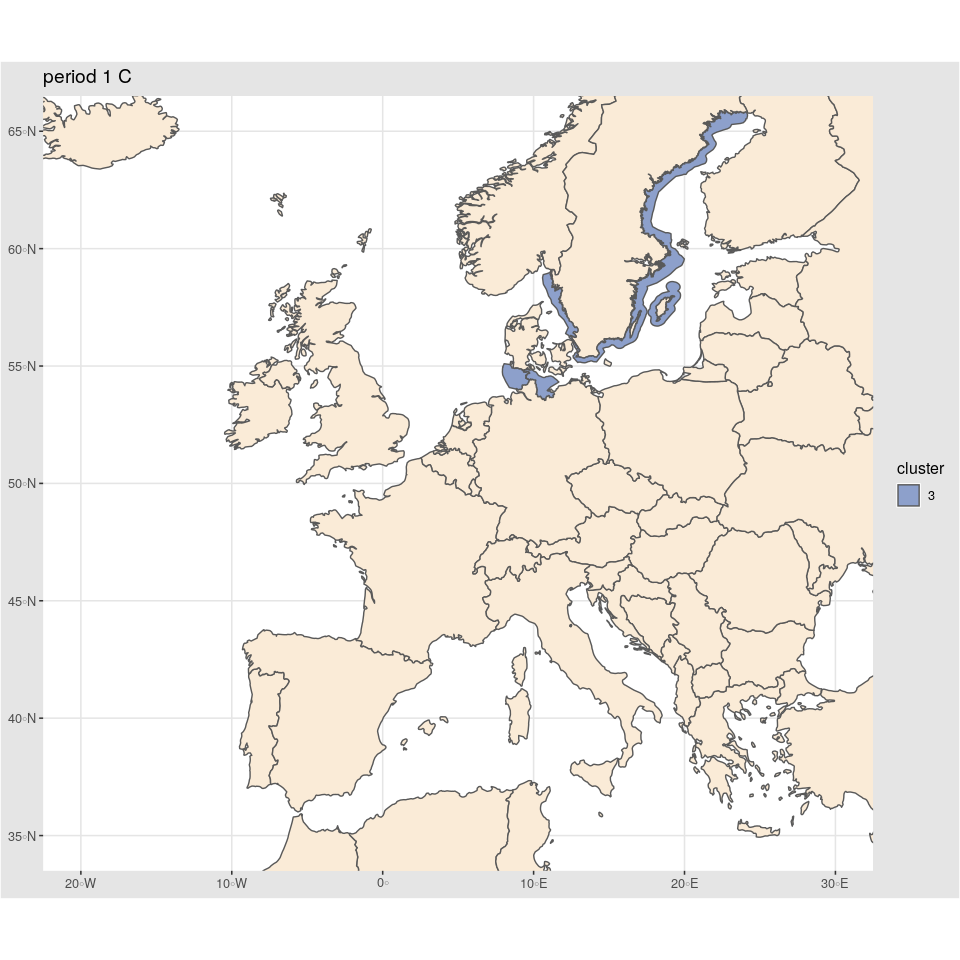<!-- -->

```r
print(myplots[[2]][[2]])
```

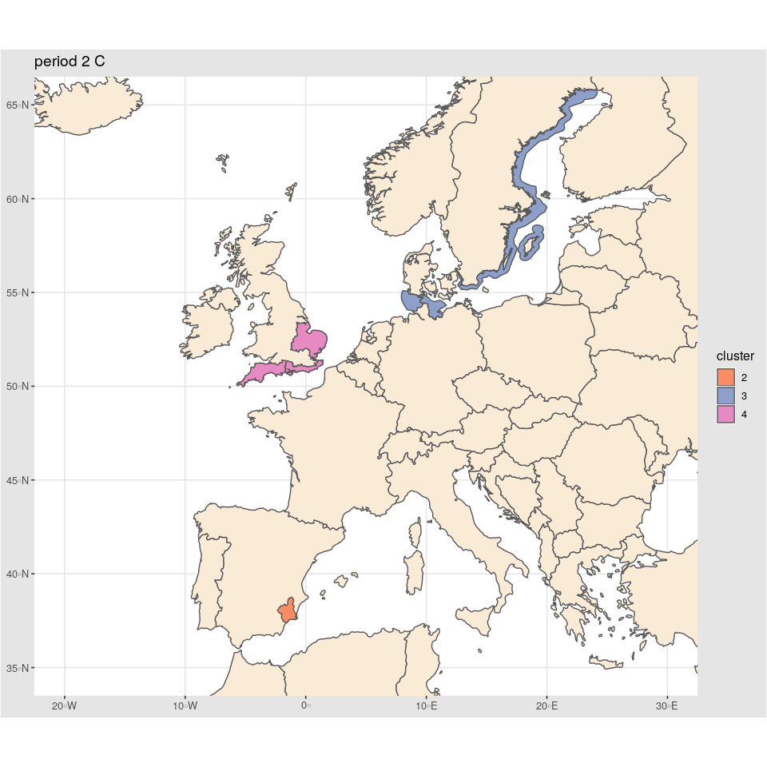<!-- -->

```r
print(myplots[[3]][[1]])
```

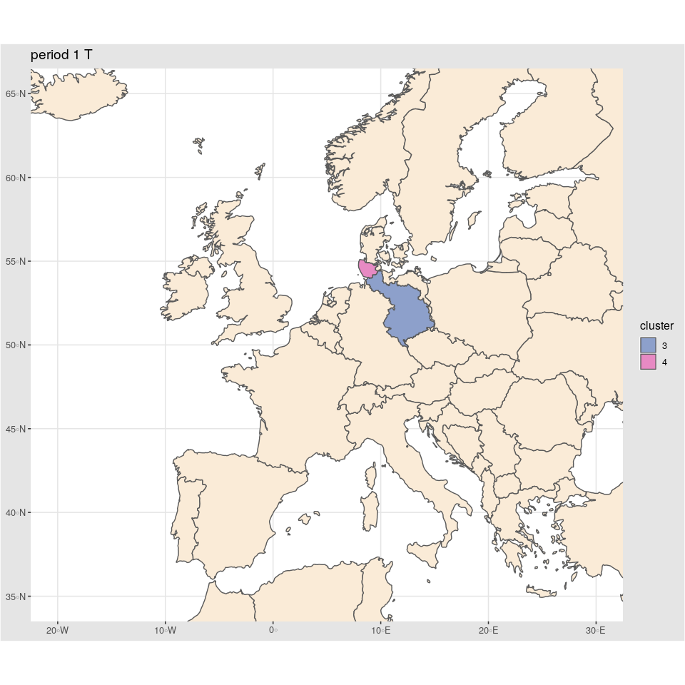<!-- -->

```r
print(myplots[[3]][[2]])
```

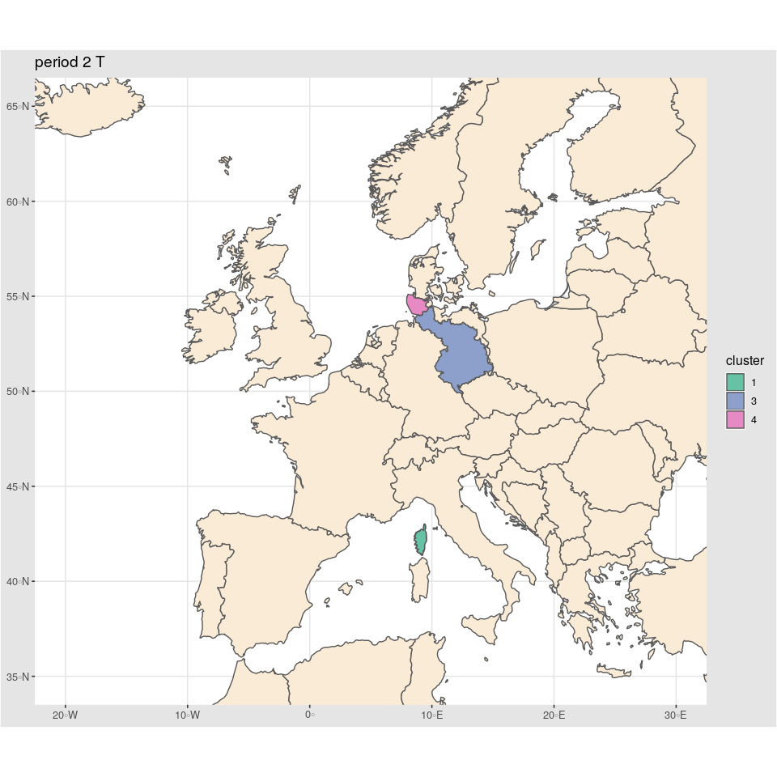<!-- -->

### Exporting pattern per group

```r
tmp <- as.matrix(as.mcmc.list(myfit_silvereel_coastal_landings))
name_col = colnames(tmp)

pattern_Smar_coast_trans_landings=do.call("rbind.data.frame",
                                lapply(seq_len(length(levels(groups))), function(g)
                                   median_pattern_group(g, group_name,tmp, "S","landings")))
save(pattern_Smar_coast_trans_landings,file="pattern_Smar_coast_trans_landings.rdata")
```

### Similarity between and after 2010

```r
#which groups have data in both periods
occ=table(unique(silvereel_coastal_wide[,c("emu_nameshort", "period")])[,1])
tocompare=names(occ)[which(occ>1)]

simi=sapply(tocompare, function(s){
  g=grep(s,group_name)
  esp1=tmp[,grep(paste("alpha_group\\[",g[1],",",sep=""),name_col)]
  esp2=tmp[,grep(paste("alpha_group\\[",g[2],",",sep=""),name_col)]
  quantile(apply(cbind(esp1,esp2),
                 1,
                 function(x) sum(pmin(x[1:12],x[13:24]))),
           probs=c(0.025,.5,.975))
})

similarity=data.frame(emu=tocompare,t(simi))

table_similarity(similarity)
```

<table>
<caption>similarity</caption>
 <thead>
  <tr>
   <th style="text-align:left;"> EMU </th>
   <th style="text-align:right;"> q2.5% </th>
   <th style="text-align:right;"> median </th>
   <th style="text-align:right;"> q97.5% </th>
  </tr>
 </thead>
<tbody>
  <tr>
   <td style="text-align:left;"> DE_Eide_C </td>
   <td style="text-align:right;"> 0.56 </td>
   <td style="text-align:right;"> 0.71 </td>
   <td style="text-align:right;"> 0.85 </td>
  </tr>
  <tr>
   <td style="text-align:left;"> DE_Eide_T </td>
   <td style="text-align:right;"> 0.52 </td>
   <td style="text-align:right;"> 0.68 </td>
   <td style="text-align:right;"> 0.84 </td>
  </tr>
  <tr>
   <td style="text-align:left;"> DE_Elbe_T </td>
   <td style="text-align:right;"> 0.60 </td>
   <td style="text-align:right;"> 0.76 </td>
   <td style="text-align:right;"> 0.88 </td>
  </tr>
  <tr>
   <td style="text-align:left;"> DE_Schl_C </td>
   <td style="text-align:right;"> 0.60 </td>
   <td style="text-align:right;"> 0.76 </td>
   <td style="text-align:right;"> 0.88 </td>
  </tr>
  <tr>
   <td style="text-align:left;"> DK_total_MO </td>
   <td style="text-align:right;"> 0.82 </td>
   <td style="text-align:right;"> 0.90 </td>
   <td style="text-align:right;"> 0.95 </td>
  </tr>
  <tr>
   <td style="text-align:left;"> SE_East_C </td>
   <td style="text-align:right;"> 0.77 </td>
   <td style="text-align:right;"> 0.86 </td>
   <td style="text-align:right;"> 0.93 </td>
  </tr>
</tbody>
</table>

### Potential effect of EMP and EU closures

```r
ncar=nchar(group_name)
period=as.integer(substr(as.character(group_name),ncar,ncar))
blocks=strsplit(group_name,"_")
emus=sapply(blocks,function(x)paste(x[1],x[2],sep="_"))
hty_code=sapply(blocks,function(x) substr(x[3],1,nchar(x[3])-2))


#######EMP
list_period1=data.frame(emu_nameshort=emus[period==1])
list_period1$group=group_name[period==1]
list_period1$id_g=match(list_period1$group,group_name)
list_period1$hty_code=hty_code[period==1]
  
#we check that we have ladings data at least two years before the first EMP closures
list_period1$estimable=mapply(function(s,hty) {
  length(which(charac_EMP_closures$emu_nameshort==s 
               & grepl("S",charac_EMP_closures$lfs_code) 
               & grepl(hty, charac_EMP_closures$hty_code)))>0},
  list_period1$emu_nameshort, list_period1$hty_code)

list_period1$estimable=list_period1$estimable &
(sapply(list_period1$id_g,function(e) min(silvereel_coastal_wide$season[group==e]))+2 <
mapply(function(e,hty) min(charac_EMP_closures$year[charac_EMP_closures$emu_nameshort==e &
                                                           grepl("S",charac_EMP_closures$lfs_code) &
                                                    grepl(hty,charac_EMP_closures$hty_code)]),
       list_period1$emu_nameshort, list_period1$hty_code))

list_period1$lossq2.5=NA
list_period1$lossq50=NA
list_period1$lossq97.5=NA

res_closures=mapply(function(s,g,hty) {
  emu_closures <- EMP_closures %>%
    filter(emu_nameshort==s & grepl("S",lfs_code) & grepl(hty, hty_code)) %>%
    group_by(emu_nameshort,month) %>%
    summarize(fishery_closure_percent=max(fishery_closure_percent))
  myalpha=tmp[,paste("alpha_group[",g,",",emu_closures$month,"]",sep="")]
  if (nrow(emu_closures)>1){
    loss=colSums(apply(myalpha,1,function(x) x*emu_closures$fishery_closure_percent/100))
  } else {
    loss=myalpha*emu_closures$fishery_closure_percent/100
  }
  quantile(loss,probs=c(0.025,.5,.975))
},as.character(list_period1$emu_nameshort[list_period1$estimable]),
list_period1$id_g[list_period1$estimable],
list_period1$hty[list_period1$estimable])

list_period1[list_period1$estimable, c("lossq2.5", "lossq50","lossq97.5")] =
  t(res_closures)

kable(list_period1[,c("emu_nameshort","lossq2.5","lossq50","lossq97.5")],
      col.names=c("emu","q2.5","median","q97.5"),
      caption="proportion of catch potentially lost because of EMP closure",
      digits=2)
```

<table>
<caption>proportion of catch potentially lost because of EMP closure</caption>
 <thead>
  <tr>
   <th style="text-align:left;"> emu </th>
   <th style="text-align:left;"> q2.5 </th>
   <th style="text-align:left;"> median </th>
   <th style="text-align:left;"> q97.5 </th>
  </tr>
 </thead>
<tbody>
  <tr>
   <td style="text-align:left;"> DE_Eide </td>
   <td style="text-align:left;"> NA </td>
   <td style="text-align:left;"> NA </td>
   <td style="text-align:left;"> NA </td>
  </tr>
  <tr>
   <td style="text-align:left;"> DE_Eide </td>
   <td style="text-align:left;"> NA </td>
   <td style="text-align:left;"> NA </td>
   <td style="text-align:left;"> NA </td>
  </tr>
  <tr>
   <td style="text-align:left;"> DE_Elbe </td>
   <td style="text-align:left;"> NA </td>
   <td style="text-align:left;"> NA </td>
   <td style="text-align:left;"> NA </td>
  </tr>
  <tr>
   <td style="text-align:left;"> DE_Schl </td>
   <td style="text-align:left;"> NA </td>
   <td style="text-align:left;"> NA </td>
   <td style="text-align:left;"> NA </td>
  </tr>
  <tr>
   <td style="text-align:left;"> DK_total </td>
   <td style="text-align:left;"> NA </td>
   <td style="text-align:left;"> NA </td>
   <td style="text-align:left;"> NA </td>
  </tr>
  <tr>
   <td style="text-align:left;"> SE_East </td>
   <td style="text-align:left;"> NA </td>
   <td style="text-align:left;"> NA </td>
   <td style="text-align:left;"> NA </td>
  </tr>
  <tr>
   <td style="text-align:left;"> SE_West </td>
   <td style="text-align:left;"> NA </td>
   <td style="text-align:left;"> NA </td>
   <td style="text-align:left;"> NA </td>
  </tr>
</tbody>
</table>

```r
#######EU
list_period2=data.frame(emu_nameshort=emus[period==2])
list_period2$group=group_name[period==2]
list_period2$id_g=match(list_period2$group,group_name)
list_period2$hty_code=hty_code[period==2]
  
#we check that we have ladings data at least two years before the first EMP closures
list_period2$estimable=mapply(function(s,hty) {
  length(which(charac_EU_closures$emu_nameshort==s 
               & grepl("S",charac_EU_closures$lfs_code) 
               & grepl(hty, charac_EU_closures$hty_code)))>0},
  list_period2$emu_nameshort, list_period2$hty_code)

list_period2$estimable=list_period2$estimable &
(sapply(list_period2$id_g,function(e) min(silvereel_coastal_wide$season[group==e]))+2 <
mapply(function(e,hty) min(charac_EU_closures$year[charac_EU_closures$emu_nameshort==e &
                                                           grepl("S",charac_EU_closures$lfs_code) &
                                                    grepl(hty,charac_EU_closures$hty_code)]),
       list_period2$emu_nameshort, list_period2$hty_code))

list_period2$lossq2.5=NA
list_period2$lossq50=NA
list_period2$lossq97.5=NA

res_closures=mapply(function(s,g,hty) {
  emu_closures <- EU_closures %>%
    filter(emu_nameshort==s & grepl("S", lfs_code) & grepl(hty,hty_code)) %>%
    group_by(emu_nameshort,month) %>%
    summarize(fishery_closure_percent=max(fishery_closure_percent))
  myalpha=tmp[,paste("alpha_group[",g,",",emu_closures$month,"]",sep="")]
  if (nrow(emu_closures)>1){
    loss=colSums(apply(myalpha,1,function(x) x*emu_closures$fishery_closure_percent/100))
  } else {
    loss=myalpha*emu_closures$fishery_closure_percent/100
  }
  quantile(loss,probs=c(0.025,.5,.975))
},as.character(list_period2$emu_nameshort[list_period2$estimable]),
list_period2$id_g[list_period2$estimable],
list_period2$hty_code[list_period2$estimable])

list_period2[list_period2$estimable, c("lossq2.5", "lossq50","lossq97.5")] =
  t(res_closures)

kable(list_period2[,c("emu_nameshort","lossq2.5","lossq50","lossq97.5")],
      col.names=c("emu","q2.5","median","q97.5"),
      caption="proportion of catch potentially lost because of EU closure",
      digits=2)
```

<table>
<caption>proportion of catch potentially lost because of EU closure</caption>
 <thead>
  <tr>
   <th style="text-align:left;"> emu </th>
   <th style="text-align:right;"> q2.5 </th>
   <th style="text-align:right;"> median </th>
   <th style="text-align:right;"> q97.5 </th>
  </tr>
 </thead>
<tbody>
  <tr>
   <td style="text-align:left;"> DE_Eide </td>
   <td style="text-align:right;"> 0.02 </td>
   <td style="text-align:right;"> 0.03 </td>
   <td style="text-align:right;"> 0.04 </td>
  </tr>
  <tr>
   <td style="text-align:left;"> DE_Eide </td>
   <td style="text-align:right;"> NA </td>
   <td style="text-align:right;"> NA </td>
   <td style="text-align:right;"> NA </td>
  </tr>
  <tr>
   <td style="text-align:left;"> DE_Elbe </td>
   <td style="text-align:right;"> 0.01 </td>
   <td style="text-align:right;"> 0.02 </td>
   <td style="text-align:right;"> 0.03 </td>
  </tr>
  <tr>
   <td style="text-align:left;"> DE_Schl </td>
   <td style="text-align:right;"> 0.03 </td>
   <td style="text-align:right;"> 0.05 </td>
   <td style="text-align:right;"> 0.07 </td>
  </tr>
  <tr>
   <td style="text-align:left;"> DK_total </td>
   <td style="text-align:right;"> 0.25 </td>
   <td style="text-align:right;"> 0.32 </td>
   <td style="text-align:right;"> 0.39 </td>
  </tr>
  <tr>
   <td style="text-align:left;"> ES_Murc </td>
   <td style="text-align:right;"> NA </td>
   <td style="text-align:right;"> NA </td>
   <td style="text-align:right;"> NA </td>
  </tr>
  <tr>
   <td style="text-align:left;"> FR_Cors </td>
   <td style="text-align:right;"> NA </td>
   <td style="text-align:right;"> NA </td>
   <td style="text-align:right;"> NA </td>
  </tr>
  <tr>
   <td style="text-align:left;"> GB_Angl </td>
   <td style="text-align:right;"> 0.00 </td>
   <td style="text-align:right;"> 0.02 </td>
   <td style="text-align:right;"> 0.05 </td>
  </tr>
  <tr>
   <td style="text-align:left;"> GB_SouE </td>
   <td style="text-align:right;"> 0.00 </td>
   <td style="text-align:right;"> 0.01 </td>
   <td style="text-align:right;"> 0.03 </td>
  </tr>
  <tr>
   <td style="text-align:left;"> GB_SouW </td>
   <td style="text-align:right;"> 0.00 </td>
   <td style="text-align:right;"> 0.01 </td>
   <td style="text-align:right;"> 0.02 </td>
  </tr>
  <tr>
   <td style="text-align:left;"> SE_East </td>
   <td style="text-align:right;"> 0.11 </td>
   <td style="text-align:right;"> 0.18 </td>
   <td style="text-align:right;"> 0.25 </td>
  </tr>
</tbody>
</table>

```r
list_period2$type="EU closure"
list_period1$type="EMP closure"
list_period=rbind.data.frame(list_period1,list_period2)
list_period$stage="S"
save(list_period,file="loss_silvercoastal.rdata")


####scenario per cluster
starts_closure=8:12
clus=1:nbclus
experiments=expand.grid(clus,starts_closure)
effects=t(mapply(function(c,s){
  months_closed=(s:(s+2))
  months_closed=ifelse(months_closed>12,months_closed-12,months_closed)
  pattern=tmp[,grep(paste("esp\\[",c,",",sep=""),colnames(tmp))]
  effect=rowSums(pattern[,months_closed])
  quantile(effect,probs=c(0.025,.5,.975))
},experiments[,1],experiments[,2]))
effects_scenario=data.frame(cluster=match(experiments[,1],clus_order),
                            starting_month_EU_closure=experiments[,2],
                            loss_median=effects[,2],
                            loss_2.5=effects[,1],
                            loss_97.5=effects[,3])
effects_scenario=effects_scenario[order(effects_scenario$cluster,
                                        effects_scenario$starting_month_EU_closure),]


kable(effects_scenario,row.names=FALSE,col.names=c("cluster",
                                   "speculative 1st month of EU closure",
                                   "median loss of catch",
                                   "q2.5",
                                   "q97.5"), digits=2,
      caption="potential effect that an EU closure would have depending on cluster and starting month")
```

<table>
<caption>potential effect that an EU closure would have depending on cluster and starting month</caption>
 <thead>
  <tr>
   <th style="text-align:right;"> cluster </th>
   <th style="text-align:right;"> speculative 1st month of EU closure </th>
   <th style="text-align:right;"> median loss of catch </th>
   <th style="text-align:right;"> q2.5 </th>
   <th style="text-align:right;"> q97.5 </th>
  </tr>
 </thead>
<tbody>
  <tr>
   <td style="text-align:right;"> 1 </td>
   <td style="text-align:right;"> 8 </td>
   <td style="text-align:right;"> 0.04 </td>
   <td style="text-align:right;"> 0.02 </td>
   <td style="text-align:right;"> 0.05 </td>
  </tr>
  <tr>
   <td style="text-align:right;"> 1 </td>
   <td style="text-align:right;"> 9 </td>
   <td style="text-align:right;"> 0.23 </td>
   <td style="text-align:right;"> 0.16 </td>
   <td style="text-align:right;"> 0.30 </td>
  </tr>
  <tr>
   <td style="text-align:right;"> 1 </td>
   <td style="text-align:right;"> 10 </td>
   <td style="text-align:right;"> 0.61 </td>
   <td style="text-align:right;"> 0.53 </td>
   <td style="text-align:right;"> 0.69 </td>
  </tr>
  <tr>
   <td style="text-align:right;"> 1 </td>
   <td style="text-align:right;"> 11 </td>
   <td style="text-align:right;"> 0.83 </td>
   <td style="text-align:right;"> 0.78 </td>
   <td style="text-align:right;"> 0.88 </td>
  </tr>
  <tr>
   <td style="text-align:right;"> 1 </td>
   <td style="text-align:right;"> 12 </td>
   <td style="text-align:right;"> 0.73 </td>
   <td style="text-align:right;"> 0.65 </td>
   <td style="text-align:right;"> 0.79 </td>
  </tr>
  <tr>
   <td style="text-align:right;"> 2 </td>
   <td style="text-align:right;"> 8 </td>
   <td style="text-align:right;"> 0.07 </td>
   <td style="text-align:right;"> 0.05 </td>
   <td style="text-align:right;"> 0.10 </td>
  </tr>
  <tr>
   <td style="text-align:right;"> 2 </td>
   <td style="text-align:right;"> 9 </td>
   <td style="text-align:right;"> 0.08 </td>
   <td style="text-align:right;"> 0.06 </td>
   <td style="text-align:right;"> 0.11 </td>
  </tr>
  <tr>
   <td style="text-align:right;"> 2 </td>
   <td style="text-align:right;"> 10 </td>
   <td style="text-align:right;"> 0.07 </td>
   <td style="text-align:right;"> 0.05 </td>
   <td style="text-align:right;"> 0.11 </td>
  </tr>
  <tr>
   <td style="text-align:right;"> 2 </td>
   <td style="text-align:right;"> 11 </td>
   <td style="text-align:right;"> 0.32 </td>
   <td style="text-align:right;"> 0.13 </td>
   <td style="text-align:right;"> 0.55 </td>
  </tr>
  <tr>
   <td style="text-align:right;"> 2 </td>
   <td style="text-align:right;"> 12 </td>
   <td style="text-align:right;"> 0.60 </td>
   <td style="text-align:right;"> 0.36 </td>
   <td style="text-align:right;"> 0.78 </td>
  </tr>
  <tr>
   <td style="text-align:right;"> 3 </td>
   <td style="text-align:right;"> 8 </td>
   <td style="text-align:right;"> 0.70 </td>
   <td style="text-align:right;"> 0.68 </td>
   <td style="text-align:right;"> 0.72 </td>
  </tr>
  <tr>
   <td style="text-align:right;"> 3 </td>
   <td style="text-align:right;"> 9 </td>
   <td style="text-align:right;"> 0.67 </td>
   <td style="text-align:right;"> 0.63 </td>
   <td style="text-align:right;"> 0.70 </td>
  </tr>
  <tr>
   <td style="text-align:right;"> 3 </td>
   <td style="text-align:right;"> 10 </td>
   <td style="text-align:right;"> 0.42 </td>
   <td style="text-align:right;"> 0.37 </td>
   <td style="text-align:right;"> 0.45 </td>
  </tr>
  <tr>
   <td style="text-align:right;"> 3 </td>
   <td style="text-align:right;"> 11 </td>
   <td style="text-align:right;"> 0.14 </td>
   <td style="text-align:right;"> 0.11 </td>
   <td style="text-align:right;"> 0.16 </td>
  </tr>
  <tr>
   <td style="text-align:right;"> 3 </td>
   <td style="text-align:right;"> 12 </td>
   <td style="text-align:right;"> 0.04 </td>
   <td style="text-align:right;"> 0.03 </td>
   <td style="text-align:right;"> 0.05 </td>
  </tr>
  <tr>
   <td style="text-align:right;"> 4 </td>
   <td style="text-align:right;"> 8 </td>
   <td style="text-align:right;"> 0.89 </td>
   <td style="text-align:right;"> 0.83 </td>
   <td style="text-align:right;"> 0.91 </td>
  </tr>
  <tr>
   <td style="text-align:right;"> 4 </td>
   <td style="text-align:right;"> 9 </td>
   <td style="text-align:right;"> 0.87 </td>
   <td style="text-align:right;"> 0.85 </td>
   <td style="text-align:right;"> 0.90 </td>
  </tr>
  <tr>
   <td style="text-align:right;"> 4 </td>
   <td style="text-align:right;"> 10 </td>
   <td style="text-align:right;"> 0.50 </td>
   <td style="text-align:right;"> 0.44 </td>
   <td style="text-align:right;"> 0.58 </td>
  </tr>
  <tr>
   <td style="text-align:right;"> 4 </td>
   <td style="text-align:right;"> 11 </td>
   <td style="text-align:right;"> 0.05 </td>
   <td style="text-align:right;"> 0.03 </td>
   <td style="text-align:right;"> 0.09 </td>
  </tr>
  <tr>
   <td style="text-align:right;"> 4 </td>
   <td style="text-align:right;"> 12 </td>
   <td style="text-align:right;"> 0.03 </td>
   <td style="text-align:right;"> 0.02 </td>
   <td style="text-align:right;"> 0.03 </td>
  </tr>
</tbody>
</table>


##freshwater waters
### Data selection
Now we should carry out data selection, more specifically, we want to eliminate rows with two many missing data, too much zero and to check whether there are no duplicates (though Cedric already did it)


```r
silvereel_freshwater <- subset(silvereel, silvereel$hty_code =="F")
kept_seasons <- lapply(unique(silvereel_freshwater$emu_nameshort), function(s){
  sub_silver <- subset(silvereel_freshwater, silvereel_freshwater$emu_nameshort==s)
  kept <- good_coverage_wave(sub_silver)
  #we remove season in which we have less than 50 kg of landings
  if(!is.null(kept))
    kept <- kept[sapply(kept,function(k)
      sum(sub_silver$das_value[sub_silver$season==k],na.rm=TRUE)>50)]
  if (length(kept) == 0) kept <- NULL
  kept
})
```

```
## [1] "For  DE_Eide_F  a good season should cover months: 5 to 10"
## [1] "For  DE_Elbe_F  a good season should cover months: 5 to 11"
## [1] "For  DE_Schl_F  a good season should cover months: 4 to 11"
## [1] "For  DE_Warn_F  a good season should cover months: 3 to 10"
## [1] "For  FR_Loir_F  a good season should cover months: 10 to 2"
## [1] "For  GB_Angl_F  a good season should cover months: 7 to 12"
## [1] "For  GB_Dee_F  a good season should cover months: 6 to 11"
## [1] "For  GB_Humb_F  a good season should cover months: 7 to 12"
## [1] "For GB_NorW_F not possible to define a season"
## [1] "For  GB_SouE_F  a good season should cover months: 7 to 12"
## [1] "For  GB_SouW_F  a good season should cover months: 6 to 11"
## [1] "For  GB_Tham_F  a good season should cover months: 4 to 10"
## [1] "For GB_Wale_F not possible to define a season"
## [1] "For IE_East_F not possible to define a season"
## [1] "For IE_West_F not possible to define a season"
## [1] "For  SE_Inla_F  a good season should cover months: 5 to 12"
```

Finally, here are the series kept given previous criterion.


```r
names(kept_seasons) <- unique(silvereel_freshwater$emu_nameshort)
kept_seasons[!sapply(kept_seasons,is.null)]
```

```
## $DE_Eide_F
## [1] 2009 2010 2011 2012 2013 2014
## 
## $DE_Elbe_F
##  [1] 2009 2010 2011 2012 2013 2014 2015 2016 2017 2018
## 
## $DE_Schl_F
##  [1] 2009 2010 2011 2012 2013 2014 2015 2016 2017 2018
## 
## $DE_Warn_F
## [1] 2010 2011 2012 2013 2014 2015 2016 2017 2018
## 
## $FR_Loir_F
## [1] 2005 2007 2008 2009 2010 2013 2016 2017
## 
## $GB_Angl_F
## [1] 2014 2015 2016 2017 2018
## 
## $GB_Humb_F
## [1] 2015 2016
## 
## $GB_SouE_F
## [1] 2014 2015
## 
## $GB_SouW_F
## [1] 2014 2015 2016
## 
## $GB_Tham_F
## [1] 2013 2014 2015 2017
## 
## $SE_Inla_F
## [1] 2006 2013 2014 2015 2016 2017 2018
```


### Data preparation
We carry out the same procedure as for seasonality. 


```r
silvereel_freshwater_subset <- subset(silvereel_freshwater, 
                           mapply(function(season, series){
                             season %in% kept_seasons[[series]]
                           }, silvereel_freshwater$season, silvereel_freshwater$emu_nameshort))


silvereel_freshwater_wide <- pivot_wider(data=silvereel_freshwater_subset[, c("emu_nameshort",
                                                     "cou_code",
                                                     "season",
                                                     "das_month",
                                                     "das_value")],
                                names_from="das_month",
                                values_from="das_value")
names(silvereel_freshwater_wide)[-(1:3)] <- paste("m",
                                       names(silvereel_freshwater_wide)[-(1:3)],
                                       sep="")

###we count the number of zeros per lines to remove lines without enough
###fishes
data_poor <- data.frame(silvereel_freshwater_wide$emu_nameshort,
                        silvereel_freshwater_wide$season,
                  zero=rowSums(silvereel_freshwater_wide[, -(1:3)] == 0 |
                                 is.na(silvereel_freshwater_wide[, -(1:3)])),
           tot=rowSums(silvereel_freshwater_wide[, -(1:3)], na.rm=TRUE))
silvereel_freshwater_wide <- silvereel_freshwater_wide[data_poor$zero < 10 
                                                   & data_poor$tot>50, ]
table_datapoor(data_poor %>% filter(zero > 9 | tot<50)) #we remove years where we have less than 2 months)
```

<table>
<caption>"data poor"" situation</caption>
 <thead>
  <tr>
   <th style="text-align:left;"> EMU </th>
   <th style="text-align:right;"> season </th>
   <th style="text-align:right;"> number of zero </th>
   <th style="text-align:right;"> total catch </th>
  </tr>
 </thead>
<tbody>
  <tr>
   <td style="text-align:left;"> GB_SouW_F </td>
   <td style="text-align:right;"> 2015 </td>
   <td style="text-align:right;"> 10 </td>
   <td style="text-align:right;"> 71 </td>
  </tr>
</tbody>
</table>


It leads to a dataset with 65 rows. 

We now replace NA value per zero since we selected our dataseries with missing months corresponding to insignificant months / closed months, and we compute proportions per month for each year.


```r
silvereel_freshwater_wide <- silvereel_freshwater_wide %>%
  replace_na(replace=list(m1=0,
                          m2=0,
                          m3=0,
                          m4=0,
                          m5=0,
                          m6=0,
                          m7=0,
                          m8=0,
                          m9=0,
                          m10=0,
                          m11=0,
                          m12=0))
silvereel_freshwater_wide[, -(1:3)] <- silvereel_freshwater_wide[, -(1:3)] + 1e-3
total_catch_year <- rowSums(silvereel_freshwater_wide[, paste("m", 1:12, sep="")])
silvereel_freshwater_wide <- silvereel_freshwater_wide %>%
  mutate_at(.vars=paste("m",1:12,sep=""),function(x) x/total_catch_year)
```

The Commission asks us to compare the pattern before and after 2007, probably to see the effect of the Eel Regulation. It is therefore necessary to build a period index. However, since most countries implemented their EMPs only in 2009/2010, we split in 2010.


```r
silvereel_freshwater_wide$period <- ifelse(silvereel_freshwater_wide$season>2009,
                                  2,
                                  1)

kable(table(silvereel_freshwater_wide$period,
       silvereel_freshwater_wide$emu_nameshort),
      row.names=TRUE,
      caption="number of season per EMU and period")
```

<table>
<caption>number of season per EMU and period</caption>
 <thead>
  <tr>
   <th style="text-align:left;">   </th>
   <th style="text-align:right;"> DE_Eide_F </th>
   <th style="text-align:right;"> DE_Elbe_F </th>
   <th style="text-align:right;"> DE_Schl_F </th>
   <th style="text-align:right;"> DE_Warn_F </th>
   <th style="text-align:right;"> FR_Loir_F </th>
   <th style="text-align:right;"> GB_Angl_F </th>
   <th style="text-align:right;"> GB_Humb_F </th>
   <th style="text-align:right;"> GB_SouE_F </th>
   <th style="text-align:right;"> GB_SouW_F </th>
   <th style="text-align:right;"> GB_Tham_F </th>
   <th style="text-align:right;"> SE_Inla_F </th>
  </tr>
 </thead>
<tbody>
  <tr>
   <td style="text-align:left;"> 1 </td>
   <td style="text-align:right;"> 1 </td>
   <td style="text-align:right;"> 1 </td>
   <td style="text-align:right;"> 1 </td>
   <td style="text-align:right;"> 0 </td>
   <td style="text-align:right;"> 4 </td>
   <td style="text-align:right;"> 0 </td>
   <td style="text-align:right;"> 0 </td>
   <td style="text-align:right;"> 0 </td>
   <td style="text-align:right;"> 0 </td>
   <td style="text-align:right;"> 0 </td>
   <td style="text-align:right;"> 1 </td>
  </tr>
  <tr>
   <td style="text-align:left;"> 2 </td>
   <td style="text-align:right;"> 5 </td>
   <td style="text-align:right;"> 9 </td>
   <td style="text-align:right;"> 9 </td>
   <td style="text-align:right;"> 9 </td>
   <td style="text-align:right;"> 4 </td>
   <td style="text-align:right;"> 5 </td>
   <td style="text-align:right;"> 2 </td>
   <td style="text-align:right;"> 2 </td>
   <td style="text-align:right;"> 2 </td>
   <td style="text-align:right;"> 4 </td>
   <td style="text-align:right;"> 6 </td>
  </tr>
</tbody>
</table>

The situation is not well balanced. Most EMU have data only after 2010.


### Running the model

```r
group <- as.integer(interaction(silvereel_freshwater_wide$emu_nameshort,
                                            silvereel_freshwater_wide$period,
                                            drop=TRUE))
nb_occ_group <- table(group)
y <-as.matrix(silvereel_freshwater_wide[, paste("m", 1:12, sep="")])
```

Now, we make a loop to select the number of clusters based on a DIC criterion


```r
cl <- makeCluster(3, 'FORK')
comparison <- parSapply(cl,2:7,
       function(nbclus){
         mydata <- build_data(nbclus)
         adapted <- FALSE
         while (!adapted){
           tryCatch({
             runjags.options(adapt.incomplete="error")
             res <- run.jags("jags_model.txt", monitor= c("deviance",
                                                          "alpha_group",
                                                          "cluster"),
                        summarise=FALSE, adapt=40000, method="parallel",
                        sample=2000,burnin=100000,n.chains=1,
                        inits=generate_init(nbclus, mydata)[[1]],
                        data=mydata)
                        adapted <- TRUE
                        res_mat <- as.matrix(as.mcmc.list(res))
                        silhouette <- median(compute_silhouette(res_mat))
                        nbused <- apply(res_mat, 1, function(iter){
                          length(table(iter[grep("cluster",
                                                 names(iter))]))
                        })
                        dic <- mean(res_mat[,1])+0.5*var(res_mat[,1])
                        stats <- c(dic,silhouette,mean(nbused))
                  }, error=function(e) {
                    print(paste("not adapted, restarting nbclus",nbclus))
                    }
                  )
         }
         stats
      })
stopCluster(cl)
best_silvereel_freshwater_landings <- data.frame(nbclus=2:(ncol(comparison)+1),
                                              dic=comparison[1, ],
                                              silhouette=comparison[2, ],
                                              used=comparison[3,])
save(best_silvereel_freshwater_landings, file="silvereel_freshwater_landings_jags.rdata")
```


```r
load("silvereel_freshwater_landings_jags.rdata")
best_silvereel_freshwater_landings
```

```
##   nbclus       dic silhouette used
## 1      2 -13200.19  0.1929929    2
## 2      3 -14007.27  0.2923097    3
## 3      4 -13931.64  0.2272654    4
## 4      5 -14170.32  0.1714372    5
## 5      6 -14151.40  0.1501752    5
## 6      7 -14086.58  0.1517780    7
```

5 seem to be a good compromise: slight decrease in silhouette, but all clusters are used and DIC is good.


```r
nbclus <- 5
mydata <-build_data(5)
adapted <- FALSE
while (!adapted){
   tryCatch({
      runjags.options(adapt.incomplete="error")
      myfit_silvereel_freshwater_landings <- run.jags("jags_model.txt", monitor= c("cluster", "esp", "alpha_group",
                                            "cluster", "centroid",
                                            "centroid_group",
                                            "distToClust", "duration_clus",
                                            "duration_group",
                                            "lambda","id_cluster",
                                            "centroid"),
                      summarise=FALSE, adapt=20000, method="parallel",
                      sample=10000,burnin=200000,n.chains=1, thin=5,
                      inits=generate_init(nbclus, mydata)[[1]], data=mydata)
      adapted <- TRUE
    }, error=function(e) {
       print(paste("not adapted, restarting nbclus",nbclus))
    })
}


save(myfit_silvereel_freshwater_landings, best_silvereel_freshwater_landings,
     file="silvereel_freshwater_landings_jags.rdata")
```

### Results
Once fitted, we can plot monthly pattern per cluster

```r
load("silvereel_freshwater_landings_jags.rdata")
nbclus <- 5
mydata <-build_data(5)
get_pattern_month <- function(res,type="cluster"){
  res_mat <- as.matrix(as.mcmc.list(res, add.mutate=FALSE))
  if (type=="cluster"){
    sub_mat <- as.data.frame(res_mat[,grep("esp",colnames(res_mat))])
  }
  sub_mat <- sub_mat %>% 
    pivot_longer(cols=1:ncol(sub_mat),
                 names_to="param",
                 values_to="proportion")
  tmp <- lapply(as.character(sub_mat$param),function(p) strsplit(p,"[[:punct:]]"))
  sub_mat$cluster<-as.factor(
    as.integer(lapply(tmp, function(tt) tt[[1]][2])))
  sub_mat$month <- as.character(lapply(tmp,
                                       function(tt) paste("m",
                                                          tt[[1]][3],
                                                          sep="")))
  sub_mat$month <- factor(sub_mat$month, levels=paste("m", 1:12, sep=""))
  sub_mat
}

pat <-get_pattern_month(myfit_silvereel_freshwater_landings)
clus_order=c("4","1","5","2","3")
pat$cluster <- factor(match(pat$cluster, clus_order),
                      levels=as.character(1:7))
ggplot(pat,aes(x=month,y=proportion))+
  geom_boxplot(aes(fill=cluster),outlier.shape=NA) +
  scale_fill_manual(values=cols)+facet_wrap(.~cluster, ncol=1) +
  theme_igray()
```

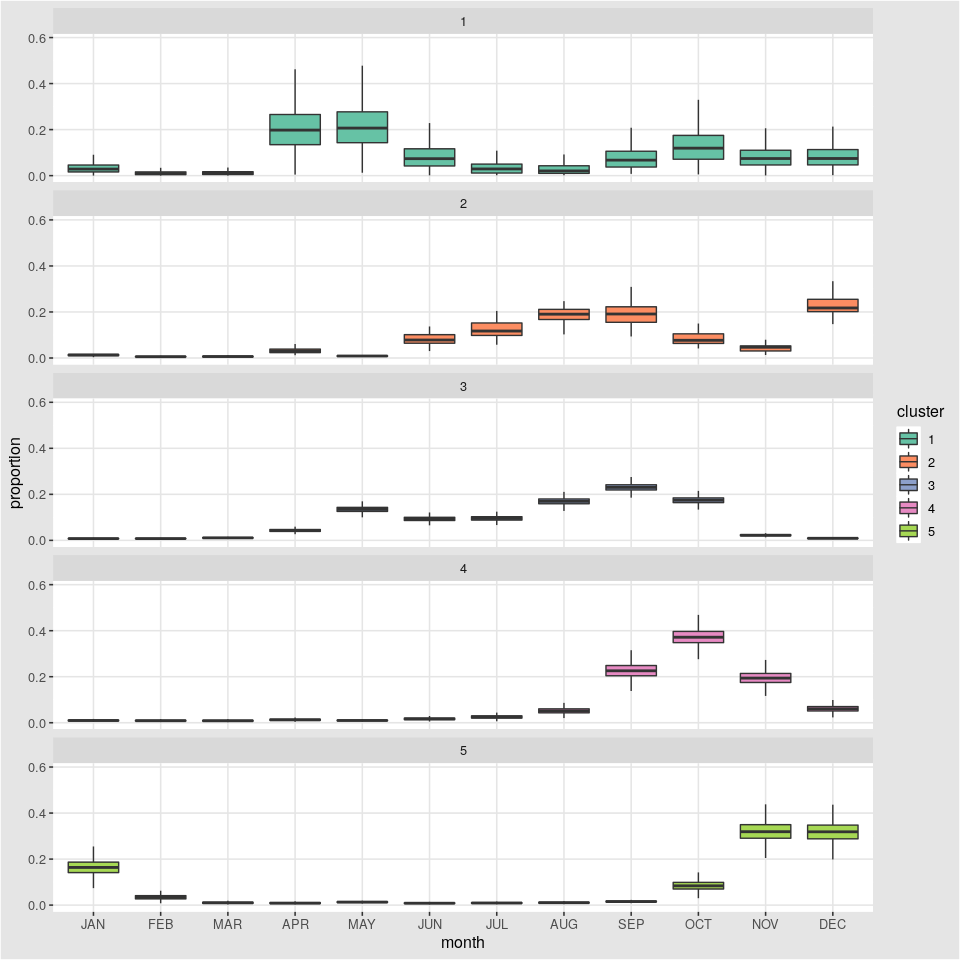<!-- -->

Cluster 2 peaks in summer with a second peak in december, 5 in winter, 2 in summer. Clusters 1 and 3 are bivariate (spring and autumn).

We compute some statistics to characterize the clusters.

```r
table_characteristics(myfit_silvereel_freshwater_landings, 5,clus_order)
```

<table>
<caption>characteristics of clusters</caption>
 <thead>
<tr>
<th style="border-bottom:hidden" colspan="1"></th>
<th style="border-bottom:hidden; padding-bottom:0; padding-left:3px;padding-right:3px;text-align: center; " colspan="3"><div style="border-bottom: 1px solid #ddd; padding-bottom: 5px; ">number of months to reach 80% of total</div></th>
<th style="border-bottom:hidden; padding-bottom:0; padding-left:3px;padding-right:3px;text-align: center; " colspan="3"><div style="border-bottom: 1px solid #ddd; padding-bottom: 5px; ">month of centroid</div></th>
</tr>
  <tr>
   <th style="text-align:right;"> cluster </th>
   <th style="text-align:right;"> median </th>
   <th style="text-align:right;"> q2.5% </th>
   <th style="text-align:right;"> q97.5% </th>
   <th style="text-align:right;"> median </th>
   <th style="text-align:right;"> q2.5% </th>
   <th style="text-align:right;"> q97.5% </th>
  </tr>
 </thead>
<tbody>
  <tr>
   <td style="text-align:right;"> 1 </td>
   <td style="text-align:right;"> 5 </td>
   <td style="text-align:right;"> 4 </td>
   <td style="text-align:right;"> 7 </td>
   <td style="text-align:right;"> 5.86 </td>
   <td style="text-align:right;"> 4.68 </td>
   <td style="text-align:right;"> 7.04 </td>
  </tr>
  <tr>
   <td style="text-align:right;"> 2 </td>
   <td style="text-align:right;"> 5 </td>
   <td style="text-align:right;"> 5 </td>
   <td style="text-align:right;"> 6 </td>
   <td style="text-align:right;"> 10.54 </td>
   <td style="text-align:right;"> 10.20 </td>
   <td style="text-align:right;"> 11.08 </td>
  </tr>
  <tr>
   <td style="text-align:right;"> 3 </td>
   <td style="text-align:right;"> 5 </td>
   <td style="text-align:right;"> 5 </td>
   <td style="text-align:right;"> 6 </td>
   <td style="text-align:right;"> 7.99 </td>
   <td style="text-align:right;"> 7.85 </td>
   <td style="text-align:right;"> 8.12 </td>
  </tr>
  <tr>
   <td style="text-align:right;"> 4 </td>
   <td style="text-align:right;"> 4 </td>
   <td style="text-align:right;"> 3 </td>
   <td style="text-align:right;"> 4 </td>
   <td style="text-align:right;"> 9.98 </td>
   <td style="text-align:right;"> 9.83 </td>
   <td style="text-align:right;"> 10.13 </td>
  </tr>
  <tr>
   <td style="text-align:right;"> 5 </td>
   <td style="text-align:right;"> 3 </td>
   <td style="text-align:right;"> 3 </td>
   <td style="text-align:right;"> 4 </td>
   <td style="text-align:right;"> 11.69 </td>
   <td style="text-align:right;"> 11.53 </td>
   <td style="text-align:right;"> 11.86 </td>
  </tr>
</tbody>
</table>

Duration indicates the minimum number of months that covers 80% of the wave (1st column is the median, and the 2 next one quantiles 2.5% and 97.5% of credibility intervals). Centroid is the centroid of the migration wave (e.g. 11.5 would indicate a migration centred around mid november). The first column is the median and the two next one the quantiles 2.5 and 97.5%.


We can also look at the belonging of the different groups.

```r
groups <- interaction(silvereel_freshwater_wide$emu_nameshort,
                                            silvereel_freshwater_wide$period,
                                            drop=TRUE)
group_name <- levels(groups)
  
get_pattern_month <- function(res,mydata){
  
  tmp <- strsplit(as.character(group_name),
                  "\\.")
  ser <- as.character(lapply(tmp,function(tt){
    tt[1]
  }))
  period <- as.character(lapply(tmp,function(tt){
    tt[2]
  }))
  res_mat <- as.matrix(as.mcmc.list(res,add.mutate=FALSE))
  
  clus <- t(sapply(seq_len(length(unique(groups))), function(id){
    name_col <- paste("cluster[",id,"]",sep="")
    freq <- table(res_mat[,name_col])
    max_class <- names(freq)[order(freq,decreasing=TRUE)[1]]
    c(max_class,freq[as.character(1:nbclus)])
  }))
  storage.mode(clus) <- "numeric"
  classes <- as.data.frame(clus)
  names(classes) <- c("cluster", paste("clus",seq_len(nbclus),sep=""))
  cbind.data.frame(data.frame(ser=ser, period=period),
                   classes)
}

myclassif <- get_pattern_month(myfit_silvereel_freshwater_landings)
col_toreorder=grep("clus[0-9]",names(myclassif))
names(myclassif)[col_toreorder]=paste("clus",
                                      match(paste("clus",1:nbclus,sep=""),
                                      paste("clus",clus_order,sep="")),
                                      sep="")
myclassif[,col_toreorder] <- myclassif%>%
  select(col_toreorder)%>%select(sort(names(.)))
myclassif$cluster <- factor(match(myclassif$cluster,clus_order ),
                      levels=as.character(1:7))
table_classif(myclassif)
```

<table>
 <thead>
  <tr>
   <th style="text-align:left;"> EMU </th>
   <th style="text-align:left;"> period </th>
   <th style="text-align:left;"> Max cluster </th>
   <th style="text-align:right;"> % clus 1 </th>
   <th style="text-align:right;"> % clus 2 </th>
   <th style="text-align:right;"> % clus 3 </th>
   <th style="text-align:right;"> % clus 4 </th>
   <th style="text-align:right;"> % clus 5 </th>
  </tr>
 </thead>
<tbody>
  <tr>
   <td style="text-align:left;"> SE_Inla_F </td>
   <td style="text-align:left;"> 1 </td>
   <td style="text-align:left;"> 1 </td>
   <td style="text-align:right;"> 97 </td>
   <td style="text-align:right;"> 0 </td>
   <td style="text-align:right;"> 2 </td>
   <td style="text-align:right;"> 1 </td>
   <td style="text-align:right;"> 0 </td>
  </tr>
  <tr>
   <td style="text-align:left;"> SE_Inla_F </td>
   <td style="text-align:left;"> 2 </td>
   <td style="text-align:left;"> 2 </td>
   <td style="text-align:right;"> 0 </td>
   <td style="text-align:right;"> 100 </td>
   <td style="text-align:right;"> 0 </td>
   <td style="text-align:right;"> 0 </td>
   <td style="text-align:right;"> 0 </td>
  </tr>
  <tr>
   <td style="text-align:left;"> DE_Eide_F </td>
   <td style="text-align:left;"> 1 </td>
   <td style="text-align:left;"> 3 </td>
   <td style="text-align:right;"> 0 </td>
   <td style="text-align:right;"> 0 </td>
   <td style="text-align:right;"> 100 </td>
   <td style="text-align:right;"> 0 </td>
   <td style="text-align:right;"> 0 </td>
  </tr>
  <tr>
   <td style="text-align:left;"> DE_Eide_F </td>
   <td style="text-align:left;"> 2 </td>
   <td style="text-align:left;"> 3 </td>
   <td style="text-align:right;"> 0 </td>
   <td style="text-align:right;"> 0 </td>
   <td style="text-align:right;"> 100 </td>
   <td style="text-align:right;"> 0 </td>
   <td style="text-align:right;"> 0 </td>
  </tr>
  <tr>
   <td style="text-align:left;"> DE_Elbe_F </td>
   <td style="text-align:left;"> 1 </td>
   <td style="text-align:left;"> 3 </td>
   <td style="text-align:right;"> 0 </td>
   <td style="text-align:right;"> 0 </td>
   <td style="text-align:right;"> 100 </td>
   <td style="text-align:right;"> 0 </td>
   <td style="text-align:right;"> 0 </td>
  </tr>
  <tr>
   <td style="text-align:left;"> DE_Elbe_F </td>
   <td style="text-align:left;"> 2 </td>
   <td style="text-align:left;"> 3 </td>
   <td style="text-align:right;"> 0 </td>
   <td style="text-align:right;"> 0 </td>
   <td style="text-align:right;"> 100 </td>
   <td style="text-align:right;"> 0 </td>
   <td style="text-align:right;"> 0 </td>
  </tr>
  <tr>
   <td style="text-align:left;"> DE_Schl_F </td>
   <td style="text-align:left;"> 1 </td>
   <td style="text-align:left;"> 3 </td>
   <td style="text-align:right;"> 0 </td>
   <td style="text-align:right;"> 0 </td>
   <td style="text-align:right;"> 100 </td>
   <td style="text-align:right;"> 0 </td>
   <td style="text-align:right;"> 0 </td>
  </tr>
  <tr>
   <td style="text-align:left;"> DE_Schl_F </td>
   <td style="text-align:left;"> 2 </td>
   <td style="text-align:left;"> 3 </td>
   <td style="text-align:right;"> 0 </td>
   <td style="text-align:right;"> 0 </td>
   <td style="text-align:right;"> 100 </td>
   <td style="text-align:right;"> 0 </td>
   <td style="text-align:right;"> 0 </td>
  </tr>
  <tr>
   <td style="text-align:left;"> DE_Warn_F </td>
   <td style="text-align:left;"> 2 </td>
   <td style="text-align:left;"> 3 </td>
   <td style="text-align:right;"> 0 </td>
   <td style="text-align:right;"> 0 </td>
   <td style="text-align:right;"> 100 </td>
   <td style="text-align:right;"> 0 </td>
   <td style="text-align:right;"> 0 </td>
  </tr>
  <tr>
   <td style="text-align:left;"> GB_Tham_F </td>
   <td style="text-align:left;"> 2 </td>
   <td style="text-align:left;"> 3 </td>
   <td style="text-align:right;"> 0 </td>
   <td style="text-align:right;"> 0 </td>
   <td style="text-align:right;"> 100 </td>
   <td style="text-align:right;"> 0 </td>
   <td style="text-align:right;"> 0 </td>
  </tr>
  <tr>
   <td style="text-align:left;"> GB_Angl_F </td>
   <td style="text-align:left;"> 2 </td>
   <td style="text-align:left;"> 4 </td>
   <td style="text-align:right;"> 0 </td>
   <td style="text-align:right;"> 0 </td>
   <td style="text-align:right;"> 0 </td>
   <td style="text-align:right;"> 100 </td>
   <td style="text-align:right;"> 0 </td>
  </tr>
  <tr>
   <td style="text-align:left;"> GB_Humb_F </td>
   <td style="text-align:left;"> 2 </td>
   <td style="text-align:left;"> 4 </td>
   <td style="text-align:right;"> 0 </td>
   <td style="text-align:right;"> 0 </td>
   <td style="text-align:right;"> 0 </td>
   <td style="text-align:right;"> 100 </td>
   <td style="text-align:right;"> 0 </td>
  </tr>
  <tr>
   <td style="text-align:left;"> GB_SouE_F </td>
   <td style="text-align:left;"> 2 </td>
   <td style="text-align:left;"> 4 </td>
   <td style="text-align:right;"> 0 </td>
   <td style="text-align:right;"> 0 </td>
   <td style="text-align:right;"> 0 </td>
   <td style="text-align:right;"> 100 </td>
   <td style="text-align:right;"> 0 </td>
  </tr>
  <tr>
   <td style="text-align:left;"> GB_SouW_F </td>
   <td style="text-align:left;"> 2 </td>
   <td style="text-align:left;"> 4 </td>
   <td style="text-align:right;"> 0 </td>
   <td style="text-align:right;"> 0 </td>
   <td style="text-align:right;"> 0 </td>
   <td style="text-align:right;"> 100 </td>
   <td style="text-align:right;"> 0 </td>
  </tr>
  <tr>
   <td style="text-align:left;"> FR_Loir_F </td>
   <td style="text-align:left;"> 1 </td>
   <td style="text-align:left;"> 5 </td>
   <td style="text-align:right;"> 0 </td>
   <td style="text-align:right;"> 0 </td>
   <td style="text-align:right;"> 0 </td>
   <td style="text-align:right;"> 0 </td>
   <td style="text-align:right;"> 100 </td>
  </tr>
  <tr>
   <td style="text-align:left;"> FR_Loir_F </td>
   <td style="text-align:left;"> 2 </td>
   <td style="text-align:left;"> 5 </td>
   <td style="text-align:right;"> 0 </td>
   <td style="text-align:right;"> 0 </td>
   <td style="text-align:right;"> 0 </td>
   <td style="text-align:right;"> 0 </td>
   <td style="text-align:right;"> 100 </td>
  </tr>
</tbody>
</table>

Once again the spatial pattern is obvious. SE_Inla changed from 1 to 2 suggesting a reduction in the fishing season.


```r
myclassif_p1 <- subset(myclassif, myclassif$period == 1)
myclassif_p2 <- subset(myclassif, myclassif$period == 2)
emu$cluster1 <- factor(myclassif_p1$cluster[match(emu$name_short,
                                                  substr(myclassif_p1$ser,1,nchar(as.character(myclassif_p1$ser))-2))],
                       levels=1:7)
emu$cluster2 <- factor(myclassif_p2$cluster[match(emu$name_short,
                                                substr(myclassif_p2$ser,1,nchar(as.character(myclassif_p2$ser))-2))],
                       levels=1:7)
ggplot(data = cou) +  geom_sf(fill= "antiquewhite") +
		geom_sf(data=emu,aes(fill=cluster1)) + scale_fill_manual(values=cols)+
  theme_igray() +xlim(-20,30) + ylim(35,65) 
```

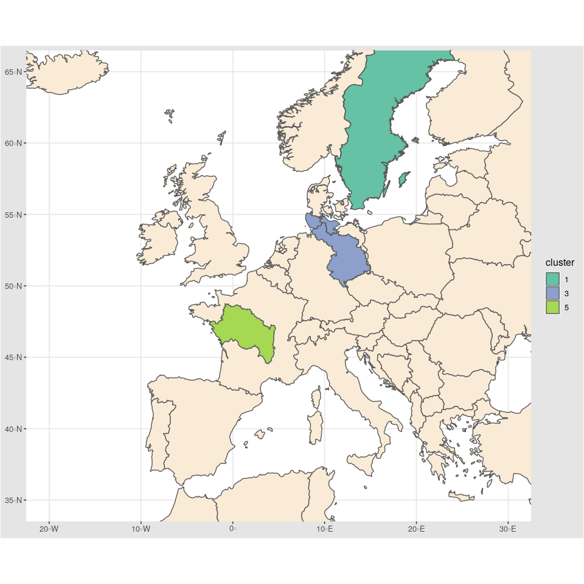<!-- -->

```r
ggplot(data = cou) +  geom_sf(fill= "antiquewhite") +
		geom_sf(data=emu,aes(fill=cluster2)) + scale_fill_manual(values=cols)+
  theme_igray() +xlim(-20,30) + ylim(35,65)  
```

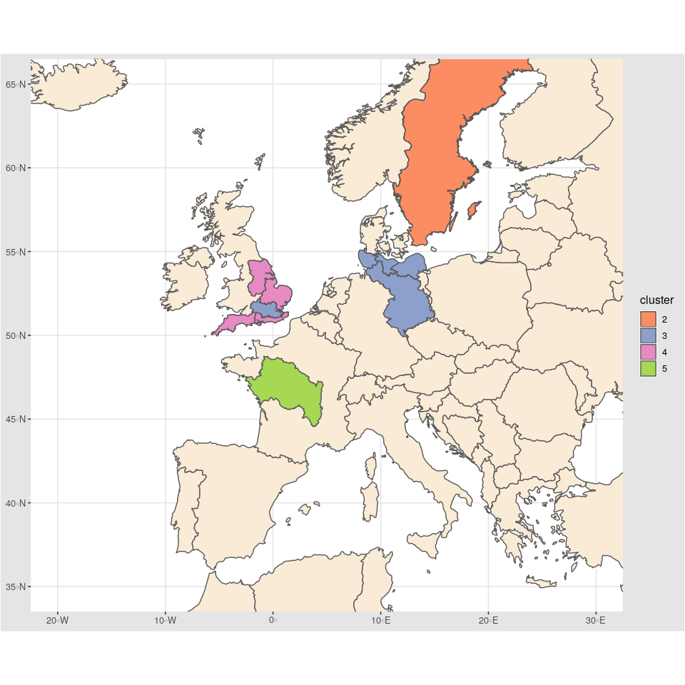<!-- -->


### Exporting pattern per group

```r
tmp <- as.matrix(as.mcmc.list(myfit_silvereel_freshwater_landings))
name_col = colnames(tmp)

pattern_Sfresh_landings=do.call("rbind.data.frame",
                                lapply(seq_len(length(levels(groups))), function(g)
                                   median_pattern_group(g, group_name,tmp, "Y","landings")))
save(pattern_Sfresh_landings,file="pattern_Sfresh_landings.rdata")
```

### Similarity between and after 2010

```r
#which groups have data in both periods
occ=table(unique(silvereel_freshwater_wide[,c("emu_nameshort", "period")])[,1])
tocompare=names(occ)[which(occ>1)]

simi=sapply(tocompare, function(s){
  g=grep(s,group_name)
  esp1=tmp[,grep(paste("alpha_group\\[",g[1],",",sep=""),name_col)]
  esp2=tmp[,grep(paste("alpha_group\\[",g[2],",",sep=""),name_col)]
  quantile(apply(cbind(esp1,esp2),
                 1,
                 function(x) sum(pmin(x[1:12],x[13:24]))),
           probs=c(0.025,.5,.975))
})

similarity=data.frame(emu=tocompare,t(simi))

table_similarity(similarity)
```

<table>
<caption>similarity</caption>
 <thead>
  <tr>
   <th style="text-align:left;"> EMU </th>
   <th style="text-align:right;"> q2.5% </th>
   <th style="text-align:right;"> median </th>
   <th style="text-align:right;"> q97.5% </th>
  </tr>
 </thead>
<tbody>
  <tr>
   <td style="text-align:left;"> DE_Eide_F </td>
   <td style="text-align:right;"> 0.59 </td>
   <td style="text-align:right;"> 0.76 </td>
   <td style="text-align:right;"> 0.88 </td>
  </tr>
  <tr>
   <td style="text-align:left;"> DE_Elbe_F </td>
   <td style="text-align:right;"> 0.55 </td>
   <td style="text-align:right;"> 0.70 </td>
   <td style="text-align:right;"> 0.83 </td>
  </tr>
  <tr>
   <td style="text-align:left;"> DE_Schl_F </td>
   <td style="text-align:right;"> 0.60 </td>
   <td style="text-align:right;"> 0.74 </td>
   <td style="text-align:right;"> 0.86 </td>
  </tr>
  <tr>
   <td style="text-align:left;"> FR_Loir_F </td>
   <td style="text-align:right;"> 0.61 </td>
   <td style="text-align:right;"> 0.76 </td>
   <td style="text-align:right;"> 0.88 </td>
  </tr>
  <tr>
   <td style="text-align:left;"> SE_Inla_F </td>
   <td style="text-align:right;"> 0.35 </td>
   <td style="text-align:right;"> 0.50 </td>
   <td style="text-align:right;"> 0.65 </td>
  </tr>
</tbody>
</table>

### Potential effect of EMP and EU closures

```r
ncar=nchar(group_name)
period=as.integer(substr(as.character(group_name),ncar,ncar))
blocks=strsplit(group_name,"_")
emus=sapply(blocks,function(x)paste(x[1],x[2],sep="_"))
hty_code=sapply(blocks,function(x) substr(x[3],1,nchar(x[3])-2))


#######EMP
list_period1=data.frame(emu_nameshort=emus[period==1])
list_period1$group=group_name[period==1]
list_period1$id_g=match(list_period1$group,group_name)
list_period1$hty_code=hty_code[period==1]
  
#we check that we have ladings data at least two years before the first EMP closures
list_period1$estimable=mapply(function(s,hty) {
  length(which(charac_EMP_closures$emu_nameshort==s 
               & grepl("S",charac_EMP_closures$lfs_code) 
               & grepl(hty, charac_EMP_closures$hty_code)))>0},
  list_period1$emu_nameshort, list_period1$hty_code)

list_period1$estimable=list_period1$estimable &
(sapply(list_period1$id_g,function(e) min(silvereel_freshwater_wide$season[group==e]))+2 <
mapply(function(e,hty) min(charac_EMP_closures$year[charac_EMP_closures$emu_nameshort==e &
                                                           grepl("S",charac_EMP_closures$lfs_code) &
                                                    grepl(hty,charac_EMP_closures$hty_code)]),
       list_period1$emu_nameshort, list_period1$hty_code))

list_period1$lossq2.5=NA
list_period1$lossq50=NA
list_period1$lossq97.5=NA

res_closures=mapply(function(s,g,hty) {
  emu_closures <- EMP_closures %>%
    filter(emu_nameshort==s & grepl("S",lfs_code) & grepl(hty, hty_code)) %>%
    group_by(emu_nameshort,month) %>%
    summarize(fishery_closure_percent=max(fishery_closure_percent))
  myalpha=tmp[,paste("alpha_group[",g,",",emu_closures$month,"]",sep="")]
  if (nrow(emu_closures)>1){
    loss=colSums(apply(myalpha,1,function(x) x*emu_closures$fishery_closure_percent/100))
  } else {
    loss=myalpha*emu_closures$fishery_closure_percent/100
  }
  quantile(loss,probs=c(0.025,.5,.975))
},as.character(list_period1$emu_nameshort[list_period1$estimable]),
list_period1$id_g[list_period1$estimable],
list_period1$hty[list_period1$estimable])

list_period1[list_period1$estimable, c("lossq2.5", "lossq50","lossq97.5")] =
  t(res_closures)

kable(list_period1[,c("emu_nameshort","lossq2.5","lossq50","lossq97.5")],
      col.names=c("emu","q2.5","median","q97.5"),
      caption="proportion of catch potentially lost because of EMP closure",
      digits=2)
```

<table>
<caption>proportion of catch potentially lost because of EMP closure</caption>
 <thead>
  <tr>
   <th style="text-align:left;"> emu </th>
   <th style="text-align:right;"> q2.5 </th>
   <th style="text-align:right;"> median </th>
   <th style="text-align:right;"> q97.5 </th>
  </tr>
 </thead>
<tbody>
  <tr>
   <td style="text-align:left;"> DE_Eide </td>
   <td style="text-align:right;"> NA </td>
   <td style="text-align:right;"> NA </td>
   <td style="text-align:right;"> NA </td>
  </tr>
  <tr>
   <td style="text-align:left;"> DE_Elbe </td>
   <td style="text-align:right;"> NA </td>
   <td style="text-align:right;"> NA </td>
   <td style="text-align:right;"> NA </td>
  </tr>
  <tr>
   <td style="text-align:left;"> DE_Schl </td>
   <td style="text-align:right;"> NA </td>
   <td style="text-align:right;"> NA </td>
   <td style="text-align:right;"> NA </td>
  </tr>
  <tr>
   <td style="text-align:left;"> FR_Loir </td>
   <td style="text-align:right;"> 0.13 </td>
   <td style="text-align:right;"> 0.17 </td>
   <td style="text-align:right;"> 0.21 </td>
  </tr>
  <tr>
   <td style="text-align:left;"> SE_Inla </td>
   <td style="text-align:right;"> NA </td>
   <td style="text-align:right;"> NA </td>
   <td style="text-align:right;"> NA </td>
  </tr>
</tbody>
</table>

```r
#######EU
list_period2=data.frame(emu_nameshort=emus[period==2])
list_period2$group=group_name[period==2]
list_period2$id_g=match(list_period2$group,group_name)
list_period2$hty_code=hty_code[period==2]
  
#we check that we have ladings data at least two years before the first EMP closures
list_period2$estimable=mapply(function(s,hty) {
  length(which(charac_EU_closures$emu_nameshort==s 
               & grepl("S",charac_EU_closures$lfs_code) 
               & grepl(hty, charac_EU_closures$hty_code)))>0},
  list_period2$emu_nameshort, list_period2$hty_code)

list_period2$estimable=list_period2$estimable &
(sapply(list_period2$id_g,function(e) min(silvereel_freshwater_wide$season[group==e]))+2 <
mapply(function(e,hty) min(charac_EU_closures$year[charac_EU_closures$emu_nameshort==e &
                                                           grepl("S",charac_EU_closures$lfs_code) &
                                                    grepl(hty,charac_EU_closures$hty_code)]),
       list_period2$emu_nameshort, list_period2$hty_code))

list_period2$lossq2.5=NA
list_period2$lossq50=NA
list_period2$lossq97.5=NA

res_closures=mapply(function(s,g,hty) {
  emu_closures <- EU_closures %>%
    filter(emu_nameshort==s & grepl("S", lfs_code) & grepl(hty,hty_code)) %>%
    group_by(emu_nameshort,month) %>%
    summarize(fishery_closure_percent=max(fishery_closure_percent))
  myalpha=tmp[,paste("alpha_group[",g,",",emu_closures$month,"]",sep="")]
  if (nrow(emu_closures)>1){
    loss=colSums(apply(myalpha,1,function(x) x*emu_closures$fishery_closure_percent/100))
  } else {
    loss=myalpha*emu_closures$fishery_closure_percent/100
  }
  quantile(loss,probs=c(0.025,.5,.975))
},as.character(list_period2$emu_nameshort[list_period2$estimable]),
list_period2$id_g[list_period2$estimable],
list_period2$hty_code[list_period2$estimable])

list_period2[list_period2$estimable, c("lossq2.5", "lossq50","lossq97.5")] =
  t(res_closures)

kable(list_period2[,c("emu_nameshort","lossq2.5","lossq50","lossq97.5")],
      col.names=c("emu","q2.5","median","q97.5"),
      caption="proportion of catch potentially lost because of EU closure",
      digits=2)
```

<table>
<caption>proportion of catch potentially lost because of EU closure</caption>
 <thead>
  <tr>
   <th style="text-align:left;"> emu </th>
   <th style="text-align:right;"> q2.5 </th>
   <th style="text-align:right;"> median </th>
   <th style="text-align:right;"> q97.5 </th>
  </tr>
 </thead>
<tbody>
  <tr>
   <td style="text-align:left;"> DE_Eide </td>
   <td style="text-align:right;"> NA </td>
   <td style="text-align:right;"> NA </td>
   <td style="text-align:right;"> NA </td>
  </tr>
  <tr>
   <td style="text-align:left;"> DE_Elbe </td>
   <td style="text-align:right;"> NA </td>
   <td style="text-align:right;"> NA </td>
   <td style="text-align:right;"> NA </td>
  </tr>
  <tr>
   <td style="text-align:left;"> DE_Schl </td>
   <td style="text-align:right;"> NA </td>
   <td style="text-align:right;"> NA </td>
   <td style="text-align:right;"> NA </td>
  </tr>
  <tr>
   <td style="text-align:left;"> DE_Warn </td>
   <td style="text-align:right;"> NA </td>
   <td style="text-align:right;"> NA </td>
   <td style="text-align:right;"> NA </td>
  </tr>
  <tr>
   <td style="text-align:left;"> FR_Loir </td>
   <td style="text-align:right;"> NA </td>
   <td style="text-align:right;"> NA </td>
   <td style="text-align:right;"> NA </td>
  </tr>
  <tr>
   <td style="text-align:left;"> GB_Angl </td>
   <td style="text-align:right;"> 0.03 </td>
   <td style="text-align:right;"> 0.07 </td>
   <td style="text-align:right;"> 0.12 </td>
  </tr>
  <tr>
   <td style="text-align:left;"> GB_Humb </td>
   <td style="text-align:right;"> 0.03 </td>
   <td style="text-align:right;"> 0.11 </td>
   <td style="text-align:right;"> 0.22 </td>
  </tr>
  <tr>
   <td style="text-align:left;"> GB_SouE </td>
   <td style="text-align:right;"> 0.02 </td>
   <td style="text-align:right;"> 0.07 </td>
   <td style="text-align:right;"> 0.15 </td>
  </tr>
  <tr>
   <td style="text-align:left;"> GB_SouW </td>
   <td style="text-align:right;"> 0.01 </td>
   <td style="text-align:right;"> 0.02 </td>
   <td style="text-align:right;"> 0.06 </td>
  </tr>
  <tr>
   <td style="text-align:left;"> GB_Tham </td>
   <td style="text-align:right;"> 0.00 </td>
   <td style="text-align:right;"> 0.01 </td>
   <td style="text-align:right;"> 0.02 </td>
  </tr>
  <tr>
   <td style="text-align:left;"> SE_Inla </td>
   <td style="text-align:right;"> NA </td>
   <td style="text-align:right;"> NA </td>
   <td style="text-align:right;"> NA </td>
  </tr>
</tbody>
</table>

```r
list_period2$type="EU closure"
list_period1$type="EMP closure"
list_period=rbind.data.frame(list_period1,list_period2)
list_period$stage="S"
save(list_period,file="loss_silverfresh.rdata")


####scenario per cluster
starts_closure=8:12
clus=1:nbclus
experiments=expand.grid(clus,starts_closure)
effects=t(mapply(function(c,s){
  months_closed=(s:(s+2))
  months_closed=ifelse(months_closed>12,months_closed-12,months_closed)
  pattern=tmp[,grep(paste("esp\\[",c,",",sep=""),colnames(tmp))]
  effect=rowSums(pattern[,months_closed])
  quantile(effect,probs=c(0.025,.5,.975))
},experiments[,1],experiments[,2]))
effects_scenario=data.frame(cluster=match(experiments[,1],clus_order),
                            starting_month_EU_closure=experiments[,2],
                            loss_median=effects[,2],
                            loss_2.5=effects[,1],
                            loss_97.5=effects[,3])
effects_scenario=effects_scenario[order(effects_scenario$cluster,
                                        effects_scenario$starting_month_EU_closure),]


kable(effects_scenario,row.names=FALSE,col.names=c("cluster",
                                   "speculative 1st month of EU closure",
                                   "median loss of catch",
                                   "q2.5",
                                   "q97.5"), digits=2,
      caption="potential effect that an EU closure would have depending on cluster and starting month")
```

<table>
<caption>potential effect that an EU closure would have depending on cluster and starting month</caption>
 <thead>
  <tr>
   <th style="text-align:right;"> cluster </th>
   <th style="text-align:right;"> speculative 1st month of EU closure </th>
   <th style="text-align:right;"> median loss of catch </th>
   <th style="text-align:right;"> q2.5 </th>
   <th style="text-align:right;"> q97.5 </th>
  </tr>
 </thead>
<tbody>
  <tr>
   <td style="text-align:right;"> 1 </td>
   <td style="text-align:right;"> 8 </td>
   <td style="text-align:right;"> 0.23 </td>
   <td style="text-align:right;"> 0.08 </td>
   <td style="text-align:right;"> 0.42 </td>
  </tr>
  <tr>
   <td style="text-align:right;"> 1 </td>
   <td style="text-align:right;"> 9 </td>
   <td style="text-align:right;"> 0.28 </td>
   <td style="text-align:right;"> 0.12 </td>
   <td style="text-align:right;"> 0.47 </td>
  </tr>
  <tr>
   <td style="text-align:right;"> 1 </td>
   <td style="text-align:right;"> 10 </td>
   <td style="text-align:right;"> 0.29 </td>
   <td style="text-align:right;"> 0.13 </td>
   <td style="text-align:right;"> 0.50 </td>
  </tr>
  <tr>
   <td style="text-align:right;"> 1 </td>
   <td style="text-align:right;"> 11 </td>
   <td style="text-align:right;"> 0.19 </td>
   <td style="text-align:right;"> 0.08 </td>
   <td style="text-align:right;"> 0.36 </td>
  </tr>
  <tr>
   <td style="text-align:right;"> 1 </td>
   <td style="text-align:right;"> 12 </td>
   <td style="text-align:right;"> 0.12 </td>
   <td style="text-align:right;"> 0.04 </td>
   <td style="text-align:right;"> 0.28 </td>
  </tr>
  <tr>
   <td style="text-align:right;"> 2 </td>
   <td style="text-align:right;"> 8 </td>
   <td style="text-align:right;"> 0.45 </td>
   <td style="text-align:right;"> 0.39 </td>
   <td style="text-align:right;"> 0.54 </td>
  </tr>
  <tr>
   <td style="text-align:right;"> 2 </td>
   <td style="text-align:right;"> 9 </td>
   <td style="text-align:right;"> 0.31 </td>
   <td style="text-align:right;"> 0.23 </td>
   <td style="text-align:right;"> 0.42 </td>
  </tr>
  <tr>
   <td style="text-align:right;"> 2 </td>
   <td style="text-align:right;"> 10 </td>
   <td style="text-align:right;"> 0.33 </td>
   <td style="text-align:right;"> 0.27 </td>
   <td style="text-align:right;"> 0.47 </td>
  </tr>
  <tr>
   <td style="text-align:right;"> 2 </td>
   <td style="text-align:right;"> 11 </td>
   <td style="text-align:right;"> 0.27 </td>
   <td style="text-align:right;"> 0.21 </td>
   <td style="text-align:right;"> 0.39 </td>
  </tr>
  <tr>
   <td style="text-align:right;"> 2 </td>
   <td style="text-align:right;"> 12 </td>
   <td style="text-align:right;"> 0.24 </td>
   <td style="text-align:right;"> 0.16 </td>
   <td style="text-align:right;"> 0.34 </td>
  </tr>
  <tr>
   <td style="text-align:right;"> 3 </td>
   <td style="text-align:right;"> 8 </td>
   <td style="text-align:right;"> 0.57 </td>
   <td style="text-align:right;"> 0.54 </td>
   <td style="text-align:right;"> 0.61 </td>
  </tr>
  <tr>
   <td style="text-align:right;"> 3 </td>
   <td style="text-align:right;"> 9 </td>
   <td style="text-align:right;"> 0.43 </td>
   <td style="text-align:right;"> 0.39 </td>
   <td style="text-align:right;"> 0.47 </td>
  </tr>
  <tr>
   <td style="text-align:right;"> 3 </td>
   <td style="text-align:right;"> 10 </td>
   <td style="text-align:right;"> 0.21 </td>
   <td style="text-align:right;"> 0.17 </td>
   <td style="text-align:right;"> 0.24 </td>
  </tr>
  <tr>
   <td style="text-align:right;"> 3 </td>
   <td style="text-align:right;"> 11 </td>
   <td style="text-align:right;"> 0.04 </td>
   <td style="text-align:right;"> 0.03 </td>
   <td style="text-align:right;"> 0.05 </td>
  </tr>
  <tr>
   <td style="text-align:right;"> 3 </td>
   <td style="text-align:right;"> 12 </td>
   <td style="text-align:right;"> 0.02 </td>
   <td style="text-align:right;"> 0.02 </td>
   <td style="text-align:right;"> 0.03 </td>
  </tr>
  <tr>
   <td style="text-align:right;"> 4 </td>
   <td style="text-align:right;"> 8 </td>
   <td style="text-align:right;"> 0.65 </td>
   <td style="text-align:right;"> 0.58 </td>
   <td style="text-align:right;"> 0.71 </td>
  </tr>
  <tr>
   <td style="text-align:right;"> 4 </td>
   <td style="text-align:right;"> 9 </td>
   <td style="text-align:right;"> 0.79 </td>
   <td style="text-align:right;"> 0.75 </td>
   <td style="text-align:right;"> 0.83 </td>
  </tr>
  <tr>
   <td style="text-align:right;"> 4 </td>
   <td style="text-align:right;"> 10 </td>
   <td style="text-align:right;"> 0.63 </td>
   <td style="text-align:right;"> 0.56 </td>
   <td style="text-align:right;"> 0.70 </td>
  </tr>
  <tr>
   <td style="text-align:right;"> 4 </td>
   <td style="text-align:right;"> 11 </td>
   <td style="text-align:right;"> 0.27 </td>
   <td style="text-align:right;"> 0.20 </td>
   <td style="text-align:right;"> 0.33 </td>
  </tr>
  <tr>
   <td style="text-align:right;"> 4 </td>
   <td style="text-align:right;"> 12 </td>
   <td style="text-align:right;"> 0.08 </td>
   <td style="text-align:right;"> 0.05 </td>
   <td style="text-align:right;"> 0.11 </td>
  </tr>
  <tr>
   <td style="text-align:right;"> 5 </td>
   <td style="text-align:right;"> 8 </td>
   <td style="text-align:right;"> 0.11 </td>
   <td style="text-align:right;"> 0.07 </td>
   <td style="text-align:right;"> 0.16 </td>
  </tr>
  <tr>
   <td style="text-align:right;"> 5 </td>
   <td style="text-align:right;"> 9 </td>
   <td style="text-align:right;"> 0.42 </td>
   <td style="text-align:right;"> 0.34 </td>
   <td style="text-align:right;"> 0.51 </td>
  </tr>
  <tr>
   <td style="text-align:right;"> 5 </td>
   <td style="text-align:right;"> 10 </td>
   <td style="text-align:right;"> 0.72 </td>
   <td style="text-align:right;"> 0.65 </td>
   <td style="text-align:right;"> 0.79 </td>
  </tr>
  <tr>
   <td style="text-align:right;"> 5 </td>
   <td style="text-align:right;"> 11 </td>
   <td style="text-align:right;"> 0.80 </td>
   <td style="text-align:right;"> 0.75 </td>
   <td style="text-align:right;"> 0.85 </td>
  </tr>
  <tr>
   <td style="text-align:right;"> 5 </td>
   <td style="text-align:right;"> 12 </td>
   <td style="text-align:right;"> 0.52 </td>
   <td style="text-align:right;"> 0.43 </td>
   <td style="text-align:right;"> 0.60 </td>
  </tr>
</tbody>
</table>


# Siver/Yellow
Many EMUs were not able to provide landings data in which yellow and silver eel were discriminated. In such situation, it was impossible to decide a priori if such EMU should be analysed with either silver eel or yellow eel stage. Therefore, we analysed such EMUs indepedently.


```r
YS_eel <- subset(res, res$lfs_code=="YS")

# we start by removing rows with only zero
all_zero <- YS_eel %>%	group_by(emu_nameshort,lfs_code,hty_code,das_year) %>%
		summarize(S=sum(das_value)) %>% 
    filter(S==0)

YS_eel <- YS_eel %>% 
	  anti_join(all_zero)
```

```
## Joining, by = c("das_year", "emu_nameshort", "lfs_code", "hty_code")
```

```r
table(YS_eel$hty_code)
```

```
## 
##    C    F  FTC    T   TC 
##  419  750  193 1522  373
```

```r
#We have many data, so we remove "FC" and "FTC" which are weirds mixes
YS_eel <- YS_eel %>%
  filter(!hty_code %in% c("FTC", "FC"))

#in this analysis, the unit will correspond to EMU / habitat so we create 
#corresponding column
YS_eel$emu <- YS_eel$emu_nameshort
YS_eel$emu_nameshort <- paste(YS_eel$emu_nameshort,
                                   YS_eel$hty_code, sep="_")
```

Similarly to seasonality, we will build season. We reuse the procedure made for silver eel and YS eel seasonality, i.e. defining seasons per emu, with the season starting at the month with minimum landings. The month with lowest catch fmin define the beggining of the season (month_in_season=1) and season y stands for the 12 months from fmin y (e.g., if lowest migration is in december, season ranges from december to november, and season y denotes season from december y to november y+1).


```r
#creating season
YSeel <- do.call("rbind.data.frame",
                     lapply(unique(YS_eel$emu_nameshort),
                            function(s)
                              season_creation(YS_eel[YS_eel$emu_nameshort==s,])))
months_peak_per_series<- unique(YSeel[,c("emu_nameshort","peak_month")])

#large variety in the month with peak of catches among EMU / habitat
table(months_peak_per_series$peak_month)
```

```
## 
##  1  4  5  6  7  8  9 10 11 12 
##  3  1  5  5  3  7  4  1  1  1
```

```r
#we remove data from season 2020
YSeel <- YSeel %>%
  filter(season < 2020)
```


Looking at the data, it seems that there are EMUS, therefore we will analysed all habitats simultaneously.


```r
table(unique(YSeel[,c("hty_code","emu_nameshort")])$hty_code)
```

```
## 
##  C  F  T TC 
##  6  9 13  3
```


## Data selection
Now we should carry out data selection, more specifically, we want to eliminate rows with two many missing data, too much zero and to check whether there are no duplicates (though Cedric already did it)


```r
YSeel_allhab <- YSeel
kept_seasons <- lapply(unique(YSeel_allhab$emu_nameshort), function(s){
  sub_YS <- subset(YSeel_allhab, YSeel_allhab$emu_nameshort==s)
  kept <- good_coverage_wave(sub_YS)
  #we remove season in which we have less than 50 kg of landings
  if(!is.null(kept))
    kept <- kept[sapply(kept,function(k)
      sum(sub_YS$das_value[sub_YS$season==k],na.rm=TRUE)>50)]
  if (length(kept) == 0) kept <- NULL
  kept
})
```

```
## [1] "For  DE_Schl_C  a good season should cover months: 1 to 12"
## [1] "For  DE_Warn_F  a good season should cover months: 3 to 10"
## [1] "For  ES_Cata_T  a good season should cover months: 10 to 3"
## [1] "For  ES_Murc_C  a good season should cover months: 11 to 4"
## [1] "For  FI_total_T  a good season should cover months: 5 to 12"
## [1] "For  FR_Adou_T  a good season should cover months: 3 to 12"
## [1] "For  FR_Adou_F  a good season should cover months: 9 to 6"
## [1] "For  FR_Arto_T  a good season should cover months: 1 to 10"
## [1] "For  FR_Bret_T  a good season should cover months: 2 to 10"
## [1] "For  FR_Garo_F  a good season should cover months: 3 to 11"
## [1] "For  FR_Garo_T  a good season should cover months: 12 to 10"
## [1] "For  FR_Loir_T  a good season should cover months: 1 to 11"
## [1] "For  FR_Loir_F  a good season should cover months: 4 to 1"
## [1] "For  FR_Rhin_F  a good season should cover months: 4 to 11"
## [1] "For FR_Rhon_F not possible to define a season"
## [1] "For  FR_Rhon_T  a good season should cover months: 3 to 1"
## [1] "For  FR_Sein_T  a good season should cover months: 4 to 11"
## [1] "For  FR_Sein_F  a good season should cover months: 4 to 11"
## [1] "For  NL_total_TC  a good season should cover months: 4 to 11"
## [1] "For  NL_total_F  a good season should cover months: 4 to 11"
## [1] "For  NO_total_T  a good season should cover months: 5 to 11"
## [1] "For  PL_Oder_TC  a good season should cover months: 4 to 11"
## [1] "For  PL_Oder_C  a good season should cover months: 4 to 11"
## [1] "For  PL_Oder_T  a good season should cover months: 4 to 11"
## [1] "For  PL_Vist_TC  a good season should cover months: 4 to 11"
## [1] "For  PL_Vist_C  a good season should cover months: 4 to 11"
## [1] "For  PL_Vist_T  a good season should cover months: 4 to 11"
## [1] "For PT_Port_T not possible to define a season"
## [1] "For  SE_East_C  a good season should cover months: 6 to 12"
## [1] "For SE_Inla_F not possible to define a season"
## [1] "For  SE_West_C  a good season should cover months: 5 to 11"
```

Finally, here are the series kept given previous criterion.


```r
names(kept_seasons) <- unique(YSeel_allhab$emu_nameshort)
kept_seasons[!sapply(kept_seasons,is.null)]
```

```
## $DE_Schl_C
## [1] 2012 2013
## 
## $DE_Warn_F
##  [1] 1999 2000 2001 2002 2003 2004 2005 2006 2007 2008
## 
## $ES_Cata_T
##  [1] 2000 2001 2002 2003 2004 2005 2006 2007 2008 2009 2010 2011 2012 2013
## [15] 2014 2015 2016 2017 2018
## 
## $ES_Murc_C
##  [1] 2002 2003 2004 2005 2006 2007 2008 2009 2010 2011 2012 2013 2014 2015
## [15] 2016 2017
## 
## $FI_total_T
## [1] 2011 2012 2013 2014 2015 2016 2017 2018
## 
## $FR_Adou_T
## [1] 2000 2001 2002 2003 2004 2005 2006 2007
## 
## $FR_Arto_T
## [1] 1999 2000 2001 2002 2003 2004 2005 2006 2007
## 
## $FR_Bret_T
## [1] 1999 2000 2001 2002 2003 2004 2005 2006 2007
## 
## $FR_Garo_F
## [1] 2003 2004
## 
## $FR_Garo_T
## [1] 2000 2001 2002 2003 2004 2005 2006 2007
## 
## $FR_Loir_T
## [1] 1999 2000 2001 2002 2003 2004 2005 2006 2007
## 
## $FR_Loir_F
## [1] 2003 2004 2005 2006 2007 2008 2009
## 
## $FR_Rhin_F
## [1] 2002 2004 2005 2006
## 
## $FR_Rhon_T
## [1] 2010 2011 2012 2013 2014 2015 2016 2017
## 
## $FR_Sein_T
## [1] 2000 2001 2002 2003 2004 2005 2006 2007 2008
## 
## $FR_Sein_F
## [1] 2004
## 
## $NL_total_TC
##  [1] 2000 2001 2002 2003 2004 2005 2006 2007 2008 2016 2017
## 
## $NL_total_F
##  [1] 2001 2002 2003 2004 2005 2006 2007 2008 2009 2010 2011 2012 2013 2014
## [15] 2015 2016 2017 2018
## 
## $NO_total_T
##  [1] 2002 2003 2004 2005 2006 2007 2008 2009 2010 2016 2017 2018
## 
## $PL_Oder_TC
## [1] 2004 2005 2006 2007 2008 2009 2010
## 
## $PL_Oder_C
## [1] 2010 2011 2012 2013
## 
## $PL_Oder_T
## [1] 2012 2013 2014 2015 2016 2017 2018
## 
## $PL_Vist_TC
## [1] 2004 2005 2006 2007 2008 2009 2010
## 
## $PL_Vist_C
## [1] 2011 2012 2013 2014 2015 2016 2017
## 
## $PL_Vist_T
## [1] 2014 2015 2016 2017 2018
## 
## $SE_East_C
## [1] 2005 2007 2008
## 
## $SE_West_C
## [1] 2000 2001 2002 2004 2006 2008
```


## Data preparation
We carry out the same procedure as for seasonality. 


```r
YSeel_allhab_subset <- subset(YSeel_allhab, 
                           mapply(function(season, series){
                             season %in% kept_seasons[[series]]
                           }, YSeel_allhab$season, YSeel_allhab$emu_nameshort))


YSeel_allhab_wide <- pivot_wider(data=YSeel_allhab_subset[, c("emu_nameshort",
                                                     "cou_code",
                                                     "season",
                                                     "das_month",
                                                     "das_value")],
                                names_from="das_month",
                                values_from="das_value")
names(YSeel_allhab_wide)[-(1:3)] <- paste("m",
                                       names(YSeel_allhab_wide)[-(1:3)],
                                       sep="")

###we count the number of zeros per lines to remove lines without enough
###fishes
data_poor <- data.frame(YSeel_allhab_wide$emu_nameshort,
                        YSeel_allhab_wide$season,
                  zero=rowSums(YSeel_allhab_wide[, -(1:3)] == 0 |
                                 is.na(YSeel_allhab_wide[, -(1:3)])),
           tot=rowSums(YSeel_allhab_wide[, -(1:3)], na.rm=TRUE))
YSeel_allhab_wide <- YSeel_allhab_wide[data_poor$zero < 10 & data_poor$tot>50, ]

table_datapoor(data_poor %>% filter(zero > 9 | tot <50)) #we remove years where we have less than 2 months
```

<table>
<caption>"data poor"" situation</caption>
 <thead>
  <tr>
   <th style="text-align:left;"> EMU </th>
   <th style="text-align:right;"> season </th>
   <th style="text-align:right;"> number of zero </th>
   <th style="text-align:right;"> total catch </th>
  </tr>
 </thead>
<tbody>
  <tr>

  </tr>
</tbody>
</table>


It leads to a dataset with 216 rows. 

We now replace NA value per zero since we selected our dataseries with missing months corresponding to insignificant months / closed months, and we compute proportions per month for each year.


```r
YSeel_allhab_wide <- YSeel_allhab_wide %>%
  replace_na(replace=list(m1=0,
                          m2=0,
                          m3=0,
                          m4=0,
                          m5=0,
                          m6=0,
                          m7=0,
                          m8=0,
                          m9=0,
                          m10=0,
                          m11=0,
                          m12=0))
YSeel_allhab_wide[, -(1:3)] <- YSeel_allhab_wide[, -(1:3)] + 1e-3
total_catch_year <- rowSums(YSeel_allhab_wide[, paste("m", 1:12, sep="")])
YSeel_allhab_wide <- YSeel_allhab_wide %>%
  mutate_at(.vars=paste("m",1:12,sep=""),function(x) x/total_catch_year)
```


The Commission asks us to compare the pattern before and after 2007, probably to see the effect of the Eel Regulation. It is therefore necessary to build a period index. However, since most countries implemented their EMPs only in 2009/2010, we split in 2010.


```r
YSeel_allhab_wide$period <- ifelse(YSeel_allhab_wide$season>2009,
                                  2,
                                  1)

kable(table(YSeel_allhab_wide$period,
       YSeel_allhab_wide$emu_nameshort),
      row.names=TRUE,
      caption="number of seasons per EMU and period")
```

<table>
<caption>number of seasons per EMU and period</caption>
 <thead>
  <tr>
   <th style="text-align:left;">   </th>
   <th style="text-align:right;"> DE_Schl_C </th>
   <th style="text-align:right;"> DE_Warn_F </th>
   <th style="text-align:right;"> ES_Cata_T </th>
   <th style="text-align:right;"> ES_Murc_C </th>
   <th style="text-align:right;"> FI_total_T </th>
   <th style="text-align:right;"> FR_Adou_T </th>
   <th style="text-align:right;"> FR_Arto_T </th>
   <th style="text-align:right;"> FR_Bret_T </th>
   <th style="text-align:right;"> FR_Garo_F </th>
   <th style="text-align:right;"> FR_Garo_T </th>
   <th style="text-align:right;"> FR_Loir_F </th>
   <th style="text-align:right;"> FR_Loir_T </th>
   <th style="text-align:right;"> FR_Rhin_F </th>
   <th style="text-align:right;"> FR_Rhon_T </th>
   <th style="text-align:right;"> FR_Sein_F </th>
   <th style="text-align:right;"> FR_Sein_T </th>
   <th style="text-align:right;"> NL_total_F </th>
   <th style="text-align:right;"> NL_total_TC </th>
   <th style="text-align:right;"> NO_total_T </th>
   <th style="text-align:right;"> PL_Oder_C </th>
   <th style="text-align:right;"> PL_Oder_T </th>
   <th style="text-align:right;"> PL_Oder_TC </th>
   <th style="text-align:right;"> PL_Vist_C </th>
   <th style="text-align:right;"> PL_Vist_T </th>
   <th style="text-align:right;"> PL_Vist_TC </th>
   <th style="text-align:right;"> SE_East_C </th>
   <th style="text-align:right;"> SE_West_C </th>
  </tr>
 </thead>
<tbody>
  <tr>
   <td style="text-align:left;"> 1 </td>
   <td style="text-align:right;"> 0 </td>
   <td style="text-align:right;"> 10 </td>
   <td style="text-align:right;"> 10 </td>
   <td style="text-align:right;"> 8 </td>
   <td style="text-align:right;"> 0 </td>
   <td style="text-align:right;"> 8 </td>
   <td style="text-align:right;"> 9 </td>
   <td style="text-align:right;"> 9 </td>
   <td style="text-align:right;"> 2 </td>
   <td style="text-align:right;"> 8 </td>
   <td style="text-align:right;"> 7 </td>
   <td style="text-align:right;"> 9 </td>
   <td style="text-align:right;"> 4 </td>
   <td style="text-align:right;"> 0 </td>
   <td style="text-align:right;"> 1 </td>
   <td style="text-align:right;"> 9 </td>
   <td style="text-align:right;"> 9 </td>
   <td style="text-align:right;"> 9 </td>
   <td style="text-align:right;"> 8 </td>
   <td style="text-align:right;"> 0 </td>
   <td style="text-align:right;"> 0 </td>
   <td style="text-align:right;"> 6 </td>
   <td style="text-align:right;"> 0 </td>
   <td style="text-align:right;"> 0 </td>
   <td style="text-align:right;"> 6 </td>
   <td style="text-align:right;"> 3 </td>
   <td style="text-align:right;"> 6 </td>
  </tr>
  <tr>
   <td style="text-align:left;"> 2 </td>
   <td style="text-align:right;"> 2 </td>
   <td style="text-align:right;"> 0 </td>
   <td style="text-align:right;"> 9 </td>
   <td style="text-align:right;"> 8 </td>
   <td style="text-align:right;"> 8 </td>
   <td style="text-align:right;"> 0 </td>
   <td style="text-align:right;"> 0 </td>
   <td style="text-align:right;"> 0 </td>
   <td style="text-align:right;"> 0 </td>
   <td style="text-align:right;"> 0 </td>
   <td style="text-align:right;"> 0 </td>
   <td style="text-align:right;"> 0 </td>
   <td style="text-align:right;"> 0 </td>
   <td style="text-align:right;"> 8 </td>
   <td style="text-align:right;"> 0 </td>
   <td style="text-align:right;"> 0 </td>
   <td style="text-align:right;"> 9 </td>
   <td style="text-align:right;"> 2 </td>
   <td style="text-align:right;"> 4 </td>
   <td style="text-align:right;"> 4 </td>
   <td style="text-align:right;"> 7 </td>
   <td style="text-align:right;"> 1 </td>
   <td style="text-align:right;"> 7 </td>
   <td style="text-align:right;"> 5 </td>
   <td style="text-align:right;"> 1 </td>
   <td style="text-align:right;"> 0 </td>
   <td style="text-align:right;"> 0 </td>
  </tr>
</tbody>
</table>

The situation is not well balanced. Most EMU which have data in periods 1 don't have data in period 2 and conversely.


## Running the model

```r
group <- as.integer(interaction(YSeel_allhab_wide$emu_nameshort,
                                            YSeel_allhab_wide$period,
                                            drop=TRUE))
nb_occ_group <- table(group)
y <-as.matrix(YSeel_allhab_wide[, paste("m", 1:12, sep="")])
```

Now, we make a loop to select the number of clusters based on a DIC criterion


```r
cl <- makeCluster(3, 'FORK')
comparison <- parSapply(cl,2:7,
       function(nbclus){
         mydata <- build_data(nbclus)
         adapted <- FALSE
         while (!adapted){
           tryCatch({
             runjags.options(adapt.incomplete="error")
             res <- run.jags("jags_model.txt", monitor= c("deviance",
                                                          "alpha_group",
                                                          "cluster"),
                        summarise=FALSE, adapt=40000, method="parallel",
                        sample=2000,burnin=100000,n.chains=1,
                        inits=generate_init(nbclus, mydata)[[1]],
                        data=mydata)
                        adapted <- TRUE
                        res_mat <- as.matrix(as.mcmc.list(res))
                        silhouette <- median(compute_silhouette(res_mat))
                        nbused <- apply(res_mat, 1, function(iter){
                          length(table(iter[grep("cluster",
                                                 names(iter))]))
                        })
                        dic <- mean(res_mat[,1])+0.5*var(res_mat[,1])
                        stats <- c(dic,silhouette,mean(nbused))
                  }, error=function(e) {
                    print(paste("not adapted, restarting nbclus",nbclus))
                    }
                  )
         }
         stats
      })
stopCluster(cl)
best_YSeel_allhab_landings <- data.frame(nbclus=2:(ncol(comparison)+1),
                                              dic=comparison[1, ],
                                              silhouette=comparison[2, ],
                                              used=comparison[3, ])
save(best_YSeel_allhab_landings, file="YSeel_allhab_landings_jags.rdata")
```


```r
load("YSeel_allhab_landings_jags.rdata")
best_YSeel_allhab_landings
```

```
##   nbclus       dic silhouette used
## 1      2 -31892.50  0.1238231    2
## 2      3 -37109.05  0.4769433    3
## 3      4 -37475.89  0.1610281    4
## 4      5 -37985.55  0.1785846    5
## 5      6 -37910.28  0.1895422    6
## 6      7 -38135.63  0.1442730    7
```

The number of clusters used keep increasing, there is a good silhouette and DIC at 6.


```r
nbclus <- 6
mydata <-build_data(6)
adapted <- FALSE
while (!adapted){
   tryCatch({
      runjags.options(adapt.incomplete="error")
      myfit_YSeel_allhab_landings <- run.jags("jags_model.txt", monitor= c("cluster", "esp", "alpha_group",
                                            "cluster", "centroid",
                                            "centroid_group",
                                            "distToClust", "duration_clus",
                                            "duration_group",
                                            "lambda","id_cluster",
                                            "centroid"),
                      summarise=FALSE, adapt=20000, method="parallel",
                      sample=10000,burnin=200000,n.chains=1, thin=5,
                      inits=generate_init(nbclus, mydata)[[1]], data=mydata)
      adapted <- TRUE
    }, error=function(e) {
       print(paste("not adapted, restarting nbclus",nbclus))
    })
}


save(myfit_YSeel_allhab_landings, best_YSeel_allhab_landings,
     file="YSeel_allhab_landings_jags.rdata")
```

## Results
Once fitted, we can plot monthly pattern per cluster

```r
load("YSeel_allhab_landings_jags.rdata")
nbclus <- 6
mydata <-build_data(6)
get_pattern_month <- function(res,type="cluster"){
  res_mat <- as.matrix(as.mcmc.list(res, add.mutate=FALSE))
  if (type=="cluster"){
    sub_mat <- as.data.frame(res_mat[,grep("esp",colnames(res_mat))])
  }
  sub_mat <- sub_mat %>% 
    pivot_longer(cols=1:ncol(sub_mat),
                 names_to="param",
                 values_to="proportion")
  tmp <- lapply(as.character(sub_mat$param),function(p) strsplit(p,"[[:punct:]]"))
  sub_mat$cluster<-as.factor(
    as.integer(lapply(tmp, function(tt) tt[[1]][2])))
  sub_mat$month <- as.character(lapply(tmp,
                                       function(tt) paste("m",
                                                          tt[[1]][3],
                                                          sep="")))
  sub_mat$month <- factor(sub_mat$month, levels=paste("m", 1:12, sep=""))
  sub_mat
}

pat <-get_pattern_month(myfit_YSeel_allhab_landings)
clus_order=c("3","6","4","2","1","5")
pat$cluster = factor(match(pat$cluster, clus_order),
                     levels=as.character(1:7))
ggplot(pat,aes(x=month,y=proportion))+
  geom_boxplot(aes(fill=cluster),outlier.shape=NA) +
  scale_fill_manual(values=cols)+facet_wrap(.~cluster, ncol=1)
```

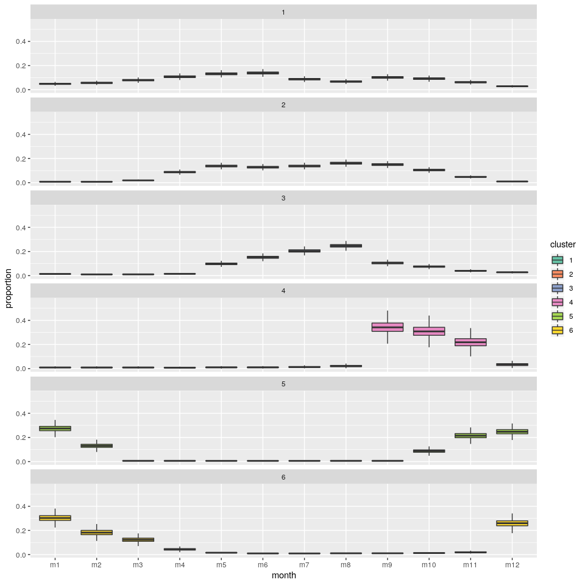<!-- -->

```r
  theme_igray()
```

```
## List of 66
##  $ line                      :List of 6
##   ..$ colour       : chr "black"
##   ..$ size         : num 0.545
##   ..$ linetype     : num 1
##   ..$ lineend      : chr "butt"
##   ..$ arrow        : logi FALSE
##   ..$ inherit.blank: logi TRUE
##   ..- attr(*, "class")= chr [1:2] "element_line" "element"
##  $ rect                      :List of 5
##   ..$ fill         : chr "gray90"
##   ..$ colour       : chr "black"
##   ..$ size         : num 0.545
##   ..$ linetype     : num 1
##   ..$ inherit.blank: logi FALSE
##   ..- attr(*, "class")= chr [1:2] "element_rect" "element"
##  $ text                      :List of 11
##   ..$ family       : chr ""
##   ..$ face         : chr "plain"
##   ..$ colour       : chr "black"
##   ..$ size         : num 12
##   ..$ hjust        : num 0.5
##   ..$ vjust        : num 0.5
##   ..$ angle        : num 0
##   ..$ lineheight   : num 0.9
##   ..$ margin       : 'margin' num [1:4] 0pt 0pt 0pt 0pt
##   .. ..- attr(*, "valid.unit")= int 8
##   .. ..- attr(*, "unit")= chr "pt"
##   ..$ debug        : logi FALSE
##   ..$ inherit.blank: logi TRUE
##   ..- attr(*, "class")= chr [1:2] "element_text" "element"
##  $ axis.title.x              :List of 11
##   ..$ family       : NULL
##   ..$ face         : NULL
##   ..$ colour       : NULL
##   ..$ size         : NULL
##   ..$ hjust        : NULL
##   ..$ vjust        : num 1
##   ..$ angle        : NULL
##   ..$ lineheight   : NULL
##   ..$ margin       : 'margin' num [1:4] 3pt 0pt 0pt 0pt
##   .. ..- attr(*, "valid.unit")= int 8
##   .. ..- attr(*, "unit")= chr "pt"
##   ..$ debug        : NULL
##   ..$ inherit.blank: logi TRUE
##   ..- attr(*, "class")= chr [1:2] "element_text" "element"
##  $ axis.title.x.top          :List of 11
##   ..$ family       : NULL
##   ..$ face         : NULL
##   ..$ colour       : NULL
##   ..$ size         : NULL
##   ..$ hjust        : NULL
##   ..$ vjust        : num 0
##   ..$ angle        : NULL
##   ..$ lineheight   : NULL
##   ..$ margin       : 'margin' num [1:4] 0pt 0pt 3pt 0pt
##   .. ..- attr(*, "valid.unit")= int 8
##   .. ..- attr(*, "unit")= chr "pt"
##   ..$ debug        : NULL
##   ..$ inherit.blank: logi TRUE
##   ..- attr(*, "class")= chr [1:2] "element_text" "element"
##  $ axis.title.y              :List of 11
##   ..$ family       : NULL
##   ..$ face         : NULL
##   ..$ colour       : NULL
##   ..$ size         : NULL
##   ..$ hjust        : NULL
##   ..$ vjust        : num 1
##   ..$ angle        : num 90
##   ..$ lineheight   : NULL
##   ..$ margin       : 'margin' num [1:4] 0pt 3pt 0pt 0pt
##   .. ..- attr(*, "valid.unit")= int 8
##   .. ..- attr(*, "unit")= chr "pt"
##   ..$ debug        : NULL
##   ..$ inherit.blank: logi TRUE
##   ..- attr(*, "class")= chr [1:2] "element_text" "element"
##  $ axis.title.y.right        :List of 11
##   ..$ family       : NULL
##   ..$ face         : NULL
##   ..$ colour       : NULL
##   ..$ size         : NULL
##   ..$ hjust        : NULL
##   ..$ vjust        : num 0
##   ..$ angle        : num -90
##   ..$ lineheight   : NULL
##   ..$ margin       : 'margin' num [1:4] 0pt 0pt 0pt 3pt
##   .. ..- attr(*, "valid.unit")= int 8
##   .. ..- attr(*, "unit")= chr "pt"
##   ..$ debug        : NULL
##   ..$ inherit.blank: logi TRUE
##   ..- attr(*, "class")= chr [1:2] "element_text" "element"
##  $ axis.text                 :List of 11
##   ..$ family       : NULL
##   ..$ face         : NULL
##   ..$ colour       : chr "grey30"
##   ..$ size         : 'rel' num 0.8
##   ..$ hjust        : NULL
##   ..$ vjust        : NULL
##   ..$ angle        : NULL
##   ..$ lineheight   : NULL
##   ..$ margin       : NULL
##   ..$ debug        : NULL
##   ..$ inherit.blank: logi TRUE
##   ..- attr(*, "class")= chr [1:2] "element_text" "element"
##  $ axis.text.x               :List of 11
##   ..$ family       : NULL
##   ..$ face         : NULL
##   ..$ colour       : NULL
##   ..$ size         : NULL
##   ..$ hjust        : NULL
##   ..$ vjust        : num 1
##   ..$ angle        : NULL
##   ..$ lineheight   : NULL
##   ..$ margin       : 'margin' num [1:4] 2.4pt 0pt 0pt 0pt
##   .. ..- attr(*, "valid.unit")= int 8
##   .. ..- attr(*, "unit")= chr "pt"
##   ..$ debug        : NULL
##   ..$ inherit.blank: logi TRUE
##   ..- attr(*, "class")= chr [1:2] "element_text" "element"
##  $ axis.text.x.top           :List of 11
##   ..$ family       : NULL
##   ..$ face         : NULL
##   ..$ colour       : NULL
##   ..$ size         : NULL
##   ..$ hjust        : NULL
##   ..$ vjust        : num 0
##   ..$ angle        : NULL
##   ..$ lineheight   : NULL
##   ..$ margin       : 'margin' num [1:4] 0pt 0pt 2.4pt 0pt
##   .. ..- attr(*, "valid.unit")= int 8
##   .. ..- attr(*, "unit")= chr "pt"
##   ..$ debug        : NULL
##   ..$ inherit.blank: logi TRUE
##   ..- attr(*, "class")= chr [1:2] "element_text" "element"
##  $ axis.text.y               :List of 11
##   ..$ family       : NULL
##   ..$ face         : NULL
##   ..$ colour       : NULL
##   ..$ size         : NULL
##   ..$ hjust        : num 1
##   ..$ vjust        : NULL
##   ..$ angle        : NULL
##   ..$ lineheight   : NULL
##   ..$ margin       : 'margin' num [1:4] 0pt 2.4pt 0pt 0pt
##   .. ..- attr(*, "valid.unit")= int 8
##   .. ..- attr(*, "unit")= chr "pt"
##   ..$ debug        : NULL
##   ..$ inherit.blank: logi TRUE
##   ..- attr(*, "class")= chr [1:2] "element_text" "element"
##  $ axis.text.y.right         :List of 11
##   ..$ family       : NULL
##   ..$ face         : NULL
##   ..$ colour       : NULL
##   ..$ size         : NULL
##   ..$ hjust        : num 0
##   ..$ vjust        : NULL
##   ..$ angle        : NULL
##   ..$ lineheight   : NULL
##   ..$ margin       : 'margin' num [1:4] 0pt 0pt 0pt 2.4pt
##   .. ..- attr(*, "valid.unit")= int 8
##   .. ..- attr(*, "unit")= chr "pt"
##   ..$ debug        : NULL
##   ..$ inherit.blank: logi TRUE
##   ..- attr(*, "class")= chr [1:2] "element_text" "element"
##  $ axis.ticks                :List of 6
##   ..$ colour       : chr "grey20"
##   ..$ size         : NULL
##   ..$ linetype     : NULL
##   ..$ lineend      : NULL
##   ..$ arrow        : logi FALSE
##   ..$ inherit.blank: logi TRUE
##   ..- attr(*, "class")= chr [1:2] "element_line" "element"
##  $ axis.ticks.length         : 'unit' num 3pt
##   ..- attr(*, "valid.unit")= int 8
##   ..- attr(*, "unit")= chr "pt"
##  $ axis.ticks.length.x       : NULL
##  $ axis.ticks.length.x.top   : NULL
##  $ axis.ticks.length.x.bottom: NULL
##  $ axis.ticks.length.y       : NULL
##  $ axis.ticks.length.y.left  : NULL
##  $ axis.ticks.length.y.right : NULL
##  $ axis.line                 : list()
##   ..- attr(*, "class")= chr [1:2] "element_blank" "element"
##  $ axis.line.x               : NULL
##  $ axis.line.y               : NULL
##  $ legend.background         :List of 5
##   ..$ fill         : NULL
##   ..$ colour       : logi NA
##   ..$ size         : NULL
##   ..$ linetype     : NULL
##   ..$ inherit.blank: logi TRUE
##   ..- attr(*, "class")= chr [1:2] "element_rect" "element"
##  $ legend.margin             : 'margin' num [1:4] 6pt 6pt 6pt 6pt
##   ..- attr(*, "valid.unit")= int 8
##   ..- attr(*, "unit")= chr "pt"
##  $ legend.spacing            : 'unit' num 12pt
##   ..- attr(*, "valid.unit")= int 8
##   ..- attr(*, "unit")= chr "pt"
##  $ legend.spacing.x          : NULL
##  $ legend.spacing.y          : NULL
##  $ legend.key                :List of 5
##   ..$ fill         : chr "white"
##   ..$ colour       : chr "white"
##   ..$ size         : NULL
##   ..$ linetype     : NULL
##   ..$ inherit.blank: logi FALSE
##   ..- attr(*, "class")= chr [1:2] "element_rect" "element"
##  $ legend.key.size           : 'unit' num 1.2lines
##   ..- attr(*, "valid.unit")= int 3
##   ..- attr(*, "unit")= chr "lines"
##  $ legend.key.height         : NULL
##  $ legend.key.width          : NULL
##  $ legend.text               :List of 11
##   ..$ family       : NULL
##   ..$ face         : NULL
##   ..$ colour       : NULL
##   ..$ size         : 'rel' num 0.8
##   ..$ hjust        : NULL
##   ..$ vjust        : NULL
##   ..$ angle        : NULL
##   ..$ lineheight   : NULL
##   ..$ margin       : NULL
##   ..$ debug        : NULL
##   ..$ inherit.blank: logi TRUE
##   ..- attr(*, "class")= chr [1:2] "element_text" "element"
##  $ legend.text.align         : NULL
##  $ legend.title              :List of 11
##   ..$ family       : NULL
##   ..$ face         : NULL
##   ..$ colour       : NULL
##   ..$ size         : NULL
##   ..$ hjust        : num 0
##   ..$ vjust        : NULL
##   ..$ angle        : NULL
##   ..$ lineheight   : NULL
##   ..$ margin       : NULL
##   ..$ debug        : NULL
##   ..$ inherit.blank: logi TRUE
##   ..- attr(*, "class")= chr [1:2] "element_text" "element"
##  $ legend.title.align        : NULL
##  $ legend.position           : chr "right"
##  $ legend.direction          : NULL
##  $ legend.justification      : chr "center"
##  $ legend.box                : NULL
##  $ legend.box.margin         : 'margin' num [1:4] 0cm 0cm 0cm 0cm
##   ..- attr(*, "valid.unit")= int 1
##   ..- attr(*, "unit")= chr "cm"
##  $ legend.box.background     : list()
##   ..- attr(*, "class")= chr [1:2] "element_blank" "element"
##  $ legend.box.spacing        : 'unit' num 12pt
##   ..- attr(*, "valid.unit")= int 8
##   ..- attr(*, "unit")= chr "pt"
##  $ panel.background          :List of 5
##   ..$ fill         : chr "white"
##   ..$ colour       : logi NA
##   ..$ size         : NULL
##   ..$ linetype     : NULL
##   ..$ inherit.blank: logi FALSE
##   ..- attr(*, "class")= chr [1:2] "element_rect" "element"
##  $ panel.border              : list()
##   ..- attr(*, "class")= chr [1:2] "element_blank" "element"
##  $ panel.spacing             : 'unit' num 6pt
##   ..- attr(*, "valid.unit")= int 8
##   ..- attr(*, "unit")= chr "pt"
##  $ panel.spacing.x           : NULL
##  $ panel.spacing.y           : NULL
##  $ panel.grid                :List of 6
##   ..$ colour       : chr "white"
##   ..$ size         : NULL
##   ..$ linetype     : NULL
##   ..$ lineend      : NULL
##   ..$ arrow        : logi FALSE
##   ..$ inherit.blank: logi TRUE
##   ..- attr(*, "class")= chr [1:2] "element_line" "element"
##  $ panel.grid.minor          :List of 6
##   ..$ colour       : NULL
##   ..$ size         : 'rel' num 0.5
##   ..$ linetype     : NULL
##   ..$ lineend      : NULL
##   ..$ arrow        : logi FALSE
##   ..$ inherit.blank: logi TRUE
##   ..- attr(*, "class")= chr [1:2] "element_line" "element"
##  $ panel.ontop               : logi FALSE
##  $ plot.background           :List of 5
##   ..$ fill         : chr "gray90"
##   ..$ colour       : chr "white"
##   ..$ size         : NULL
##   ..$ linetype     : NULL
##   ..$ inherit.blank: logi FALSE
##   ..- attr(*, "class")= chr [1:2] "element_rect" "element"
##  $ plot.title                :List of 11
##   ..$ family       : NULL
##   ..$ face         : NULL
##   ..$ colour       : NULL
##   ..$ size         : 'rel' num 1.2
##   ..$ hjust        : num 0
##   ..$ vjust        : num 1
##   ..$ angle        : NULL
##   ..$ lineheight   : NULL
##   ..$ margin       : 'margin' num [1:4] 0pt 0pt 6pt 0pt
##   .. ..- attr(*, "valid.unit")= int 8
##   .. ..- attr(*, "unit")= chr "pt"
##   ..$ debug        : NULL
##   ..$ inherit.blank: logi TRUE
##   ..- attr(*, "class")= chr [1:2] "element_text" "element"
##  $ plot.subtitle             :List of 11
##   ..$ family       : NULL
##   ..$ face         : NULL
##   ..$ colour       : NULL
##   ..$ size         : NULL
##   ..$ hjust        : num 0
##   ..$ vjust        : num 1
##   ..$ angle        : NULL
##   ..$ lineheight   : NULL
##   ..$ margin       : 'margin' num [1:4] 0pt 0pt 6pt 0pt
##   .. ..- attr(*, "valid.unit")= int 8
##   .. ..- attr(*, "unit")= chr "pt"
##   ..$ debug        : NULL
##   ..$ inherit.blank: logi TRUE
##   ..- attr(*, "class")= chr [1:2] "element_text" "element"
##  $ plot.caption              :List of 11
##   ..$ family       : NULL
##   ..$ face         : NULL
##   ..$ colour       : NULL
##   ..$ size         : 'rel' num 0.8
##   ..$ hjust        : num 1
##   ..$ vjust        : num 1
##   ..$ angle        : NULL
##   ..$ lineheight   : NULL
##   ..$ margin       : 'margin' num [1:4] 6pt 0pt 0pt 0pt
##   .. ..- attr(*, "valid.unit")= int 8
##   .. ..- attr(*, "unit")= chr "pt"
##   ..$ debug        : NULL
##   ..$ inherit.blank: logi TRUE
##   ..- attr(*, "class")= chr [1:2] "element_text" "element"
##  $ plot.tag                  :List of 11
##   ..$ family       : NULL
##   ..$ face         : NULL
##   ..$ colour       : NULL
##   ..$ size         : 'rel' num 1.2
##   ..$ hjust        : num 0.5
##   ..$ vjust        : num 0.5
##   ..$ angle        : NULL
##   ..$ lineheight   : NULL
##   ..$ margin       : NULL
##   ..$ debug        : NULL
##   ..$ inherit.blank: logi TRUE
##   ..- attr(*, "class")= chr [1:2] "element_text" "element"
##  $ plot.tag.position         : chr "topleft"
##  $ plot.margin               : 'margin' num [1:4] 6pt 6pt 6pt 6pt
##   ..- attr(*, "valid.unit")= int 8
##   ..- attr(*, "unit")= chr "pt"
##  $ strip.background          :List of 5
##   ..$ fill         : chr "grey85"
##   ..$ colour       : logi NA
##   ..$ size         : NULL
##   ..$ linetype     : NULL
##   ..$ inherit.blank: logi TRUE
##   ..- attr(*, "class")= chr [1:2] "element_rect" "element"
##  $ strip.placement           : chr "inside"
##  $ strip.text                :List of 11
##   ..$ family       : NULL
##   ..$ face         : NULL
##   ..$ colour       : chr "grey10"
##   ..$ size         : 'rel' num 0.8
##   ..$ hjust        : NULL
##   ..$ vjust        : NULL
##   ..$ angle        : NULL
##   ..$ lineheight   : NULL
##   ..$ margin       : 'margin' num [1:4] 4.8pt 4.8pt 4.8pt 4.8pt
##   .. ..- attr(*, "valid.unit")= int 8
##   .. ..- attr(*, "unit")= chr "pt"
##   ..$ debug        : NULL
##   ..$ inherit.blank: logi TRUE
##   ..- attr(*, "class")= chr [1:2] "element_text" "element"
##  $ strip.text.x              : NULL
##  $ strip.text.y              :List of 11
##   ..$ family       : NULL
##   ..$ face         : NULL
##   ..$ colour       : NULL
##   ..$ size         : NULL
##   ..$ hjust        : NULL
##   ..$ vjust        : NULL
##   ..$ angle        : num -90
##   ..$ lineheight   : NULL
##   ..$ margin       : NULL
##   ..$ debug        : NULL
##   ..$ inherit.blank: logi TRUE
##   ..- attr(*, "class")= chr [1:2] "element_text" "element"
##  $ strip.switch.pad.grid     : 'unit' num 3pt
##   ..- attr(*, "valid.unit")= int 8
##   ..- attr(*, "unit")= chr "pt"
##  $ strip.switch.pad.wrap     : 'unit' num 3pt
##   ..- attr(*, "valid.unit")= int 8
##   ..- attr(*, "unit")= chr "pt"
##  $ panel.grid.major          :List of 6
##   ..$ colour       : chr "gray90"
##   ..$ size         : NULL
##   ..$ linetype     : NULL
##   ..$ lineend      : NULL
##   ..$ arrow        : logi FALSE
##   ..$ inherit.blank: logi FALSE
##   ..- attr(*, "class")= chr [1:2] "element_line" "element"
##  - attr(*, "class")= chr [1:2] "theme" "gg"
##  - attr(*, "complete")= logi TRUE
##  - attr(*, "validate")= logi TRUE
```

Cluster 5 peaks autumn and winter, 6 is similar but shifter 1 month later. Clusters 1 and 2 are widepread with a peak in spring/early summer and a second one un autumn. Cluster 4 is located in autumn only and cluster 3 in summer.

We compute some statistics to characterize the clusters.

```r
table_characteristics(myfit_YSeel_allhab_landings, 6, clus_order)
```

<table>
<caption>characteristics of clusters</caption>
 <thead>
<tr>
<th style="border-bottom:hidden" colspan="1"></th>
<th style="border-bottom:hidden; padding-bottom:0; padding-left:3px;padding-right:3px;text-align: center; " colspan="3"><div style="border-bottom: 1px solid #ddd; padding-bottom: 5px; ">number of months to reach 80% of total</div></th>
<th style="border-bottom:hidden; padding-bottom:0; padding-left:3px;padding-right:3px;text-align: center; " colspan="3"><div style="border-bottom: 1px solid #ddd; padding-bottom: 5px; ">month of centroid</div></th>
</tr>
  <tr>
   <th style="text-align:right;"> cluster </th>
   <th style="text-align:right;"> median </th>
   <th style="text-align:right;"> q2.5% </th>
   <th style="text-align:right;"> q97.5% </th>
   <th style="text-align:right;"> median </th>
   <th style="text-align:right;"> q2.5% </th>
   <th style="text-align:right;"> q97.5% </th>
  </tr>
 </thead>
<tbody>
  <tr>
   <td style="text-align:right;"> 1 </td>
   <td style="text-align:right;"> 8 </td>
   <td style="text-align:right;"> 8 </td>
   <td style="text-align:right;"> 9 </td>
   <td style="text-align:right;"> 6.32 </td>
   <td style="text-align:right;"> 6.16 </td>
   <td style="text-align:right;"> 6.49 </td>
  </tr>
  <tr>
   <td style="text-align:right;"> 2 </td>
   <td style="text-align:right;"> 6 </td>
   <td style="text-align:right;"> 6 </td>
   <td style="text-align:right;"> 6 </td>
   <td style="text-align:right;"> 7.37 </td>
   <td style="text-align:right;"> 7.26 </td>
   <td style="text-align:right;"> 7.49 </td>
  </tr>
  <tr>
   <td style="text-align:right;"> 3 </td>
   <td style="text-align:right;"> 5 </td>
   <td style="text-align:right;"> 5 </td>
   <td style="text-align:right;"> 6 </td>
   <td style="text-align:right;"> 7.70 </td>
   <td style="text-align:right;"> 7.61 </td>
   <td style="text-align:right;"> 7.80 </td>
  </tr>
  <tr>
   <td style="text-align:right;"> 4 </td>
   <td style="text-align:right;"> 3 </td>
   <td style="text-align:right;"> 3 </td>
   <td style="text-align:right;"> 3 </td>
   <td style="text-align:right;"> 9.83 </td>
   <td style="text-align:right;"> 9.65 </td>
   <td style="text-align:right;"> 10.01 </td>
  </tr>
  <tr>
   <td style="text-align:right;"> 5 </td>
   <td style="text-align:right;"> 4 </td>
   <td style="text-align:right;"> 4 </td>
   <td style="text-align:right;"> 4 </td>
   <td style="text-align:right;"> 0.26 </td>
   <td style="text-align:right;"> 0.13 </td>
   <td style="text-align:right;"> 0.39 </td>
  </tr>
  <tr>
   <td style="text-align:right;"> 6 </td>
   <td style="text-align:right;"> 4 </td>
   <td style="text-align:right;"> 4 </td>
   <td style="text-align:right;"> 4 </td>
   <td style="text-align:right;"> 1.30 </td>
   <td style="text-align:right;"> 1.16 </td>
   <td style="text-align:right;"> 1.43 </td>
  </tr>
</tbody>
</table>

Duration indicates the minimum number of months that covers 80% of the wave (1st column is the median, and the 2 next one quantiles 2.5% and 97.5% of credibility intervals). Centroid is the centroid of the migration wave (e.g. 11.5 would indicate a migration centred around mid november). The first column is the median and the two next one the quantiles 2.5 and 97.5%.


We can also look at the belonging of the different groups.

```r
groups <- interaction(YSeel_allhab_wide$emu_nameshort,
                                            YSeel_allhab_wide$period,
                                            drop=TRUE)
group_name <- levels(groups)

get_pattern_month <- function(res,mydata){

  tmp <- strsplit(as.character(group_name),
                  "\\.")
  ser <- as.character(lapply(tmp,function(tt){
    tt[1]
  }))
  period <- as.character(lapply(tmp,function(tt){
    tt[2]
  }))
  res_mat <- as.matrix(as.mcmc.list(res,add.mutate=FALSE))
  
  clus <- t(sapply(seq_len(length(unique(groups))), function(id){
    name_col <- paste("cluster[",id,"]",sep="")
    freq <- table(res_mat[,name_col])
    max_class <- names(freq)[order(freq,decreasing=TRUE)[1]]
    c(max_class,freq[as.character(1:nbclus)])
  }))
  storage.mode(clus) <- "numeric"
  classes <- as.data.frame(clus)
  names(classes) <- c("cluster", paste("clus",seq_len(nbclus),sep=""))
  cbind.data.frame(data.frame(ser=ser, period=period),
                   classes)
}

myclassif <- get_pattern_month(myfit_YSeel_allhab_landings)
col_toreorder=grep("clus[0-9]",names(myclassif))
names(myclassif)[col_toreorder]=paste("clus",
                                      match(paste("clus",1:nbclus,sep=""),
                                      paste("clus",clus_order,sep="")),
                                      sep="")
myclassif[,col_toreorder] <- myclassif%>%
  select(col_toreorder)%>%select(sort(names(.)))
myclassif$cluster = factor(match(myclassif$cluster, clus_order),
                     levels=as.character(1:7))

table_classif(myclassif)
```

<table>
 <thead>
  <tr>
   <th style="text-align:left;"> EMU </th>
   <th style="text-align:left;"> period </th>
   <th style="text-align:left;"> Max cluster </th>
   <th style="text-align:right;"> % clus 1 </th>
   <th style="text-align:right;"> % clus 2 </th>
   <th style="text-align:right;"> % clus 3 </th>
   <th style="text-align:right;"> % clus 4 </th>
   <th style="text-align:right;"> % clus 5 </th>
   <th style="text-align:right;"> % clus 6 </th>
  </tr>
 </thead>
<tbody>
  <tr>
   <td style="text-align:left;"> FR_Arto_T </td>
   <td style="text-align:left;"> 1 </td>
   <td style="text-align:left;"> 1 </td>
   <td style="text-align:right;"> 100 </td>
   <td style="text-align:right;"> 0 </td>
   <td style="text-align:right;"> 0 </td>
   <td style="text-align:right;"> 0 </td>
   <td style="text-align:right;"> 0 </td>
   <td style="text-align:right;"> 0 </td>
  </tr>
  <tr>
   <td style="text-align:left;"> FR_Bret_T </td>
   <td style="text-align:left;"> 1 </td>
   <td style="text-align:left;"> 1 </td>
   <td style="text-align:right;"> 100 </td>
   <td style="text-align:right;"> 0 </td>
   <td style="text-align:right;"> 0 </td>
   <td style="text-align:right;"> 0 </td>
   <td style="text-align:right;"> 0 </td>
   <td style="text-align:right;"> 0 </td>
  </tr>
  <tr>
   <td style="text-align:left;"> FR_Garo_T </td>
   <td style="text-align:left;"> 1 </td>
   <td style="text-align:left;"> 1 </td>
   <td style="text-align:right;"> 100 </td>
   <td style="text-align:right;"> 0 </td>
   <td style="text-align:right;"> 0 </td>
   <td style="text-align:right;"> 0 </td>
   <td style="text-align:right;"> 0 </td>
   <td style="text-align:right;"> 0 </td>
  </tr>
  <tr>
   <td style="text-align:left;"> FR_Loir_F </td>
   <td style="text-align:left;"> 1 </td>
   <td style="text-align:left;"> 1 </td>
   <td style="text-align:right;"> 100 </td>
   <td style="text-align:right;"> 0 </td>
   <td style="text-align:right;"> 0 </td>
   <td style="text-align:right;"> 0 </td>
   <td style="text-align:right;"> 0 </td>
   <td style="text-align:right;"> 0 </td>
  </tr>
  <tr>
   <td style="text-align:left;"> FR_Loir_T </td>
   <td style="text-align:left;"> 1 </td>
   <td style="text-align:left;"> 1 </td>
   <td style="text-align:right;"> 100 </td>
   <td style="text-align:right;"> 0 </td>
   <td style="text-align:right;"> 0 </td>
   <td style="text-align:right;"> 0 </td>
   <td style="text-align:right;"> 0 </td>
   <td style="text-align:right;"> 0 </td>
  </tr>
  <tr>
   <td style="text-align:left;"> FR_Rhon_T </td>
   <td style="text-align:left;"> 2 </td>
   <td style="text-align:left;"> 1 </td>
   <td style="text-align:right;"> 100 </td>
   <td style="text-align:right;"> 0 </td>
   <td style="text-align:right;"> 0 </td>
   <td style="text-align:right;"> 0 </td>
   <td style="text-align:right;"> 0 </td>
   <td style="text-align:right;"> 0 </td>
  </tr>
  <tr>
   <td style="text-align:left;"> DE_Warn_F </td>
   <td style="text-align:left;"> 1 </td>
   <td style="text-align:left;"> 2 </td>
   <td style="text-align:right;"> 0 </td>
   <td style="text-align:right;"> 100 </td>
   <td style="text-align:right;"> 0 </td>
   <td style="text-align:right;"> 0 </td>
   <td style="text-align:right;"> 0 </td>
   <td style="text-align:right;"> 0 </td>
  </tr>
  <tr>
   <td style="text-align:left;"> FR_Adou_T </td>
   <td style="text-align:left;"> 1 </td>
   <td style="text-align:left;"> 2 </td>
   <td style="text-align:right;"> 0 </td>
   <td style="text-align:right;"> 100 </td>
   <td style="text-align:right;"> 0 </td>
   <td style="text-align:right;"> 0 </td>
   <td style="text-align:right;"> 0 </td>
   <td style="text-align:right;"> 0 </td>
  </tr>
  <tr>
   <td style="text-align:left;"> FR_Garo_F </td>
   <td style="text-align:left;"> 1 </td>
   <td style="text-align:left;"> 2 </td>
   <td style="text-align:right;"> 0 </td>
   <td style="text-align:right;"> 53 </td>
   <td style="text-align:right;"> 47 </td>
   <td style="text-align:right;"> 0 </td>
   <td style="text-align:right;"> 0 </td>
   <td style="text-align:right;"> 0 </td>
  </tr>
  <tr>
   <td style="text-align:left;"> FR_Rhin_F </td>
   <td style="text-align:left;"> 1 </td>
   <td style="text-align:left;"> 2 </td>
   <td style="text-align:right;"> 0 </td>
   <td style="text-align:right;"> 100 </td>
   <td style="text-align:right;"> 0 </td>
   <td style="text-align:right;"> 0 </td>
   <td style="text-align:right;"> 0 </td>
   <td style="text-align:right;"> 0 </td>
  </tr>
  <tr>
   <td style="text-align:left;"> FR_Sein_F </td>
   <td style="text-align:left;"> 1 </td>
   <td style="text-align:left;"> 2 </td>
   <td style="text-align:right;"> 0 </td>
   <td style="text-align:right;"> 97 </td>
   <td style="text-align:right;"> 3 </td>
   <td style="text-align:right;"> 0 </td>
   <td style="text-align:right;"> 0 </td>
   <td style="text-align:right;"> 0 </td>
  </tr>
  <tr>
   <td style="text-align:left;"> NL_total_TC </td>
   <td style="text-align:left;"> 1 </td>
   <td style="text-align:left;"> 2 </td>
   <td style="text-align:right;"> 0 </td>
   <td style="text-align:right;"> 95 </td>
   <td style="text-align:right;"> 5 </td>
   <td style="text-align:right;"> 0 </td>
   <td style="text-align:right;"> 0 </td>
   <td style="text-align:right;"> 0 </td>
  </tr>
  <tr>
   <td style="text-align:left;"> PL_Oder_C </td>
   <td style="text-align:left;"> 2 </td>
   <td style="text-align:left;"> 2 </td>
   <td style="text-align:right;"> 0 </td>
   <td style="text-align:right;"> 100 </td>
   <td style="text-align:right;"> 0 </td>
   <td style="text-align:right;"> 0 </td>
   <td style="text-align:right;"> 0 </td>
   <td style="text-align:right;"> 0 </td>
  </tr>
  <tr>
   <td style="text-align:left;"> PL_Oder_T </td>
   <td style="text-align:left;"> 2 </td>
   <td style="text-align:left;"> 2 </td>
   <td style="text-align:right;"> 0 </td>
   <td style="text-align:right;"> 100 </td>
   <td style="text-align:right;"> 0 </td>
   <td style="text-align:right;"> 0 </td>
   <td style="text-align:right;"> 0 </td>
   <td style="text-align:right;"> 0 </td>
  </tr>
  <tr>
   <td style="text-align:left;"> PL_Oder_TC </td>
   <td style="text-align:left;"> 1 </td>
   <td style="text-align:left;"> 2 </td>
   <td style="text-align:right;"> 0 </td>
   <td style="text-align:right;"> 100 </td>
   <td style="text-align:right;"> 0 </td>
   <td style="text-align:right;"> 0 </td>
   <td style="text-align:right;"> 0 </td>
   <td style="text-align:right;"> 0 </td>
  </tr>
  <tr>
   <td style="text-align:left;"> PL_Oder_TC </td>
   <td style="text-align:left;"> 2 </td>
   <td style="text-align:left;"> 2 </td>
   <td style="text-align:right;"> 0 </td>
   <td style="text-align:right;"> 99 </td>
   <td style="text-align:right;"> 1 </td>
   <td style="text-align:right;"> 0 </td>
   <td style="text-align:right;"> 0 </td>
   <td style="text-align:right;"> 0 </td>
  </tr>
  <tr>
   <td style="text-align:left;"> PL_Vist_C </td>
   <td style="text-align:left;"> 2 </td>
   <td style="text-align:left;"> 2 </td>
   <td style="text-align:right;"> 0 </td>
   <td style="text-align:right;"> 100 </td>
   <td style="text-align:right;"> 0 </td>
   <td style="text-align:right;"> 0 </td>
   <td style="text-align:right;"> 0 </td>
   <td style="text-align:right;"> 0 </td>
  </tr>
  <tr>
   <td style="text-align:left;"> PL_Vist_T </td>
   <td style="text-align:left;"> 2 </td>
   <td style="text-align:left;"> 2 </td>
   <td style="text-align:right;"> 0 </td>
   <td style="text-align:right;"> 100 </td>
   <td style="text-align:right;"> 0 </td>
   <td style="text-align:right;"> 0 </td>
   <td style="text-align:right;"> 0 </td>
   <td style="text-align:right;"> 0 </td>
  </tr>
  <tr>
   <td style="text-align:left;"> PL_Vist_TC </td>
   <td style="text-align:left;"> 1 </td>
   <td style="text-align:left;"> 2 </td>
   <td style="text-align:right;"> 0 </td>
   <td style="text-align:right;"> 100 </td>
   <td style="text-align:right;"> 0 </td>
   <td style="text-align:right;"> 0 </td>
   <td style="text-align:right;"> 0 </td>
   <td style="text-align:right;"> 0 </td>
  </tr>
  <tr>
   <td style="text-align:left;"> PL_Vist_TC </td>
   <td style="text-align:left;"> 2 </td>
   <td style="text-align:left;"> 2 </td>
   <td style="text-align:right;"> 0 </td>
   <td style="text-align:right;"> 93 </td>
   <td style="text-align:right;"> 7 </td>
   <td style="text-align:right;"> 0 </td>
   <td style="text-align:right;"> 0 </td>
   <td style="text-align:right;"> 0 </td>
  </tr>
  <tr>
   <td style="text-align:left;"> FI_total_T </td>
   <td style="text-align:left;"> 2 </td>
   <td style="text-align:left;"> 3 </td>
   <td style="text-align:right;"> 0 </td>
   <td style="text-align:right;"> 0 </td>
   <td style="text-align:right;"> 100 </td>
   <td style="text-align:right;"> 0 </td>
   <td style="text-align:right;"> 0 </td>
   <td style="text-align:right;"> 0 </td>
  </tr>
  <tr>
   <td style="text-align:left;"> FR_Sein_T </td>
   <td style="text-align:left;"> 1 </td>
   <td style="text-align:left;"> 3 </td>
   <td style="text-align:right;"> 0 </td>
   <td style="text-align:right;"> 0 </td>
   <td style="text-align:right;"> 100 </td>
   <td style="text-align:right;"> 0 </td>
   <td style="text-align:right;"> 0 </td>
   <td style="text-align:right;"> 0 </td>
  </tr>
  <tr>
   <td style="text-align:left;"> NL_total_F </td>
   <td style="text-align:left;"> 1 </td>
   <td style="text-align:left;"> 3 </td>
   <td style="text-align:right;"> 0 </td>
   <td style="text-align:right;"> 0 </td>
   <td style="text-align:right;"> 100 </td>
   <td style="text-align:right;"> 0 </td>
   <td style="text-align:right;"> 0 </td>
   <td style="text-align:right;"> 0 </td>
  </tr>
  <tr>
   <td style="text-align:left;"> NL_total_F </td>
   <td style="text-align:left;"> 2 </td>
   <td style="text-align:left;"> 3 </td>
   <td style="text-align:right;"> 0 </td>
   <td style="text-align:right;"> 0 </td>
   <td style="text-align:right;"> 100 </td>
   <td style="text-align:right;"> 0 </td>
   <td style="text-align:right;"> 0 </td>
   <td style="text-align:right;"> 0 </td>
  </tr>
  <tr>
   <td style="text-align:left;"> NL_total_TC </td>
   <td style="text-align:left;"> 2 </td>
   <td style="text-align:left;"> 3 </td>
   <td style="text-align:right;"> 0 </td>
   <td style="text-align:right;"> 24 </td>
   <td style="text-align:right;"> 76 </td>
   <td style="text-align:right;"> 0 </td>
   <td style="text-align:right;"> 0 </td>
   <td style="text-align:right;"> 0 </td>
  </tr>
  <tr>
   <td style="text-align:left;"> NO_total_T </td>
   <td style="text-align:left;"> 1 </td>
   <td style="text-align:left;"> 3 </td>
   <td style="text-align:right;"> 0 </td>
   <td style="text-align:right;"> 0 </td>
   <td style="text-align:right;"> 100 </td>
   <td style="text-align:right;"> 0 </td>
   <td style="text-align:right;"> 0 </td>
   <td style="text-align:right;"> 0 </td>
  </tr>
  <tr>
   <td style="text-align:left;"> SE_East_C </td>
   <td style="text-align:left;"> 1 </td>
   <td style="text-align:left;"> 3 </td>
   <td style="text-align:right;"> 0 </td>
   <td style="text-align:right;"> 0 </td>
   <td style="text-align:right;"> 100 </td>
   <td style="text-align:right;"> 0 </td>
   <td style="text-align:right;"> 0 </td>
   <td style="text-align:right;"> 0 </td>
  </tr>
  <tr>
   <td style="text-align:left;"> SE_West_C </td>
   <td style="text-align:left;"> 1 </td>
   <td style="text-align:left;"> 3 </td>
   <td style="text-align:right;"> 0 </td>
   <td style="text-align:right;"> 0 </td>
   <td style="text-align:right;"> 100 </td>
   <td style="text-align:right;"> 0 </td>
   <td style="text-align:right;"> 0 </td>
   <td style="text-align:right;"> 0 </td>
  </tr>
  <tr>
   <td style="text-align:left;"> DE_Schl_C </td>
   <td style="text-align:left;"> 2 </td>
   <td style="text-align:left;"> 4 </td>
   <td style="text-align:right;"> 0 </td>
   <td style="text-align:right;"> 0 </td>
   <td style="text-align:right;"> 0 </td>
   <td style="text-align:right;"> 100 </td>
   <td style="text-align:right;"> 0 </td>
   <td style="text-align:right;"> 0 </td>
  </tr>
  <tr>
   <td style="text-align:left;"> NO_total_T </td>
   <td style="text-align:left;"> 2 </td>
   <td style="text-align:left;"> 4 </td>
   <td style="text-align:right;"> 0 </td>
   <td style="text-align:right;"> 0 </td>
   <td style="text-align:right;"> 0 </td>
   <td style="text-align:right;"> 100 </td>
   <td style="text-align:right;"> 0 </td>
   <td style="text-align:right;"> 0 </td>
  </tr>
  <tr>
   <td style="text-align:left;"> ES_Cata_T </td>
   <td style="text-align:left;"> 1 </td>
   <td style="text-align:left;"> 5 </td>
   <td style="text-align:right;"> 0 </td>
   <td style="text-align:right;"> 0 </td>
   <td style="text-align:right;"> 0 </td>
   <td style="text-align:right;"> 0 </td>
   <td style="text-align:right;"> 100 </td>
   <td style="text-align:right;"> 0 </td>
  </tr>
  <tr>
   <td style="text-align:left;"> ES_Cata_T </td>
   <td style="text-align:left;"> 2 </td>
   <td style="text-align:left;"> 5 </td>
   <td style="text-align:right;"> 0 </td>
   <td style="text-align:right;"> 0 </td>
   <td style="text-align:right;"> 0 </td>
   <td style="text-align:right;"> 0 </td>
   <td style="text-align:right;"> 100 </td>
   <td style="text-align:right;"> 0 </td>
  </tr>
  <tr>
   <td style="text-align:left;"> ES_Murc_C </td>
   <td style="text-align:left;"> 1 </td>
   <td style="text-align:left;"> 6 </td>
   <td style="text-align:right;"> 0 </td>
   <td style="text-align:right;"> 0 </td>
   <td style="text-align:right;"> 0 </td>
   <td style="text-align:right;"> 0 </td>
   <td style="text-align:right;"> 0 </td>
   <td style="text-align:right;"> 100 </td>
  </tr>
  <tr>
   <td style="text-align:left;"> ES_Murc_C </td>
   <td style="text-align:left;"> 2 </td>
   <td style="text-align:left;"> 6 </td>
   <td style="text-align:right;"> 0 </td>
   <td style="text-align:right;"> 0 </td>
   <td style="text-align:right;"> 0 </td>
   <td style="text-align:right;"> 0 </td>
   <td style="text-align:right;"> 0 </td>
   <td style="text-align:right;"> 100 </td>
  </tr>
</tbody>
</table>

Cluster 6 corresponds only to ES_Murc and cluster 5 to ES_Cata to FR_Cors. Cluster 1 corresponds to many French EMUs in transitional waters and 2 and  to 3 are diverse. 


```r
myplots <-lapply(c("TC","C","T", "F"),function(hty){
  myclassif_p1 <- subset(myclassif, myclassif$period == 1 &
                           endsWith(as.character(myclassif$ser),
                                    hty))
  myclassif_p2 <- subset(myclassif, myclassif$period == 2 &
                           endsWith(as.character(myclassif$ser),
                                    hty))
  emu$cluster1 <- factor(myclassif_p1$cluster[match(emu$name_short,                                                  gsub(paste("_",hty,sep=""),"",as.character(myclassif_p1$ser)))],
                       levels=1:7)
  emu$cluster2 <- factor(myclassif_p2$cluster[match(emu$name_short,                                                gsub(paste("_",hty,sep=""),"",as.character(myclassif_p1$ser)))],
                       levels=1:7)
  p1 <- ggplot(data = cou) +  geom_sf(fill= "antiquewhite") +
		  geom_sf(data=emu,aes(fill=cluster1)) + scale_fill_manual(values=cols)+
      theme_igray() +xlim(-20,30) + ylim(35,65) +
    ggtitle(paste("period 1",hty))
  p2 <- ggplot(data = cou) +  geom_sf(fill= "antiquewhite") +
		  geom_sf(data=emu,aes(fill=cluster2)) + scale_fill_manual(values=cols)+
    theme_igray() +xlim(-20,30) + ylim(35,65)  +
    ggtitle(paste("period 2",hty))
  return(list(p1,p2))
})
myplots <- do.call(c, myplots)
print(myplots[[1]][[1]])
```

```
## Simple feature collection with 54 features and 1 field
## geometry type:  MULTIPOLYGON
## dimension:      XY
## bbox:           xmin: -31.26575 ymin: 32.39748 xmax: 69.07032 ymax: 81.85737
## epsg (SRID):    4326
## proj4string:    +proj=longlat +datum=WGS84 +no_defs
## First 10 features:
##                  NAME                       geometry
## 1             Albania MULTIPOLYGON (((19.50115 40...
## 2             Andorra MULTIPOLYGON (((1.439922 42...
## 3             Austria MULTIPOLYGON (((16 48.77775...
## 4             Belgium MULTIPOLYGON (((5 49.79374,...
## 5  Bosnia Herzegovina MULTIPOLYGON (((19.22947 43...
## 6             Croatia MULTIPOLYGON (((14.30038 44...
## 7      Czech Republic MULTIPOLYGON (((14.82523 50...
## 8             Denmark MULTIPOLYGON (((11.99978 54...
## 9             Estonia MULTIPOLYGON (((23.97511 58...
## 10            Finland MULTIPOLYGON (((22.0731 60....
```

```r
print(myplots[[1]][[2]])
```

```
## [[1]]
## mapping:  
## geom_sf: na.rm = FALSE, legend = polygon
## stat_sf: na.rm = FALSE
## position_identity 
## 
## [[2]]
## mapping: fill = ~cluster1 
## geom_sf: na.rm = FALSE, legend = polygon
## stat_sf: na.rm = FALSE
## position_identity
```

```r
print(myplots[[2]][[1]])
```

```
## Simple feature collection with 54 features and 1 field
## geometry type:  MULTIPOLYGON
## dimension:      XY
## bbox:           xmin: -31.26575 ymin: 32.39748 xmax: 69.07032 ymax: 81.85737
## epsg (SRID):    4326
## proj4string:    +proj=longlat +datum=WGS84 +no_defs
## First 10 features:
##                  NAME                       geometry
## 1             Albania MULTIPOLYGON (((19.50115 40...
## 2             Andorra MULTIPOLYGON (((1.439922 42...
## 3             Austria MULTIPOLYGON (((16 48.77775...
## 4             Belgium MULTIPOLYGON (((5 49.79374,...
## 5  Bosnia Herzegovina MULTIPOLYGON (((19.22947 43...
## 6             Croatia MULTIPOLYGON (((14.30038 44...
## 7      Czech Republic MULTIPOLYGON (((14.82523 50...
## 8             Denmark MULTIPOLYGON (((11.99978 54...
## 9             Estonia MULTIPOLYGON (((23.97511 58...
## 10            Finland MULTIPOLYGON (((22.0731 60....
```

```r
print(myplots[[2]][[2]])
```

```
## [[1]]
## mapping:  
## geom_sf: na.rm = FALSE, legend = polygon
## stat_sf: na.rm = FALSE
## position_identity 
## 
## [[2]]
## mapping: fill = ~cluster2 
## geom_sf: na.rm = FALSE, legend = polygon
## stat_sf: na.rm = FALSE
## position_identity
```

```r
print(myplots[[3]][[1]])
```

```
## Simple feature collection with 54 features and 1 field
## geometry type:  MULTIPOLYGON
## dimension:      XY
## bbox:           xmin: -31.26575 ymin: 32.39748 xmax: 69.07032 ymax: 81.85737
## epsg (SRID):    4326
## proj4string:    +proj=longlat +datum=WGS84 +no_defs
## First 10 features:
##                  NAME                       geometry
## 1             Albania MULTIPOLYGON (((19.50115 40...
## 2             Andorra MULTIPOLYGON (((1.439922 42...
## 3             Austria MULTIPOLYGON (((16 48.77775...
## 4             Belgium MULTIPOLYGON (((5 49.79374,...
## 5  Bosnia Herzegovina MULTIPOLYGON (((19.22947 43...
## 6             Croatia MULTIPOLYGON (((14.30038 44...
## 7      Czech Republic MULTIPOLYGON (((14.82523 50...
## 8             Denmark MULTIPOLYGON (((11.99978 54...
## 9             Estonia MULTIPOLYGON (((23.97511 58...
## 10            Finland MULTIPOLYGON (((22.0731 60....
```

```r
print(myplots[[3]][[2]])
```

```
## [[1]]
## mapping:  
## geom_sf: na.rm = FALSE, legend = polygon
## stat_sf: na.rm = FALSE
## position_identity 
## 
## [[2]]
## mapping: fill = ~cluster1 
## geom_sf: na.rm = FALSE, legend = polygon
## stat_sf: na.rm = FALSE
## position_identity
```

```r
print(myplots[[4]][[1]])
```

```
## Simple feature collection with 54 features and 1 field
## geometry type:  MULTIPOLYGON
## dimension:      XY
## bbox:           xmin: -31.26575 ymin: 32.39748 xmax: 69.07032 ymax: 81.85737
## epsg (SRID):    4326
## proj4string:    +proj=longlat +datum=WGS84 +no_defs
## First 10 features:
##                  NAME                       geometry
## 1             Albania MULTIPOLYGON (((19.50115 40...
## 2             Andorra MULTIPOLYGON (((1.439922 42...
## 3             Austria MULTIPOLYGON (((16 48.77775...
## 4             Belgium MULTIPOLYGON (((5 49.79374,...
## 5  Bosnia Herzegovina MULTIPOLYGON (((19.22947 43...
## 6             Croatia MULTIPOLYGON (((14.30038 44...
## 7      Czech Republic MULTIPOLYGON (((14.82523 50...
## 8             Denmark MULTIPOLYGON (((11.99978 54...
## 9             Estonia MULTIPOLYGON (((23.97511 58...
## 10            Finland MULTIPOLYGON (((22.0731 60....
```

```r
print(myplots[[4]][[2]])
```

```
## [[1]]
## mapping:  
## geom_sf: na.rm = FALSE, legend = polygon
## stat_sf: na.rm = FALSE
## position_identity 
## 
## [[2]]
## mapping: fill = ~cluster2 
## geom_sf: na.rm = FALSE, legend = polygon
## stat_sf: na.rm = FALSE
## position_identity
```

## Exporting pattern per group

```r
tmp <- as.matrix(as.mcmc.list(myfit_YSeel_allhab_landings))
name_col = colnames(tmp)

pattern_YS_landings=do.call("rbind.data.frame",
                                lapply(seq_len(length(levels(groups))), function(g)
                                   median_pattern_group(g, group_name,tmp, "YS","landings")))
save(pattern_YS_landings,file="pattern_YS_landings.rdata")
```


## Similarity between and after 2010

```r
#which groups have data in both periods
occ=table(unique(YSeel_allhab_wide[,c("emu_nameshort", "period")])[,1])
tocompare=names(occ)[which(occ>1)]

simi=sapply(tocompare, function(s){
  g=grep(s,group_name)
  esp1=tmp[,grep(paste("alpha_group\\[",g[1],",",sep=""),name_col)]
  esp2=tmp[,grep(paste("alpha_group\\[",g[2],",",sep=""),name_col)]
  quantile(apply(cbind(esp1,esp2),
                 1,
                 function(x) sum(pmin(x[1:12],x[13:24]))),
           probs=c(0.025,.5,.975))
})

similarity=data.frame(emu=tocompare,t(simi))

table_similarity(similarity)
```

<table>
<caption>similarity</caption>
 <thead>
  <tr>
   <th style="text-align:left;"> EMU </th>
   <th style="text-align:right;"> q2.5% </th>
   <th style="text-align:right;"> median </th>
   <th style="text-align:right;"> q97.5% </th>
  </tr>
 </thead>
<tbody>
  <tr>
   <td style="text-align:left;"> ES_Cata_T </td>
   <td style="text-align:right;"> 0.80 </td>
   <td style="text-align:right;"> 0.88 </td>
   <td style="text-align:right;"> 0.95 </td>
  </tr>
  <tr>
   <td style="text-align:left;"> ES_Murc_C </td>
   <td style="text-align:right;"> 0.68 </td>
   <td style="text-align:right;"> 0.77 </td>
   <td style="text-align:right;"> 0.86 </td>
  </tr>
  <tr>
   <td style="text-align:left;"> NL_total_F </td>
   <td style="text-align:right;"> 0.65 </td>
   <td style="text-align:right;"> 0.73 </td>
   <td style="text-align:right;"> 0.80 </td>
  </tr>
  <tr>
   <td style="text-align:left;"> NL_total_TC </td>
   <td style="text-align:right;"> 0.66 </td>
   <td style="text-align:right;"> 0.77 </td>
   <td style="text-align:right;"> 0.87 </td>
  </tr>
  <tr>
   <td style="text-align:left;"> NO_total_T </td>
   <td style="text-align:right;"> 0.41 </td>
   <td style="text-align:right;"> 0.50 </td>
   <td style="text-align:right;"> 0.59 </td>
  </tr>
  <tr>
   <td style="text-align:left;"> PL_Oder_TC </td>
   <td style="text-align:right;"> 0.60 </td>
   <td style="text-align:right;"> 0.75 </td>
   <td style="text-align:right;"> 0.86 </td>
  </tr>
  <tr>
   <td style="text-align:left;"> PL_Vist_TC </td>
   <td style="text-align:right;"> 0.60 </td>
   <td style="text-align:right;"> 0.75 </td>
   <td style="text-align:right;"> 0.86 </td>
  </tr>
</tbody>
</table>

