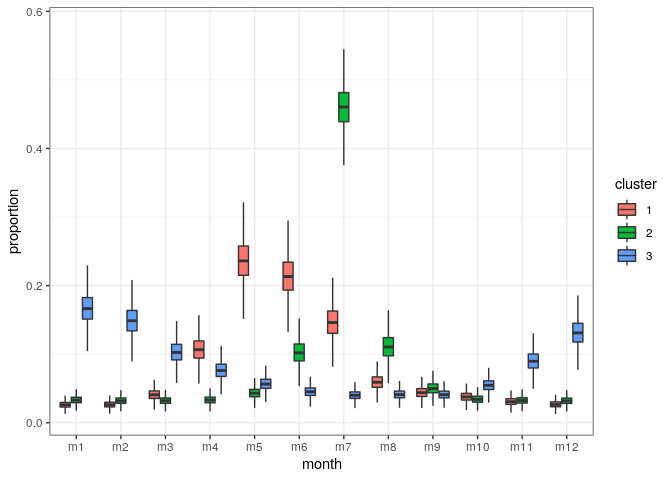
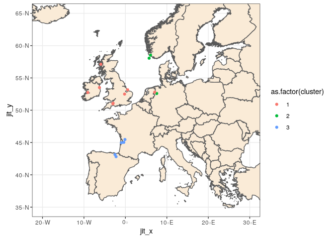
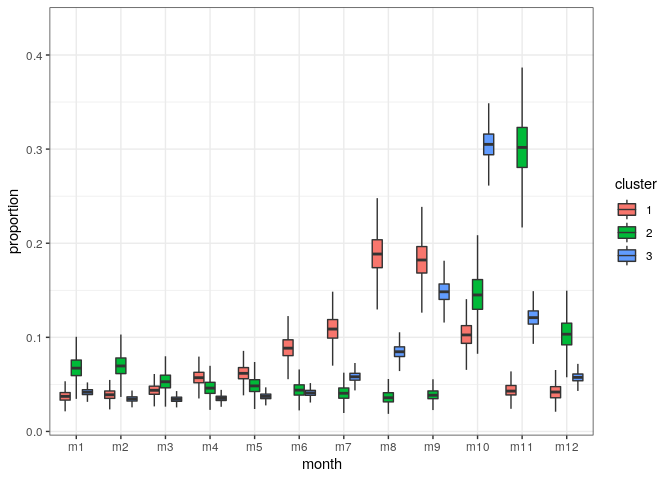
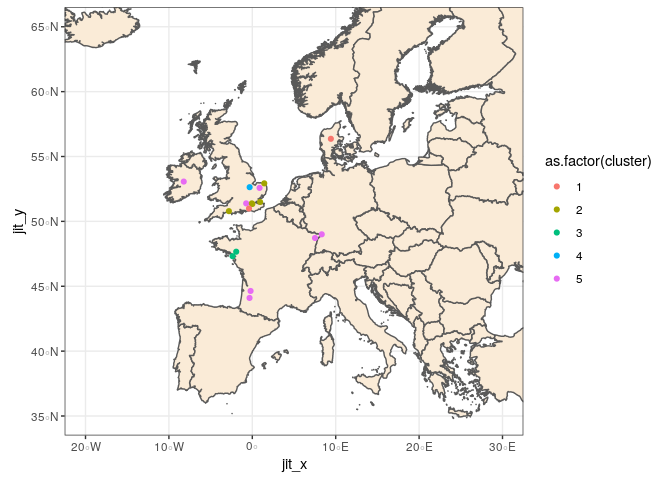

-   [Loading the data](#loading-the-data)
-   [Glass Eel](#glass-eel)
    -   [Data availability](#data-availability)
    -   [Data selection](#data-selection)
        -   [Reason for exclusion](#reason-for-exclusion)
        -   [Reason for keeping](#reason-for-keeping)
        -   [to be discussed](#to-be-discussed)
        -   [Final selection of data](#final-selection-of-data)
    -   [Data preparation](#data-preparation)
    -   [Running the model](#running-the-model)
    -   [Results](#results)
-   [Silver eel](#silver-eel)
    -   [Data availability](#data-availability-1)
    -   [Data correction](#data-correction)
    -   [Data selection](#data-selection-1)
    -   [Building diagnostics of quality for
        series](#building-diagnostics-of-quality-for-series)
    -   [Data preparation](#data-preparation-1)
    -   [Running the model](#running-the-model-1)
    -   [Results](#results-1)
-   [Yellow eel](#yellow-eel)
    -   [Data availability](#data-availability-2)
    -   [Data correction](#data-correction-1)
    -   [Data selection](#data-selection-2)
    -   [Building diagnostics of quality for
        series](#building-diagnostics-of-quality-for-series-1)
    -   [Data preparation](#data-preparation-2)
    -   [Running the model](#running-the-model-2)
    -   [Results](#results-2)

Loading the data
================

    wdsource <-"~/Documents/Bordeaux/migrateurs/WGEEL/wkeelmigration/source/"
    load(paste(wdsource,"seasonality_tibbles_res_ser2.Rdata",sep=""))

Number of data series per stage: 12 pure glass eel stage, 6 pure silver
and 32 yellow. Only 20 mixed series, we will have to check their
classification.

    table(ser2$ser_lfs_code)

    ## 
    ##  G GY  S  Y YS 
    ## 12 14 88 32  6

Among mixed GY, only 4 of them are not already used by the WGEEL, so we
will have to check. For the others, we can use the wgeel classification.

    ser2[ser2$ser_lfs_code=="GY", c("ser_nameshort","ser_comment","ser_lfs_code")]

    ##     ser_nameshort
    ## 7            Bann
    ## 10            Bro
    ## 11           BroE
    ## 12           BroG
    ## 22           EmsB
    ## 24           Erne
    ## 26            Fla
    ## 27           FlaE
    ## 36           Grey
    ## 60         ImsaGY
    ## 69           Liff
    ## 119          ShaE
    ## 128         StGeE
    ## 132          Stra
    ##                                                                                                                                                                                                                                                                                                                                                                                                                                                                                                                                                                                                                                                                                                                                                     ser_comment
    ## 7   River Bann flowing from the Lough NeaghThe LNFCS catch young yellow eel (elvers) fished below a river-spanning sluice gate, which creates a barrier to upstream juvenile eel migration on the River Bann. \r\nThe catch used to be made using drag nets with an area of 0.94 m2, but this is almost zero for the last five year (2008-2013). Another part of the catch is made with a glass eel collector located just below an impassable step on the left bank of the river.\r\nAnd finally a stationary trap located on the other bank of the river is used. \r\n These, and elvers trapped at the same location are\ntransported upstream to be stocked into the Lough. These catches provide a time-series of ‘natural’ recruitment into the Lough
    ## 10                                                                                                                                                                                                                                                                                                                                                                                                                                                                                                                                                                                                                                                             The number of glass eels, elvers and yellow eels at Brownshill on the River Great Ouse combined.
    ## 11                                                                                                                                                                                                                                                                                                                                                                                                                                                                                                                                                                                                                                          The number of elvers (>80mm<120mm) counted at Brownshill on the River Great Ouse  *2012 represents a partial count.
    ## 12                                                                                                                                                                                                                                                                                                                                                                                                                                                                                                                                                                                                                                            The number of glass eel (<80 mm)  counted at Brownshill on the River Great Ouse *2012 represents a partial count.
    ## 22                                                                                                                                                                                                                                                                                                                                                                                                                                                                                                                                   The weir upstream from the tidal weir is sampled by an eel ladder.\r\nIn 2016, representative subsamples of the eels were taken and checked for alizarinred-S marks as part of the mark-recapture study at the tidal weir.
    ## 24                                                                                              Total trapping in kg glass eel + yellow\nFull trapping of elvers on the Erne commenced in 1980. Some discrepancies in the time series came to light in 2009. The Erne elver dataset has now been double checked and the presented data has been agreed by DCAL and AFBINI, the ESB, NRFB and MI.  Any discrepancies were not major and the data trend and pattern has not changed. Full trapping of elvers took place on the Erne from 1980 onwards, before it was only partial.\nIn 2011 the whole series corrected to include latest changes.  Traps were significantly upgraded in 2015.  3rd Trap inserted on opposite bank, catch reported as a comment.\n
    ## 26                                                                                                                                                                                                                                                                                                                                                                                                                                                                                                                                                                                                                                                       The number of glass eels, elvers and yellow eels at t Flatford, Judas Gap on the River Stour combined.
    ## 27                                                                                                                                                                                                                                                                                                                                                                                                                                                                                                                                                                                                                                                                                   Elvers (>80<120 mm) trap counted at Flatford, Judas Gap on the River Stour
    ## 36                                                                                                                                                                                                                                                                                                                                                                                                                                                                                                                                                                                                                                                                       Camera trap _Mixture of glass eel and elvers (<120mm), Greylake site, on river Parrett
    ## 60                                                                                                                                                                                                                                                                                                                                                                                                                                                                                                                                                                                                                                                                                                                  The stage is not really glass eel but elver
    ## 69                                                                                                                                                                                                                                                                                                                                                                                                                                                                                                                                                                                                                                        Trap installed in 2012, at one end of a long weir. Trap at tidal limit.  Refurbished in 2017. Series introduced 2017.
    ## 119                                                                                                                                                                                                                                                                                                                                                                                                                                                                                                                                                                                                                                                                                                                             Total catch, all traps by month
    ## 128                                                                                                                                                                                                                                                                                                                                                                                                                                                                                                                                                                                                                                                                                      The number of elvers (>80<120mm) at St Germans Pumping station in 2014
    ## 132                                                                                                                                                                                                                                                                                                                                                                                                                                                                                                                                 Scientific trapping using artificial glass eel substrate traps at flap valve freshwater interface. This is the 8th year of trapping at this site, which will become a new NI Index site after 10 years of data collection. 
    ##     ser_lfs_code
    ## 7             GY
    ## 10            GY
    ## 11            GY
    ## 12            GY
    ## 22            GY
    ## 24            GY
    ## 26            GY
    ## 27            GY
    ## 36            GY
    ## 60            GY
    ## 69            GY
    ## 119           GY
    ## 128           GY
    ## 132           GY

Glass Eel
=========

Data availability
-----------------

Given comments, mixed GY can be used as glass eel. What about
availability across months? Very few series are collected across all
months. Esti: I guess that in most on the cases the peak and the
sourronding months are provided, in the rest the abundance should be
low.... could the missing months be estimated using the trend of that
season? ShiF, ShiM, ImsaGY, Gry, GiSc, GarG seem to have a good monthly
coverage.

    recruitment <- subset(res, res$ser_nameshort %in% ser2$ser_nameshort[ser2$ser_lfs_code %in% c("G","GY")])
    table(recruitment$das_month,recruitment$ser_nameshort)

    ##     
    ##      Bann BeeG Bro BroE BroG Burr EmsB EmsH Erne Fla FlaE FlaG GarG GiSc
    ##   1     0    0   0    0    0    0    0    0    0   0    0    0    4   26
    ##   2     0    0   0    0    0    1    0    0    0   0    0    0    4   28
    ##   3    87    0   3    9    9    4    0    3    4   0    0    0    3   29
    ##   4     0   14   3    9    9    6    1    5    9   0    0    0    4   29
    ##   5     0   14   3    9    9    6    5    5   11   7   11   11    4   28
    ##   6     0   14   3    9    9    6    5    5   11   7   11   11    1   28
    ##   7     0   14   3    9    9    4    5    5   11   7   11   11    2   29
    ##   8     0    0   3    9    9    4    5    2   10   7   11   11    1   29
    ##   9     0    0   3    9    9    3    5    0    2   7   11   11    3   28
    ##   10    0    0   3    9    9    0    3    0    0   0    0    0    3   29
    ##   11    0    0   0    0    0    0    1    0    0   0    0    0    4   29
    ##   12    0    0   0    0    0    0    0    0    0   0    0    0    4   28
    ##     
    ##      Grey ImsaGY Isle_G Liff Oria RhDOG ShaE ShiF ShiM StGeE StGeG Stra
    ##   1     9     20      3    0    8     0    0    3    6     0     0    0
    ##   2     9     20      2    0    8     0    0    3    6     0     0    8
    ##   3     9     20      2    2    0    20    1    3    6     1     1    0
    ##   4     9     20      3    4    0    21    1    3    6     1     1    0
    ##   5     9     20      0    4    0    19    8    3    6     1     1    0
    ##   6     9     20      0    4    0     0   10    3    6     1     1    0
    ##   7     9     20      0    4    0     0   10    3    6     1     1    0
    ##   8     9     20      0    4    0     0   10    3    6     1     1    0
    ##   9     9     20      0    2    0     0    4    3    6     1     1    0
    ##   10    9     20      0    2    8     0    0    3    6     1     1    0
    ##   11    9     20      0    2    8     0    0    3    6     0     0    0
    ##   12    9     20      1    1    8     0    0    2    5     0     0    0

How many years are complete for all months?

    sapply(unique(recruitment$ser_nameshort),function(s)
      sum(colSums(table(recruitment$das_month[recruitment$ser_nameshort==s],
                        recruitment$das_year[recruitment$ser_nameshort==s])==1)==12))

    ##   EmsH   EmsB   Oria   GarG   GiSc Isle_G   ShiM   ShiF   Bann   Stra 
    ##      0      0      0      0     21      0      5      2      0      0 
    ##   BroG   BroE    Bro   Grey   BeeG   FlaG   FlaE    Fla  StGeG  StGeE 
    ##      0      0      0      9      0      0      0      0      0      0 
    ##   Erne   Burr   ShaE   Liff  RhDOG ImsaGY 
    ##      0      0      0      0      0     20

Data selection
--------------

First, we need to set up season of migration instead of calendar year.
Here, we split in november and a sesaon y will correspond to november -
december y-1 and january to october y.

    recruitment$season <- ifelse(recruitment$das_month>10,
                                 recruitment$das_year+1,
                                 recruitment$das_year)
    recruitment$month_in_season <- paste("m",ifelse(recruitment$das_month>10,
                                          recruitment$das_month-10,
                                          recruitment$das_month+2), #1 stands for nov,
                                          sep="")                   #2 dec, 3 jan
    #this function is useful to see quickly the missing months for a given series
    check_month_availabilty <- function(ns){
      table(recruitment_subset$month_in_season[recruitment_subset$ser_nameshort==ns],
            recruitment_subset$season[recruitment_subset$ser_nameshort==ns])
    }

### Reason for exclusion

-   Bann: no monthly data available
-   BeeG: Monitoring starts in April while migration is already high
-   BroE: same data as BroG but for elvers
-   Burr: temporal coverage is very variable and it is very difficult to
    locate the duration of the peak
-   Erne: sampling starts in March while migration is already rather
    high
-   Fla, FlaE and FlaG: twice the same series. Monitoring stards in May
    while abundance is sometimes already high
-   Isle\_G: limited number of seasons with a perhaps too limited
    monthly coverage
-   RhDOG: only 3 months per year, moreover, there are sometimes sevaral
    values per month in the same year
-   StGeE: same as stGeG but for elvers
-   Stra: no monthly data

### Reason for keeping

-   BroG: Monitoring starts in may but often with a zero catch, and
    continues till the end of the season. Only 2012 should be removed
    given comments
-   EmsB: While the number of sampled months is limited, it seems to
    appropriately covers the peak
-   EmsH: While the number of sampled months is limited, it seems to
    appropriately covers the peak
-   GarG: adequate monthly coverage
-   GiSc: adequate monthly coverage, already used by the WGEEL
-   Grey: perhaps a bit upstream (have to check for the presence of a
    fishery downstream) but very good monthly coverage
-   ImsaGY: very good coverage, already used by the WGEEL
-   Liff: the two seasons starting in March appears to be appropriate
-   ShaE: in 2012, monitoring starts in March leading to a good coverage
    of the whole season, for other years, it starts too late (May or
    latter)
-   ShiF and ShiM: traps running all years long therefore good coverage
    of the migration wave.
-   StGeG: only one year of data but good coverage of the migration wave
    (from march to october)

### to be discussed

-   Oria: first, monthly coverage in a bit limited (october and february
    represent 10% of yearly catches each), moreover, the GLM model
    included a month effect so the monthly pattern is similar every year
    by construction (as such, we should only consider one year). ESTI.
    OK. We could provide real densities (GE/m3) if you think that
    including more years could help.

### Final selection of data

Given selection of data, we make a subset of data:

    recruitment_subset <- subset(recruitment, recruitment$ser_nameshort %in%
                                   c("BroG", "EmsB", "EmsH",
                                     "GarG", "GiSc", "Grey",
                                     "ImsaGY", "Liff", "ShaE",
                                     "ShiF", "StGeG","Oria"))
    #remove 2012 for BroG
    recruitment_subset <- subset(recruitment_subset,
                                 recruitment_subset$ser_nameshort != "BroG" | 
                                   recruitment_subset$season != 2012)

    # keep all for EmsB
    # remove seasons 2015 and 2016 
    recruitment_subset <- subset(recruitment_subset,
                                 recruitment_subset$ser_nameshort != "EmsH" | 
                                   (!recruitment_subset$season %in% 2015:2016))

    #GarG: we keep all years
    #GiSc: remove 1991 (nov dec missing), 1998, 2003, 2015 (january missing) and
    # 2014 (february missing)
    recruitment_subset <- subset(recruitment_subset,
                                 recruitment_subset$ser_nameshort != "GiSc" | 
                                   (!recruitment_subset$season %in% c(1991,1998,
                                                                      2003,2014,
                                                                      2015,2020)))
    #Grey: we removd 2018
    recruitment_subset <- subset(recruitment_subset,
                                 recruitment_subset$ser_nameshort != "Grey" | 
                                   recruitment_subset$season != 2018)
    #ImsaGY we removed 2020
    recruitment_subset <- subset(recruitment_subset,
                                 recruitment_subset$ser_nameshort != "ImsaGY" | 
                                   recruitment_subset$season != 2020)

    #Liff: we keep the two seasons starting in march (month 5)
    recruitment_subset <- subset(recruitment_subset,
                                 recruitment_subset$ser_nameshort != "Liff" | 
                                   recruitment_subset$season %in% c(2017, 2019))

    #ShaE: we keep only 2012
    recruitment_subset <- subset(recruitment_subset,
                                 recruitment_subset$ser_nameshort != "ShaE" | 
                                   recruitment_subset$season == 2012)
    #Shif: remove 2020
    recruitment_subset <- subset(recruitment_subset,
                                (!recruitment_subset$ser_nameshort %in% c("ShiF","ShiM")) | 
                                   recruitment_subset$season != 2020)

    #StGeG we keep the single year
    recruitment_subset <- subset(recruitment_subset,
                                (!recruitment_subset$ser_nameshort %in% c("StGeG")) | 
                                   recruitment_subset$season != 2020)
    #Oria, we keep season 2006 (before EMP) and 2018 (after EMP) just to show that 
    #seasonality hasn't changed
    recruitment_subset <- subset(recruitment_subset,
                                recruitment_subset$ser_nameshort != "Oria" | 
                                   recruitment_subset$season %in% c(2006,2018))

Data preparation
----------------

To run the model, we need a table in the wide format: one column per
month, one row for a year x time series. It leads to a dataset with 82
rows.

    #we build a table with one row per season and one column per month (1:january)
    recruitment_subset$emu <- ser2$ser_emu_nameshort[match(recruitment_subset$ser_nameshort,
                                                           ser2$ser_nameshort)]
    recruitment_wide <- pivot_wider(data=recruitment_subset[, c("ser_nameshort",
                                                                "emu",
                                                         "country",
                                                         "season",
                                                         "das_month",
                                                         "das_value")],
                                    names_from="das_month",
                                    values_from="das_value")
    names(recruitment_wide)[-(1:4)] <- paste("m",
                                            names(recruitment_wide)[-(1:4)],
                                            sep="")

We now replace NA value per zero since we selected our dataseries with
missing months corresponding to insignificant months, and we compute
proportions per month for each year.

    recruitment_wide <- recruitment_wide %>%
      replace_na(replace=list(m1=0,
                              m2=0,
                              m3=0,
                              m4=0,
                              m5=0,
                              m6=0,
                              m7=0,
                              m8=0,
                              m9=0,
                              m10=0,
                              m11=0,
                              m12=0))
    recruitment_wide[, -(1:4)] <- recruitment_wide[, -(1:4)] + 1e-3
    total_catch_year <- rowSums(recruitment_wide[, paste("m", 1:12, sep="")])
    recruitment_wide <- recruitment_wide %>%
      mutate_at(.vars=paste("m",1:12,sep=""),function(x) x/total_catch_year)

The Commission asks us to compare the pattern before and after 2007,
probably to see the effect of the Eel Regulation. It is therefore
necessary to build a period index. However, since most countries
implemented their EMPs only in 2009/2010, we split in 2010.

    recruitment_wide$period <- ifelse(recruitment_wide$season>2009,
                                      2,
                                      1)

    table(recruitment_wide$period,
           recruitment_wide$ser_nameshort)

    ##    
    ##     BroG EmsB EmsH GarG GiSc Grey ImsaGY Liff Oria ShaE ShiF StGeG
    ##   1    0    0    0    0   16    1     10    0    1    0    0     0
    ##   2    8    5    3    4    8    8     10    2    1    1    3     1

Only 4 series have data in the first period therefore period comparisons
will be difficult. However, can now try to fit the model.

Running the model
-----------------

    group <- as.integer(interaction(recruitment_wide$ser_nameshort,
                                                recruitment_wide$period,
                                                drop=TRUE))
    nb_occ_group <- table(group)
    y <-as.matrix(recruitment_wide[, paste("m", 1:12, sep="")])

    build_data <- function(nbclus,seuil=.95){
      ref=as.integer(
             names(nb_occ_group)[which(nb_occ_group==max(nb_occ_group))])[1]
      list(y=y, #observations
           y2=y,
           group=group, #group identifier (a group is a period x series)
           nbm=12, #number of month
           nbclus=nbclus,# number of clusters
           seuil=seuil,
           nbgroup=length(unique(group)),
           nbobs=nrow(y),
           ref=ref,
           not_ref=seq_len(length(unique(group)))[-ref]
           )
    }

    generate_init <- function(nbclus,mydata){
      lapply(1:3,function(nclus){
        dirichlet_prior <- function(n){
          t(replicate(n,{tmp <- runif(12)
            tmp <- tmp / sum(tmp)
          }))
        }
        cluster <- sample(1:nbclus, length(unique(group)), replace=TRUE)
        cluster[mydata$ref] <- NA
        list(cluster=cluster,
             esp_unordered=dirichlet_prior(nbclus),
             alpha_group=dirichlet_prior(length(unique(group))),
            lambda=runif(1,2,3)
        )
      })
    }

Now, we make a loop to select the number of clusters based on a DIC
criterion

    comparison <- lapply(2:7,
           function(nbclus){
             mydata <- build_data(nbclus)
             res <- run.jags("jags_model.txt", monitor= "deviance",
                          summarise=FALSE, adapt=20000, method="parallel",
                          sample=10000,burnin=10000,n.chains=3,
                          inits=generate_init(nbclus, mydata),
                          data=mydata)
             res_mat <- as.matrix(as.mcmc.list(res))
             mean(res_mat[,1])-0.5*var(res_mat[,1])
           })
    best_recruitment <- data.frame(nbclus=2:7,dic=unlist(comparison))

    load("recruitment_jags.rdata")
    best_recruitment

    ##   nbclus        dic
    ## 1      2  -9023.890
    ## 2      3 -10240.323
    ## 3      4  -9151.801
    ## 4      5  -9253.940
    ## 5      6  -9328.015
    ## 6      7  -9302.788

Best solutions arise with 3 clusters, therefore we explore go further
with this value.

    nbclus <- 3
    mydata <-build_data(3)
    myfit_recruitment <- run.jags("jags_model.txt", monitor= c("cluster", "esp", "alpha_group",
                                                "cluster", "centroid",
                                                "centroid_group",
                                                "distToClust", "duration_clus",
                                                "duration_group",
                                                "lambda","id_cluster",
                                                "centroid"),
                          summarise=FALSE, adapt=20000, method="parallel",
                          sample=10000,burnin=200000,n.chains=3, thin=5,
                          inits=generate_init(nbclus, mydata), data=mydata)
    save(myfit_recruitment, best_recruitment,
         file="recruitment_jags.rdata")

Results
-------

Once fitted, we can plot monthly pattern per cluster

    load("recruitment_jags.rdata")
    nbclus <- 3
    mydata <-build_data(3)
    get_pattern_month <- function(res,type="cluster"){
      res_mat <- as.matrix(as.mcmc.list(res))
      if (type=="cluster"){
        sub_mat <- as.data.frame(res_mat[,grep("esp",colnames(res_mat))])
      }
      sub_mat <- sub_mat %>% 
        pivot_longer(cols=1:ncol(sub_mat),
                     names_to="param",
                     values_to="proportion")
      tmp <- lapply(as.character(sub_mat$param),function(p) strsplit(p,"[[:punct:]]"))
      sub_mat$cluster<-as.factor(
        as.integer(lapply(tmp, function(tt) tt[[1]][2])))
      sub_mat$month <- as.character(lapply(tmp,
                                           function(tt) paste("m",
                                                              tt[[1]][3],
                                                              sep="")))
      sub_mat$month <- factor(sub_mat$month, levels=paste("m", 1:12, sep=""))
      sub_mat
    }

    ggplot(get_pattern_month(myfit_recruitment),aes(x=month,y=proportion))+
      geom_boxplot(aes(fill=cluster),outlier.shape=NA) +
      theme_bw()

We compute some statistics to characterize the clusters.

    #function to make circular shifting
    shifter <- function(x, n = 1) {
         if (n == 0) x else c(tail(x, -n), head(x, n))
    }

    characteristics <- function(myres,nbclus, threshold=.80){
      mydata <- as.matrix(as.mcmc.list(myres))
      sapply(seq_len(nbclus),function(clus){
        esp <- mydata[, paste("esp[",clus , ",", 1:12, "]", sep="")]
        duration_it <- apply(esp, 1, function (esp_it){
          esp_it <- min(which(cumsum(sort(esp_it, decreasing=TRUE))/
                                sum(esp_it)>threshold))
        })
        duration <- quantile(duration_it, probs=c(0.025, .5, .975))
        month_prop <- colMeans(esp)
        peak <- which(month_prop == max(month_prop))
        
        season_order <- shifter(1:12,peak-6) #with this order peak in the middle
                                             #of the season
        
        centroids <- apply(esp[,season_order], 1 , function(esp_it) {
          sum(esp_it * 1:12)/sum(esp_it)
        })
        quant_centr <- quantile(centroids, probs=c(0.025, .5, .975))
        quant_centr <- quant_centr - ceiling(quant_centr) +
          season_order[ceiling(quant_centr)]
        data.frame(cluster=clus,
                   duration=duration[2],
                   duration2.5=duration[1],
                   duration97.5=duration[3],
                   centroid=quant_centr[2],
                   centroid2.5=quant_centr[1],
                   centroid97.5=quant_centr[3])
       
      })
    }
    t(as.data.frame(characteristics(myfit_recruitment, 3)))

    ##    cluster duration duration2.5 duration97.5 centroid centroid2.5
    ## V1 1       6        6           7            5.73054  5.546278   
    ## V2 2       6        6           7            7.226361 7.073265   
    ## V3 3       8        7           8            1.433217 1.212225   
    ##    centroid97.5
    ## V1 5.92031     
    ## V2 7.384008    
    ## V3 1.659845

Duration indicates the minimum number of months that covers 80% of the
wave (1st column is the median, and the 2 next one quantiles 2.5% and
97.5% of credibility intervals). Centroid is the centroid of the
migration wave (e.g. 11.5 would indicate a migration centred around mid
november). The first column is the median and the two next one the
quantiles 2.5 and 97.5%.

We can also look at the belonging of the different groups.

    get_pattern_month <- function(res,mydata){
      
      groups <- interaction(recruitment_wide$ser_nameshort,
                                                recruitment_wide$period,
                                                drop=TRUE)
      group_name <- levels(groups)
      tmp <- strsplit(as.character(group_name),
                      "\\.")
      ser <- as.character(lapply(tmp,function(tt){
        tt[1]
      }))
      period <- as.character(lapply(tmp,function(tt){
        tt[2]
      }))
      res_mat <- as.matrix(as.mcmc.list(res))
      
      clus <- t(sapply(seq_len(length(unique(groups))), function(id){
        name_col <- paste("cluster[",id,"]",sep="")
        freq <- table(res_mat[,name_col])
        max_class <- names(freq)[order(freq,decreasing=TRUE)[1]]
        c(max_class,freq[as.character(1:nbclus)])
      }))
      storage.mode(clus) <- "numeric"
      classes <- as.data.frame(clus)
      names(classes) <- c("cluster", "clus1", "clus2","clus3")
      cbind.data.frame(data.frame(ser=ser, period=period),
                       classes)
    }

    myclassif <- get_pattern_month(myfit_recruitment)
    print(myclassif[order(myclassif$cluster),])

    ##       ser period cluster clus1 clus2 clus3
    ## 2    Grey      1       1 27828  2172    NA
    ## 5    BroG      2       1 30000    NA    NA
    ## 7    EmsH      2       1 30000    NA    NA
    ## 10   Grey      2       1 30000    NA    NA
    ## 12   Liff      2       1 23438  6527    35
    ## 14   ShaE      2       1 15861 14133     6
    ## 15   ShiF      2       1 29968    32    NA
    ## 16  StGeG      2       1 29013   987    NA
    ## 3  ImsaGY      1       2    NA 30000    NA
    ## 6    EmsB      2       2    12 29988    NA
    ## 11 ImsaGY      2       2    NA 30000    NA
    ## 1    GiSc      1       3    NA    NA 30000
    ## 4    Oria      1       3    NA    NA 30000
    ## 8    GarG      2       3    NA    NA 30000
    ## 9    GiSc      2       3    NA    NA 30000
    ## 13   Oria      2       3    NA    NA 30000

The 3rd cluster corresponds to series from the Southern Europe, whatever
the period. Cluster 2 corresponds to North Europe. Cluster 1 corresponds
to EmsH which appears to be slightly atypical. However, clusters 1 and 2
are quite similar and many series x periods are attributed with high
occurences in both clusters 2 and 3. These results confirm the spatial
pattern in recruitment seasonality and highlight that no major changes
have occured after 2010.

Showing it on a map:

    library(sf)

    ## Linking to GEOS 3.7.1, GDAL 2.4.2, PROJ 5.2.0

    ## WARNING: different compile-time and runtime versions for GEOS found:

    ## Linked against: 3.7.1-CAPI-1.11.1 27a5e771 compiled against: 3.7.0-CAPI-1.11.0

    ## It is probably a good idea to reinstall sf, and maybe rgeos and rgdal too

    myclassif$x <- ser2$ser_x[match(myclassif$ser, ser2$ser_nameshort)]
    myclassif$jit_x <- jitter(myclassif$x,amount=.5)
    myclassif$y <- ser2$ser_y[match(myclassif$ser, ser2$ser_nameshort)]
    myclassif$jit_y <- jitter(myclassif$y,amount=.5)
    cou <- st_read("/mnt/SIG/01-REFERENTIELS/LIMITES_ADMINISTRATIVES_monde/european_countries_WGS84.shp")

    ## Reading layer `european_countries_WGS84' from data source `/mnt/SIG/01-REFERENTIELS/LIMITES_ADMINISTRATIVES_monde/european_countries_WGS84.shp' using driver `ESRI Shapefile'
    ## Simple feature collection with 54 features and 1 field
    ## geometry type:  MULTIPOLYGON
    ## dimension:      XY
    ## bbox:           xmin: -31.26575 ymin: 32.39748 xmax: 69.07032 ymax: 81.85737
    ## epsg (SRID):    4326
    ## proj4string:    +proj=longlat +datum=WGS84 +no_defs

    cou <- st_transform(cou, crs=4326)
    ggplot(data = cou) +  geom_sf(fill= "antiquewhite") +
            geom_point(data=myclassif,aes(x=jit_x,y=jit_y,col=as.factor(cluster))) +
      scale_fill_brewer() +theme_bw() +xlim(-20,30) + ylim(35,65)

Silver eel
==========

Data availability
-----------------

There are 87 pure silver eel dataseries, this has several consequences:
\* Given the high number of time series, we will only focus one pure
silver eels data series and neglect YS data series (except if a data
provider clearly tells us that we can add this data) \* We have to
develop criterion to quickly check the reliability of the data and makes
a quick sorting of the data.

Data correction
---------------

Some corrections of errors found in the database

    ###wrong year for BurS time series (january 1972 instead of 1973)

    ## corrected by Cedric directly in original files
    # res$das_year[res$ser_nameshort == "BurS" &
    #                       res$das_year == 1972 &
    #                       res$das_month == 1 &
    #                       res$das_value ==95 ] <- 1973
    # 
    # #for MajT, year 1987 is missing while there are duplicates for year 1989 
    # res$das_year[res$ser_nameshort == "MajT" &
    #                res$das_year == 1989 &
    #                res$das_month == 11 &
    #                res$das_value==1] <- 1987
    # res$das_year[which(res$ser_nameshort == "MajT" &
    #                res$das_year == 1989 &
    #                res$das_month == 10 &
    #                res$das_value==1)[1]] <- 1987
    # res$das_year[res$ser_nameshort == "MajT" &
    #                res$das_year == 1989 &
    #                res$das_month < 10 &
    #                res$das_month >5 ] <- 1987
    # res$das_year[res$ser_nameshort == "MajT" &
    #                res$das_year == 1989 &
    #                res$das_month == 5 &
    #                res$das_value==7] <- 1987
    # #same series: confusion between 1991 and 1994
    # res$das_year[res$ser_nameshort == "MajT" &
    #                res$das_year == 1994 &
    #                res$das_month == 5 &
    #                res$das_value == 3] <- 1991
    # res$das_year[res$ser_nameshort == "MajT" &
    #                res$das_year == 1994 &
    #                res$das_month == 11 &
    #                res$das_value == 1] <- 1991
    # 
    # ###For Scorf, there are two data in June, we sum the two points
    # scorf <- res %>%
    #   filter(ser_nameshort == "ScorS", das_month == 6) %>%
    #   group_by_at(vars(-one_of("das_value"))) %>%
    #   summarise(das_value=sum(das_value))
    # 
    # res <- bind_rows(
    #   res %>%
    #   filter(res$ser_nameshort != "ScorS" | res$das_month != 6),
    #   scorf)
    # 
    # ##Souston year typo
    # res$das_year[res$ser_nameshort == "SouS" &
    #                res$das_year == 2018 &
    #                res$das_month == 12 &
    #                res$das_value == 6060] <- 2017
      

    #for WarS, data are separated in males and females, we merge both dataset
    table(res$das_month[res$ser_nameshort == "WarS"],
          res$das_year[res$ser_nameshort == "WarS"])

    ##     
    ##      2009 2010 2011 2012 2013 2014 2015 2016 2017 2018 2019
    ##   1     2    2    2    2    2    2    2    2    2    2    2
    ##   2     2    2    2    2    2    2    2    2    2    2    2
    ##   3     2    2    2    2    2    2    2    2    2    2    2
    ##   4     2    2    2    2    2    2    2    2    2    2    2
    ##   5     2    2    2    2    2    2    2    2    2    2    2
    ##   6     2    2    2    2    2    2    2    2    2    2    2
    ##   7     2    2    2    2    2    2    2    2    2    2    2
    ##   8     2    2    2    2    2    2    2    2    2    2    2
    ##   9     2    2    2    2    2    2    2    2    2    2    2
    ##   10    2    2    2    2    2    2    2    2    2    2    2
    ##   11    2    2    2    2    2    2    2    2    2    2    2
    ##   12    3    1    2    2    2    2    2    2    2    2    2

    WarS <- res %>%
       filter(ser_nameshort == "WarS", !is.na(das_effort)) %>%
       group_by_at(vars(-one_of(c("das_comment","das_value")))) %>%
       summarise(das_value=sum(das_value))
     
    res <- bind_rows(
       res %>%
       filter(res$ser_nameshort != "WarS"),
       WarS)

Data selection
--------------

As for glass eel, we start by defining season consistent with ecological
knowledge on migration. Downstream runs of European silver eels
typically start in the autumn and may last until early spring (Brujs and
Durif 2009), but we saw during WGEEL 2019 that peak in silver catches in
Sweden is centered around August/September. Therefore, it is difficult
to split season of migration in a similar way for all Europe. Therefore,
we define a season of migration per series: we look to the month
corresponding to the peak and at the month with the lowest catches. The
month with lowest catch fmin define the beggining of the season
(month\_in\_season=1) and season y stands for the 12 months from fmin y
(e.g., if lowest migration is in december, season ranges from december
to november, and season y denotes season from december y to november
y+1).

    #creating season
    finding_peak <- function(data){
      mean_per_month <- tapply(data$das_value,list(data$das_month),mean,na.rm=TRUE)
      peak_month <-as.integer(names(sort(mean_per_month,decreasing=TRUE)))[1]
      peak_month
    }

    finding_lowest_month <- function(data){
      mean_per_month <- tapply(data$das_value,list(data$das_month),mean,na.rm=TRUE)
      lowest_month <-as.integer(names(sort(mean_per_month)))[1]
      lowest_month
    }

    season_creation<-function(data){
      peak_month <- finding_peak(data) #2 3 4 5 6 7 8 9 10 11 12 1
      lowest_month <- finding_lowest_month(data)
      #season_order <- shifter(1:12,peak_month-6)
      season_order <- shifter(1:12,lowest_month-1)
      data$month_in_season <- as.factor(match(data$das_month,season_order))
      data$season <- ifelse(data$das_month < lowest_month,
                            data$das_year-1,
                            data$das_year)
      data$peak_month <- peak_month
      data$lowest_month <- lowest_month
      data
    }

    silvereel <- do.call("rbind.data.frame",
                         lapply(ser2$ser_nameshort[ser2$ser_lfs_code=="S"],
                                function(s)
                                  season_creation(res[res$ser_nameshort==s,])))
    months_peak_per_series<- unique(silvereel[,c("ser_nameshort","peak_month")])
    table(months_peak_per_series$peak_month)

    ## 
    ##  1  4  5  6  8  9 10 11 12 
    ##  1  4  4  1  5 12 32 17 12

This confirms that most series peak in autumn, but that other peak in
spring or summer.

Building diagnostics of quality for series
------------------------------------------

    #to be considered as valid, we need:
    #   at least 8 months including the peak (since there are often two peaks, one
    #   in spring and one in autumn)
    #   that the first month of data generally stands for a small proportion of catches
    #   that the last month of data generally stands for a small proportion of catches
    #   that there is no missing month between first and last month

    good_coverage_wave <- function(mydata){
      
      checking_duplicate(mydata)
      peak_month <- unique(mydata$peak_month)
      lowest_month <- unique(mydata$lowest_month)
      original_months <- shifter(1:12,lowest_month-1)
      #we put data in wide format with one row per seasaon
      
      data_wide <- mydata[,c("season",
                           "month_in_season",
                           "das_value")] %>%
                          spread(month_in_season,
                               das_value,
                               drop=FALSE)
      data_wide <- data_wide[,c(1:12,"season")]
      mean_per_month <- colMeans(data_wide[,1:12],na.rm=TRUE)
      mean_per_month <- mean_per_month / sum(mean_per_month, na.rm=TRUE)
      
      cum_sum <- 
        cumsum(sort(mean_per_month, decreasing=TRUE)) / 
        sum(mean_per_month, na.rm=TRUE)
      
      #we take the last month to have at least 95% of catches and which stands for
      #less than 10 % of catches
      bound <- min(which(cum_sum > .95 &
                             mean_per_month[as.integer(names(cum_sum))]<.05))
      if (is.infinite(bound) | sum(is.na(mean_per_month))>6){
        print(paste("For",
                    unique(mydata$ser_nameshort),
                    "not possible to define a season"))
        return (NULL)
      }
        
      min_max <- range(as.integer(names(cum_sum)[1:bound]))
      fmin  <- min_max[1]
      lmin <- min_max[2]
      
      if ((fmin>1 & mean_per_month[fmin]>.05 & is.na(mean_per_month[fmin+1])) |
          (lmin<12 & mean_per_month[lmin]>.05 & is.na(mean_per_month[lmin+1]))){
            print(paste("For",
                    unique(mydata$ser_nameshort),
                    "not possible to define a season"))
            return (NULL)
        
      }
        
      
      print(paste("For ",
                  unique(mydata$ser_nameshort),
                  " a good season should cover months:",
                  original_months[fmin],
                  "to",
                  original_months[lmin]))
      
    #  if ((lmin - fmin) < 8) return(NULL)
      keeping <- data_wide%>%
        mutate(num_na=rowSums(is.na(select(.,num_range("",fmin:lmin))))) %>%
        filter(num_na==0)
      if (nrow(keeping)==0) return(NULL)
      keeping$season
    }

    checking_duplicate <- function(mydata){
      counts_data <- table(mydata$das_year, mydata$das_month)
      if (sum(counts_data > 1)) {
        dup <- which(counts_data > 1, arr.ind = TRUE)
        print(paste("##duplicates series",unique(mydata$ser_nameshort)))
        stop(paste(rownames(counts_data)[dup[,1]],
                   colnames(counts_data)[dup[, 2]],
                   collapse = "\n"))
      }
    }

The previous function looks at different criterion: it put the data in
the wide format and check if we have at least 3 months around the peak.
Moreover, it seeks for two extreme months when the cumulative catch is
below 10%. If there is now missing month between these two extreme
months, the season is kept. Using this function, we can make a
preliminary screening of available series.

    kept_seasons <- lapply(unique(silvereel$ser_nameshort), function(s){
      sub_silver <- subset(silvereel, silvereel$ser_nameshort==s)
      good_coverage_wave(sub_silver)
    })

    ## [1] "For AlsT not possible to define a season"
    ## [1] "For AtrT not possible to define a season"
    ## [1] "For  BadB  a good season should cover months: 4 to 10"
    ## [1] "For  BurS  a good season should cover months: 8 to 12"
    ## [1] "For  DaugS  a good season should cover months: 4 to 9"
    ## [1] "For  ErneS  a good season should cover months: 8 to 1"
    ## [1] "For ForT not possible to define a season"
    ## [1] "For  GirB  a good season should cover months: 5 to 11"
    ## [1] "For GraT not possible to define a season"
    ## [1] "For HauT not possible to define a season"
    ## [1] "For  hv1T  a good season should cover months: 9 to 3"
    ## [1] "For  hv2T  a good season should cover months: 9 to 3"
    ## [1] "For  hv3T  a good season should cover months: 9 to 3"
    ## [1] "For  hv4T  a good season should cover months: 9 to 3"
    ## [1] "For  hv5T  a good season should cover months: 9 to 3"
    ## [1] "For  hv6T  a good season should cover months: 9 to 3"
    ## [1] "For  hv7T  a good season should cover months: 9 to 3"
    ## [1] "For ij10T not possible to define a season"
    ## [1] "For ij11T not possible to define a season"
    ## [1] "For ij12T not possible to define a season"
    ## [1] "For ij1T not possible to define a season"
    ## [1] "For ij2T not possible to define a season"
    ## [1] "For ij3T not possible to define a season"
    ## [1] "For ij4T not possible to define a season"
    ## [1] "For ij5T not possible to define a season"
    ## [1] "For ij6T not possible to define a season"
    ## [1] "For ij7T not possible to define a season"
    ## [1] "For ij8T not possible to define a season"
    ## [1] "For ij9T not possible to define a season"
    ## [1] "For  ImsaS  a good season should cover months: 8 to 12"
    ## [1] "For  KauT  a good season should cover months: 3 to 10"
    ## [1] "For  KavT  a good season should cover months: 12 to 10"
    ## [1] "For LevS not possible to define a season"
    ## [1] "For  LilS  a good season should cover months: 7 to 6"
    ## [1] "For  MajT  a good season should cover months: 3 to 11"
    ## [1] "For NeaS not possible to define a season"
    ## [1] "For  nw10T  a good season should cover months: 9 to 3"
    ## [1] "For nw1T not possible to define a season"
    ## [1] "For nw2T not possible to define a season"
    ## [1] "For nw3T not possible to define a season"
    ## [1] "For nw4T not possible to define a season"
    ## [1] "For nw5T not possible to define a season"
    ## [1] "For nw6T not possible to define a season"
    ## [1] "For nw7T not possible to define a season"
    ## [1] "For nw8T not possible to define a season"
    ## [1] "For nw9T not possible to define a season"
    ## [1] "For NydT not possible to define a season"
    ## [1] "For  nz1T  a good season should cover months: 10 to 5"
    ## [1] "For  nz2T  a good season should cover months: 10 to 3"
    ## [1] "For  nz3T  a good season should cover months: 10 to 3"
    ## [1] "For  nz4Y  a good season should cover months: 10 to 5"
    ## [1] "For  nz5T  a good season should cover months: 10 to 5"
    ## [1] "For  OirS  a good season should cover months: 7 to 2"
    ## [1] "For OnkT not possible to define a season"
    ## [1] "For OstT not possible to define a season"
    ## [1] "For rij10T not possible to define a season"
    ## [1] "For rij1T not possible to define a season"
    ## [1] "For rij2T not possible to define a season"
    ## [1] "For rij3T not possible to define a season"
    ## [1] "For rij4T not possible to define a season"
    ## [1] "For rij5T not possible to define a season"
    ## [1] "For  rij6T  a good season should cover months: 5 to 4"
    ## [1] "For rij7T not possible to define a season"
    ## [1] "For rij8T not possible to define a season"
    ## [1] "For rij9T not possible to define a season"
    ## [1] "For RuuT not possible to define a season"
    ## [1] "For  ScorS  a good season should cover months: 5 to 2"
    ## [1] "For  SevNS  a good season should cover months: 6 to 3"
    ## [1] "For ShaKilS not possible to define a season"
    ## [1] "For  Shie  a good season should cover months: 8 to 11"
    ## [1] "For  SkaT  a good season should cover months: 6 to 11"
    ## [1] "For  SomS  a good season should cover months: 9 to 4"
    ## [1] "For  SouS  a good season should cover months: 10 to 2"
    ## [1] "For  UShaS  a good season should cover months: 8 to 1"
    ## [1] "For  VaaT  a good season should cover months: 9 to 6"
    ## [1] "For VesT not possible to define a season"
    ## [1] "For VilS not possible to define a season"
    ## [1] "For  WarS  a good season should cover months: 4 to 12"
    ## [1] "For zm not possible to define a season"
    ## [1] "For zm10T not possible to define a season"
    ## [1] "For zm1T not possible to define a season"
    ## [1] "For zm2T not possible to define a season"
    ## [1] "For zm3T not possible to define a season"
    ## [1] "For zm5T not possible to define a season"
    ## [1] "For zm6T not possible to define a season"
    ## [1] "For zm7T not possible to define a season"
    ## [1] "For zm8T not possible to define a season"
    ## [1] "For zm9T not possible to define a season"

Finally, here are the series kept given previous criterion.

    names(kept_seasons) <- unique(silvereel$ser_nameshort)
    #we removeDaugS since the number of caught eel is too limited to work on
    #seaonality (4, 0 , 8 from 2017 to 2019)
    #kept_seasons[["DaugS"]] <- NULL

    kept_seasons[!sapply(kept_seasons,is.null)]

    ## $BadB
    ##  [1] 2003 2004 2005 2006 2007 2008 2009 2010 2011 2012 2013 2014 2015 2016
    ## [15] 2017 2018 2019
    ## 
    ## $BurS
    ##  [1] 1970 1971 1972 1973 1974 1975 1976 1977 1978 1979 1980 1981 1982 1983
    ## [15] 1984 1985 1986 1987 1988 1989 1990 1991 1992 1993 1994 1995 1996 1997
    ## [29] 1998 1999 2000 2001 2002 2003 2004 2005 2006 2007 2008 2009 2010 2011
    ## [43] 2012 2013 2014 2015 2016 2017 2018
    ## 
    ## $DaugS
    ## [1] 2017 2018 2019
    ## 
    ## $ErneS
    ## [1] 2014
    ## 
    ## $GirB
    ##  [1] 2003 2004 2005 2006 2007 2008 2009 2010 2011 2012 2013 2014 2015 2016
    ## [15] 2017 2018 2019
    ## 
    ## $ImsaS
    ##  [1] 2000 2001 2002 2003 2004 2005 2006 2007 2008 2009 2010 2011 2012 2013
    ## [15] 2014 2015 2016 2017 2018 2019
    ## 
    ## $KauT
    ## [1] 1984
    ## 
    ## $OirS
    ##  [1] 2000 2001 2002 2003 2004 2005 2006 2007 2008 2009 2010 2011 2012 2013
    ## [15] 2014 2015 2016 2017 2018
    ## 
    ## $ScorS
    ##  [1] 2000 2001 2002 2003 2004 2005 2006 2007 2008 2009 2010 2011 2012 2013
    ## [15] 2014 2015 2016 2017 2018
    ## 
    ## $Shie
    ##  [1] 2002 2003 2004 2005 2006 2007 2008 2009 2010 2011 2012 2013 2014 2015
    ## [15] 2016 2017 2018 2019
    ## 
    ## $SomS
    ## [1] 2015
    ## 
    ## $SouS
    ## [1] 2012 2013 2014 2015 2016 2017 2018
    ## 
    ## $UShaS
    ## [1] 2011
    ## 
    ## $WarS
    ## [1] 2009 2011 2013 2015 2016 2019

Data preparation
----------------

To run the model, we need a table in the wide format: one column per
month, one row for a year x time series.

    silvereel_subset <- subset(silvereel, 
                               mapply(function(season, series){
                                 season %in% kept_seasons[[series]]
                               }, silvereel$season, silvereel$ser_nameshort))

    silvereel_subset$emu <- ser2$ser_emu_nameshort[match(silvereel_subset$ser_nameshort,
                                                           ser2$ser_nameshort)]

    silvereel_wide <- pivot_wider(data=silvereel_subset[, c("ser_nameshort",
                                                                "emu",
                                                         "country",
                                                         "season",
                                                         "das_month",
                                                         "das_value")],
                                    names_from="das_month",
                                    values_from="das_value")
    names(silvereel_wide)[-(1:4)] <- paste("m",
                                           names(silvereel_wide)[-(1:4)],
                                           sep="")

It leads to a dataset with 179 rows. Since seasons are not comparable
among series, we keep calendar months (eg: 12 for decembre, not month in
season), while rows indeed correspond to seasons.

We now replace NA value per zero since we selected our dataseries with
missing months corresponding to insignificant months, and we compute
proportions per month for each year.

    silvereel_wide <- silvereel_wide %>%
      replace_na(replace=list(m1=0,
                              m2=0,
                              m3=0,
                              m4=0,
                              m5=0,
                              m6=0,
                              m7=0,
                              m8=0,
                              m9=0,
                              m10=0,
                              m11=0,
                              m12=0))
    silvereel_wide[, -(1:4)] <- silvereel_wide[, -(1:4)] + 1e-3
    total_catch_year <- rowSums(silvereel_wide[, paste("m", 1:12, sep="")])
    silvereel_wide <- silvereel_wide %>%
      mutate_at(.vars=paste("m",1:12,sep=""),function(x) x/total_catch_year)

The Commission asks us to compare the pattern before and after 2007,
probably to see the effect of the Eel Regulation. It is therefore
necessary to build a period index. However, since most countries
implemented their EMPs only in 2009/2010, we split in 2010.

    silvereel_wide$period <- ifelse(silvereel_wide$season>2009,
                                      2,
                                      1)

    table(silvereel_wide$period,
           silvereel_wide$ser_nameshort)

    ##    
    ##     BadB BurS DaugS ErneS GirB ImsaS KauT OirS ScorS Shie SomS SouS UShaS
    ##   1    7   40     0     0    7    10    1   10    10    8    0    0     0
    ##   2   10    9     3     1   10    10    0    9     9   10    1    7     1
    ##    
    ##     WarS
    ##   1    1
    ##   2    5

The situation is better for silver eel than for glass eel, we have a
good sets of time series with data both before and after 2009.

Running the model
-----------------

    group <- as.integer(interaction(silvereel_wide$ser_nameshort,
                                                silvereel_wide$period,
                                                drop=TRUE))
    nb_occ_group <- table(group)
    y <-as.matrix(silvereel_wide[, paste("m", 1:12, sep="")])

Know, we make a loop to select the number of clusters based on a DIC
criterion

    comparison <- lapply(2:7,
           function(nbclus){
             mydata <- build_data(nbclus)
             res <- run.jags("jags_model.txt", monitor= "deviance",
                          summarise=FALSE, adapt=20000, method="parallel",
                          sample=10000,burnin=100000,n.chains=3,
                          inits=generate_init(nbclus, mydata),
                          data=mydata)
             res_mat <- as.matrix(as.mcmc.list(res))
             mean(res_mat[,1])+0.5*var(res_mat[,1])
           })
    best_silver <- data.frame(nbclus=2:7,dic=unlist(comparison))

    load("silver_jags.rdata")
    best_silver

    ##   nbclus       dic
    ## 1      2 -34646.82
    ## 2      3 -34967.12
    ## 3      4 -34933.74
    ## 4      5 -34552.83
    ## 5      6 -34542.36
    ## 6      7 -34768.89

Best solutions arise with 3 clusters, therefore we explore go further
with this value.

    nbclus <- 3
    mydata <-build_data(3)
    myfit_silver <- run.jags("jags_model.txt", monitor= c("cluster", "esp", "alpha_group",
                                                "cluster", "centroid",
                                                "centroid_group",
                                                "distToClust", "duration_clus",
                                                "duration_group",
                                                "lambda","id_cluster",
                                                "centroid"),
                          summarise=FALSE, adapt=20000, method="parallel",
                          sample=10000,burnin=200000,n.chains=3, thin=5,
                          inits=generate_init(nbclus, mydata), data=mydata)
    save(myfit_silver, best_silver,
         file="silver_jags.rdata")

Results
-------

Once we fitted, we can plot monthly pattern per cluster

    load("silver_jags.rdata")
    nbclus <- 3
    mydata <-build_data(3)
    get_pattern_month <- function(res,type="cluster"){
      res_mat <- as.matrix(as.mcmc.list(res))
      if (type=="cluster"){
        sub_mat <- as.data.frame(res_mat[,grep("esp",colnames(res_mat))])
      }
      sub_mat <- sub_mat %>% 
        pivot_longer(cols=1:ncol(sub_mat),
                     names_to="param",
                     values_to="proportion")
      tmp <- lapply(as.character(sub_mat$param),function(p) strsplit(p,"[[:punct:]]"))
      sub_mat$cluster<-as.factor(
        as.integer(lapply(tmp, function(tt) tt[[1]][2])))
      sub_mat$month <- as.character(lapply(tmp,
                                           function(tt) paste("m",
                                                              tt[[1]][3],
                                                              sep="")))
      sub_mat$month <- factor(sub_mat$month, levels=paste("m", 1:12, sep=""))
      sub_mat
    }

    ggplot(get_pattern_month(myfit_silver),aes(x=month,y=proportion))+
      geom_boxplot(aes(fill=cluster),outlier.shape=NA) +
      theme_bw()

We have 3 clusters: cluster 2 corresponds to a migration wave starting
in late spring and ending in late autumn, cluster 3 corresponds to a
migration wave really centered around october, anc cluster 1 corresponds
to a migration wave starting october with a wave that can last a little
bit during winter.

    t(as.data.frame(characteristics(myfit_silver, 3)))

    ##    cluster duration duration2.5 duration97.5 centroid centroid2.5
    ## V1 1       8        7           8            8.189027 8.008708   
    ## V2 2       7        7           8            11.47118 11.25589   
    ## V3 3       7        7           7            10.03917 9.940687   
    ##    centroid97.5
    ## V1 8.368986    
    ## V2 11.69722    
    ## V3 10.13554

We can look at the belonging of the different groups.

    get_pattern_month <- function(res,mydata){
      
      groups <- interaction(silvereel_wide$ser_nameshort,
                                                silvereel_wide$period,
                                                drop=TRUE)
      group_name <- levels(groups)
      tmp <- strsplit(as.character(group_name),
                      "\\.")
      ser <- as.character(lapply(tmp,function(tt){
        tt[1]
      }))
      country <- ser2$ser_cou_code[match(ser, ser2$ser_nameshort)]
      period <- as.character(lapply(tmp,function(tt){
        tt[2]
      }))
      res_mat <- as.matrix(as.mcmc.list(res))
      
      clus <- t(sapply(seq_len(length(unique(groups))), function(id){
        name_col <- paste("cluster[",id,"]",sep="")
        freq <- table(res_mat[,name_col])
        max_class <- names(freq)[order(freq,decreasing=TRUE)[1]]
        c(max_class,freq[as.character(1:nbclus)])
      }))
      storage.mode(clus) <- "numeric"
      classes <- as.data.frame(clus)
      names(classes) <- c("cluster", "clus1", "clus2","clus3")
      cbind.data.frame(data.frame(ser=ser, period=period, country=country),
                       classes)
    }

    myclassif_silver <- get_pattern_month(myfit_silver)
    print(myclassif_silver[order(myclassif_silver$cluster),])

    ##      ser period country cluster clus1 clus2 clus3
    ## 1   BadB      1      GB       1 30000    NA    NA
    ## 3   GirB      1      GB       1 29417    NA   583
    ## 5   KauT      1      FI       1 19934   304  9762
    ## 9   WarS      1      DE       1 24950   988  4062
    ## 10  BadB      2      GB       1 30000    NA    NA
    ## 12 DaugS      2      LV       1 29903    46    51
    ## 14  GirB      2      GB       1 30000    NA    NA
    ## 22  WarS      2      DE       1 29716    NA   284
    ## 7  ScorS      1      FR       2    NA 30000    NA
    ## 17 ScorS      2      FR       2    NA 29839   161
    ## 19  SomS      2      FR       2     3 28585  1412
    ## 20  SouS      2      FR       2    NA 30000    NA
    ## 2   BurS      1      IE       3    NA    NA 30000
    ## 4  ImsaS      1      NO       3    NA    NA 30000
    ## 6   OirS      1      FR       3    NA    NA 30000
    ## 8   Shie      1      GB       3    NA    NA 30000
    ## 11  BurS      2      IE       3    NA    NA 30000
    ## 13 ErneS      2      IE       3    17 12543 17440
    ## 15 ImsaS      2      NO       3    NA    NA 30000
    ## 16  OirS      2      FR       3    NA     2 29998
    ## 18  Shie      2      GB       3    NA    NA 30000
    ## 21 UShaS      2      IE       3    32 13423 16545

    table(myclassif_silver$country, myclassif_silver$cluster)

    ##     
    ##      1 2 3
    ##   DE 2 0 0
    ##   FI 1 0 0
    ##   FR 0 4 2
    ##   GB 4 0 2
    ##   IE 0 0 4
    ##   LV 1 0 0
    ##   NO 0 0 2

The spatial pattern is less obvious than for glass eel. However, looking
at the map, we see that clusters 1 and 3, which display similar
seasonality, are more located on the Western coasts of Europe (with most
cluster 3 in the south, and most clusters 1 in the north), whereas,
cluster 2 is more located in North-Sea and Baltic Sea, with the notable
exception of the Imsa dataseries. Once again, no difference between
periods are observed.

    library(sf)
    myclassif_silver$x <- ser2$ser_x[match(myclassif_silver$ser, ser2$ser_nameshort)]
    myclassif_silver$jit_x <- jitter(myclassif_silver$x,amount=.5)
    myclassif_silver$y <- ser2$ser_y[match(myclassif_silver$ser, ser2$ser_nameshort)]
    myclassif_silver$jit_y <- jitter(myclassif_silver$y,amount=.5)
    ggplot(data = cou) +  geom_sf(fill= "antiquewhite") +
            geom_point(data=myclassif_silver,aes(x=jit_x,y=jit_y,col=as.factor(cluster))) +
      scale_fill_brewer() +theme_bw() +xlim(-20,30) + ylim(35,65)

    ## Warning: Removed 1 rows containing missing values (geom_point).

Yellow eel
==========

Data availability
-----------------

There are 32 time series, i.e. more than for glass eels but less than
for silver eels. It may be worthwile pooling some of the 6 YS series if
the proportions of silver eels is not too important.

    ser2[ser2$ser_lfs_code=="YS", c("ser_nameshort", "ser_emu_nameshort", "ser_comment", "ser_locationdescription")]

    ##     ser_nameshort ser_emu_nameshort
    ## 1             ALA           LT_Lith
    ## 38            GVT           LT_Lith
    ## 65            KER           LT_Lith
    ## 66           LakT           LT_Lith
    ## 116          Sakt           LT_Lith
    ## 142          ZeiT           LT_Lith
    ##                                                                   ser_comment
    ## 1                                YS mixture  Fishing trap in the river Alausa
    ## 38  YS mixture  Fishing trap in the river between lakes Galuonai and Vašuokas
    ## 65                             YS mixture  Fishing trap in the river Kertuoja
    ## 66                               YS mixture  Fishing trap in the river Lakaja
    ## 116                             YS mixture  Fishing trap in the river Šakarva
    ## 142                             YS mixture  Fishing trap in the river Žeimena
    ##                                                                                                                                                                                                                             ser_locationdescription
    ## 1                                                                                                                                                                                         the river Alausa flows out of the lake Alausas (1077 ha).
    ## 38                                                                                                                                                  Data colection program, data from commercial fishery fishing alowded 2 month in the river place
    ## 65                                                                                                                                                                                     the river Kertuoja flows out of the lake Kertuojai (545 ha).
    ## 66  Far inland River length 29.1 km;\r\nSlope 39 cm / km.;\r\nriver basin area 432 km²; Monitoring place 8 month per year.\r\nAverage flow rate 4.11 m³ /s.;\r\nOrigin Lake Black Lakajai;\r\nThe mouth flows into the river Žeimena Baltic region.
    ## 116                                                                                                                                                 Data colection program, data from commercial fishery fishing alowded 2 month in the river place
    ## 142                                                                                                                                        Data colection program, data from commercial fishery fishing alowded 2 month per year in the river place

GVT, Sakt and ZeiT are fishery based and fishery takes place only 2
months per year so we can't keep the data.

    table(res$das_year[res$ser_nameshort %in% c('ALA', 'LakT', 'KER')],
          res$das_month[res$ser_nameshort %in% c('ALA', 'LakT', 'KER')],
          res$ser_nameshort[res$ser_nameshort %in% c('ALA', 'LakT', 'KER')])

    ## , ,  = ALA
    ## 
    ##       
    ##        1 2 3 4 5 6 7 8 9 10 11 12
    ##   2017 0 0 0 0 0 0 0 0 0  0  0  0
    ##   2018 0 0 0 0 0 0 0 0 0  0  0  0
    ##   2019 0 0 0 0 0 0 0 0 0  1  0  0
    ## 
    ## , ,  = KER
    ## 
    ##       
    ##        1 2 3 4 5 6 7 8 9 10 11 12
    ##   2017 0 0 0 0 0 0 0 0 0  0  0  0
    ##   2018 0 0 0 0 0 0 0 0 0  0  0  0
    ##   2019 0 0 0 0 0 0 0 0 0  1  0  0
    ## 
    ## , ,  = LakT
    ## 
    ##       
    ##        1 2 3 4 5 6 7 8 9 10 11 12
    ##   2017 1 1 1 1 1 1 1 1 1  1  1  1
    ##   2018 1 1 1 1 1 1 1 1 1  1  1  1
    ##   2019 1 1 1 1 1 1 1 1 1  1  1  1

For ALA and KER, we only have one month of data, so we do not keep the
data. LakT is a good candidate, however, it is noted that there are 8
months of monitoring per year while in the data, we have more data
missing, therefore it is currently not possible to know whether a
missing data stands for zero or no data. Moreover, looking at comment,
it seems to correspond to migrating eels, i.e. an important proportion
of silver eels. Therefore, we discard also this data series.

Data correction
---------------

We have found some errors in series "MorE" and "VaccY" but don't know
how to fix the mystakes, so currently, we remove them from our
selection.

Data selection
--------------

As for other stages, we start by defining season consistent with
ecological knowledge on migration. However, there is no migration for
yellow eels and peaks in data correspond more to seasonal a peak in
activity. We have few information on the seasonality of yellow eels,
therefore, similarly to silver eel, it is difficult to split season of
migration in a similar way for all Europe. Therefore, we define a season
of migration per series using the same procedure as for silver eels: the
month with lowest activity fmin define the beggining of the season
(month\_in\_season=1) and season y stands for the 12 months from fmin y
(e.g., if lowest activity is in december, season ranges from december to
november, and season y denotes season from december y to november y+1).

    yelloweel <- do.call("rbind.data.frame",
                         lapply(ser2$ser_nameshort[ser2$ser_lfs_code=="Y"],
                                function(s)
                                  season_creation(res[res$ser_nameshort==s,])))
    months_peak_per_series<- unique(yelloweel[,c("ser_nameshort","peak_month")])
    table(months_peak_per_series$peak_month)

    ## 
    ##  5  6  7  8  9 10 11 
    ##  1  9 10  3  5  2  2

Peaks of activity range from may to november. It might be possible to
define a common season from february/march to january/february, but we
prefer not imposing it without more precise information.

Building diagnostics of quality for series
------------------------------------------

We used the functions used for silver eels to assess whether a time
series offer a good coverage of a season of activity (e.g.
good\_coverage\_wave and check\_duplicate).

    kept_seasons <- lapply(unique(yelloweel$ser_nameshort[!yelloweel$ser_nameshort %in%c("MorE","VaccY")]), function(s){
      sub_yellow <- subset(yelloweel, yelloweel$ser_nameshort==s)
      good_coverage_wave(sub_yellow)
    })

    ## [1] "For  AllE  a good season should cover months: 5 to 9"
    ## [1] "For AshE not possible to define a season"
    ## [1] "For BowE not possible to define a season"
    ## [1] "For  BroS  a good season should cover months: 4 to 9"
    ## [1] "For BurFe not possible to define a season"
    ## [1] "For BurFu not possible to define a season"
    ## [1] "For CraE not possible to define a season"
    ## [1] "For  DaugY  a good season should cover months: 4 to 10"
    ## [1] "For  EmbE  a good season should cover months: 5 to 9"
    ## [1] "For  GarY  a good season should cover months: 5 to 8"
    ## [1] "For Girn not possible to define a season"
    ## [1] "For  Gud  a good season should cover months: 6 to 11"
    ## [1] "For HallE not possible to define a season"
    ## [1] "For LeaE not possible to define a season"
    ## [1] "For  LilY  a good season should cover months: 6 to 5"
    ## [1] "For  LonE  a good season should cover months: 8 to 7"
    ## [1] "For  MarB_Y  a good season should cover months: 11 to 10"
    ## [1] "For MerE not possible to define a season"
    ## [1] "For MillE not possible to define a season"
    ## [1] "For  MolE  a good season should cover months: 6 to 9"
    ## [1] "For  NMilE  a good season should cover months: 5 to 8"
    ## [1] "For  OatY  a good season should cover months: 4 to 9"
    ## [1] "For  RhinY  a good season should cover months: 5 to 7"
    ## [1] "For  RodE  a good season should cover months: 5 to 9"
    ## [1] "For  ShaP  a good season should cover months: 5 to 8"
    ## [1] "For StGeY not possible to define a season"
    ## [1] "For StoE not possible to define a season"
    ## [1] "For  TedE  a good season should cover months: 4 to 10"
    ## [1] "For  VilY2  a good season should cover months: 1 to 11"
    ## [1] "For Vist not possible to define a season"

Finally, here are the series kept given previous criterion.

    names(kept_seasons) <- unique(yelloweel$ser_nameshort[!yelloweel$ser_nameshort %in%c("MorE","VaccY")])
    kept_seasons[!sapply(kept_seasons,is.null)]

    ## $AllE
    ## [1] 2012 2013 2014 2015 2016 2017 2018 2019
    ## 
    ## $BroS
    ## [1] 2011 2012 2013 2014 2015 2016 2017 2018 2019
    ## 
    ## $DaugY
    ## [1] 2017 2018 2019
    ## 
    ## $EmbE
    ## [1] 2017
    ## 
    ## $GarY
    ##  [1] 2002 2003 2004 2005 2006 2007 2008 2009 2010 2011 2012 2013 2014 2015
    ## [15] 2016 2017 2018 2019
    ## 
    ## $Gud
    ## [1] 2001 2003 2004
    ## 
    ## $MolE
    ## [1] 2012 2013 2014 2015 2016 2017 2018 2019
    ## 
    ## $NMilE
    ##  [1] 2008 2009 2010 2011 2012 2013 2014 2015 2016 2017 2018
    ## 
    ## $OatY
    ## [1] 2013 2014 2015
    ## 
    ## $RhinY
    ##  [1] 2006 2007 2008 2009 2010 2011 2012 2013 2014 2015 2016 2017 2018 2019
    ## 
    ## $RodE
    ## [1] 2017 2018 2019
    ## 
    ## $ShaP
    ## [1] 2011 2012 2013 2014 2015 2016 2017 2018
    ## 
    ## $TedE
    ## [1] 2017
    ## 
    ## $VilY2
    ##  [1] 1999 2001 2002 2003 2004 2007 2008 2009 2010 2011 2012 2013 2014 2015
    ## [15] 2016 2017 2018

Data preparation
----------------

We carry out the same procedure a for other stages.

    yelloweel_subset <- subset(yelloweel, 
                               mapply(function(season, series){
                                 season %in% kept_seasons[[series]]
                               }, yelloweel$season, yelloweel$ser_nameshort))

    yelloweel_subset$emu <- ser2$ser_emu_nameshort[match(yelloweel_subset$ser_nameshort,
                                                           ser2$ser_nameshort)]

    yelloweel_wide <- pivot_wider(data=yelloweel_subset[, c("ser_nameshort",
                                                                "emu",
                                                         "country",
                                                         "season",
                                                         "das_month",
                                                         "das_value")],
                                    names_from="das_month",
                                    values_from="das_value")
    names(yelloweel_wide)[-(1:4)] <- paste("m",
                                           names(yelloweel_wide)[-(1:4)],
                                           sep="")
    ###we coun't the number of zeros per lines to remove lines without enough
    ###fishes
    data_poor <- data.frame(yelloweel_wide$ser_nameshort,
                            yelloweel_wide$season,
                      zero=rowSums(yelloweel_wide[, -(1:4)] == 0, na.rm=TRUE),
               tot=rowSums(yelloweel_wide[, -(1:4)], na.rm=TRUE))
    data_poor %>% filter(tot<100)

    ##    yelloweel_wide.ser_nameshort yelloweel_wide.season zero   tot
    ## 1                          AllE                  2016    1 75.00
    ## 2                          BroS                  2012    3 54.00
    ## 3                          BroS                  2019    7 94.00
    ## 4                         DaugY                  2018    7 14.00
    ## 5                         DaugY                  2019    6 86.00
    ## 6                          MolE                  2019    1 86.00
    ## 7                          MolE                  2018    0 64.00
    ## 8                          ShaP                  2012    0 27.19
    ## 9                          ShaP                  2011    0 35.50
    ## 10                         TedE                  2017    3 87.00

Given the limited number of eels caught in DaugY in 2018, we remove this
series.

    yelloweel_wide <- yelloweel_wide %>%
      filter(ser_nameshort != "DaugY" | season != 2018)

It leads to a dataset with 106 rows. Since seasons are not comparable
among series, we keep traditional month (eg: 12 for decembre, not month
in season), while rows indeed correspond to seasons.

We now replace NA value per zero since we selected our dataseries with
missing months corresponding to insignificant months, and we compute
proportions per month for each year.

    yelloweel_wide <- yelloweel_wide %>%
      replace_na(replace=list(m1=0,
                              m2=0,
                              m3=0,
                              m4=0,
                              m5=0,
                              m6=0,
                              m7=0,
                              m8=0,
                              m9=0,
                              m10=0,
                              m11=0,
                              m12=0))
    yelloweel_wide[, -(1:4)] <- yelloweel_wide[, -(1:4)] + 1e-3
    total_catch_year <- rowSums(yelloweel_wide[, paste("m", 1:12, sep="")])
    yelloweel_wide <- yelloweel_wide %>%
      mutate_at(.vars=paste("m",1:12,sep=""),function(x) x/total_catch_year)

The Commission asks us to compare the pattern before and after 2007,
probably to see the effect of the Eel Regulation. It is therefore
necessary to build a period index. However, since most countries
implemented their EMPs only in 2009/2010, we split in 2010.

    yelloweel_wide$period <- ifelse(yelloweel_wide$season>2009,
                                      2,
                                      1)

    table(yelloweel_wide$period,
           yelloweel_wide$ser_nameshort)

    ##    
    ##     AllE BroS DaugY EmbE GarY Gud MolE NMilE OatY RhinY RodE ShaP TedE
    ##   1    0    0     0    0    8   3    0     2    0     4    0    0    0
    ##   2    8    9     2    1   10   0    8     9    3    10    3    8    1
    ##    
    ##     VilY2
    ##   1     8
    ##   2     9

The situation is an intermediate between glass eel and silver eel.

Running the model
-----------------

    group <- as.integer(interaction(yelloweel_wide$ser_nameshort,
                                                yelloweel_wide$period,
                                                drop=TRUE))
    nb_occ_group <- table(group)
    y <-as.matrix(yelloweel_wide[, paste("m", 1:12, sep="")])

Know, we make a loop to select the number of clusters based on a DIC
criterion

    comparison <- lapply(2:7,
           function(nbclus){
             mydata <- build_data(nbclus)
             res <- run.jags("jags_model.txt", monitor= "deviance",
                          summarise=FALSE, adapt=20000, method="parallel",
                          sample=10000,burnin=100000,n.chains=3,
                          inits=generate_init(nbclus, mydata),
                          data=mydata)
             res_mat <- as.matrix(as.mcmc.list(res))
             mean(res_mat[,1])+0.5*var(res_mat[,1])
           })
    best_yellow <- data.frame(nbclus=2:7,dic=unlist(comparison))
    save(best_yellow, file="yellow_jags.rdata")

    load("yellow_jags.rdata")
    best_yellow

    ##   nbclus       dic
    ## 1      2 -28953.93
    ## 2      3 -29110.09
    ## 3      4 -29135.05
    ## 4      5 -29163.70
    ## 5      6 -28645.05
    ## 6      7 -29068.54

Best solutions arise with 5 clusters, more than for other stages.

    nbclus <- 5
    mydata <-build_data(nbclus)
    myfit_yellow <- run.jags("jags_model.txt", monitor= c("cluster", "esp", "alpha_group",
                                                "cluster",
                                                "distToClust", "duration_clus",
                                                "duration_group",
                                                "lambda","id_cluster",
                                                "distFromRef"),
                          summarise=FALSE, adapt=50000, method="parallel",
                          sample=10000,burnin=200000,n.chains=3, thin=5,
                          inits=generate_init(nbclus, mydata), data=mydata)
    save(myfit_yellow, best_yellow,
         file="yellow_jags.rdata")

Results
-------

Once we fitted, we can plot monthly pattern per cluster

    load("yellow_jags.rdata")
    nbclus <- 5
    mydata <-build_data(nbclus)
    get_pattern_month <- function(res,type="cluster"){
      res_mat <- as.matrix(as.mcmc.list(res))
      if (type=="cluster"){
        sub_mat <- as.data.frame(res_mat[,grep("esp",colnames(res_mat))])
      }
      sub_mat <- sub_mat %>% 
        pivot_longer(cols=1:ncol(sub_mat),
                     names_to="param",
                     values_to="proportion")
      tmp <- lapply(as.character(sub_mat$param),function(p) strsplit(p,"[[:punct:]]"))
      sub_mat$cluster<-as.factor(
        as.integer(lapply(tmp, function(tt) tt[[1]][2])))
      sub_mat$month <- as.character(lapply(tmp,
                                           function(tt) paste("m",
                                                              tt[[1]][3],
                                                              sep="")))
      sub_mat$month <- factor(sub_mat$month, levels=paste("m", 1:12, sep=""))
      sub_mat
    }

    ggplot(get_pattern_month(myfit_yellow),aes(x=month,y=proportion))+
      geom_boxplot(aes(fill=cluster),outlier.shape=NA) +
      theme_bw()

    t(as.data.frame(characteristics(myfit_yellow, 5)))

    ##    cluster duration duration2.5 duration97.5 centroid centroid2.5
    ## V1 1       5        4           9            8.92585  8.268802   
    ## V2 2       4        3           4            7.028197 6.778063   
    ## V3 3       8        4           9            6.814633 5.809669   
    ## V4 4       5        4           6            6.994789 6.072848   
    ## V5 5       3        3           4            6.305471 6.183296   
    ##    centroid97.5
    ## V1 9.495002    
    ## V2 7.180665    
    ## V3 7.312794    
    ## V4 7.803342    
    ## V5 6.397577

Cluster 5 corresponds to a migration 5 concentrated in june and july.
Cluster 2 is a bit similar, but more widespread from may august. Cluster
1 latter with hight proportion in late summer / early autumn. Clusters 3
and 4 are quite similar with widespread waves centered around summer and
eraly autumn, with cluster 3 more widepread than cluster 4.

We can look at the belonging of the different groups.

    get_pattern_month <- function(res,mydata){
      
      groups <- interaction(yelloweel_wide$ser_nameshort,
                                                yelloweel_wide$period,
                                                drop=TRUE)
      group_name <- levels(groups)
      tmp <- strsplit(as.character(group_name),
                      "\\.")
      ser <- as.character(lapply(tmp,function(tt){
        tt[1]
      }))
      country <- ser2$ser_cou_code[match(ser, ser2$ser_nameshort)]
      period <- as.character(lapply(tmp,function(tt){
        tt[2]
      }))
      res_mat <- as.matrix(as.mcmc.list(res))
      
      clus <- t(sapply(seq_len(length(unique(groups))), function(id){
        name_col <- paste("cluster[",id,"]",sep="")
        freq <- table(res_mat[,name_col])
        max_class <- names(freq)[order(freq,decreasing=TRUE)[1]]
        c(max_class,freq[as.character(1:nbclus)])
      }))
      storage.mode(clus) <- "numeric"
      classes <- as.data.frame(clus)
      names(classes) <- c("cluster", "clus1", "clus2","clus3")
      cbind.data.frame(data.frame(ser=ser, period=period, country=country),
                       classes)
    }

    myclassif_yellow <- get_pattern_month(myfit_yellow)
    print(myclassif_yellow[order(myclassif_yellow$cluster),])

    ##      ser period country cluster clus1 clus2 clus3    NA    NA
    ## 2    Gud      1      DK       1 20077    NA    NA  9923    NA
    ## 17  TedE      2      GB       1 18478    31     6 11485    NA
    ## 6   AllE      2      GB       2    NA 23121    NA  6620   259
    ## 11  MolE      2      GB       2    NA 27948    NA  2052    NA
    ## 12 NMilE      2      GB       2    NA 29883    NA    NA   117
    ## 13  OatY      2      GB       2   532 25683    NA  3785    NA
    ## 15  RodE      2      GB       2    NA 24287    NA  5319   394
    ## 5  VilY2      1      FR       3 10000    NA 20000    NA    NA
    ## 18 VilY2      2      FR       3 10000    NA 20000    NA    NA
    ## 7   BroS      2      GB       4 10002    NA    NA 19998    NA
    ## 1   GarY      1      FR       5    NA    NA    NA    NA 30000
    ## 3  NMilE      1      GB       5    NA 10076    NA     1 19923
    ## 4  RhinY      1      FR       5    NA   677    NA    NA 29323
    ## 8  DaugY      2      LV       5    75    NA  7323  9614 12988
    ## 9   EmbE      2      GB       5     4 12503    37  2337 15119
    ## 10  GarY      2      FR       5    NA    NA    NA    NA 30000
    ## 14 RhinY      2      FR       5    NA  4590    NA    NA 25410
    ## 16  ShaP      2      IE       5    NA  1469    NA     3 28528

    table(myclassif_yellow$country, myclassif_yellow$cluster)

    ##     
    ##      1 2 3 4 5
    ##   DK 1 0 0 0 0
    ##   FR 0 0 2 0 4
    ##   GB 1 5 0 1 2
    ##   IE 0 0 0 0 1
    ##   LV 0 0 0 0 1

There is no clear spatial pattern in the clustering. This is not
necessarily surprising: eels display an ontongenic shift during their
life stage, from a migratory behaviour towards sedentary behaviour
(Imbert et al. 2010). Consequently, given the predominence of younger or
older eels, which vary depending on the position in the river basin, a
series may correspond to a seasonality of migration, to a seasonality of
activity of sedentary eels, or to a mixture of both. Moreover,
environmental conditions that trigger migration or activity may also
vary depending on the position in the river basin and complexify the
comparison of the time series. The sampling method may also alter the
results: many time series are collected upstream fishways, and the
attractivity / passability of those fishway vary among seasons.

    library(sf)
    myclassif_yellow$x <- ser2$ser_x[match(myclassif_yellow$ser, ser2$ser_nameshort)]
    myclassif_yellow$jit_x <- jitter(myclassif_yellow$x,amount=.5)
    myclassif_yellow$y <- ser2$ser_y[match(myclassif_yellow$ser, ser2$ser_nameshort)]
    myclassif_yellow$jit_y <- jitter(myclassif_yellow$y,amount=.5)
    ggplot(data = cou) +  geom_sf(fill= "antiquewhite") +
            geom_point(data=myclassif_yellow,aes(x=jit_x,y=jit_y,col=as.factor(cluster))) +
      scale_fill_brewer() +theme_bw() +xlim(-20,30) + ylim(35,65)

    ## Warning: Removed 1 rows containing missing values (geom_point).

