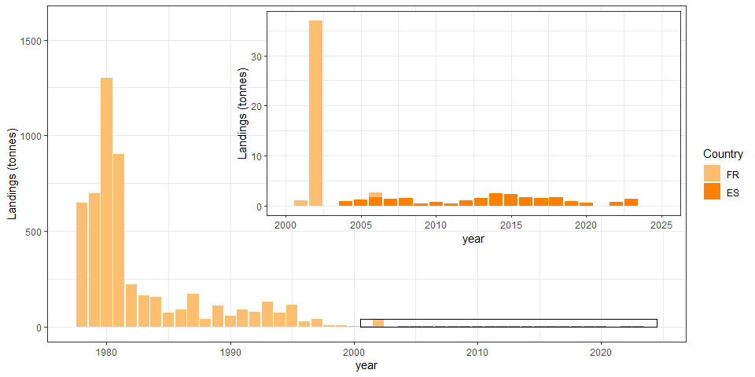
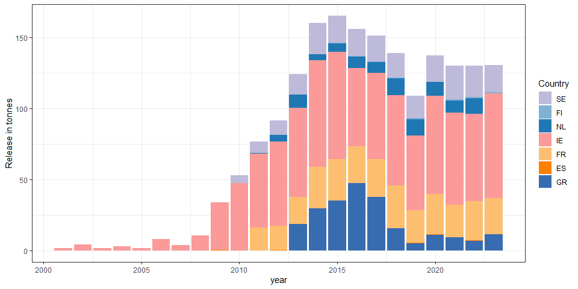

\newline


 


 


# Key numbers

### Glass eel landings
Glass eel commercial fisheries within the EU in  2023  =  54.03  t  countries where data were reported:  PT,ES,FR,GB <br>Glass eel commercial fisheries within the EU in  2024  =  56.08  t  countries where data were reported:  PT,FR,ES,GB <br>Mean glass eel commercial fisheries for the previous 5 years ( 2018 - 2022 ) within the EU =  59.51  t 
\newline

### Yellow and Silver com eels landings
Yellow and Silver eel commercial fisheries within the EU (Y, S, YS) in  2022  =  2366.48  t.  Number of countries reporting:  23 <br>Yellow and Silver eel commercial fisheries within the EU (Y, S, YS) in  2023  =  2027.22  t.  Number of countries reporting:  21 <br>Mean Yellow and Silver eel commercial fisheries for the previous 5 years ( 2017 - 2021 ) within the EU =  2615.344  t. <br> <br>Reconstructed Yellow and Silver eel commercial fisheries within the EU (Y, S, YS) in  2022  =  2377.1  t. <br>Reconstructed Yellow and Silver eel commercial fisheries within the EU (Y, S, YS) in  2023  =  2151.38  t. <br>Mean Reconstructed Yellow and Silver eel commercial fisheries for the previous 5 years ( 2017 - 2021 ) within the EU =  2621.852  t.<br>


### Glass eel recreational landings

Glass eel recreational fisheries within the EU in  2023  =  1.32  t  countries where data were reported:  ES <br>Glass eel recreational fisheries within the EU in  2024  =    t  countries where data were reported:   <br>Mean glass eel recreational fisheries for the previous 5 years ( 2018 - 2022 ) within the EU =  0.9925  t. <br>


### Yellow and Silver eel recreational landings

Yellow and Silver eel recreational fisheries within the EU (Y, S, YS) in  2022  =  551.06  t.  Number of countries reporting:  15 <br>Yellow and Silver eel recreational fisheries within the EU (Y, S, YS) in  2023  =  86  t.  Number of countries reporting:  10 <br>Mean Yellow and Silver eel recreational fisheries for the previous 5 years ( 2017 - 2021 ) within the EU =  520.612  t. <br> <br>

### Aquaculture

Eel aquaculture within the EU in  2022  =  4994.92  t  countries where data were reported:  PT,SE,NL,GR,DK,DE,IT,ES,PL <br>Data is shown until 2022 due to delayed reporting. Mean aquaculture for the previous 5 years ( 2017 - 2021 ) within the EU =  5076.632  t <br>

### Release

Number of glass eels (G, QG) released in  2022  =  47.99 millions , Number of countries reporting:  11 <br>Number of glass eels (G, QG) released in  2023  =  21.8 millions , Number of countries reporting:  12 <br>Number of glass eels (G, QG) released in  2024  =  0 millions probably incomplete , Number of countries reporting:  0 <br>Number of yellow eels (Y) released in  2023  =  0.37 millions , Number of countries reporting:  2 <br>Number of yellow eels (Y) released in  2022  =  0.37 millions , Number of countries reporting:  3 <br>Number of silver eels (S) released in  2023  =  0.35 millions , Number of countries reporting:  5 <br>Number of silver eels (S) released in  2022  =  0.35 millions , Number of countries reporting:  7 <br><br>


Quantity of glass eels (G, QG) released in  2022  =  15.96 t , Number of countries reporting:  11 <br>Quantity of glass eels (G, QG) released in  2023  =  8.94 t , Number of countries reporting:  12 <br>Quantity of glass eels (G, QG) released in  2024  =  0 t probably incomplete , Number of countries reporting:  0 <br>Quantity of yellow eels (Y) released in  2023  =  0.84 t , Number of countries reporting:  1 <br>Quantity of yellow eels (Y) released in  2022  =  0.84 t , Number of countries reporting:  2 <br>Quantity of silver eels (S) released in  2023  =  130.24 t , Number of countries reporting:  5 <br>Quantity of silver eels (S) released in  2022  =  129.99 t , Number of countries reporting:  7 <br><br>


# Trend in fisheries

This section presents and describes data from commercial, recreational
and non-commercial fisheries, aquaculture production and restocking of eel. Data
can be reported by eel life stage (glass, yellow, silver), habitat type
(freshwater, transitional, coastal, marine), and by eel management unit (EMU)
where possible. Historical series for which these details are not available are
reported by country. The current database structure allows aggregation by
country or EMU. The landings data presented are those reported to the
WGEEL through responses to Data calls. 

## Commercial fisheries landings

Care should be taken with the interpretation of the landings as indicators
of the stock, since the catch statistics now reflect the status of reduced
activity as well as of stock levels. In summary, reported commercial landings
are declining from a level of around 10,000 t in
the 1960s to
2081 tonnes (glass eel + yellow eel + silver eel) in 2023.

#### Glass eel


Figure <a href="#fig:comlandGfig">1</a> presents the time-series up to and including
2024 for total commercial glass eel landings as reported by 5 countries in
the Eel Data call (GB, FR, ES, PT, IT) and Figure <a href="#fig:corrComGfig">2</a> presents the time-series including reconstructed data to fill data gaps. 

Glass eel landings show a sharp decline since 1980 from 2,000 t to around
40–60 t since 2009 onwards. In 2024, the raw (uncorrected) landings
data for glass eels is 56.1 t, while it was 54 t in 2023 (Annex XXX Table
XXX for raw data and Table XXX for raw and corrected data). 


\newline


    


#### Yellow and silver eel 

Figure <a href="#fig:rawComLandYSfig">3</a> presents aggregated landings data for yellow and silver eels coming from 23 countries and Figure <a href="#fig:corrComYS">4</a>
presents the time-series including reconstructed data to fill the gaps. The
proportion of "corrected" landings was as high as 50% in the 1950s, but rather
low since the mid-1980s. The total landings (including reconstructed) of yellow
and silver eels decreased from 18,000–20,000 t in the 1950s to 2,000–3,500 t
since 2009. Reported landings from yellow and silver eel commercial fisheries
(Y, S, YS) add up to 2027 t in 2023 and 2366t in 2022 (Number
of countries reporting 21). Yellow and silver eel commercial
fisheries averaged 2615 t over the five previous years (from
2017 to 2021).


\newline


![<span id="fig:rawComLandYSfig"></span>Figure 3: Time-series of reported commercial yellow (Y), silver (S) and yellow-silver (YS) eel fishery landings (tonnes) 1908-2023 by country, Norway(NO), Greece(GR), Finland(FI), France(FR), Tunisia(TN), Denmark(DK), Lithuania(LT), Germany(DE), Italy(IT), Ireland(IE), Poland(PL), Netherlands(NL), Croatia(HR), Libya(LY), Estonia(EE), Algeria(DZ), Sweden(SE), Turkey(TR), United Kingdom(GB), Albania(AL), Spain(ES), Latvia(LV), Belgium(BE), Morocco(MA), Slovenia(SI), Portugal(PT) are included, combining information from the Data call2024and the WGEEL database updated to2023](Updated_20240927_afternoon_automatic_tables_graphs_earlier_files/figure-docx/rawComLandYSfig-1.png)


![<span id="fig:corrComYS"></span>Figure 4: Time-series of reported commercial yellow (Y), silver (S) and yellow-silver (YS) eel fishery landings (tonnes) by country and a reconstruction of the non-reported countries/years combinations. Norway(NO), Greece(GR), Finland(FI), France(FR), Tunisia(TN), Denmark(DK), Lithuania(LT), Germany(DE), Italy(IT), Ireland(IE), Poland(PL), Netherlands(NL), Croatia(HR), Libya(LY), Estonia(EE), Algeria(DZ), Sweden(SE), Turkey(TR), United Kingdom(GB), Albania(AL), Spain(ES), Latvia(LV), Belgium(BE), Morocco(MA), Slovenia(SI), Portugal(PT) are included, combining information from the Data call 2024 and the WGEEL database updated to 2023 The inset box shows the proportion of reconstructed landings per year](Updated_20240927_afternoon_automatic_tables_graphs_earlier_files/figure-docx/corrComYS-1.png)


## Recreational fisheries

Figure <a href="#fig:recLandGfig">6</a> presents data available to the WGEEL on
recreational landings for glass eel from Spain and France. Recreational fisheries for glass eel were banned in in France in 2010. In Spain it was banned in 2023, in agreement with the 2023 EU Council Regulation 2023/194 and 2023/195, which banned all recreational fisheries in marine areas. The EU Council ban was continued in 2024 by Council Regulation 2024/257 and 2024/259. In the Mediterranean, all recreational fisheries in all habitats were banned since 2024 by EU Council Regulation 2023/2124. In some countries, recreational fisheries in freshwater were also banned through local regulations (e.g. UK, Portugal, Sweden, Norway).

Figure <a href="#fig:recLandYSfig">5</a> presents the data available on recreational
landings of yellow and silver eel combined. Recreational landings for yellow
and silver eel combined were 551.06 t for 2022 (15 countries
reporting) and 86 t for 2023  (10 countries
reported). France has provided estimation for all freshwater recreational fisheries
in 2006, while for other years, France provided declared catch by recreational
fishers with gear in public rivers. The available data have been considered by
the WGEEL jointly with the other series in Europe. The mean yellow and silver
eel recreational fisheries for the previous five years (2017–2021) was
520.612 t. The data for 2023 is provisional and may change since 
some countries does not report the landings annually (e.g. Germany).


\newline


\newline


\newline




\newline


## Illegal, unreported and unregulated landings

Illegal, unreported, and
unregulated fishing (IUU) is by its nature very difficult to quantify, and
misreporting may therefore be substantial. Organised illegal glass eel trade is
supplied by legally caught and IUU caught eel. This trade is considered high
priority by Europol (the European Union’s law enforcement agency) among
environmental crimes, due to its eco-nomic significance, the poor status of the
eel stock, and the large number of organisations affected. Related police action
and court decisions have been covered by many news reports during recent years.
In addition, illegal eel trade from range states is an issue of concern for
CITES (CITES, 2023). To summarize, while IUU fisheries certainly exist for
glass, yellow and silver eel, there are insufficient data available to quantify
their effect on the total stock size or status with any level of certainty. Thus, efforts to improve traceability (and better understanding of demand) will assist enforcement but also allow us to better understand what proportion of legal catch enters illegal trade, and thus estimate illegal catch which would be useful to informing characterization of the impacts of all fisheries on the stock.


## Releases 

Data have been reported on restocking which includes eels released at the glass eel
phase, either directly (G), or after a quarantine (QG), after a period of some
months of growth in aquaculture (OG), at the yellow eel (Y) or silver eel (S)
stage.There are also some releases of mixed life stages: Glass + Yellow eel (G+Y) and Yellow + Silver eel (Y+S) for Ireland and Spain, but they will not be presented in this report (see country reports for more details). To futher complicate the matter, displacements of eel can range from a
few meters within the same waterbody (i.e. assisted migration to bypass an
obstacle), to eel being moved between waterbodies and/or EMUs. There are still
inconsistencies and variations in how countries report these displacements.
Therefore, the WGEEL broadly categorizes them as "releases". 

### Glass eel releases (G + QG)

Restocking of glass eel (G + QG) peaked during 1980s and was followed by a decline to a low level in 2009
(Figure <a href="#fig:releasekgGQGf">7</a>). The amount of
restocked glass eels has increase since 2010 with high numbers in 2014, and from 2018 to 2022, when the lower market prices guaranteed a larger number of glass eels could
be purchased for fixed restocking budgets. The quantity of glass eels (G + QG)
released in 2022 and 2023 was 15.96 and 8.94  tonnes
(Number of countries reporting: 11 and 12).


\newline


\newline


\newline


![<span id="fig:releasekgGQGf"></span>Figure 7: Reported releases of glass eel (G + QG, in tonnes) per country Ireland(IE), United Kingdom(GB), Estonia(EE), Netherlands(NL), Germany(DE), Latvia(LV), Lithuania(LT), Sweden(SE), Italy(IT), Poland(PL), Finland(FI), Spain(ES), Greece(GR), France(FR), Belgium(BE). Inset shows years since 2009 in greater resolution. 2024 and 2023 are provisional data (data are missing from 2024 because not all the countries have reported yet and from 2023 because German data have not been reported yet).](Updated_20240927_afternoon_automatic_tables_graphs_earlier_files/figure-docx/releasekgGQGf-1.png)


\newline


[**********move the figures related to other landings to the annex]


\newline


\newline

#*************************************************************************

#[remove this section, QG are now reported together with G]
#Only Sweden and Finland have reported quarantined glass eel restocking.
#Quarantined glass eel restocking peaked in the 1990s, decreased in the early
#2000s and increased again after the implementation of the Eel Regulation.

#*************************************************************************


\newline


### Ongrown eel (OG) and yellow eel (Y) releases


\newline

Releases of ongrown eels are presented in Figure <a href="#fig:releaseOGf">9</a>. It has constantly increased since 2000 and reached
a maximum in 2022 (Figure <a href="#fig:releaseOGf">9</a> <!--<a href="#fig:releasekgOGf"><strong>??</strong></a>-->
).

Releases of yellow eel are represented in Figures <a href="#fig:releasekgYf">8</a>. The quantity of yellow eels (Y) released in 2022 and 2023 was 2.44
and 0.84 tonnes (Number of countries reporting: 2 and
1). 
 


\newline


\newline


\newline


\newline


\newline


\newline


\newline


### Silver eel releases

A certain percentage  of silver eels caught by the fishery, and therefore recorded as landings, are later released in the Mediterranean outside the lagoons in Greece (30% of caught silver eels) and France. These are reported as released silvers (Figure <a href="#fig:releasekgSf">10</a>. Spain has made anecdotal releases of silver eels from farms. The quantity of silver eels (S) released in  2022 and
2023 is  129.99 and 130.24 tonnes (Number of countries
reporting: 7 and 5).


\newline





\newline


\newline


\newline

## Other landings

All other landings, coming neither from professional or recreational fisheries were recorded separately. Most of them concern translocation within an EMU to mitigate the impact of barriers to migration. Glass eel translocations (Annex XX). were only reported by Ireland (since 1959, by numbers and mass) and the United King-dom (since 1996, by mass only). Yellow eel translocations were only reported in Sweden and Ireland (Annex XX) and silver eel translocations in 5 countries: mainly in Sweden, Ireland and Finland, and to a lesser extend in Netherlands and Spain (Annex XX).  


\newline

### Release all stage (remove me)


\newline

# 	Aquaculture

All aquaculture for eel currently depends upon wild eel for seeding. Aquaculture
production data are derived from responses to the data call 2024.
Aquaculture production increased from the 1980s, peaking in 2004 at just under
8,600 t. Since then it has steadily declined to approximately 4994.92 t by
2022 countries reporting: `raqua_cou_CY2`)(Figure <a href="#fig:aquaf">11</a>).
The mean aquaculture production for the
5-year period (2017-2021) is 5076.632 t.
Lithuania had one farm in operation from 2017 to 2023 and cannot report production 
for that period due to confidentiality. Estonia has a similar situation, with less 
than 3 eel farms since 2018.


\newline


\newline


# tables


Table: <span id="tab:comLandGt"></span>Table 1: Table 1:  Glass eel commercial fisheries landings (in tonnes) from 1984 to 2024, reported by countries: GB United Kingdom, FR France, ES Spain, PT Portugal, IT Italy.

Year   GB     FR     ES      PT     IT    total  
-----  -----  -----  ------  -----  ----  -------
1945                 119.2                119.2  
1946                 71.9                 71.9   
1947                 100.1                100.1  
1948                 110.6                110.6  
1949                 9.3                  9.3    
1950                 3.8                  3.8    
1951                 2.1                  2.1    
1953                 2.5                  2.5    
1954                 5.9                  5.9    
1955                 0.9                  0.9    
1956                 0.9                  0.9    
1957                 2.8                  2.8    
1958                 0.4                  0.4    
1959                 6.6                  6.6    
1960                 9.5                  9.5    
1961                 16.7                 16.7   
1962                 11.1                 11.1   
1963                 8                    8      
1964                 11                   11     
1965                 4                    4      
1966                 6                    6      
1967                 5                    5      
1968                 4                    4      
1969                 4                    4      
1970                 5                    5      
1971                 1                    1      
1972   16.7          1                    17.7   
1973   28.2          1                    29.2   
1974   57.5          2       1.6          61.1   
1975   10.5          2.6     5.6          18.7   
1976   13.1          11.6    12.5         37.2   
1977   38.6          17.5    22.6         78.7   
1978   61.2   1393   21.6    7.3          1483.1 
1979   67     1850   17.3    8.8          1943.1 
1980   40.1   1491   15.4    10.1         1556.6 
1981   36.9   890    13      18           957.9  
1982   48     866    19.3    22.2         955.5  
1983   16.9   791    10.3    6.7          824.9  
1984   25     528    16.4    16.1         585.5  
1985   20     444    18.3    14.8         497.1  
1986   19     423    6.4     7            455.4  
1987   21.3   461    9.4     9.5          501.2  
1988   21.4   504    9.9     2.6          537.9  
1989   20.6   410    9.9     2.8          443.3  
1990   20.9   325    5.3     4.5          355.7  
1991   1.1    179    6.8     2.8          189.7  
1992   5      183    3.7     4.5          196.2  
1993   5.7    329    5.2     3.6          343.5  
1994   9.5    329    2.4     2.9          343.8  
1995   11.9   413    4.9     5.3          435.1  
1996   18.8   262    14.5    8.7          304    
1997   8.7    287    12      4.4          312.1  
1998   11.2   195    14.1    4.5          224.8  
1999          242    13.9    3.6          259.5  
2000          206    11      3            220    
2001   0.8    101    12      1.1          114.9  
2002   0.5    202    8.6     0.8          211.9  
2003   1.7    151    10      1.4          164.1  
2004   1      89     5.1     0.8          95.9   
2005   1.7    89     6.4     1.2          98.3   
2006   1.3    67     4.1     2.7          75.1   
2007   2.1    77     5.2     0.9          85.2   
2008   0.8    79     5.1     0.8          85.7   
2009   0.3           3.7     1.4          5.4    
2010   1.3    41     6.5     2.4          51.2   
2011   2.3    31.3   5.2     1.1          39.9   
2012   2.8    34.3   5.3     0.8          43.2   
2013   5.9    33.6   7.2     1.1          47.8   
2014   12     35.3   11.3    1.2    0.4   60.2   
2015   2.8    36.1   8.8     1.3    0.2   49.2   
2016   4      46.4   6.6     0.4    0.1   57.5   
2017   3.3    43.2   11.1    2.2    0.1   59.9   
2018   4.2    53.4   4.5     1      0.2   63.3   
2019   6.6    50     4.3     0.6    0.2   61.7   
2020   3.4    48.7   6.3     0.9          59.3   
2021   0.1    46.6   4.5     1.2          52.4   
2022   1.1    53.9   4.7     0.9          60.6   
2023   0.9    49     3.6     0.5          54     
2024   1.4    50.9   3.3     0.5          56.1   


Table: <span id="tab:rawComLandYSt"></span>Table 2: part a  Commercial fisheries landings (in tonnes) for yellow eel and silver eel from 1908 to 2023 (part 1), reported by countries : Albania(AL), Belgium(BE), Germany(DE), Denmark(DK), Algeria(DZ), Estonia(EE), Spain(ES), Finland(FI), France(FR), United Kingdom(GB), Greece(GR) (to be continued for other countries in next table).

Year   AL   BE    DE       DK      DZ     EE      ES      FI    FR       GB      GR    
-----  ---  ----  -------  ------  -----  ------  ------  ----  -------  ------  ------
1908                                                                                   
1909                                                                                   
1910                                                                                   
1911                                                                                   
1912                                                                                   
1913                                                                                   
1914                                                                                   
1915                                                                                   
1916                                                                                   
1917                                                                                   
1918                                                                                   
1919                                                                                   
1920                       3413                                                        
1921                       3443                                                        
1922                       3760                                                        
1923                       3396                                                        
1924                       4130                                                        
1925                       4880                                                        
1926                       4726                                                        
1927                       4648                                                        
1928                       4117                                                        
1929                       4375                                                        
1930                       4773                                                        
1931                       4195                                                        
1932                       5088                                                        
1933                       5014                                                        
1934                       5171                                                        
1935                       4316                                                        
1936                       4332                                                        
1937                       4329                                                        
1938                       3849                                                        
1939                       4662                                                        
1940                       3709                                                        
1941                       3717                                                        
1942                       3140                                                        
1943                       3917                                                        
1944                       4245                                                        
1945                       4169                                                        
1946                       4269                                                        
1947                       4784                                                        
1948                       4386                                                        
1949                       4492                                                        
1950                       4500                                                        
1951                       4400                   90                                   
1952                       3900                   102.2                                
1953                       4300                   80.2                                 
1954                       3800                   97.7                                 
1955                       4800                   102.9                                
1956                       3700                   106.1                                
1957                       3600                   80                                   
1958                       3300                   115                                  
1959                       4000                   100                                  
1960                       4937                   98                     771.7         
1961                       4110                   153.8                  768.4         
1962                       4122                   114.9                  696.1         
1963                       4166                   136.9                  787.8         
1964                       3505           3       91.5                   548.9         
1965                       3402           0.3     130.4                  783.8         
1966                       3901           1.9     191.5                  881     14.9  
1967                       3679           2.7     163.8                  568.7   19    
1968                       4476           2.9     175.6                  585.6   4.9   
1969                       3878           49      136.4                  605.6   2.9   
1970                       3558           61.5    119.4                  752.1   0     
1971                       3378           59.5    107.4                  842.2   0     
1972                       3429           73.4    119.4                  632.6   4.3   
1973                       3656           69      100.2                  723.2   15.5  
1974                       2977           51.1    93.4                   765     129.8 
1975                       3485           82.1    78                     762.2   133.8 
1976                       3054           71.6    82.7                   621.7   158.7 
1977                       2502           65.8    79.9                   690.5   89.2  
1978                       2492           63.2    67                     823.6   225.3 
1979                       1904           28.5    96.8                   1045    185.5 
1980                       2288           25.7    89.8                   912.2   226.9 
1981                       2227           21.9    97.7                   907.1   250.6 
1982                       2541           13.9    19.9                   942.5   255.2 
1983                       2119           28.8    18.4                   866.4   200.8 
1984                       1871           72.2    11                     973.4   285.4 
1985              1096.7   1630           75.1    16.5                   750     189.6 
1986              1118.7   1672           61.1    13.4          1944     650.8   151.6 
1987              1031     1279           66.7    21.2          2062     684.1   266.3 
1988              1018     1878           109.7   13.9          2265     933.6   268.1 
1989              963.6    1696           54.8    5.3           1746     874.7   155.6 
1990              829.7    1675           61.3    8.7           1778     783.9   194.2 
1991              724.7    1465           52.4    49.8          1645     736.9   209.4 
1992              761.7    1451           39.4    54.3          1321     715.4   184.8 
1993              790.1    1080           59.2    66.5          1280     670.7   181.9 
1994              833.1    1200           46.9    50.7          1280     777.8   200.5 
1995              777.9    892            45.4    69.4          1280     899.6   201.4 
1996              603      751.5          55.1    61.7          1280     805.2   151.3 
1997              616.2    797            59.1    61.5          1223     730.7   136.5 
1998              566.9    597            44.2    43.6          1150     693.4   87.6  
1999              645.1    717     20.4   64.8    48.3          1005     667.8   80.7  
2000        2.9   591.2    628     17.2   67      55.3          1008.8   587.2   88.1  
2001        2.9   569      707     44.5   67      130.2         1024.1   582.7   93.4  
2002        2.9   543.9    614     25.4   49.9    105.6         30.4     551.1   136.3 
2003        2.9   497.9    648     25.2   48.6    95.6          21.4     552.3   76.5  
2004        2.9   475.3    546     29     39.2    85.3          12.5     471.7   58.1  
2005        2.9   454.8    534     7.6    30.7    88            7.8      477.2   116.1 
2006              472.2    596     2.7    33.4    115.6         15       383.5   77.1  
2007              423.6    537     14.6   31.1    82.1          26.1     450.4   89.7  
2008              352.8    466     13.9   30.6    65.6    1     31.4     400.6   71.1  
2009              311.6    467     14.2   22.1    89.2    1.8   42       462.4   78.5  
2010              318.5    422     3.4    18.9    76.1    2.3   20.2     461.1   58.6  
2011              287      370            16.2    61.6    1.5   368      455.9   83.2  
2012              246.9    317     0.4    17.7    85.4    1.5   472.6    415.1   55.2  
2013   47         265.9    356     3      17.4    86.7    1.3   504.1    426.5   38    
2014   43         231.1    346     6      16.7    91.6    1     434.4    392.8   58.3  
2015   50         213.7    282     3      14.2    63.7    0.6   356.9    341     60.2  
2016   41         208.8    265     2      15.2    83      1.3   442.6    347.2   60.9  
2017   47   0     244.3    257.3   10.6   15.7    76.7    1.1   434.1    321.8   48.3  
2018   60         228.6    181.8   33     18.3    64.1    1.1   617.4    366.9   42.8  
2019   70         209.7    183.3   25.2   21.7    57.6    0.4   309.6    295.6   20.4  
2020   40         228.9    182.2   18     38.8    81.7    0.4   347.4    182.2   27.9  
2021   22         223.4    233.7   4.7    47.9    69.6    0.4   309.4    244     19.2  
2022   17         207.8    163.1   7.6    52.4    66.1    2.3   376.2    166.7   17.5  
2023   20                  125.2   3.4    59.5    69.5          308.4    104.7   19.4  


Table: <span id="tab:rawComLandYSt"></span>Table 2: part b  Commercial fisheries landings (in tonnes) for yellow eel and silver eel from 1908 to 2023 (part 2), reported by countries : Croatia(HR), Ireland(IE), Italy(IT), Lithuania(LT), Latvia(LV), Libya(LY), Morocco(MA), Netherlands(NL), Norway(NO), Poland(PL), Portugal(PT) (to be continued for other countries in next table).

Year   HR    IE      IT      LT     LV     LY    MA   NL      NO      PL       PT   
-----  ----  ------  ------  -----  -----  ----  ---  ------  ------  -------  -----
1908                                                          268.1                 
1909                                                          326.6                 
1910                                                          303.1                 
1911                                                          383.8                 
1912                                                          187.3                 
1913                                                          212.7                 
1914                                                          282                   
1915                                                          143                   
1916                                                          117                   
1917                                                          44                    
1918                                                          35                    
1919                                                          64                    
1920                                                          80                    
1921                                                          79                    
1922                                                          94                    
1923                                                          140                   
1924                                                          290                   
1925                                                          325                   
1926                                                          341                   
1927                                                          354                   
1928                                                          325                   
1929                                                          425                   
1930                                                          450                   
1931                                                          329                   
1932                                                          518                   
1933                                                          694                   
1934                                                          674                   
1935                                                          564                   
1936                                                          631                   
1937                                                          603                   
1938                                                          526                   
1939                                                          434                   
1940                                                          143                   
1941                                                          174                   
1942                                                          131                   
1943                                                          136                   
1944                                                          150                   
1945                                                  2668    102                   
1946                                                  3492    167                   
1947                         8      10                4502    268                   
1948                         14     10                4799    293                   
1949                         21     50                3873    214                   
1950                         29     10                4152    282                   
1951                         32     10                3661    312                   
1952                         39     10                3978    178                   
1953                         80     20                3157    371                   
1954                         147    20                2085    327     609           
1955                         163    40                1651    451     732           
1956                         131    20                1817    293     656           
1957                         168    20                2509    430     616           
1958                         149    20                2674    437     635           
1959                         155    24                3413    409     566           
1960                         165    37                2999    430     733           
1961                         139    43                2452    449     640           
1962                         155    41                1443    356     663           
1963                         260    56                1618    503     762           
1964                         225    37                2068    440     884           
1965                         125    35                2268    523     682           
1966                         238    33                2339    510     804           
1967                         153    39                2524    491     906           
1968                         165    28                2209    569     943           
1969                 2469    134    36                2389    522     935           
1970         200     2300    118    29                1111    422     847           
1971         200     2113    124    29                853     415     722           
1972         200     1997    126    25                857     422     696           
1973         91      588     120    27                823     409     644.7         
1974         67      2122    86     20                840     368     691.1         
1975         79      2886    114    19                1000    407     809.7         
1976         150     2596    88     24                1172    386     760.5         
1977         108     2390    68     16                783     352     867.8         
1978         76      2172    70     18                719     347     910.4         
1979         110     2354    57     21                530     374     978.9         
1980         75      2198    45     9                 664     387     1214          
1981         94      2270    27     10                722     369     943.5         
1982         144     2025    28     12                842     385     911.3         
1983         117     2013    23     9                 937     324     868           
1984         88      2050    27     12                691     310     819.4         
1985         87      2135    29     18                679     352     1022.5        
1986         87      2134    32     19                721     272     920.7         
1987         230     2265    20     25                538     282     886.6         
1988         215     2027    23     15                425     513     943.3         
1989         400     1243    21     13                526     313     812.8    13.5 
1990         256     1088    19     13                472     336     768.1    13   
1991         245     1097    16     14                573     323     669.7    23.5 
1992         234     1084    12     17                548     372     638.2    29.7 
1993         260     782     10     19                293     340     568      33.9 
1994         300     771     12     19                330     472     635.1    26.6 
1995                 1047    9.4    38                354     454     641.9    23.7 
1996                 953     8.6    24                300     353     629      25.6 
1997                 727     10.7   25                285     467     526      24.7 
1998                 666     17.1   30                323     331     544.4    23.3 
1999         250     634     17.9   26                357     447     599.1    23.1 
2000         250     588     22     13.7              370.1   281     443.6    21.8 
2001         98      520     23     17.4              439.5   304     434.5    15   
2002         123     415     25.6   9.6               370.2   311     372.9    26.9 
2003         111     446     23.5   10.3              309.8   240     365.5    10.6 
2004         136     379     32     11.3              310.2   237     337.2    8.8  
2005         101     75      44.6   10.3              255.2   249     219.9    7    
2006         133     56      31.6   7.9               240.3   293     184.4    10.1 
2007         114     277     29.8   9.6               197     194     180.7    10.5 
2008         108.3   56      27     12.9              147.6   211     159.7    7    
2009         0       289.9   17.2   4.9               108     69      160.6    8.2  
2010         0       225.1   37.6   8.9               445     32      173.2    11   
2011         0       149.7   22.6   6                 370.6   0       118.8    5.9  
2012         0       142.4   15.8   6.3               351.7   0       119.3    3.8  
2013         0       129.8   28.4   4.7          23   318.9   0       137.4    2.7  
2014   0.5   0       144.4   15.4   4.4          23   320.3   0       116.8    3.3  
2015   0.1   0       129.2   11.8   5.2          4    293     0       102.4    2.9  
2016   0.6   0       166.9   28.4   4.2          7    312.5   3       138.4    2.4  
2017   0.6   0       165     24.3   8.6          2    421.3   10.9    172.6    1.5  
2018   0.6   0       121.9   20.3   5.8          2    476.9   3.4     146.5    3.6  
2019   0.4   0       126.6   4.6    6.1    1.3        484     4       167.5    1.9  
2020   0.4   0       95.7    6.8    6.7    1.9        475.5   4       103.6    3.2  
2021   0.4   0       82.9    9.9    6.4    0.2        523.7   5       126.6    2.4  
2022   0.5   0       112.5   11.6   6.1    2.1        538.1   4       115.3    1.7  
2023   0.5   0       85.8    6.3    5      0.9        456.3   5       192.8    2.8  


Table: <span id="tab:rawComLandYSt"></span>Table 2: part c  Commercial fisheries landings (in tonnes) for yellow eel and silver eel from 1908 to 2023 (part 3), reported by countries : Netherlands(NL), Norway(NO), Poland(PL), Portugal(PT), Sweden(SE), Slovenia(SI), Tunisia(TN), Turkey(TR), total.

Year   NL      NO      PL       PT     SE       SI    TN      TR      total   
-----  ------  ------  -------  -----  -------  ----  ------  ------  --------
1908           268.1                                                  268.1   
1909           326.6                                                  326.6   
1910           303.1                                                  303.1   
1911           383.8                                                  383.8   
1912           187.3                                                  187.3   
1913           212.7                                                  212.7   
1914           282                     1460.6                         1742.6  
1915           143                     996.9                          1139.9  
1916           117                     1078.2                         1195.2  
1917           44                      1283.6                         1327.6  
1918           35                      884.4                          919.4   
1919           64                      1145.4                         1209.4  
1920           80                      969.6                          4462.6  
1921           79                      1072.4                         4594.4  
1922           94                      925.9                          4779.9  
1923           140                     947.7                          4483.7  
1924           290                     1201.1                         5621.1  
1925           325                     1714.2                         6919.2  
1926           341                     1707.3                         6774.3  
1927           354                     2011.5                         7013.5  
1928           325                     1040.1                         5482.1  
1929           425                     1393.7                         6193.7  
1930           450                     1528.8                         6751.8  
1931           329                     1531.4                         6055.4  
1932           518                     1723.7                         7329.7  
1933           694                     1546.2                         7254.2  
1934           674                     1844.9                         7689.9  
1935           564                     1950.9                         6830.9  
1936           631                     1654.5                         6617.5  
1937           603                     1725.1                         6657.1  
1938           526                     1870.5                         6245.5  
1939           434                     1774.4                         6870.4  
1940           143                     1625.7                         5477.7  
1941           174                     1629                           5520    
1942           131                     1131.6                         4402.6  
1943           136                     1546                           5599    
1944           150                     2001.6                         6396.6  
1945   2668    102                     1673.4                         8612.4  
1946   3492    167                     1516.6                         9444.6  
1947   4502    268                     1914.4                         11486.4 
1948   4799    293                     1866.5                         11368.5 
1949   3873    214                     1902                           10552   
1950   4152    282                     2192                           11165   
1951   3661    312                     1933                           10438   
1952   3978    178                     1600                           9807.2  
1953   3157    371                     2381                           10389.2 
1954   2085    327     609             2113                           9198.7  
1955   1651    451     732             2656                           10595.9 
1956   1817    293     656             1537                           8260.1  
1957   2509    430     616             2228                           9651    
1958   2674    437     635             1757                           9087    
1959   3413    409     566             2797                           11464   
1960   2999    430     733             1648                           11818.7 
1961   2452    449     640             2079                           10834.2 
1962   1443    356     663             1911                           9502    
1963   1618    503     762             2107                           10396.7 
1964   2068    440     884             2304                           10106.4 
1965   2268    523     682             1823                           9772.5  
1966   2339    510     804             1975                           10889.3 
1967   2524    491     906             1623                           10169.2 
1968   2209    569     943             1817                           10976   
1969   2389    522     935             1690                   342     13188.9 
1970   1111    422     847             1209                   441     11168   
1971   853     415     722             1391                   460     10694.1 
1972   857     422     696             1204                   220     10005.7 
1973   823     409     644.7           1212                   315     8793.6  
1974   840     368     691.1           1034                   588     9832.4  
1975   1000    407     809.7           1391                   448     11694.8 
1976   1172    386     760.5           935                    499     10599.2 
1977   783     352     867.8           989                    282     9283.2  
1978   719     347     910.4           1076                   283     9342.5  
1979   530     374     978.9           954                    396     9034.7  
1980   664     387     1214            1112                   224     9470.6  
1981   722     369     943.5           887                    374     9200.8  
1982   842     385     911.3           1161     0.8           424     9705.6  
1983   937     324     868             1212     0.7           588     9325.1  
1984   691     310     819.4           963      1.2           616     8790.6  
1985   679     352     1022.5          1029     2.5           583     9694.9  
1986   721     272     920.7           841.1    2.7           517     11158.1 
1987   538     282     886.6           718.1    1.6           543     10919.6 
1988   425     513     943.3           965.5    1.5           756     12370.6 
1989   526     313     812.8    13.5   928.4    1.3           472     10240   
1990   472     336     768.1    13     941.6    1.9           230     9469.4  
1991   573     323     669.7    23.5   1084.4   1.4           262     9192.2  
1992   548     372     638.2    29.7   1181.8   0.1           245     8889.4  
1993   293     340     568      33.9   1145.9   0.1           261     7841.3  
1994   330     472     635.1    26.6   1297.7   0.7           329     8582.1  
1995   354     454     641.9    23.7   971.4    0             390     8095.1  
1996   300     353     629      25.6   1053.3   0             342     7396.3  
1997   285     467     526      24.7   1073.4   0             400     7162.8  
1998   323     331     544.4    23.3   649.3    0             300     6066.8  
1999   357     447     599.1    23.1   701.6                  200     6504.8  
2000   370.1   281     443.6    21.8   532      0     109.9   176     5853.8  
2001   439.5   304     434.5    15     643.2    0     144.1   122     5981.5  
2002   370.2   311     372.9    26.9   666.7    0     204.4   147     4731.8  
2003   309.8   240     365.5    10.6   628.6          171.7   158     4443.4  
2004   310.2   237     337.2    8.8    613.6          132.5   165     4082.6  
2005   255.2   249     219.9    7      714.2    0     197     176     3768.3  
2006   240.3   293     184.4    10.1   771.2    0     266.3   162     3851.3  
2007   197     194     180.7    10.5   761.9    0     296.5   179     3904.6  
2008   147.6   211     159.7    7      727      0     316.7   171     3377.2  
2009   108     69      160.6    8.2    519      0     122.2   158     2945.8  
2010   445     32      173.2    11     525.3    0     92.6    182     3113.8  
2011   370.6   0       118.8    5.9    457      0     79.6    28.3    2881.9  
2012   351.7   0       119.3    3.8    336.5    0     55      38      2680.6  
2013   318.9   0       137.4    2.7    356.5    0     149.6   48.2    2945.1  
2014   320.3   0       116.8    3.3    302      0     83.6    56      2690.6  
2015   293     0       102.4    2.9    228.7    0     81.4    71      2315    
2016   312.5   3       138.4    2.4    261.8    0     250.4   75      2717.6  
2017   421.3   10.9    172.6    1.5    227.7          153     81      2725.4  
2018   476.9   3.4     146.5    3.6    231.6          166.3   111     2903.9  
2019   484     4       167.5    1.9    156.1          107     330     2583    
2020   475.5   4       103.6    3.2    185.5          129.9   232.8   2393.5  
2021   523.7   5       126.6    2.4    166.8          105.3   267.3   2471.2  
2022   538.1   4       115.3    1.7    117.1          105     275.8   2366.5  
2023   456.3   5       192.8    2.8    174.8          105     281.9   2027.2  


Table: <span id="tab:recLandYSt"></span>Table 3: parta,  Recreational fisheries landings (in tonnes) for yellow eel and silver eel from 1980 to 2024 (part 1), reported by countries: Belgium(BE), Czech republic(CZ), Germany(DE), Denmark(DK), Estonia(EE), Finland(FI), Lithuania(LT), Latvia(LV), Netherlands(NL), Poland(PL), Sweden(SE) (to be continued for other countries in next table).

Year   SE       FI   EE    LV    LT    PL     CZ     DE      DK      NL   BE   
-----  -------  ---  ----  ----  ----  -----  -----  ------  ------  ---  -----
1980                                                                           
1981                                                                           
1982                                                                           
1983                                                                           
1984                                                                           
1985                                                 581.6                     
1986                                                 562.8                     
1987                                                 546.3                     
1988                                                 558.5                     
1989                                                 542.5                     
1990                                                 501.3                     
1991                                                 498.1                     
1992                                                 488.5                     
1993                                                 485.6                     
1994   1273.3                                        492.9                     
1995                                                 452.2                     
1996                                                 416.3                     
1997                                                 423.7                     
1998                                                 430.5                     
1999   1218                                          424.8                     
2000                       1.7                       428.9                33.6 
2001                       1.2                       425.9                33.6 
2002                       1.1                       417.3                33.6 
2003                       0.4                       427.9                33.6 
2004   594                 0.7                       413.9                33.6 
2005                 1.7   2.6                       398.1                33.6 
2006   259.9         1     0.3                       399.1                33.6 
2007                 1     0.3                       375.4                33.6 
2008            17   1.1   0.2                       326.4                33.6 
2009                 1.4   0.7                       309.8   108          33.6 
2010            10   1.1   0.3                       276.7   125.5   95   30   
2011                 1     0.4                       272     79.5         30   
2012            5    0.6   0.4   1.4   32.4   17.1   262.3   52.3    77   30   
2013                 0.6   0.7   3     26.7   15.4   265.4   50.3         30   
2014            20   0.5   0.5   1.8   29.5   18.8   270.3   57      46   30   
2015                 0.7   0.5   5     26.5   12.4   270.5   118.3        29.5 
2016            8    0.6   0.2   1.6   34.2   12.4   273.9   164.3   29   29.5 
2017                 0.6   0.5   3     39.7   17.3   275.5   117.1        29.5 
2018            2    0.6   0.2   0.6   45.3   11.5   271.1           13   29.7 
2019                 0.6   0.3   6     42.1   12.3   276     110          29.7 
2020            2    1.1   0.5   1.2   49.8          285.5   98.9    18   29.7 
2021                 0.5   0.3   6.8   65.4          272.9   79           29.6 
2022            5    0.4   0.2         25.9          274.7   160     10   29.5 
2023                       0.1   2.5   33.7                               29.5 
2024                                                         4.1               


Table: <span id="tab:recLandYSt"></span>Table 3: partb,  Recreational fisheries landings (in tonnes) for yellow eel and silver eel from 1980 to 2024 (part 2), reported by countries: Algeria(DZ), Spain(ES), France(FR), Croatia(HR), Ireland(IE), Italy(IT), Libya(LY), Slovenia(SI), Turkey(TR) , total.

Year   IE   FR      ES    IT      SI    HR     TR     LY    DZ    total  
-----  ---  ------  ----  ------  ----  -----  -----  ----  ----  -------
1980                              0                               0      
1981                              0                               0      
1982                              0                               0      
1983                              0                               0      
1984                              0                               0      
1985                              0                               581.6  
1986                              0.1                             562.9  
1987                              0.1                             546.4  
1988                              0.1                             558.6  
1989                              0.1                             542.6  
1990                              0.1                             501.4  
1991                              0.1                             498.2  
1992                              0.1                             488.6  
1993                              0.1                             485.7  
1994                              0                               1766.2 
1995                              0                               452.2  
1996                              0.1                             416.4  
1997                              0.2                             423.9  
1998                              0.1                             430.6  
1999                              0                               1642.8 
2000        20.9                  0                               485.1  
2001        19.9                  0                               480.6  
2002        19                    0                               471    
2003        14.7                  0                               476.6  
2004        16.8                  0                               1059   
2005        12.9                  0                               448.9  
2006        683.9                 0                               1377.8 
2007        14.6                  0                               424.9  
2008        14.9                  0                               393.2  
2009        7.1                   0                               460.6  
2010        4.9           149.5   0                               693    
2011        3.2           60.6    0                               446.7  
2012        4.6           73.6    0                               556.7  
2013        4.7     1     69.7    0                               467.5  
2014        4.3     1     69.8    0                               549.5  
2015        3.5     1     60.2    0     10.1                      538.2  
2016        3.1     0.8   56.8    0     8.9                       623.3  
2017        2.9     0.1   41.3          7.6                       535.1  
2018        3.6     0.9   42.3          6.8                       427.6  
2019        2.3     2.2   33.7          5.7           0.1         521    
2020        2             24.5          5      87.2   0.1         605.5  
2021        3.3           12.6          1.9    41.7   0           514    
2022   0    1.7           17.1          1.3    24.2   0.2   0.9   551.1  
2023   0    3.5           0.8                  8.1    0.1   6     84.3   
2024   0                                                          4.1    


Table: <span id="tab:recLandG"></span>Table 4: Table 4: Raw recreational landings (tonnes) for glass eels   ( 1978 - 2023 )  for  FR,ES.

Year   FR     ES    total 
-----  -----  ----  ------
1978   647          647   
1979   697          697   
1980   1303         1303  
1981   904          904   
1982   219          219   
1983   161          161   
1984   156          156   
1985   71           71    
1986   87           87    
1987   172          172   
1988   40           40    
1989   110          110   
1990   54           54    
1991   87           87    
1992   77           77    
1993   130          130   
1994   74           74    
1995   113          113   
1996   25           25    
1997   39           39    
1998   6            6     
1999   6            6     
2000   2            2     
2001   1            1     
2002   37           37    
2004          0.9   0.9   
2005   0      1.2   1.2   
2006   1      1.7   2.7   
2007   0      1.3   1.3   
2008   0      1.6   1.6   
2009   0      0.4   0.4   
2010   0      0.8   0.8   
2011   0      0.4   0.4   
2012   0      1.1   1.1   
2013   0      1.6   1.6   
2014   0      2.4   2.4   
2015   0      2.3   2.3   
2016   0      1.7   1.7   
2017   0      1.5   1.5   
2018   0      1.7   1.7   
2019   0      0.9   0.9   
2020   0      0.7   0.7   
2022          0.7   0.7   
2023          1.3   1.3   


Table: <span id="tab:releaseGQGt"></span>Table 5: parta:  Release of glass eel (G) and quarantined glass eel (QG) in millions from 1950 to 2024),  reported by countries Germany(DE), Estonia(EE), Finland(FI), Lithuania(LT), Latvia(LV), Poland(PL), Sweden(SE) (to be continued for other countries in next table).

Year   SE    FI    EE    LV    LT    PL     DE   
-----  ----  ----  ----  ----  ----  -----  -----
1950                                             
1951   0.1                                       
1952   0.1                           18          
1953   0.2                           26          
1954                                 27          
1955   0.2                           31          
1956   0.1         0.2               21          
1957   0.2                           25          
1958   0                             35          
1959   0.1                           53          
1960   0.3         0.1   3.2         64          
1961   0                 1           65          
1962   0           0.9   2.6         62          
1963                     1.9         42          
1964   0           0.2   1.3         39          
1965   0           0.7   0.7         40          
1966                                 69          
1967                     1.8         74          
1968               1.4   3.6         17          
1969                                 2           
1970   0           1     1.8         24          
1971                                 17          
1972   0           0.1   1.1         22          
1973   0                             61.9        
1974               1.8               71          
1975                                 70          
1976   0.2         2.6   0.9         68          
1977               2.1   0.5         77          
1978   0.3         2.7               73          
1979   0.2                           73          
1980   0.1         1.3               51.8        
1981               2.7   1.8         60          
1982   0           3     0.3         63.2        
1983               2.5   1.9         25.1        
1984               1.8               47.6        
1985   0.6         2.4   1.5         36.3   22.6 
1986   0.1                           50.2   39.5 
1987   0.6         2.5   0.3         56.9   41.4 
1988   0.6               2.9         16.7   42.4 
1989   0.9                           14     21   
1990   1.1                           10.2   31.9 
1991   0.6         2                 1.7    13.2 
1992   0.7         2.5               13.8   17.5 
1993   1                             9.7    20.5 
1994   2.3         1.9               13.1   22.8 
1995   2                 0.6         23.7   19.9 
1996   2.5         1.4               2.8    10.7 
1997   2.5         0.9               5.1    9.5  
1998   2.2         0.5               2.5    7.9  
1999   3.2         2.3   0.3         4      8.5  
2000   1.6         1.1               3.1    6.1  
2001   0.9                           0.7    3.3  
2002   1.4               0.3                2.9  
2003   0.7                           0.5    2    
2004   1.1               0.1         2.2    1.6  
2005   1                 0.1                1.9  
2006   1.3               0                  1.1  
2007   1                 0                  1    
2008   1.4                                  0.5  
2009   0.8                                  0.8  
2010   1.9   0.2                            5    
2011   2.6   0.3   0.7   0.3                3.4  
2012   2.6   0.2   0.9   1                  4    
2013   2.7   0.2   0.9                      5.1  
2014   3     0.1   3     1.4                10.4 
2015   1.9   0.1   1.9                      6    
2016   2.9   0.1   0.9                      5    
2017   0.9   0.1         1                  9.8  
2018   3.1   0.1   1.4   0.7                13.5 
2019   2.9   0.1   1.6   0.7                21.5 
2020   3.1   0.1   2     0                  24.4 
2021   0.4   0.2         0                  19.3 
2022   0.8   0.1   1.1                      24.8 
2023   0.8   0.1   1.1         3.1   0           
2024               1.1                           


Table: <span id="tab:releaseGQGt"></span>Table 5: partb:  Release of glass eel in millions from 1950 to 2024),  reported by countries: Belgium(BE), Spain(ES), France(FR), United Kingdom(GB), Greece(GR), Ireland(IE), Italy(IT), Netherlands(NL) , total

Year   NL     BE    IE     GB     FR     ES    IT    GR    total 
-----  -----  ----  -----  -----  -----  ----  ----  ----  ------
1950   5.1                                                 5.1   
1951   10.2                                                10.3  
1952   16.9                                                35    
1953   21.9                                                48.1  
1954   10.5                                                37.5  
1955   16.5                                                47.7  
1956   23.1                                                44.4  
1957   19                                                  44.2  
1958   16.9                                                51.9  
1959   20.1         6.6                                    79.8  
1960   21.1         1                                      89.7  
1961   21           3.7                                    90.7  
1962   19.8         5.6                                    90.9  
1963   23.2         7.8                                    74.9  
1964   20           0.7                                    61.2  
1965   22.5         1.3                                    65.2  
1966   8.9          10                                     87.9  
1967   6.9          6.9                                    89.6  
1968   17           15                                     54    
1969   2.7          8.2                                    12.9  
1970   19           9.3                                    55.1  
1971   17           16.4                                   50.4  
1972   16.1         6.3                                    45.6  
1973   13.6         10                                     85.5  
1974   24.4         10.9                                   108.1 
1975   14.4         4.8                                    89.2  
1976   18           7.4                                    97.1  
1977   25.8         2.9                                    108.3 
1978   27.7         3.7                                    107.4 
1979   30.6         29.6                                   133.4 
1980   24.8         26.1                                   104.1 
1981   22.3         17.5                                   104.3 
1982   17.2         26.4                                   110.1 
1983   14.1         9.9                                    53.5  
1984   16.6         7.6    4                               77.6  
1985   11.8         6.1    11                              92.3  
1986   10.5         5.4    17.8                            123.5 
1987   7.9          13.9   13.7                            137.2 
1988   8.4          12.5   6.3                             89.8  
1989   6.8          6.9    0                               49.6  
1990   6.1          10.2   0                               59.5  
1991   1.9          2.2    0                               21.6  
1992   3.5          5.7    2.4                             46.1  
1993   3.8          7.2    0                               42.2  
1994   6.2          18.9   2.3                             67.5  
1995   4.8          11.3   2.1                             64.4  
1996   1.8          3.9    0.1                             23.2  
1997   2.3          15     0.2                             35.5  
1998   2.5          5.7    0.1                             21.4  
1999   2.9          7.7    3.6                             32.5  
2000   2.8          5.8    0.4                             20.9  
2001   0.9    0.2   3      0                               9     
2002   1.6          1.4    3                               10.6  
2003   1.6    0.3   4.2    3.9                             13.2  
2004   0.3          1.4    1.2                             7.9   
2005   0.1          3.7    2.4                             9.2   
2006   0.6    0.3   0.6    1                               4.9   
2007   0.2          1      3.6                             6.8   
2008   0      0.4   0.4    1.3                             4     
2009   0.3    0.5   0.4    0.7                 0           3.5   
2010   2.7    0.4   0.4    3.1    0.6          0.3         14.6  
2011   0.5    0.5   0.3    3.3    2.4          0.9         15.2  
2012   2.3    0.6   0.6    4      9.3    1.2   0.9         27.6  
2013   1.9    0.4   1      5.8    8.8    1.2   0.9   0.4   29.3  
2014   5.7    1.6   2.2    8.3    17     0.1         0.2   53    
2015   0.9          2.9    1.9    3.5    0     0.4   0     19.5  
2016   3      1.2   4.5    0.1    10.3   0     0.2   0.5   28.7  
2017   3      0.7   0.7    2.5    7      0.8   0.4   0.1   27    
2018   3.6    1.6   8.4    2.3    9.5    3.6         0.1   47.9  
2019   4.7    2     0.5    3.8    9.7    1.2         0     48.7  
2020   2.9    0.9   2      5.1    9.2                      49.7  
2021   2.4    0     1.7    4.6    10.3         0.2   0     39.1  
2022   2.7    0.9   4.2    5.3    8            0.2   0     48.1  
2023   2.3    0.4   2.7    2      7.3    1.9         0.2   21.9  
2024   2.1    0                   8                        11.2  


Table: <span id="tab:releaseYt"></span>Table 6: Releases for yellow eel from 1900 to 2023 in millions, reported by countries DE Germany, NL Netherlands, IE Ireland, ES Spain, IT Italy.

Year   SE    DE    IE    ES    IT    total 
-----  ----  ----  ----  ----  ----  ------
1900   0.1                           0.1   
1901   0.5                           0.5   
1902   0                             0     
1903   0.1                           0.1   
1904   0                             0     
1905   0.7                           0.7   
1906   0.1                           0.1   
1907   0                             0     
1909   0                             0     
1911   0.4                           0.4   
1912   0.5                           0.5   
1913   0                             0     
1914   0.2                           0.2   
1917   0                             0     
1918   0                             0     
1919   0.1                           0.1   
1920   0.1                           0.1   
1921   0.1                           0.1   
1922   0.1                           0.1   
1923   0.2                           0.2   
1924   0.3                           0.3   
1925   0.6                           0.6   
1926   0.3                           0.3   
1927   0.5                           0.5   
1928   0                             0     
1929   0.1                           0.1   
1930   0.9                           0.9   
1931   0.5                           0.5   
1932   1                             1     
1933   0.9                           0.9   
1934   0.9                           0.9   
1935   0.2                           0.2   
1936   0.2                           0.2   
1937   0.7                           0.7   
1938   0.5                           0.5   
1939   0.5                           0.5   
1940   1                             1     
1941   0.7                           0.7   
1942   0.6                           0.6   
1943   1.8                           1.8   
1944   1.6                           1.6   
1945   1.7                           1.7   
1946   1.3                           1.3   
1947   0.7                           0.7   
1948   1.1                           1.1   
1949   1.2                           1.2   
1950   1.3                           1.3   
1951   0.8                           0.8   
1952   1.3                           1.3   
1953   3.4                           3.4   
1954   1                             1     
1955   1.7                           1.7   
1956   1.7                           1.7   
1957   1                             1     
1958   1.4                           1.4   
1959   1.9                           1.9   
1960   1.4                           1.4   
1961   1.2                           1.2   
1962   1                             1     
1963   0.8                           0.8   
1964   0.5                           0.5   
1965   0.3                           0.3   
1966   0.8                           0.8   
1967   0.3                           0.3   
1968   1.3                           1.3   
1969   0.6                           0.6   
1970   0.6                           0.6   
1971   0.7                           0.7   
1972   1                             1     
1973   2.1                           2.1   
1974   0.7                           0.7   
1975   1.2                           1.2   
1976   1.9                           1.9   
1977   2.7                           2.7   
1978   2                             2     
1979   2           0.1               2.1   
1980   1           0.3               1.3   
1981   1.7         0.1               1.8   
1982   1.8         0.1               1.9   
1983   1.5         0.1               1.6   
1984   0.8         0                 0.8   
1985   1.6   3     0.1               4.7   
1986   0.9   2     0.2               3.1   
1987   1.1   1.8   0.1               3     
1988   1.4   2.5   0.1               4     
1989   0.7   1.5   0.1               2.3   
1990   1     1.8   0.1               2.9   
1991   1.3   1.3   0                 2.6   
1992   1.4   1.8   0                 3.2   
1993   1.1   2.3   0.1               3.5   
1994   1.1   1.9   0                 3     
1995   0.9   1.9   0.1               2.9   
1996   1.2   1.9   0                 3.1   
1997   1.2   3.1   0.1               4.4   
1998   1.1   2     0                 3.1   
1999   0.6   2.3   0.1               3     
2000   0.5   1.9   0                 2.4   
2001   0.5   2.1   0                 2.6   
2002   0.5   1.6   0.1               2.2   
2003   0.5   1.4   0.1               2     
2004   0.3   1.2   0                 1.5   
2005   0.2   1.2   0.1               1.5   
2006   0.1   0.7   0                 0.8   
2007   0.2   0.7   0.1               1     
2008   0.2   0.5   0.1   0           0.8   
2009   0.1   0.5   0     0           0.6   
2010   0.1   0.4   0     0           0.5   
2011   0.1   0.2   0     0           0.3   
2012   0.1   0.1   0     0           0.2   
2013   0.1   0.1   0     0           0.2   
2014   0.3   0.1   0     0           0.4   
2015   0.1   0.1   0           0.1   0.3   
2016   0.2   0.1   0.1   0.2   0.1   0.7   
2017   0.4   0.1   0     0.1   0.2   0.8   
2018   0.4   0.1   0.1   0.2         0.8   
2019   0.5   0.1   0                 0.6   
2020   0.2   0.1   0.1               0.4   
2021   0.2   0.1   0                 0.3   
2022   0.1   0.1   0                 0.2   
2023   0.3         0.1               0.4   


Table: <span id="tab:releaseSt"></span>Table 7: Table 7: Releases for silver eel from 2001 to 2023 in millions, reported by countries SE Sweden, FI Finland, IE Ireland, Fr France, ES Spain, GR Greece.

Year   SE   FI   NL   IE    FR    ES   GR    total 
-----  ---  ---  ---  ----  ----  ---  ----  ------
2001                  0                      0     
2002                  0                      0     
2003                  0                      0     
2004                  0                      0     
2005                  0                      0     
2006                  0                      0     
2007                  0                      0     
2008                  0.1                    0.1   
2009                  0.2         0          0.2   
2010   0              0.2                    0.2   
2011   0         0    0.2   0.1              0.3   
2012   0         0    0.2   0.1   0          0.3   
2013   0         0    0.2   0.1        0     0.3   
2014   0    0    0    0.3   0.2        0.1   0.6   
2015   0    0    0    0.3   0.2        0.1   0.6   
2016   0    0    0    0.2   0.2        0.1   0.5   
2017   0    0    0    0.2   0.2        0.1   0.5   
2018   0    0    0    0.2   0.2        0     0.4   
2019   0    0    0    0.2   0.2   0    0     0.4   
2020   0    0    0    0.2   0.2   0    0     0.4   
2021   0    0    0    0.2   0.1        0     0.3   
2022   0    0    0    0.2   0.1   0    0     0.3   
2023   0    0         0.2   0.1        0     0.3   


Table: <span id="tab:releaseQGt"></span>Table 8: Releases for quarantined glass eel from 1913 to 2023 in millions, reported by countries SE Sweden, FI Finland.

Year   SE    FI    total 
-----  ----  ----  ------
1913   0.2         0.2   
1914   0.2         0.2   
1915   0           0     
1929   0           0     
1930   0           0     
1931   0.1         0.1   
1932   0.1         0.1   
1933   0           0     
1934   0           0     
1937   0.1         0.1   
1939   0           0     
1944   0           0     
1945   0           0     
1946   0.1         0.1   
1948   0.2         0.2   
1949   0           0     
1951   0.1         0.1   
1952   0.1         0.1   
1953   0.2         0.2   
1955   0.2         0.2   
1956   0.1         0.1   
1957   0.2         0.2   
1958   0           0     
1959   0.1         0.1   
1960   0.3         0.3   
1961   0           0     
1962   0           0     
1964   0           0     
1965   0           0     
1970   0           0     
1972   0           0     
1973   0           0     
1976   0.2         0.2   
1978   0.3         0.3   
1979   0.2         0.2   
1980   0.1         0.1   
1982   0           0     
1985   0.6         0.6   
1986   0.1         0.1   
1987   0.6         0.6   
1988   0.6         0.6   
1989   0.9         0.9   
1990   1.1         1.1   
1991   0.6         0.6   
1992   0.7         0.7   
1993   1           1     
1994   2.3         2.3   
1995   2           2     
1996   2.5         2.5   
1997   2.5         2.5   
1998   2.2         2.2   
1999   3.2         3.2   
2000   1.6         1.6   
2001   0.9         0.9   
2002   1.4         1.4   
2003   0.7         0.7   
2004   1.1         1.1   
2005   1           1     
2006   1.3         1.3   
2007   1           1     
2008   1.4         1.4   
2009   0.8         0.8   
2010   1.9   0.2   2.1   
2011   2.6   0.3   2.9   
2012   2.6   0.2   2.8   
2013   2.7   0.2   2.9   
2014   3     0.1   3.1   
2015   1.9   0.1   2     
2016   2.9   0.1   3     
2017   0.9   0.1   1     
2018   3.1   0.1   3.2   
2019   2.9   0.1   3     
2020   3.1   0.1   3.2   
2021   0.4   0.2   0.6   
2022   0.8   0.1   0.9   
2023   0.8   0.1   0.9   


Table: <span id="tab:releaseOGt"></span>Table 9: Table 9: Releases for ongrown glass eel from 1947 to 2024 in millions, reported by countries: EE Estonia, LV Latvia, LT Lithuania, PL Poland, DE Germany, DK Denmark, ES Spain.

Year   EE    LV   LT    PL    DE    DK    NL    GB    ES  
-----  ----  ---  ----  ----  ----  ----  ----  ----  ----
1947                                      1.6             
1948                                      2               
1949                                      1.4             
1950                                      1.6             
1951                                      1.3             
1952                                      1.2             
1953                                      0.8             
1954                                      0.7             
1955                                      0.9             
1956                                      0.7             
1957                                      0.8             
1958                                      0.8             
1959                                      0.7             
1960                                      0.4             
1961                                      0.6             
1962                                      0.4             
1963                                      0.1             
1964                                      0.3             
1965                                      0.5             
1966                                      1.1             
1967                                      1.2             
1968                                      1               
1969                                      0               
1970                                      0.2             
1971                                      0.3             
1972                                      0.4             
1973                    0.1               0.5             
1974                    0                 0.5             
1975                                      0.5             
1976                                      0.5             
1977                    0                 0.6             
1978                                      0.8             
1979                                      0.8             
1980                    0                 1               
1981                                      0.7             
1982                    0.1               0.7             
1983                    1.1               0.7             
1984                    0.2               0.7             
1985                    0.1   2           0.8             
1986                    0     1.8         0.7             
1987                    0     1.8         0.4             
1988   0.2              0     1.1         0.3             
1989                    0.2   0.5         0.1             
1990                    0.4   0.9         0               
1991                    0     1.1         0               
1992                    0.1   1.3         0               
1993                    0     1.7         0.2             
1994                    0.1   1.7         0               
1995   0.1              0     2.1         0               
1996                    1     2.5         0.2             
1997                    2.2   2.8         0.4             
1998                    0.8   3.2         0.6             
1999                    1     3.6         1.2             
2000                    1.4   5.4         1           0   
2001   0.4              0.8   4.6         0.1         0.1 
2002   0.4              0.8   6           0.1         0   
2003   0.5              0.6   6.3         0.1         0   
2004   0.4              0.8   6.4         0.1         0.1 
2005   0.4              0.7   5.2         0           0.1 
2006   0.4              0.9   8.6         0           0   
2007   0.3              1.4   8.6         0           0   
2008   0.2              1.5   8.5         0.2             
2009   0.4              1.4   8.4         0.3             
2010   0.2              1.3   8.8         0.1             
2011   0.2        0.2   2.9   7.2         0.4         0   
2012   0.1        0.5   1.7   6.3         0.4         0.2 
2013   0.1        1.3   3.7   6.9         0.5         0.1 
2014   0.2        0.4   2.3   8.4         0.9         0.3 
2015              0.4   3.8   8.7         0.7             
2016   0.2        0.3   1.5   7     1.5   0.5             
2017   0.3        0     3.6   9.5   1.5   0.6             
2018         0    1.6   2.4   9.6                     0.1 
2019              1.6   1     9.7   1.8               0.2 
2020              1.4   0.9   8.3   1.3               0.1 
2021   0.1   0    0     1.8   8.8   1.2               0   
2022   0.1   0    1.7   6.9   8.2   1.8   0.4   0.3   0.1 
2023         0    1.3   1.4         1.7   0.3         0.3 
2024                                1.4   0.4             


Table: <span id="tab:aquat"></span>Table 10: Table 10a: Aquaculture for all stages in tonnes from 1984 to 2023 reported by countries: SE Sweden, FI Finland, EE Estonia, LT Lithuania, PL Poland, DE Germany, DK Denmark.(to be continued for other countries in next table)

Year   SE      FI    EE     LT     PL     CZ    DE    
-----  ------  ----  -----  -----  -----  ----  ------
1984                                                  
1985                                                  
1986                                                  
1987                                                  
1988                                                  
1989                                                  
1990                                                  
1991                                                  
1992                                                  
1993                                                  
1994                                                  
1995                                                  
1996                                                  
1997                                                  
1998                        2                         
1999                        2                         
2000                        1                         
2001                        5                         
2002                 20     17                        
2003                 40     20                        
2004   158           50     9                   328   
2005   222           80     8                   329   
2006   191           100    12                  567   
2007   175           100    13                  774   
2008   124.4         90     10.6                749.4 
2009   142.6         60     12                  667   
2010   92.8          40     8.3                 681   
2011   91.4          50     12.6                692   
2012   93.4          70     3.5           0.5   744   
2013   91.7    0            3.4           0.4   758   
2014   64.4    0.5   55.7   7.1           0.2   926   
2015   104.3   0.5   52.5   0.2    0.6    4.9   1176  
2016   117.1         60.9   36.4   1      2.3   1099  
2017   75            50            2.8    0.4   1111  
2018   64.6                        3.1    0.7   1132  
2019   81                                 1.1   1286  
2020   73.9                        61.8         1125  
2021   89.2                        7.8          1285  
2022   95.7                        45.1         1285  
2023   44.2                                           


Table: <span id="tab:aquat"></span>Table 10: Table 10b: Aquaculture for all stages in tonnes from 1984 to 2023 reported by countries: NL Netherlands, IE Ireland, ES Spain, PT Portugal, IT Italy, GR Greece.

Year   DK      NL     ES      PT    IT      GR      MA      total  
-----  ------  -----  ------  ----  ------  ------  ------  -------
1984   18                                                   18     
1985   40                                                   40     
1986   200                                                  200    
1987   240     100                                          340    
1988   195     300                                          495    
1989   430     200                                          630    
1990   586     600                                          1186   
1991   866     900                                          1766   
1992   748     1100                                         1848   
1993   782     1300                                         2082   
1994   1034    1450                                         2484   
1995   1324    1540                                         2864   
1996   1568    2800                                         4368   
1997   1913    2450                                         4363   
1998   2483    3250   347.1                                 6082.1 
1999   2718    3500   383.1                                 6603.1 
2000   2674    3800   411.1                                 6886.1 
2001   2000    4000   339.1                                 6344.1 
2002   1880    4000   295.1                                 6212.1 
2003   2050    4200   292                                   6602   
2004   1500    4500   377           1220    429             8571   
2005   1700    4500   321           1131    261             8552   
2006   1900    4200   275           807     290             8342   
2007   1617    4000   369           1000    365             8413   
2008   1740    3700   460           550.7   396             7821.1 
2009   1707    3200   493           677.4   428             7387   
2010   1537    2000   392     0.3   647.2   320             5718.6 
2011   1156    2300   468     0.6   509.3   377             5656.9 
2012   1093    2600   373     0.9   737     281             5996.3 
2013   824     2900   393     1.4   642.1   432     340     6386   
2014   842     2300   406     0.9   571.9   220     350     5744.7 
2015   1234    2000   454     0.9   750     270.9   280     6328.8 
2016   1033    2000   330     1.1   710.1   289.5   282     5962.4 
2017   549.6   2005   292.3   33    528.6   184.3   274     5106   
2018   893.9   2155   346.2   0.5   509.4   128     257.4   5490.8 
2019   490.3   2200   318.9   0.8   464     146.4   289.2   5277.7 
2020   659     2065   338     0.1   406.6   184.4   183     5096.8 
2021           1950   339.7   0     443.1   297.1           4411.9 
2022   462.7   2000   335.1   0     550     221.2           4994.8 
2023   172.7   2000   302                   152.4           2671.3 


Table: <span id="tab:otherlandingsGt"></span>Table 11: Other_landings (nb in millions) of glass eels (G and OG) ( 1959 - 2023 ) for IE.

Year   IE     total 
-----  -----  ------
1959   6.6    6.6   
1960   1      1     
1961   3.7    3.7   
1962   5.6    5.6   
1963   7.8    7.8   
1964   0.7    0.7   
1965   1.3    1.3   
1966   10     10    
1967   6.9    6.9   
1968   15     15    
1969   8.2    8.2   
1970   9.3    9.3   
1971   16.4   16.4  
1972   6.3    6.3   
1973   10     10    
1974   10.9   10.9  
1975   4.8    4.8   
1976   7.4    7.4   
1977   2.9    2.9   
1978   3.7    3.7   
1979   29.6   29.6  
1980   26.1   26.1  
1981   17.5   17.5  
1982   26.4   26.4  
1983   9.9    9.9   
1984   7.6    7.6   
1985   6.1    6.1   
1986   5.4    5.4   
1987   13.9   13.9  
1988   12.5   12.5  
1989   6.9    6.9   
1990   10.2   10.2  
1991   2.2    2.2   
1992   5.7    5.7   
1993   7.2    7.2   
1994   18.9   18.9  
1995   11.3   11.3  
1996   3.9    3.9   
1997   15     15    
1998   5.7    5.7   
1999   7.7    7.7   
2000   5.8    5.8   
2001   3      3     
2002   1.4    1.4   
2003   4.2    4.2   
2004   1.4    1.4   
2005   3.7    3.7   
2006   0.6    0.6   
2007   1      1     
2008   0.4    0.4   
2009   0.4    0.4   
2010   0.4    0.4   
2011   0.3    0.3   
2012   0.6    0.6   
2013   1      1     
2014   2.8    2.8   
2015   2.9    2.9   
2016   4.5    4.5   
2017   0.7    0.7   
2018   8.4    8.4   
2019   0.5    0.5   
2020   2      2     
2021   1.7    1.7   
2022   4.2    4.2   
2023   2.7    2.7   


Table: <span id="tab:otherlandingsYt"></span>Table 12: Table 6:  other_landings for yellow eel from 1979 to 2023 in millions, reported by countries DE Germany, NL Netherlands, IE Ireland, ES Spain, IT Italy.

Year   IE    total 
-----  ----  ------
1979   0.1   0.1   
1980   0.3   0.3   
1981   0.1   0.1   
1982   0.1   0.1   
1983   0.1   0.1   
1984   0     0     
1985   0.1   0.1   
1986   0.2   0.2   
1987   0.1   0.1   
1988   0.1   0.1   
1989   0.1   0.1   
1990   0.1   0.1   
1991   0     0     
1992   0     0     
1993   0.1   0.1   
1994   0     0     
1995   0.1   0.1   
1996   0     0     
1997   0.1   0.1   
1998   0     0     
1999   0.1   0.1   
2000   0     0     
2001   0     0     
2002   0.1   0.1   
2003   0.1   0.1   
2004   0     0     
2005   0.1   0.1   
2006   0     0     
2007   0.1   0.1   
2008   0.1   0.1   
2009   0     0     
2010   0     0     
2011   0     0     
2012   0     0     
2013   0     0     
2014   0     0     
2015   0     0     
2016   0.1   0.1   
2017   0     0     
2018   0.1   0.1   
2019   0     0     
2020   0.1   0.1   
2021   0     0     
2022   0     0     
2023   0.1   0.1   


Table: <span id="tab:otherlandingsSt"></span>Table 13: Table 7: other_landings for silver eel from 2001 to 2023 in millions, reported by countries SE Sweden, FI Finland, IE Ireland, Fr France, ES Spain, GR Greece.

Year   SE   IE    total 
-----  ---  ----  ------
2001        0     0     
2002        0     0     
2003        0     0     
2004        0     0     
2005        0     0     
2006        0     0     
2007        0     0     
2008        0.1   0.1   
2009        0.2   0.2   
2010   0    0.2   0.2   
2011   0    0.2   0.2   
2012   0    0.2   0.2   
2013   0    0.2   0.2   
2014   0    0.3   0.3   
2015   0    0.3   0.3   
2016   0    0.2   0.2   
2017   0    0.2   0.2   
2018   0    0.2   0.2   
2019   0    0.2   0.2   
2020   0    0.2   0.2   
2021   0    0.2   0.2   
2022   0    0.2   0.2   
2023   0    0.2   0.2   


```
## Error in file(file, ifelse(append, "a", "w")): cannot open the connection
```

```
## Error in file(file, ifelse(append, "a", "w")): cannot open the connection
```

```
## Error in file(file, ifelse(append, "a", "w")): cannot open the connection
```

```
## Error in file(file, ifelse(append, "a", "w")): cannot open the connection
```

```
## Error in file(file, ifelse(append, "a", "w")): cannot open the connection
```

```
## Error in file(file, ifelse(append, "a", "w")): cannot open the connection
```

```
## Error in file(file, ifelse(append, "a", "w")): cannot open the connection
```

```
## Error in file(file, ifelse(append, "a", "w")): cannot open the connection
```

```
## Error in file(file, ifelse(append, "a", "w")): cannot open the connection
```

```
## Error in file(file, ifelse(append, "a", "w")): cannot open the connection
```

```
## Error in `ggsave()`:
## ! Cannot find directory '\\storage-og.slu.se/home$/phja0001/My
##   Documents/Philip/Researcher
##   SLU/Eel/ICES/2024/WGEEL/WGEEL_Git_v2/wg_WGEEL/R/Rmarkdown/2024/00international/image'.
## ℹ Please supply an existing directory or use `create.dir = TRUE`.
```

```
## Error in `ggsave()`:
## ! Cannot find directory '\\storage-og.slu.se/home$/phja0001/My
##   Documents/Philip/Researcher
##   SLU/Eel/ICES/2024/WGEEL/WGEEL_Git_v2/wg_WGEEL/R/Rmarkdown/2024/00international/image'.
## ℹ Please supply an existing directory or use `create.dir = TRUE`.
```

```
## Error in `ggsave()`:
## ! Cannot find directory '\\storage-og.slu.se/home$/phja0001/My
##   Documents/Philip/Researcher
##   SLU/Eel/ICES/2024/WGEEL/WGEEL_Git_v2/wg_WGEEL/R/Rmarkdown/2024/00international/image'.
## ℹ Please supply an existing directory or use `create.dir = TRUE`.
```

```
## Error in `ggsave()`:
## ! Cannot find directory '\\storage-og.slu.se/home$/phja0001/My
##   Documents/Philip/Researcher
##   SLU/Eel/ICES/2024/WGEEL/WGEEL_Git_v2/wg_WGEEL/R/Rmarkdown/2024/00international/image'.
## ℹ Please supply an existing directory or use `create.dir = TRUE`.
```

```
## Error in `ggsave()`:
## ! Cannot find directory '\\storage-og.slu.se/home$/phja0001/My
##   Documents/Philip/Researcher
##   SLU/Eel/ICES/2024/WGEEL/WGEEL_Git_v2/wg_WGEEL/R/Rmarkdown/2024/00international/image'.
## ℹ Please supply an existing directory or use `create.dir = TRUE`.
```

```
## Error in `ggsave()`:
## ! Cannot find directory '\\storage-og.slu.se/home$/phja0001/My
##   Documents/Philip/Researcher
##   SLU/Eel/ICES/2024/WGEEL/WGEEL_Git_v2/wg_WGEEL/R/Rmarkdown/2024/00international/image'.
## ℹ Please supply an existing directory or use `create.dir = TRUE`.
```

```
## Error in `ggsave()`:
## ! Cannot find directory '\\storage-og.slu.se/home$/phja0001/My
##   Documents/Philip/Researcher
##   SLU/Eel/ICES/2024/WGEEL/WGEEL_Git_v2/wg_WGEEL/R/Rmarkdown/2024/00international/image'.
## ℹ Please supply an existing directory or use `create.dir = TRUE`.
```

```
## Error in `ggsave()`:
## ! Cannot find directory '\\storage-og.slu.se/home$/phja0001/My
##   Documents/Philip/Researcher
##   SLU/Eel/ICES/2024/WGEEL/WGEEL_Git_v2/wg_WGEEL/R/Rmarkdown/2024/00international/image'.
## ℹ Please supply an existing directory or use `create.dir = TRUE`.
```

```
## Error in `ggsave()`:
## ! Cannot find directory '\\storage-og.slu.se/home$/phja0001/My
##   Documents/Philip/Researcher
##   SLU/Eel/ICES/2024/WGEEL/WGEEL_Git_v2/wg_WGEEL/R/Rmarkdown/2024/00international/image'.
## ℹ Please supply an existing directory or use `create.dir = TRUE`.
```

```
## Error in `ggsave()`:
## ! Cannot find directory '\\storage-og.slu.se/home$/phja0001/My
##   Documents/Philip/Researcher
##   SLU/Eel/ICES/2024/WGEEL/WGEEL_Git_v2/wg_WGEEL/R/Rmarkdown/2024/00international/image'.
## ℹ Please supply an existing directory or use `create.dir = TRUE`.
```

```
## Error in `ggsave()`:
## ! Cannot find directory '\\storage-og.slu.se/home$/phja0001/My
##   Documents/Philip/Researcher
##   SLU/Eel/ICES/2024/WGEEL/WGEEL_Git_v2/wg_WGEEL/R/Rmarkdown/2024/00international/image'.
## ℹ Please supply an existing directory or use `create.dir = TRUE`.
```

```
## Error in `ggsave()`:
## ! Cannot find directory '\\storage-og.slu.se/home$/phja0001/My
##   Documents/Philip/Researcher
##   SLU/Eel/ICES/2024/WGEEL/WGEEL_Git_v2/wg_WGEEL/R/Rmarkdown/2024/00international/image'.
## ℹ Please supply an existing directory or use `create.dir = TRUE`.
```

```
## Error in `ggsave()`:
## ! Cannot find directory '\\storage-og.slu.se/home$/phja0001/My
##   Documents/Philip/Researcher
##   SLU/Eel/ICES/2024/WGEEL/WGEEL_Git_v2/wg_WGEEL/R/Rmarkdown/2024/00international/image'.
## ℹ Please supply an existing directory or use `create.dir = TRUE`.
```

```
## Error in `ggsave()`:
## ! Cannot find directory '\\storage-og.slu.se/home$/phja0001/My
##   Documents/Philip/Researcher
##   SLU/Eel/ICES/2024/WGEEL/WGEEL_Git_v2/wg_WGEEL/R/Rmarkdown/2024/00international/image'.
## ℹ Please supply an existing directory or use `create.dir = TRUE`.
```

```
## Error in `ggsave()`:
## ! Cannot find directory '\\storage-og.slu.se/home$/phja0001/My
##   Documents/Philip/Researcher
##   SLU/Eel/ICES/2024/WGEEL/WGEEL_Git_v2/wg_WGEEL/R/Rmarkdown/2024/00international/image'.
## ℹ Please supply an existing directory or use `create.dir = TRUE`.
```

```
## Error in `ggsave()`:
## ! Cannot find directory '\\storage-og.slu.se/home$/phja0001/My
##   Documents/Philip/Researcher
##   SLU/Eel/ICES/2024/WGEEL/WGEEL_Git_v2/wg_WGEEL/R/Rmarkdown/2024/00international/image'.
## ℹ Please supply an existing directory or use `create.dir = TRUE`.
```

```
## Error in `ggsave()`:
## ! Cannot find directory '\\storage-og.slu.se/home$/phja0001/My
##   Documents/Philip/Researcher
##   SLU/Eel/ICES/2024/WGEEL/WGEEL_Git_v2/wg_WGEEL/R/Rmarkdown/2024/00international/image'.
## ℹ Please supply an existing directory or use `create.dir = TRUE`.
```

```
## Error in `ggsave()`:
## ! Cannot find directory '\\storage-og.slu.se/home$/phja0001/My
##   Documents/Philip/Researcher
##   SLU/Eel/ICES/2024/WGEEL/WGEEL_Git_v2/wg_WGEEL/R/Rmarkdown/2024/00international/image'.
## ℹ Please supply an existing directory or use `create.dir = TRUE`.
```

```
## Error in `ggsave()`:
## ! Cannot find directory '\\storage-og.slu.se/home$/phja0001/My
##   Documents/Philip/Researcher
##   SLU/Eel/ICES/2024/WGEEL/WGEEL_Git_v2/wg_WGEEL/R/Rmarkdown/2024/00international/image'.
## ℹ Please supply an existing directory or use `create.dir = TRUE`.
```

```
## Error in `ggsave()`:
## ! Cannot find directory '\\storage-og.slu.se/home$/phja0001/My
##   Documents/Philip/Researcher
##   SLU/Eel/ICES/2024/WGEEL/WGEEL_Git_v2/wg_WGEEL/R/Rmarkdown/2024/00international/image'.
## ℹ Please supply an existing directory or use `create.dir = TRUE`.
```

```
## Error in `ggsave()`:
## ! Cannot find directory '\\storage-og.slu.se/home$/phja0001/My
##   Documents/Philip/Researcher
##   SLU/Eel/ICES/2024/WGEEL/WGEEL_Git_v2/wg_WGEEL/R/Rmarkdown/2024/00international/image'.
## ℹ Please supply an existing directory or use `create.dir = TRUE`.
```

```
## Error in `ggsave()`:
## ! Cannot find directory '\\storage-og.slu.se/home$/phja0001/My
##   Documents/Philip/Researcher
##   SLU/Eel/ICES/2024/WGEEL/WGEEL_Git_v2/wg_WGEEL/R/Rmarkdown/2024/00international/image'.
## ℹ Please supply an existing directory or use `create.dir = TRUE`.
```
