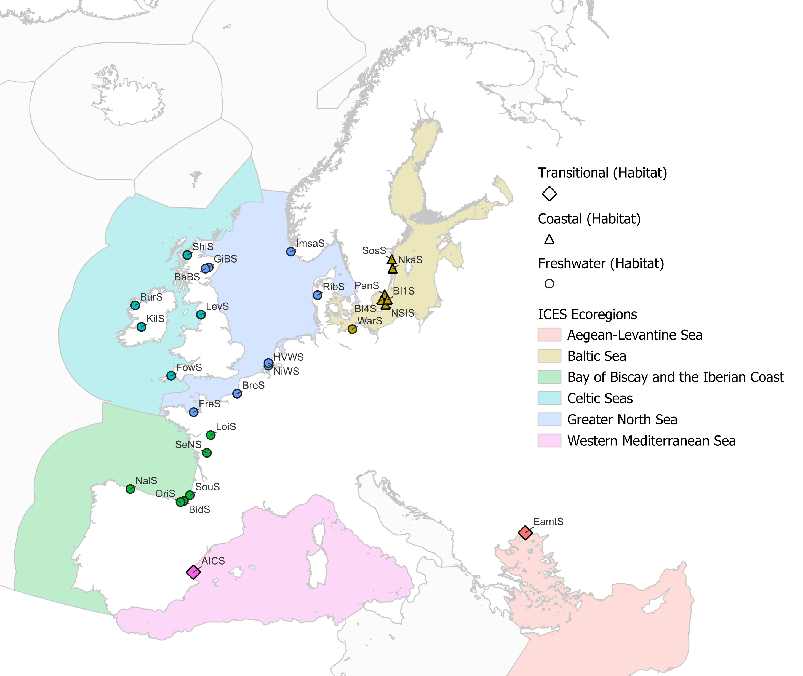

```{r setup-dataselection}
#| include=FALSE
source("../../utilities/get_background_map.R")
source("../../utilities/plot_map_series.R")

load_library("RPostgres")
load_library("dplyr")
load_library("tidyr")
load_library("readxl")
load_library("yaml")
load_library("flextable")
load_library("ggplot2")
load_library("ggpubr")
load_library("scales")
load_library("rnaturalearth")
load_library("sf")
load_library("ggmap")
load_library("ggrepel")
load_library("grid")
load_library("gridExtra")

cred <- read_yaml("../../../credentials.yml")
con_wgeel <- dbConnect(
    Postgres(),
    dbname = cred$dbname,
    host = cred$host,
    port = cred$port,
    user = cred$user,
    password = cred$password
)

current_year <- as.integer(format(Sys.Date(), "%Y"))
```

```{r data-loading}
#| include=FALSE
query <- "
    SELECT 
		das_id,
		das_value,
		das_effort,
		das_year,
		das_comment,
		ser_id,            
		cou_order,
		ser_nameshort,
		ser_area_division,
		ser_qal_id,
        ser_hty_code,
        ser_emu_nameshort,
        ser_uni_code,
        ser_cou_code,
        ser_comment,
        sam_samplingtype,
        ser_sam_id, ser_distanceseakm, ser_method, ser_sam_gear, ser_restocking,
		das_qal_id,
		das_last_update,
		f_subarea,
		lfs_code,          
		lfs_name
	FROM datawg.t_dataseries_das 
    JOIN datawg.t_series_ser ON das_ser_id=ser_id
    LEFT JOIN ref.tr_samplingtype_sam ON ser_sam_id=sam_id
    LEFT JOIN ref.tr_lifestage_lfs ON ser_lfs_code=lfs_code
    LEFT JOIN ref.tr_faoareas ON ser_area_division=f_division
    LEFT JOIN ref.tr_country_cou ON cou_code=ser_cou_code
    WHERE
        ser_typ_id in (2,3) and das_value is not null and 
        (ser_qal_id IS NULL OR ser_qal_id IN (0,1,2,4)) and
        (das_qal_id IS NULL OR das_qal_id IN (1,2,4))
"

# Get yellow and silver eel time series from WGEEL database
mydata <- dbGetQuery(con_wgeel, query)

##############################
### MAP DATA

silver_dataall <- mydata %>%
  filter(lfs_code == "S")

silver_map <- st_as_sf(
    st_read(
        con_wgeel,
        query = paste("
            select ser_id,ser_x,ser_y,geom,ser_nameshort
            from datawg.t_series_ser
            where ser_id in (",
                paste(unique(silver_dataall$ser_id), collapse = ","),
                ")", sep = ""
        )
    )
)
silver_map$Updated <- silver_map$ser_id %in%
    unique(
        mydata %>%
        filter(das_year >= current_year - 3) %>%
        select(ser_id) %>%
        pull()
    )

##########################
### add rank based on country
mydata <- mydata %>%
    group_by(ser_cou_code) %>%
    mutate(
        ser_rank =
            replace_na(cou_order, 0) * 1000 +
            dense_rank(ser_nameshort)
    ) %>%
  ungroup()

#Load data on ecoregion of dataseries
d.ecoregion <- read.csv2("data/points_with_ecoregions_forRob.csv") %>%
    rename(ecoregion = new_Ecoreg)

####################
### Get data in right format
data <- mydata %>%
    #Filter data down to silver eel timeseries
    filter(lfs_code == "S") %>%
    # Sort data for better overview
    arrange(ser_rank, ser_nameshort, das_year) %>%
    # Add ecoregion info
    left_join(
        d.ecoregion %>%
            select(ser_id, ecoregion, distance_to_ecoregion)
    )


####################
### Assign type of effort data available and any relevant notes
d.effort <- data %>%
    select(ser_nameshort) %>%
    unique() %>%
    mutate(
        effort = case_when(
            ser_nameshort %in% c("BreS",  "KilS", "DaugS",  "LilS") ~ "provided",
            ser_nameshort %in% c("BI1S",  "BI4S", "BRWS",  "DoijS", "HVWS",  "IjsS", "KotkS", "LoiS", "MinS",  "MonS",  "NiWS", "NkaS",  "NZKS", "OriS",  "PanS",  "PobeS", "PogoS", "PolsS", "SosS", "StrS", "TibeS", "ZMaS", "NSIS" ) ~ "index",
            ser_nameshort %in% c("BaBS",  "BidS",  "BurS",  "EamtS", "FowS", "FreS", "GiBS",  "ImsaS", "KavlS", "LevS",  "NalS",  "NorwS", "SeNS",  "ShiS",  "VaakS",  "WepeS", "AlCS") ~ "constant",
            ser_nameshort %in% c("RibS", "SouS", "VilS", "WarS") ~ "model estimate",
            ser_nameshort %in% c("AlauS",  "CurlS", "KertS", "KreS",  "LakS",  "RieS",  "RubS",  "SiesS", "ZeiS" ) ~ "unknown"
        ), notes = case_when(
            ser_nameshort %in% c("AlauS",  "CurlS",  "KertS",  "KreS", "LakS",  "RieS",  "RubS",  "SiesS",  "ZeiS") ~ "Next year double check for available effort data on all similar Lithuanian series, and check if only silver eel are reported",
            ser_nameshort %in% c("AlCS") ~ "Commercial catches, but assumed that representative of abundance.",
            ser_nameshort %in% c("NorwS",  "WepeS") ~ "Recent years reported as 0, but actually no information available"
        )
    )

if (any(is.na(d.effort$effort))) {
    stop(
        "qualitative effort information from the following series is missing: ",
        paste(d.effort$ser_nameshort[which(is.na(d.effort$effort))], collapse = ", "),
        ". Manually insert this into the d.effort dataframe before proceeding."
    )
}

### Filter data down to relevant silver eel series

# Filter data according to time series length, and the availability of effort data
# If no data on effort is known, then the series cannot be used to analyse trends in abundance/CPUE.

# Sometimes, no effort data is given because all silver eel passing through a river are sampled. This data is kept here,
# perhaps advise in next year's data call to set such effort equal to 1 in the das_effort column

min.length <- 10 #minimum time series length, delete series with fewer number of years

#Overview table to be used in the subgroup text to show which series were kept and which were discarded
t.filterchoice <- data %>%
    # filter data down to series name and method, while counting time series length
    count(ser_rank, ser_cou_code, ser_nameshort, ser_method) %>%
    # Add information on effort type/availability
    left_join(
        d.effort %>%
        select(ser_nameshort, effort, notes)
    ) %>%
    mutate(
        filtered = case_when(
            # Set a variable specifying if the column should be filtered out based on time series length
            n < min.length ~ "Dropped",
            # Drop series with unknown effort
            effort == "unknown" ~ "Dropped",
            #These two series have had trouble reporting in recent years, data for those years not reliable, drop until issue is resolved.
            ser_nameshort %in% c("NorwS", "WepeS") ~ "Dropped",
            TRUE ~ "Kept"
        ),
        reason.dropped = case_when(
            n < min.length ~ paste("Number of years fewer than",min.length, sep = " "), 
            effort == "unknown" ~ "No effort given",
            ser_nameshort %in% c("NorwS", "WepeS") ~ "Inconsistencies in data",
            TRUE ~ ""
        )
    )


### NOTE: LevS reports no effort (assumed constant effort), but lists multiple years with deviations in sampling times, and thus different effort. Choose what to do with those.

# Apply the filter to the data, calculate CPUE, process data to output format
d.cpue <- data %>%
    #add filter choice
    left_join(
        t.filterchoice %>% select(ser_nameshort, effort, filtered)
    ) %>%
    #filter out selected series
    filter(filtered != "Dropped") %>%
    # Calculate CPUE based on data type
    # Calculate cpue if effort data is given, otherwise assume that das_value is already CPUE
    mutate(cpue = case_when(
        effort == "index" ~ das_value,
        effort == "model estimate" ~ das_value,
        effort == "constant" ~ das_value,
        effort == "provided" ~ das_value/das_effort
    )
    ) %>%
    select(das_id, das_year, cpue, das_value, das_effort, ser_id, ser_nameshort, ser_hty_code, ser_emu_nameshort, ser_cou_code, ser_distanceseakm, ser_restocking, ecoregion, distance_to_ecoregion, das_qal_id, ser_qal_id, ser_rank)

##################
###Create dataframe with summary data for summary tables/figures
d.series <- data %>%
    select(
        ser_nameshort,
        ser_cou_code,
        ser_qal_id,
        ser_hty_code,
        sam_samplingtype,
        ser_sam_gear,
        ser_restocking,
        ecoregion
    ) %>%
    unique() %>%
    mutate(
        #turn integer variables to characters for proper plot axes
        ser_sam_gear = as.character(ser_sam_gear),
        ser_qal_id = as.character(ser_qal_id),
        # Convert sampling type to a number to conserve axis label space
        sam_samplingtype = case_match(
            sam_samplingtype,
            "commercial catch" ~ "1",
            "commercial CPUE" ~ "2",
            "scientific estimate" ~ "3",
            "trapping all" ~ "4",
            "trapping partial" ~ "5"
        ),
        # Convert ecoregion to a number to conserve axis label space
        ecoregion = case_match(
            ecoregion,
           "Western Mediterranean Sea" ~ "WM",
           "Baltic Sea" ~ "BS",
           "Greater North Sea" ~ "NS",
           "Bay of Biscay and the Iberian Coast" ~ "IB",
           "Celtic Seas" ~ "CS",
           "Aegean-Levantine Sea" ~ "AL",
           "Ionian Sea and the Central Mediterranean Sea" ~ "CM",
           "Adriatic Sea" ~ "AS"
        )
    ) %>%
    #Add info on whether or not the series was dropped or kept
    left_join(
        t.filterchoice %>%
        select(ser_nameshort, filtered)
    )

#disconnect from WGEEL database
dbDisconnect(con_wgeel)
```

### Data selection

In the 2023 data call, `r length(unique(data$ser_nameshort))` silver eel time series were available, located in `r length(unique(data$ser_cou_code[!is.na(data$ser_cou_code)]))` countries (Figure \@ref(fig:mapsilverall)). The majority of these series are from Lithuania (`r length(unique(data$ser_nameshort[data$ser_cou_code == "LT" & !is.na(data$ser_cou_code)]))` series), Netherlands (`r length(unique(data$ser_nameshort[data$ser_cou_code == "NL" & !is.na(data$ser_cou_code)]))` series), United Kingdom (`r length(unique(data$ser_nameshort[data$ser_cou_code == "GB" & !is.na(data$ser_cou_code)]))` series) and France (`r length(unique(data$ser_nameshort[data$ser_cou_code == "FR" & !is.na(data$ser_cou_code)]))` series). Four time series (BI1S, BI4S, NSIS, PanS) are international trawling surveys. Data on these silver eel time series have been added to the WGEEL database in the past, but as these international series have no dedicated reporting country, their data have not been updated by any country in the database since 2011.

```{r mapsilverall}
#| echo = FALSE,
#| message = FALSE,
#| warning = FALSE,
#| fig.cap = "Map of available silver eel time series. Updated time series correspond to time series for which at least one value was provided for the three last years.",
#| fig.height = 14 / 2.54

map_series(
    silver_map,
    scale_caption = "Updated within the last 3 years"
)

#knitr::include_graphics("images/silver.png")
```


```{r table-summary, echo = FALSE, tab.cap = paste("Summary of data availability in the silver eel time series, showing availability of series with at least", min.length,  "years of data; and the number of series that do or do not have available information on series quality ID, habitat type, sampling type, effort, gear type, restocking influence, and distance to sea.", sep = " ")}
d.tablesummary = data %>% 
  select(ser_nameshort, 
         ser_qal_id,
         ser_hty_code,
         sam_samplingtype,
         ser_sam_gear,
         ser_restocking,
         ser_distanceseakm) %>%
  unique()

d.effort.available = data %>% 
  group_by(ser_nameshort) %>% 
  summarise(effort = any(!is.na(das_effort))) %>%
  ungroup()

t.summary = data.frame(category = character(),
                       availabledata = numeric(),
                       missingdata = numeric()) %>%
  add_row(category = paste("Nb of series >=", min.length, " years", sep = ""),
         availabledata = nrow(t.filterchoice %>% filter(n >= min.length)),
         missingdata = nrow(t.filterchoice %>% filter(n < min.length))) %>%
  add_row(category = "Nb of series with quality id",
         availabledata = nrow(d.tablesummary %>% filter(!is.na(ser_qal_id))),
         missingdata = nrow(d.tablesummary %>% filter(is.na(ser_qal_id)))) %>%
  add_row(category = "Nb of series with habitat data",
         availabledata = nrow(d.tablesummary %>% filter(!is.na(ser_hty_code))),
         missingdata = nrow(d.tablesummary %>% filter(is.na(ser_hty_code)))) %>%
  add_row(category = "Nb of series with sampling type",
         availabledata = nrow(d.tablesummary %>% filter(!is.na(sam_samplingtype))),
         missingdata = nrow(d.tablesummary %>% filter(is.na(sam_samplingtype)))) %>%
  add_row(category = "Nb of series with effort data",
         availabledata = sum(d.effort.available$effort),
         missingdata = sum(!d.effort.available$effort)) %>%
  add_row(category = "Nb of series with gear",
         availabledata = nrow(d.tablesummary %>% filter(!is.na(ser_sam_gear))),
         missingdata = nrow(d.tablesummary %>% filter(is.na(ser_sam_gear)))) %>%
  add_row(category = "Nb of series with restocking data",
         availabledata = nrow(d.tablesummary %>% filter(!is.na(ser_restocking))),
         missingdata = nrow(d.tablesummary %>% filter(is.na(ser_restocking)))) %>%
  add_row(category = "Nb of series with distance to sea",
         availabledata = nrow(d.tablesummary %>% filter(!is.na(ser_distanceseakm))),
         missingdata = nrow(d.tablesummary %>% filter(is.na(ser_distanceseakm)))) %>%
  rename("Category" = category,
         "Available data" = availabledata,
         "Missing data" = missingdata)

flextable(t.summary)

```

```{r figure-seriessummary, echo = FALSE, fig.cap = "Summary of available silver eel time series per country, including whether they were kept or dropped for the trend analysis. Habitat: C = coastal water, F = freshwater, MO = marine water (open sea), T = transitional water (according to WFD); gear: 226 = fyke nets, 227 =stow nets, 228 = barriers, fences, weirs, etc., 230 = traps, 234 = longlines, 242 = electric fishing, 245 = gear unknown; sampling type: 1 = commercial catch, 2 = commercial CPUE, 3 = scientific estimate, 4 = trapping all, 5 = trapping partial gear; quality id: 0 = series has ended and no future data will become available, 1 = good quality data; stocking: FALSE = no impacts of stocking, TRUE = impacts of stocking; and ecoregion: WM = Western Mediterranean Sea, BS = Baltic Sea, NS = Greater North Sea, IB = Bay of Biscay and the Iberian Coast, CS = Celtic Seas, AL = Aegean-Levantine Sea, CM = Ionian Sea and the Central Mediterranean Sea, AS = Adriatic Sea. For all, NA means not available (no information provided).", fig.height=8}


#Create a standard function to make bar plots for the various variables to be summarized
f.barplot = function(seriesdata, x.value, x.title, x.label.rotate = 0, legend_position = "none"){
  ggplot(data = seriesdata) +
  geom_bar(aes(x=x.value, fill = filtered)) +
  scale_x_discrete(name = x.title) +
  scale_y_continuous(expand = expansion(mult = c(0,0.1)),
                     breaks = pretty_breaks()) +
  theme_bw() + 
  theme(panel.grid.major = element_blank(),
        panel.grid.minor = element_blank(),
        axis.text.x = element_text(angle = x.label.rotate),
        axis.title.y = element_blank(),
        legend.position=legend_position,
        legend.title=element_blank())
}

#Create individual bar plots
p.country = f.barplot(seriesdata = d.series, 
                      x.value = d.series$ser_cou_code, 
                      x.title =  "Country", 
                      x.label.rotate = 90, 
                      legend_position = "none")

p.habitat = f.barplot(seriesdata = d.series, 
                      x.value = d.series$ser_hty_code, 
                      x.title =  "Habitat type", 
                      x.label.rotate = 0, 
                      legend_position = c(0.8,0.8))

p.gear = f.barplot(seriesdata = d.series, 
                      x.value = d.series$ser_sam_gear, 
                      x.title =  "Gear type", 
                      x.label.rotate = 0, 
                      legend_position = "none")

p.sampling = f.barplot(seriesdata = d.series, 
                      x.value = d.series$sam_samplingtype, 
                      x.title =  "Sampling type", 
                      x.label.rotate = 0, 
                      legend_position = "none")

p.quality = f.barplot(seriesdata = d.series, 
                      x.value = d.series$ser_qal_id, 
                      x.title =  "Quality ID", 
                      x.label.rotate = 0, 
                      legend_position = "none")

p.stocking = f.barplot(seriesdata = d.series, 
                      x.value = d.series$ser_restocking, 
                      x.title =  "Stocking", 
                      x.label.rotate = 0, 
                      legend_position = "none")

p.ecoregion = f.barplot(seriesdata = d.series, 
                      x.value = d.series$ecoregion, 
                      x.title =  "Ecoregion", 
                      x.label.rotate = 0, 
                      legend_position = "none")

#Put all bar plots in a single figure
p.summary = ggarrange(p.country, p.habitat, p.gear, p.sampling, p.quality, p.stocking, p.ecoregion,
          ncol = 2, nrow = 4)
p.summary = annotate_figure(p.summary,
                left = text_grob("Number of available series", color = "black", rot = 90),
                )
p.summary


```

A summary of the type of data available in the silver eel time series is given in Table \@ref(tab:table-summary) and Figure \@ref(fig:figure-seriessummary), and a detailed summary of all the series is presented in **Annex x.x**. From all available silver eel time series, `r nrow(t.filterchoice[t.filterchoice$n >= min.length,])` series have `r min.length` or more years of available data. Only `r sum(d.effort.available$effort)` of the `r length(unique(data$ser_nameshort))` series have effort data submitted. Most silver eel series were collected in freshwaters via traps and fyke nets. In terms of sampling type, `r nrow(d.tablesummary[d.tablesummary$sam_samplingtype == "commercial catch",])` series were from commercial catches, `r nrow(d.tablesummary[d.tablesummary$sam_samplingtype == "commercial CPUE",])` series were reported as commercial CPUE, `r nrow(d.tablesummary[d.tablesummary$sam_samplingtype == "trapping all",])` were assigned as full trapping series, `r nrow(d.tablesummary[d.tablesummary$sam_samplingtype == "trapping partial",])` as partial trapping series, and `r nrow(d.tablesummary[d.tablesummary$sam_samplingtype == "scientific estimate",])` were classified as scientific estimate, with `r nrow(d.tablesummary[is.na(d.tablesummary$sam_samplingtype),])` series missing this information. When it comes to the series quality ID, `r nrow(d.tablesummary[d.tablesummary$ser_qal_id == 1,])` series had a quality ID of 1, indicating good quality, `r nrow(d.tablesummary[d.tablesummary$ser_qal_id == 0,])` had a quality ID of 0, indicating that it had been previously decided that the series should not be used in an analysis (usually because there were not enough years of data), and `r nrow(d.tablesummary[is.na(d.tablesummary$ser_qal_id),])` series were missing a series quality ID. For the next WGEEL meeting, these series quality IDs should be reconsidered, given the large amount of series without a series quality ID, and the fact that some series with a quality ID of 0 now have at least 10 years of data. Almost all series had information on the potential impacts of restocking, with `r sum(d.tablesummary$ser_restocking, na.rm = T)` series classified as being influenced by restocking and `r sum(!d.tablesummary$ser_restocking, na.rm = T)` as not being influenced by restocking. 

The decision was made to perform the trend analysis with only those silver eel time series that had at least `r min.length` years of data available. After examining the `r length(unique(data$ser_nameshort))` available silver eel time series, only `r length(unique(d.cpue$ser_nameshort))` were kept for the trend analysis (Table \@ref(tab:table-kept)). From the `r nrow(t.filterchoice[t.filterchoice$filtered == "Dropped",])` time series that were excluded, `r nrow(t.filterchoice[t.filterchoice$reason.dropped == "Inconsistencies in data",])` showed inconsistencies in data and `r nrow(t.filterchoice[t.filterchoice$n < min.length,])` were excluded because they did not have `r min.length` consecutive years of effort data (Table \@ref(tab:table-dropped)).

The `r length(unique(d.cpue$ser_nameshort))` silver eel time series which were used in the analysis represented six ICES ecoregions (Figure \@ref(fig:mapsilverkept)). The Western Mediterranean Sea and Aegean-Levantine Sea only had one time series. The most represented areas were the Greater North Sea with 8 time series and the Baltic Sea with 7 time series. 11 ecoregions (Adriatic Sea, Arctic Ocean, Azores, Barents Sea, Black Sea, Faroes, Greenland Sea, Icelandic Waters, Ionian Sea and the Central Mediterranean Sea, Norwegian Sea, Oceanic Northeast Atlantic) did not have silver eel time series which were used in the trend analysis. All coastal time series used in the analysis are located in the Baltic Sea ecoregion. Freshwater series are located across 4 different ecoregions (Baltic Sea, Bay of Biscay and the Iberian Coast, Celtic Seas, Greater North Sea) and the transitional series are located in 2 ecoregions (Aegean-Levantine Sea, Western Mediterranean Sea). 


```{r table-kept, echo = FALSE, tab.cap = "Available silver eel time series that were kept for the analysis. Listed is also whether the silver eel time series data was first divided by provided effort data, before it was used in the analysis. A reason for dividing by effort is that the data in the series is effort-dependent. Reasons for not first dividing by effort data include for instance the provided data already being a CPUE index, or effort being constant (e.g. whole year full-river coverage)."}
t.kept <- t.filterchoice %>%
  filter(filtered == "Kept") %>%
  mutate(
  notes = ifelse(is.na(notes), "", notes), #change NAs to blanks in notes
  effort.div = case_when( # New variable that reflects whether or not the reported value was divided by effort value
    effort == "index" ~ "No",
    effort == "model estimate" ~ "No",
    effort == "constant" ~ "No",
    effort == "provided" ~ "Yes"
  ),
  effort = case_when( # Rephrase type of effort available for series
    ser_nameshort == "AlCS" ~ "Effort-dependent",
    effort == "index" ~ "Index",
    effort == "model estimate" ~ "Model estimate",
    effort == "constant" ~ "Constant effort",
    effort == "provided" ~ "Effort-dependent")
  ) %>%
    select(ser_cou_code, ser_nameshort, n, effort,effort.div, notes) %>% # drop method description
    rename("Country" = ser_cou_code, #rename table headers
         "Series name" = ser_nameshort, 
         "Years (n)" = n,
         "Series type" = effort,
         "Divided by effort data" = effort.div,
         "Comments" = notes)

flextable(t.kept)
```

```{r table-dropped, echo = FALSE, tab.cap = "Available silver eel time series that were dropped from the analysis, including the reason for being dropped."}
t.dropped <- t.filterchoice %>%
  filter(filtered == "Dropped") %>%
  select(ser_cou_code, ser_nameshort, n, reason.dropped, notes) %>% # drop method description
  mutate(notes = ifelse(is.na(notes), "", notes)) %>% #change NAs to blanks in notes
  rename("Country" = ser_cou_code, #rename table headers
         "Series name" = ser_nameshort, 
         "Years (n)" = n,
         "Drop reason" = reason.dropped,
         "Comments" = notes)


flextable(t.dropped)
```

```{r mapsilverkept, echo=FALSE, fig.cap="Map of silver eel time series used in the trend analysis, shown by ICES ecoregion and habitat.", out.width = '100%'}

```

Figure \@ref(fig:figure-series) gives an overview of the reported data for each silver eel time series that were kept for the trend analysis. Among the kept series, the number of available data points was highest between 2010 and 2021, with the peak in 2013-2017 (Figure \@ref(fig:figure-nseries)). The majority of the kept time series did not have 2023 data ready at the time of writing this report. Given the scarcity of data before 1980, analyses were down excluded data before that date.


```{r figure-series, echo = FALSE, fig.cap = "Silver eel time series that were used in the trend analysis.", fig.height=length(unique(d.cpue$ser_nameshort))/3*1.5}

ggplot(data = d.cpue, aes(x = das_year, y = cpue)) +
  geom_line() +
  geom_point() +
  scale_x_continuous(name = "Year",
                      breaks = pretty_breaks()) +
  scale_y_continuous(name = "CPUE") +
  facet_wrap(~factor(ser_nameshort, unique(d.cpue$ser_nameshort)), #Convert to factor to preserve rank order
             scales = "free", ncol = 3) +
  theme_bw() + 
  theme(axis.text.x = element_text(angle = 45, vjust = 0.5))
```

```{r figure-nseries, echo = FALSE, fig.cap = "Number of available datapoints from silver eel time series over time, shown only for those time series that were used in the trend analysis."}

ggplot(data = d.cpue %>% count(das_year), aes(x = das_year, y = n)) +
  scale_x_continuous(name = "Year") +
  scale_y_continuous(name = "Number of available data") +
  geom_line() +
  geom_point() +
  theme_bw()
```

